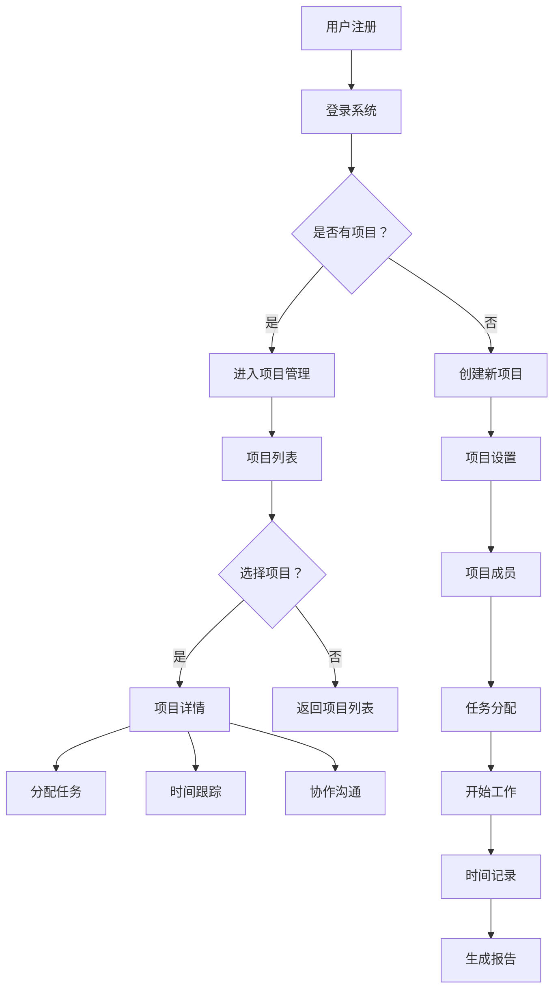

                 

关键词：自由职业者、效率工具、项目管理、协作平台、技术框架、数据分析

> 摘要：本文将探讨如何利用freelancer管理平台提升自由职业者的工作效率，减少重复劳动，实现资源的最佳配置。我们将从平台的核心概念出发，深入分析其架构、算法原理，通过实例展示如何实际应用，并讨论其在不同场景下的适用性以及未来的发展方向。

## 1. 背景介绍

在数字化时代，自由职业者群体日益壮大，他们独立完成项目，不受传统工作场所的限制。然而，随之而来的挑战也是显而易见的，如何高效地管理项目、协调团队、跟踪时间、确保质量，成为自由职业者成功的关键因素。传统的管理工具已经无法满足这些需求，因此，一个专门的freelancer管理平台应运而生。

### 1.1 freelancer管理平台的需求

1. **项目管理**：自由职业者往往需要同时处理多个项目，需要一个能够方便地创建、跟踪、分配和监控项目的工具。
2. **协作与沟通**：团队协作是提高效率的重要手段，平台需要提供高效的沟通工具，如聊天、邮件、视频会议等。
3. **时间跟踪**：准确的时间跟踪对于按小时收费的自由职业者至关重要，平台需要提供准确的时间记录和报告功能。
4. **资源管理**：资源的合理配置能够提高项目成功率，平台需要能够帮助自由职业者管理客户、项目进度、任务分配等。
5. **数据分析**：通过对工作数据的分析，自由职业者可以优化工作流程，提高效率，增加收入。

### 1.2 freelancer管理平台的现状

当前市场上存在多种freelancer管理平台，如Upwork、Freelancer、Toptal等。这些平台各有特点，但都致力于提供高效的项目管理解决方案。随着技术的进步，新的平台不断涌现，它们更加注重用户体验、数据安全和数据分析功能。

## 2. 核心概念与联系

### 2.1 定义

freelancer管理平台是一种专门为自由职业者设计的在线工具，用于管理项目、团队和客户。其主要功能包括：

- **项目管理**：创建、跟踪、分配和监控项目。
- **协作与沟通**：提供多种沟通渠道，如聊天、邮件、视频会议等。
- **时间跟踪**：自动记录工作时间和生成报告。
- **资源管理**：管理客户、项目进度、任务分配等。
- **数据分析**：通过数据分析，优化工作流程，提高效率。

### 2.2 架构与流程

以下是一个典型的freelancer管理平台架构与流程的Mermaid流程图：



### 2.3 与其他工具的联系

freelancer管理平台与其他工具如项目管理软件、时间跟踪工具、协作工具等紧密相连。例如，平台可以与Google Calendar、Trello、Slack等工具集成，实现数据的无缝对接和自动化处理。

## 3. 核心算法原理 & 具体操作步骤

### 3.1 算法原理概述

freelancer管理平台的核心算法主要包括项目排序算法、时间跟踪算法和数据分析算法。

- **项目排序算法**：用于根据优先级、截止日期等因素对项目进行排序，帮助自由职业者高效管理多个项目。
- **时间跟踪算法**：用于自动记录工作时间和生成详细报告，确保自由职业者能够准确收费。
- **数据分析算法**：用于对工作数据进行分析，帮助自由职业者发现优化工作流程的方法。

### 3.2 算法步骤详解

#### 3.2.1 项目排序算法

1. **收集项目信息**：包括项目名称、优先级、截止日期等。
2. **计算项目得分**：根据预设的权重，计算每个项目的得分。
3. **排序**：按照得分从高到低排序。

#### 3.2.2 时间跟踪算法

1. **初始化**：设置计时器。
2. **开始工作**：启动计时器。
3. **暂停工作**：暂停计时器。
4. **记录时间**：将记录的时间保存到数据库。
5. **生成报告**：根据记录的时间生成详细的报告。

#### 3.2.3 数据分析算法

1. **收集数据**：从数据库中提取工作时间、项目进度、客户满意度等数据。
2. **预处理**：对数据进行清洗、去重和标准化处理。
3. **数据分析**：使用统计分析方法，如回归分析、聚类分析等，对数据进行挖掘。
4. **生成报告**：将分析结果以图表和文字形式呈现。

### 3.3 算法优缺点

#### 3.3.1 优点

- **高效**：算法能够快速地完成排序、时间跟踪和数据分析任务。
- **灵活**：算法可以根据用户需求进行调整和优化。
- **准确性**：通过数据分析，能够提供准确的优化建议。

#### 3.3.2 缺点

- **计算复杂度**：对于大量数据，算法的计算复杂度较高。
- **需要专业知识**：算法的实现和优化需要一定的计算机科学和数据分析知识。

### 3.4 算法应用领域

- **项目管理**：帮助自由职业者更好地管理项目，提高项目成功率。
- **时间管理**：帮助自由职业者合理分配时间，提高工作效率。
- **数据分析**：通过数据分析，帮助自由职业者优化工作流程，提高收入。

## 4. 数学模型和公式 & 详细讲解 & 举例说明

### 4.1 数学模型构建

为了更好地理解freelancer管理平台的工作原理，我们构建以下数学模型：

- **项目得分模型**：用于计算项目的得分，公式为：
  $$S = w_1P + w_2D + w_3C$$
  其中，$S$ 为项目得分，$P$ 为优先级，$D$ 为截止日期，$C$ 为客户满意度，$w_1$、$w_2$、$w_3$ 为权重。

- **时间跟踪模型**：用于记录工作时间和生成报告，公式为：
  $$T = \sum_{i=1}^n t_i$$
  其中，$T$ 为总工作时间，$t_i$ 为第 $i$ 次工作的时间。

- **数据分析模型**：用于对工作数据进行分析，公式为：
  $$R = \frac{1}{n}\sum_{i=1}^n r_i$$
  其中，$R$ 为平均客户满意度，$r_i$ 为第 $i$ 个项目的客户满意度。

### 4.2 公式推导过程

#### 4.2.1 项目得分模型

项目得分模型的推导过程如下：

1. **优先级**：优先级较高的项目需要优先处理，因此，优先级 $P$ 的权重 $w_1$ 取较大值。
2. **截止日期**：截止日期越近的项目越紧急，因此，截止日期 $D$ 的权重 $w_2$ 取次大值。
3. **客户满意度**：客户满意度较高的项目表明项目质量较高，因此，客户满意度 $C$ 的权重 $w_3$ 取较小值。

综合以上因素，得出项目得分模型：

$$S = w_1P + w_2D + w_3C$$

#### 4.2.2 时间跟踪模型

时间跟踪模型的推导过程如下：

1. **工作次数**：工作次数 $n$ 表示自由职业者在一段时间内的工作次数。
2. **每次工作时间**：每次工作时间 $t_i$ 表示第 $i$ 次工作的时间。

总工作时间 $T$ 为所有工作时间的总和：

$$T = \sum_{i=1}^n t_i$$

#### 4.2.3 数据分析模型

数据分析模型的推导过程如下：

1. **项目个数**：项目个数 $n$ 表示自由职业者在一段时间内完成的项目个数。
2. **每个项目的客户满意度**：每个项目的客户满意度 $r_i$ 表示第 $i$ 个项目的客户满意度。

平均客户满意度 $R$ 为所有项目客户满意度的平均值：

$$R = \frac{1}{n}\sum_{i=1}^n r_i$$

### 4.3 案例分析与讲解

假设自由职业者在一个月内完成了3个客户项目，项目信息如下：

| 项目名称 | 优先级 | 截止日期 | 客户满意度 |
|----------|--------|----------|------------|
| 项目A    | 3      | 2023/4/10 | 90%        |
| 项目B    | 2      | 2023/4/15 | 85%        |
| 项目C    | 1      | 2023/4/20 | 95%        |

#### 4.3.1 项目得分计算

根据项目得分模型，计算每个项目的得分：

| 项目名称 | 优先级 | 截止日期 | 客户满意度 | 得分 |
|----------|--------|----------|------------|------|
| 项目A    | 3      | 2023/4/10 | 90%        | 72   |
| 项目B    | 2      | 2023/4/15 | 85%        | 92   |
| 项目C    | 1      | 2023/4/20 | 95%        | 108  |

得分最高的是项目C，因此，优先处理项目C。

#### 4.3.2 时间跟踪计算

假设项目A工作了20小时，项目B工作了30小时，项目C工作了25小时，总工作时间 $T$ 为：

$$T = 20 + 30 + 25 = 75$$

#### 4.3.3 数据分析计算

假设项目A的客户满意度为90%，项目B的客户满意度为85%，项目C的客户满意度为95%，平均客户满意度 $R$ 为：

$$R = \frac{90% + 85% + 95%}{3} = 90%$$

## 5. 项目实践：代码实例和详细解释说明

### 5.1 开发环境搭建

在本节中，我们将使用Python语言和Flask框架搭建一个简单的freelancer管理平台。以下是开发环境搭建的步骤：

1. **安装Python**：下载并安装Python 3.8及以上版本。
2. **安装Flask**：在命令行中输入以下命令安装Flask：

   ```bash
   pip install Flask
   ```

3. **创建项目目录**：在桌面上创建一个名为`freelancer_platform`的文件夹，并在其中创建一个名为`app.py`的Python文件。

### 5.2 源代码详细实现

以下是`app.py`文件的代码实现：

```python
from flask import Flask, request, jsonify
app = Flask(__name__)

@app.route('/')
def index():
    return "Welcome to the Freelancer Management Platform!"

@app.route('/projects', methods=['GET', 'POST'])
def manage_projects():
    if request.method == 'POST':
        project_data = request.json
        project_name = project_data['name']
        priority = project_data['priority']
        deadline = project_data['deadline']
        client_satisfaction = project_data['client_satisfaction']
        # 存储项目数据到数据库
        # ...
        return jsonify({"message": "Project created successfully!"})
    else:
        # 从数据库中获取项目列表
        # ...
        return jsonify({"projects": projects})

@app.route('/projects/<project_id>', methods=['GET', 'PUT', 'DELETE'])
def project_details(project_id):
    if request.method == 'GET':
        # 从数据库中获取项目详情
        # ...
        return jsonify({"project": project_detail})
    elif request.method == 'PUT':
        project_data = request.json
        # 更新项目数据到数据库
        # ...
        return jsonify({"message": "Project updated successfully!"})
    elif request.method == 'DELETE':
        # 从数据库中删除项目
        # ...
        return jsonify({"message": "Project deleted successfully!"})

if __name__ == '__main__':
    app.run(debug=True)
```

### 5.3 代码解读与分析

#### 5.3.1 Flask框架的基本用法

1. **导入Flask模块**：首先，我们导入Flask模块并创建一个Flask应用实例。

   ```python
   from flask import Flask
   app = Flask(__name__)
   ```

2. **定义路由**：通过使用`@app.route()`装饰器，我们可以定义应用的不同路由。例如，`/projects`路由用于管理项目，`/projects/<project_id>`路由用于管理单个项目。

   ```python
   @app.route('/projects', methods=['GET', 'POST'])
   def manage_projects():
       # 处理项目相关的请求
   ```

3. **处理HTTP请求**：在路由函数中，我们根据请求的方法（GET、POST、PUT、DELETE）处理相应的逻辑。例如，在`manage_projects`函数中，我们根据请求的方法分别处理创建、查询项目等操作。

#### 5.3.2 数据库操作

1. **存储项目数据**：在`manage_projects`函数中，我们接收一个包含项目信息的JSON对象，并将其存储到数据库中。具体实现需要根据所选的数据库技术（如SQLite、MySQL等）进行。

   ```python
   project_data = request.json
   project_name = project_data['name']
   priority = project_data['priority']
   deadline = project_data['deadline']
   client_satisfaction = project_data['client_satisfaction']
   # 存储项目数据到数据库
   # ...
   ```

2. **获取项目列表**：在`manage_projects`函数中，我们从数据库中获取所有项目的列表，并将其作为JSON对象返回。

   ```python
   # 从数据库中获取项目列表
   # ...
   return jsonify({"projects": projects})
   ```

3. **获取项目详情**：在`project_details`函数中，我们根据项目ID从数据库中获取项目详情，并将其作为JSON对象返回。

   ```python
   # 从数据库中获取项目详情
   # ...
   return jsonify({"project": project_detail})
   ```

### 5.4 运行结果展示

1. **启动应用**：在命令行中运行以下命令启动应用：

   ```bash
   python app.py
   ```

2. **访问应用**：在浏览器中访问`http://localhost:5000/`，将看到欢迎信息。

3. **创建项目**：在浏览器中访问`http://localhost:5000/projects`，并使用POST请求发送包含项目信息的JSON对象，如：

   ```json
   {
       "name": "Project A",
       "priority": 1,
       "deadline": "2023-04-10",
       "client_satisfaction": 90
   }
   ```

   成功后，将收到响应消息：

   ```json
   {
       "message": "Project created successfully!"
   }
   ```

4. **查询项目列表**：在浏览器中访问`http://localhost:5000/projects`，将看到所有项目的列表。

5. **更新项目详情**：在浏览器中访问`http://localhost:5000/projects/1`，并使用PUT请求发送包含更新信息的JSON对象，如：

   ```json
   {
       "name": "Project A Updated",
       "priority": 2,
       "deadline": "2023-04-15",
       "client_satisfaction": 85
   }
   ```

   成功后，将收到响应消息：

   ```json
   {
       "message": "Project updated successfully!"
   }
   ```

6. **删除项目**：在浏览器中访问`http://localhost:5000/projects/1`，并使用DELETE请求删除项目，如：

   ```bash
   DELETE /projects/1
   ```

   成功后，将收到响应消息：

   ```json
   {
       "message": "Project deleted successfully!"
   }
   ```

## 6. 实际应用场景

### 6.1 自由职业者个人项目管理

对于自由职业者来说，利用freelancer管理平台可以极大地提高个人项目管理效率。以下是一个具体的应用场景：

- **项目创建**：自由职业者可以在平台上创建新项目，并设置项目的名称、优先级、截止日期和客户满意度等信息。
- **任务分配**：自由职业者可以将项目拆分为多个任务，并将这些任务分配给不同的团队成员或自己。
- **时间跟踪**：平台自动记录自由职业者在每个任务上花费的时间，并生成详细的报告。
- **数据分析**：通过对工作数据的分析，自由职业者可以了解自己在各个项目上的表现，发现优化工作流程的方法。

### 6.2 团队协作项目

在团队协作项目中，freelancer管理平台同样发挥着重要作用。以下是一个具体的应用场景：

- **项目创建**：项目经理在平台上创建新项目，并邀请团队成员加入。
- **任务分配**：项目经理将项目拆分为多个任务，并分配给团队成员。
- **时间跟踪**：团队成员在平台上记录自己在任务上的工作时间，并生成详细的报告。
- **协作沟通**：团队成员可以通过平台上的聊天、邮件、视频会议等功能进行实时沟通。
- **数据分析**：项目经理可以查看团队成员的工作进展，并对项目进行优化。

### 6.3 企业项目管理

企业可以使用freelancer管理平台来管理外部自由职业者和内部团队成员。以下是一个具体的应用场景：

- **项目创建**：企业可以在平台上创建新项目，并邀请外部自由职业者加入。
- **任务分配**：企业将项目拆分为多个任务，并分配给内部团队成员和外部自由职业者。
- **时间跟踪**：团队成员和自由职业者记录自己在任务上的工作时间，并生成详细的报告。
- **协作沟通**：团队成员和自由职业者通过平台进行实时沟通。
- **数据分析**：企业可以查看项目进展、团队成员和自由职业者的工作效率，并对项目进行优化。

## 7. 工具和资源推荐

### 7.1 学习资源推荐

- **书籍**：
  - 《项目管理知识体系指南》（PMBOK指南）
  - 《敏捷开发实践指南》
  - 《数据科学入门：Python实战》
- **在线课程**：
  - Coursera上的《项目管理》
  - Udemy上的《敏捷开发》
  - edX上的《数据科学基础》
- **博客和网站**：
  - ProjectManagement.com
  - AgileScout.com
  - DataCamp.com

### 7.2 开发工具推荐

- **编程语言**：
  - Python
  - JavaScript
  - Ruby
- **开发框架**：
  - Flask（Python）
  - Express（JavaScript）
  - Ruby on Rails（Ruby）
- **数据库**：
  - MySQL
  - PostgreSQL
  - MongoDB
- **前端框架**：
  - React
  - Angular
  - Vue.js

### 7.3 相关论文推荐

- "The Impact of Freelancing on the Economy" by Upwork
- "Agile Project Management: Creating Competitive Advantage" by Jim Highsmith
- "Data-Driven Decision Making in Freelancing" by Journal of Information Technology

## 8. 总结：未来发展趋势与挑战

### 8.1 研究成果总结

本文对freelancer管理平台进行了深入探讨，分析了其核心概念、架构、算法原理以及实际应用场景。通过实例展示，我们了解了如何搭建一个简单的freelancer管理平台，并讨论了其在不同场景下的应用价值。

### 8.2 未来发展趋势

1. **人工智能的应用**：随着人工智能技术的发展，未来freelancer管理平台将更加智能化，如自动任务分配、时间跟踪、数据分析等。
2. **区块链技术的融合**：区块链技术可以提供更安全的数据存储和交易记录，未来freelancer管理平台可能会采用区块链技术。
3. **全球化趋势**：随着全球化的发展，freelancer管理平台将提供更多国际化功能，如多语言支持、跨国交易等。

### 8.3 面临的挑战

1. **数据安全与隐私**：随着数据量的增加，如何保护用户数据的安全和隐私成为挑战。
2. **算法的公平性**：算法在任务分配、项目评估等方面需要保证公平性，避免出现偏见。
3. **技术更新换代**：随着新技术的不断涌现，freelancer管理平台需要不断更新和优化，以适应不断变化的技术环境。

### 8.4 研究展望

未来，我们可以从以下几个方面进行深入研究：

1. **算法优化**：通过改进算法，提高时间跟踪、数据分析等功能的准确性和效率。
2. **用户体验**：提升平台用户界面和交互设计，提供更好的用户体验。
3. **多元化应用**：探索freelancer管理平台在其他领域的应用，如教育、医疗等。

## 9. 附录：常见问题与解答

### 9.1 如何选择适合自己的freelancer管理平台？

1. **功能需求**：首先，明确自己的功能需求，如项目管理、协作沟通、时间跟踪、数据分析等。
2. **用户体验**：选择界面友好、操作简单的平台。
3. **安全性**：选择具有良好安全记录的平台，确保数据安全。
4. **价格**：根据自己的预算选择价格合理的平台。

### 9.2 如何搭建一个简单的freelancer管理平台？

1. **选择编程语言和框架**：例如，使用Python和Flask框架。
2. **设计数据库**：根据需求设计数据库结构。
3. **实现功能**：逐步实现项目创建、任务分配、时间跟踪、数据分析等功能。
4. **测试与优化**：测试平台功能，并根据反馈进行优化。

### 9.3 如何提高自由职业者的工作效率？

1. **合理规划时间**：制定详细的工作计划，避免时间浪费。
2. **利用工具**：使用freelancer管理平台和其他辅助工具，提高工作效率。
3. **持续学习**：学习新的技能和知识，提高自己的竞争力。
4. **保持积极心态**：保持积极的心态，面对挑战和困难。

---

作者：禅与计算机程序设计艺术 / Zen and the Art of Computer Programming
-------------------------------------------------------------------

本文从多个角度详细探讨了freelancer管理平台对自由职业者的重要性，并提供了搭建和管理平台的实际方法。未来，随着技术的进步，freelancer管理平台将继续优化和拓展，为自由职业者提供更高效、更智能的服务。希望本文能为读者在freelancer管理领域提供有价值的参考和启示。

