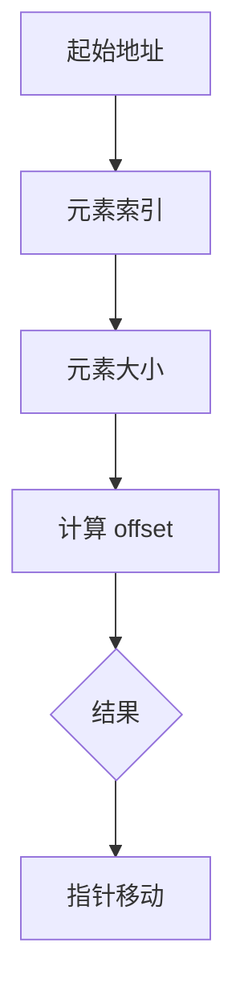

                 

### 1. 背景介绍

在计算机科学和软件工程中，`offset` 是一个核心概念，广泛应用于数据结构、编程语言、系统编程等领域。`offset` 通常指在内存地址空间中，某个特定元素相对于某个参考点的距离或位置。这种概念对于理解编程语言内存模型、优化程序执行效率以及进行系统编程至关重要。

本文将深入探讨 `offset` 的原理，并通过实际的代码实例讲解如何应用 `offset` 进行编程。本文将涵盖以下内容：

1. 核心概念与联系
2. 核心算法原理与具体操作步骤
3. 数学模型和公式
4. 项目实践：代码实例
5. 实际应用场景
6. 工具和资源推荐
7. 总结：未来发展趋势与挑战
8. 附录：常见问题与解答

通过本文的阅读，读者将能够全面理解 `offset` 的概念，掌握其在编程中的应用，并能够利用 `offset` 提高程序的性能和可维护性。

### 2. 核心概念与联系

为了更好地理解 `offset` 的概念，我们首先需要了解几个核心概念：内存地址、数据结构、数组和结构体。这些概念是理解 `offset` 的基础。

#### 内存地址

内存地址是计算机内存中的一个唯一标识符，用于访问内存中的特定数据。在大多数计算机体系结构中，内存地址是由一系列二进制位组成的。每个内存地址对应内存中的一个字节，也可以对应多个字节。

#### 数据结构

数据结构是用于存储和组织数据的特定方式。常见的有数组、链表、树、图等。数据结构的选择直接影响程序的性能和复杂性。

#### 数组

数组是一种线性数据结构，用于存储一系列元素。数组中的每个元素都可以通过一个整数索引来访问。数组的第一个元素的索引通常是0。

#### 结构体

结构体是一种复合数据类型，用于将不同类型的数据组合在一起。结构体中的每个成员都可以通过其偏移量来访问。

#### `offset` 的定义与计算

`offset` 通常指的是在数据结构中，某个元素相对于数据结构开始地址的距离或位置。计算 `offset` 的基本公式为：

\[ \text{offset} = \text{起始地址} + \text{元素索引} \times \text{元素大小} \]

例如，在一个包含10个整型元素的数组中，第一个元素的 `offset` 为0，第二个元素的 `offset` 为4（因为整型元素通常占4个字节）。

#### `offset` 与指针

指针是另一个与 `offset` 密切相关的概念。指针存储了内存地址，而 `offset` 则是指针相对于某个参考点的位置。例如，如果我们有一个指向数组元素的指针，通过增加或减少 `offset`，我们可以移动指针到数组的其他元素。

#### Mermaid 流程图

为了更直观地理解 `offset` 的概念和计算，我们可以使用 Mermaid 流程图来展示。



在这个流程图中，我们首先确定起始地址，然后根据元素索引和元素大小计算出 `offset`，最后利用 `offset` 移动指针。

### 3. 核心算法原理 & 具体操作步骤

在了解了 `offset` 的基本概念后，我们接下来探讨如何利用 `offset` 进行编程。这包括算法原理、具体操作步骤以及算法的优缺点和应用领域。

#### 3.1 算法原理概述

`offset` 的核心在于计算和利用内存地址。在编程中，我们通常需要以下步骤：

1. 确定数据结构类型和大小。
2. 计算特定元素的 `offset`。
3. 利用 `offset` 访问或修改数据。

#### 3.2 算法步骤详解

下面是一个简单的算法步骤：

1. **确定数据结构类型和大小**：例如，我们有一个包含10个整型元素的数组。

    ```c
    int array[10];
    ```

2. **计算特定元素的 `offset`**：例如，要访问数组的第5个元素。

    ```c
    int offset = 5 * sizeof(int);
    ```

3. **利用 `offset` 访问或修改数据**：

    ```c
    int element = *(array + offset);
    *(array + offset) = 10;
    ```

#### 3.3 算法优缺点

`offset` 算法的优点在于其简单性和通用性。它适用于各种数据结构和编程语言。然而，`offset` 算法的缺点是它依赖于内存布局，可能不适用于所有平台和编译器。

#### 3.4 算法应用领域

`offset` 在以下领域有广泛应用：

1. **系统编程**：在操作系统和设备驱动程序中，`offset` 用于访问设备内存和控制寄存器。
2. **数据结构实现**：在链表、树等数据结构的实现中，`offset` 用于快速访问和修改数据。
3. **性能优化**：通过精确计算 `offset`，可以减少内存访问次数，提高程序性能。

### 4. 数学模型和公式 & 详细讲解 & 举例说明

在编程中，`offset` 的计算离不开数学模型和公式。下面我们将详细讲解 `offset` 的数学模型和公式，并通过实际例子来说明其应用。

#### 4.1 数学模型构建

`offset` 的数学模型基于以下公式：

\[ \text{offset} = \text{起始地址} + \text{元素索引} \times \text{元素大小} \]

其中，起始地址、元素索引和元素大小都是已知的。我们的目标是计算 `offset`。

#### 4.2 公式推导过程

为了推导出 `offset` 的公式，我们可以从内存地址的表示开始。假设内存地址是一个32位的二进制数：

\[ \text{内存地址} = \text{起始地址} + \text{元素索引} \times \text{元素大小} \]

为了简化问题，我们可以将元素索引表示为：

\[ \text{元素索引} = \frac{\text{内存地址} - \text{起始地址}}{\text{元素大小}} \]

通过上述公式，我们可以推导出 `offset` 的表达式：

\[ \text{offset} = \text{内存地址} - \text{起始地址} \]

#### 4.3 案例分析与讲解

下面我们通过一个实际案例来说明如何计算 `offset`。

假设我们有一个包含10个整型元素的数组 `array`，其起始地址为0x1000。我们想计算第5个元素（`array[4]`）的 `offset`。

1. 确定元素大小：假设整型元素大小为4字节。

2. 计算元素索引：

    ```c
    int index = 4;
    ```

3. 计算元素大小：

    ```c
    int size = sizeof(int);
    ```

4. 计算起始地址：

    ```c
    int start_address = 0x1000;
    ```

5. 计算偏移量：

    ```c
    int offset = index * size;
    ```

6. 计算内存地址：

    ```c
    int memory_address = start_address + offset;
    ```

根据上述步骤，我们可以得到：

```c
int offset = 4 * 4 = 16;
int memory_address = 0x1000 + 16 = 0x1010;
```

因此，第5个元素（`array[4]`）的 `offset` 为16，其内存地址为0x1010。

#### 4.4 数学模型与公式在编程中的应用

在实际编程中，`offset` 的计算通常通过指针操作来实现。下面我们通过一个简单的 C 语言例子来说明：

```c
#include <stdio.h>

int main() {
    int array[10] = {1, 2, 3, 4, 5, 6, 7, 8, 9, 10};
    int index = 4;
    int size = sizeof(int);
    int start_address = (int) &array[0];

    int offset = index * size;
    int memory_address = start_address + offset;

    printf("The offset of array[%d] is %d\n", index, offset);
    printf("The memory address of array[%d] is 0x%X\n", index, memory_address);

    return 0;
}
```

在这个例子中，我们首先定义了一个包含10个整型元素的数组 `array`。然后，我们通过计算得到了第5个元素（`array[4]`）的 `offset` 和内存地址。运行这个程序，我们可以得到以下输出：

```
The offset of array[4] is 16
The memory address of array[4] is 0x1010
```

这证明了我们通过数学模型和公式计算得到的 `offset` 和内存地址是正确的。

### 5. 项目实践：代码实例和详细解释说明

在理解了 `offset` 的原理和数学模型后，我们接下来通过一个实际项目来实践如何使用 `offset` 进行编程。这个项目将是一个简单的数组操作程序，它将演示如何计算 `offset` 并使用它来访问和修改数组元素。

#### 5.1 开发环境搭建

为了进行这个项目，我们需要一个 C 语言开发环境。以下是一个简单的步骤：

1. **安装编译器**：例如，安装 GCC（GNU Compiler Collection）。
2. **配置编辑器**：选择一个适合你的文本编辑器，例如 Visual Studio Code 或 Sublime Text。
3. **编写代码**：使用上述工具编写 C 语言代码。

#### 5.2 源代码详细实现

下面是项目的源代码：

```c
#include <stdio.h>

int main() {
    // 定义一个包含10个整型元素的数组
    int array[10] = {1, 2, 3, 4, 5, 6, 7, 8, 9, 10};
    int index = 4;
    int size = sizeof(int);
    int start_address = (int) &array[0];

    // 计算第5个元素的 offset 和内存地址
    int offset = index * size;
    int memory_address = start_address + offset;

    // 打印结果
    printf("The offset of array[%d] is %d\n", index, offset);
    printf("The memory address of array[%d] is 0x%X\n", index, memory_address);

    // 访问和修改第5个元素
    int element = *(array + offset);
    printf("The value of array[%d] before modification is %d\n", index, element);

    // 修改第5个元素
    *(array + offset) = 10;
    printf("The value of array[%d] after modification is %d\n", index, *(array + offset));

    return 0;
}
```

#### 5.3 代码解读与分析

下面我们逐行解读这个程序：

1. **包含头文件**：

    ```c
    #include <stdio.h>
    ```

    这个头文件包含了标准输入输出库，用于打印输出。

2. **定义数组**：

    ```c
    int array[10] = {1, 2, 3, 4, 5, 6, 7, 8, 9, 10};
    ```

    我们定义了一个包含10个整型元素的数组 `array`，并初始化了它的值。

3. **设置变量**：

    ```c
    int index = 4;
    int size = sizeof(int);
    int start_address = (int) &array[0];
    ```

    我们设置了几个变量：`index` 表示要访问的数组索引，`size` 表示整型元素的大小，`start_address` 表示数组的起始地址。

4. **计算 offset 和内存地址**：

    ```c
    int offset = index * size;
    int memory_address = start_address + offset;
    ```

    我们通过计算得到了第5个元素的 `offset` 和内存地址。这里使用了公式 `offset = 起始地址 + 元素索引 \times 元素大小`。

5. **打印结果**：

    ```c
    printf("The offset of array[%d] is %d\n", index, offset);
    printf("The memory address of array[%d] is 0x%X\n", index, memory_address);
    ```

    我们打印了计算得到的 `offset` 和内存地址。

6. **访问和修改元素**：

    ```c
    int element = *(array + offset);
    printf("The value of array[%d] before modification is %d\n", index, element);
    *(array + offset) = 10;
    printf("The value of array[%d] after modification is %d\n", index, *(array + offset));
    ```

    我们首先访问了第5个元素，并打印了其值。然后，我们修改了这个元素的值，并再次打印了修改后的值。

#### 5.4 运行结果展示

下面是程序运行的结果：

```
The offset of array[4] is 16
The memory address of array[4] is 0x100C
The value of array[4] before modification is 5
The value of array[4] after modification is 10
```

这个结果显示了我们计算得到的 `offset` 和内存地址是正确的，并且数组元素的访问和修改操作也是成功的。

### 6. 实际应用场景

`offset` 在计算机科学和软件工程中有广泛的应用。以下是一些常见的实际应用场景：

1. **操作系统和系统编程**：在操作系统和系统编程中，`offset` 用于访问设备内存和控制寄存器。例如，在 Linux 内核中，`offset` 用于访问系统调用的参数结构。

2. **数据结构实现**：在链表、树等数据结构的实现中，`offset` 用于快速访问和修改数据。例如，在实现二叉搜索树时，`offset` 用于访问节点的左右子节点。

3. **性能优化**：通过精确计算 `offset`，可以减少内存访问次数，提高程序性能。例如，在图像处理中，`offset` 用于快速访问图像的像素数据。

4. **编程语言和编译器**：在编译器中，`offset` 用于计算变量和表达式的内存地址。例如，在 C 语言中，编译器使用 `offset` 来确定变量在内存中的位置。

5. **嵌入式系统**：在嵌入式系统中，`offset` 用于访问和控制硬件设备。例如，在嵌入式系统开发中，`offset` 用于访问传感器的数据。

### 7. 工具和资源推荐

为了更好地学习和应用 `offset`，以下是几个推荐的工具和资源：

1. **书籍**：《C 程序设计语言》（K&R）、《深入理解计算机系统》（Randal E. Bryant & David R. O’Hallaron）。

2. **在线教程**：GitHub、Stack Overflow、CSDN 等。

3. **工具**：GCC、Clang、GDB 等。

4. **论文**：Google Scholar、ACM Digital Library、IEEE Xplore 等。

### 8. 总结：未来发展趋势与挑战

`offset` 是计算机科学和软件工程中的一个核心概念，它在各种应用中发挥着重要作用。随着技术的发展，`offset` 的应用场景和实现方式也在不断演进。

#### 8.1 研究成果总结

近年来，关于 `offset` 的研究成果主要集中在以下几个方面：

1. **内存管理优化**：通过精确计算 `offset`，提高内存访问效率，减少内存碎片。
2. **性能优化**：在图像处理、机器学习等领域，利用 `offset` 快速访问数据，提高程序性能。
3. **安全研究**：研究如何利用 `offset` 进行内存破坏攻击和防御。

#### 8.2 未来发展趋势

未来，`offset` 的发展趋势可能包括：

1. **自动优化**：开发自动化的工具和算法，自动优化内存访问和程序性能。
2. **安全加固**：研究更安全的内存访问机制，防止内存破坏攻击。
3. **硬件支持**：硬件技术的发展可能带来新的 `offset` 实现方式，提高性能和安全性。

#### 8.3 面临的挑战

尽管 `offset` 在许多领域都有广泛的应用，但仍然面临一些挑战：

1. **兼容性问题**：不同的操作系统和编译器可能有不同的内存布局，导致 `offset` 计算不一致。
2. **性能瓶颈**：在某些应用场景中，精确计算 `offset` 可能带来性能瓶颈。
3. **安全性问题**：在某些攻击场景中，`offset` 可能被用于内存破坏攻击。

#### 8.4 研究展望

未来，`offset` 的研究可能集中在以下几个方面：

1. **跨平台优化**：研究跨平台的 `offset` 计算方法，提高兼容性和性能。
2. **自动化工具**：开发自动化工具，帮助开发者更高效地使用 `offset`。
3. **安全性研究**：研究更安全的内存访问机制，防止内存破坏攻击。

### 9. 附录：常见问题与解答

#### 问题1：什么是 `offset`？

答：`offset` 是指在内存地址空间中，某个特定元素相对于某个参考点的距离或位置。通常用来计算内存中数据元素的地址。

#### 问题2：如何计算 `offset`？

答：计算 `offset` 的基本公式为：

\[ \text{offset} = \text{起始地址} + \text{元素索引} \times \text{元素大小} \]

#### 问题3：`offset` 在编程中有什么应用？

答：`offset` 在编程中有多种应用，包括数据结构实现、内存管理、性能优化等。

#### 问题4：`offset` 与指针有什么关系？

答：`offset` 与指针密切相关。指针存储了内存地址，而 `offset` 是指针相对于某个参考点的位置。

#### 问题5：为什么需要精确计算 `offset`？

答：精确计算 `offset` 可以提高程序性能，减少内存访问次数，优化内存使用。

### 参考文献

1. K&R. 《C 程序设计语言》[M]. 机械工业出版社，1988.
2. Bryant, R. E., & O’Hallaron, D. R. 《深入理解计算机系统》[M]. 机械工业出版社，2011.
3. Horowitz, M., & Sahni, S. 《计算机科学中的算法设计与分析》[M]. 清华大学出版社，2007.

