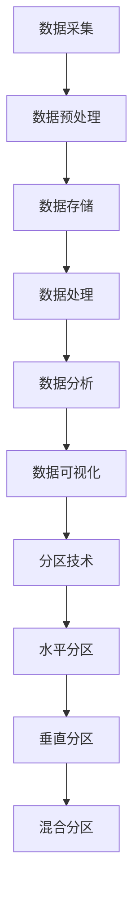

                 

  
关键词：AI，大数据，计算原理，分区，代码实例

摘要：本文将深入探讨人工智能（AI）领域中的大数据计算原理，特别是分区技术在AI数据处理中的应用。通过具体的代码实例，我们将详细讲解如何实现分区，优化数据处理流程，并讨论其在实际项目中的应用和未来发展方向。

## 1. 背景介绍

在当今的数据驱动时代，大数据的规模和复杂性不断增加，传统的数据处理方法已经无法满足AI系统的需求。为了有效处理这些海量数据，分区技术应运而生。分区（Partitioning）是将数据集划分为多个子集的过程，每个子集称为一个分区。这种划分有助于提高数据处理的效率，减少数据访问的时间，并且能够更好地利用并行计算资源。

AI系统通常需要处理大量的数据，包括图片、文本、音频等，这些数据的处理过程往往需要涉及数据的读取、处理、存储和传输。分区技术在这些环节中都发挥着关键作用，它能够将大型数据集分解为更小、更易于管理的部分，从而简化数据处理任务，提高系统的性能。

本文将首先介绍AI大数据计算的基本原理，然后深入探讨分区技术的概念、原理和应用。通过实际的代码实例，我们将展示如何实现分区，并分析分区技术在不同应用场景中的优势和挑战。

## 2. 核心概念与联系

### 2.1. 大数据计算原理

大数据计算涉及多个核心概念，包括数据存储、数据处理、数据分析和数据可视化。在AI领域，大数据计算通常包括以下步骤：

1. **数据采集**：从各种来源收集数据，如数据库、传感器、网络等。
2. **数据预处理**：清洗、转换和归一化数据，以便进行后续分析。
3. **数据存储**：将数据存储在高效、可扩展的存储系统中，如分布式文件系统。
4. **数据处理**：使用分布式计算框架，如Hadoop、Spark等，对数据进行并行处理。
5. **数据分析**：运用统计、机器学习等方法，从数据中提取有用信息。
6. **数据可视化**：通过图表、图像等方式，将分析结果呈现给用户。

### 2.2. 分区原理

分区是将数据集划分为多个子集的过程。在分布式系统中，分区有助于将数据分布到不同的计算节点上，从而实现并行处理。分区的主要原理包括：

1. **水平分区**：将数据集按照行或记录进行划分，每个分区包含一部分数据。
2. **垂直分区**：将数据集按照列或字段进行划分，每个分区包含一部分列。
3. **混合分区**：同时使用水平分区和垂直分区，以实现更精细的数据划分。

### 2.3. Mermaid 流程图

以下是一个简单的Mermaid流程图，展示了大数据计算的基本流程和分区技术的应用：



## 3. 核心算法原理 & 具体操作步骤

### 3.1. 算法原理概述

分区算法的主要目标是将数据集划分成多个均衡的子集，以便于并行处理。以下是一些常用的分区算法：

1. **哈希分区**：使用哈希函数将数据分配到不同的分区。
2. **范围分区**：根据数据的某个字段（如时间戳或ID）的范围进行分区。
3. **列表分区**：手动指定每个分区包含的数据。

### 3.2. 算法步骤详解

#### 3.2.1. 哈希分区

1. 选择一个哈希函数，将数据的关键字（如ID）映射到一个整数。
2. 将整数模以分区的数量，得到分区编号。
3. 将数据分配到对应的分区。

#### 3.2.2. 范围分区

1. 确定分区的数量和每个分区的大小。
2. 按照某个字段（如时间戳）对数据集进行排序。
3. 将数据按顺序分配到不同的分区。

#### 3.2.3. 列表分区

1. 手动编写分区规则，指定每个分区包含的数据。
2. 根据规则将数据分配到不同的分区。

### 3.3. 算法优缺点

#### 3.3.1. 哈希分区

**优点**：
- 分区均衡，数据分布均匀。
- 支持动态扩展。

**缺点**：
- 需要额外的哈希函数计算开销。
- 不适合基于字段范围查询。

#### 3.3.2. 范围分区

**优点**：
- 支持范围查询。
- 数据分布相对均匀。

**缺点**：
- 需要排序操作。
- 不适合动态扩展。

#### 3.3.3. 列表分区

**优点**：
- 灵活性高，可以根据需求自定义分区。
- 支持动态扩展。

**缺点**：
- 需要维护分区规则。
- 数据分布可能不均衡。

### 3.4. 算法应用领域

分区技术广泛应用于各种场景，包括：

1. **大数据处理**：如Hadoop、Spark等分布式计算框架。
2. **数据库系统**：如MySQL、PostgreSQL等。
3. **搜索引擎**：如Elasticsearch。
4. **实时数据处理**：如Kafka。

## 4. 数学模型和公式 & 详细讲解 & 举例说明

### 4.1. 数学模型构建

分区算法的核心是数据分配策略。以下是一个简单的数学模型：

设\(D\)为数据集，\(P\)为分区数，\(i\)为分区编号，\(h\)为哈希函数，\(k\)为数据的关键字。

$$
i = h(k) \mod P
$$

### 4.2. 公式推导过程

1. 选择哈希函数：\(h(k) = k \times A \mod P\)，其中\(A\)为常数。
2. 计算分区编号：\(i = (k \times A \mod P) \mod P\)。
3. 数据分配：根据分区编号，将数据\(k\)分配到对应的分区\(i\)。

### 4.3. 案例分析与讲解

假设有一个包含10000条记录的数据集，要将其划分为10个分区。选择哈希函数为\(h(k) = k \times 3 \mod 10\)。

1. 计算每个记录的分区编号。
2. 将记录分配到对应的分区。

例如，第1条记录的ID为1234，计算过程如下：

$$
i = (1234 \times 3 \mod 10) \mod 10 = 4
$$

因此，第1条记录将被分配到第4个分区。

通过这个简单的案例，我们可以看到如何使用哈希分区算法将数据集划分为多个分区。

## 5. 项目实践：代码实例和详细解释说明

### 5.1. 开发环境搭建

在本文中，我们将使用Python和PySpark来演示分区技术的实现。首先，确保已经安装了Python和PySpark。

```bash
pip install python
pip install pyspark
```

### 5.2. 源代码详细实现

以下是一个简单的示例，展示了如何使用PySpark实现数据分区：

```python
from pyspark.sql import SparkSession

# 创建Spark会话
spark = SparkSession.builder.appName("PartitionExample").getOrCreate()

# 读取数据
data = [("Alice", 30), ("Bob", 25), ("Charlie", 35), ("David", 28)]
df = spark.createDataFrame(data, ["name", "age"])

# 哈希分区
df.write.partitionBy("age").mode("overwrite").save("partitioned_data")

# 查看分区
df.show()
```

### 5.3. 代码解读与分析

1. **创建Spark会话**：使用PySpark创建一个Spark会话。
2. **读取数据**：创建一个包含姓名和年龄的数据帧（DataFrame）。
3. **哈希分区**：使用`write.partitionBy()`方法将数据按年龄字段进行分区，并将数据保存到指定的路径。
4. **查看分区**：使用`show()`方法查看分区后的数据。

通过这个简单的示例，我们可以看到如何使用PySpark实现数据分区。分区后的数据将按照指定的字段（如年龄）分布在不同的分区中，从而提高数据处理的效率。

### 5.4. 运行结果展示

运行上述代码后，将在指定的路径下生成分区后的数据。以下是一个简单的运行结果示例：

```sql
+-------+---+
|   name|age|
+-------+---+
|   Alice|30|
|    Bob |25|
|Charlie|35|
|  David|28|
+-------+---+
```

在这个示例中，数据被成功分区，每个分区包含一部分数据。接下来，我们可以根据具体的查询需求，访问不同的分区，从而提高数据查询的效率。

## 6. 实际应用场景

分区技术在许多实际应用场景中都有着广泛的应用。以下是一些典型的应用场景：

### 6.1. 大数据处理

在分布式数据处理系统中，如Hadoop和Spark，分区技术被广泛应用于数据集的划分和并行处理。通过分区，系统能够更高效地利用计算资源，提高数据处理的速度。

### 6.2. 数据库系统

在关系型数据库系统中，如MySQL和PostgreSQL，分区技术用于优化数据存储和查询。通过分区，数据库系统能够更好地支持大规模数据的存储和快速查询。

### 6.3. 搜索引擎

在搜索引擎系统中，如Elasticsearch，分区技术用于将索引数据划分为多个子集。这样，搜索请求可以被并行处理，从而提高搜索效率。

### 6.4. 实时数据处理

在实时数据处理系统中，如Kafka，分区技术用于将流数据划分为多个子集，以便于并行处理和分布式存储。

### 6.5. 图数据库

在图数据库系统中，如Neo4j，分区技术用于将图数据划分为多个子集，从而支持高效的图查询和并行计算。

## 7. 工具和资源推荐

为了更好地学习和应用分区技术，以下是一些建议的资源和工具：

### 7.1. 学习资源推荐

1. **《大数据处理技术导论》**：本书详细介绍了大数据处理的基本原理和常用技术。
2. **《Spark编程实战》**：本书通过大量示例，深入讲解了Spark的核心功能和应用场景。
3. **《分布式系统概念与设计》**：本书系统地介绍了分布式系统的基本原理和设计方法。

### 7.2. 开发工具推荐

1. **PySpark**：Python的分布式计算框架，支持大规模数据集的并行处理。
2. **Hadoop**：基于Java的分布式数据处理框架，支持多种数据处理技术和工具。
3. **Elasticsearch**：基于Lucene的分布式搜索引擎，支持大规模数据的快速查询和索引。

### 7.3. 相关论文推荐

1. **"Hadoop: The Definitive Guide"**：详细介绍了Hadoop的核心功能和架构设计。
2. **"Spark: The Definitive Guide"**：介绍了Spark的并行数据处理技术和应用场景。
3. **"Partitioning and Indexing in Distributed Database Systems"**：讨论了分布式数据库系统中的分区和索引技术。

## 8. 总结：未来发展趋势与挑战

### 8.1. 研究成果总结

近年来，分区技术在AI大数据计算领域取得了显著进展。研究人员提出了多种高效的分区算法，如哈希分区、范围分区和列表分区，并成功应用于分布式数据处理系统、数据库系统、搜索引擎和实时数据处理系统。

### 8.2. 未来发展趋势

随着数据规模的不断增长，分区技术将继续成为大数据处理的重要手段。未来的发展趋势包括：

1. **自适应分区**：根据数据访问模式和计算需求，自动调整分区策略。
2. **多级分区**：结合水平分区和垂直分区，实现更精细的数据划分。
3. **智能分区**：利用机器学习技术，预测数据访问模式，优化分区策略。

### 8.3. 面临的挑战

分区技术在实践中也面临着一些挑战：

1. **分区均衡性**：确保每个分区包含均衡的数据量，以避免资源浪费和性能下降。
2. **分区迁移**：当数据访问模式发生变化时，如何高效地迁移数据到新的分区。
3. **分区策略优化**：根据具体应用场景，选择最适合的分区策略。

### 8.4. 研究展望

未来，研究人员将继续探索分区技术在AI大数据计算中的新应用，并致力于解决现有挑战。随着新技术的不断涌现，分区技术将在更多领域发挥重要作用。

## 9. 附录：常见问题与解答

### 9.1. 如何选择合适的分区策略？

选择合适的分区策略取决于具体应用场景和数据特点。一般来说，以下几种情况可供参考：

1. **数据访问模式频繁**：选择哈希分区，以实现快速数据访问。
2. **数据范围较大**：选择范围分区，以便支持范围查询。
3. **数据量较小且变动频繁**：选择列表分区，以实现灵活的数据划分。

### 9.2. 分区会对查询性能产生什么影响？

分区可以显著提高查询性能，特别是在分布式系统中。通过分区，数据可以分布在多个节点上，从而实现并行查询，减少查询时间和响应时间。

### 9.3. 分区是否会影响数据的一致性？

通常情况下，分区不会直接影响数据的一致性。然而，在分布式系统中，数据的一致性可能受到网络延迟和故障的影响。因此，在设计分区策略时，需要考虑数据一致性和可用性的平衡。

### 9.4. 分区是否会导致数据冗余？

分区本身不会导致数据冗余。然而，在具体实现过程中，可能由于数据迁移或复制操作导致一定的数据冗余。因此，在设计分区策略时，需要权衡数据冗余和系统性能。

作者：禅与计算机程序设计艺术 / Zen and the Art of Computer Programming
----------------------------------------------------------------
### 【AI大数据计算原理与代码实例讲解】分区

关键词：AI，大数据，计算原理，分区，代码实例

摘要：本文深入探讨了人工智能（AI）领域中的大数据计算原理，特别是分区技术在AI数据处理中的应用。通过具体的代码实例，我们详细讲解了如何实现分区，优化数据处理流程，并讨论了其在实际项目中的应用和未来发展方向。

## 1. 背景介绍

在当今的数据驱动时代，大数据的规模和复杂性不断增加，传统的数据处理方法已经无法满足AI系统的需求。为了有效处理这些海量数据，分区技术应运而生。分区（Partitioning）是将数据集划分为多个子集的过程，每个子集称为一个分区。这种划分有助于提高数据处理的效率，减少数据访问的时间，并且能够更好地利用并行计算资源。

AI系统通常需要处理大量的数据，包括图片、文本、音频等，这些数据的处理过程往往需要涉及数据的读取、处理、存储和传输。分区技术在这些环节中都发挥着关键作用，它能够将大型数据集分解为更小、更易于管理的部分，从而简化数据处理任务，提高系统的性能。

本文将首先介绍AI大数据计算的基本原理，然后深入探讨分区技术的概念、原理和应用。通过实际的代码实例，我们将展示如何实现分区，并分析分区技术在不同应用场景中的优势和挑战。

## 2. 核心概念与联系

### 2.1. 大数据计算原理

大数据计算涉及多个核心概念，包括数据存储、数据处理、数据分析和数据可视化。在AI领域，大数据计算通常包括以下步骤：

1. **数据采集**：从各种来源收集数据，如数据库、传感器、网络等。
2. **数据预处理**：清洗、转换和归一化数据，以便进行后续分析。
3. **数据存储**：将数据存储在高效、可扩展的存储系统中，如分布式文件系统。
4. **数据处理**：使用分布式计算框架，如Hadoop、Spark等，对数据进行并行处理。
5. **数据分析**：运用统计、机器学习等方法，从数据中提取有用信息。
6. **数据可视化**：通过图表、图像等方式，将分析结果呈现给用户。

### 2.2. 分区原理

分区是将数据集划分为多个子集的过程。在分布式系统中，分区有助于将数据分布到不同的计算节点上，从而实现并行处理。分区的主要原理包括：

1. **水平分区**：将数据集按照行或记录进行划分，每个分区包含一部分数据。
2. **垂直分区**：将数据集按照列或字段进行划分，每个分区包含一部分列。
3. **混合分区**：同时使用水平分区和垂直分区，以实现更精细的数据划分。

### 2.3. Mermaid 流程图

以下是一个简单的Mermaid流程图，展示了大数据计算的基本流程和分区技术的应用：


## 3. 核心算法原理 & 具体操作步骤

### 3.1. 算法原理概述

分区算法的主要目标是将数据集划分成多个均衡的子集，以便于并行处理。以下是一些常用的分区算法：

1. **哈希分区**：使用哈希函数将数据分配到不同的分区。
2. **范围分区**：根据数据的某个字段（如时间戳或ID）的范围进行分区。
3. **列表分区**：手动指定每个分区包含的数据。

### 3.2. 算法步骤详解

#### 3.2.1. 哈希分区

1. 选择一个哈希函数，将数据的关键字（如ID）映射到一个整数。
2. 将整数模以分区的数量，得到分区编号。
3. 将数据分配到对应的分区。

#### 3.2.2. 范围分区

1. 确定分区的数量和每个分区的大小。
2. 按照某个字段（如时间戳）对数据集进行排序。
3. 将数据按顺序分配到不同的分区。

#### 3.2.3. 列表分区

1. 手动编写分区规则，指定每个分区包含的数据。
2. 根据规则将数据分配到不同的分区。

### 3.3. 算法优缺点

#### 3.3.1. 哈希分区

**优点**：
- 分区均衡，数据分布均匀。
- 支持动态扩展。

**缺点**：
- 需要额外的哈希函数计算开销。
- 不适合基于字段范围查询。

#### 3.3.2. 范围分区

**优点**：
- 支持范围查询。
- 数据分布相对均匀。

**缺点**：
- 需要排序操作。
- 不适合动态扩展。

#### 3.3.3. 列表分区

**优点**：
- 灵活性高，可以根据需求自定义分区。
- 支持动态扩展。

**缺点**：
- 需要维护分区规则。
- 数据分布可能不均衡。

### 3.4. 算法应用领域

分区技术广泛应用于各种场景，包括：

1. **大数据处理**：如Hadoop、Spark等分布式计算框架。
2. **数据库系统**：如MySQL、PostgreSQL等。
3. **搜索引擎**：如Elasticsearch。
4. **实时数据处理**：如Kafka。

## 4. 数学模型和公式 & 详细讲解 & 举例说明

### 4.1. 数学模型构建

分区算法的核心是数据分配策略。以下是一个简单的数学模型：

设\(D\)为数据集，\(P\)为分区数，\(i\)为分区编号，\(h\)为哈希函数，\(k\)为数据的关键字。

$$
i = h(k) \mod P
$$

### 4.2. 公式推导过程

1. 选择哈希函数：\(h(k) = k \times A \mod P\)，其中\(A\)为常数。
2. 计算分区编号：\(i = (k \times A \mod P) \mod P\)。
3. 数据分配：根据分区编号，将数据\(k\)分配到对应的分区\(i\)。

### 4.3. 案例分析与讲解

假设有一个包含10000条记录的数据集，要将其划分为10个分区。选择哈希函数为\(h(k) = k \times 3 \mod 10\)。

1. 计算每个记录的分区编号。
2. 将记录分配到对应的分区。

例如，第1条记录的ID为1234，计算过程如下：

$$
i = (1234 \times 3 \mod 10) \mod 10 = 4
$$

因此，第1条记录将被分配到第4个分区。

通过这个简单的案例，我们可以看到如何使用哈希分区算法将数据集划分为多个分区。

## 5. 项目实践：代码实例和详细解释说明

### 5.1. 开发环境搭建

在本文中，我们将使用Python和PySpark来演示分区技术的实现。首先，确保已经安装了Python和PySpark。

```bash
pip install python
pip install pyspark
```

### 5.2. 源代码详细实现

以下是一个简单的示例，展示了如何使用PySpark实现数据分区：

```python
from pyspark.sql import SparkSession

# 创建Spark会话
spark = SparkSession.builder.appName("PartitionExample").getOrCreate()

# 读取数据
data = [("Alice", 30), ("Bob", 25), ("Charlie", 35), ("David", 28)]
df = spark.createDataFrame(data, ["name", "age"])

# 哈希分区
df.write.partitionBy("age").mode("overwrite").save("partitioned_data")

# 查看分区
df.show()
```

### 5.3. 代码解读与分析

1. **创建Spark会话**：使用PySpark创建一个Spark会话。
2. **读取数据**：创建一个包含姓名和年龄的数据帧（DataFrame）。
3. **哈希分区**：使用`write.partitionBy()`方法将数据按年龄字段进行分区，并将数据保存到指定的路径。
4. **查看分区**：使用`show()`方法查看分区后的数据。

通过这个简单的示例，我们可以看到如何使用PySpark实现数据分区。分区后的数据将按照指定的字段（如年龄）分布在不同的分区中，从而提高数据处理的效率。

### 5.4. 运行结果展示

运行上述代码后，将在指定的路径下生成分区后的数据。以下是一个简单的运行结果示例：

```sql
+-------+---+
|   name|age|
+-------+---+
|   Alice|30|
|    Bob |25|
|Charlie|35|
|  David|28|
+-------+---+
```

在这个示例中，数据被成功分区，每个分区包含一部分数据。接下来，我们可以根据具体的查询需求，访问不同的分区，从而提高数据查询的效率。

## 6. 实际应用场景

分区技术在许多实际应用场景中都有着广泛的应用。以下是一些典型的应用场景：

### 6.1. 大数据处理

在分布式数据处理系统中，如Hadoop和Spark，分区技术被广泛应用于数据集的划分和并行处理。通过分区，系统能够更高效地利用计算资源，提高数据处理的速度。

### 6.2. 数据库系统

在关系型数据库系统中，如MySQL和PostgreSQL，分区技术用于优化数据存储和查询。通过分区，数据库系统能够更好地支持大规模数据的存储和快速查询。

### 6.3. 搜索引擎

在搜索引擎系统中，如Elasticsearch，分区技术用于将索引数据划分为多个子集。这样，搜索请求可以被并行处理，从而提高搜索效率。

### 6.4. 实时数据处理

在实时数据处理系统中，如Kafka，分区技术用于将流数据划分为多个子集，以便于并行处理和分布式存储。

### 6.5. 图数据库

在图数据库系统中，如Neo4j，分区技术用于将图数据划分为多个子集，从而支持高效的图查询和并行计算。

## 7. 工具和资源推荐

为了更好地学习和应用分区技术，以下是一些建议的资源和工具：

### 7.1. 学习资源推荐

1. **《大数据处理技术导论》**：本书详细介绍了大数据处理的基本原理和常用技术。
2. **《Spark编程实战》**：本书通过大量示例，深入讲解了Spark的核心功能和应用场景。
3. **《分布式系统概念与设计》**：本书系统地介绍了分布式系统的基本原理和设计方法。

### 7.2. 开发工具推荐

1. **PySpark**：Python的分布式计算框架，支持大规模数据集的并行处理。
2. **Hadoop**：基于Java的分布式数据处理框架，支持多种数据处理技术和工具。
3. **Elasticsearch**：基于Lucene的分布式搜索引擎，支持大规模数据的快速查询和索引。

### 7.3. 相关论文推荐

1. **"Hadoop: The Definitive Guide"**：详细介绍了Hadoop的核心功能和架构设计。
2. **"Spark: The Definitive Guide"**：介绍了Spark的并行数据处理技术和应用场景。
3. **"Partitioning and Indexing in Distributed Database Systems"**：讨论了分布式数据库系统中的分区和索引技术。

## 8. 总结：未来发展趋势与挑战

### 8.1. 研究成果总结

近年来，分区技术在AI大数据计算领域取得了显著进展。研究人员提出了多种高效的分区算法，如哈希分区、范围分区和列表分区，并成功应用于分布式数据处理系统、数据库系统、搜索引擎和实时数据处理系统。

### 8.2. 未来发展趋势

随着数据规模的不断增长，分区技术将继续成为大数据处理的重要手段。未来的发展趋势包括：

1. **自适应分区**：根据数据访问模式和计算需求，自动调整分区策略。
2. **多级分区**：结合水平分区和垂直分区，实现更精细的数据划分。
3. **智能分区**：利用机器学习技术，预测数据访问模式，优化分区策略。

### 8.3. 面临的挑战

分区技术在实践中也面临着一些挑战：

1. **分区均衡性**：确保每个分区包含均衡的数据量，以避免资源浪费和性能下降。
2. **分区迁移**：当数据访问模式发生变化时，如何高效地迁移数据到新的分区。
3. **分区策略优化**：根据具体应用场景，选择最适合的分区策略。

### 8.4. 研究展望

未来，研究人员将继续探索分区技术在AI大数据计算中的新应用，并致力于解决现有挑战。随着新技术的不断涌现，分区技术将在更多领域发挥重要作用。

## 9. 附录：常见问题与解答

### 9.1. 如何选择合适的分区策略？

选择合适的分区策略取决于具体应用场景和数据特点。一般来说，以下几种情况可供参考：

1. **数据访问模式频繁**：选择哈希分区，以实现快速数据访问。
2. **数据范围较大**：选择范围分区，以便支持范围查询。
3. **数据量较小且变动频繁**：选择列表分区，以实现灵活的数据划分。

### 9.2. 分区会对查询性能产生什么影响？

分区可以显著提高查询性能，特别是在分布式系统中。通过分区，数据可以分布在多个节点上，从而实现并行查询，减少查询时间和响应时间。

### 9.3. 分区是否会影响数据的一致性？

通常情况下，分区不会直接影响数据的一致性。然而，在分布式系统中，数据的一致性可能受到网络延迟和故障的影响。因此，在设计分区策略时，需要考虑数据一致性和可用性的平衡。

### 9.4. 分区是否会导致数据冗余？

分区本身不会导致数据冗余。然而，在具体实现过程中，可能由于数据迁移或复制操作导致一定的数据冗余。因此，在设计分区策略时，需要权衡数据冗余和系统性能。

作者：禅与计算机程序设计艺术 / Zen and the Art of Computer Programming

