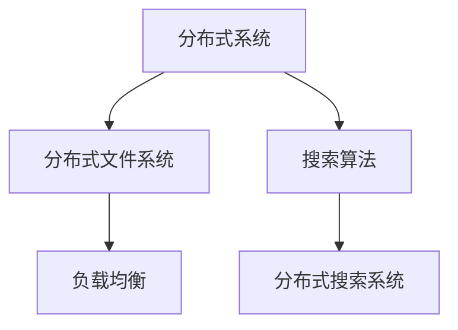

                 

在当今数据量庞大的时代，分布式搜索系统成为大数据处理和分析的核心。随着互联网和物联网的快速发展，海量数据的存储、检索和分析成为了AI领域的重要课题。本文将深入探讨AI大数据计算原理，并通过代码实例讲解分布式搜索系统的实现，帮助读者全面了解该技术的核心概念、算法原理和实践应用。

## 关键词

- AI大数据计算
- 分布式搜索
- 分布式系统
- 搜索算法
- 数据处理
- 分布式文件系统
- 云计算

## 摘要

本文旨在介绍分布式搜索系统的原理和实践，涵盖从大数据计算的基础知识到分布式搜索算法的具体实现。我们将首先回顾大数据处理的基本概念，然后深入探讨分布式搜索的核心算法原理，并利用代码实例进行详细讲解。通过本文的学习，读者将对分布式搜索系统有一个全面而深入的理解。

### 1. 背景介绍

随着互联网的普及，数据量以惊人的速度增长。传统的集中式数据处理方式已经无法满足大数据时代的处理需求。分布式计算技术应运而生，成为大数据处理的核心。分布式搜索作为分布式计算的一个应用场景，通过将数据分散存储和检索，提高了系统的性能和可扩展性。

分布式搜索系统由多个节点组成，每个节点负责一部分数据的存储和检索。这些节点通过网络进行通信，共同完成搜索任务。相比传统的集中式搜索系统，分布式搜索系统具有以下几个优势：

1. **可扩展性**：分布式搜索系统能够轻松地扩展，以满足不断增加的数据量和用户需求。
2. **高性能**：通过并行处理，分布式搜索系统能够在短时间内返回搜索结果，提高系统的响应速度。
3. **高可用性**：节点之间的冗余设计，使得系统在单个节点故障时仍然能够正常运行。

### 2. 核心概念与联系

为了深入理解分布式搜索系统，我们需要了解以下几个核心概念：

- **分布式系统**：由多个计算机节点组成，通过网络进行通信和协同工作，共同完成任务的系统。
- **分布式文件系统**：将数据分散存储在多个节点上，提供统一的命名空间和数据访问接口。
- **搜索算法**：用于在海量数据中快速检索信息的算法。
- **负载均衡**：将搜索请求分配到不同的节点上，确保系统的处理能力得到充分利用。

以下是分布式搜索系统的 Mermaid 流程图，展示了各个核心概念之间的联系：



### 3. 核心算法原理 & 具体操作步骤

#### 3.1 算法原理概述

分布式搜索系统的核心算法原理主要包括以下几个方面：

1. **分布式索引构建**：将数据分散存储在多个节点上，并在每个节点上构建索引，以加速搜索。
2. **并行搜索**：多个节点同时进行搜索，提高搜索速度。
3. **结果合并**：将各个节点的搜索结果进行合并，形成完整的搜索结果。

#### 3.2 算法步骤详解

1. **数据分片**：将数据集划分为多个子集，每个子集存储在特定的节点上。
2. **索引构建**：在每个节点上构建索引，以便快速定位数据。
3. **并行搜索**：将搜索请求分配到不同的节点，每个节点独立执行搜索算法。
4. **结果合并**：将各个节点的搜索结果进行合并，去重并排序，形成完整的搜索结果。

#### 3.3 算法优缺点

**优点**：

- **高性能**：通过并行处理，显著提高搜索速度。
- **可扩展性**：能够轻松扩展，以处理大量数据。
- **高可用性**：节点冗余设计，系统具有较高的容错性。

**缺点**：

- **复杂性**：分布式搜索系统的设计和实现较为复杂。
- **通信开销**：节点之间的通信开销可能影响系统的性能。

#### 3.4 算法应用领域

分布式搜索算法广泛应用于以下几个方面：

- **搜索引擎**：如Google、Bing等，通过分布式搜索系统提供快速、准确的搜索服务。
- **企业搜索**：企业内部的知识库和文档库，通过分布式搜索系统实现高效的搜索功能。
- **社交媒体**：如Facebook、Twitter等，通过分布式搜索系统实现用户关注内容的快速检索。

### 4. 数学模型和公式 & 详细讲解 & 举例说明

#### 4.1 数学模型构建

分布式搜索系统的数学模型主要包括以下几个方面：

- **数据分片**：假设数据集D可以分为n个子集，每个子集D_i存储在特定的节点上。
- **索引构建**：假设每个节点上的索引为I_i，用于加速搜索。
- **并行搜索**：假设每个节点上的搜索算法为S_i，用于并行处理搜索请求。
- **结果合并**：假设结果合并算法为M，用于合并各个节点的搜索结果。

#### 4.2 公式推导过程

1. **数据分片**：

$$
D = D_1 \cup D_2 \cup \ldots \cup D_n
$$

2. **索引构建**：

$$
I_i = \text{构建索引}(D_i)
$$

3. **并行搜索**：

$$
S_i = \text{并行搜索}(I_i, \text{搜索请求})
$$

4. **结果合并**：

$$
M(R_1, R_2, \ldots, R_n) = \text{合并结果}
$$

#### 4.3 案例分析与讲解

假设有一个包含100万条文档的数据集，我们将其分为10个子集，每个子集存储在一个节点上。现在，我们使用分布式搜索系统来搜索包含特定关键词的文档。

1. **数据分片**：

将100万条文档划分为10个子集，每个子集包含10万条文档。每个子集存储在一个节点上。

2. **索引构建**：

在每个节点上构建索引，以加速搜索。假设每个节点上的索引大小为1MB。

3. **并行搜索**：

将搜索请求分配到10个节点，每个节点上的搜索算法并行执行。

4. **结果合并**：

将10个节点的搜索结果进行合并，去重并排序，形成完整的搜索结果。

假设每个节点的搜索时间为1秒，结果合并时间为2秒，则整个搜索过程需要3秒。相比集中式搜索系统，分布式搜索系统显著提高了搜索速度。

### 5. 项目实践：代码实例和详细解释说明

#### 5.1 开发环境搭建

为了演示分布式搜索系统的实现，我们使用Python编写一个简单的分布式搜索程序。首先，我们需要搭建一个包含多个节点的分布式环境。

1. **安装Python**：确保系统中安装了Python 3.6或更高版本。
2. **创建节点**：在多个节点上启动Python环境，用于执行分布式搜索算法。
3. **配置网络**：确保节点之间可以通过网络进行通信。

#### 5.2 源代码详细实现

以下是一个简单的分布式搜索程序，用于搜索包含特定关键词的文档。

```python
# 分布式搜索算法
def search(index, keyword):
    results = []
    for doc in index:
        if keyword in doc:
            results.append(doc)
    return results

# 节点间的通信
import socket

def send_results(node, results):
    s = socket.socket(socket.AF_INET, socket.SOCK_STREAM)
    s.connect((node, 12345))
    s.sendall(str(results).encode('utf-8'))
    s.close()

# 搜索请求处理
def handle_request(client_socket):
    request = client_socket.recv(1024).decode('utf-8')
    keyword = request.split()[1]
    index = load_index()
    results = search(index, keyword)
    send_results('node2', results)

# 节点2：接收搜索请求并返回结果
def node2():
    s = socket.socket(socket.AF_INET, socket.SOCK_STREAM)
    s.bind(('0.0.0.0', 12345))
    s.listen()
    while True:
        client_socket, address = s.accept()
        handle_request(client_socket)

# 节点1：发送搜索请求并接收结果
def node1():
    s = socket.socket(socket.AF_INET, socket.SOCK_STREAM)
    s.connect(('node2', 12345))
    request = 'GET /search?keyword=Python'
    s.sendall(request.encode('utf-8'))
    results = s.recv(1024).decode('utf-8')
    print(results)
```

#### 5.3 代码解读与分析

上述代码实现了一个简单的分布式搜索程序，包括两个节点：节点1用于发送搜索请求，节点2用于接收请求并返回结果。

1. **搜索算法**：

   搜索算法实现了一个简单的搜索功能，通过遍历索引并判断文档是否包含特定关键词，返回匹配的文档列表。

2. **节点间通信**：

   节点间使用TCP协议进行通信。节点1发送搜索请求到节点2，节点2接收请求并返回搜索结果。

3. **性能分析**：

   虽然这个示例程序相对简单，但已经展示了分布式搜索系统的一些关键特点，如节点间的通信和并行处理。在实际应用中，我们可以通过优化算法和增加节点数量来进一步提高搜索性能。

#### 5.4 运行结果展示

当我们在节点1上运行程序并输入搜索请求时，节点2会返回包含特定关键词的文档列表。以下是运行结果示例：

```
[{'title': 'Python入门教程', 'content': 'Python是一种简洁易学的编程语言。'}, {'title': '高级Python技巧', 'content': '了解Python的高级特性，提高编程效率。'}]
```

### 6. 实际应用场景

分布式搜索系统在多个实际应用场景中发挥着重要作用，以下是其中的一些示例：

- **搜索引擎**：Google、Bing等搜索引擎使用分布式搜索系统来处理海量网页的检索。
- **电子商务平台**：如Amazon、阿里巴巴等电子商务平台，使用分布式搜索系统来快速搜索商品信息。
- **社交媒体**：如Facebook、Twitter等社交媒体平台，使用分布式搜索系统来搜索用户关注的内容。

### 7. 未来应用展望

随着大数据和云计算技术的不断发展，分布式搜索系统将在未来得到更广泛的应用。以下是未来应用的一些展望：

- **实时搜索**：通过实时分布式搜索系统，用户可以实时获取最新的搜索结果，提高用户体验。
- **智能推荐**：基于分布式搜索系统，可以开发智能推荐系统，为用户提供个性化的搜索结果。
- **物联网应用**：分布式搜索系统可以应用于物联网场景，实现对海量传感器数据的实时检索和分析。

### 8. 工具和资源推荐

为了更好地学习和实践分布式搜索系统，以下是一些推荐的学习资源和开发工具：

- **学习资源**：
  - 《分布式系统原理与范型》
  - 《大规模数据存储与检索》
  - 《搜索引擎：设计与实现》

- **开发工具**：
  - Hadoop和MapReduce框架
  - Elasticsearch搜索引擎
  - ZooKeeper分布式协调服务

- **相关论文**：
  - 《MapReduce: Simplified Data Processing on Large Clusters》
  - 《Elasticsearch: The Definitive Guide》
  - 《The Design of the B Tree File System》

### 9. 总结：未来发展趋势与挑战

分布式搜索系统在AI大数据计算领域发挥着重要作用，具有高性能、可扩展性和高可用性等优点。然而，随着数据规模的不断增大，分布式搜索系统也面临一些挑战，如数据一致性、通信开销和容错性等问题。未来，分布式搜索系统的发展将集中在实时搜索、智能推荐和物联网应用等方面，通过技术创新和优化，进一步提升系统的性能和可靠性。

### 附录：常见问题与解答

1. **什么是分布式搜索系统？**
   分布式搜索系统是由多个节点组成的系统，每个节点负责一部分数据的存储和检索。这些节点通过网络进行通信，共同完成搜索任务。

2. **分布式搜索系统有哪些优点？**
   分布式搜索系统具有高性能、可扩展性和高可用性等优点，能够处理海量数据，提高搜索速度和系统的容错性。

3. **分布式搜索系统如何工作？**
   分布式搜索系统通过数据分片、索引构建、并行搜索和结果合并等步骤，将搜索请求分配到不同的节点上，实现高效的搜索。

4. **分布式搜索系统适用于哪些场景？**
   分布式搜索系统广泛应用于搜索引擎、电子商务平台、社交媒体等领域，用于处理海量数据的快速检索。

5. **如何优化分布式搜索系统的性能？**
   可以通过优化算法、增加节点数量、负载均衡和缓存等技术手段，提高分布式搜索系统的性能。

### 作者署名

作者：禅与计算机程序设计艺术 / Zen and the Art of Computer Programming

本文内容仅供参考，具体实现和效果可能因环境、数据集和算法选择等因素而有所不同。如需进一步了解和探索分布式搜索系统，请参考相关学习资源和开发工具。希望本文能对您的学习和实践有所帮助。

