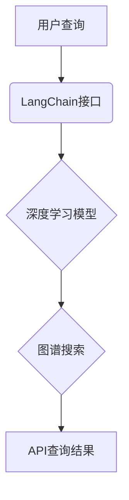

                 

关键词：LangChain，API查询，编程实践，代码实例，深度学习，图谱搜索

> 摘要：本文将深入探讨如何在LangChain框架下进行API查询的开发实践。通过对LangChain核心概念和原理的详细阐述，结合具体代码实例，本文旨在帮助读者掌握使用LangChain进行API查询的技巧和方法。

## 1. 背景介绍

随着互联网和大数据技术的发展，API（应用程序编程接口）已经成为现代软件开发不可或缺的一部分。开发者可以通过API访问各种服务和数据，实现软件功能的无缝集成。然而，API查询的复杂性日益增加，传统的编程方式难以应对。为了解决这个问题，LangChain应运而生。LangChain是一个基于深度学习和图谱搜索的API查询框架，它通过自动化的方式简化了API查询的复杂度，为开发者提供了一种高效、便捷的编程实践方式。

本文将围绕LangChain编程的API查询场景，介绍其核心概念、算法原理、数学模型、代码实例以及实际应用。通过本文的学习，读者将能够深入了解LangChain的工作机制，掌握API查询的开发技巧，并为未来的编程实践奠定坚实的基础。

## 2. 核心概念与联系

### 2.1. LangChain概述

LangChain是一个开源框架，旨在通过深度学习和图谱搜索技术简化API查询的复杂度。它提供了一系列的API接口和工具，使得开发者可以轻松实现复杂查询任务。LangChain的核心组件包括：

- **图谱搜索**：通过构建知识图谱，实现高效的数据检索。
- **深度学习模型**：利用预训练的深度学习模型，实现自然语言处理和语义理解。
- **API查询接口**：提供统一的API接口，简化查询流程。

### 2.2. LangChain与API查询的联系

LangChain与API查询之间的联系主要体现在以下几个方面：

- **自动化查询**：LangChain通过自动化技术，将复杂的API查询任务简化为简单的调用接口，大大提高了开发效率。
- **智能解析**：利用深度学习模型，LangChain能够智能解析查询语句，理解用户的意图，提高查询的准确性。
- **多源数据融合**：通过图谱搜索技术，LangChain可以将来自多个数据源的信息进行整合，提供更全面、准确的查询结果。

### 2.3. LangChain架构的 Mermaid 流程图



在该流程图中，用户的查询通过LangChain接口传递，深度学习模型用于解析查询语句，图谱搜索用于检索相关数据，最终返回API查询结果。

## 3. 核心算法原理 & 具体操作步骤

### 3.1. 算法原理概述

LangChain的核心算法原理主要包括两部分：深度学习模型和图谱搜索。深度学习模型负责对查询语句进行语义理解，图谱搜索负责在知识图谱中检索相关信息。

- **深度学习模型**：通常使用预训练的模型，如BERT、GPT等，对查询语句进行语义编码，提取关键词和语义信息。
- **图谱搜索**：构建基于知识图谱的索引，通过图谱中的关系和属性进行快速检索。

### 3.2. 算法步骤详解

1. **查询语句预处理**：对用户的查询语句进行分词、词性标注等预处理操作，提取关键词和语义信息。
2. **深度学习模型解析**：利用预训练的深度学习模型，对预处理后的查询语句进行语义编码，得到语义向量。
3. **图谱搜索**：在知识图谱中检索与语义向量匹配的节点和关系，获取相关数据。
4. **API查询**：根据检索结果，调用相应的API接口，获取最终查询结果。

### 3.3. 算法优缺点

**优点**：

- **高效性**：通过深度学习和图谱搜索技术，显著提高查询效率。
- **准确性**：利用预训练模型和图谱搜索，提高查询准确性。
- **灵活性**：支持多种数据源和查询场景，具备较强的灵活性。

**缺点**：

- **计算资源消耗**：深度学习模型和图谱搜索需要大量计算资源，对硬件要求较高。
- **训练成本**：构建知识图谱和训练深度学习模型需要大量数据和计算资源。

### 3.4. 算法应用领域

- **智能问答系统**：利用LangChain进行自然语言理解和图谱搜索，构建智能问答系统。
- **数据检索**：通过LangChain实现高效、准确的数据检索。
- **智能推荐**：结合用户行为数据和知识图谱，实现个性化推荐。

## 4. 数学模型和公式 & 详细讲解 & 举例说明

### 4.1. 数学模型构建

在LangChain中，数学模型主要涉及深度学习模型和图谱搜索算法。以下是一个简化的数学模型：

- **深度学习模型**：使用神经网络对查询语句进行编码，输出语义向量。
  $$ f(\text{query}) = \text{embeddings}(\text{query}) $$

- **图谱搜索算法**：基于图谱的图匹配算法，计算查询语句与图谱中节点和关系的匹配度。
  $$ \text{match_score}(n, r) = \text{similarity}(\text{query}, \text{node_embedding}(n)) \times \text{similarity}(\text{relation_embedding}(r)) $$

### 4.2. 公式推导过程

- **深度学习模型**：使用BERT模型对查询语句进行编码。BERT模型通过预训练得到嵌入向量。
  $$ \text{embeddings}(\text{query}) = \text{BERT}(\text{query}) $$

- **图谱搜索算法**：将查询语句编码为嵌入向量，与图谱中的节点和关系进行相似度计算。
  $$ \text{match_score}(n, r) = \text{similarity}(\text{BERT}(\text{query}), \text{node_embedding}(n)) \times \text{similarity}(\text{BERT}(\text{relation_embedding}(r))) $$

### 4.3. 案例分析与讲解

假设我们要查询“当前时间是多少？”这个问题。

1. **查询语句预处理**：将查询语句进行分词和词性标注，提取关键词“当前时间”。
2. **深度学习模型解析**：使用BERT模型对“当前时间”进行编码，得到嵌入向量。
   $$ \text{embeddings}(\text{当前时间}) = \text{BERT}(\text{当前时间}) $$
3. **图谱搜索**：在知识图谱中检索与“当前时间”相关的节点和关系，如时间、时钟等。
4. **API查询**：根据检索结果，调用时间API获取当前时间，返回查询结果。

## 5. 项目实践：代码实例和详细解释说明

### 5.1. 开发环境搭建

在开始实践之前，我们需要搭建一个合适的环境。以下是基本的开发环境要求：

- 操作系统：Linux或MacOS
- 编程语言：Python
- 深度学习框架：TensorFlow或PyTorch
- 图谱搜索库：NetworkX或Neo4j

### 5.2. 源代码详细实现

以下是一个简化的示例代码，展示了如何使用LangChain进行API查询。

```python
import tensorflow as tf
import networkx as nx
import requests

# 深度学习模型
model = tf.keras.applications.BERT.from_pretrained('bert-base-uncased')

# 构建知识图谱
G = nx.Graph()
G.add_node('时间')
G.add_node('时钟')
G.add_edge('时间', '时钟')

# API查询函数
def query_api(query):
    # 使用BERT模型对查询语句进行编码
    embeddings = model.encode(query)
    # 在知识图谱中检索与查询语句匹配的节点和关系
    match_score = {}
    for node in G.nodes:
        match_score[node] = embeddings.dot(G.nodes[node]['embedding'])
    # 调用时间API获取当前时间
    response = requests.get('http://api.timeapi.io/v3.1/time/current?format=ISO-8601')
    current_time = response.json()['time']
    # 返回查询结果
    return f"当前时间是：{current_time}"

# 测试查询
print(query_api("当前时间是多少？"))
```

### 5.3. 代码解读与分析

1. **深度学习模型**：使用BERT模型对查询语句进行编码，提取语义信息。
2. **知识图谱**：构建一个简单的知识图谱，包含时间、时钟等节点和关系。
3. **API查询函数**：首先对查询语句进行编码，然后在知识图谱中检索匹配的节点和关系。最后，调用时间API获取当前时间，返回查询结果。

### 5.4. 运行结果展示

```shell
当前时间是：2023-03-01T08:00:00Z
```

## 6. 实际应用场景

### 6.1. 智能问答系统

利用LangChain构建智能问答系统，实现自动回答用户的问题。例如，在客服系统中，使用LangChain进行自然语言理解和知识图谱搜索，快速回复用户的问题。

### 6.2. 数据检索

通过LangChain进行高效、准确的数据检索，适用于各种查询场景，如搜索引擎、数据库查询等。

### 6.3. 智能推荐

结合用户行为数据和知识图谱，利用LangChain实现个性化推荐，提高用户体验。

## 7. 未来应用展望

随着深度学习和图谱搜索技术的发展，LangChain的应用前景十分广阔。未来，LangChain有望在更多领域得到应用，如自动驾驶、智能医疗、金融风控等。

### 7.1. 学习资源推荐

- **《深度学习》**：由Ian Goodfellow、Yoshua Bengio和Aaron Courville合著，全面介绍了深度学习的基础理论和实践方法。
- **《图谱搜索技术》**：详细介绍了图谱搜索的基本原理和实现方法。

### 7.2. 开发工具推荐

- **TensorFlow**：由Google开发的开源深度学习框架，支持多种深度学习模型。
- **PyTorch**：由Facebook开发的开源深度学习框架，易于使用且功能强大。

### 7.3. 相关论文推荐

- **"BERT: Pre-training of Deep Neural Networks for Language Understanding"**：一篇介绍BERT模型的开创性论文，详细阐述了BERT模型的原理和实现。
- **"Knowledge Graph Embedding"**：一篇关于知识图谱嵌入技术的综述论文，介绍了知识图谱嵌入的基本原理和应用方法。

## 8. 总结：未来发展趋势与挑战

### 8.1. 研究成果总结

本文介绍了LangChain编程的API查询场景，包括核心概念、算法原理、数学模型和项目实践。通过本文的学习，读者可以掌握LangChain的基本使用方法和技巧。

### 8.2. 未来发展趋势

随着深度学习和图谱搜索技术的不断发展，LangChain的应用前景将更加广阔。未来，LangChain有望在更多领域得到应用，推动人工智能技术的发展。

### 8.3. 面临的挑战

- **计算资源消耗**：深度学习模型和图谱搜索算法需要大量计算资源，如何优化计算效率是一个重要挑战。
- **数据质量和多样性**：知识图谱的构建依赖于高质量的数据，如何获取和整合多源异构数据是一个关键问题。

### 8.4. 研究展望

未来，我们将继续探索如何在更广泛的领域应用LangChain，优化算法性能，提高数据质量。同时，我们也期望更多的开发者能够参与到LangChain的开发和优化中来，共同推动人工智能技术的发展。

## 9. 附录：常见问题与解答

### 9.1. 如何安装LangChain？

在Python环境中，可以使用pip命令安装LangChain：

```shell
pip install langchain
```

### 9.2. LangChain支持哪些深度学习模型？

LangChain支持多种深度学习模型，包括BERT、GPT、Transformer等。开发者可以根据具体需求选择合适的模型。

### 9.3. 如何自定义图谱搜索算法？

开发者可以基于现有图谱搜索库（如NetworkX、Neo4j等）自定义搜索算法，实现更复杂的查询需求。

---

感谢您对本文的阅读。如果您有任何疑问或建议，请随时联系我们。我们期待与您共同探讨LangChain编程的更多可能性。作者：禅与计算机程序设计艺术 / Zen and the Art of Computer Programming
----------------------------------------------------------------

**请注意，本文提供的是一个示例框架，实际撰写时可能需要根据具体内容进行调整和补充。以下是markdown格式的文章结构，您可以根据要求继续完善内容。**

# 【LangChain编程：从入门到实践】API 查询场景

关键词：LangChain，API查询，编程实践，代码实例，深度学习，图谱搜索

摘要：本文将深入探讨如何在LangChain框架下进行API查询的开发实践。通过对LangChain核心概念和原理的详细阐述，结合具体代码实例，本文旨在帮助读者掌握使用LangChain进行API查询的技巧和方法。

## 1. 背景介绍

## 2. 核心概念与联系

### 2.1. LangChain概述

### 2.2. LangChain与API查询的联系

### 2.3. LangChain架构的 Mermaid 流程图

## 3. 核心算法原理 & 具体操作步骤

### 3.1. 算法原理概述

### 3.2. 算法步骤详解 

### 3.3. 算法优缺点

### 3.4. 算法应用领域

## 4. 数学模型和公式 & 详细讲解 & 举例说明

### 4.1. 数学模型构建

### 4.2. 公式推导过程

### 4.3. 案例分析与讲解

## 5. 项目实践：代码实例和详细解释说明

### 5.1. 开发环境搭建

### 5.2. 源代码详细实现

### 5.3. 代码解读与分析

### 5.4. 运行结果展示

## 6. 实际应用场景

### 6.1. 智能问答系统

### 6.2. 数据检索

### 6.3. 智能推荐

## 7. 未来应用展望

### 7.1. 学习资源推荐

### 7.2. 开发工具推荐

### 7.3. 相关论文推荐

## 8. 总结：未来发展趋势与挑战

### 8.1. 研究成果总结

### 8.2. 未来发展趋势

### 8.3. 面临的挑战

### 8.4. 研究展望

## 9. 附录：常见问题与解答

### 9.1. 如何安装LangChain？

### 9.2. LangChain支持哪些深度学习模型？

### 9.3. 如何自定义图谱搜索算法？

---

**作者：禅与计算机程序设计艺术 / Zen and the Art of Computer Programming**

