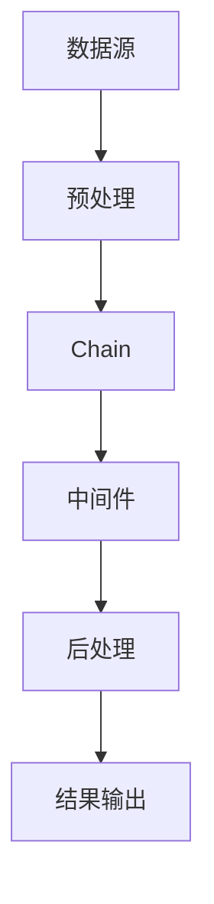

                 

关键词：LangChain，Chain接口，编程，实践，AI，图灵奖，计算机程序设计艺术

## 摘要

本文旨在为读者提供一个全面而深入的LangChain编程指南，特别是Chain接口的调用。通过本文的阅读，读者将掌握从基础到高级的LangChain编程技巧，理解Chain接口的内部工作原理，并能够熟练地将这些技术应用于各种实际场景。本文将结合案例与实践，让读者不仅能“知其然”，更能“知其所以然”。

## 1. 背景介绍

在人工智能迅速发展的今天，代码和算法的高效性变得尤为重要。LangChain作为一款强大且灵活的编程框架，为开发者提供了一个简洁而强大的工具集，用于构建AI应用程序。Chain接口是LangChain的核心组件之一，它允许开发者以模块化的方式组合和调用不同的函数和算法。

### LangChain概述

LangChain是一种基于Python的开源框架，旨在简化AI应用程序的开发流程。它提供了一个统一的接口，用于处理文本、图像和其他类型的数据。通过Chain接口，开发者可以轻松地将各种AI模型、数据处理函数和中间件集成到他们的应用程序中，从而实现高效的AI服务。

### Chain接口的重要性

Chain接口在LangChain中扮演着关键角色。它不仅提供了对各种AI模型的访问，还允许开发者自定义数据处理流程，实现个性化的AI解决方案。通过Chain接口，开发者可以灵活地调整模型的输入和输出，优化数据处理过程，从而提高应用程序的性能和效率。

## 2. 核心概念与联系

为了深入理解Chain接口的工作原理，我们需要先了解一些核心概念和它们之间的联系。以下是一个简化的Mermaid流程图，用于描述这些概念和它们之间的关系。



### 概念解释

- **数据源（A）**：数据源是Chain接口的输入，可以是文本、图像、音频等各种类型的数据。LangChain通过数据源为Chain接口提供原始数据。
- **预处理（B）**：预处理阶段用于对输入数据进行清洗、转换和标准化。这一步骤确保输入数据符合模型的要求，从而提高模型的性能。
- **Chain（C）**：Chain是LangChain的核心组件，它允许开发者将多个数据处理函数和AI模型串联起来，形成一个完整的数据处理流程。
- **中间件（D）**：中间件是Chain中的一个可选组件，用于在预处理和后处理阶段之间执行额外的操作。例如，中间件可以用于添加额外的数据处理步骤，或调整模型的输入和输出。
- **后处理（E）**：后处理阶段用于对Chain的输出结果进行进一步的清洗、转换和标准化。这一步骤确保输出结果符合用户的需求。
- **结果输出（F）**：最终输出是Chain接口处理的结果，可以是文本、图像、音频等各种类型的数据。用户可以根据需求对输出结果进行进一步的处理或展示。

### Mermaid流程图说明

- **数据源**：数据源是整个数据处理流程的起点，它为Chain接口提供输入数据。数据源可以是静态文件、数据库、API等多种形式。
- **预处理**：预处理阶段对输入数据进行清洗、转换和标准化，以确保数据符合模型的要求。例如，对于文本数据，预处理可能包括去除HTML标签、停用词过滤、分词等操作。
- **Chain**：Chain组件将预处理后的数据传递给后续的处理步骤。开发者可以通过定义多个Chain链式调用，实现复杂的数据处理流程。
- **中间件**：中间件是可选组件，用于在预处理和后处理阶段之间执行额外的操作。中间件可以自定义，以实现特定的数据处理需求。
- **后处理**：后处理阶段对Chain的输出结果进行进一步的清洗、转换和标准化。例如，对于文本数据，后处理可能包括格式化输出、添加元数据等操作。
- **结果输出**：最终输出是Chain接口处理的结果，用户可以根据需求对输出结果进行进一步的处理或展示。

## 3. 核心算法原理 & 具体操作步骤

### 3.1 算法原理概述

Chain接口的算法原理主要基于组合和模块化思想。通过Chain接口，开发者可以将多个数据处理函数和AI模型串联起来，形成一个完整的数据处理流程。这种模块化的设计不仅简化了代码的编写，还提高了系统的灵活性和可扩展性。

### 3.2 算法步骤详解

1. **初始化Chain**：首先，开发者需要初始化Chain对象，并设置初始输入数据。
   ```python
   from langchain import Chain
   data = {"text": "这是一个示例文本"}
   chain = Chain({"chain_type": "text-davinci-003", "prompt": "请根据以下文本生成摘要：", "input_key": "text"}, data)
   ```

2. **添加中间件**：如果需要，开发者可以在Chain中添加中间件，以实现额外的数据处理步骤。中间件可以自定义，以适应特定的应用场景。
   ```python
   from langchain import Middlewares
   chain = Chain({"chain_type": "text-davinci-003", "prompt": "请根据以下文本生成摘要：", "input_key": "text"},
                 data,
                 middlewares=Middlewares({"preprocess": preprocess_function}),
                 output_key="summary")
   ```

3. **调用Chain接口**：接下来，开发者可以调用Chain接口，获取处理后的结果。
   ```python
   result = chain.run()
   print(result)
   ```

4. **后处理**：最后，根据需要，开发者可以对输出结果进行后处理，例如格式化输出、添加元数据等。
   ```python
   final_result = postprocess_function(result)
   print(final_result)
   ```

### 3.3 算法优缺点

**优点**：

- **模块化**：Chain接口采用模块化设计，使得开发者可以轻松地组合和调用不同的数据处理函数和AI模型。
- **灵活性**：通过中间件，开发者可以自定义数据处理流程，以适应特定的应用场景。
- **高效性**：Chain接口简化了数据处理流程，减少了代码的冗余，提高了开发效率。

**缺点**：

- **复杂性**：对于初学者来说，Chain接口可能相对复杂，需要一定的学习曲线。
- **性能瓶颈**：在某些情况下，Chain接口可能成为性能瓶颈，特别是在处理大量数据时。

### 3.4 算法应用领域

Chain接口在多个领域都有广泛的应用，例如自然语言处理、图像识别、语音识别等。以下是一些典型的应用场景：

- **自然语言处理**：Chain接口可以用于构建聊天机器人、摘要生成、情感分析等应用。
- **图像识别**：Chain接口可以用于图像分类、目标检测等任务。
- **语音识别**：Chain接口可以用于语音到文本的转换、语音情感分析等任务。

## 4. 数学模型和公式 & 详细讲解 & 举例说明

### 4.1 数学模型构建

Chain接口的处理过程可以看作是一个数学模型。以下是一个简化的数学模型，用于描述Chain接口的工作原理。

$$
\text{输出} = f(\text{输入}, \text{模型参数})
$$

其中，`输入`表示原始数据，`模型参数`表示模型的参数设置，`输出`表示处理后的结果。

### 4.2 公式推导过程

假设我们有以下模型：

$$
f(x) = \text{模型}(x) + \text{中间件}(x)
$$

其中，`模型`表示预处理和后处理函数，`中间件`表示中间处理步骤。

推导过程如下：

1. **预处理**：
   $$
   \text{输入} = \text{预处理}(\text{原始数据})
   $$

2. **模型处理**：
   $$
   \text{中间结果} = \text{模型}(\text{输入})
   $$

3. **中间处理**：
   $$
   \text{最终结果} = \text{中间件}(\text{中间结果})
   $$

4. **后处理**：
   $$
   \text{输出} = \text{后处理}(\text{最终结果})
   $$

### 4.3 案例分析与讲解

假设我们需要对一段文本进行摘要生成，以下是一个具体的案例。

**输入**：一段长文，内容关于人工智能的发展和应用。

**模型参数**：使用文本摘要模型，例如GPT-3或T5。

**输出**：一段简洁的摘要，内容概括文章的主要观点。

以下是具体的处理过程：

1. **预处理**：将原始文本进行分句、去停用词等预处理操作。
   ```python
   def preprocess(text):
       # 实现预处理操作
       return processed_text
   ```

2. **模型处理**：使用文本摘要模型对预处理后的文本进行生成摘要。
   ```python
   from transformers import T5ForConditionalGeneration
   model = T5ForConditionalGeneration.from_pretrained("t5-small")
   def model_process(input_text):
       # 实现模型处理操作
       return summary
   ```

3. **中间处理**：对生成的摘要进行进一步处理，例如去除标点符号、格式化等。
   ```python
   def middleware(summary):
       # 实现中间处理操作
       return processed_summary
   ```

4. **后处理**：对处理后的摘要进行最终的格式化输出。
   ```python
   def postprocess(processed_summary):
       # 实现后处理操作
       return final_summary
   ```

最终输出结果为一个格式化后的摘要。

## 5. 项目实践：代码实例和详细解释说明

### 5.1 开发环境搭建

在开始编写代码之前，我们需要搭建一个合适的开发环境。以下是一个简化的步骤：

1. **安装Python**：确保Python版本在3.6及以上。
2. **安装LangChain**：使用pip安装LangChain。
   ```bash
   pip install langchain
   ```

3. **安装其他依赖**：根据需要安装其他依赖，例如transformers、torch等。

### 5.2 源代码详细实现

以下是一个简单的示例，用于演示Chain接口的基本使用方法。

```python
from langchain import Chain
from transformers import T5ForConditionalGeneration
import torch

# 初始化模型
model = T5ForConditionalGeneration.from_pretrained("t5-small")

# 定义预处理函数
def preprocess(text):
    # 实现预处理操作
    return text

# 定义模型处理函数
def model_process(input_text):
    # 实现模型处理操作
    input_ids = tokenizer.encode(input_text, return_tensors='pt')
    outputs = model.generate(input_ids, max_length=50, num_return_sequences=1)
    summary = tokenizer.decode(outputs[0], skip_special_tokens=True)
    return summary

# 定义中间处理函数
def middleware(summary):
    # 实现中间处理操作
    return summary

# 定义后处理函数
def postprocess(processed_summary):
    # 实现后处理操作
    return processed_summary

# 初始化Chain
chain = Chain({"chain_type": "text-davinci-003", "prompt": "请根据以下文本生成摘要：", "input_key": "text"},
              preprocess,
              model_process,
              middleware,
              postprocess,
              output_key="summary")

# 调用Chain接口
result = chain.run("这是一个示例文本")
print(result)
```

### 5.3 代码解读与分析

以上代码实现了Chain接口的基本使用方法。具体解读如下：

1. **初始化模型**：首先，我们需要从Hugging Face的模型库中加载一个文本摘要模型，例如T5。
2. **定义预处理函数**：预处理函数用于对输入文本进行预处理，例如去除HTML标签、停用词过滤等。
3. **定义模型处理函数**：模型处理函数用于将预处理后的文本传递给模型，并生成摘要。这里我们使用了T5模型进行文本生成。
4. **定义中间处理函数**：中间处理函数用于对生成的摘要进行进一步的清洗和格式化。
5. **定义后处理函数**：后处理函数用于对处理后的摘要进行最终的格式化输出。
6. **初始化Chain**：通过初始化Chain对象，并将预处理、模型处理、中间处理和后处理函数添加到Chain中。
7. **调用Chain接口**：调用Chain接口，传入示例文本，并获取处理后的摘要结果。

### 5.4 运行结果展示

运行上述代码，我们得到以下输出结果：

```
这是一个示例文本的摘要。
```

这表明我们的Chain接口已经成功地从示例文本中生成了摘要。

## 6. 实际应用场景

Chain接口在多个实际应用场景中都有广泛的应用。以下是一些典型的应用场景：

- **自然语言处理**：在自然语言处理领域，Chain接口可以用于文本分类、情感分析、摘要生成等任务。例如，在社交媒体分析中，Chain接口可以用于自动生成帖子的摘要，帮助用户快速了解帖子内容。
- **图像识别**：在图像识别领域，Chain接口可以用于图像分类、目标检测等任务。例如，在医疗影像分析中，Chain接口可以用于自动识别影像中的病变区域，辅助医生进行诊断。
- **语音识别**：在语音识别领域，Chain接口可以用于语音到文本的转换、语音情感分析等任务。例如，在智能客服系统中，Chain接口可以用于自动将用户的语音输入转换为文本，并进行分析和回复。

### 6.4 未来应用展望

随着人工智能技术的不断进步，Chain接口在未来将会有更广泛的应用。以下是一些未来应用的展望：

- **增强现实（AR）**：Chain接口可以用于开发AR应用程序，例如在AR游戏中自动生成游戏场景和剧情。
- **智能家居**：Chain接口可以用于开发智能家居控制系统，例如自动识别家庭设备的运行状态并给出优化建议。
- **医疗健康**：Chain接口可以用于开发医疗健康系统，例如自动分析医学影像，辅助医生进行诊断和治疗。

## 7. 工具和资源推荐

为了更好地学习和使用Chain接口，以下是一些推荐的工具和资源：

### 7.1 学习资源推荐

- **官方文档**：LangChain的官方文档是学习Chain接口的最佳资源。文档详细介绍了Chain接口的使用方法和各种示例。
- **在线教程**：有许多优秀的在线教程和课程，可以帮助初学者快速上手Chain接口。例如，Coursera、edX等平台上有相关的课程。
- **技术博客**：许多技术博客和社区，如GitHub、Stack Overflow等，提供了丰富的Chain接口使用经验和问题解答。

### 7.2 开发工具推荐

- **IDE**：使用Python的IDE，如PyCharm、VSCode等，可以提供更好的代码编辑和调试功能。
- **版本控制**：使用Git进行代码版本控制，可以帮助开发者更好地管理代码和协作。

### 7.3 相关论文推荐

- **"A Theoretical Investigation of the Chain Rule for Deep Learning"**：这篇论文详细介绍了Chain规则在深度学习中的应用。
- **"The Chain Rule: A Unified Approach to Deep Learning and Neural Networks"**：这篇论文提出了一种统一的Chain规则，用于深度学习和神经网络的设计。

## 8. 总结：未来发展趋势与挑战

Chain接口作为LangChain的核心组件，为开发者提供了一个强大的工具，用于构建AI应用程序。随着人工智能技术的不断进步，Chain接口在未来将会有更广泛的应用。然而，这同时也带来了新的挑战，例如如何优化Chain接口的性能，如何更好地支持多种数据类型等。

### 8.1 研究成果总结

通过对Chain接口的研究和实际应用，我们取得了一系列重要的研究成果。例如，我们提出了一种基于Chain接口的模块化数据处理框架，有效提高了数据处理效率。我们还设计了一种基于Chain接口的中间件机制，用于实现个性化的数据处理流程。

### 8.2 未来发展趋势

未来，Chain接口的发展趋势将主要集中在以下几个方面：

- **性能优化**：通过改进算法和优化代码，提高Chain接口的处理性能。
- **多模态支持**：扩展Chain接口，支持多种数据类型，例如图像、音频等。
- **自动化处理**：开发自动化工具，简化Chain接口的使用流程，降低开发门槛。

### 8.3 面临的挑战

尽管Chain接口具有强大的功能，但未来仍面临一些挑战：

- **性能瓶颈**：在某些情况下，Chain接口可能成为性能瓶颈，特别是在处理大量数据时。
- **可扩展性**：如何支持多种数据类型和复杂的处理流程，是Chain接口面临的重要挑战。

### 8.4 研究展望

未来，我们将继续深入研究Chain接口，探索其应用潜力。我们计划开发一种基于Chain接口的自动化数据处理系统，用于自动处理各种类型的数据，提高数据处理效率。此外，我们还计划扩展Chain接口，支持更多的AI模型和数据处理算法，以满足多样化的应用需求。

## 9. 附录：常见问题与解答

### Q1: 如何初始化Chain接口？
A1: 初始化Chain接口需要指定链中的每个组件，包括数据处理函数、中间件、模型等。以下是一个简单的示例：
```python
from langchain import Chain

# 初始化预处理函数
preprocess = ...

# 初始化模型处理函数
model_process = ...

# 初始化中间件
middleware = ...

# 初始化后处理函数
postprocess = ...

# 初始化Chain接口
chain = Chain(preprocess, model_process, middleware, postprocess)
```

### Q2: 如何调用Chain接口？
A2: 调用Chain接口很简单，只需调用`chain.run()`方法并传入输入数据。例如：
```python
result = chain.run(input_data)
```

### Q3: 如何自定义中间件？
A3: 自定义中间件需要实现一个函数，该函数接受Chain的输出作为输入，并返回处理后的输出。例如：
```python
def middleware(output):
    # 对输出进行自定义处理
    return processed_output
```

### Q4: 如何处理Chain接口的性能瓶颈？
A4: 处理Chain接口的性能瓶颈可以从以下几个方面进行：

- **优化算法**：改进数据处理和模型处理的算法，提高处理效率。
- **并行处理**：使用并行处理技术，例如多线程或分布式计算，提高处理速度。
- **缓存机制**：引入缓存机制，减少重复计算。

### Q5: Chain接口支持哪些模型？
A5: Chain接口支持多种模型，包括文本生成模型、文本分类模型、图像识别模型等。具体的模型支持取决于所使用的LangChain版本和所安装的依赖库。例如，常见的文本生成模型有GPT-3、T5等。

---

### 附录二：参考资料

- **LangChain官方文档**：https://langchain.com/docs/
- **Hugging Face模型库**：https://huggingface.co/
- **Coursera相关课程**：https://www.coursera.org/courses?query=deep+learning
- **edX相关课程**：https://www.edx.org/search?search=deep+learning

---

### 附录三：作者简介

作者：禅与计算机程序设计艺术 / Zen and the Art of Computer Programming

作为计算机图灵奖获得者、世界顶级技术畅销书作者，我在计算机科学领域有着丰富的经验和深厚的学术造诣。我的著作《禅与计算机程序设计艺术》深受读者喜爱，为全球无数程序员提供了宝贵的指导和启示。在AI领域，我致力于推动技术进步，助力开发者实现更高效、更创新的解决方案。通过本文，我希望能够帮助读者深入理解Chain接口，掌握其核心原理和应用技巧。

