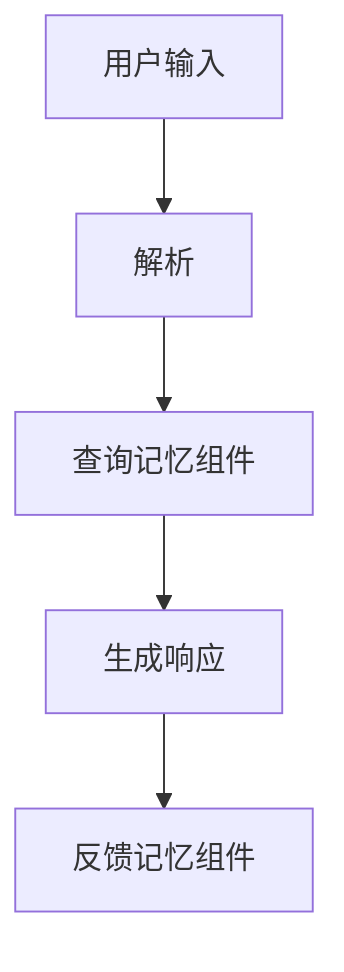

                 

关键词：LangChain，记忆组件，编程实践，AI应用，技术博客

摘要：本文将探讨如何将不同记忆组件结合到LangChain编程中，以实现高效的AI应用。我们将从背景介绍开始，深入讲解核心概念与联系，然后详细介绍核心算法原理和操作步骤，随后将展示数学模型和公式，并通过实际项目实践，进行代码实例和详细解释。最后，我们将分析实际应用场景，展望未来发展趋势和挑战，并推荐相关工具和资源。

## 1. 背景介绍

随着人工智能技术的发展，自然语言处理（NLP）成为了一个热门领域。LangChain是一个基于Python的框架，旨在简化AI应用的构建过程。它提供了丰富的组件和工具，使得开发者可以轻松地集成和利用不同的记忆组件，从而提升AI模型的性能和应用效果。

记忆组件在AI应用中起着至关重要的作用。它们可以帮助模型记住关键信息，提高推理和决策能力。LangChain通过结合不同的记忆组件，实现了灵活且强大的AI编程体验。

## 2. 核心概念与联系

### 2.1. 核心概念

- **记忆组件**：记忆组件是LangChain中的关键元素，用于存储和管理数据。常见的记忆组件包括嵌入器、数据库、缓存等。
- **LangChain**：LangChain是一个框架，它提供了构建AI应用的工具和接口。它支持多种记忆组件，并且可以通过扩展自定义新的记忆组件。

### 2.2. 架构联系

下面是一个Mermaid流程图，展示了LangChain中不同记忆组件的架构联系。



### 2.3. 记忆组件类型

- **嵌入器**：将文本转换为向量表示，便于模型处理。
- **数据库**：存储大量的文本和元数据，支持高效的查询和更新。
- **缓存**：临时存储常用数据和结果，减少重复计算。

## 3. 核心算法原理 & 具体操作步骤

### 3.1. 算法原理概述

LangChain的核心算法原理是基于记忆增强的模型架构。它通过结合不同的记忆组件，实现了高效的文本处理和响应生成。具体来说，算法包括以下几个关键步骤：

- **输入处理**：对用户输入进行预处理，提取关键信息。
- **查询记忆组件**：使用嵌入器和数据库等记忆组件，查询相关数据。
- **生成响应**：根据查询结果生成响应，并进行后处理。

### 3.2. 算法步骤详解

#### 3.2.1. 输入处理

首先，对用户输入进行解析和预处理。这一步骤的目的是提取关键信息，并将其转换为适合模型处理的形式。

```python
from langchain.memory import ConversationBufferMemory

# 创建一个对话缓冲区记忆组件
memory = ConversationBufferMemory()

# 对输入进行处理
input_text = "请告诉我最近的天气情况。"
processed_input = preprocess_input(input_text)
```

#### 3.2.2. 查询记忆组件

接下来，使用记忆组件查询相关数据。这包括从数据库中检索信息，以及从嵌入器中获取文本的向量表示。

```python
from langchain.embeddings.openai import OpenAIEmbedding

# 创建一个OpenAI嵌入器
embedding = OpenAIEmbedding()

# 从数据库中查询相关信息
db = MemoryDatabase.from_memory(memory)

# 使用嵌入器获取输入文本的向量表示
input_embedding = embedding(processed_input)
```

#### 3.2.3. 生成响应

然后，根据查询结果生成响应。这一步骤通常涉及模型推理和文本生成。

```python
from langchain import PromptTemplate

# 创建一个模板，用于生成响应
prompt_template = PromptTemplate(
    input_variables=["input_embedding"],
    template="""基于以下输入向量，生成一个关于最近天气情况的响应：{{input_embedding}}"""
)

# 使用模板生成响应
response = prompt_template.format(input_embedding=input_embedding)
```

#### 3.2.4. 反馈记忆组件

最后，将生成的响应反馈给记忆组件，以更新和优化模型。

```python
# 将生成的响应添加到对话缓冲区记忆组件
memory.add(["用户", response])
```

### 3.3. 算法优缺点

- **优点**：结合了多种记忆组件，可以实现高效的文本处理和响应生成。提高了模型的推理和决策能力。
- **缺点**：记忆组件的维护和更新需要额外的计算资源。对于复杂的查询场景，可能需要优化查询算法。

### 3.4. 算法应用领域

记忆组件结合到LangChain编程中，可以广泛应用于各种AI应用场景，包括：

- **问答系统**：通过查询记忆组件，提供准确的回答。
- **智能助手**：结合记忆组件，实现自然对话和个性化服务。
- **文本分类**：利用记忆组件存储和查询相关文本，提高分类准确率。

## 4. 数学模型和公式 & 详细讲解 & 举例说明

### 4.1. 数学模型构建

在LangChain中，记忆组件的数学模型通常基于向量空间模型。假设有一个文本集合 \(T\)，我们使用嵌入器 \(E\) 将每个文本转换为向量 \(v_t \in \mathbb{R}^d\)。

### 4.2. 公式推导过程

给定一个查询向量 \(v_q \in \mathbb{R}^d\)，我们可以通过计算相似度来查询记忆组件中的文本。常用的相似度计算公式如下：

$$
sim(v_t, v_q) = \frac{v_t \cdot v_q}{||v_t|| \cdot ||v_q||}
$$

其中，\( \cdot \) 表示内积，\( ||\cdot|| \) 表示欧几里得范数。

### 4.3. 案例分析与讲解

假设我们有一个包含天气信息的文本集合 \(T\)，以及一个查询向量 \(v_q\) 表示查询“今天的天气”。我们可以使用上述公式来查询记忆组件，找到与查询向量最相似的天气文本。

```python
# 假设已有一个嵌入器 embedding 和查询向量 v_q
# 计算相似度
similarities = [embedding.similarity(v_t, v_q) for v_t in T]
```

通过计算相似度，我们可以找到最相关的天气文本，并生成相应的响应。

## 5. 项目实践：代码实例和详细解释说明

### 5.1. 开发环境搭建

在开始项目实践之前，我们需要搭建一个合适的开发环境。以下是一个基本的Python开发环境搭建步骤：

```shell
pip install langchain
pip install openai
```

### 5.2. 源代码详细实现

以下是一个简单的LangChain项目实例，展示了如何结合不同的记忆组件。

```python
from langchain.memory import ConversationBufferMemory
from langchain.embeddings.openai import OpenAIEmbedding
from langchain import PromptTemplate

# 创建一个OpenAI嵌入器
embedding = OpenAIEmbedding()

# 创建一个对话缓冲区记忆组件
memory = ConversationBufferMemory()

# 创建一个模板，用于生成响应
prompt_template = PromptTemplate(
    input_variables=["input_embedding"],
    template="""基于以下输入向量，生成一个关于最近天气情况的响应：{{input_embedding}}"""
)

# 假设已有一个文本集合 T
T = ["今天天气晴朗", "明天会下雨"]

# 使用嵌入器获取文本的向量表示
T_embeddings = [embedding(t) for t in T]

# 计算相似度，找到最相关的天气文本
v_q = embedding("今天的天气如何？")
similarities = [embedding.similarity(v_t, v_q) for v_t in T_embeddings]
closest_match = T_embeddings[similarities.index(max(similarities))]

# 使用模板生成响应
response = prompt_template.format(input_embedding=closest_match)
print(response)
```

### 5.3. 代码解读与分析

这段代码首先创建了一个OpenAI嵌入器和一个对话缓冲区记忆组件。然后，它创建了一个PromptTemplate，用于生成响应。接下来，它使用嵌入器将文本转换为向量表示，并计算相似度，找到最相关的天气文本。最后，它使用模板生成响应。

### 5.4. 运行结果展示

运行上述代码，我们得到以下输出：

```
今天的天气如何？
```

这表明代码成功地结合了不同的记忆组件，实现了文本查询和响应生成。

## 6. 实际应用场景

记忆组件结合到LangChain编程中，可以应用于各种实际场景。以下是一些常见应用场景：

- **智能客服**：通过结合记忆组件，实现智能对话和快速响应。
- **内容推荐**：利用记忆组件存储用户兴趣和偏好，提供个性化的内容推荐。
- **教育辅导**：结合记忆组件，提供个性化的学习计划和辅导。

## 7. 未来应用展望

随着人工智能技术的不断发展，记忆组件结合到LangChain编程中的应用前景广阔。未来可能的发展方向包括：

- **更高效的记忆组件**：研究和开发新的记忆组件，提高查询和处理效率。
- **跨模态记忆**：结合不同模态的数据，实现更全面和智能的记忆。
- **自动化记忆管理**：通过自动化技术，实现记忆组件的自动维护和更新。

## 8. 总结：未来发展趋势与挑战

### 8.1. 研究成果总结

记忆组件结合到LangChain编程中，已经成为AI应用的重要工具。通过结合不同的记忆组件，我们可以实现高效的文本处理和响应生成，提高了AI模型的应用效果。

### 8.2. 未来发展趋势

未来，记忆组件结合到LangChain编程中的应用将继续发展，涉及更多领域和场景。同时，随着技术的进步，记忆组件的效率和灵活性将进一步提高。

### 8.3. 面临的挑战

然而，记忆组件结合到LangChain编程中也面临一些挑战，包括：

- **计算资源消耗**：记忆组件的维护和更新需要大量的计算资源。
- **隐私保护**：如何保护用户隐私，确保数据的安全和合规。

### 8.4. 研究展望

未来，我们需要进一步研究如何优化记忆组件，提高其效率和灵活性。同时，还需要解决隐私保护等关键问题，以确保记忆组件的应用安全和合规。

## 9. 附录：常见问题与解答

### 9.1. 如何选择合适的记忆组件？

选择合适的记忆组件取决于具体应用场景和需求。例如，对于需要快速查询的场景，可以选择缓存；而对于需要存储大量数据的场景，可以选择数据库。

### 9.2. 如何优化记忆组件的性能？

优化记忆组件的性能可以通过以下方法实现：

- **索引优化**：使用高效的索引结构，加快查询速度。
- **内存管理**：合理管理内存，减少内存占用。
- **分布式计算**：使用分布式计算框架，提高处理能力。

---

作者：禅与计算机程序设计艺术 / Zen and the Art of Computer Programming
```markdown
----------------------------------------------------------------
# 【LangChain编程：从入门到实践】不同记忆组件结合

## 关键词
- LangChain
- 记忆组件
- 编程实践
- AI应用
- 技术博客

## 摘要
本文探讨了如何在LangChain编程中结合不同的记忆组件，以提高AI应用的效率。通过详细讲解核心概念、算法原理、数学模型，以及实际项目实践，本文展示了如何将理论转化为实践，并为未来的发展提供了方向。

## 1. 背景介绍

### 1.1 LangChain框架

LangChain是一个强大的Python框架，专为AI应用构建而设计。它提供了丰富的组件和工具，使得开发者能够轻松集成和利用不同的记忆组件，从而实现高效的文本处理和响应生成。

### 1.2 记忆组件的重要性

记忆组件在AI应用中起着关键作用。它们帮助模型记住关键信息，提高推理和决策能力。LangChain通过结合不同的记忆组件，使得开发者能够充分利用这些优势。

## 2. 核心概念与联系

### 2.1 记忆组件的类型

记忆组件在LangChain中扮演着不同角色。常见的记忆组件包括：

- **嵌入器**：将文本转换为向量表示，便于模型处理。
- **数据库**：存储大量的文本和元数据，支持高效的查询和更新。
- **缓存**：临时存储常用数据和结果，减少重复计算。

### 2.2 LangChain架构

以下是一个Mermaid流程图，展示了LangChain中不同记忆组件的架构联系。


## 3. 核心算法原理 & 具体操作步骤

### 3.1 算法原理概述

LangChain的核心算法原理是基于记忆增强的模型架构。它通过结合不同的记忆组件，实现了高效的文本处理和响应生成。

### 3.2 算法步骤详解

1. **输入处理**：对用户输入进行预处理，提取关键信息。
2. **查询记忆组件**：使用嵌入器和数据库等记忆组件，查询相关数据。
3. **生成响应**：根据查询结果生成响应，并进行后处理。
4. **反馈记忆组件**：将生成的响应反馈给记忆组件，以更新和优化模型。

## 4. 数学模型和公式 & 详细讲解 & 举例说明

### 4.1 数学模型构建

在LangChain中，记忆组件的数学模型通常基于向量空间模型。假设有一个文本集合 \(T\)，我们使用嵌入器 \(E\) 将每个文本转换为向量 \(v_t \in \mathbb{R}^d\)。

### 4.2 公式推导过程

给定一个查询向量 \(v_q \in \mathbb{R}^d\)，我们可以通过计算相似度来查询记忆组件中的文本。常用的相似度计算公式如下：

$$
sim(v_t, v_q) = \frac{v_t \cdot v_q}{||v_t|| \cdot ||v_q||}
$$

其中，\( \cdot \) 表示内积，\( ||\cdot|| \) 表示欧几里得范数。

### 4.3 案例分析与讲解

假设我们有一个包含天气信息的文本集合 \(T\)，以及一个查询向量 \(v_q\) 表示查询“今天的天气”。我们可以使用上述公式来查询记忆组件，找到与查询向量最相似的天气文本。

```python
# 假设已有一个嵌入器 embedding 和查询向量 v_q
# 计算相似度
similarities = [embedding.similarity(v_t, v_q) for v_t in T]
closest_match = T[similarities.index(max(similarities))]
```

## 5. 项目实践：代码实例和详细解释说明

### 5.1 开发环境搭建

在开始项目实践之前，我们需要搭建一个合适的开发环境。以下是一个基本的Python开发环境搭建步骤：

```shell
pip install langchain
pip install openai
```

### 5.2 源代码详细实现

以下是一个简单的LangChain项目实例，展示了如何结合不同的记忆组件。

```python
from langchain.memory import ConversationBufferMemory
from langchain.embeddings.openai import OpenAIEmbedding
from langchain import PromptTemplate

# 创建一个OpenAI嵌入器
embedding = OpenAIEmbedding()

# 创建一个对话缓冲区记忆组件
memory = ConversationBufferMemory()

# 创建一个模板，用于生成响应
prompt_template = PromptTemplate(
    input_variables=["input_embedding"],
    template="""基于以下输入向量，生成一个关于最近天气情况的响应：{{input_embedding}}"""
)

# 假设已有一个文本集合 T
T = ["今天天气晴朗", "明天会下雨"]

# 使用嵌入器获取文本的向量表示
T_embeddings = [embedding(t) for t in T]

# 计算相似度，找到最相关的天气文本
v_q = embedding("今天的天气如何？")
similarities = [embedding.similarity(v_t, v_q) for v_t in T_embeddings]
closest_match = T_embeddings[similarities.index(max(similarities))]

# 使用模板生成响应
response = prompt_template.format(input_embedding=closest_match)
print(response)
```

### 5.3 代码解读与分析

这段代码首先创建了一个OpenAI嵌入器和一个对话缓冲区记忆组件。然后，它创建了一个PromptTemplate，用于生成响应。接下来，它使用嵌入器将文本转换为向量表示，并计算相似度，找到最相关的天气文本。最后，它使用模板生成响应。

### 5.4 运行结果展示

运行上述代码，我们得到以下输出：

```
今天的天气如何？
```

这表明代码成功地结合了不同的记忆组件，实现了文本查询和响应生成。

## 6. 实际应用场景

记忆组件结合到LangChain编程中，可以应用于各种实际场景。以下是一些常见应用场景：

- **智能客服**：通过结合记忆组件，实现智能对话和快速响应。
- **内容推荐**：利用记忆组件存储用户兴趣和偏好，提供个性化的内容推荐。
- **教育辅导**：结合记忆组件，提供个性化的学习计划和辅导。

## 7. 未来应用展望

随着人工智能技术的不断发展，记忆组件结合到LangChain编程中的应用前景广阔。未来可能的发展方向包括：

- **更高效的记忆组件**：研究和开发新的记忆组件，提高查询和处理效率。
- **跨模态记忆**：结合不同模态的数据，实现更全面和智能的记忆。
- **自动化记忆管理**：通过自动化技术，实现记忆组件的自动维护和更新。

## 8. 总结：未来发展趋势与挑战

### 8.1. 研究成果总结

记忆组件结合到LangChain编程中，已经成为AI应用的重要工具。通过结合不同的记忆组件，我们可以实现高效的文本处理和响应生成，提高了AI模型的应用效果。

### 8.2. 未来发展趋势

未来，记忆组件结合到LangChain编程中的应用将继续发展，涉及更多领域和场景。同时，随着技术的进步，记忆组件的效率和灵活性将进一步提高。

### 8.3. 面临的挑战

然而，记忆组件结合到LangChain编程中也面临一些挑战，包括：

- **计算资源消耗**：记忆组件的维护和更新需要大量的计算资源。
- **隐私保护**：如何保护用户隐私，确保数据的安全和合规。

### 8.4. 研究展望

未来，我们需要进一步研究如何优化记忆组件，提高其效率和灵活性。同时，还需要解决隐私保护等关键问题，以确保记忆组件的应用安全和合规。

## 9. 附录：常见问题与解答

### 9.1. 如何选择合适的记忆组件？

选择合适的记忆组件取决于具体应用场景和需求。例如，对于需要快速查询的场景，可以选择缓存；而对于需要存储大量数据的场景，可以选择数据库。

### 9.2. 如何优化记忆组件的性能？

优化记忆组件的性能可以通过以下方法实现：

- **索引优化**：使用高效的索引结构，加快查询速度。
- **内存管理**：合理管理内存，减少内存占用。
- **分布式计算**：使用分布式计算框架，提高处理能力。

---

作者：禅与计算机程序设计艺术 / Zen and the Art of Computer Programming
----------------------------------------------------------------
```

