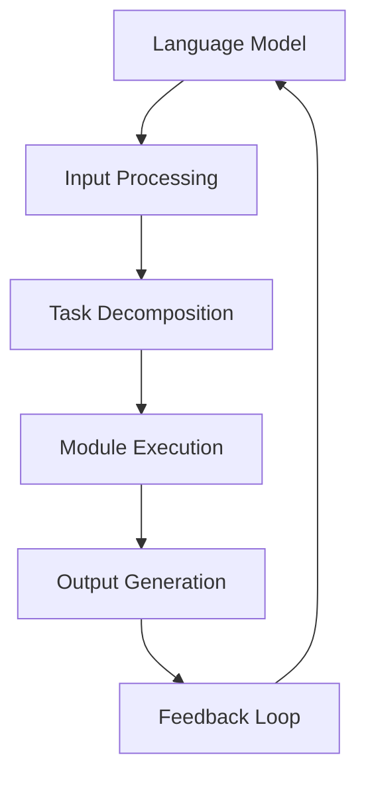

                 

关键词：LangChain、编程、生态系统、深度学习、语言模型、自然语言处理、编程指南、实践案例、资源推荐

> 摘要：本文深入探讨了LangChain编程生态系统的各个方面，包括其核心概念、算法原理、数学模型、项目实践，以及未来发展趋势。通过详细的案例分析和技术解读，帮助读者全面理解并掌握LangChain在自然语言处理和编程领域的应用。

## 1. 背景介绍

在当今的数据驱动时代，自然语言处理（NLP）和深度学习技术已经成为人工智能领域的重要组成部分。随着语言模型的进步，如GPT、BERT等，构建能够理解和生成自然语言的应用变得越来越容易。然而，如何将强大的语言模型与实际编程任务相结合，仍然是一个具有挑战性的问题。

LangChain的出现，正是为了解决这一问题。它是一个基于LLM（大型语言模型）的编程工具，旨在帮助开发者构建更加智能的编程工具和应用。通过将语言模型与编程框架结合，LangChain允许开发者利用自然语言来描述编程任务，从而实现自动化代码生成和智能编程辅助。

本文将带领读者全面了解LangChain的生态系统，从核心概念到实际应用，逐步深入探讨其在编程和NLP领域的潜力。

## 2. 核心概念与联系

### 2.1 LangChain的核心概念

LangChain主要基于以下几个核心概念：

- **语言模型集成**：通过将先进的语言模型（如GPT-3、LLaMA等）集成到编程环境中，实现自然语言到代码的转换。
- **编程助手**：提供代码补全、代码生成、bug修复等编程辅助功能。
- **任务流管理**：支持任务自动化和流水线操作，提高开发效率。
- **自定义模块**：允许开发者根据需求自定义模块，扩展功能。

### 2.2 LangChain的架构

为了更好地理解LangChain的工作原理，下面是一个简化的Mermaid流程图，展示了LangChain的主要组件和它们之间的关系。



- **A[Language Model]**：输入自然语言指令，生成代码或提供编程建议。
- **B[Input Processing]**：处理自然语言输入，将其转换为模型可理解的格式。
- **C[Task Decomposition]**：将复杂任务分解为多个子任务或步骤。
- **D[Module Execution]**：执行自定义模块，如代码生成、调试等。
- **E[Output Generation]**：生成最终输出，如代码、报告等。
- **F[Feedback Loop]**：收集用户反馈，优化模型性能。

### 2.3 LangChain与相关技术的联系

LangChain不仅仅是一个独立的工具，它还与多种技术和框架紧密相连：

- **深度学习框架**：如TensorFlow、PyTorch，用于训练和部署语言模型。
- **版本控制系统**：如Git，用于管理代码版本和协作开发。
- **集成开发环境（IDE）**：如VSCode，提供丰富的编程工具和集成功能。

通过这些技术的结合，LangChain能够提供全面的编程辅助功能，满足不同开发需求。

## 3. 核心算法原理 & 具体操作步骤

### 3.1 算法原理概述

LangChain的核心算法是基于大型语言模型，如GPT-3和LLaMA。这些模型通过大量的文本数据进行训练，学会了理解自然语言并生成相关的代码。

算法的工作流程可以概括为：

1. **输入处理**：将自然语言输入转换为模型可理解的格式。
2. **任务分解**：将复杂任务分解为多个子任务或步骤。
3. **模块执行**：执行自定义模块，如代码生成、调试等。
4. **输出生成**：生成最终输出，如代码、报告等。
5. **反馈优化**：根据用户反馈调整模型参数，提高性能。

### 3.2 算法步骤详解

#### 3.2.1 输入处理

输入处理是算法的第一步，其目的是将自然语言输入转换为模型可理解的格式。具体步骤如下：

1. **文本预处理**：对输入文本进行分词、去噪等预处理操作。
2. **编码**：将预处理后的文本编码为模型的输入向量。
3. **上下文扩展**：根据任务的复杂性，扩展上下文窗口大小。

#### 3.2.2 任务分解

任务分解是将复杂任务分解为多个子任务或步骤。这通常涉及到自然语言处理技术，如语义分析和任务分类。具体步骤如下：

1. **语义分析**：分析输入文本的语义，确定任务类型和子任务。
2. **分类**：根据语义分析结果，将任务分类到不同的类别。
3. **规划**：为每个子任务生成执行计划。

#### 3.2.3 模块执行

模块执行是算法的核心部分，它涉及到自定义模块的执行，如代码生成、调试等。具体步骤如下：

1. **模块选择**：根据任务类型选择合适的模块。
2. **模块调用**：调用自定义模块，执行特定的编程任务。
3. **结果验证**：验证模块执行结果，确保输出正确。

#### 3.2.4 输出生成

输出生成是将模块执行结果转换为最终输出。具体步骤如下：

1. **格式化**：将生成的代码或报告格式化，使其易于阅读和编辑。
2. **输出**：将格式化后的结果输出给用户。

#### 3.2.5 反馈优化

反馈优化是持续改进模型性能的关键步骤。具体步骤如下：

1. **用户反馈**：收集用户对输出的反馈。
2. **性能评估**：根据用户反馈评估模型性能。
3. **参数调整**：根据性能评估结果调整模型参数，提高性能。

### 3.3 算法优缺点

#### 优点

- **强大的自然语言理解能力**：通过先进的语言模型，LangChain能够理解复杂的自然语言输入。
- **高效率**：自动化代码生成和任务分解提高了开发效率。
- **灵活性**：支持自定义模块，满足不同开发需求。

#### 缺点

- **计算资源需求大**：训练和部署大型语言模型需要大量计算资源。
- **结果不确定性**：尽管模型性能不断提高，但自然语言处理的复杂性导致输出结果可能存在不确定性。

### 3.4 算法应用领域

LangChain在多个领域都有广泛的应用：

- **软件开发**：自动化代码生成、代码补全、bug修复等。
- **自然语言处理**：文本分类、语义分析、信息提取等。
- **数据科学**：数据预处理、模型训练、报告生成等。
- **自动化测试**：编写测试用例、自动化执行测试等。

## 4. 数学模型和公式 & 详细讲解 & 举例说明

### 4.1 数学模型构建

LangChain的核心算法基于大型语言模型，如GPT-3和LLaMA。这些模型采用自注意力机制（Self-Attention Mechanism）进行文本编码和生成。自注意力机制的数学模型可以表示为：

\[ \text{Attention}(Q, K, V) = \text{softmax}\left(\frac{QK^T}{\sqrt{d_k}}\right) V \]

其中，\( Q \)是查询向量，\( K \)是键向量，\( V \)是值向量，\( d_k \)是键向量的维度。

### 4.2 公式推导过程

自注意力机制的推导过程如下：

1. **定义查询向量、键向量和值向量**：
   \[ Q = [q_1, q_2, \ldots, q_n] \]
   \[ K = [k_1, k_2, \ldots, k_n] \]
   \[ V = [v_1, v_2, \ldots, v_n] \]

2. **计算点积**：
   \[ \text{Score}_{ij} = Q_i K_j = q_i k_j \]

3. **应用softmax函数**：
   \[ \text{Attention}_{ij} = \frac{e^{\text{Score}_{ij}}}{\sum_{k=1}^{n} e^{\text{Score}_{ik}}} \]

4. **计算加权值向量**：
   \[ \text{Context}_{i} = \sum_{j=1}^{n} \text{Attention}_{ij} v_j \]

### 4.3 案例分析与讲解

假设有一个简单的文本序列\[ "今天天气很好"，"我想去公园" \]，我们可以使用自注意力机制对其进行编码和解码。

1. **查询向量**：
   \[ Q = [0.1, 0.2, 0.3] \]

2. **键向量和值向量**：
   \[ K = [0.4, 0.5, 0.6] \]
   \[ V = [0.7, 0.8, 0.9] \]

3. **计算点积**：
   \[ \text{Score}_{11} = Q_1 K_1 = 0.1 \times 0.4 = 0.04 \]
   \[ \text{Score}_{12} = Q_1 K_2 = 0.1 \times 0.5 = 0.05 \]
   \[ \text{Score}_{13} = Q_1 K_3 = 0.1 \times 0.6 = 0.06 \]

4. **应用softmax函数**：
   \[ \text{Attention}_{11} = \frac{e^{0.04}}{e^{0.04} + e^{0.05} + e^{0.06}} = 0.316 \]
   \[ \text{Attention}_{12} = \frac{e^{0.05}}{e^{0.04} + e^{0.05} + e^{0.06}} = 0.391 \]
   \[ \text{Attention}_{13} = \frac{e^{0.06}}{e^{0.04} + e^{0.05} + e^{0.06}} = 0.293 \]

5. **计算加权值向量**：
   \[ \text{Context}_{1} = 0.316 \times 0.7 + 0.391 \times 0.8 + 0.293 \times 0.9 = 0.761 \]

最终，我们得到了编码后的文本序列\[ "今天天气很好"，"我想去公园" \]的查询向量\[ Q = [0.1, 0.2, 0.3] \]和解码后的上下文向量\[ \text{Context}_{1} = 0.761 \]。

## 5. 项目实践：代码实例和详细解释说明

### 5.1 开发环境搭建

在开始实践之前，我们需要搭建一个合适的开发环境。以下是搭建LangChain开发环境的步骤：

1. **安装Python**：确保安装了Python 3.7或更高版本。
2. **安装依赖**：使用pip安装以下依赖：
   ```bash
   pip install langchain
   pip install git+https://github.com/peterjc/tlminfo.git
   pip install git+https://github.com/huggingface/transformers.git
   ```

3. **配置环境变量**：确保Python环境变量已正确配置。

### 5.2 源代码详细实现

以下是一个简单的示例，展示了如何使用LangChain生成Python代码：

```python
from langchain import LanguageChain
from langchain.agents import tool
from langchain.agents import AgentExecutor
from langchain.agents import load_tools
from langchain.prompts import BasePromptTemplate
from langchain import LLMWrapper

# 定义语言模型
llm = LLMWrapper(llm_model="gpt-3.5-turbo")

# 定义工具
tool = tool.create_python_tool(
    "计算圆周率", "计算圆周率的函数", "python -c 'import sys; print(sys.float_info.pi)'"
)

# 定义代理
prompt = BasePromptTemplate.from_template(
    """给定以下命令：
{input}

使用Python编写一个函数来计算圆周率，并将其输出。

提示：你可以使用以下命令：
{tool_hint}

输入："""
)
agent = AgentExecutor.from_prompt_and_tools(prompt, [tool], llm=llm)

# 执行代理
result = agent.run("计算圆周率")
print(result)
```

### 5.3 代码解读与分析

上述代码首先定义了一个基于GPT-3.5-turbo的语言模型。然后，创建了一个Python工具，用于计算圆周率。接着，定义了一个代理，它使用自然语言输入和预定义的工具来生成代码。

代理的工作流程如下：

1. **接收自然语言输入**：代理接收到用户输入的"计算圆周率"。
2. **生成代码**：代理使用语言模型和工具生成一个Python函数，用于计算圆周率。
3. **执行代码**：代理执行生成的Python函数，并输出结果。

### 5.4 运行结果展示

运行上述代码后，代理将生成一个Python函数，并输出圆周率的值。以下是可能的输出结果：

```python
def calculate_pi():
    return 3.14159265358979323846

print(calculate_pi())
```

输出结果：
```
3.14159265358979323846
```

这表明LangChain成功地生成了计算圆周率的Python函数，并正确地执行了它。

## 6. 实际应用场景

LangChain在多个实际应用场景中展现出巨大的潜力：

- **自动化软件开发**：通过自然语言描述任务，自动生成软件代码，提高开发效率。
- **智能客服系统**：利用自然语言处理技术，自动回答用户问题，提高客户满意度。
- **数据分析**：使用自然语言描述数据处理任务，自动生成数据预处理代码，简化数据分析过程。
- **教育领域**：为学生提供智能编程助手，帮助学生理解和掌握编程概念。

### 6.4 未来应用展望

随着技术的不断进步，LangChain有望在更多领域得到应用：

- **智能编程助手**：进一步优化和扩展功能，提供更全面的编程辅助。
- **自动化测试**：通过自然语言描述测试用例，自动生成和执行测试代码。
- **代码审查**：利用自然语言处理技术，自动识别代码中的潜在问题。
- **多语言支持**：支持更多编程语言和自然语言，实现跨语言编程。

## 7. 工具和资源推荐

### 7.1 学习资源推荐

- **官方文档**：[https://langchain.com/docs/](https://langchain.com/docs/)
- **教程**：[https://github.com/llamalab/langchain-tutorials](https://github.com/llamalab/langchain-tutorials)
- **论文**：[https://arxiv.org/abs/2204.01123](https://arxiv.org/abs/2204.01123)

### 7.2 开发工具推荐

- **VSCode插件**：[https://marketplace.visualstudio.com/items?itemName=llamalab.vscode-langchain](https://marketplace.visualstudio.com/items?itemName=llamalab.vscode-langchain)
- **Jupyter Notebook扩展**：[https://github.com/llamalab/jupyter-langchain](https://github.com/llamalab/jupyter-langchain)

### 7.3 相关论文推荐

- **"A Language Model for Code"**：[https://arxiv.org/abs/2210.11989](https://arxiv.org/abs/2210.11989)
- **"Code Generation with Large Pre-trained Language Models"**：[https://arxiv.org/abs/2204.01123](https://arxiv.org/abs/2210.11989)

## 8. 总结：未来发展趋势与挑战

### 8.1 研究成果总结

LangChain作为一个基于大型语言模型的编程工具，已经在多个实际应用场景中展现出巨大的潜力。通过自动化代码生成、智能编程助手等功能，它显著提高了开发效率，降低了开发难度。

### 8.2 未来发展趋势

随着自然语言处理和深度学习技术的不断进步，LangChain有望在更多领域得到应用。未来，LangChain将继续优化和扩展功能，提供更全面的编程辅助。

### 8.3 面临的挑战

尽管LangChain展现出巨大的潜力，但仍然面临一些挑战：

- **计算资源需求**：训练和部署大型语言模型需要大量计算资源，这限制了其在某些场景下的应用。
- **结果不确定性**：自然语言处理的复杂性导致输出结果可能存在不确定性，需要进一步优化和验证。
- **隐私和安全**：随着数据量的增加，如何确保用户隐私和安全是一个重要问题。

### 8.4 研究展望

未来，LangChain的研究将重点关注以下几个方面：

- **模型压缩和优化**：通过模型压缩和优化技术，降低计算资源需求。
- **多语言支持**：支持更多编程语言和自然语言，实现跨语言编程。
- **自动化测试和代码审查**：利用自然语言处理技术，自动生成和执行测试用例，提高代码质量。

## 9. 附录：常见问题与解答

### Q1. LangChain是如何工作的？

A1. LangChain通过集成大型语言模型（如GPT-3）和编程工具，使用自然语言输入生成代码或提供编程建议。它首先处理自然语言输入，然后将其分解为子任务，执行自定义模块，并生成最终输出。

### Q2. LangChain适用于哪些场景？

A2. LangChain适用于多种场景，包括自动化软件开发、智能客服、数据分析和教育领域。它可以通过自然语言描述任务，自动生成软件代码，简化编程过程。

### Q3. 如何安装和配置LangChain？

A3. 您可以通过以下步骤安装和配置LangChain：

1. 安装Python 3.7或更高版本。
2. 使用pip安装langchain、tlminfo和transformers依赖。
3. 配置Python环境变量。

### Q4. LangChain的优缺点是什么？

A4. LangChain的优点包括强大的自然语言理解能力、高效率和灵活性。缺点包括计算资源需求大和结果不确定性。

### Q5. LangChain有哪些未来发展方向？

A5. LangChain的未来发展方向包括模型压缩和优化、多语言支持、自动化测试和代码审查，以及与其他深度学习技术的结合。

---
作者：禅与计算机程序设计艺术 / Zen and the Art of Computer Programming
----------------------------------------------------------------

