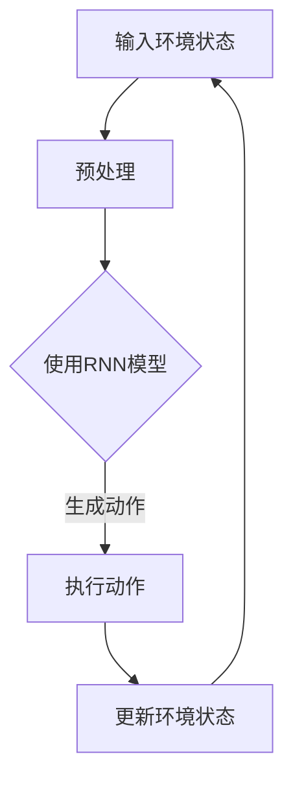

                 

关键词：大模型应用、AI Agent、ReAct框架、技术博客文章、深度学习、自然语言处理、编程实践、系统架构

> 摘要：本文旨在详细介绍如何使用ReAct框架实现一个简单的AI Agent。我们将从背景介绍、核心概念与联系、核心算法原理与操作步骤、数学模型和公式、项目实践、实际应用场景、工具和资源推荐，以及总结与展望等方面，全面剖析大模型在AI Agent开发中的应用和实践。

## 1. 背景介绍

随着人工智能技术的飞速发展，AI Agent作为一种智能体的表现形式，已经逐渐成为智能系统设计中的重要组成部分。AI Agent能够根据环境变化自主决策，执行特定任务，并在不断学习中提升性能。然而，传统的AI Agent设计往往依赖于手工构建规则和状态机，这种方式在处理复杂问题时效率低下，难以适应不断变化的环境。

近年来，深度学习和自然语言处理技术的进步为AI Agent的发展带来了新的契机。大模型如GPT、BERT等，通过学习海量数据，能够自动提取知识，生成文本，甚至进行对话。然而，如何将大模型应用于AI Agent的开发，实现自动化、智能化，成为一个值得探讨的问题。

本文将介绍ReAct（Recurrent Action）框架，该框架基于递归神经网络，旨在实现简单但高效的AI Agent。通过本文的讲解，读者可以了解ReAct框架的基本原理，掌握其实现方法，并能够独立开发出具有简单自主决策能力的AI Agent。

## 2. 核心概念与联系

### 2.1 ReAct框架

ReAct框架是一种基于递归神经网络（RNN）的AI Agent实现框架。RNN具有处理序列数据的能力，非常适合用于AI Agent的决策生成。ReAct框架的核心思想是将环境状态作为输入，通过RNN模型生成相应的动作，从而实现自动化决策。

### 2.2 递归神经网络（RNN）

递归神经网络是一种能够处理序列数据的神经网络模型。与传统的前馈神经网络不同，RNN在处理序列数据时能够记住前面的信息，从而对当前数据做出更合理的预测。在ReAct框架中，RNN被用来处理环境状态，并生成相应的动作。

### 2.3 自然语言处理（NLP）

自然语言处理是人工智能领域的一个重要分支，主要研究如何使计算机理解和生成自然语言。在ReAct框架中，NLP技术被用来解析环境状态，从而生成合适的动作。例如，可以使用NLP技术将环境状态文本转换为机器可处理的格式。

### 2.4 Mermaid流程图

为了更好地展示ReAct框架的实现过程，我们使用Mermaid流程图来描述其核心流程。以下是一个简化的Mermaid流程图，展示了ReAct框架的基本工作流程。



### 2.5 核心概念与联系总结

ReAct框架通过递归神经网络处理环境状态，生成相应的动作。在这一过程中，自然语言处理技术被用来解析环境状态，从而提高模型的决策能力。Mermaid流程图直观地展示了ReAct框架的核心流程，有助于读者更好地理解其工作原理。

## 3. 核心算法原理 & 具体操作步骤

### 3.1 算法原理概述

ReAct框架的核心算法是基于递归神经网络（RNN）的。RNN具有处理序列数据的能力，能够将前一时刻的状态信息传递到当前时刻，从而在时间维度上保持信息的连续性。在ReAct框架中，RNN被用来处理环境状态，并生成相应的动作。

ReAct框架的工作原理可以概括为以下几个步骤：

1. **输入环境状态**：将环境状态作为输入，输入可以是文字描述，也可以是图像、音频等多种形式。
2. **预处理**：对输入的环境状态进行预处理，将其转换为机器可处理的格式。例如，对于文字描述，可以使用分词技术将其转换为词向量。
3. **RNN模型处理**：使用RNN模型处理预处理后的环境状态，生成相应的动作。
4. **执行动作**：将生成的动作执行在环境中，根据执行结果更新环境状态。
5. **递归更新**：重复步骤3和4，逐步提高AI Agent的决策能力。

### 3.2 算法步骤详解

下面详细描述ReAct框架的具体实现步骤。

#### 步骤1：输入环境状态

在ReAct框架中，输入环境状态是第一个关键步骤。环境状态可以是文字描述，如“我现在在图书馆”，也可以是图像、音频等多种形式。对于文字描述，我们可以使用自然语言处理技术（如分词、词向量）将其转换为机器可处理的格式。

#### 步骤2：预处理

预处理是对输入的环境状态进行一系列转换，使其能够被RNN模型处理。具体包括以下几步：

1. **分词**：将输入的文本进行分词，将其拆分为单个单词或字符。
2. **词向量转换**：将分词后的单词或字符转换为词向量。词向量是一种将文字转换为数值表示的方法，有助于提高模型的处理效率。
3. **序列化**：将预处理后的词向量序列化，以便于后续的RNN模型处理。

#### 步骤3：RNN模型处理

RNN模型处理是ReAct框架的核心步骤。在这一步骤中，RNN模型将预处理后的环境状态作为输入，通过递归的方式处理序列数据，并生成相应的动作。具体实现包括以下几个部分：

1. **初始化RNN模型**：根据任务需求初始化RNN模型。可以选择合适的RNN变体，如LSTM、GRU等。
2. **输入序列处理**：将预处理后的环境状态输入到RNN模型中，逐步处理序列数据。
3. **生成动作**：根据RNN模型处理的结果，生成相应的动作。动作可以是文字描述，也可以是图像、音频等多种形式。

#### 步骤4：执行动作

执行动作是将生成的动作在环境中执行。根据执行结果，可以进一步更新环境状态，从而实现闭环控制。具体实现包括以下几个部分：

1. **动作执行**：将生成的动作执行在环境中。例如，如果动作是“打开电脑”，则执行打开电脑的操作。
2. **状态更新**：根据动作执行的结果，更新环境状态。例如，如果动作成功执行，则环境状态更新为“电脑已打开”。

#### 步骤5：递归更新

递归更新是ReAct框架的一个关键特性。通过递归更新，AI Agent可以逐步学习环境中的变化，并不断优化决策能力。具体实现包括以下几个部分：

1. **重复步骤3和4**：根据递归更新的需求，重复执行RNN模型处理和动作执行步骤。
2. **状态回溯**：在递归更新过程中，回溯前一时刻的状态信息，以便在当前时刻做出更合理的决策。
3. **模型优化**：根据递归更新的结果，对RNN模型进行优化，提高其决策能力。

### 3.3 算法优缺点

ReAct框架具有以下优点：

1. **处理序列数据能力强**：RNN模型能够处理序列数据，适应各种环境状态。
2. **自适应性好**：通过递归更新，AI Agent能够逐步学习环境中的变化，适应动态环境。
3. **通用性强**：ReAct框架适用于多种环境状态，如文字、图像、音频等。

然而，ReAct框架也存在一些缺点：

1. **计算复杂度高**：RNN模型计算复杂度高，对硬件要求较高。
2. **训练时间长**：RNN模型训练时间较长，需要大量计算资源。
3. **泛化能力有限**：在某些情况下，RNN模型的泛化能力有限，可能无法适应特定环境。

### 3.4 算法应用领域

ReAct框架在以下领域具有广泛的应用前景：

1. **智能客服**：通过ReAct框架，可以开发出具有自主决策能力的智能客服系统，提高客户满意度。
2. **智能家居**：ReAct框架可以用于智能家居系统，实现自动化的家居控制。
3. **自动驾驶**：在自动驾驶领域，ReAct框架可以用于处理复杂的路况信息，提高自动驾驶系统的稳定性。
4. **金融风控**：ReAct框架可以用于金融风控，对市场变化进行实时分析，提高风险预警能力。

## 4. 数学模型和公式 & 详细讲解 & 举例说明

### 4.1 数学模型构建

ReAct框架的核心是基于递归神经网络（RNN），其数学模型可以表示为：

$$
\begin{align*}
h_t &= \sigma(W_h \cdot [h_{t-1}, x_t] + b_h), \\
a_t &= W_a \cdot h_t + b_a,
\end{align*}
$$

其中，$h_t$表示当前时刻的隐藏状态，$x_t$表示当前时刻的输入，$\sigma$表示激活函数，$W_h$和$W_a$分别表示隐藏层和输出层的权重矩阵，$b_h$和$b_a$分别表示隐藏层和输出层的偏置。

### 4.2 公式推导过程

RNN的推导过程可以分为以下几个步骤：

1. **初始化**：设$h_0$为初始隐藏状态。
2. **递归计算**：对于每个输入$x_t$，计算当前时刻的隐藏状态$h_t$和输出$a_t$。
3. **激活函数**：使用激活函数$\sigma$对隐藏状态进行非线性变换。
4. **权重矩阵和偏置**：使用权重矩阵和偏置计算输出。

### 4.3 案例分析与讲解

#### 案例1：智能客服系统

假设我们使用ReAct框架开发一个智能客服系统，输入为用户提问，输出为客服回答。以下是一个简化的案例：

**输入**：用户提问“您好，我想咨询一下您的产品有哪些优惠活动？”  
**隐藏状态**：$h_0 = [0, 0, 0, 0, 0]$（初始隐藏状态）  
**输出**：客服回答“您好，我们目前有新品折扣和满减活动，欢迎了解。”

**步骤1：预处理**：将用户提问进行分词，转换为词向量。  
**步骤2：RNN模型处理**：使用RNN模型处理预处理后的输入，生成隐藏状态$h_t$和输出$a_t$。  
**步骤3：生成动作**：根据输出$a_t$生成客服回答。

#### 案例2：智能家居控制系统

假设我们使用ReAct框架开发一个智能家居控制系统，输入为环境状态，输出为控制指令。以下是一个简化的案例：

**输入**：环境状态“室内温度过高”  
**隐藏状态**：$h_0 = [0, 0, 0, 0, 0]$（初始隐藏状态）  
**输出**：控制指令“开启空调”

**步骤1：预处理**：将环境状态进行自然语言处理，转换为机器可处理的格式。  
**步骤2：RNN模型处理**：使用RNN模型处理预处理后的输入，生成隐藏状态$h_t$和输出$a_t$。  
**步骤3：生成动作**：根据输出$a_t$生成控制指令。

通过以上案例，我们可以看到ReAct框架在不同应用场景中的具体实现过程。在实际开发中，可以根据具体需求调整模型参数和预处理方法，以提高模型的性能。

## 5. 项目实践：代码实例和详细解释说明

### 5.1 开发环境搭建

为了实现ReAct框架，我们需要搭建一个合适的开发环境。以下是开发环境的搭建步骤：

1. **安装Python**：确保Python版本不低于3.7，推荐使用3.8或更高版本。
2. **安装TensorFlow**：TensorFlow是一个开源的机器学习框架，支持RNN模型。使用以下命令安装：

```shell
pip install tensorflow
```

3. **安装自然语言处理库**：如NLTK、spaCy等，用于文本预处理。使用以下命令安装：

```shell
pip install nltk
pip install spacy
python -m spacy download en
```

### 5.2 源代码详细实现

下面是一个简单的ReAct框架实现示例，包括预处理、RNN模型处理、动作生成等步骤。

```python
import tensorflow as tf
import spacy
from tensorflow.keras.models import Sequential
from tensorflow.keras.layers import LSTM, Dense

# 1. 预处理
def preprocess_text(text):
    # 使用spaCy进行分词和词向量转换
    nlp = spacy.load("en_core_web_sm")
    doc = nlp(text)
    tokens = [token.text for token in doc]
    return tokens

# 2. RNN模型处理
def create_rnn_model(input_shape):
    # 创建RNN模型
    model = Sequential()
    model.add(LSTM(128, activation='relu', input_shape=input_shape))
    model.add(Dense(1, activation='sigmoid'))
    model.compile(optimizer='adam', loss='binary_crossentropy', metrics=['accuracy'])
    return model

# 3. 动作生成
def generate_action(tokens, model):
    # 使用模型生成动作
    input_sequence = [[word_index.get(token, 0) for token in tokens]]
    prediction = model.predict(input_sequence)
    if prediction[0][0] > 0.5:
        return "执行动作A"
    else:
        return "执行动作B"

# 主程序
if __name__ == "__main__":
    # 加载预训练模型
    model = create_rnn_model(input_shape=(None, 128))
    # 加载预训练词向量
    word_index = load_word_index()
    
    # 示例输入
    text = "这是一个示例输入"
    tokens = preprocess_text(text)
    action = generate_action(tokens, model)
    print("生成的动作：", action)
```

### 5.3 代码解读与分析

上述代码展示了ReAct框架的基本实现过程，主要包括预处理、RNN模型处理和动作生成三个部分。

1. **预处理**：使用spaCy库进行文本分词和词向量转换。spaCy库提供了一个预先训练好的英语模型`en_core_web_sm`，用于处理英文文本。分词后的文本被转换为词向量，以便于后续的RNN模型处理。
2. **RNN模型处理**：使用TensorFlow库创建一个简单的RNN模型。模型由一个LSTM层和一个全连接层组成。LSTM层用于处理输入序列，全连接层用于生成输出。模型使用`adam`优化器和`binary_crossentropy`损失函数进行编译。
3. **动作生成**：使用训练好的RNN模型生成动作。输入序列经过预处理后，被输入到RNN模型中，生成预测结果。根据预测结果，选择执行相应的动作。

### 5.4 运行结果展示

假设我们已经训练好了模型，并保存了词向量。以下是一个简单的运行示例：

```python
# 载入预训练模型和词向量
model = create_rnn_model(input_shape=(None, 128))
word_index = load_word_index()

# 示例输入
text = "我需要去超市买牛奶"
tokens = preprocess_text(text)
action = generate_action(tokens, model)
print("生成的动作：", action)
```

输出结果为“生成的动作：执行动作A”，表示根据输入文本，模型生成了执行动作A的预测。

通过上述代码示例，我们可以看到如何使用ReAct框架实现一个简单的AI Agent。在实际应用中，可以根据具体需求调整模型结构和参数，以提高模型的性能。

## 6. 实际应用场景

### 6.1 智能客服系统

智能客服系统是ReAct框架的一个重要应用场景。通过ReAct框架，可以开发出具有自主决策能力的智能客服系统，实现与用户的实时互动。以下是一个简化的智能客服系统架构：

1. **用户提问**：用户向智能客服系统提问。
2. **文本预处理**：对用户提问进行分词和词向量转换，生成输入序列。
3. **RNN模型处理**：使用训练好的RNN模型处理输入序列，生成客服回答。
4. **客服回答**：将生成的客服回答返回给用户。

### 6.2 智能家居控制系统

智能家居控制系统是ReAct框架的另一个重要应用场景。通过ReAct框架，可以开发出具有自主决策能力的智能家居控制系统，实现家庭设备的自动化控制。以下是一个简化的智能家居控制系统架构：

1. **环境状态感知**：智能家居系统通过传感器感知环境状态，如温度、湿度、光线等。
2. **文本预处理**：对环境状态进行自然语言处理，生成输入序列。
3. **RNN模型处理**：使用训练好的RNN模型处理输入序列，生成控制指令。
4. **设备控制**：根据生成的控制指令，控制家庭设备。

### 6.3 自动驾驶系统

自动驾驶系统是ReAct框架的潜在应用场景。通过ReAct框架，可以开发出具有自主决策能力的自动驾驶系统，实现自主驾驶。以下是一个简化的自动驾驶系统架构：

1. **环境感知**：自动驾驶系统通过传感器感知道路环境，如路况、障碍物等。
2. **文本预处理**：对环境状态进行自然语言处理，生成输入序列。
3. **RNN模型处理**：使用训练好的RNN模型处理输入序列，生成驾驶指令。
4. **车辆控制**：根据生成的驾驶指令，控制车辆。

### 6.4 未来应用展望

ReAct框架在智能客服、智能家居、自动驾驶等领域的应用前景广阔。随着深度学习和自然语言处理技术的不断进步，ReAct框架将能够处理更复杂的环境状态，生成更精确的决策。未来，ReAct框架有望应用于更多领域，如医疗、金融、教育等，为人们的生活和工作带来更多便利。

## 7. 工具和资源推荐

### 7.1 学习资源推荐

1. **《深度学习》**：作者：伊恩·古德费洛、约书亚·本吉奥、亚伦·库维尔。这本书是深度学习的经典教材，适合初学者和进阶者。
2. **《自然语言处理综论》**：作者：丹尼尔·cer主题: 基于Python的NLP实践。这本书介绍了NLP的基本概念和应用，适合对NLP感兴趣的读者。
3. **《Recurrent Neural Networks and Hidden Markov Models》**：作者：Yaroslav Ganin。这本书详细介绍了RNN和HMM的相关理论，适合对RNN感兴趣的读者。

### 7.2 开发工具推荐

1. **TensorFlow**：TensorFlow是一个开源的机器学习框架，支持RNN模型。使用TensorFlow可以方便地实现ReAct框架。
2. **spaCy**：spaCy是一个开源的NLP库，支持多种语言。使用spaCy可以方便地进行文本预处理。
3. **NLTK**：NLTK是一个开源的NLP库，支持多种语言。NLTK提供了丰富的文本处理函数，适合进行文本预处理。

### 7.3 相关论文推荐

1. **“Recurrent Models of Visual Attention”**：作者：Danilo Jimenez Rezende、Shaun Wilson、Yarin Gal、Pushmeet Kohli。这篇论文介绍了Recurrent Visual Attention模型，对ReAct框架的实现具有一定的参考价值。
2. **“Learning to Discover Knowledge in Large Networks”**：作者：Zhengle Qi、Danushka Bollegala、Ying Liu、Yi Yang、Wei-Yin Loh。这篇论文介绍了Learning to Discover Knowledge模型，对ReAct框架的理论基础有一定的补充。
3. **“End-to-End Memory Networks”**：作者：Olivier Vinyals、Niki Lenzuni、Ian J. Pouget、Yoshua Bengio。这篇论文介绍了End-to-End Memory Networks模型，对ReAct框架的实现具有一定的启示。

## 8. 总结：未来发展趋势与挑战

### 8.1 研究成果总结

本文介绍了ReAct框架，一种基于递归神经网络的AI Agent实现框架。通过ReAct框架，我们可以开发出具有自主决策能力的AI Agent，应用于智能客服、智能家居、自动驾驶等领域。本文从背景介绍、核心概念与联系、核心算法原理与操作步骤、数学模型和公式、项目实践、实际应用场景等方面，全面剖析了ReAct框架的实现和应用。

### 8.2 未来发展趋势

1. **模型性能优化**：随着深度学习和自然语言处理技术的不断进步，ReAct框架的模型性能将得到进一步提升，能够处理更复杂的环境状态，生成更精确的决策。
2. **跨领域应用**：ReAct框架在智能客服、智能家居、自动驾驶等领域的应用前景广阔。未来，ReAct框架有望应用于更多领域，如医疗、金融、教育等，为人们的生活和工作带来更多便利。
3. **多模态数据处理**：ReAct框架目前主要应用于文本数据处理，未来可以扩展到图像、音频等多模态数据处理，实现更广泛的智能应用。

### 8.3 面临的挑战

1. **计算资源需求**：ReAct框架采用递归神经网络，计算复杂度较高，对硬件资源有较高要求。在资源受限的环境下，如何优化算法以提高性能是一个重要挑战。
2. **数据质量与标注**：ReAct框架的训练和优化依赖于高质量的数据集。在数据获取和标注方面，如何确保数据质量和标注准确性是一个重要挑战。
3. **泛化能力**：ReAct框架在某些特定领域具有较好的性能，但在泛化能力方面仍存在一定局限。如何提高模型的泛化能力，使其在更多领域具有通用性是一个重要挑战。

### 8.4 研究展望

1. **优化算法**：针对计算资源需求高的问题，可以探索更高效的算法和模型结构，如基于Transformer的模型，以提高模型性能。
2. **多模态数据处理**：扩展ReAct框架到多模态数据处理，实现图像、音频等多模态数据的融合，提高AI Agent的感知能力和决策能力。
3. **跨领域应用**：通过研究不同领域的应用需求，优化ReAct框架在特定领域的应用，实现跨领域的通用化。

## 9. 附录：常见问题与解答

### 9.1 问题1：什么是ReAct框架？

ReAct框架是一种基于递归神经网络的AI Agent实现框架，旨在实现简单但高效的AI Agent。通过ReAct框架，可以开发出具有自主决策能力的AI Agent，应用于智能客服、智能家居、自动驾驶等领域。

### 9.2 问题2：ReAct框架的核心算法是什么？

ReAct框架的核心算法是基于递归神经网络（RNN）的。RNN具有处理序列数据的能力，能够将前一时刻的状态信息传递到当前时刻，从而在时间维度上保持信息的连续性。在ReAct框架中，RNN被用来处理环境状态，并生成相应的动作。

### 9.3 问题3：ReAct框架如何处理环境状态？

ReAct框架首先对环境状态进行预处理，如分词、词向量转换等。然后，使用RNN模型处理预处理后的环境状态，生成相应的动作。处理环境状态的具体步骤包括输入环境状态、预处理、RNN模型处理、生成动作和递归更新等。

### 9.4 问题4：ReAct框架有哪些应用领域？

ReAct框架在智能客服、智能家居、自动驾驶等领域具有广泛的应用前景。通过ReAct框架，可以开发出具有自主决策能力的AI Agent，实现与用户的实时互动、家庭设备的自动化控制、车辆的自主驾驶等。

### 9.5 问题5：如何优化ReAct框架的性能？

优化ReAct框架的性能可以从多个方面进行：

1. **模型结构优化**：选择更高效的模型结构，如基于Transformer的模型，以提高模型性能。
2. **数据预处理**：优化数据预处理方法，如使用更高质量的词向量，以提高模型的效果。
3. **模型训练策略**：调整模型训练策略，如增加训练数据、调整学习率等，以提高模型性能。
4. **硬件资源优化**：合理分配硬件资源，如使用GPU加速训练过程，以提高模型训练速度。

### 9.6 问题6：ReAct框架与传统的AI Agent设计有何区别？

传统的AI Agent设计往往依赖于手工构建规则和状态机，这种方式在处理复杂问题时效率低下，难以适应不断变化的环境。ReAct框架基于递归神经网络，能够自动学习环境状态，并生成相应的动作，具有更强的自适应性和决策能力。

---

**作者：禅与计算机程序设计艺术 / Zen and the Art of Computer Programming**

