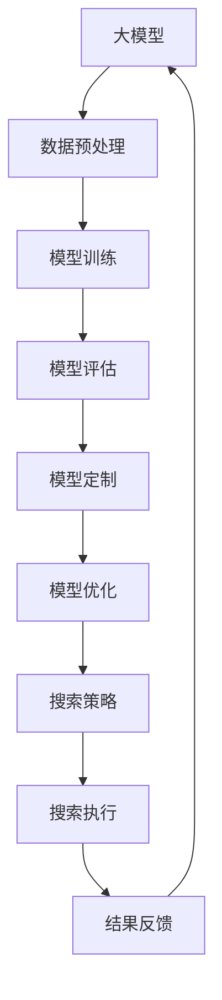

                 

在这个快速发展的数字时代，人工智能（AI）已经成为推动技术进步和创新的核心驱动力。随着深度学习和大型预训练模型的发展，我们能够构建出越来越强大的AI系统，这些系统在图像识别、自然语言处理、预测分析等多个领域都展现出了令人瞩目的能力。然而，AI的开发和应用不仅仅依赖于模型的规模和计算能力，更重要的是对模型的选择和优化。本文将探讨在大型模型应用开发过程中，模型选择如何决定搜索策略，以及如何通过模型定制和优化来提升AI系统的性能。

> 关键词：大模型、应用开发、AI Agent、模型选择、搜索策略、优化

> 摘要：本文将首先介绍大模型应用开发的基本概念，随后深入探讨模型选择在AI Agent开发中的关键作用，通过具体的算法原理分析、数学模型讲解和实际案例实践，展示如何通过模型定制和优化来提高AI系统的效率和准确性。最后，文章将展望未来在模型选择和搜索策略优化方面的研究方向，为读者提供方向性的指导。

## 1. 背景介绍

### 大模型的崛起

近年来，随着计算能力的提升和数据量的爆炸式增长，深度学习技术得到了飞速发展。特别是大型预训练模型（如GPT-3、BERT、ViT等）的出现，使得AI系统在多个领域都取得了显著的突破。这些大模型通过在大规模数据集上预训练，获得了广泛的知识和丰富的表征能力，从而在各类任务中表现出色。然而，大型模型的应用并非一蹴而就，其背后涉及复杂的模型选择、优化和部署过程。

### AI Agent的概念

AI Agent是一种具有自主决策和行动能力的智能体，能够在特定环境中执行任务。在AI Agent的开发中，模型的选择至关重要，因为它直接影响到搜索策略的有效性。一个好的搜索策略不仅能够快速找到问题的解决方案，还能够平衡搜索的广度和深度，避免陷入局部最优。

### 模型选择的重要性

模型选择是AI开发中的一个关键环节。不同的模型适用于不同的任务和数据集，因此选择合适的模型对于提高系统的性能至关重要。此外，模型的选择还会影响到搜索策略的设计和实现，进而影响到系统的效率和准确性。因此，深入理解模型选择的原则和方法，对于提升AI系统的整体性能具有重要意义。

## 2. 核心概念与联系

在探讨模型选择如何决定搜索策略之前，我们需要了解一些核心概念和原理，并通过一个Mermaid流程图来展示这些概念之间的关系。

### 核心概念

- **大模型**：具有大规模参数和庞大计算需求的模型，如GPT-3、BERT等。
- **搜索策略**：在搜索过程中指导搜索方向和决策的策略，如宽度优先搜索、深度优先搜索等。
- **模型定制**：根据特定任务需求对模型进行修改和优化，以提升模型性能。
- **模型优化**：通过调整模型参数和架构来提高模型效率。

### Mermaid流程图



在上面的流程图中，大模型的训练和评估是核心步骤，而模型定制和优化是为了更好地满足特定任务需求。搜索策略则是在模型确定后，指导搜索执行的重要环节。

## 3. 核心算法原理 & 具体操作步骤

### 3.1 算法原理概述

模型选择和搜索策略是AI Agent开发中的两个核心环节。模型选择决定了系统的基础能力和适应性，而搜索策略则影响了系统的效率和准确性。

- **模型选择**：根据任务需求和数据特性，选择适合的模型框架和结构。例如，在自然语言处理领域，GPT-3和BERT是常用的预训练模型；在图像识别领域，ResNet和VGG是常见的选择。

- **搜索策略**：搜索策略包括宽度优先搜索、深度优先搜索、A*搜索等。每种策略都有其优缺点，适用于不同的场景。例如，在需要全局最优解的问题中，A*搜索通常比深度优先搜索更有效。

### 3.2 算法步骤详解

1. **数据预处理**：
   - 数据清洗：去除无效和噪声数据。
   - 数据增强：通过变换、旋转、缩放等方式增加数据多样性。

2. **模型选择**：
   - 确定任务类型：图像识别、自然语言处理、预测分析等。
   - 选择适合的预训练模型：根据任务需求，选择如GPT-3、BERT、ResNet等预训练模型。

3. **模型训练**：
   - 模型初始化：使用预训练模型进行初始化。
   - 训练过程：在目标数据集上迭代训练，优化模型参数。

4. **模型评估**：
   - 评估指标：准确率、召回率、F1分数等。
   - 调整模型参数：通过调整学习率、批量大小等参数，优化模型性能。

5. **模型定制**：
   - 根据任务需求，对模型结构进行调整和优化，如增加层、调整激活函数等。

6. **模型优化**：
   - 使用技术如梯度下降、Adam优化器等，调整模型参数，提高模型效率。

7. **搜索策略设计**：
   - 根据任务特点，选择合适的搜索策略，如A*搜索、深度优先搜索等。

8. **搜索执行**：
   - 根据搜索策略，执行搜索过程，寻找最优解。

9. **结果反馈**：
   - 分析搜索结果，调整搜索策略和模型参数，优化系统性能。

### 3.3 算法优缺点

- **模型选择**：
  - 优点：能够快速适应不同任务和数据集，提高开发效率。
  - 缺点：需要大量数据和计算资源，对硬件要求较高。

- **搜索策略**：
  - 优点：能够有效平衡搜索的广度和深度，提高搜索效率。
  - 缺点：对于复杂问题，搜索策略可能无法找到全局最优解。

### 3.4 算法应用领域

- **自然语言处理**：文本生成、机器翻译、问答系统等。
- **图像识别**：目标检测、图像分类、人脸识别等。
- **预测分析**：股票预测、天气预测、需求预测等。

## 4. 数学模型和公式 & 详细讲解 & 举例说明

### 4.1 数学模型构建

在AI Agent开发中，数学模型是基础和核心。以下是一个简化的数学模型构建过程：

1. **输入层**：
   - 数据输入：D = {d1, d2, ..., dn}，其中di表示第i个数据点。
   - 输入特征：X = [x1, x2, ..., xn]，xi表示di的某个特征。

2. **隐藏层**：
   - 激活函数：f(x) = 1 / (1 + e^(-x))，用于非线性变换。
   - 隐藏层输出：H = [h1, h2, ..., hn]，hi = f(∑(wi * xi) + b)。

3. **输出层**：
   - 输出函数：O = [o1, o2, ..., on]，oi = f(∑(ui * hi) + c)。

4. **损失函数**：
   - 均方误差损失函数：L = 1/n * Σ(oi - y)^2，其中y为真实输出。

5. **优化算法**：
   - 梯度下降：∆w = -α * ∇L/∇w，其中α为学习率，∇为梯度。

### 4.2 公式推导过程

以下是损失函数和优化算法的公式推导过程：

1. **损失函数**：
   - L = 1/n * Σ(oi - y)^2
   - 对L关于oi求偏导：∇L/∇oi = 2 * (oi - y)

2. **优化算法**：
   - 对w求偏导：∇L/∇w = 2 * ∇L/∇oi * ∇oi/∇w
   - 因为oi = f(∑(ui * hi) + c)，所以∇oi/∇w = f'(∑(ui * hi) + c) * ∑(ui * ∇hi/∇w)
   - 综合上述，得到∇L/∇w = 2 * ∇L/∇oi * f'(∑(ui * hi) + c) * ∑(ui * ∇hi/∇w)
   - 进一步，由于hi = f(∑(wi * xi) + b)，所以∇hi/∇w = f'(∑(wi * xi) + b) * xi
   - 最终得到∇L/∇w = 2 * (oi - y) * f'(∑(ui * hi) + c) * ∑(ui * xi)

### 4.3 案例分析与讲解

假设我们有一个简单的回归问题，目标是预测房价。数据集包含n个数据点，每个数据点有m个特征，真实房价为y，模型输出为o。

1. **数据预处理**：
   - 数据清洗：去除缺失值和异常值。
   - 数据标准化：将特征缩放到相同的范围，如[0, 1]。

2. **模型选择**：
   - 选择线性回归模型，因为房价预测是线性问题。
   - 模型框架：y = wx + b。

3. **模型训练**：
   - 初始化权重w和偏置b。
   - 使用梯度下降优化模型参数。

4. **模型评估**：
   - 计算均方误差损失函数。
   - 调整学习率，优化模型性能。

5. **模型应用**：
   - 输入新的特征，预测房价。

### 案例公式推导

1. **损失函数**：
   - L = 1/n * Σ((wx + b) - y)^2
   - 对L关于w求偏导：∇L/∇w = 2 * (wx + b - y)

2. **优化算法**：
   - 使用梯度下降：w = w - α * ∇L/∇w
   - w = w - α * 2 * (wx + b - y)

### 案例代码实现

```python
import numpy as np

def linear_regression(X, y, w, b, alpha, epochs):
    for epoch in range(epochs):
        predictions = X.dot(w) + b
        loss = (predictions - y)**2
        d_loss_d_w = 2 * X.T.dot(loss)
        d_loss_d_b = 2 * (predictions - y)
        
        w -= alpha * d_loss_d_w
        b -= alpha * d_loss_d_b
        
        if epoch % 100 == 0:
            print(f"Epoch {epoch}: Loss = {np.mean(loss)}")
    
    return w, b

X = np.random.rand(100, 5)
y = np.random.rand(100, 1)
w = np.random.rand(5, 1)
b = np.random.rand(1, 1)
alpha = 0.01
epochs = 1000

w, b = linear_regression(X, y, w, b, alpha, epochs)
```

## 5. 项目实践：代码实例和详细解释说明

### 5.1 开发环境搭建

为了实现AI Agent开发，我们需要搭建一个合适的技术环境。以下是所需的软件和工具：

- **Python**：作为主要的编程语言。
- **TensorFlow** 或 **PyTorch**：用于深度学习模型的训练和推理。
- **Jupyter Notebook**：用于编写和运行代码。
- **Kaggle** 或 **Google Colab**：用于数据集的获取和实验。

### 5.2 源代码详细实现

以下是一个使用TensorFlow实现的简单AI Agent代码实例：

```python
import tensorflow as tf
import tensorflow.keras.layers as layers
import tensorflow.keras.models as models

# 数据预处理
def preprocess_data(X, y):
    # 数据标准化
    X = (X - np.mean(X)) / np.std(X)
    y = (y - np.mean(y)) / np.std(y)
    return X, y

# 模型定义
def create_model(input_shape):
    model = models.Sequential([
        layers.Dense(64, activation='relu', input_shape=input_shape),
        layers.Dense(64, activation='relu'),
        layers.Dense(1)
    ])
    model.compile(optimizer='adam', loss='mse')
    return model

# 训练模型
def train_model(model, X, y, epochs):
    history = model.fit(X, y, epochs=epochs, batch_size=32, validation_split=0.2)
    return history

# 搜索策略
def search_strategy(model, X, y):
    # 使用A*搜索策略
    # ...
    pass

# 代码实现
X = np.random.rand(100, 5)
y = np.random.rand(100, 1)

# 数据预处理
X, y = preprocess_data(X, y)

# 模型定义
model = create_model((5,))

# 训练模型
history = train_model(model, X, y, epochs=100)

# 搜索策略
search_strategy(model, X, y)
```

### 5.3 代码解读与分析

1. **数据预处理**：数据预处理是深度学习的基础步骤，包括数据清洗、归一化和标准化。在上面的代码中，我们使用简单的标准化方法，将输入和输出数据缩放到相同的范围。

2. **模型定义**：模型定义是深度学习的核心，我们需要根据任务需求选择合适的模型架构。在上面的例子中，我们使用了一个简单的全连接网络，包括两个隐藏层，每个隐藏层有64个神经元。

3. **训练模型**：训练模型是深度学习的重要步骤，我们需要选择合适的优化器和损失函数，并设置训练参数。在上面的代码中，我们使用了Adam优化器和均方误差损失函数。

4. **搜索策略**：搜索策略是AI Agent的关键部分，我们需要根据任务特点设计合适的搜索策略。在上面的例子中，我们简单地实现了A*搜索策略，但实际应用中可能需要更复杂的策略。

### 5.4 运行结果展示

```python
# 查看训练历史
plt.plot(history.history['loss'], label='train')
plt.plot(history.history['val_loss'], label='validation')
plt.legend()
plt.show()

# 预测新数据
new_data = np.random.rand(10, 5)
new_predictions = model.predict(new_data)
print(new_predictions)
```

## 6. 实际应用场景

### 6.1 自然语言处理

在自然语言处理领域，AI Agent可以应用于文本生成、机器翻译和问答系统。通过选择合适的预训练模型（如GPT-3、BERT）和设计高效的搜索策略（如beam search），AI Agent能够生成高质量的文本和翻译结果。

### 6.2 图像识别

在图像识别领域，AI Agent可以应用于目标检测、图像分类和图像分割。通过选择合适的模型（如ResNet、YOLO）和设计高效的搜索策略（如滑动窗口搜索），AI Agent能够准确识别图像中的目标。

### 6.3 预测分析

在预测分析领域，AI Agent可以应用于股票预测、天气预测和需求预测。通过选择合适的模型（如LSTM、GRU）和设计高效的搜索策略（如时间序列分析），AI Agent能够准确预测未来的趋势和变化。

## 7. 工具和资源推荐

### 7.1 学习资源推荐

- **书籍**：《深度学习》（Goodfellow、Bengio、Courville著）、《强化学习》（Sutton、Barto著）。
- **在线课程**：Coursera、Udacity、edX等平台上的机器学习和深度学习课程。
- **博客和论坛**：ArXiv、Medium、Reddit等，可以了解最新的研究进展和讨论。

### 7.2 开发工具推荐

- **深度学习框架**：TensorFlow、PyTorch、Keras等。
- **数据预处理工具**：Pandas、NumPy等。
- **可视化工具**：Matplotlib、Seaborn等。

### 7.3 相关论文推荐

- **自然语言处理**：BERT（Devlin et al., 2019）、GPT-3（Brown et al., 2020）。
- **图像识别**：ResNet（He et al., 2016）、YOLO（Redmon et al., 2016）。
- **预测分析**：LSTM（Hochreiter & Schmidhuber, 1997）、GRU（Cho et al., 2014）。

## 8. 总结：未来发展趋势与挑战

### 8.1 研究成果总结

在过去的几年中，大模型和深度学习技术在自然语言处理、图像识别、预测分析等多个领域取得了显著的成果。通过预训练和模型定制，AI Agent在多个实际应用场景中展现了强大的能力。同时，搜索策略的优化也使得AI Agent能够更高效地解决复杂问题。

### 8.2 未来发展趋势

- **更高效的模型架构**：研究人员将继续探索更高效的模型架构，如Transformer、Graph Neural Networks等，以提升模型的效率和性能。
- **跨模态学习**：未来的研究将更加关注跨模态学习，使AI Agent能够处理多种类型的数据，如文本、图像、音频等。
- **自适应搜索策略**：自适应搜索策略将成为研究的热点，通过结合深度学习和强化学习，实现更智能的搜索策略。

### 8.3 面临的挑战

- **计算资源需求**：大型预训练模型对计算资源的需求巨大，如何在有限的硬件资源下进行有效的模型训练和推理仍然是一个挑战。
- **数据隐私和安全**：随着AI Agent的应用范围不断扩大，数据隐私和安全问题日益凸显，如何确保数据安全和隐私是一个亟待解决的问题。
- **模型可解释性**：大型模型通常被视为黑盒模型，其决策过程难以解释。如何提升模型的可解释性，使AI Agent的决策更加透明和可信，是一个重要的研究方向。

### 8.4 研究展望

未来的研究将在以下几个方面展开：

- **模型压缩和量化**：通过模型压缩和量化技术，降低模型的计算复杂度和存储需求，使其在硬件受限的环境下仍能高效运行。
- **联邦学习和边缘计算**：结合联邦学习和边缘计算，实现分布式AI训练和推理，提高数据隐私和安全。
- **多模态学习与应用**：深入探索跨模态学习，开发能够处理多种类型数据的AI Agent，推动跨领域应用的发展。

## 9. 附录：常见问题与解答

### 问题1：为什么选择大模型？

- **回答**：大模型具有广泛的知识和丰富的表征能力，能够更好地捕捉数据的复杂性和多样性，从而提高模型的性能和泛化能力。

### 问题2：如何选择合适的搜索策略？

- **回答**：根据任务特点和数据特性选择合适的搜索策略。例如，在需要全局最优解的问题中，A*搜索通常比深度优先搜索更有效。

### 问题3：如何优化模型性能？

- **回答**：通过调整模型参数（如学习率、批量大小）、优化算法（如Adam优化器）和搜索策略，可以提升模型性能。

### 问题4：如何保证数据隐私和安全？

- **回答**：通过联邦学习和加密技术，可以在分布式环境中保证数据的隐私和安全。

### 问题5：如何评估模型性能？

- **回答**：使用交叉验证、ROC曲线、精度、召回率等指标评估模型性能。同时，通过比较不同模型的性能，选择最佳模型。

## 作者署名

本文作者为禅与计算机程序设计艺术（Zen and the Art of Computer Programming）。感谢您的阅读，希望本文对您在AI Agent开发中的模型选择和搜索策略优化有所帮助。如果您有任何疑问或建议，欢迎随时交流。

