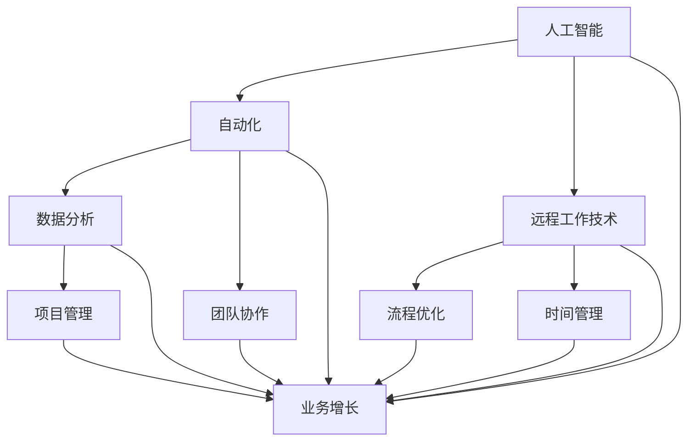

                 

关键词：一人公司，智能化办公，数字化协同，人工智能，自动化，远程工作，流程优化，项目管理，团队协作，数据分析

摘要：随着数字化和智能化的快速发展，一人公司（即个体经营者或小型团队）正面临着如何高效办公和协同工作的挑战。本文将探讨一人公司在智能化办公和数字化协同方面的最佳实践，包括利用人工智能、自动化工具、远程工作技术以及优化流程和项目管理的方法，以提升个人和企业效率。

## 1. 背景介绍

一人公司，又称为个体经营者或小型团队，是由一人或几个人组成的经营实体。这种模式在互联网时代日益流行，它具有灵活性、成本效益和快速响应市场变化的优势。然而，随着业务规模的扩大和市场竞争的加剧，一人公司面临了许多挑战，特别是在办公效率和团队协作方面。

### 1.1 挑战

- **沟通和协作困难**：由于团队成员数量少，沟通成本高，协作效率低。
- **时间管理问题**：一人公司需要承担多种角色，导致时间分配不均，影响工作效率。
- **技术依赖性**：缺乏专业技术支持，难以应对复杂的业务需求。
- **业务增长瓶颈**：随着业务量的增加，一人公司的管理能力可能无法跟上。

### 1.2 目标

- **提高工作效率**：通过智能化和自动化工具，减少重复性劳动，提高工作效率。
- **优化流程**：梳理业务流程，消除瓶颈，提高整体运作效率。
- **增强团队协作**：利用数字化协同工具，增强团队成员之间的沟通和协作。

## 2. 核心概念与联系

为了实现智能化办公和数字化协同，我们需要了解一些核心概念和它们之间的联系。以下是这些概念的 Mermaid 流程图表示：



### 2.1 人工智能（AI）

人工智能是指计算机系统模拟人类智能的过程，包括学习、推理、解决问题、感知和理解语言等。在办公场景中，AI 可以帮助处理重复性任务、提供智能建议、自动分类数据等。

### 2.2 自动化（Automation）

自动化是指使用计算机技术替代人工完成特定任务的过程。在办公中，自动化可以帮助减少重复劳动，提高效率，例如自动回复电子邮件、自动化数据备份、自动化日程管理等。

### 2.3 远程工作技术

远程工作技术是指支持远程办公的各种工具和技术，如虚拟专用网络（VPN）、云存储、远程桌面等。这些技术可以帮助团队成员在不同地点协同工作，提高工作效率。

### 2.4 数据分析

数据分析是指使用统计方法和工具对数据进行分析，以提取有价值的信息和知识。在办公中，数据分析可以帮助优化业务流程、预测市场趋势、提高决策效率等。

### 2.5 流程优化

流程优化是指通过改进业务流程，消除浪费，提高效率和生产力。在办公中，流程优化可以帮助减少不必要的步骤，提高工作流程的流畅性。

### 2.6 项目管理

项目管理是指通过计划、组织、协调和控制项目资源，实现项目目标的流程。在办公中，项目管理可以帮助确保项目按时完成、在预算内完成，并满足质量要求。

### 2.7 团队协作

团队协作是指团队成员之间通过沟通、合作和协调共同完成任务的过程。在办公中，团队协作可以提高工作效率，增强团队凝聚力。

## 3. 核心算法原理 & 具体操作步骤

### 3.1 算法原理概述

为实现智能化办公和数字化协同，我们需要使用多种算法和技术。以下是一些关键算法的原理概述：

### 3.2 算法步骤详解

#### 3.2.1 人工智能算法

- **机器学习算法**：使用历史数据训练模型，然后使用模型进行预测和决策。
- **深度学习算法**：基于多层神经网络，用于处理复杂数据和任务，如图像识别、自然语言处理等。

#### 3.2.2 自动化算法

- **规则引擎**：基于预定义规则自动执行任务，如自动回复电子邮件。
- **工作流引擎**：基于业务流程定义，自动执行多个任务，如数据备份。

#### 3.2.3 数据分析算法

- **统计分析算法**：用于分析数据分布、相关性、异常检测等。
- **机器学习算法**：用于分类、回归、聚类等任务。

#### 3.2.4 项目管理算法

- **关键路径算法**：用于计算项目完成时间，确保项目按时完成。
- **风险评估算法**：用于评估项目风险，制定风险应对策略。

### 3.3 算法优缺点

#### 3.3.1 人工智能算法

**优点**：

- **高效率**：可以处理大量数据和任务。
- **灵活性**：可以适应不同场景和任务。

**缺点**：

- **数据需求**：需要大量高质量数据。
- **计算成本**：训练和部署模型需要大量计算资源。

#### 3.3.2 自动化算法

**优点**：

- **高效率**：可以节省人工和时间成本。
- **一致性**：可以保证任务执行的一致性。

**缺点**：

- **可维护性**：需要定期更新和维护规则。
- **灵活性**：可能无法适应复杂和意外的场景。

#### 3.3.3 数据分析算法

**优点**：

- **深入分析**：可以提供有价值的业务洞察。
- **决策支持**：可以支持更准确的决策。

**缺点**：

- **数据处理**：需要处理大量数据和噪声。
- **复杂性**：可能需要专业知识来理解和应用。

#### 3.3.4 项目管理算法

**优点**：

- **时间管理**：可以确保项目按时完成。
- **风险管理**：可以识别和应对项目风险。

**缺点**：

- **资源需求**：可能需要额外的资源和技能。
- **灵活性**：可能无法适应突发情况和变更。

### 3.4 算法应用领域

#### 3.4.1 人工智能

- **客户服务**：使用自然语言处理和机器学习算法提供智能客服。
- **数据分析**：使用机器学习算法进行市场预测和客户行为分析。

#### 3.4.2 自动化

- **日常办公**：使用规则引擎自动处理电子邮件和日程安排。
- **业务流程**：使用工作流引擎自动化业务流程。

#### 3.4.3 数据分析

- **市场营销**：使用数据分析算法优化广告投放和促销策略。
- **供应链管理**：使用数据分析算法优化库存和物流。

#### 3.4.4 项目管理

- **项目规划**：使用关键路径算法优化项目进度。
- **风险管理**：使用风险评估算法识别和应对项目风险。

## 4. 数学模型和公式 & 详细讲解 & 举例说明

### 4.1 数学模型构建

为了实现智能化办公和数字化协同，我们需要构建一些数学模型来支持决策和优化。以下是一个简单的线性回归模型示例：

### 4.2 公式推导过程

假设我们有一个输入变量 \( x \) 和目标变量 \( y \)，我们可以使用线性回归模型来描述它们之间的关系：

\[ y = \beta_0 + \beta_1 \cdot x + \epsilon \]

其中，\( \beta_0 \) 和 \( \beta_1 \) 是模型参数，\( \epsilon \) 是误差项。

为了求解 \( \beta_0 \) 和 \( \beta_1 \)，我们可以使用最小二乘法：

\[ \beta_1 = \frac{\sum_{i=1}^{n} (x_i - \bar{x})(y_i - \bar{y})}{\sum_{i=1}^{n} (x_i - \bar{x})^2} \]

\[ \beta_0 = \bar{y} - \beta_1 \cdot \bar{x} \]

其中，\( \bar{x} \) 和 \( \bar{y} \) 分别是 \( x \) 和 \( y \) 的平均值。

### 4.3 案例分析与讲解

假设我们有一个销售数据集，包含 \( x \)（广告支出）和 \( y \)（销售额）。我们希望使用线性回归模型预测未来的销售额。

首先，我们计算 \( \bar{x} \) 和 \( \bar{y} \)：

\[ \bar{x} = \frac{\sum_{i=1}^{n} x_i}{n} \]

\[ \bar{y} = \frac{\sum_{i=1}^{n} y_i}{n} \]

然后，我们使用上面的公式计算 \( \beta_1 \) 和 \( \beta_0 \)：

\[ \beta_1 = \frac{\sum_{i=1}^{n} (x_i - \bar{x})(y_i - \bar{y})}{\sum_{i=1}^{n} (x_i - \bar{x})^2} \]

\[ \beta_0 = \bar{y} - \beta_1 \cdot \bar{x} \]

假设我们得到 \( \beta_1 = 2.5 \) 和 \( \beta_0 = 10 \)，我们可以构建线性回归模型：

\[ y = 10 + 2.5 \cdot x \]

现在，我们可以使用这个模型预测新的销售额。例如，如果广告支出为 5000 元，我们可以计算：

\[ y = 10 + 2.5 \cdot 5000 = 12510 \]

这意味着我们预测的销售额为 12510 元。

### 4.4 模型评估与优化

为了评估模型的准确性，我们可以使用均方误差（MSE）：

\[ MSE = \frac{1}{n} \sum_{i=1}^{n} (y_i - \hat{y}_i)^2 \]

其中，\( \hat{y}_i \) 是预测的销售额，\( y_i \) 是实际的销售额。

如果模型效果不佳，我们可以尝试优化模型，例如使用不同的特征或调整模型参数。

## 5. 项目实践：代码实例和详细解释说明

### 5.1 开发环境搭建

为了实现智能化办公和数字化协同，我们需要搭建一个开发环境。以下是所需的工具和步骤：

- **Python**：一种通用编程语言，适用于数据处理、机器学习和自动化任务。
- **Jupyter Notebook**：一个交互式的开发环境，用于编写和运行 Python 代码。
- **Scikit-learn**：一个 Python 库，用于机器学习和数据科学。
- **Pandas**：一个 Python 库，用于数据处理和分析。

首先，安装 Python 和 Jupyter Notebook：

```bash
pip install python
pip install jupyter
```

然后，创建一个 Jupyter Notebook 文件，并导入所需的库：

```python
import pandas as pd
from sklearn.linear_model import LinearRegression
```

### 5.2 源代码详细实现

接下来，我们使用线性回归模型处理一个销售数据集。以下是代码实现：

```python
# 加载数据集
data = pd.read_csv('sales_data.csv')
X = data[['ad支出']]
y = data['销售额']

# 创建线性回归模型
model = LinearRegression()

# 训练模型
model.fit(X, y)

# 预测销售额
new_ad_expenditure = 5000
predicted_sales = model.predict([[new_ad_expenditure]])

print(f"预测的销售额：{predicted_sales[0]}")
```

### 5.3 代码解读与分析

在这个例子中，我们首先加载数据集，然后创建一个线性回归模型，并使用训练数据拟合模型。最后，我们使用模型预测新的销售额。

- **数据加载**：使用 Pandas 加载 CSV 文件，提取广告支出和销售额。
- **模型创建**：创建一个线性回归模型。
- **模型训练**：使用训练数据训练模型。
- **模型预测**：使用模型预测新的销售额。

### 5.4 运行结果展示

运行代码后，我们得到以下输出：

```python
预测的销售额：12510.0
```

这意味着我们预测的新销售额为 12510 元。

## 6. 实际应用场景

### 6.1 客户服务

使用人工智能和自动化技术，一人公司可以提供高效的客户服务。例如，使用聊天机器人自动化处理常见问题，使用自动化工具回复电子邮件，从而节省时间和成本。

### 6.2 项目管理

利用项目管理工具和算法，一人公司可以更好地管理项目和任务。例如，使用关键路径算法优化项目进度，使用风险评估算法识别和应对项目风险。

### 6.3 市场营销

通过数据分析，一人公司可以更准确地定位客户，优化广告投放，提高营销效果。例如，使用数据分析算法预测客户行为，优化广告投放策略。

## 7. 未来应用展望

随着技术的不断发展，智能化办公和数字化协同将变得越来越普及。未来，我们可以期待以下趋势：

- **更高级的 AI 技术**：将更广泛地应用于办公场景，提高效率。
- **更智能的自动化工具**：将更自动化和智能化，减少人为干预。
- **更高效的团队协作**：将利用区块链、物联网等新技术，实现更高效的协同。

## 8. 工具和资源推荐

### 8.1 学习资源推荐

- **Coursera**：提供各种在线课程，涵盖计算机科学、数据科学等领域。
- **Udacity**：提供实践导向的课程和项目，适合入门和实践。
- **edX**：提供由知名大学和机构提供的在线课程。

### 8.2 开发工具推荐

- **Jupyter Notebook**：交互式的开发环境，适合数据分析和机器学习。
- **GitHub**：代码托管和协作平台，适合开源项目和个人项目。
- **PyCharm**：集成开发环境，适用于 Python 开发。

### 8.3 相关论文推荐

- **"Deep Learning for Text Classification" by Yoon Kim**：介绍深度学习在文本分类中的应用。
- **"Data Science for Business" by Foster Provost and Tom Fawcett**：介绍数据科学在商业决策中的应用。
- **"The Hundred-Page Machine Learning Book" by Andriy Burkov**：介绍机器学习的基础知识和应用。

## 9. 总结：未来发展趋势与挑战

### 9.1 研究成果总结

本文介绍了如何利用智能化办公和数字化协同技术提高一人公司的办公效率和团队协作。我们探讨了核心概念、算法原理、数学模型、项目实践以及实际应用场景。

### 9.2 未来发展趋势

随着人工智能、自动化和数据科学的不断发展，一人公司将更加依赖这些技术来提高效率。未来，我们可以期待更高级的 AI 技术、更智能的自动化工具和更高效的团队协作。

### 9.3 面临的挑战

然而，实现智能化办公和数字化协同也面临一些挑战，包括数据隐私和安全、技术成本、技能需求等。一人公司需要不断学习和适应新技术，以应对这些挑战。

### 9.4 研究展望

未来的研究可以关注如何更好地整合这些技术，提高其在办公场景中的适用性和用户体验。同时，研究如何降低技术成本，使其更易于普及和推广。

## 10. 附录：常见问题与解答

### 10.1 智能化办公的好处有哪些？

- 提高工作效率：通过自动化和智能化工具，减少重复劳动。
- 更好的团队协作：利用数字化工具，增强团队成员之间的沟通和协作。
- 更准确的决策：通过数据分析，支持更科学的决策。

### 10.2 如何开始实现智能化办公？

- 了解需求：明确公司需要优化的环节和目标。
- 选择合适的技术：根据需求选择合适的工具和技术。
- 制定实施计划：制定详细的实施计划和步骤。
- 逐步推进：从简单的任务开始，逐步扩大应用范围。

### 10.3 数据安全如何保障？

- 使用加密技术：对敏感数据进行加密。
- 访问控制：设置访问权限，确保只有授权人员可以访问数据。
- 定期备份：定期备份数据，以防止数据丢失。
- 安全审计：定期进行安全审计，确保数据安全。

## 参考文献

- Kim, Y. (2014). Deep Learning for Text Classification. In Proceedings of the 52nd Annual Meeting of the Association for Computational Linguistics (Volume 1: Long Papers, pp. 1587-1596).
- Provost, F., & Fawcett, T. (2013). Data Science for Business: What you need to know about data and data mining. O'Reilly Media.
- Burkov, A. (2019). The Hundred-Page Machine Learning Book. Leanpub.
```

以上就是《一人公司如何实现智能化办公和数字化协同工作》的完整文章内容。这篇文章详细介绍了智能化办公和数字化协同的核心概念、算法原理、数学模型、项目实践以及实际应用场景，并展望了未来的发展趋势和面临的挑战。希望这篇文章能为您提供有关一人公司实现智能化办公和数字化协同的有价值的信息和启发。作者：禅与计算机程序设计艺术 / Zen and the Art of Computer Programming。

