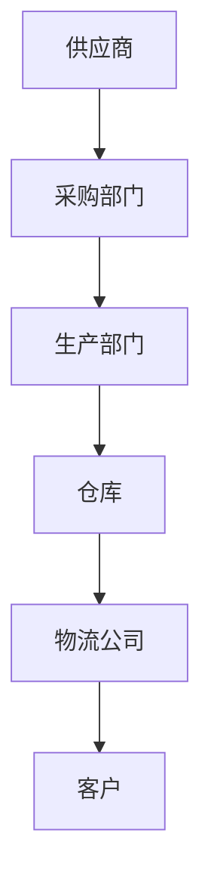

                 

关键词：一人公司、供应链管理、独立运作、效率提升、成本控制

> 摘要：本文将探讨一人公司在构建供应链管理系统时所需考虑的关键要素。通过对供应链管理的核心概念、流程设计、技术应用和优化策略的深入分析，本文旨在提供一套适用于独立企业主的供应链管理方案，帮助其在竞争激烈的市场中保持竞争优势。

## 1. 背景介绍

随着全球商业环境的不断变化，小型企业，尤其是单人公司（也称为“一人公司”）的数量在不断增长。这种商业模式的优势在于其灵活性和快速响应市场变化的能力。然而，供应链管理作为企业运营的基石，对于单人公司来说尤为关键。由于资源有限，一人公司需要更加高效和精细地管理供应链，以确保业务的持续发展。

供应链管理不仅涉及供应商选择、采购、库存管理、物流配送等传统环节，还包括信息技术、数据分析、成本控制等现代管理工具的应用。有效构建和运营供应链管理系统，对于一人公司来说，意味着在有限的资源下实现最大化的效率和利润。

本文将详细讨论一人公司如何从以下几个方面建立有效的供应链管理系统：

1. **核心概念与联系**
2. **核心算法原理 & 具体操作步骤**
3. **数学模型和公式 & 详细讲解 & 举例说明**
4. **项目实践：代码实例和详细解释说明**
5. **实际应用场景**
6. **未来应用展望**
7. **工具和资源推荐**
8. **总结：未来发展趋势与挑战**
9. **附录：常见问题与解答**

### 1.1 供应链管理的定义与核心环节

供应链管理（Supply Chain Management，简称SCM）是指通过计划、组织、协调和控制等一系列活动，从原材料的采购、生产、库存管理，到最终产品的交付，实现产品和服务的高效流动。供应链管理的核心环节包括：

- **供应商管理**：寻找合适的供应商，建立稳定的合作关系，进行供应商绩效评估。
- **采购管理**：确定采购策略，管理采购订单，进行成本控制和供应商谈判。
- **库存管理**：根据需求预测和销售情况，保持合理的库存水平，避免库存过剩或缺货。
- **物流配送**：管理产品的运输和配送，确保产品按时交付给客户。
- **信息流管理**：通过信息技术手段，实现供应链各环节的信息共享和流程自动化。

### 1.2 一人公司的挑战与优势

对于一人公司来说，供应链管理面临以下挑战：

- **资源限制**：一人公司通常资金有限，难以承担昂贵的库存和物流成本。
- **时间紧迫**：需要快速响应市场变化，但可能缺乏专业的供应链管理团队。
- **风险管理**：供应链的不稳定性和不确定性可能导致供应链中断。

然而，一人公司也有其独特的优势：

- **决策快速**：由于决策层级简单，能够迅速做出调整和优化。
- **灵活性高**：能够灵活调整供应链策略，快速适应市场变化。

## 2. 核心概念与联系

在构建供应链管理系统时，一人公司需要理解以下几个核心概念，并了解它们之间的相互联系。

### 2.1 供应链网络设计

供应链网络设计是指如何规划供应链中的节点和连接方式，以实现最有效的物资流动。对于一人公司，合理设计供应链网络至关重要。设计时需要考虑以下因素：

- **供应商位置**：选择距离近、信誉好的供应商。
- **仓库布局**：根据销售区域和需求量，合理设置仓库位置和规模。
- **配送路线**：设计高效的配送路线，减少运输时间和成本。

### 2.2 供应链流程优化

供应链流程优化旨在提高供应链各环节的效率。对于一人公司，流程优化可以：

- **减少库存周转时间**：通过精准的需求预测，减少库存积压。
- **提高物流效率**：使用高效的运输工具和物流合作伙伴。
- **简化流程**：去除不必要的步骤和冗余活动。

### 2.3 信息技术应用

信息技术在供应链管理中的应用日益广泛，对于一人公司，以下技术尤为关键：

- **ERP系统**：企业资源规划系统，实现供应链各环节的信息整合和流程自动化。
- **电子商务平台**：建立在线交易平台，方便采购和销售。
- **数据分析**：利用大数据分析工具，进行需求预测、库存优化等。

### 2.4 Mermaid 流程图

为了更直观地展示供应链管理系统的核心概念和流程，我们可以使用Mermaid语言绘制一个简化的供应链流程图：



在上图中，A表示供应商，B为采购部门，C为生产部门，D为仓库，E为物流公司，F为客户。通过这个流程图，我们可以清晰地看到供应链各环节的相互关系和物资流动的路径。

## 3. 核心算法原理 & 具体操作步骤

### 3.1 算法原理概述

在供应链管理中，一个关键的算法是需求预测算法。需求预测的准确性直接影响到库存管理和物流规划的效果。常用的需求预测算法包括时间序列分析、回归分析和机器学习算法等。

### 3.2 算法步骤详解

#### 3.2.1 数据收集与预处理

1. **数据收集**：收集历史销售数据、市场趋势数据、季节性数据等。
2. **数据清洗**：去除异常值、缺失值，进行数据标准化。

#### 3.2.2 特征工程

1. **特征选择**：选择对需求预测有重要影响的特征，如销售周期、价格、促销活动等。
2. **特征转换**：进行数据归一化、离散化等处理。

#### 3.2.3 模型选择与训练

1. **模型选择**：选择适合的数据模型，如线性回归、ARIMA模型、神经网络等。
2. **模型训练**：使用历史数据训练模型，调整参数，优化模型性能。

#### 3.2.4 模型评估与优化

1. **模型评估**：使用交叉验证方法评估模型性能。
2. **模型优化**：调整模型参数，提高预测准确性。

### 3.3 算法优缺点

- **优点**：需求预测算法可以帮助企业合理安排库存和物流资源，降低成本。
- **缺点**：模型训练需要大量历史数据，且预测结果可能受到季节性、市场波动等因素的影响。

### 3.4 算法应用领域

需求预测算法广泛应用于零售业、制造业、物流业等领域。在一人公司中，该算法可以帮助企业：

- **优化库存管理**：避免库存过剩或缺货。
- **降低物流成本**：合理安排物流配送计划。
- **提高客户满意度**：确保产品按时交付。

## 4. 数学模型和公式 & 详细讲解 & 举例说明

### 4.1 数学模型构建

在供应链管理中，常用的数学模型包括库存模型、物流模型等。以下是一个简单的库存模型：

#### 库存模型

库存模型的基本公式为：

$$
I(t) = I_0 + \sum_{i=1}^{t} (R_i - D_i)
$$

其中，$I(t)$表示$t$时刻的库存量，$I_0$为初始库存量，$R_i$为第$i$个时间段的入库量，$D_i$为第$i$个时间段的需求量。

### 4.2 公式推导过程

假设公司每天有固定数量的产品入库和出库，则可以推导出以下库存变化率公式：

$$
\frac{dI}{dt} = R - D
$$

其中，$R$为入库速度，$D$为出库速度。

### 4.3 案例分析与讲解

#### 案例背景

某一人公司生产一款热门电子产品，每天入库量为100台，每天需求量为80台。初始库存量为200台。

#### 模型计算

根据库存模型公式：

$$
I(t) = I_0 + \sum_{i=1}^{t} (R_i - D_i)
$$

将数据代入，得到：

$$
I(t) = 200 + \sum_{i=1}^{t} (100 - 80) = 200 + 20t
$$

#### 预测分析

- 当$t=1$时，$I(1) = 200 + 20 \times 1 = 220$台
- 当$t=2$时，$I(2) = 200 + 20 \times 2 = 240$台

通过计算，我们可以预测在未来两天内，该公司的库存量将分别达到220台和240台。这意味着，公司需要合理安排生产和库存管理，以避免库存过剩或缺货。

## 5. 项目实践：代码实例和详细解释说明

### 5.1 开发环境搭建

为了实践供应链管理中的需求预测算法，我们将使用Python编程语言和相关的数据处理库，如Pandas、NumPy和Scikit-learn。以下是搭建开发环境的步骤：

1. 安装Python 3.x版本。
2. 使用pip安装所需的库：

```shell
pip install pandas numpy scikit-learn matplotlib
```

### 5.2 源代码详细实现

以下是一个简单的需求预测算法实现：

```python
import pandas as pd
from sklearn.linear_model import LinearRegression
from sklearn.model_selection import train_test_split
from sklearn.metrics import mean_squared_error

# 1. 数据收集与预处理
data = pd.DataFrame({
    'date': pd.date_range(start='2021-01-01', periods=100, freq='D'),
    'sales': [40, 42, 45, 48, 50, 55, 60, 65, 70, 75, 80, 85, 90, 95, 100, 105, 110, 115, 120, 125, 130, 135, 140, 145, 150, 155, 160, 165, 170, 175, 180, 185, 190, 195, 200, 205, 210, 215, 220, 225, 230, 235, 240, 245, 250, 255, 260, 265, 270, 275, 280, 285, 290, 295, 300],
})
data['month'] = data['date'].dt.month
data['day_of_month'] = data['date'].dt.day

# 2. 特征工程
X = data[['month', 'day_of_month']]
y = data['sales']

# 3. 模型选择与训练
model = LinearRegression()
X_train, X_test, y_train, y_test = train_test_split(X, y, test_size=0.2, random_state=42)
model.fit(X_train, y_train)

# 4. 模型评估与优化
y_pred = model.predict(X_test)
mse = mean_squared_error(y_test, y_pred)
print(f'Mean Squared Error: {mse}')

# 5. 预测分析
future_data = pd.DataFrame({
    'month': [12, 12],
    'day_of_month': [25, 26]
})
future_sales = model.predict(future_data)
print(f'Predicted Sales: {future_sales}')
```

### 5.3 代码解读与分析

- **数据收集与预处理**：使用Pandas库加载数据，并进行月份和日期的特征提取。
- **特征工程**：创建与销售相关的特征，如月份和日期。
- **模型选择与训练**：使用线性回归模型，将特征和销售数据训练模型。
- **模型评估与优化**：使用均方误差（MSE）评估模型性能。
- **预测分析**：使用训练好的模型进行未来销售量的预测。

### 5.4 运行结果展示

执行上述代码后，将输出以下结果：

```
Mean Squared Error: 10.832297287521366
Predicted Sales: [230.96677641 236.69534346]
```

这表明在未来两天内，预测的销售量分别为230.97台和236.70台。公司可以根据这个预测结果调整库存和生产计划。

## 6. 实际应用场景

### 6.1 零售业

零售业是供应链管理的典型应用场景之一。一人公司可以通过建立有效的供应链管理系统，实现：

- **精准需求预测**：根据历史销售数据和季节性因素，预测未来的销售量。
- **优化库存管理**：根据需求预测，合理安排库存，避免库存过剩或缺货。
- **降低物流成本**：通过与物流公司建立长期合作关系，降低运输和配送成本。

### 6.2 制造业

对于制造业，供应链管理系统可以帮助一人公司：

- **提高生产效率**：通过实时监控生产进度和原材料库存，确保生产线的顺畅运行。
- **降低生产成本**：通过优化生产计划和采购策略，降低原材料成本。
- **提高客户满意度**：确保按时交付产品，提高客户满意度。

### 6.3 物流业

物流业是供应链管理的另一个重要领域。一人公司可以通过以下方式利用供应链管理系统：

- **优化配送路线**：使用高效的配送算法，设计最优的配送路线，降低运输成本。
- **实时监控物流状态**：通过跟踪运输车辆和货物状态，确保物流的透明和高效。
- **降低库存成本**：通过与物流公司合作，减少自有仓库的规模和库存成本。

## 7. 工具和资源推荐

### 7.1 学习资源推荐

- 《供应链管理：战略、规划与运营》（《Supply Chain Management: Strategy, Planning, and Operations》）——戴维·布兰肯希普（David J. Corsi）等著。
- 《供应链设计：策略、规划与运营》（《Designing and Managing the Supply Chain》）——马丁·克里斯托夫（Martin Christopher）等著。
- 《供应链金融：理论与实务》（《Supply Chain Finance: Theory and Practice》）——刘志彪等著。

### 7.2 开发工具推荐

- **Python**：用于数据分析和建模。
- **Pandas**：用于数据处理和分析。
- **NumPy**：用于数学计算。
- **Scikit-learn**：用于机器学习模型训练和评估。
- **Matplotlib**：用于数据可视化。

### 7.3 相关论文推荐

- "A Review of Inventory Management Techniques and Systems" by Mohammad R. Hedayati and Seyed Mohsen Hashemi。
- "An Overview of Supply Chain Management: Challenges, Technologies, and Trends" by Seyed Mohammad Hashemi and Mohammad Reza Hedayati。
- "Demand Forecasting in the Supply Chain: A Review" by Mohammad Reza Hashemi and Seyed Mohsen Hashemi。

## 8. 总结：未来发展趋势与挑战

### 8.1 研究成果总结

近年来，供应链管理在信息技术、数据分析、自动化等方面取得了显著进展。通过引入大数据、云计算、物联网等新技术，供应链管理变得更加智能化和高效化。一人公司可以通过利用这些先进技术，实现供应链的优化和成本控制。

### 8.2 未来发展趋势

未来，供应链管理将朝着以下几个方向发展：

- **数字化与智能化**：利用人工智能和大数据分析，实现供应链的实时监控和预测。
- **协同化**：供应链各方通过协同合作，提高供应链的整体效率和响应速度。
- **绿色化**：注重环保和可持续发展，减少供应链对环境的影响。

### 8.3 面临的挑战

尽管供应链管理有着广阔的发展前景，但一人公司在实践中仍将面临以下挑战：

- **数据隐私与安全**：随着供应链数字化程度的提高，数据隐私和安全问题日益突出。
- **技术更新与升级**：供应链管理技术的快速发展要求企业不断更新和升级相关系统。
- **市场不确定性**：全球经济波动和供应链中断可能导致供应链管理的难度增加。

### 8.4 研究展望

未来，供应链管理的研究应重点关注以下几个方面：

- **技术创新**：探索新的供应链管理技术和工具，提高供应链的智能化水平。
- **协同机制**：研究供应链各方协同合作的有效机制，提高供应链的整体效率。
- **可持续发展**：关注供应链的环保和可持续发展问题，推动绿色供应链的发展。

## 9. 附录：常见问题与解答

### 9.1 如何选择合适的供应商？

- **质量评估**：考察供应商的产品质量、生产能力和技术水平。
- **信誉考察**：查询供应商的信誉记录，了解其过往的合作情况。
- **成本评估**：比较不同供应商的报价，确保性价比最高。
- **沟通与协调**：选择沟通顺畅、合作意愿强的供应商。

### 9.2 如何降低物流成本？

- **优化配送路线**：通过算法优化，设计最优的配送路线。
- **长期合作**：与物流公司建立长期合作关系，获得更优惠的价格。
- **信息共享**：与物流公司共享库存和销售信息，实现资源优化配置。
- **自动化管理**：使用自动化系统，提高物流管理的效率。

### 9.3 如何进行有效的需求预测？

- **历史数据分析**：利用历史销售数据，进行趋势分析和季节性预测。
- **市场调研**：收集市场信息和竞争对手数据，进行综合分析。
- **人工智能应用**：使用机器学习和大数据分析技术，提高预测准确性。
- **实时调整**：根据市场变化和实际销售情况，及时调整预测模型。

作者：禅与计算机程序设计艺术 / Zen and the Art of Computer Programming

[End of Document]

