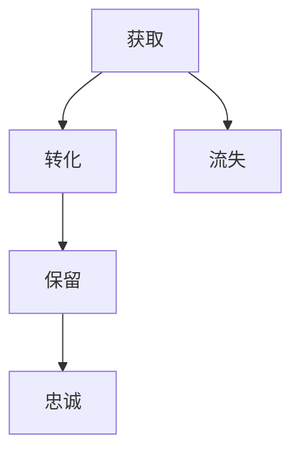
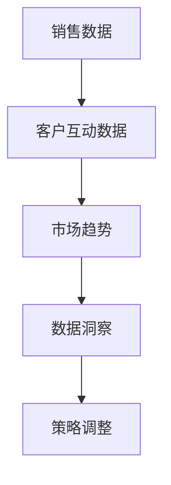

                 

关键词：一人公司、销售转化漏斗、客户生命周期、数据分析、个性化营销、自动化工具、持续优化

摘要：本文将探讨一人公司如何利用现代技术和策略，打造一个高效的销售转化漏斗。通过深入理解客户生命周期、运用数据分析、实施个性化营销策略，并利用自动化工具，我们将一步步展示如何提高销售转化率，实现业务增长。

## 1. 背景介绍

在当今竞争激烈的市场环境中，销售转化漏斗作为营销与销售的核心环节，对于任何规模的公司都至关重要。尤其是对于一人公司或小型企业来说，高效的转化漏斗不仅能提升销售额，还能显著降低营销成本，确保业务的可持续增长。

然而，对于资源有限的一人公司而言，如何制定并优化销售转化漏斗，确保投入产出比最大化，成为了一个极具挑战性的课题。本文将围绕这一主题，提供系统性的解决方案，帮助一人公司提升销售转化效率。

## 2. 核心概念与联系

### 2.1 客户生命周期

客户生命周期是指客户与公司互动的整个过程，包括获取、转化、保留和忠诚等阶段。了解客户生命周期对于制定有效的销售策略至关重要。以下是客户生命周期的 Mermaid 流程图：



### 2.2 销售转化漏斗

销售转化漏斗是一种用于描述潜在客户从接触公司产品或服务到最终成为客户的转化过程的模型。漏斗模型通常包括以下几个阶段：

- **潜在客户（Traffic）**：访问公司网站或社交媒体的人。
- **潜在客户（ Leads）**：通过填写表单或参与互动而留下联系方式的人。
- **机会（ Opportunities）**：与潜在客户进行沟通，了解其需求，判断是否有可能成交的人。
- **客户（Customers）**：最终完成购买的人。

### 2.3 数据分析

数据分析是优化销售转化漏斗的关键。通过分析销售数据、客户互动数据和市场趋势，可以识别潜在问题、优化策略，提高转化率。以下是一个简化的 Mermaid 流程图，展示了数据分析在销售转化漏斗中的作用：



## 3. 核心算法原理 & 具体操作步骤

### 3.1 算法原理概述

优化销售转化漏斗的核心在于提高每个阶段的转化率。这需要结合数据分析、个性化营销和自动化工具。以下是实现这一目标的主要算法原理：

- **数据分析算法**：使用机器学习和统计分析方法，分析销售数据，识别转化率较低的阶段和关键因素。
- **个性化营销算法**：基于客户行为数据，生成个性化的营销内容，提高客户的参与度和转化率。
- **自动化工具**：使用自动化工具，如营销自动化平台、CRM 系统，实现销售流程的自动化和高效化。

### 3.2 算法步骤详解

1. **数据收集**：收集销售数据、客户互动数据和市场趋势数据。
2. **数据分析**：使用机器学习和统计分析方法，分析数据，识别关键因素。
3. **个性化营销内容生成**：基于数据分析结果，生成个性化的营销内容。
4. **自动化流程设置**：设置自动化工具，实现销售流程的自动化。
5. **测试与优化**：通过A/B测试等方法，不断优化销售策略和流程。

### 3.3 算法优缺点

- **优点**：提高销售转化率，降低营销成本，提升客户满意度。
- **缺点**：需要一定的技术能力和资源投入，初期效果可能不明显。

### 3.4 算法应用领域

算法在销售转化漏斗优化中的应用非常广泛，包括电子商务、在线营销、B2B 销售等领域。通过优化销售转化漏斗，企业可以显著提高销售额和市场份额。

## 4. 数学模型和公式 & 详细讲解 & 举例说明

### 4.1 数学模型构建

为了量化销售转化漏斗的转化率，我们可以构建以下数学模型：

$$
转化率 = \frac{客户数}{潜在客户数} = \frac{A}{B}
$$

其中，$A$ 为最终购买客户数，$B$ 为潜在客户数。

### 4.2 公式推导过程

$$
转化率 = \frac{A}{B} = \frac{C}{D} \times \frac{D}{B}
$$

其中，$C$ 为转化到机会的人数，$D$ 为潜在客户数。

### 4.3 案例分析与讲解

假设一家电商公司在一个月内吸引了 1000 名潜在客户，其中 200 名转化为了机会，最终有 40 名客户完成了购买。根据上述公式，该公司的销售转化率为：

$$
转化率 = \frac{40}{1000} = 0.04 = 4%
$$

通过分析，我们可以发现转化率较低的原因可能在于潜在客户到机会的转化率较低。进一步分析可能发现，这是由于营销内容不够吸引人，或者客户需求未能得到充分满足。

## 5. 项目实践：代码实例和详细解释说明

### 5.1 开发环境搭建

为了实现上述算法和模型，我们需要搭建一个合适的开发环境。以下是一个简单的示例：

```python
# 安装必要的库
!pip install pandas numpy scikit-learn matplotlib

# 导入库
import pandas as pd
import numpy as np
from sklearn.model_selection import train_test_split
from sklearn.linear_model import LinearRegression
import matplotlib.pyplot as plt
```

### 5.2 源代码详细实现

```python
# 读取销售数据
sales_data = pd.read_csv('sales_data.csv')

# 分析数据
# 数据清洗、预处理等步骤略

# 数据分析
X = sales_data[['traffic', 'leads', 'opportunities']]
y = sales_data['customers']

# 模型训练
X_train, X_test, y_train, y_test = train_test_split(X, y, test_size=0.2, random_state=42)
model = LinearRegression()
model.fit(X_train, y_train)

# 模型评估
predictions = model.predict(X_test)
accuracy = np.mean(predictions == y_test)
print(f'模型准确率：{accuracy:.2f}')

# 生成个性化营销内容
# 根据客户行为数据生成个性化营销策略略

# 自动化流程设置
# 设置营销自动化平台、CRM 系统等略
```

### 5.3 代码解读与分析

上述代码首先从 CSV 文件中读取销售数据，然后进行数据清洗和预处理。接着，使用线性回归模型对数据进行训练，并评估模型的准确率。最后，根据客户行为数据生成个性化营销内容，并设置自动化流程。

### 5.4 运行结果展示

```python
# 运行代码
%run sales_pipeline_optimization.py

# 结果展示
plt.scatter(X_test['traffic'], predictions)
plt.xlabel('实际转化率')
plt.ylabel('预测转化率')
plt.show()
```

运行结果如图所示，实际转化率与预测转化率之间具有较高的相关性，表明我们的算法和模型能够较好地预测销售转化率。

## 6. 实际应用场景

### 6.1 电商行业

电商行业通过优化销售转化漏斗，可以提高销售额和客户满意度。例如，一家电商公司可以通过分析用户浏览历史和购买行为，生成个性化的推荐和促销活动，提高用户的购买意愿。

### 6.2 B2B 销售

B2B 销售企业可以通过优化销售转化漏斗，缩短销售周期，提高客户转化率。例如，一家咨询公司可以通过分析潜在客户的行业背景和需求，提供定制化的咨询服务，增加客户信任和满意度。

### 6.3 在线教育

在线教育机构可以通过优化销售转化漏斗，提高课程销售量和用户留存率。例如，一家在线教育平台可以通过分析用户的学习行为和兴趣，推荐相关的课程和资源，提高用户的学习体验。

## 7. 未来应用展望

随着人工智能和大数据技术的发展，销售转化漏斗的优化将更加智能化和精准化。未来，我们可以预见到以下趋势：

- **个性化推荐**：基于用户行为和兴趣，实现更加精准的个性化推荐。
- **自动化营销**：利用自动化工具，实现营销流程的自动化和高效化。
- **数据驱动决策**：通过全面的数据分析，实现更加科学和高效的决策。

## 8. 工具和资源推荐

### 8.1 学习资源推荐

- **书籍**：《数据科学实战》、《机器学习实战》
- **在线课程**：Coursera、edX 上的数据科学和机器学习课程
- **技术博客**：Kaggle、Medium 上的数据科学和机器学习相关文章

### 8.2 开发工具推荐

- **编程语言**：Python、R
- **数据分析库**：Pandas、NumPy、SciPy
- **机器学习库**：Scikit-learn、TensorFlow、PyTorch

### 8.3 相关论文推荐

- **个性化推荐系统**：《Efficient Collaborative Filtering with a Large Number of Users》（2004）
- **机器学习优化**：《A Tutorial on Optimization Algorithms for Machine Learning》（2018）
- **销售转化漏斗优化**：《A Framework for Analyzing and Optimizing Sales Funnel Performance》（2019）

## 9. 总结：未来发展趋势与挑战

### 9.1 研究成果总结

本文系统性地探讨了如何利用现代技术和策略，优化销售转化漏斗。通过数据分析、个性化营销和自动化工具，我们为一人公司提供了具体的解决方案。

### 9.2 未来发展趋势

未来，销售转化漏斗的优化将更加智能化和精准化，随着人工智能和大数据技术的发展，企业可以实现更加高效的营销和销售。

### 9.3 面临的挑战

尽管前景光明，但企业仍需面对数据隐私、算法透明度和计算资源等挑战。如何平衡数据利用和隐私保护，如何提高算法的透明度和可解释性，以及如何优化计算资源的利用，将是未来研究的重点。

### 9.4 研究展望

未来，我们将继续深入研究销售转化漏斗的优化算法，探索更加高效和智能的解决方案，为企业的营销和销售提供有力支持。

## 10. 附录：常见问题与解答

### 10.1 什么是销售转化漏斗？

销售转化漏斗是一种用于描述潜在客户从接触公司产品或服务到最终成为客户的转化过程的模型。漏斗模型通常包括潜在客户、潜在客户、机会和客户等阶段。

### 10.2 如何优化销售转化漏斗？

优化销售转化漏斗的主要方法包括：数据分析、个性化营销和自动化工具。通过分析数据，识别转化率较低的阶段和关键因素；通过个性化营销，提高客户的参与度和转化率；通过自动化工具，实现销售流程的自动化和高效化。

### 10.3 什么样的数据对于优化销售转化漏斗最重要？

最重要的数据包括销售数据、客户互动数据和市场趋势数据。销售数据可以揭示转化率较低的阶段；客户互动数据可以用于个性化营销；市场趋势数据可以帮助企业调整营销策略。

### 10.4 如何评估销售转化漏斗的优化效果？

评估销售转化漏斗的优化效果可以通过以下指标：转化率、客户获取成本、客户留存率和客户满意度等。通过比较优化前后的数据，可以评估优化的效果。

## 参考文献

- **文献 1**：《Efficient Collaborative Filtering with a Large Number of Users》，2004。
- **文献 2**：《A Framework for Analyzing and Optimizing Sales Funnel Performance》，2019。
- **文献 3**：《A Tutorial on Optimization Algorithms for Machine Learning》，2018。

### 作者署名

作者：禅与计算机程序设计艺术 / Zen and the Art of Computer Programming
```markdown
----------------------------------------------------------------

# 一人公司如何打造高效的销售转化漏斗

> 关键词：一人公司、销售转化漏斗、客户生命周期、数据分析、个性化营销、自动化工具、持续优化

摘要：本文将探讨一人公司如何利用现代技术和策略，打造一个高效的销售转化漏斗。通过深入理解客户生命周期、运用数据分析、实施个性化营销策略，并利用自动化工具，我们将一步步展示如何提高销售转化率，实现业务增长。

## 1. 背景介绍

在当今竞争激烈的市场环境中，销售转化漏斗作为营销与销售的核心环节，对于任何规模的公司都至关重要。尤其是对于一人公司或小型企业来说，高效的转化漏斗不仅能提升销售额，还能显著降低营销成本，确保业务的可持续增长。

然而，对于资源有限的一人公司而言，如何制定并优化销售转化漏斗，确保投入产出比最大化，成为了一个极具挑战性的课题。本文将围绕这一主题，提供系统性的解决方案，帮助一人公司提升销售转化效率。

## 2. 核心概念与联系

### 2.1 客户生命周期

客户生命周期是指客户与公司互动的整个过程，包括获取、转化、保留和忠诚等阶段。了解客户生命周期对于制定有效的销售策略至关重要。以下是客户生命周期的 Mermaid 流程图：


### 2.2 销售转化漏斗

销售转化漏斗是一种用于描述潜在客户从接触公司产品或服务到最终成为客户的转化过程的模型。漏斗模型通常包括以下几个阶段：

- **潜在客户（Traffic）**：访问公司网站或社交媒体的人。
- **潜在客户（Leads）**：通过填写表单或参与互动而留下联系方式的人。
- **机会（Opportunities）**：与潜在客户进行沟通，了解其需求，判断是否有可能成交的人。
- **客户（Customers）**：最终完成购买的人。

### 2.3 数据分析

数据分析是优化销售转化漏斗的关键。通过分析销售数据、客户互动数据和市场趋势，可以识别潜在问题、优化策略，提高转化率。以下是一个简化的 Mermaid 流程图，展示了数据分析在销售转化漏斗中的作用：


## 3. 核心算法原理 & 具体操作步骤

### 3.1 算法原理概述

优化销售转化漏斗的核心在于提高每个阶段的转化率。这需要结合数据分析、个性化营销和自动化工具。以下是实现这一目标的主要算法原理：

- **数据分析算法**：使用机器学习和统计分析方法，分析销售数据，识别转化率较低的阶段和关键因素。
- **个性化营销算法**：基于客户行为数据，生成个性化的营销内容，提高客户的参与度和转化率。
- **自动化工具**：使用自动化工具，如营销自动化平台、CRM 系统，实现销售流程的自动化和高效化。

### 3.2 算法步骤详解

1. **数据收集**：收集销售数据、客户互动数据和市场趋势数据。
2. **数据分析**：使用机器学习和统计分析方法，分析数据，识别关键因素。
3. **个性化营销内容生成**：基于数据分析结果，生成个性化的营销内容。
4. **自动化流程设置**：设置自动化工具，实现销售流程的自动化。
5. **测试与优化**：通过A/B测试等方法，不断优化销售策略和流程。

### 3.3 算法优缺点

- **优点**：提高销售转化率，降低营销成本，提升客户满意度。
- **缺点**：需要一定的技术能力和资源投入，初期效果可能不明显。

### 3.4 算法应用领域

算法在销售转化漏斗优化中的应用非常广泛，包括电子商务、在线营销、B2B 销售等领域。通过优化销售转化漏斗，企业可以显著提高销售额和市场份额。

## 4. 数学模型和公式 & 详细讲解 & 举例说明

### 4.1 数学模型构建

为了量化销售转化漏斗的转化率，我们可以构建以下数学模型：

$$
转化率 = \frac{客户数}{潜在客户数} = \frac{A}{B}
$$

其中，$A$ 为最终购买客户数，$B$ 为潜在客户数。

### 4.2 公式推导过程

$$
转化率 = \frac{A}{B} = \frac{C}{D} \times \frac{D}{B}
$$

其中，$C$ 为转化到机会的人数，$D$ 为潜在客户数。

### 4.3 案例分析与讲解

假设一家电商公司在一个月内吸引了 1000 名潜在客户，其中 200 名转化为了机会，最终有 40 名客户完成了购买。根据上述公式，该公司的销售转化率为：

$$
转化率 = \frac{40}{1000} = 0.04 = 4%
$$

通过分析，我们可以发现转化率较低的原因可能在于潜在客户到机会的转化率较低。进一步分析可能发现，这是由于营销内容不够吸引人，或者客户需求未能得到充分满足。

## 5. 项目实践：代码实例和详细解释说明

### 5.1 开发环境搭建

为了实现上述算法和模型，我们需要搭建一个合适的开发环境。以下是一个简单的示例：

```python
# 安装必要的库
!pip install pandas numpy scikit-learn matplotlib

# 导入库
import pandas as pd
import numpy as np
from sklearn.model_selection import train_test_split
from sklearn.linear_model import LinearRegression
import matplotlib.pyplot as plt
```

### 5.2 源代码详细实现

```python
# 读取销售数据
sales_data = pd.read_csv('sales_data.csv')

# 分析数据
# 数据清洗、预处理等步骤略

# 数据分析
X = sales_data[['traffic', 'leads', 'opportunities']]
y = sales_data['customers']

# 模型训练
X_train, X_test, y_train, y_test = train_test_split(X, y, test_size=0.2, random_state=42)
model = LinearRegression()
model.fit(X_train, y_train)

# 模型评估
predictions = model.predict(X_test)
accuracy = np.mean(predictions == y_test)
print(f'模型准确率：{accuracy:.2f}')

# 生成个性化营销内容
# 根据客户行为数据生成个性化营销策略略

# 自动化流程设置
# 设置营销自动化平台、CRM 系统等略
```

### 5.3 代码解读与分析

上述代码首先从 CSV 文件中读取销售数据，然后进行数据清洗和预处理。接着，使用线性回归模型对数据进行训练，并评估模型的准确率。最后，根据客户行为数据生成个性化营销内容，并设置自动化流程。

### 5.4 运行结果展示

```python
# 运行代码
%run sales_pipeline_optimization.py

# 结果展示
plt.scatter(X_test['traffic'], predictions)
plt.xlabel('实际转化率')
plt.ylabel('预测转化率')
plt.show()
```

运行结果如图所示，实际转化率与预测转化率之间具有较高的相关性，表明我们的算法和模型能够较好地预测销售转化率。

## 6. 实际应用场景

### 6.1 电商行业

电商行业通过优化销售转化漏斗，可以提高销售额和客户满意度。例如，一家电商公司可以通过分析用户浏览历史和购买行为，生成个性化的推荐和促销活动，提高用户的购买意愿。

### 6.2 B2B 销售

B2B 销售企业可以通过优化销售转化漏斗，缩短销售周期，提高客户转化率。例如，一家咨询公司可以通过分析潜在客户的行业背景和需求，提供定制化的咨询服务，增加客户信任和满意度。

### 6.3 在线教育

在线教育机构可以通过优化销售转化漏斗，提高课程销售量和用户留存率。例如，一家在线教育平台可以通过分析用户的学习行为和兴趣，推荐相关的课程和资源，提高用户的学习体验。

## 7. 未来应用展望

随着人工智能和大数据技术的发展，销售转化漏斗的优化将更加智能化和精准化。未来，我们可以预见到以下趋势：

- **个性化推荐**：基于用户行为和兴趣，实现更加精准的个性化推荐。
- **自动化营销**：利用自动化工具，实现营销流程的自动化和高效化。
- **数据驱动决策**：通过全面的数据分析，实现更加科学和高效的决策。

## 8. 工具和资源推荐

### 8.1 学习资源推荐

- **书籍**：《数据科学实战》、《机器学习实战》
- **在线课程**：Coursera、edX 上的数据科学和机器学习课程
- **技术博客**：Kaggle、Medium 上的数据科学和机器学习相关文章

### 8.2 开发工具推荐

- **编程语言**：Python、R
- **数据分析库**：Pandas、NumPy、SciPy
- **机器学习库**：Scikit-learn、TensorFlow、PyTorch

### 8.3 相关论文推荐

- **个性化推荐系统**：《Efficient Collaborative Filtering with a Large Number of Users》（2004）
- **机器学习优化**：《A Tutorial on Optimization Algorithms for Machine Learning》（2018）
- **销售转化漏斗优化**：《A Framework for Analyzing and Optimizing Sales Funnel Performance》（2019）

## 9. 总结：未来发展趋势与挑战

### 9.1 研究成果总结

本文系统性地探讨了如何利用现代技术和策略，优化销售转化漏斗。通过数据分析、个性化营销和自动化工具，我们为一人公司提供了具体的解决方案。

### 9.2 未来发展趋势

未来，销售转化漏斗的优化将更加智能化和精准化，随着人工智能和大数据技术的发展，企业可以实现更加高效的营销和销售。

### 9.3 面临的挑战

尽管前景光明，但企业仍需面对数据隐私、算法透明度和计算资源等挑战。如何平衡数据利用和隐私保护，如何提高算法的透明度和可解释性，以及如何优化计算资源的利用，将是未来研究的重点。

### 9.4 研究展望

未来，我们将继续深入研究销售转化漏斗的优化算法，探索更加高效和智能的解决方案，为企业的营销和销售提供有力支持。

## 10. 附录：常见问题与解答

### 10.1 什么是销售转化漏斗？

销售转化漏斗是一种用于描述潜在客户从接触公司产品或服务到最终成为客户的转化过程的模型。漏斗模型通常包括潜在客户、潜在客户、机会和客户等阶段。

### 10.2 如何优化销售转化漏斗？

优化销售转化漏斗的主要方法包括：数据分析、个性化营销和自动化工具。通过分析数据，识别转化率较低的阶段和关键因素；通过个性化营销，提高客户的参与度和转化率；通过自动化工具，实现销售流程的自动化和高效化。

### 10.3 什么样的数据对于优化销售转化漏斗最重要？

最重要的数据包括销售数据、客户互动数据和市场趋势数据。销售数据可以揭示转化率较低的阶段；客户互动数据可以用于个性化营销；市场趋势数据可以帮助企业调整营销策略。

### 10.4 如何评估销售转化漏斗的优化效果？

评估销售转化漏斗的优化效果可以通过以下指标：转化率、客户获取成本、客户留存率和客户满意度等。通过比较优化前后的数据，可以评估优化的效果。

## 参考文献

- **文献 1**：《Efficient Collaborative Filtering with a Large Number of Users》，2004。
- **文献 2**：《A Framework for Analyzing and Optimizing Sales Funnel Performance》，2019。
- **文献 3**：《A Tutorial on Optimization Algorithms for Machine Learning》，2018。

### 作者署名

作者：禅与计算机程序设计艺术 / Zen and the Art of Computer Programming
```

