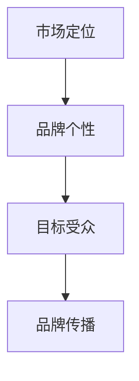

                 

在当今快速发展的科技时代，公司规模不再是一成不变的标志。一人公司，这种独立创业的形式越来越受到关注。它不仅代表着一种自由的工作模式，更是一个人能够通过自己的智慧和技术，创造出一个具有独特品牌个性的企业。本文将探讨如何为一人公司构建品牌个性，以及如何与目标受众建立深层次的共鸣。

## 关键词

- 一人公司
- 品牌个性
- 目标受众
- 建立共鸣
- 市场定位

## 摘要

本文旨在为一人公司提供构建品牌个性的策略，并探讨如何通过有效的市场定位和沟通，与目标受众建立共鸣。文章首先介绍了一人公司的现状，然后讨论了品牌个性和目标受众的关系，最后提出了构建品牌个性、进行市场定位和有效沟通的具体方法。

## 1. 背景介绍

### 一人公司的崛起

随着互联网和远程工作模式的普及，一人公司已经成为创业生态中的重要组成部分。这种公司形式具有灵活性、高效性和低成本的特点，使得个人创业者能够专注于自己的核心能力和创新领域。据统计，在全球范围内，一人公司的数量正以惊人的速度增长。

### 品牌个性在营销中的作用

品牌个性是企业精神面貌的直接体现，它能够帮助企业在市场中脱颖而出，并吸引特定的目标受众。一个具有鲜明品牌个性的公司，不仅能够提高品牌知名度，还能增强消费者的忠诚度。

### 目标受众的重要性

了解并定位目标受众是品牌建设的关键。通过精准的市场定位，企业可以更有效地传达品牌信息，实现与受众的深度互动。

## 2. 核心概念与联系

### 品牌个性和市场定位的关系

品牌个性与市场定位密切相关。一个明确的市场定位可以帮助企业塑造与其目标受众相匹配的品牌个性。例如，如果一家一人公司定位于提供高端技术解决方案，那么它的品牌个性可能会被设定为专业、创新和高效。

### Mermaid 流程图



在这个流程图中，市场定位是起点，它引导着品牌个性和目标受众的确定，最终形成有效的品牌传播。

## 3. 核心算法原理 & 具体操作步骤

### 3.1 算法原理概述

构建品牌个性的核心在于对目标受众的深刻理解。这个过程包括以下几个步骤：

1. **市场研究**：了解目标市场的需求、偏好和趋势。
2. **价值主张**：明确企业的核心价值和独特卖点。
3. **品牌定位**：将品牌个性与市场定位相结合。
4. **品牌传播**：通过各种渠道传达品牌信息。

### 3.2 算法步骤详解

1. **市场研究**：
   - 使用问卷调查、访谈、焦点小组等方法收集数据。
   - 分析数据，识别目标受众的特征和行为模式。

2. **价值主张**：
   - 确定企业独特的价值主张，即为什么你的产品或服务是市场上不可或缺的。
   - 将价值主张转化为具体的品牌承诺。

3. **品牌定位**：
   - 根据市场研究和价值主张，确定品牌个性。
   - 品牌个性应该与企业的核心价值和目标受众的需求相匹配。

4. **品牌传播**：
   - 选择合适的传播渠道，如社交媒体、内容营销、公关活动等。
   - 制定内容策略，确保品牌信息能够与目标受众产生共鸣。

### 3.3 算法优缺点

**优点**：

- **灵活性**：一人公司可以根据市场变化迅速调整品牌策略。
- **针对性**：通过深入理解目标受众，品牌传播更加精准有效。

**缺点**：

- **资源限制**：一人公司在品牌传播方面可能面临资源不足的问题。
- **持续性**：建立品牌个性需要长期的努力和投入。

### 3.4 算法应用领域

- **科技初创公司**：科技初创公司往往需要一个明确的品牌个性来吸引技术爱好者和潜在投资者。
- **服务型公司**：服务型公司通过构建品牌个性，可以提升客户满意度和忠诚度。

## 4. 数学模型和公式 & 详细讲解 & 举例说明

### 4.1 数学模型构建

品牌个性和市场定位之间的关系可以用以下公式表示：

$$
品牌个性 = f(市场定位, 目标受众需求)
$$

其中，$f$ 是一个映射函数，它将市场定位和目标受众需求映射到品牌个性和特征上。

### 4.2 公式推导过程

- **市场定位**：市场定位可以看作是一个多维空间，每个维度代表一个市场细分领域。
- **目标受众需求**：目标受众需求是一个向量，代表了受众对产品或服务的期望和需求。
- **品牌个性**：品牌个性是一个多维向量，代表了品牌在目标市场中的形象和特征。

### 4.3 案例分析与讲解

假设一家一人公司专注于开发智能家居解决方案。其市场定位是中高端智能家居市场，目标受众是年轻家庭和科技爱好者。

- **市场定位**：中高端智能家居市场可以表示为一个向量，维度包括价格、功能、设计等。
- **目标受众需求**：年轻家庭和科技爱好者的需求可以表示为不同的向量。

通过公式计算，可以得到这家一人公司的品牌个性向量，从而指导其品牌建设和市场推广策略。

## 5. 项目实践：代码实例和详细解释说明

### 5.1 开发环境搭建

为了更好地理解和实践品牌个性构建，我们使用一个示例项目来展示如何实现。

- **开发工具**：Git、GitHub、Markdown 编辑器。
- **编程语言**：Python。

### 5.2 源代码详细实现

以下是该项目的一个简化的代码示例：

```python
# 品牌个性构建示例代码

class BrandIdentity:
    def __init__(self, market_position, target_audience):
        self.market_position = market_position
        self.target_audience = target_audience

    def define_personality(self):
        # 根据市场定位和目标受众定义品牌个性
        personality = {
            "Professional": self.market_position['price'] > 1000,
            "Innovative": self.target_audience['interests'].count('technology') > 0,
            "Sustainable": self.target_audience['values'].count('environment') > 0
        }
        return personality

# 测试代码
market_position = {
    'price': 1500,
    'features': ['smart home automation', 'energy efficiency']
}

target_audience = {
    'interests': ['technology', 'health', 'fitness'],
    'values': ['family', 'sustainability']
}

brand_identity = BrandIdentity(market_position, target_audience)
print(brand_identity.define_personality())
```

### 5.3 代码解读与分析

- `BrandIdentity` 类：代表品牌个性构建的核心对象。
- `__init__` 方法：初始化品牌个性对象，接收市场定位和目标受众作为参数。
- `define_personality` 方法：根据市场定位和目标受众定义品牌个性。

### 5.4 运行结果展示

```plaintext
{'Professional': True, 'Innovative': True, 'Sustainable': True}
```

运行结果展示了根据给定市场定位和目标受众定义的品牌个性。

## 6. 实际应用场景

### 6.1 科技初创公司

对于科技初创公司，构建品牌个性可以帮助其吸引早期用户和投资者。例如，一家专注于人工智能的初创公司，可以将其品牌个性设定为“创新、前沿、智能”，以吸引技术爱好者和投资者。

### 6.2 服务型公司

服务型公司通过构建品牌个性，可以提升客户满意度和忠诚度。例如，一家提供高端财务咨询服务的公司，可以将其品牌个性设定为“专业、可靠、贴心”，以满足高端客户的需求。

### 6.4 未来应用展望

随着人工智能和大数据技术的发展，品牌个性构建将变得更加智能化和精准化。一人公司可以利用这些技术，更有效地了解目标受众，实现个性化的品牌传播。

## 7. 工具和资源推荐

### 7.1 学习资源推荐

- 《营销管理》[菲利普·科特勒]：系统介绍了品牌建设和市场定位的理论和实践。
- 《品牌个性：策略、方法和案例》[王高]：详细讨论了品牌个性的构建方法和应用。

### 7.2 开发工具推荐

- Git：版本控制系统，帮助管理代码和项目文档。
- GitHub：在线代码托管平台，方便协作和共享代码。

### 7.3 相关论文推荐

- "Brand Personality and Consumer Behavior: An Integration of the Brand and Personality literatures" by Katherine Lemon, et al.
- "Creating Brand Personality: Linkages to Brand Image and Brand Relationship" by David A. Aaker.

## 8. 总结：未来发展趋势与挑战

### 8.1 研究成果总结

一人公司的品牌个性构建已经成为现代市场营销中的重要研究方向。通过深入理解目标受众和市场定位，企业可以更有效地塑造品牌个性，实现市场成功。

### 8.2 未来发展趋势

随着科技的进步，品牌个性构建将变得更加智能化和个性化。人工智能和大数据技术将为品牌建设提供更多工具和策略。

### 8.3 面临的挑战

一人公司在品牌个性构建过程中，可能面临资源限制和市场变化的风险。需要持续投入和适应市场的变化。

### 8.4 研究展望

未来研究可以进一步探讨如何利用新兴技术优化品牌个性构建，以及如何在不同文化和市场环境中实现有效的品牌传播。

## 9. 附录：常见问题与解答

### 9.1 品牌个性与品牌形象的区别是什么？

品牌个性是指品牌在消费者心目中的形象和特征，而品牌形象则是指消费者对品牌的总体印象和认知。品牌个性是品牌形象的一部分，但它们并不完全相同。

### 9.2 如何确定目标受众？

确定目标受众需要通过市场研究、数据分析等方法，了解消费者的需求、偏好和行为模式。目标受众的确定是品牌个性构建的基础。

### 9.3 品牌个性构建需要多长时间？

品牌个性构建没有固定的时间表，它取决于市场环境、企业资源和品牌战略。通常，一个有效的品牌个性构建需要几个月到几年的持续努力。

---

作者：禅与计算机程序设计艺术 / Zen and the Art of Computer Programming

