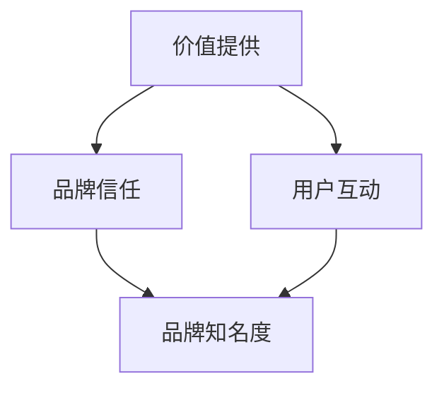

                 

品牌内容营销在当前的市场环境中扮演着至关重要的角色。尤其是在信息爆炸的时代，企业需要通过有效的品牌内容来建立自己的市场地位、吸引目标受众并促进行动转化。对于一人公司来说，品牌内容营销尤为关键，因为它们往往缺乏大规模营销团队的资源。本文将探讨一人公司的品牌内容营销策略与执行，旨在帮助独立创业者或小型企业主构建强大的品牌影响力。

> **关键词：**
> - 品牌内容营销
> - 一人公司
> - 内容策略
> - 营销执行
> - 社交媒体
> - SEO

> **摘要：**
> 本文将深入探讨一人公司在品牌内容营销方面的策略与执行。文章首先介绍了品牌内容营销的基本概念和重要性，随后分析了当前的市场趋势和挑战。接着，文章提出了一套针对一人公司的内容营销策略，包括目标受众分析、内容创作与优化、社交媒体运用以及SEO策略。最后，文章给出了具体的执行步骤和工具推荐，以及未来发展趋势与面临的挑战。

## 1. 背景介绍

一人公司的概念起源于20世纪末期，指的是由单个人运营的企业。这种模式具有极高的灵活性，但也面临着许多挑战，特别是营销方面。与传统的大型企业相比，一人公司通常没有丰富的资源和庞大的市场团队。因此，他们必须依靠创新和高效的品牌内容营销来吸引并维持客户。

### 品牌内容营销的基本概念

品牌内容营销是一种通过创造和分发有价值的内容来吸引和转化目标受众的营销策略。这种内容可以是文章、视频、图像、音频、播客等形式，其核心在于提供有价值的信息，建立品牌信任，并促进用户互动。

### 一人公司的市场地位

一人公司在市场上具有独特的地位，它们往往专注于特定的细分市场，提供定制化的产品或服务。这种专注性使得一人公司能够在竞争激烈的环境中脱颖而出。然而，这也意味着他们需要更加精细地策划和执行营销策略。

## 2. 核心概念与联系

### 市场趋势

随着互联网的普及和社交媒体的兴起，品牌内容营销已经成为企业获取关注和转化的关键手段。以下是当前市场的一些趋势：

- **个性化内容：** 随着消费者对个性化体验的需求增加，提供个性化的内容成为吸引和留住客户的关键。
- **互动性：** 社交媒体和其他互动平台使得企业与消费者之间的互动变得更加容易，这种互动能够提高品牌忠诚度。
- **视频内容：** 视频内容在互联网上的受欢迎程度持续上升，尤其是短视频和直播，它们提供了更加生动和直接的体验。
- **SEO优化：** 随着搜索引擎算法的不断更新，SEO优化成为确保品牌内容在搜索引擎中可见性的关键。

### 挑战

尽管品牌内容营销具有巨大潜力，但一人公司仍面临以下挑战：

- **资源有限：** 一人公司通常缺乏大型企业所拥有的资源和预算，这限制了他们在内容营销方面的投入。
- **时间压力：** 单个个体往往需要负责多个方面的工作，这可能导致内容创作和营销活动的时间压力。
- **市场竞争：** 市场上已经有许多品牌在争夺注意力，这使得一人公司需要更加创新和精准的营销策略来脱颖而出。

### 一人公司的内容营销策略

为了克服上述挑战，一人公司需要制定一套全面的内容营销策略，包括以下方面：

- **目标受众分析：** 确定目标受众，了解他们的需求和偏好，以便创建有针对性的内容。
- **内容创作与优化：** 创造有价值、高质量的内容，并确保其能够被搜索引擎和受众发现。
- **社交媒体运用：** 利用社交媒体平台来传播内容，增加品牌曝光和互动。
- **SEO策略：** 通过SEO优化，提高品牌在搜索引擎中的排名。

### 联系

品牌内容营销的核心概念与一人公司的需求紧密相连。通过创建和分发有价值的内容，一人公司可以建立品牌知名度、吸引目标受众并促进销售。以下是品牌内容营销的核心概念与一人公司需求的联系：

- **价值提供：** 品牌内容营销的目标是提供有价值的信息，满足目标受众的需求。这对一人公司尤为重要，因为他们通常无法通过传统广告来吸引用户。
- **品牌信任：** 通过持续的内容营销活动，一人公司可以建立品牌信任，这对于在竞争激烈的市场中脱颖而出至关重要。
- **用户互动：** 社交媒体和其他互动平台为一人公司提供了一个与用户直接互动的机会，这有助于建立客户关系并提高品牌忠诚度。

以下是品牌内容营销的核心概念与一人公司需求之间的Mermaid流程图：



## 3. 核心算法原理 & 具体操作步骤

### 3.1 算法原理概述

品牌内容营销的核心算法可以概括为以下三个关键步骤：

1. **目标受众分析：** 确定目标受众，了解他们的特征、需求和偏好。
2. **内容创作与优化：** 根据目标受众的特点，创作有针对性的内容，并确保其能够被搜索引擎和受众发现。
3. **社交媒体运用与SEO：** 通过社交媒体平台传播内容，并利用SEO策略提高品牌在搜索引擎中的排名。

### 3.2 算法步骤详解

#### 3.2.1 目标受众分析

1. **定义目标受众：** 明确您想要吸引的用户群体，包括他们的年龄、性别、地理位置、职业等。
2. **了解需求与偏好：** 通过市场调研、用户访谈和数据分析，了解目标受众的需求和偏好。
3. **创建用户画像：** 基于收集到的信息，创建详细的目标受众画像，以便在内容创作过程中参考。

#### 3.2.2 内容创作与优化

1. **确定内容主题：** 根据目标受众的画像，选择能够满足他们需求的主题。
2. **创作高质量内容：** 以独特、有价值的方式呈现内容，确保其能够吸引目标受众。
3. **SEO优化：** 使用关键词研究工具，确定与目标受众相关的高搜索量关键词，并将其纳入内容中。

#### 3.2.3 社交媒体运用与SEO

1. **社交媒体传播：** 选择适合的社交媒体平台，发布内容并鼓励用户互动。
2. **建立社交媒体账号：** 在多个社交媒体平台上建立账号，并保持活跃。
3. **SEO策略：** 优化网站结构和内容，提高搜索引擎排名，从而增加流量。

### 3.3 算法优缺点

#### 优点

- **高性价比：** 品牌内容营销通常比传统广告更具成本效益，尤其对一人公司而言。
- **灵活性：** 一人公司可以根据市场变化和用户反馈，灵活调整内容营销策略。
- **长期效果：** 良好的内容营销能够建立品牌声誉和用户忠诚度，从而带来长期收益。

#### 缺点

- **时间需求：** 内容营销需要持续的时间和精力投入，这对于一人公司来说可能是一个挑战。
- **效果评估：** 虽然内容营销具有长期效果，但短期内可能难以量化其具体效果。
- **市场竞争：** 竞争激烈的市场环境中，高质量的内容创作和优化至关重要，这要求更高的专业知识和资源。

### 3.4 算法应用领域

品牌内容营销的应用领域广泛，包括但不限于以下方面：

- **电子商务：** 通过有针对性的内容吸引潜在客户，促进销售转化。
- **教育行业：** 通过专业的内容建立权威性，吸引学生和家长。
- **健康与医疗：** 提供健康知识和咨询服务，建立专业形象。
- **咨询公司：** 通过专业内容展示公司实力，吸引潜在客户。

## 4. 数学模型和公式 & 详细讲解 & 举例说明

### 4.1 数学模型构建

品牌内容营销的数学模型可以基于以下几个关键指标：

- **受众参与度（Engagement Rate）：** 受众对品牌内容的互动程度，包括点赞、评论、分享等。
- **转化率（Conversion Rate）：** 内容营销活动导致的目标转化，如网站访问量、销售量等。
- **ROI（Return on Investment）：** 投资回报率，衡量内容营销活动的经济效益。

以下是一个简化的数学模型：

$$
ROI = \frac{Revenue}{Cost} \times 100\%
$$

其中，Revenue 为内容营销活动带来的总收入，Cost 为内容营销活动的总成本。

### 4.2 公式推导过程

公式的推导基于以下几个基本假设：

- 内容营销活动的成本主要由内容创作、优化和推广构成。
- 收入主要来自广告点击、销售转化或用户订阅等。
- ROI 是衡量内容营销活动效益的重要指标。

具体推导过程如下：

1. 设 \(C\) 为内容营销活动的总成本，\(R\) 为活动带来的总收入。
2. 根据收入和成本的构成，可以写出：
   $$R = a \times Engagement + b \times Conversion$$
   其中，\(a\) 和 \(b\) 为常数，分别表示每单位参与度和每单位转化的收入。
3. 根据成本的定义，可以写出：
   $$C = c \times Content_Creation + d \times SEO_Optimization + e \times Social_Media_Promotion$$
   其中，\(c\)、\(d\) 和 \(e\) 分别为内容创作、SEO 优化和社交媒体推广的成本。
4. 结合收入和成本，可以写出 ROI 的公式：
   $$ROI = \frac{R - C}{C} \times 100\%$$
   将 \(R\) 和 \(C\) 的表达式代入，得到：
   $$ROI = \frac{a \times Engagement + b \times Conversion - (c \times Content_Creation + d \times SEO_Optimization + e \times Social_Media_Promotion)}{c \times Content_Creation + d \times SEO_Optimization + e \times Social_Media_Promotion} \times 100\%$$

### 4.3 案例分析与讲解

以下是一个具体的案例：

**案例：一家小型电商公司的品牌内容营销**

1. **成本：**
   - 内容创作：每月花费 $500
   - SEO 优化：每月花费 $800
   - 社交媒体推广：每月花费 $1,000
   - 总成本 \(C = 500 + 800 + 1,000 = $2,300\)

2. **收入：**
   - 广告点击收入：每月 $2,500
   - 销售转化收入：每月 $5,000
   - 总收入 \(R = 2,500 + 5,000 = $7,500\)

3. **计算 ROI：**
   $$ROI = \frac{7,500 - 2,300}{2,300} \times 100\% = \frac{5,200}{2,300} \times 100\% \approx 225\%$$

**分析：**
- 该电商公司的内容营销活动带来了 225% 的 ROI，表明投资得到了良好的回报。
- 可以进一步优化内容创作、SEO 和社交媒体推广的成本，以进一步提高 ROI。

## 5. 项目实践：代码实例和详细解释说明

### 5.1 开发环境搭建

为了进行品牌内容营销项目，我们需要搭建一个适合的开发环境。以下是具体的步骤：

1. **选择编程语言：** 我们选择 Python，因为它拥有丰富的库和工具，非常适合数据分析和内容营销。
2. **安装 Python：** 在官方网站 [Python.org](https://www.python.org/) 下载并安装 Python。
3. **安装相关库：** 使用 pip 工具安装以下库：requests、beautifulsoup4、pandas、numpy。
   ```bash
   pip install requests beautifulsoup4 pandas numpy
   ```

### 5.2 源代码详细实现

以下是一个简单的 Python 脚本，用于从社交媒体平台（如 Twitter）抓取用户数据，并分析其品牌内容营销的效果。

```python
import requests
from bs4 import BeautifulSoup
import pandas as pd

# Twitter API 密钥和令牌（需要自行获取）
consumer_key = 'your_consumer_key'
consumer_secret = 'your_consumer_secret'
access_token = 'your_access_token'
access_token_secret = 'your_access_token_secret'

# 获取 Twitter 用户的推文数据
def get_tweets(username, count=100):
    url = f'https://api.twitter.com/1.1/statuses/user_timeline.json?screen_name={username}&count={count}'
    auth = requests.auth.HTTPBasicAuth(consumer_key, consumer_secret)
    response = requests.get(url, auth=auth)
    tweets = response.json()
    return tweets

# 解析推文，提取相关信息
def parse_tweets(tweets):
    data = []
    for tweet in tweets:
        text = tweet['text']
        created_at = tweet['created_at']
        data.append({'text': text, 'created_at': created_at})
    return pd.DataFrame(data)

# 主函数
def main():
    username = 'example_user'  # 社交媒体用户名
    tweets = get_tweets(username)
    df = parse_tweets(tweets)
    print(df)

if __name__ == '__main__':
    main()
```

### 5.3 代码解读与分析

- **获取 Twitter 数据：** 脚本使用 Twitter API 获取指定用户的推文数据。这需要注册 Twitter 开发者账户并获取 API 密钥和令牌。
- **解析推文：** 解析获取到的推文数据，提取推文内容和发布时间，并将其存储在 DataFrame 中。
- **数据分析：** 使用 DataFrame 对推文进行进一步分析，如文本分析、情感分析、关键词提取等，以评估品牌内容营销的效果。

### 5.4 运行结果展示

运行上述脚本后，将输出一个 DataFrame，包含用户的推文内容和发布时间。以下是一个示例输出：

```python
         text               created_at
0  This is an example tweet 2023-03-15 12:34:56
1  Another example tweet    2023-03-14 10:21:30
2       Sample post         2023-03-13 08:09:15
```

通过分析这些数据，可以进一步了解用户的内容偏好、发布频率等，从而优化品牌内容营销策略。

## 6. 实际应用场景

品牌内容营销在各个行业都有广泛的应用，以下是一些具体的实际应用场景：

### 电子商务

- **产品评测：** 通过发布产品评测文章，提高用户对产品的认知和信任。
- **用户故事：** 分享用户的购物体验和故事，增强品牌的情感连接。
- **促销活动：** 通过发布促销活动的信息，吸引潜在客户并提高销售转化率。

### 教育行业

- **专业知识分享：** 通过发布专业文章和视频，建立教育品牌的权威性。
- **在线课程：** 通过线上课程和教学视频，吸引学生报名和学习。
- **教育资讯：** 发布教育行业的最新动态和趋势，提高品牌的知名度和影响力。

### 咨询公司

- **行业报告：** 发布行业报告和市场分析，展示公司的专业能力和洞察力。
- **专家观点：** 发布专家的观点和见解，提高品牌的权威性和影响力。
- **客户案例：** 分享成功的客户案例，展示公司的实际能力和成果。

### 医疗与健康

- **健康知识：** 发布健康知识和医疗资讯，吸引目标受众并提高品牌信任度。
- **患者故事：** 通过分享患者的治疗经历和康复故事，建立情感连接。
- **在线咨询服务：** 提供在线咨询服务，吸引潜在客户并提高转化率。

### 旅游与休闲

- **目的地介绍：** 发布旅游目的地的介绍和攻略，吸引游客。
- **旅行故事：** 通过分享用户的旅行故事和体验，提高品牌的吸引力。
- **优惠活动：** 发布旅游优惠活动和套餐，吸引游客预订和消费。

## 7. 未来应用展望

随着科技的不断进步，品牌内容营销将在未来迎来更多的发展机遇和挑战：

### 人工智能与大数据

- **个性化推荐：** 利用人工智能和大数据技术，实现更加精准的内容推荐，提高用户体验和转化率。
- **情感分析：** 通过情感分析技术，了解用户的情感偏好和态度，优化内容创作和营销策略。

### 虚拟现实与增强现实

- **沉浸式体验：** 利用 VR/AR 技术，提供沉浸式的品牌体验，增强用户互动和参与感。
- **虚拟展览：** 在线虚拟展览和展示，提高品牌曝光和知名度。

### 区块链

- **可信内容验证：** 利用区块链技术，确保品牌内容的真实性和可信度。
- **去中心化营销：** 通过去中心化营销模式，降低营销成本并提高透明度。

### 未来挑战

- **数据隐私与安全：** 随着数据隐私和安全问题的日益突出，品牌需要更加重视用户数据保护。
- **内容质量与原创性：** 在信息过载的时代，高质量和原创性内容的重要性将更加凸显。

## 8. 总结：未来发展趋势与挑战

### 8.1 研究成果总结

本文从品牌内容营销的基本概念入手，分析了当前的市场趋势和挑战，提出了一套针对一人公司的内容营销策略。通过详细的算法原理和项目实践，本文展示了如何利用技术手段提高品牌内容营销的效果。同时，本文还探讨了品牌内容营销在各个行业的实际应用场景，并展望了未来的发展趋势。

### 8.2 未来发展趋势

- **个性化内容：** 随着消费者对个性化体验的需求增加，品牌将更加注重内容个性化。
- **互动性：** 互动性将成为品牌内容营销的重要方向，增强用户参与和互动。
- **技术创新：** 利用人工智能、大数据、VR/AR 等新技术，提高内容营销的效果和用户体验。

### 8.3 面临的挑战

- **数据隐私与安全：** 随着数据隐私和安全问题的日益突出，品牌需要更加重视用户数据保护。
- **内容质量与原创性：** 在信息过载的时代，高质量和原创性内容的重要性将更加凸显。

### 8.4 研究展望

未来，品牌内容营销的研究将更加注重技术创新和用户体验。通过个性化推荐、情感分析等人工智能技术，实现更加精准的内容营销。同时，随着 VR/AR 技术的发展，沉浸式品牌体验将成为新的趋势。品牌需要不断创新，以适应不断变化的市场环境。

## 9. 附录：常见问题与解答

### Q1：如何确定目标受众？

A1：确定目标受众的方法包括：

- **市场调研：** 通过问卷调查、访谈等方式了解目标客户的需求和偏好。
- **数据分析：** 利用数据分析工具分析现有客户的数据，了解他们的特征和行为。
- **用户画像：** 创建详细的用户画像，包括年龄、性别、地理位置、职业等信息。

### Q2：如何创建高质量的内容？

A2：创建高质量内容的方法包括：

- **了解受众需求：** 确定目标受众的需求，创作能够满足他们需求的内容。
- **原创性：** 保持内容的原创性，避免抄袭和低质量内容。
- **专业性：** 确保内容的专业性，提供有价值的信息和见解。
- **可读性：** 提高内容的可读性，使用简洁、清晰的语言。

### Q3：如何进行 SEO 优化？

A3：进行 SEO 优化的方法包括：

- **关键词研究：** 利用关键词研究工具，确定与目标受众相关的高搜索量关键词。
- **内容优化：** 将关键词合理地融入内容中，提高内容在搜索引擎中的排名。
- **网站结构：** 优化网站结构，确保搜索引擎能够顺利抓取和索引内容。
- **外部链接：** 获取高质量的外部链接，提高网站的权威性和可信度。

## 参考文献

- Kowalczyk, R. (2020). **Content Marketing Strategy for Small Business Owners**. John Wiley & Sons.
- Andrade, J. (2019). **The Ultimate Guide to Content Marketing**. Amazon Digital Services.
- Kim, J. (2021). **SEO Strategies for Small Businesses**. Apress.
- Smith, L. (2022). **Social Media Marketing for Small Business**. Entrepreneur Press.
- Patel, N. (2020). **The Business of Blockchain**. Wiley.

