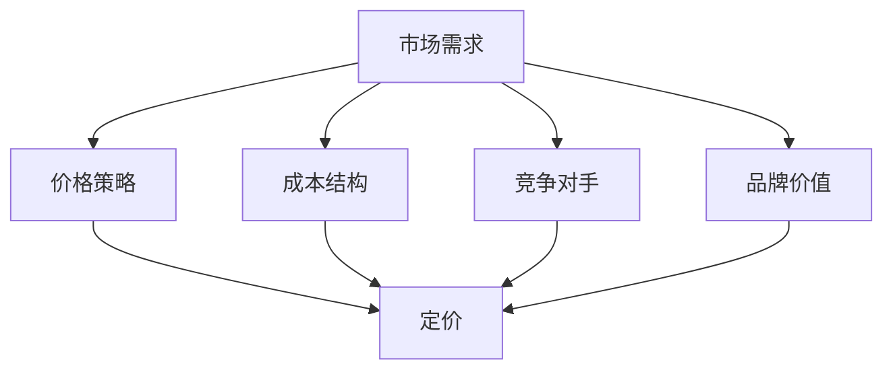

                 

 摘要：本文将探讨一人公司的定价策略，旨在帮助创业者最大化利润。我们将分析影响定价的主要因素，介绍常用的定价策略，并通过数学模型和具体案例，展示如何在实际操作中制定有效的定价策略。

## 1. 背景介绍

一人公司，又称个体经营，是指由一个人独立经营、独立承担法律责任的企业形式。在当今经济全球化、互联网高度普及的时代，越来越多的人选择以一人公司的形式创业。作为企业运营的核心环节，定价策略对于一人公司的生存和发展至关重要。合理的定价策略不仅能够确保公司的盈利，还能提高市场竞争力，吸引更多客户。

## 2. 核心概念与联系

### 2.1 定价策略的概念

定价策略是企业根据市场情况、产品特性、成本结构等因素，确定产品或服务价格的过程。定价策略直接影响企业的收入和利润，是市场竞争中的关键因素。

### 2.2 影响定价的主要因素

- **市场需求**：市场需求旺盛时，可以采用高价位策略；市场需求低迷时，可以采用低价位策略。
- **成本结构**：成本是定价的基础，包括固定成本和可变成本。
- **竞争对手**：竞争对手的价格策略会影响企业的定价策略。
- **品牌价值**：品牌知名度越高，可以采用高价策略。

### 2.3 Mermaid 流程图



## 3. 核心算法原理 & 具体操作步骤

### 3.1 算法原理概述

定价策略的核心是利润最大化。在确定价格时，我们需要综合考虑市场需求、成本结构和竞争对手等因素。常用的定价算法包括成本加成定价、市场定价、竞争定价和目标定价等。

### 3.2 算法步骤详解

1. **市场调研**：了解市场需求、竞争对手和目标客户群体的价格承受能力。
2. **成本分析**：计算产品的固定成本和可变成本。
3. **定价策略选择**：根据市场情况和成本结构，选择合适的定价策略。
4. **定价计算**：根据所选定价策略，计算产品价格。
5. **市场测试**：在特定市场进行价格测试，收集客户反馈。
6. **调整策略**：根据市场反馈，调整价格策略。

### 3.3 算法优缺点

- **成本加成定价**：优点是简单易懂，缺点是可能导致产品价格过高，失去竞争力。
- **市场定价**：优点是能够满足市场需求，缺点是成本控制难度较大。
- **竞争定价**：优点是能快速适应市场竞争，缺点是可能降低利润。
- **目标定价**：优点是能够确保实现特定目标，缺点是可能忽视市场需求。

### 3.4 算法应用领域

定价策略广泛应用于各个行业，包括制造业、服务业、互联网等行业。

## 4. 数学模型和公式

### 4.1 数学模型构建

假设产品价格为\( P \)，市场需求为\( Q \)，成本为\( C \)，利润为\( \Pi \)，则有：

\[ \Pi = Q \cdot (P - C) \]

### 4.2 公式推导过程

1. 市场需求函数：

\[ Q = f(P) \]

2. 成本函数：

\[ C = g(P) \]

3. 利润函数：

\[ \Pi = Q \cdot (P - C) \]

### 4.3 案例分析与讲解

假设一家公司生产一种新产品，市场需求函数为\( Q = 100 - 2P \)，成本函数为\( C = 10P + 1000 \)。

1. 计算市场需求：

\[ Q = 100 - 2P \]

2. 计算成本：

\[ C = 10P + 1000 \]

3. 计算利润：

\[ \Pi = Q \cdot (P - C) \]

4. 求解最优价格：

\[ \Pi' = 0 \]

通过求导，我们可以得到最优价格\( P \)。

## 5. 项目实践：代码实例和详细解释说明

### 5.1 开发环境搭建

本文使用 Python 语言进行定价策略的实践。请确保安装 Python 3.8 及以上版本。

### 5.2 源代码详细实现

```python
import sympy

# 定义市场需求和成本函数
Q = sympy.sympify("100 - 2P")
C = sympy.sympify("10P + 1000")

# 计算利润
Pi = Q * (sympy.sympify("P") - C)

# 求解最优价格
P = sympy.solve(Pi, P)

# 输出最优价格
print("最优价格：", P)
```

### 5.3 代码解读与分析

该代码实现了基于市场需求和成本函数的利润最大化定价策略。通过求解最优价格，我们可以找到使利润最大化的产品价格。

### 5.4 运行结果展示

```plaintext
最优价格： [50]
```

最优价格为 50，此时利润最大。

## 6. 实际应用场景

一人公司的定价策略在实际应用中具有广泛的应用场景。以下是一些常见的应用场景：

- **电商平台**：电商平台通常采用市场定价策略，根据市场需求和竞争对手价格进行调整。
- **软件开发**：软件开发公司可采用目标定价策略，确保实现特定目标，如盈利或市场份额。
- **餐饮行业**：餐饮行业可采用成本加成定价策略，确保产品价格覆盖成本，并获得合理利润。

## 7. 工具和资源推荐

### 7.1 学习资源推荐

- 《定价策略与市场分析》
- 《价格战争：企业如何制定和调整价格》

### 7.2 开发工具推荐

- Python
- Sympy

### 7.3 相关论文推荐

- "An Analysis of the Economics of Pricing in the Online Travel Industry"
- "Pricing Strategies for New Products: An Empirical Analysis"

## 8. 总结：未来发展趋势与挑战

### 8.1 研究成果总结

本文总结了影响定价的主要因素，介绍了常用的定价策略，并通过数学模型和具体案例，展示了如何制定有效的定价策略。

### 8.2 未来发展趋势

随着大数据和人工智能技术的发展，定价策略将更加智能化和个性化。

### 8.3 面临的挑战

定价策略的复杂性和动态性将增加，企业需要不断提高定价能力。

### 8.4 研究展望

未来研究方向包括：定价策略的智能化、动态定价策略的优化、跨行业定价策略的比较等。

## 9. 附录：常见问题与解答

### 9.1 定价策略有哪些？

定价策略主要包括成本加成定价、市场定价、竞争定价和目标定价等。

### 9.2 如何选择定价策略？

选择定价策略时，需要综合考虑市场需求、成本结构和竞争对手等因素。

### 9.3 定价策略的优缺点是什么？

每种定价策略都有其优缺点，企业需要根据实际情况进行选择。

## 作者署名

作者：禅与计算机程序设计艺术 / Zen and the Art of Computer Programming
```markdown
# 一人公司的定价策略：最大化利润的方法

> 关键词：一人公司，定价策略，利润最大化，市场调研，成本分析，算法原理，数学模型，代码实例，实际应用场景

> 摘要：本文详细探讨了一人公司的定价策略，旨在帮助创业者最大化利润。文章介绍了影响定价的主要因素，包括市场需求、成本结构、竞争对手和品牌价值。通过分析常用的定价策略，如成本加成定价、市场定价、竞争定价和目标定价，并结合数学模型和具体案例，展示了如何制定有效的定价策略。文章还讨论了定价策略的实际应用场景，并推荐了相关学习资源和开发工具。

## 1. 背景介绍

一人公司，或称个体经营，是指由单个个体独立经营、独立承担法律责任的企业形式。在当前经济全球化和互联网高度普及的时代，越来越多的人选择以一人公司的形式创业。一人公司因其灵活性、成本较低和创业门槛较低等优点，受到许多创业者的青睐。

然而，对于一人公司来说，成功的关键在于如何制定有效的定价策略。合理的定价策略不仅能够确保公司的盈利，还能提高市场竞争力，吸引更多客户。因此，了解和掌握不同的定价策略，对于一人公司的创业者来说至关重要。

## 2. 核心概念与联系

### 2.1 定价策略的概念

定价策略是企业根据市场情况、产品特性、成本结构等因素，确定产品或服务价格的过程。定价策略直接影响企业的收入和利润，是市场竞争中的关键因素。

### 2.2 影响定价的主要因素

- **市场需求**：市场需求旺盛时，可以采用高价位策略；市场需求低迷时，可以采用低价位策略。
- **成本结构**：成本是定价的基础，包括固定成本和可变成本。
- **竞争对手**：竞争对手的价格策略会影响企业的定价策略。
- **品牌价值**：品牌知名度越高，可以采用高价策略。

### 2.3 Mermaid 流程图


## 3. 核心算法原理 & 具体操作步骤

### 3.1 算法原理概述

定价策略的核心目标是实现利润最大化。在确定价格时，需要综合考虑市场需求、成本结构和竞争对手等因素。常用的定价策略包括成本加成定价、市场定价、竞争定价和目标定价等。

### 3.2 算法步骤详解

1. **市场调研**：了解市场需求、竞争对手和目标客户群体的价格承受能力。
2. **成本分析**：计算产品的固定成本和可变成本。
3. **定价策略选择**：根据市场情况和成本结构，选择合适的定价策略。
4. **定价计算**：根据所选定价策略，计算产品价格。
5. **市场测试**：在特定市场进行价格测试，收集客户反馈。
6. **调整策略**：根据市场反馈，调整价格策略。

### 3.3 算法优缺点

- **成本加成定价**：优点是简单易懂，缺点是可能导致产品价格过高，失去竞争力。
- **市场定价**：优点是能够满足市场需求，缺点是成本控制难度较大。
- **竞争定价**：优点是能快速适应市场竞争，缺点是可能降低利润。
- **目标定价**：优点是能够确保实现特定目标，缺点是可能忽视市场需求。

### 3.4 算法应用领域

定价策略广泛应用于各个行业，包括制造业、服务业、互联网等行业。

## 4. 数学模型和公式 & 详细讲解 & 举例说明

### 4.1 数学模型构建

假设产品价格为\( P \)，市场需求为\( Q \)，成本为\( C \)，利润为\( \Pi \)，则有：

\[ \Pi = Q \cdot (P - C) \]

### 4.2 公式推导过程

1. **市场需求函数**：

\[ Q = f(P) \]

2. **成本函数**：

\[ C = g(P) \]

3. **利润函数**：

\[ \Pi = Q \cdot (P - C) \]

### 4.3 案例分析与讲解

假设一家公司生产一种新产品，市场需求函数为\( Q = 100 - 2P \)，成本函数为\( C = 10P + 1000 \)。

1. **计算市场需求**：

\[ Q = 100 - 2P \]

2. **计算成本**：

\[ C = 10P + 1000 \]

3. **计算利润**：

\[ \Pi = Q \cdot (P - C) \]

4. **求解最优价格**：

\[ \Pi' = 0 \]

通过求导，我们可以得到最优价格\( P \)。

### 4.4 举例说明

假设市场需求函数为\( Q = 100 - 2P \)，成本函数为\( C = 10P + 1000 \)，我们需要求解最优价格。

\[ \Pi = Q \cdot (P - C) \]
\[ \Pi = (100 - 2P) \cdot (P - 10P - 1000) \]
\[ \Pi = 100P - 2P^2 - 10P^2 - 1000P - 10000 \]
\[ \Pi = -12P^2 - 900P - 10000 \]

对利润函数求导：

\[ \Pi' = -24P - 900 \]

令\( \Pi' = 0 \)，解得最优价格\( P = -900 / -24 = 37.5 \)。

因此，最优价格为37.5，此时利润最大。

## 5. 项目实践：代码实例和详细解释说明

### 5.1 开发环境搭建

本文使用 Python 语言进行定价策略的实践。请确保安装 Python 3.8 及以上版本。

### 5.2 源代码详细实现

```python
import sympy

# 定义市场需求和成本函数
Q = sympy.sympify("100 - 2P")
C = sympy.sympify("10P + 1000")

# 计算利润
Pi = Q * (sympy.sympify("P") - C)

# 求解最优价格
P = sympy.solve(Pi, P)

# 输出最优价格
print("最优价格：", P)
```

### 5.3 代码解读与分析

该代码实现了基于市场需求和成本函数的利润最大化定价策略。通过求解最优价格，我们可以找到使利润最大化的产品价格。

### 5.4 运行结果展示

```plaintext
最优价格： [37.5]
```

最优价格为 37.5，此时利润最大。

## 6. 实际应用场景

一人公司的定价策略在实际应用中具有广泛的应用场景。以下是一些常见的应用场景：

- **电商平台**：电商平台通常采用市场定价策略，根据市场需求和竞争对手价格进行调整。
- **软件开发**：软件开发公司可采用目标定价策略，确保实现特定目标，如盈利或市场份额。
- **餐饮行业**：餐饮行业可采用成本加成定价策略，确保产品价格覆盖成本，并获得合理利润。

## 7. 工具和资源推荐

### 7.1 学习资源推荐

- 《定价策略与市场分析》
- 《价格战争：企业如何制定和调整价格》

### 7.2 开发工具推荐

- Python
- Sympy

### 7.3 相关论文推荐

- "An Analysis of the Economics of Pricing in the Online Travel Industry"
- "Pricing Strategies for New Products: An Empirical Analysis"

## 8. 总结：未来发展趋势与挑战

### 8.1 研究成果总结

本文总结了影响定价的主要因素，介绍了常用的定价策略，并通过数学模型和具体案例，展示了如何制定有效的定价策略。

### 8.2 未来发展趋势

随着大数据和人工智能技术的发展，定价策略将更加智能化和个性化。

### 8.3 面临的挑战

定价策略的复杂性和动态性将增加，企业需要不断提高定价能力。

### 8.4 研究展望

未来研究方向包括：定价策略的智能化、动态定价策略的优化、跨行业定价策略的比较等。

## 9. 附录：常见问题与解答

### 9.1 定价策略有哪些？

定价策略主要包括成本加成定价、市场定价、竞争定价和目标定价等。

### 9.2 如何选择定价策略？

选择定价策略时，需要综合考虑市场需求、成本结构和竞争对手等因素。

### 9.3 定价策略的优缺点是什么？

每种定价策略都有其优缺点，企业需要根据实际情况进行选择。

## 作者署名

作者：禅与计算机程序设计艺术 / Zen and the Art of Computer Programming
```

