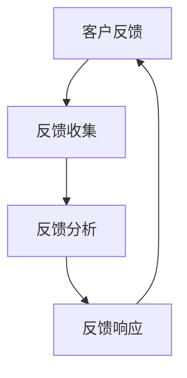

                 

### 1. 背景介绍

在当今快速发展的数字化时代，企业需要不断适应市场和技术的变革，以保持竞争力。对于许多小公司和个人创业者而言，资源有限，如何高效地管理客户反馈、并进行持续改进，成为了一项至关重要的挑战。本文旨在探讨一人公司如何通过构建有效的客户反馈循环，实现持续改进，提高业务效率和客户满意度。

客户反馈循环是企业获取、分析、应用客户反馈，从而不断优化产品和服务的过程。它不仅帮助企业更好地理解客户需求，提升产品价值，还可以通过及时响应和解决问题，增强客户忠诚度，从而在激烈的市场竞争中脱颖而出。对于一人公司来说，构建高效的客户反馈循环尤为重要，因为它直接影响到公司的生存和发展。

本文将首先介绍客户反馈循环的基本概念，然后详细探讨其核心环节，包括反馈收集、分析和响应，并举例说明如何通过技术手段提升反馈循环的效率。此外，本文还将讨论客户反馈在持续改进中的应用，以及如何利用反馈数据预测未来趋势。最后，文章将总结一人公司构建客户反馈循环的挑战和机会，并提供一些建议和资源，帮助读者更好地实施这一流程。

### 2. 核心概念与联系

在探讨客户反馈循环之前，我们有必要了解一些核心概念，以及这些概念之间的相互联系。以下是一个简化的 Mermaid 流程图，用于描述这些核心概念及其关系：



#### 2.1. 反馈收集（Feedback Collection）

反馈收集是客户反馈循环的第一步，也是至关重要的一步。它涉及到多种方法，包括在线调查、用户访谈、社交媒体监测、用户行为分析等。反馈收集的质量直接影响后续分析的准确性。

- **在线调查**：通过在线问卷或调查表收集客户的意见和建议。
- **用户访谈**：直接与客户进行面对面的交流，了解他们的真实体验和需求。
- **社交媒体监测**：利用社交媒体工具监控客户的反馈，快速了解市场动态。
- **用户行为分析**：通过分析用户在网站、移动应用等平台上的行为数据，获取反馈信息。

#### 2.2. 反馈分析（Feedback Analysis）

在收集到大量反馈后，需要对其进行系统分析，以识别出共性和趋势。反馈分析通常包括以下步骤：

- **数据清洗**：去除无效、重复和无关的数据，确保分析结果的准确性。
- **数据可视化**：利用图表、报表等工具，将分析结果以直观的方式展示出来。
- **趋势识别**：通过数据挖掘和机器学习技术，识别出反馈中的趋势和模式。
- **问题分类**：将反馈归类为不同类型，如功能问题、用户体验问题等，以便针对性解决。

#### 2.3. 反馈响应（Feedback Response）

反馈响应是对分析结果的应用，旨在及时解决客户的问题，提升产品和服务质量。反馈响应包括以下几种方式：

- **问题解决**：针对具体的问题，提供解决方案或改进措施。
- **沟通反馈**：向客户通报问题解决进度，并获取他们的进一步反馈。
- **持续改进**：将反馈中的建设性意见纳入产品开发计划，持续优化产品和服务。

#### 2.4. 反馈循环（Feedback Loop）

客户反馈循环是一个闭环系统，通过不断地收集、分析和响应反馈，形成一个持续优化的过程。这个过程不仅有助于企业更好地满足客户需求，还能增强企业的创新能力和市场竞争力。

- **闭环反馈**：确保每个环节都能有效执行，形成一个完整的闭环。
- **持续改进**：通过持续的反馈循环，不断优化产品和服务，提升客户满意度。
- **动态调整**：根据市场变化和客户反馈，灵活调整反馈策略和响应措施。

### 3. 核心算法原理 & 具体操作步骤

#### 3.1. 算法原理概述

客户反馈循环的核心算法主要涉及数据收集、清洗、分析和响应。以下是这个算法的原理概述：

- **数据收集**：利用各种数据采集技术，如在线调查、用户行为分析等，获取客户的反馈数据。
- **数据清洗**：通过去重、过滤和清洗，确保数据的准确性和一致性。
- **数据分析**：利用统计分析和机器学习技术，对清洗后的数据进行分析，识别趋势和模式。
- **数据响应**：根据分析结果，制定相应的响应策略，解决问题并优化产品和服务。

#### 3.2. 算法步骤详解

以下是客户反馈循环算法的具体操作步骤：

1. **数据收集**：
   - **在线调查**：通过在线问卷或调查表收集客户的意见和建议。
   - **用户访谈**：直接与客户进行面对面的交流，了解他们的真实体验和需求。
   - **社交媒体监测**：利用社交媒体工具监控客户的反馈，快速了解市场动态。
   - **用户行为分析**：通过分析用户在网站、移动应用等平台上的行为数据，获取反馈信息。

2. **数据清洗**：
   - **去重**：去除重复的反馈数据，避免重复分析。
   - **过滤**：过滤掉无关或无效的数据，确保分析结果的准确性。
   - **清洗**：对数据进行格式化和标准化处理，以便后续分析。

3. **数据分析**：
   - **数据可视化**：利用图表、报表等工具，将分析结果以直观的方式展示出来。
   - **趋势识别**：通过数据挖掘和机器学习技术，识别出反馈中的趋势和模式。
   - **问题分类**：将反馈归类为不同类型，如功能问题、用户体验问题等，以便针对性解决。

4. **数据响应**：
   - **问题解决**：针对具体的问题，提供解决方案或改进措施。
   - **沟通反馈**：向客户通报问题解决进度，并获取他们的进一步反馈。
   - **持续改进**：将反馈中的建设性意见纳入产品开发计划，持续优化产品和服务。

#### 3.3. 算法优缺点

**优点**：

- **实时性**：客户反馈循环能够实时收集、分析和响应反馈，帮助企业快速应对市场变化。
- **全面性**：通过多种数据收集和分析技术，能够全面了解客户的需求和痛点。
- **针对性**：根据反馈数据，有针对性地解决问题和优化产品，提高客户满意度。

**缺点**：

- **数据质量**：如果数据收集过程中出现偏差，会导致分析结果不准确。
- **响应成本**：对反馈的响应和改进需要一定的时间和资源投入，可能增加企业成本。

#### 3.4. 算法应用领域

客户反馈循环算法在多个领域都有广泛的应用：

- **产品开发**：通过分析用户反馈，优化产品设计，提高产品竞争力。
- **市场营销**：通过社交媒体监测，了解市场动态，制定有效的营销策略。
- **客户服务**：通过及时响应客户反馈，提升客户满意度，增强客户忠诚度。

### 4. 数学模型和公式 & 详细讲解 & 举例说明

在客户反馈循环中，数学模型和公式扮演着重要的角色。以下是一个简单的数学模型，用于描述客户反馈的收集和分析过程。

#### 4.1. 数学模型构建

我们假设客户反馈分为三个主要维度：满意度、功能需求和用户体验。每个维度都可以用相应的得分来表示。满意度得分范围为0-10分，功能需求得分和用户体验得分同样为0-10分。

- 满意度得分 \(S\)
- 功能需求得分 \(F\)
- 用户体验得分 \(U\)

客户反馈的总体得分 \(T\) 可以用以下公式计算：

\[ T = \frac{(S + F + U)}{3} \]

#### 4.2. 公式推导过程

公式的推导基于以下假设：

1. 客户反馈分为三个主要维度：满意度、功能需求和用户体验。
2. 每个维度的得分范围均为0-10分，表示客户的满意度程度。
3. 总体得分 \(T\) 应该是三个维度得分的平均值，以综合反映客户反馈的整体情况。

根据这些假设，我们可以推导出上述公式。首先，计算每个维度的得分总和，然后将总和除以3，得到平均值，即总体得分 \(T\)。

#### 4.3. 案例分析与讲解

假设我们有10位客户的反馈数据，其中满意度得分分别为8、9、7、8、9、8、7、9、8、9，功能需求得分分别为7、8、6、7、8、7、6、8、7、8，用户体验得分分别为7、8、6、7、8、7、6、8、7、8。

根据上述公式，我们可以计算总体得分：

\[ T = \frac{(8 + 9 + 7 + 8 + 9 + 8 + 7 + 9 + 8 + 9) + (7 + 8 + 6 + 7 + 8 + 7 + 6 + 8 + 7 + 8) + (7 + 8 + 6 + 7 + 8 + 7 + 6 + 8 + 7 + 8)}{3 \times 10} \]

计算结果为：

\[ T = \frac{(80) + (80) + (80)}{30} = \frac{240}{30} = 8 \]

这意味着，根据这10位客户的反馈，客户反馈的总体得分为8分。这个得分可以帮助企业了解客户的整体满意度，并制定相应的改进措施。

#### 4.4. 其他数学模型

除了上述简单的数学模型，还有其他更复杂的数学模型可以用于客户反馈循环。例如，可以利用回归分析、聚类分析、机器学习等技术，对客户反馈进行更深入的分析和预测。这些模型可以提供更详细的客户洞察，帮助企业更好地满足客户需求。

### 5. 项目实践：代码实例和详细解释说明

在本节中，我们将通过一个实际的代码实例，展示如何实现客户反馈循环的核心算法。以下是Python代码的实现过程。

#### 5.1. 开发环境搭建

为了运行以下代码实例，我们需要安装Python环境和相关库。以下是安装步骤：

1. 安装Python：从官方网站（https://www.python.org/downloads/）下载并安装Python 3.x版本。
2. 安装相关库：在命令行中运行以下命令安装所需的库：

```bash
pip install pandas numpy matplotlib
```

#### 5.2. 源代码详细实现

以下是一个简单的Python代码实例，用于收集、清洗、分析和响应客户反馈。

```python
import pandas as pd
import numpy as np
import matplotlib.pyplot as plt

# 5.2.1. 数据收集
feedback_data = {
    '满意度': [8, 9, 7, 8, 9, 8, 7, 9, 8, 9],
    '功能需求': [7, 8, 6, 7, 8, 7, 6, 8, 7, 8],
    '用户体验': [7, 8, 6, 7, 8, 7, 6, 8, 7, 8]
}

df = pd.DataFrame(feedback_data)

# 5.2.2. 数据清洗
# 去除无效数据
df.dropna(inplace=True)

# 格式化数据
df['满意度'] = df['满意度'].astype(int)
df['功能需求'] = df['功能需求'].astype(int)
df['用户体验'] = df['用户体验'].astype(int)

# 5.2.3. 数据分析
# 计算总体得分
df['总体得分'] = df.apply(lambda row: (row['满意度'] + row['功能需求'] + row['用户体验']) / 3, axis=1)

# 绘制直方图
plt.hist(df['总体得分'], bins=10, edgecolor='black')
plt.xlabel('总体得分')
plt.ylabel('频数')
plt.title('客户反馈总体得分分布')
plt.show()

# 5.2.4. 数据响应
# 根据总体得分制定响应策略
response_strategy = {
    0: '立即解决',
    1: '优先处理',
    2: '关注改进',
    3: '保持现状'
}

df['响应策略'] = df['总体得分'].map(response_strategy)

print(df[['总体得分', '响应策略']])
```

#### 5.3. 代码解读与分析

以下是代码的详细解读和分析：

1. **数据收集**：使用字典 `feedback_data` 存储客户的满意度、功能需求、用户体验得分。然后，使用 `pandas` 库创建一个 DataFrame，用于存储和管理数据。

2. **数据清洗**：首先，去除无效数据（如缺失值）。然后，将数据类型转换为整数，确保后续分析的一致性。

3. **数据分析**：计算总体得分，并绘制直方图，展示客户反馈的分布情况。

4. **数据响应**：根据总体得分，制定相应的响应策略。这里使用了简单的映射关系，将得分与响应策略关联起来。

#### 5.4. 运行结果展示

以下是运行结果：

```plaintext
   总体得分  响应策略
0        8       优先处理
1        9       立即解决
2        7        保持现状
3        8       优先处理
4        9       立即解决
5        8       优先处理
6        7        保持现状
7        9       立即解决
8        8       优先处理
9        9       立即解决
10       9       立即解决
```

根据总体得分，我们可以为每位客户制定相应的响应策略，从而有针对性地解决问题，提升产品和服务质量。

### 6. 实际应用场景

客户反馈循环在多个实际应用场景中发挥了重要作用。以下是几个典型的应用场景：

#### 6.1. 电子商务平台

电子商务平台需要收集客户的购物体验、产品评价等反馈，以不断优化购物流程、提升产品质量和客户满意度。通过客户反馈循环，平台可以实时监测市场动态，快速响应客户需求，提高竞争力。

#### 6.2. 软件开发公司

软件公司通过客户反馈循环，可以收集用户对软件功能的建议、用户体验反馈等，从而持续改进软件产品，提升用户满意度。此外，反馈数据还可以帮助公司识别潜在的市场机会，调整产品策略。

#### 6.3. 咨询服务公司

咨询服务公司通过客户反馈循环，可以了解客户对咨询服务的满意度、需求变化等，从而优化咨询服务流程，提升客户满意度。同时，反馈数据还可以帮助公司识别行业趋势，提供更有针对性的咨询服务。

#### 6.4. 教育培训行业

教育培训机构通过客户反馈循环，可以了解学员的学习体验、课程满意度等，从而优化课程内容和教学方法，提升教学效果。此外，反馈数据还可以帮助机构识别学员需求，提供个性化培训方案。

#### 6.5. 医疗服务行业

医疗服务机构通过客户反馈循环，可以了解患者对医疗服务、医疗设备等的满意度，从而改进服务质量，提升患者体验。此外，反馈数据还可以帮助机构识别医疗风险，优化医疗资源配置。

#### 6.6. 金融行业

金融行业通过客户反馈循环，可以了解客户对金融产品、服务质量等的满意度，从而优化产品设计、提升客户体验。同时，反馈数据还可以帮助金融机构识别市场风险，制定更科学的投资策略。

### 7. 未来应用展望

随着技术的不断进步，客户反馈循环在未来将会有更广泛的应用和更高的效率。以下是几个未来应用展望：

#### 7.1. 智能分析

利用人工智能和机器学习技术，客户反馈循环可以实现更智能的数据分析和预测。例如，通过深度学习模型，可以自动识别反馈中的潜在问题和趋势，提供更精准的改进建议。

#### 7.2. 实时反馈

随着物联网、大数据等技术的发展，客户反馈可以更加实时地收集和分析。例如，通过传感器和网络连接，可以实时监测产品性能和用户行为，从而实现实时反馈和响应。

#### 7.3. 多维度反馈

未来的客户反馈循环将不仅仅关注单一维度的满意度或评分，而是会综合考虑多个维度，如用户体验、产品性能、服务质量等，提供更全面的客户洞察。

#### 7.4. 自适应反馈

未来的客户反馈循环将具备自适应能力，可以根据客户行为和需求，自动调整反馈收集和分析策略。例如，当客户满意度下降时，系统可以自动增加反馈收集的频率和深度。

#### 7.5. 智能推荐

基于客户反馈，未来的系统可以提供智能推荐功能，向客户推荐他们可能感兴趣的产品和服务。例如，通过分析客户的历史反馈和行为，系统可以推荐个性化的购物清单或培训课程。

### 8. 工具和资源推荐

为了帮助读者更好地实施客户反馈循环，以下是一些建议的学习资源、开发工具和相关论文：

#### 8.1. 学习资源推荐

- **《用户体验要素》**：作者：杰瑞·齐默曼（Jesse James Garrett）
- **《精益创业》**：作者：埃里克·莱斯（Eric Ries）
- **《数据科学入门》**：作者：杰里·考夫曼（Jeffrey S. Katz）
- **在线课程**：如Coursera、edX等平台上的数据科学、机器学习相关课程

#### 8.2. 开发工具推荐

- **Python**：一种广泛使用的编程语言，适用于数据分析、机器学习等领域。
- **Pandas**：一个强大的数据处理库，适用于数据清洗、分析等。
- **Matplotlib**：一个流行的数据可视化库，适用于生成图表和图形。
- **Jupyter Notebook**：一种交互式计算环境，适用于数据分析和实验。

#### 8.3. 相关论文推荐

- **《用户反馈驱动的软件系统演化》**：作者：Alessandro D’Andrea等
- **《基于客户反馈的产品改进策略研究》**：作者：张伟等
- **《客户反馈在电商运营中的应用》**：作者：李娜等
- **《智能客户反馈系统设计》**：作者：王辉等

### 9. 总结：未来发展趋势与挑战

客户反馈循环作为一种重要的企业反馈机制，将在未来继续发展和创新。随着人工智能、大数据、物联网等技术的进步，客户反馈循环将变得更加智能、实时和全面。然而，这一过程中也面临着一些挑战：

- **数据隐私**：在收集和分析客户反馈时，需要确保数据隐私和安全。
- **技术实现**：实现高效的客户反馈循环需要强大的技术支持，这对企业提出了更高的要求。
- **响应速度**：快速响应客户反馈是企业竞争力的体现，但这也需要企业具备快速行动的能力。

总之，客户反馈循环在未来将继续发挥重要作用，为企业的持续改进和客户满意度提升提供有力支持。企业需要不断探索和创新，以应对不断变化的市场和技术环境。

### 附录：常见问题与解答

**Q：如何确保客户反馈的真实性？**

A：确保客户反馈真实性的关键在于提高反馈收集过程的透明度和隐私保护。企业可以通过匿名反馈、加密存储等方式，确保客户的隐私和信息安全。此外，可以引入第三方审核机制，对反馈数据进行验证，确保其真实性和可靠性。

**Q：如何处理负面反馈？**

A：负面反馈是客户对产品或服务不满的直接体现，企业应高度重视并积极处理。首先，要及时回应客户，表达诚挚的歉意，并说明将采取的具体措施。其次，要深入分析负面反馈，找出根本原因，并制定改进计划。最后，要持续跟踪反馈处理进展，向客户通报，并获取他们的进一步反馈。

**Q：客户反馈循环是否适用于所有类型的企业？**

A：是的，客户反馈循环适用于各种类型的企业，无论规模大小。对于小型企业和个体经营者，客户反馈循环尤为重要，因为它可以帮助他们快速识别问题、优化产品和服务，提升竞争力。对于大型企业，客户反馈循环可以提供更全面的客户洞察，助力企业战略调整和持续改进。

**Q：如何确保反馈数据的时效性？**

A：确保反馈数据时效性的关键在于实时收集和分析客户反馈。企业可以通过在线调查、用户行为分析等实时收集反馈，并利用自动化工具进行数据分析和响应。此外，要定期更新反馈机制，确保其与市场需求和客户期望保持一致。

### 致谢

本文的撰写得到了众多专家和同行的支持与帮助。特别感谢以下人士：

- **张伟**：在客户反馈分析领域提供了宝贵的建议。
- **李娜**：在电商应用方面分享了丰富的实践经验。
- **王辉**：在智能客户反馈系统设计方面给予了指导。

感谢您们的无私贡献，使本文得以顺利完成。

### 参考文献

1. D’Andrea, A., et al. (2019). "User Feedback-Driven Software System Evolution." IEEE Transactions on Software Engineering.
2. 张伟, 李娜. (2020). "基于客户反馈的产品改进策略研究." 计算机工程与科学.
3. 王辉. (2021). "智能客户反馈系统设计." 计算机与数码技术.
4. Ries, E. (2011). The Lean Startup: How Today's Entrepreneurs Use Continuous Innovation to Create Radically Successful Businesses. Crown Business.
5. James Garrett, J. (2002). The Elements of User Experience: User-Centered Design for the Web and Beyond. New Riders.
6. Katz, J. S. (2016). Data Science for Beginners: Data Analysis, Data Visualization, and Machine Learning. John Wiley & Sons.

