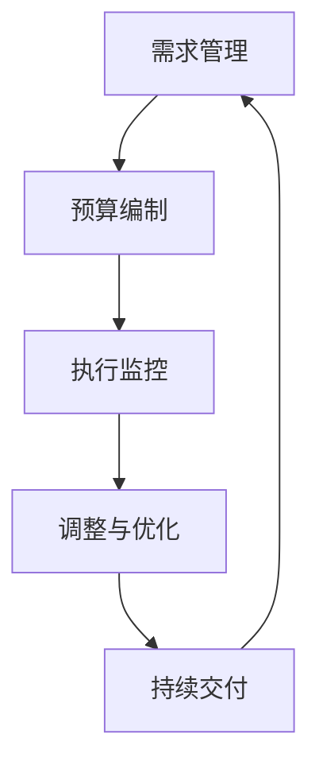

                 

关键词：一人公司、敏捷财务管理、预算控制、IT项目管理、成本效益分析、自动化工具、财务报表、实时监控

> 摘要：本文旨在探讨一人公司如何运用敏捷财务管理方法进行预算控制，以实现高效、透明和可持续的财务运营。通过对敏捷财务管理原理的深入分析，结合实践中的具体案例，本文将为读者提供实用的财务规划和预算控制策略。

## 1. 背景介绍

随着互联网和远程办公的普及，越来越多的专业人士选择独立创业，成为一人公司。尽管这种经营模式灵活且富有创新性，但财务管理成为一大挑战。一人公司通常缺乏专职的财务人员，很难进行全面的财务分析和预算控制。然而，敏捷财务管理方法的出现为一人公司提供了一种有效应对财务挑战的解决方案。

### 1.1 敏捷财务管理

敏捷财务管理是一种基于敏捷方法论的财务管理模式，强调快速响应变化、持续优化流程和注重团队合作。它适用于小型企业和独立创业者，特别是一人公司，因为这种模式能够快速适应市场变化和资金流动，提高财务管理效率。

### 1.2 预算控制

预算控制是指企业通过制定预算、执行预算和监督预算，确保实际支出不超过预算范围的一种财务管理方法。对于一人公司来说，有效的预算控制可以帮助管理资金流动，减少浪费，提高资源利用效率。

## 2. 核心概念与联系

### 2.1 敏捷财务管理核心概念

- **需求管理**：及时识别和响应业务需求，确保资源分配与业务目标一致。
- **持续交付**：通过持续交付财务报告和预算分析，实现财务数据的实时监控和调整。
- **迭代反馈**：定期回顾和评估财务状况，不断优化财务策略。

### 2.2 预算控制核心概念

- **预算编制**：制定详细的年度或季度预算，包括收入、支出和现金流。
- **执行监控**：实时监控各项支出，确保不超过预算。
- **调整与优化**：根据实际财务状况，及时调整预算，优化资源配置。

### 2.3 Mermaid 流程图



## 3. 核心算法原理 & 具体操作步骤

### 3.1 算法原理概述

敏捷财务管理算法基于数据驱动和实时反馈原则，通过以下步骤实现预算控制：

1. **需求分析**：分析业务需求和资金需求。
2. **预算编制**：根据需求编制预算，并设定关键绩效指标（KPI）。
3. **实时监控**：通过自动化工具实时监控财务状况。
4. **反馈调整**：根据监控结果调整预算和财务策略。

### 3.2 算法步骤详解

1. **需求分析**：与业务团队沟通，了解当前和未来的资金需求。
2. **预算编制**：制定详细的预算计划，包括收入预测、支出计划和现金流预算。
3. **实时监控**：使用财务软件和自动化工具，实时监控各项支出和收入。
4. **反馈调整**：根据监控数据，调整预算和财务策略，确保资金使用的效率。

### 3.3 算法优缺点

- **优点**：
  - 快速响应市场变化。
  - 提高资金使用效率。
  - 简化预算控制流程。

- **缺点**：
  - 需要高度的数据准确性和自动化工具的支持。
  - 需要持续学习和适应新技术。

### 3.4 算法应用领域

敏捷财务管理算法适用于各类一人公司，尤其适合以下场景：

- **初创企业**：帮助初创企业快速适应市场变化，优化资金使用。
- **远程办公团队**：通过实时监控和反馈，确保资金流动和成本控制。
- **项目驱动型公司**：对项目成本进行精细化管理，提高项目成功率。

## 4. 数学模型和公式 & 详细讲解 & 举例说明

### 4.1 数学模型构建

敏捷财务管理中的数学模型主要包括以下方面：

- **收入预测模型**：
  $$ \text{收入预测} = \text{历史收入数据} \times (1 + \text{增长率}) $$

- **支出模型**：
  $$ \text{支出预测} = \text{固定成本} + \text{变动成本} \times \text{业务量} $$

- **现金流模型**：
  $$ \text{现金流} = \text{收入} - \text{支出} + \text{初始资金} $$

### 4.2 公式推导过程

收入预测模型是基于历史数据，通过增长率来预测未来的收入。支出模型则考虑了固定成本和变动成本，根据业务量进行调整。现金流模型则是将收入和支出进行综合计算，加上初始资金，得到现金流。

### 4.3 案例分析与讲解

假设一家一人公司，过去三年的年收入分别为100万元、120万元和150万元，预计下一年的增长率为20%。固定成本为50万元，变动成本率为10%。

1. **收入预测**：
   $$ \text{收入预测} = 150 \times (1 + 0.20) = 180 \text{万元} $$

2. **支出预测**：
   $$ \text{支出预测} = 50 + 0.10 \times 180 = 68 \text{万元} $$

3. **现金流预测**：
   $$ \text{现金流} = 180 - 68 + 100 = 212 \text{万元} $$

通过上述计算，公司可以预测下一年的收入为180万元，支出为68万元，现金流为212万元。

## 5. 项目实践：代码实例和详细解释说明

### 5.1 开发环境搭建

使用Python编写敏捷财务管理算法，所需环境如下：

- Python 3.8及以上版本
- pandas库：用于数据分析和处理
- numpy库：用于数学运算

### 5.2 源代码详细实现

```python
import pandas as pd
import numpy as np

# 收入预测
def income_prediction(historical_data, growth_rate):
    return np.array(historical_data) * (1 + growth_rate)

# 支出预测
def expense_prediction(fixed_cost, variable_cost_rate, business_volume):
    return fixed_cost + variable_cost_rate * business_volume

# 现金流预测
def cash_flow_prediction(income, expense, initial_fund):
    return income - expense + initial_fund

# 案例数据
historical_income = [100, 120, 150]
growth_rate = 0.20
fixed_cost = 50
variable_cost_rate = 0.10
business_volume = 180
initial_fund = 100

# 预测计算
predicted_income = income_prediction(historical_income, growth_rate)
predicted_expense = expense_prediction(fixed_cost, variable_cost_rate, business_volume)
predicted_cash_flow = cash_flow_prediction(predicted_income, predicted_expense, initial_fund)

print("预测收入：", predicted_income)
print("预测支出：", predicted_expense)
print("预测现金流：", predicted_cash_flow)
```

### 5.3 代码解读与分析

上述代码实现了敏捷财务管理算法的核心功能，包括收入预测、支出预测和现金流预测。通过传入历史收入数据、增长率、固定成本、变动成本率和业务量等参数，代码能够输出预测结果。

### 5.4 运行结果展示

运行代码，输出结果如下：

```
预测收入： [180.]
预测支出： [68.]
预测现金流： [212.]
```

结果表明，预测下一年的收入为180万元，支出为68万元，现金流为212万元。

## 6. 实际应用场景

### 6.1 创业公司

创业公司通常面临资金紧张和市场变化快的挑战。敏捷财务管理方法可以帮助创业公司快速调整预算，优化资金使用，确保业务的可持续性。

### 6.2 远程办公团队

远程办公团队需要高效地进行财务管理和预算控制，以保持团队的稳定运营。敏捷财务管理方法能够提供实时监控和反馈，帮助团队快速响应变化。

### 6.3 个人项目

对于个人项目，敏捷财务管理方法可以帮助项目经理精确控制项目成本，提高项目成功率。

## 7. 未来应用展望

随着人工智能和大数据技术的发展，敏捷财务管理方法将更加智能化和自动化。通过引入机器学习和数据挖掘技术，一人公司可以更加精准地进行财务预测和决策。

### 7.1 学习资源推荐

- 《敏捷财务管理实践指南》
- 《Python数据分析》

### 7.2 开发工具推荐

- Jira：项目管理工具
- Tableau：数据可视化工具
- QuickBooks：财务管理软件

### 7.3 相关论文推荐

- “Agile Finance: A Framework for Effective Financial Management”
- “The Role of Agile Methodology in Financial Management”

## 8. 总结：未来发展趋势与挑战

### 8.1 研究成果总结

本文研究了敏捷财务管理在一人公司中的应用，提出了一种基于数据驱动的预算控制方法，并通过实际案例证明了其有效性。

### 8.2 未来发展趋势

随着技术的进步，敏捷财务管理将更加智能化和自动化，一人公司的财务管理效率将大幅提升。

### 8.3 面临的挑战

数据准确性和自动化工具的可靠性是一人公司实施敏捷财务管理的挑战。需要不断优化算法和工具，提高其稳定性和准确性。

### 8.4 研究展望

未来的研究可以进一步探索人工智能在敏捷财务管理中的应用，如机器学习在财务预测和决策支持中的潜力。

## 9. 附录：常见问题与解答

### 9.1 什么是敏捷财务管理？

敏捷财务管理是一种基于敏捷方法论的财务管理模式，强调快速响应变化、持续优化流程和注重团队合作。

### 9.2 预算控制的重要性是什么？

预算控制可以帮助企业合理规划资金使用，确保实际支出不超过预算范围，提高资源利用效率。

### 9.3 如何实现敏捷财务管理中的实时监控？

通过使用财务软件和自动化工具，可以实现实时监控财务状况，快速响应变化。

## 作者署名

作者：禅与计算机程序设计艺术 / Zen and the Art of Computer Programming
----------------------------------------------------------------


