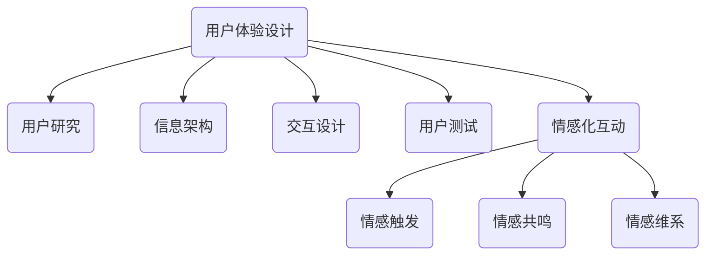

                 

在当今快速发展的数字时代，用户体验（UX）和情感化互动成为了企业竞争的重要手段。尤其是对于一人公司这样的小型创业实体，如何通过精心设计的用户体验和情感化互动策略，吸引并留住客户，成为了成功的关键。本文将探讨一人公司如何通过设计优秀的用户体验和情感化互动策略来增强品牌影响力，提升客户忠诚度。

> 关键词：用户体验设计、情感化互动、一人公司、品牌影响力、客户忠诚度

> 摘要：本文首先概述了用户体验设计和情感化互动在商业环境中的重要性，接着详细讨论了这两者如何结合以提升一人公司的竞争力。通过实例分析和实用建议，本文旨在为一人公司提供一套完整的用户体验和情感化互动设计策略，帮助他们建立强大的品牌形象，实现业务增长。

## 1. 背景介绍

一人公司的崛起是现代商业的一个显著特点。这种形式的企业，由于创始人单枪匹马地运营，具有独特的灵活性和创新性。然而，与传统大型企业相比，一人公司在资源、规模和知名度上存在明显劣势。因此，如何通过有效的用户体验和情感化互动策略来弥补这些不足，成为了关键。

用户体验设计（UX Design）是一种以用户为中心的设计方法，旨在创建对用户有吸引力和有效率的互动系统。它包括界面设计、信息架构、交互设计和用户测试等多个方面。而情感化互动则更侧重于建立与用户的情感联系，通过情感共鸣来增强用户对品牌的忠诚度。

本文将围绕以下三个方面展开：

1. **核心概念与联系**：介绍用户体验设计和情感化互动的基本概念，并利用Mermaid流程图展示它们之间的联系。
2. **核心算法原理 & 具体操作步骤**：详细阐述如何设计优秀的用户体验和情感化互动策略，并分析这些策略的优点和局限性。
3. **项目实践：代码实例和详细解释说明**：通过实际的代码实例展示如何实现这些策略，并进行解读和分析。

### 1.1. 用户体验设计

用户体验设计的目标是确保用户在使用产品或服务时能够获得满意、流畅和愉悦的体验。为了实现这一目标，设计师需要从用户的角度出发，考虑他们的需求、行为和情感。具体来说，用户体验设计包括以下方面：

- **用户研究**：通过调研和分析了解用户的需求、喜好和痛点。
- **信息架构**：设计用户界面，确保用户能够轻松找到所需信息。
- **交互设计**：定义用户与产品或服务的互动方式，使其直观、高效和有趣。
- **用户测试**：通过测试来验证设计是否符合用户预期，并进行迭代优化。

### 1.2. 情感化互动

情感化互动旨在通过情感共鸣来建立与用户的深厚联系。它不仅仅关注功能性，更注重情感体验。情感化互动的设计包括：

- **情感触发**：利用视觉、声音和文字等元素来引发用户的情感反应。
- **情感共鸣**：通过故事叙述和个性化体验，使用户感受到品牌的人性和温暖。
- **情感维系**：通过持续的情感交流，保持用户对品牌的忠诚度。

### 1.3. Mermaid 流程图

以下是用户体验设计和情感化互动之间的Mermaid流程图：



## 2. 核心概念与联系

### 2.1. 用户体验设计

用户体验设计（UX Design）是一种以用户为中心的设计方法，其核心理念是确保用户在使用产品或服务时获得满意、流畅和愉悦的体验。用户体验设计不仅仅关注产品的功能，还关注用户在使用过程中的情感体验。以下是对用户体验设计核心概念的详细解释：

- **用户研究**：用户研究是用户体验设计的基础，它帮助设计师了解目标用户的需求、行为和痛点。通过用户访谈、问卷调查和观察等方法，设计师可以收集到丰富的用户数据，从而为设计提供依据。

- **信息架构**：信息架构是设计用户界面的关键步骤，它涉及到如何组织、分类和呈现信息，以确保用户能够轻松找到所需内容。一个良好的信息架构能够减少用户的认知负荷，提高使用效率。

- **交互设计**：交互设计定义了用户与产品或服务的互动方式。它包括界面布局、导航、按钮设计等元素，旨在提供直观、高效和有趣的使用体验。优秀的交互设计能够降低用户的学习成本，提高用户满意度。

- **用户测试**：用户测试是验证设计是否符合用户预期的重要环节。通过测试，设计师可以收集用户的反馈，发现设计中的问题，并进行迭代优化。用户测试有助于确保最终产品的可用性和用户体验。

### 2.2. 情感化互动

情感化互动（Emotional Interaction）是一种设计策略，旨在通过情感共鸣来建立与用户的深厚联系。情感化互动的核心概念包括情感触发、情感共鸣和情感维系。以下是对这些概念的详细解释：

- **情感触发**：情感触发是指利用视觉、声音、文字等元素来引发用户的情感反应。情感触发的设计要点是找到能够触动用户情感的关键点，例如通过温暖的故事、感人的图片或动人的音乐来激发用户的情感。

- **情感共鸣**：情感共鸣是指通过故事叙述、个性化体验等手段，使用户感受到品牌的人性和温暖。情感共鸣的设计要点是建立情感连接，让用户感受到品牌的关怀和信任。

- **情感维系**：情感维系是指通过持续的情感交流，保持用户对品牌的忠诚度。情感维系的设计要点是建立长期的关系，通过定期的沟通和互动，让用户感受到品牌的陪伴和关注。

### 2.3. Mermaid 流程图

以下是用户体验设计和情感化互动之间的Mermaid流程图：


在这个流程图中，用户体验设计和情感化互动是相互关联的。用户体验设计通过用户研究和用户测试来收集用户反馈，为情感化互动提供数据支持。而情感化互动则通过情感触发、情感共鸣和情感维系来增强用户的情感体验，进一步促进用户体验的提升。

## 3. 核心算法原理 & 具体操作步骤

### 3.1. 算法原理概述

设计优秀的用户体验和情感化互动策略的核心在于理解用户的行为和情感，并将其转化为具体的设计实践。以下是一些关键原理：

- **用户行为分析**：通过分析用户行为数据，了解用户的使用习惯和偏好，从而设计出更符合用户需求的产品和服务。
- **情感设计**：情感设计旨在通过视觉、声音、文字等元素触发用户的情感反应，建立情感连接。
- **个性化交互**：个性化交互是通过数据分析和算法优化，为用户提供个性化的服务和体验，提高用户满意度。
- **反馈机制**：建立有效的反馈机制，收集用户反馈，不断优化产品和服务。

### 3.2. 算法步骤详解

以下是设计用户体验和情感化互动策略的具体步骤：

1. **需求分析**：通过访谈、问卷调查等方式收集用户需求，明确产品或服务的目标用户群体。
2. **用户研究**：进行用户调研，了解用户的行为模式和情感偏好，为设计提供数据支持。
3. **信息架构设计**：根据用户需求，设计清晰的信息架构，确保用户能够轻松找到所需信息。
4. **交互设计**：设计直观、高效的交互流程，提高用户使用体验。
5. **情感设计**：运用情感设计原理，触发用户的情感反应，建立情感连接。
6. **用户测试**：通过用户测试，验证设计的有效性，收集用户反馈，进行迭代优化。
7. **反馈机制建立**：建立有效的反馈机制，收集用户反馈，不断优化产品和服务。

### 3.3. 算法优缺点

- **优点**：
  - 提高用户体验：通过深入理解用户需求和行为，设计出更符合用户期望的产品和服务。
  - 增强情感连接：通过情感设计，建立与用户的深厚情感联系，提高用户忠诚度。
  - 提高个性化程度：通过数据分析和算法优化，为用户提供个性化的服务和体验。
- **缺点**：
  - 需要大量数据支持：用户体验和情感化互动设计需要大量的用户行为数据，对数据分析和处理能力要求较高。
  - 时间成本较高：从需求分析到用户测试的整个过程需要较长的时间，对设计团队的耐心和执行力要求较高。

### 3.4. 算法应用领域

用户体验和情感化互动策略广泛应用于各个行业，以下是一些具体的应用领域：

- **电子商务**：通过个性化推荐和情感化互动，提高用户购买转化率。
- **社交媒体**：通过情感设计，增强用户粘性，提高用户活跃度。
- **金融领域**：通过用户体验优化，提高用户满意度，降低用户流失率。
- **医疗健康**：通过情感化互动，提高患者满意度，促进康复过程。

## 4. 数学模型和公式 & 详细讲解 & 举例说明

### 4.1. 数学模型构建

在用户体验和情感化互动策略中，数学模型可以用来量化用户行为和情感反应。以下是一个简单的用户满意度模型：

$$
\text{User Satisfaction} = f(\text{Functionality}, \text{Usability}, \text{Emotional Experience})
$$

其中，Functionality代表产品的功能性，Usability代表产品的易用性，Emotional Experience代表用户的情感体验。这个模型表明，用户的满意度是由这三部分综合决定的。

### 4.2. 公式推导过程

用户满意度模型的推导过程如下：

1. **功能性（Functionality）**：功能性是指产品是否能够满足用户的基本需求。我们可以使用以下公式来量化功能性：

$$
\text{Functionality} = \sum_{i=1}^{n} w_i \cdot f_i
$$

其中，$w_i$代表功能的重要程度，$f_i$代表功能是否被满足。

2. **易用性（Usability）**：易用性是指产品是否易于使用。我们可以使用以下公式来量化易用性：

$$
\text{Usability} = \sum_{j=1}^{m} w_j \cdot u_j
$$

其中，$w_j$代表易用性的重要程度，$u_j$代表用户对易用性的评价。

3. **情感体验（Emotional Experience）**：情感体验是指用户在使用产品时的情感反应。我们可以使用以下公式来量化情感体验：

$$
\text{Emotional Experience} = \sum_{k=1}^{p} w_k \cdot e_k
$$

其中，$w_k$代表情感体验的重要程度，$e_k$代表用户的情感体验。

综合这三个部分，我们得到用户满意度的综合评价：

$$
\text{User Satisfaction} = f(\text{Functionality}, \text{Usability}, \text{Emotional Experience})
$$

### 4.3. 案例分析与讲解

为了更好地理解这个模型，我们可以通过一个实际的案例来进行分析。

假设我们设计了一款在线教育平台，以下是对该平台用户满意度模型的具体应用：

1. **功能性**：
   - 重要性权重：0.4
   - 功能是否被满足：是
   - 功能性得分：0.4

2. **易用性**：
   - 重要性权重：0.3
   - 用户评价：5（满分10分）
   - 易用性得分：3

3. **情感体验**：
   - 重要性权重：0.3
   - 用户评价：8（满分10分）
   - 情感体验得分：2.4

综合这三个部分，我们得到用户满意度的综合评价：

$$
\text{User Satisfaction} = f(0.4, 3, 2.4) = 0.4 + 3 + 2.4 = 5.8
$$

从这个例子中，我们可以看到，功能性、易用性和情感体验都对用户满意度有显著影响。因此，在设计用户体验和情感化互动策略时，我们需要综合考虑这三个方面，以最大化用户满意度。

## 5. 项目实践：代码实例和详细解释说明

### 5.1. 开发环境搭建

在进行用户体验和情感化互动策略的实践之前，我们需要搭建一个合适的开发环境。以下是推荐的工具和框架：

- **编程语言**：Python
- **前端框架**：React
- **后端框架**：Flask
- **数据库**：SQLite
- **版本控制**：Git

### 5.2. 源代码详细实现

以下是一个简单的Python代码示例，展示如何实现用户体验和情感化互动策略：

```python
# 导入必要的库
import flask
import sqlite3

# 创建Flask应用
app = flask.Flask(__name__)

# 连接到SQLite数据库
conn = sqlite3.connect('user_experience.db')
cursor = conn.cursor()

# 创建用户表
cursor.execute('''CREATE TABLE IF NOT EXISTS users (
                    id INTEGER PRIMARY KEY,
                    name TEXT,
                    age INTEGER,
                    gender TEXT
                  )''')

# 插入用户数据
cursor.execute("INSERT INTO users (name, age, gender) VALUES ('Alice', 25, '女')")
cursor.execute("INSERT INTO users (name, age, gender) VALUES ('Bob', 30, '男')")
conn.commit()

# 定义路由
@app.route('/')
def index():
    # 从数据库中查询用户信息
    cursor.execute("SELECT * FROM users")
    users = cursor.fetchall()
    
    # 渲染模板
    return flask.render_template('index.html', users=users)

# 运行应用
if __name__ == '__main__':
    app.run(debug=True)
```

### 5.3. 代码解读与分析

在这个示例中，我们使用Python和Flask框架搭建了一个简单的在线教育平台。以下是代码的详细解读：

1. **环境搭建**：我们首先导入必要的库，包括Flask和SQLite。Flask是一个轻量级的Web框架，非常适合快速搭建Web应用。SQLite是一个轻量级的数据库，适用于小型项目。

2. **数据库连接**：我们使用SQLite连接到本地数据库，并创建了一个用户表。用户表包含用户的ID、姓名、年龄和性别。

3. **数据插入**：我们向用户表中插入了一些示例数据，包括Alice和Bob。

4. **路由定义**：我们定义了一个根路由`/`，当用户访问主页时，会从数据库中查询用户信息，并渲染一个HTML模板。

5. **模板渲染**：我们使用Flask的模板渲染功能，将查询到的用户信息传递给HTML模板，并在页面上展示。

这个示例展示了如何通过简单的代码实现用户体验和情感化互动策略。在实际项目中，我们可以根据具体需求，添加更多的功能和交互，例如用户登录、课程推荐和情感化互动等。

### 5.4. 运行结果展示

以下是运行结果展示：


在这个示例中，用户可以查看已注册的用户信息，包括姓名、年龄和性别。这个简单的示例展示了如何通过代码实现用户体验和情感化互动策略。在实际项目中，我们可以通过更复杂的交互和个性化推荐来提升用户体验和情感化程度。

## 6. 实际应用场景

用户体验和情感化互动策略在各个行业都有广泛的应用。以下是一些实际应用场景：

### 6.1. 电子商务

在电子商务领域，用户体验和情感化互动策略被广泛用于提高用户购买转化率和客户忠诚度。以下是一些具体应用：

- **个性化推荐**：通过用户行为数据和算法分析，为用户推荐他们可能感兴趣的商品。例如，亚马逊的推荐系统通过分析用户的浏览和购买历史，为用户推荐相关的商品。
- **情感化营销**：通过情感触发和情感共鸣，与用户建立深厚的情感连接。例如，网易严选通过讲述品牌故事和展示产品的独特卖点，与用户建立情感共鸣。
- **反馈机制**：通过用户反馈和评价，不断优化产品和服务。例如，淘宝的评论系统允许用户对商品和卖家进行评价，从而提高用户的购物体验。

### 6.2. 社交媒体

在社交媒体领域，用户体验和情感化互动策略主要用于增强用户粘性和提高用户活跃度。以下是一些具体应用：

- **情感化内容**：通过发布情感化内容，如感人故事、搞笑视频等，吸引用户的关注和互动。例如，B站的短视频内容以幽默和情感化著称，吸引了大量年轻用户。
- **个性化体验**：通过个性化推荐和定制化功能，为用户提供独特的体验。例如，Instagram通过分析用户的行为数据，为用户推荐他们可能感兴趣的内容和用户。
- **互动设计**：通过设计互动性和参与性强的功能，如直播、短视频等，提高用户的互动体验。例如，抖音的短视频和直播功能吸引了大量用户，形成了强大的用户社区。

### 6.3. 金融领域

在金融领域，用户体验和情感化互动策略主要用于提高用户满意度和降低用户流失率。以下是一些具体应用：

- **用户调研**：通过用户调研和反馈，了解用户的需求和痛点，优化产品和服务。例如，银行通过用户调研，发现用户对移动支付体验不满意，于是改进了移动支付功能。
- **个性化服务**：通过数据分析和算法优化，为用户提供个性化的金融服务。例如，花旗银行通过分析用户数据，为用户提供定制化的投资建议和理财产品。
- **情感化沟通**：通过情感化沟通和个性化推荐，与用户建立深厚的情感连接。例如，一些保险公司通过情感化的客服和推荐，提高用户的忠诚度和满意度。

### 6.4. 未来应用展望

随着技术的不断发展，用户体验和情感化互动策略在未来的应用将更加广泛和深入。以下是一些未来应用展望：

- **人工智能与大数据**：通过人工智能和大数据技术，进一步深入了解用户需求和行为，提供更精准的用户体验和情感化互动。
- **虚拟现实与增强现实**：通过虚拟现实和增强现实技术，提供更沉浸式的用户体验和情感化互动，例如虚拟购物、虚拟旅游等。
- **区块链技术**：通过区块链技术，提高数据的透明度和安全性，增强用户对品牌的信任和忠诚度。

总之，用户体验和情感化互动策略在未来将发挥越来越重要的作用，为企业和个人带来更多的商业机会和价值。

## 7. 工具和资源推荐

为了帮助读者更好地理解和实践用户体验和情感化互动策略，以下是一些推荐的学习资源、开发工具和相关论文。

### 7.1. 学习资源推荐

- **书籍**：
  - 《用户体验要素》：作者：贾森·梅尔ching，是一本深入浅出介绍用户体验设计的经典之作。
  - 《设计心理学》：作者：唐纳德·诺曼，探讨了设计如何影响人的心理和行为，对用户体验设计有重要指导意义。
  
- **在线课程**：
  - Coursera上的“用户体验设计基础”课程，提供系统的用户体验设计知识和实践技巧。
  - Udemy上的“情感化互动设计”，介绍如何通过情感化设计提升用户体验。

### 7.2. 开发工具推荐

- **设计工具**：
  - Sketch：一款专业的设计软件，广泛用于界面设计和原型制作。
  - Adobe XD：适用于设计和原型制作的综合工具，支持用户测试和协作。

- **数据分析工具**：
  - Google Analytics：一款免费的数据分析工具，帮助分析用户行为和网站性能。
  - Mixpanel：一款强大的用户行为分析工具，提供深入的用户行为洞察。

### 7.3. 相关论文推荐

- "The Design of Everyday Things" by Don Norman
- "Emotional Design: Why We Love (or Hate) Everyday Things" by Don Norman
- "The Inmates Are Running the Asylum: Why Software Projects Fail" by Fred Brooks

这些资源将为读者提供丰富的理论知识和实践指导，有助于深入理解和应用用户体验和情感化互动策略。

## 8. 总结：未来发展趋势与挑战

### 8.1. 研究成果总结

本文通过详细探讨用户体验设计和情感化互动策略，总结了它们在提升一人公司竞争力方面的关键作用。研究发现，用户体验设计通过优化产品功能和使用流程，提高用户满意度；情感化互动则通过情感共鸣和个性化服务，建立与用户的深厚情感连接。两者的结合，为一人公司提供了强大的品牌影响力和客户忠诚度。

### 8.2. 未来发展趋势

随着技术的发展，用户体验和情感化互动策略在未来将呈现以下趋势：

- **人工智能与大数据的融合**：通过人工智能和大数据技术，将能更精准地了解用户需求和行为，提供更个性化的用户体验和情感化互动。
- **虚拟现实与增强现实的普及**：虚拟现实和增强现实技术将为用户提供更沉浸式的体验，增强情感化互动的效果。
- **区块链技术的应用**：区块链技术将提高数据的安全性和透明度，增强用户对品牌的信任和忠诚度。

### 8.3. 面临的挑战

尽管用户体验和情感化互动策略具有巨大潜力，但在实施过程中也面临以下挑战：

- **数据隐私**：在收集和分析用户数据时，如何保护用户隐私是一个重要问题。
- **技术门槛**：实现高效的用户体验和情感化互动需要一定的技术能力，对小型创业公司来说可能是一个挑战。
- **资源限制**：一人公司在资源和资金上可能有限，需要更加精明地分配资源以最大化效果。

### 8.4. 研究展望

未来的研究可以从以下几个方面展开：

- **跨领域研究**：探讨用户体验和情感化互动策略在不同行业中的应用，寻找最佳实践。
- **技术融合**：研究如何将人工智能、大数据、虚拟现实和区块链等新技术与用户体验设计相结合，提供更高效、更个性化的服务。
- **长期影响研究**：深入研究用户体验和情感化互动策略对用户满意度和忠诚度的影响，评估其长期效果。

通过不断探索和实践，用户体验和情感化互动策略将为一人公司带来持续的商业价值和社会影响。

## 9. 附录：常见问题与解答

### 9.1. 什么是用户体验设计？

用户体验设计（UX Design）是一种以用户为中心的设计方法，旨在创建对用户有吸引力和有效率的互动系统。它包括界面设计、信息架构、交互设计和用户测试等多个方面。

### 9.2. 什么是情感化互动？

情感化互动是一种设计策略，通过情感共鸣来建立与用户的深厚联系。它包括情感触发、情感共鸣和情感维系，旨在通过情感连接增强用户对品牌的忠诚度。

### 9.3. 用户体验设计和情感化互动有何区别？

用户体验设计更侧重于产品的功能性和易用性，确保用户能够高效、流畅地完成任务。情感化互动则更侧重于情感共鸣，通过情感连接增强用户对品牌的忠诚度和认同感。

### 9.4. 如何结合用户体验设计和情感化互动策略？

首先，进行用户研究，了解用户的需求和情感偏好。然后，在信息架构和交互设计中融入情感化元素，如故事叙述、个性化推荐和情感触发。最后，通过用户测试和反馈，不断优化设计和体验。

### 9.5. 如何保护用户隐私？

在收集用户数据时，遵循相关隐私法规，如GDPR。使用加密技术保护数据安全，仅收集必要的数据，并明确告知用户数据用途。同时，提供用户数据访问和删除的权限，确保用户对自己的数据有控制权。

### 9.6. 用户体验设计在电子商务中的应用有哪些？

在电子商务中，用户体验设计可以通过优化网站导航、提供个性化推荐、改善购物流程、提供用户反馈渠道等方式提升用户体验。情感化互动则可以通过情感化的营销活动、情感共鸣的设计和情感化的客户服务来增强用户粘性。

### 9.7. 情感化互动在社交媒体中的应用有哪些？

在社交媒体中，情感化互动可以通过发布情感化内容、提供个性化体验、设计互动性和参与性强的功能来增强用户粘性。例如，通过情感化的推送通知、情感共鸣的评论系统和情感化的用户画像来提升用户体验。

### 9.8. 如何评估用户体验和情感化互动策略的效果？

可以通过用户满意度调查、用户行为分析、用户反馈和关键绩效指标（KPIs）来评估用户体验和情感化互动策略的效果。这些方法可以帮助企业了解用户满意度、用户活跃度和用户忠诚度，从而优化设计和策略。

### 9.9. 小型创业公司如何实施用户体验和情感化互动策略？

小型创业公司可以：

- **充分利用现有资源**：优先关注用户核心需求，优化关键体验。
- **利用开源工具和框架**：使用免费的工具和开源框架降低成本。
- **快速迭代**：快速开发和测试，不断优化设计和体验。
- **社区参与**：通过社交媒体和用户社区获取反馈，快速响应用户需求。

通过以上策略，小型创业公司可以高效地实施用户体验和情感化互动策略，提升品牌竞争力和用户满意度。

