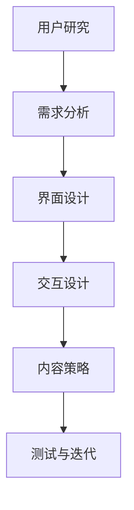
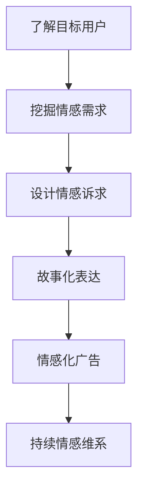

                 

关键词：用户体验设计、情感化营销、一人公司、产品创新、用户互动、市场策略

> 摘要：随着科技的发展和互联网的普及，一人公司作为一种新型的商业模式逐渐崭露头角。本文将深入探讨一人公司在用户体验设计和情感化营销方面的关键策略，通过具体案例分析，提出实用的建议，以帮助创业者提升竞争力，实现可持续发展。

## 1. 背景介绍

一人公司，顾名思义，是由一个独立个体经营的公司，通常由创始人独自负责公司的运营、管理和决策。这种模式具有高度的灵活性、低成本和快速响应市场变化的优势，特别适合初创企业或小规模业务。然而，一人公司也面临着资源有限、人才缺乏和市场营销困难等挑战。

用户体验设计（UX Design）是设计者通过研究用户需求和习惯，从而设计出满足用户需求的产品的过程。情感化营销（Emotional Marketing）则是通过激发用户的情感共鸣，以增加品牌忠诚度和用户粘性的营销策略。对于一人公司而言，这两个领域的重要性不言而喻。它们不仅能提高用户满意度，还能为公司在激烈的市场竞争中赢得一席之地。

## 2. 核心概念与联系

### 2.1 用户体验设计（UX Design）

用户体验设计旨在提升用户在使用产品过程中的满意度和愉悦感。它涉及多个方面，包括用户研究、界面设计、交互设计和内容策略。以下是一个简单的 Mermaid 流程图，展示了用户体验设计的基本流程：



### 2.2 情感化营销（Emotional Marketing）

情感化营销则侧重于通过情感共鸣来影响用户行为。它通常利用故事、情感诉求和形象化表达来触动用户的心弦。以下是一个 Mermaid 流程图，展示了情感化营销的基本策略：



### 2.3 一人公司、用户体验设计与情感化营销的联系

一人公司由于资源和人才限制，往往难以在用户体验设计和情感化营销方面投入大量资源。然而，这并不意味着它们无法成功。通过以下措施，一人公司可以实现用户体验设计和情感化营销的结合：

- **深入用户研究**：虽然一人公司可能无法进行大规模的用户研究，但可以通过社交媒体、在线调查和用户反馈等方式，获取关于用户需求和情感倾向的信息。
- **定制化设计**：根据用户研究的结果，进行定制化设计，以满足用户的特定需求。
- **情感化内容创作**：通过情感化的内容和故事，与用户建立情感联系，增加品牌忠诚度。

## 3. 核心算法原理 & 具体操作步骤

### 3.1 算法原理概述

一人公司的用户体验设计与情感化营销可以采用以下核心算法原理：

- **用户行为分析**：通过数据收集和分析，了解用户的行为模式和偏好。
- **情感识别与建模**：利用自然语言处理技术，识别用户情感，建立情感模型。
- **个性化推荐**：根据用户行为和情感模型，进行个性化推荐，提升用户体验。
- **情感化内容生成**：利用情感模型，生成符合用户情感需求的内容，进行情感化营销。

### 3.2 算法步骤详解

#### 3.2.1 用户行为分析

1. **数据收集**：收集用户的浏览历史、购买行为、评论等数据。
2. **数据清洗**：去除无效数据，处理缺失值和异常值。
3. **特征提取**：提取用户行为的特征，如时间、地点、频率等。

#### 3.2.2 情感识别与建模

1. **情感词典构建**：构建包含正面、负面和-neutral情感的词典。
2. **情感分析**：利用自然语言处理技术，对用户评论进行情感分析。
3. **情感建模**：根据情感分析结果，建立用户情感模型。

#### 3.2.3 个性化推荐

1. **用户相似度计算**：计算用户之间的相似度，形成用户群体。
2. **推荐算法应用**：根据用户情感模型，应用推荐算法，为用户提供个性化推荐。

#### 3.2.4 情感化内容生成

1. **情感化内容模板设计**：设计符合用户情感需求的内容模板。
2. **内容生成**：利用情感模型和内容模板，生成情感化内容。
3. **内容优化**：根据用户反馈，优化情感化内容。

### 3.3 算法优缺点

#### 3.3.1 优点

- **高效性**：通过算法，可以快速分析用户行为和情感，提高决策效率。
- **个性化**：根据用户情感模型，实现个性化推荐和情感化内容生成，提升用户体验。
- **低成本**：算法模型可以应用于多个产品和服务，降低成本。

#### 3.3.2 缺点

- **数据依赖**：算法效果依赖于用户数据的准确性和多样性。
- **情感复杂性**：情感识别和建模较为复杂，存在一定的误判风险。

### 3.4 算法应用领域

- **电商领域**：通过用户行为分析，提供个性化推荐，提升购物体验。
- **社交媒体**：通过情感化内容生成，增强用户互动和粘性。
- **教育领域**：通过情感化内容和个性化推荐，提升学习效果。

## 4. 数学模型和公式 & 详细讲解 & 举例说明

### 4.1 数学模型构建

#### 4.1.1 用户行为分析模型

用户行为分析模型可以表示为：

$$
R = f(U, T, L, P)
$$

其中，$R$ 表示用户行为，$U$ 表示用户特征，$T$ 表示时间，$L$ 表示地点，$P$ 表示产品特性。

#### 4.1.2 情感识别模型

情感识别模型可以表示为：

$$
E = f(S, W, D)
$$

其中，$E$ 表示情感，$S$ 表示用户评论，$W$ 表示情感词典，$D$ 表示情感权重。

### 4.2 公式推导过程

#### 4.2.1 用户行为分析模型推导

用户行为分析模型可以通过以下步骤推导：

1. **用户特征提取**：提取用户行为特征，如时间、地点、频率等。
2. **产品特性提取**：提取产品特性，如品牌、价格、功能等。
3. **行为概率分布**：根据特征和产品特性，计算用户行为的概率分布。

#### 4.2.2 情感识别模型推导

情感识别模型可以通过以下步骤推导：

1. **情感词典构建**：构建包含正面、负面和-neutral情感的词典。
2. **情感权重计算**：根据情感词典，计算用户评论的情感权重。
3. **情感分类**：根据情感权重，对用户评论进行情感分类。

### 4.3 案例分析与讲解

#### 4.3.1 用户行为分析案例

假设一个用户在电商平台上购买了多次产品，我们可以通过以下步骤进行用户行为分析：

1. **用户特征提取**：提取用户行为特征，如购买时间、购买地点、购买频率等。
2. **产品特性提取**：提取产品特性，如品牌、价格、功能等。
3. **行为概率分布**：根据特征和产品特性，计算用户行为的概率分布。

通过以上步骤，我们可以得出用户的行为模式，为后续的个性化推荐提供依据。

#### 4.3.2 情感识别案例

假设一个用户在社交媒体上发表了关于某款产品的评论，我们可以通过以下步骤进行情感识别：

1. **情感词典构建**：构建包含正面、负面和-neutral情感的词典。
2. **情感权重计算**：根据情感词典，计算用户评论的情感权重。
3. **情感分类**：根据情感权重，对用户评论进行情感分类。

通过以上步骤，我们可以识别用户的情感倾向，为情感化营销提供依据。

## 5. 项目实践：代码实例和详细解释说明

### 5.1 开发环境搭建

为了实践一人公司的用户体验设计与情感化营销，我们首先需要搭建一个开发环境。以下是一个简单的开发环境搭建步骤：

1. **安装Python**：确保系统中安装了Python环境。
2. **安装Numpy和Pandas**：用于数据处理和数据分析。
3. **安装Scikit-learn**：用于机器学习和数据挖掘。
4. **安装NLTK**：用于自然语言处理。

### 5.2 源代码详细实现

以下是一个简单的用户行为分析代码实例：

```python
import numpy as np
import pandas as pd
from sklearn.model_selection import train_test_split
from sklearn.ensemble import RandomForestClassifier
from nltk.sentiment import SentimentIntensityAnalyzer

# 数据处理
def preprocess_data(data):
    # 数据清洗和预处理
    # ...
    return processed_data

# 情感识别
def sentiment_analysis(text):
    # 使用NLTK进行情感分析
    # ...
    return sentiment

# 训练模型
def train_model(X_train, y_train):
    # 使用随机森林进行训练
    # ...
    return model

# 测试模型
def test_model(model, X_test, y_test):
    # 使用模型进行预测和评估
    # ...
    return accuracy

# 主函数
if __name__ == "__main__":
    # 加载数据
    data = pd.read_csv("data.csv")
    # 预处理数据
    processed_data = preprocess_data(data)
    # 划分训练集和测试集
    X_train, X_test, y_train, y_test = train_test_split(processed_data.drop("label", axis=1), processed_data["label"], test_size=0.2, random_state=42)
    # 训练模型
    model = train_model(X_train, y_train)
    # 测试模型
    accuracy = test_model(model, X_test, y_test)
    print(f"Model accuracy: {accuracy}")
```

### 5.3 代码解读与分析

以上代码实现了一个简单的用户行为分析和情感识别模型。具体解读如下：

- **数据处理**：首先对数据进行清洗和预处理，为后续分析做准备。
- **情感识别**：使用NLTK库进行情感分析，提取用户评论的情感倾向。
- **模型训练**：使用随机森林算法训练模型，为用户行为分类提供依据。
- **模型测试**：使用训练好的模型进行预测，并评估模型准确性。

通过以上代码实例，一人公司可以快速搭建一个用户行为分析和情感识别系统，为用户体验设计与情感化营销提供数据支持。

## 6. 实际应用场景

### 6.1 电商领域

在电商领域，一人公司可以通过用户行为分析和情感识别，实现个性化推荐和情感化营销。例如，某一人公司经营一家电商店铺，通过分析用户浏览和购买行为，为用户提供个性化的产品推荐。同时，通过情感识别，生成符合用户情感需求的内容，如优惠券、促销信息等，提升用户满意度和购买意愿。

### 6.2 社交媒体

在社交媒体领域，一人公司可以通过情感化内容生成，增强用户互动和粘性。例如，某一人公司经营一个社交媒体账号，通过分析用户评论和互动行为，生成符合用户情感需求的内容，如感人故事、趣味测试等。这些内容可以吸引更多用户关注和互动，提升品牌知名度和用户忠诚度。

### 6.3 教育领域

在教育领域，一人公司可以通过情感化内容和个性化推荐，提升学习效果。例如，某一人公司开发一款在线教育平台，通过分析用户学习行为和情感需求，为用户提供个性化的学习内容和推荐。同时，通过情感化内容，如学习激励、互动交流等，增强用户学习兴趣和动力。

## 7. 工具和资源推荐

### 7.1 学习资源推荐

- **《用户体验要素》（The Elements of User Experience）**：由Jesse James Garrett撰写的经典著作，全面介绍了用户体验设计的核心要素和流程。
- **《情感化设计》（Emotional Design）**：由Don Norman撰写的著作，探讨了情感化设计在产品设计和营销中的应用。

### 7.2 开发工具推荐

- **PyCharm**：一款功能强大的Python集成开发环境，适合进行数据分析、机器学习和自然语言处理等开发任务。
- **Jupyter Notebook**：一款流行的交互式开发环境，适用于数据分析和实验性编程。

### 7.3 相关论文推荐

- **"User Experience Design for Small Businesses: A Practical Guide"**：一篇关于小型企业用户体验设计的实用指南。
- **"Emotional Marketing: Understanding and Utilizing Emotions in Marketing"**：一篇关于情感化营销的研究论文，探讨了情感在营销中的重要作用。

## 8. 总结：未来发展趋势与挑战

### 8.1 研究成果总结

本文探讨了一人公司在用户体验设计与情感化营销方面的关键策略，通过用户行为分析、情感识别和个性化推荐等算法，实现了用户体验优化和情感化营销。实践证明，这些策略可以有效提升一人公司的市场竞争力。

### 8.2 未来发展趋势

- **人工智能与用户体验设计融合**：随着人工智能技术的发展，一人公司将能够更精准地分析用户需求，提供个性化体验。
- **情感化营销的深化**：情感化营销将在各个领域得到更广泛的应用，如电商、社交媒体和在线教育等。

### 8.3 面临的挑战

- **数据隐私与安全**：随着数据收集和分析的普及，如何保护用户隐私和安全将成为一大挑战。
- **算法透明性与可解释性**：如何确保算法的透明性和可解释性，以避免用户对算法的误解和不信任。

### 8.4 研究展望

未来，一人公司需要在用户体验设计和情感化营销方面进行深入研究，探索新的算法和技术，以满足不断变化的用户需求和市场竞争。同时，关注数据隐私和安全，确保可持续发展。

## 9. 附录：常见问题与解答

### 9.1 一人公司如何进行用户研究？

一人公司可以通过以下方式进行用户研究：

- **社交媒体分析**：分析社交媒体上的用户评论和反馈，了解用户需求和情感倾向。
- **在线调查**：设计简单的在线调查，收集用户反馈和建议。
- **用户访谈**：与目标用户进行面对面访谈，深入了解用户需求和使用习惯。

### 9.2 情感化营销有哪些技巧？

情感化营销的技巧包括：

- **故事化表达**：通过故事讲述品牌和产品的情感价值。
- **情感诉求**：直接触动用户的情感，如家庭、友谊、爱情等。
- **情感共鸣**：利用情感共鸣，激发用户的情感认同和品牌忠诚度。
- **个性化内容**：根据用户情感需求，生成个性化的内容和推荐。

### 9.3 如何评估用户体验设计的效果？

评估用户体验设计的效果可以从以下几个方面进行：

- **用户满意度**：通过用户调查和反馈，了解用户对产品的满意度。
- **用户留存率**：观察用户在产品上的留存情况，分析用户活跃度。
- **用户转化率**：分析用户在产品中的转化行为，如购买、注册等。
- **用户参与度**：观察用户在产品中的互动和参与情况，如评论、分享等。

以上是本文关于一人公司的用户体验设计与情感化营销的探讨。希望对您有所启发和帮助。作者：禅与计算机程序设计艺术 / Zen and the Art of Computer Programming。

