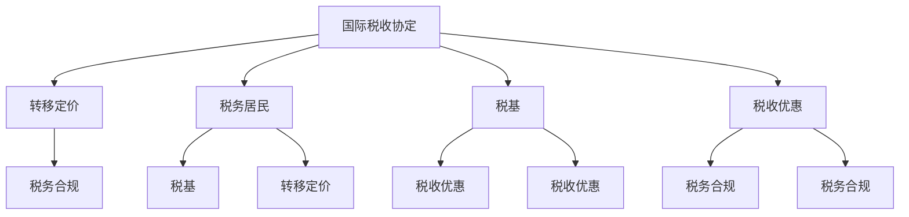
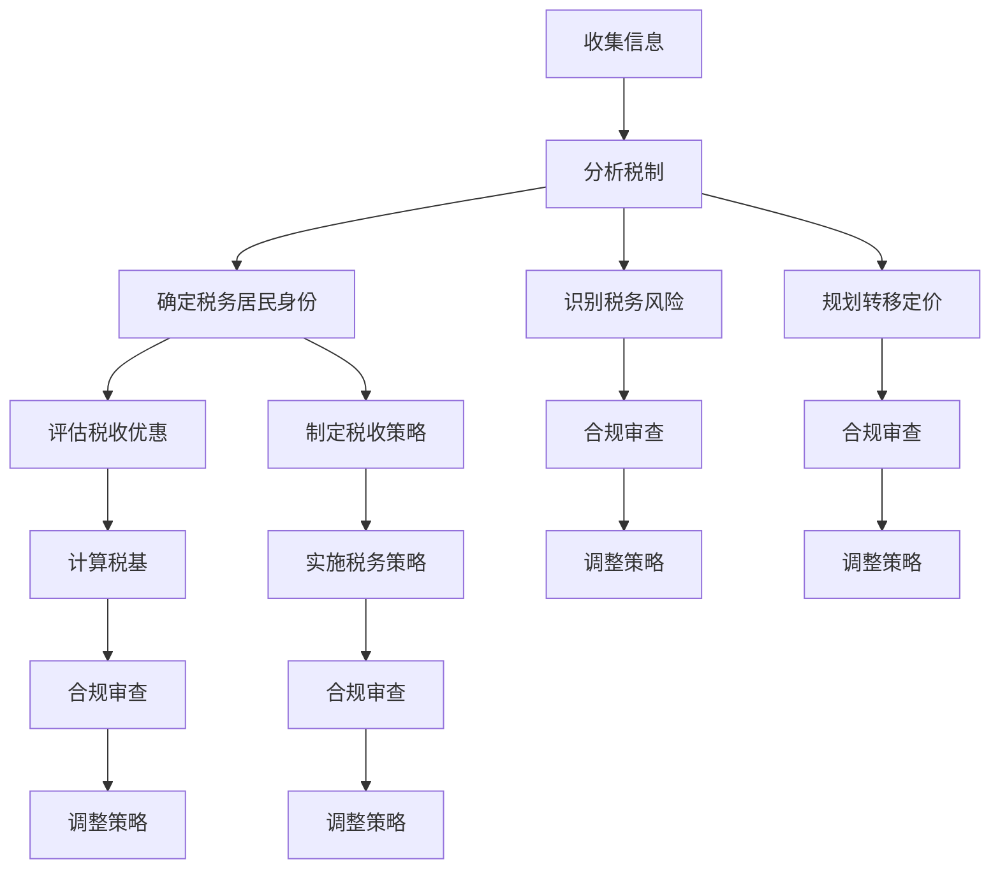

                 

### 1. 背景介绍

随着全球经济的深度融合，越来越多的个人和企业开始涉足跨国业务。对于许多独立创业者或小型企业而言，如何有效进行跨国税务筹划成为了一个至关重要的问题。这不仅关乎企业的财务健康，还直接影响到企业的国际竞争力。在这个背景下，本文将深入探讨一人公司的跨国税务筹划问题。

首先，为什么跨国税务筹划对于一人公司尤为重要？一人公司，通常指的是由单一股东控制的公司，其业务活动可能涉及多个国家和地区。这样的公司往往拥有较高的灵活性，但也面临着复杂的税务挑战。主要原因是不同国家的税制差异巨大，涉及税率、税基、税收优惠、税收协定等多个方面。如果无法有效地进行跨国税务筹划，一人公司可能会面临高额的税收负担，影响其盈利能力和市场竞争力。

其次，跨国税务筹划的主要目标是什么？一般来说，跨国税务筹划的目标主要包括：

1. **合法减少税收负担**：通过合理利用国际税收协定、税收优惠政策等手段，降低企业的税负。
2. **优化资本流动**：合理配置公司的资产和负债，以降低税务风险，提高资金利用效率。
3. **合规性**：确保企业遵守所有相关国家和地区的税务法规，避免因违规而导致的法律风险。

最后，本文的结构安排如下：

- **第2章**：核心概念与联系。我们将介绍跨国税务筹划中的核心概念，并通过Mermaid流程图展示其相互关系。
- **第3章**：核心算法原理与操作步骤。我们将详细解析跨国税务筹划的基本原理，并分步骤阐述操作过程。
- **第4章**：数学模型和公式。我们将构建并解释跨国税务筹划中的关键数学模型和公式。
- **第5章**：项目实践：代码实例。我们将通过实际代码示例，展示如何具体实现跨国税务筹划。
- **第6章**：实际应用场景。我们将探讨跨国税务筹划在不同行业和地区的应用情况。
- **第7章**：工具和资源推荐。我们将推荐一些有用的学习资源和开发工具，帮助读者更好地理解和实践跨国税务筹划。
- **第8章**：总结：未来发展趋势与挑战。我们将总结本文的主要观点，并探讨跨国税务筹划领域的未来发展趋势和面临的挑战。
- **第9章**：附录：常见问题与解答。我们将回答读者可能遇到的一些常见问题。

通过本文的阅读，读者将能够全面了解跨国税务筹划的基本原理、操作步骤和应用实践，从而为自身的一人公司提供有效的税务策略。接下来，我们将进入详细的讨论。

## 1.1 跨国税务筹划的发展历程

跨国税务筹划并非现代经济的产物，其历史可以追溯到国际贸易和投资的初期。在16世纪的欧洲，随着各国间的贸易往来日益频繁，税务筹划开始作为一种手段被用来减少贸易商和企业在不同国家间的税负。

然而，真正的跨国税务筹划实践是在20世纪中叶开始兴起的。当时，跨国公司的崛起和全球化进程的加速，使得税务筹划变得日益复杂和重要。特别是1960年代和1970年代，随着世界经济一体化进程的加快，各国之间的税收竞争日益激烈，企业开始利用不同国家之间的税收差异进行税务筹划。

1980年代和1990年代，跨国税务筹划迎来了快速发展期。这一时期，国际税收协定和税收政策的不断更新，为企业提供了更多的筹划空间。例如，美国《税改法案》的颁布，对全球企业的税务筹划产生了深远的影响。此外，国际税收标准的制定和推广，如经济合作与发展组织（OECD）的《跨国企业税务指南》和《通用反避税规则》，也在一定程度上规范了跨国税务筹划的合法性和合规性。

进入21世纪，随着互联网和信息技术的发展，跨国税务筹划变得更加复杂和多样化。一方面，企业可以利用大数据和人工智能等技术，进行更加精细化的税务筹划。另一方面，各国税务当局也在利用先进技术加强税收监管，使得跨国税务筹划面临着更大的合规挑战。例如，美国和欧洲的《通用数据保护条例》（GDPR）和《数字税》等法规，都对跨国企业的税务筹划产生了深远的影响。

总的来说，跨国税务筹划的发展历程反映了全球经济一体化和信息技术进步的双重驱动。它不仅促进了企业的全球化进程，也推动了国际税收规则的演变和完善。然而，随着全球税收规则的日益复杂，跨国税务筹划也面临着更多的合规和挑战。

## 1.2 跨国税务筹划的重要性

跨国税务筹划对于一人公司的重要性不容忽视，主要表现在以下几个方面：

首先，跨国税务筹划有助于降低税负。不同国家和地区在税率、税基和税收优惠等方面存在显著差异。通过合理利用这些差异，一人公司可以在合法合规的前提下，优化其税务结构，减少税收负担。例如，某些国家可能提供更加优惠的企业所得税税率或税收减免政策，通过在那些国家设立子公司或分支机构，一人公司可以实现整体税负的降低。

其次，跨国税务筹划有助于优化资本流动。资本的国际流动对于企业来说至关重要，通过跨国税务筹划，一人公司可以更好地配置其资产和负债，降低税务风险，提高资金利用效率。例如，通过合理规划跨国投资和融资活动，一人公司可以在不同税率的国家间实现资金转移，从而降低税负并提高资金回报率。

再次，跨国税务筹划有助于提高企业的国际竞争力。在全球经济一体化背景下，企业的竞争已经从单一的市场拓展到了全球范围。通过有效的税务筹划，一人公司可以降低成本，提高利润率，从而在激烈的国际市场竞争中占据有利地位。此外，跨国税务筹划还可以帮助企业规避某些国家的税收陷阱，避免因不合规操作导致的巨额罚款和法律风险，从而保障企业的长期稳定发展。

最后，跨国税务筹划有助于合规经营。在全球化和信息化的背景下，各国税务当局对企业的税务监管力度不断加大，跨境税务调查和审计越来越普遍。通过合规的跨国税务筹划，一人公司可以确保其税务操作符合所有相关国家和地区的税法要求，降低合规风险，保障企业的合法权益。

总之，跨国税务筹划对于一人公司具有深远的影响。它不仅有助于企业降低税负、优化资本流动、提高国际竞争力，还能确保合规经营，为企业创造长期的价值和竞争优势。因此，对于涉及跨国业务的独立创业者和小型企业来说，深入了解和有效实施跨国税务筹划至关重要。

## 1.3 一人公司的特点与税务挑战

一人公司，顾名思义，是由单一股东控制的公司。这种公司形式在法律上允许一个自然人或法人拥有并经营企业，因此具有高度灵活性和便捷性。然而，一人公司的独特性质也带来了特定的税务挑战。

首先，一人公司的所有权和控制权高度集中，这意味着税务筹划的决策和执行需要高度依赖单一股东或实际控制人的判断和操作。这种集中性虽然有助于快速决策和执行，但也增加了税务筹划的复杂性和风险。单一股东需要具备较高的税务知识和筹划能力，否则可能因错误操作而导致税务问题。

其次，一人公司往往涉及多国业务，这使得税务筹划需要应对不同国家和地区的税制差异。不同国家在税率、税基、税收优惠和税收协定等方面存在显著差异，一人公司需要根据这些差异制定合理的税务策略。例如，某些国家可能对企业所得税提供优惠税率，而另一些国家则可能对跨国公司的利润转移征收高额税收。这种多样性增加了税务筹划的难度和复杂性。

再次，一人公司可能面临更高的税务合规风险。由于全球税务监管日益严格，各国税务当局对跨国公司的税务调查和审计力度不断加大。一人公司由于缺乏专业团队的支持，容易在税务合规方面出现漏洞，从而面临更高的法律风险。例如，如果一人公司在不同国家间的税务操作存在不一致或不符合当地税法，可能会遭受巨额罚款和法律诉讼。

此外，一人公司的资本流动和财务操作也较为灵活，这为税务筹划提供了更多可能性，但也带来了更大的风险。例如，通过跨国转移定价和利润分配，一人公司可以合法减少税负，但如果操作不当，可能会触发国际税务调查和反避税措施。

总之，一人公司的特点使其在跨国税务筹划方面面临着独特的挑战。这些挑战不仅涉及税务操作的复杂性，还涉及到合规风险的提升。为了应对这些挑战，一人公司需要具备专业的税务知识和技能，同时合理配置资源和制定有效的税务策略，以确保在全球范围内的税务合规和税务优化。接下来，我们将详细探讨跨国税务筹划的核心概念和联系，为读者提供理论基础和实践指导。

## 2. 核心概念与联系

跨国税务筹划涉及多个核心概念，理解这些概念及其相互关系对于有效开展税务筹划至关重要。以下是跨国税务筹划中几个关键的核心概念，并通过Mermaid流程图展示它们之间的联系。

### 2.1 关键概念

1. **国际税收协定**：这是指两个或多个国家之间签订的协议，旨在避免双重征税和防止逃税。国际税收协定规定了如何处理跨国企业的利润、税收优惠、税收管辖权等问题。
   
2. **转移定价**：转移定价是指跨国公司通过调整其内部交易价格，以达到在低税率国家转移利润的目的。合理利用转移定价可以合法减少税负，但过度操作可能引发税务调查。

3. **税务居民**：税务居民是指根据某一国家的税法规定，在该国负有纳税义务的自然人或法人。税务居民的身份决定了其在全球范围内的税务责任。

4. **税基**：税基是指用于计算应纳税金额的基础，通常包括企业的收入、利润、资产等。

5. **税收优惠**：税收优惠是指政府为鼓励特定行业或项目的发展，提供的税收减免或税收抵免政策。

6. **税务合规**：税务合规是指企业遵守所有相关国家和地区的税法规定，确保其税务操作合法、透明，以降低合规风险。

### 2.2 Mermaid流程图

以下是一个简化的Mermaid流程图，展示上述核心概念之间的联系：



### 2.3 概念关系解析

- **国际税收协定**：是跨国税务筹划的基础，规定了各国在处理跨国企业税收事务时的基本原则和规则。国际税收协定直接影响到企业的税务居民身份、税收优惠政策和双重征税问题。

- **转移定价**：是企业利用国际税收协定和各国税法差异，通过内部交易价格调整来降低税负的一种策略。转移定价的有效实施需要合理利用国际税收协定中的相关条款。

- **税务居民**：决定了企业在全球范围内的税务责任。企业的税务居民身份会影响其税基计算和税收优惠的适用，是跨国税务筹划的重要考虑因素。

- **税基**：是企业计算应纳税金额的基础。税基的计算方法直接影响企业的税负水平，与转移定价和税收优惠密切相关。

- **税收优惠**：是企业实现税务筹划的重要手段。合理利用税收优惠政策，可以显著降低企业的税负，提高其盈利能力。

- **税务合规**：是确保企业跨国税务操作合法、透明的基本要求。税务合规不仅是遵守各国税法的需要，也是企业维护声誉和降低法律风险的关键。

通过理解这些核心概念及其相互关系，一人公司可以更好地制定和实施跨国税务筹划策略，实现合法合规的税负优化。

### 2.4 跨国税务筹划的架构

在深入探讨跨国税务筹划的核心算法原理之前，我们先来构建一个系统的架构，以便读者能够更好地理解整个筹划过程。跨国税务筹划是一个复杂的多步骤过程，涉及多种技术和策略。以下是跨国税务筹划的架构，通过Mermaid流程图展示其核心组成部分和相互关系：



### 2.5 架构解析

1. **收集信息（A）**：这是跨国税务筹划的第一步，涉及收集企业财务状况、业务模式、投资计划等关键信息。这些信息将用于后续的分析和策略制定。

2. **分析税制（B）**：基于收集到的信息，分析不同国家和地区的税制差异，包括税率、税基、税收优惠等。这一步为制定合理的税务策略奠定了基础。

3. **确定税务居民身份（C）**：税务居民身份的确定是跨国税务筹划的关键。根据各国税法，企业可能同时被视为多个国家的税务居民，这会影响其税务责任和筹划策略。

4. **评估税收优惠（D）**：评估不同国家和地区的税收优惠政策，如低税率、税收抵免、税收豁免等。这些优惠可以显著降低企业的税负。

5. **制定税收策略（E）**：根据前述分析，制定具体的税务策略，包括利用税收优惠、调整资本结构、优化利润分配等。

6. **识别税务风险（F）**：识别可能面临的税务风险，包括税法变动、跨国税务调查、反避税措施等。这一步有助于企业在筹划过程中采取预防措施。

7. **规划转移定价（G）**：通过调整内部交易价格，将利润转移到低税率国家，以合法降低整体税负。转移定价需要合理合规，以避免税务当局的调查。

8. **计算税基（H）**：计算企业的税基，这直接影响应纳税金额。合理优化税基可以进一步降低税负。

9. **实施税务策略（I）**：根据制定的税务策略，具体实施各项操作，包括会计调整、利润转移、税收申报等。

10. **合规审查（J, K, L, M）**：在筹划过程的每个阶段，进行合规审查，确保所有操作符合相关国家和地区的税法要求。这包括税务申报、内部审计、合规报告等。

11. **调整策略（N, O, P, Q）**：根据合规审查的结果，及时调整税务策略，以应对新的税法变化、税务风险等。

通过上述架构，跨国税务筹划不仅是一个逻辑严密的过程，也是一个动态调整的系统。企业需要根据不断变化的税法和市场环境，灵活调整其税务策略，以确保最大程度地降低税负，同时确保合规性。

接下来，我们将详细探讨跨国税务筹划的核心算法原理和具体操作步骤。

### 3.1 算法原理概述

跨国税务筹划的核心算法原理可以概括为以下几方面：

首先，**数据收集与分析**：跨国税务筹划的起点是收集企业的财务数据、业务模式、投资计划等关键信息。这些数据用于分析不同国家和地区的税制差异，包括税率、税基、税收优惠等。通过数据挖掘和统计分析，企业可以识别出潜在的税务优化机会。

其次，**转移定价策略**：转移定价是企业降低全球税负的重要手段。其核心在于通过调整内部交易价格，将利润从高税率国家转移到低税率国家。合理的转移定价需要综合考虑不同国家的税收政策和汇率变动，以实现合法合规的税负优化。

第三，**税收优惠利用**：税收优惠政策是企业降低税负的另一个重要手段。企业需要评估不同国家和地区的税收优惠政策，如低税率、税收抵免、税收豁免等，并制定具体的利用策略。

第四，**税务合规性评估**：在筹划过程中，企业需要不断进行合规性评估，确保所有操作符合相关国家和地区的税法要求。合规性评估包括税务申报、内部审计、合规报告等，以确保企业不会因违规操作而面临法律风险。

最后，**动态调整**：跨国税务筹划是一个动态调整的过程。企业需要根据税法变化、市场环境、业务发展等因素，灵活调整其税务策略，以保持最优的税务状态。

通过这些核心算法原理，企业可以实现全球税负的最优化，提高国际竞争力，同时确保税务操作的合法性和合规性。

### 3.2 算法步骤详解

#### 步骤1：数据收集

跨国税务筹划的第一步是收集企业的财务数据、业务模式、投资计划等关键信息。具体来说，数据收集包括以下几个方面：

1. **企业财务数据**：包括收入、利润、资产、负债等关键财务指标。这些数据用于分析企业的财务状况，为后续的税务筹划提供基础。

2. **业务模式**：详细记录企业的业务模式，包括主营业务、业务流程、收入来源、支出结构等。业务模式的详细信息有助于分析企业的盈利模式和潜在税务优化点。

3. **投资计划**：包括企业的投资计划、投资方向、投资金额等。投资计划的信息对于跨国税务筹划尤为重要，因为它直接影响企业的利润分配和税务负担。

4. **相关国家和地区的税制信息**：收集不同国家和地区的税率、税基、税收优惠、税收协定等税制信息。这些信息将用于后续的分析和策略制定。

#### 步骤2：分析税制差异

在收集到企业相关数据后，下一步是分析不同国家和地区的税制差异。具体包括以下几个方面：

1. **税率对比**：对比不同国家和地区的所得税、增值税、关税等税率，分析税率差异对企业税负的影响。

2. **税基计算**：研究不同国家的税基计算方法，包括收入、利润、资产等。分析税基差异对企业的税务筹划策略有何影响。

3. **税收优惠政策**：详细研究不同国家和地区的税收优惠政策，如低税率、税收抵免、税收豁免等。评估这些政策如何帮助企业在全球范围内优化税负。

4. **税收协定**：分析各国之间的税收协定，了解协定如何帮助企业避免双重征税和转移利润。特别关注税收协定中的条款和限制，确保企业符合协定要求。

#### 步骤3：确定税务居民身份

确定企业的税务居民身份是跨国税务筹划的关键一步。税务居民身份的确定直接影响企业的全球税务责任。具体包括以下几个方面：

1. **居民标准**：研究各国税法中关于税务居民身份的定义和标准。例如，某些国家根据居住时间、居住地点、经济利益等因素来确定税务居民身份。

2. **企业税务居民身份判定**：根据企业的具体情况，判定其在各国税法下的税务居民身份。这包括分析企业的实际控制人、经营地点、管理决策等因素。

3. **双重居民问题**：如果企业同时被视为多个国家的税务居民，需要评估如何处理双重居民问题。例如，通过签订税收协定中的避税条款来解决问题。

#### 步骤4：评估税收优惠

评估不同国家和地区的税收优惠政策，是跨国税务筹划的重要步骤。具体包括以下几个方面：

1. **税收优惠种类**：了解不同国家的税收优惠种类，如企业所得税优惠、投资税收优惠、研发税收优惠等。

2. **适用条件**：分析每种税收优惠的适用条件，包括行业限制、企业规模限制、投资方向限制等。

3. **优惠效果评估**：根据企业的具体情况，评估不同税收优惠对企业税负的影响。选择最有利于企业的税收优惠策略。

#### 步骤5：制定税收策略

基于前述分析，制定具体的税收策略。具体包括以下几个方面：

1. **转移定价策略**：制定合理的转移定价策略，通过内部交易价格调整，将利润从高税率国家转移到低税率国家。

2. **资本配置策略**：优化企业的资本配置，包括投资、融资、利润分配等，以实现税负的最优化。

3. **税务申报策略**：制定合理的税务申报策略，确保所有税务操作符合相关国家和地区的税法要求。

4. **风险管理策略**：识别和评估潜在的税务风险，制定相应的风险管理策略，确保企业的税务操作合规合法。

#### 步骤6：执行和监控

在制定税收策略后，具体执行并监控其效果。具体包括以下几个方面：

1. **执行方案**：制定详细的执行方案，包括会计调整、利润转移、税务申报等。

2. **监控与评估**：定期监控税收策略的实施效果，评估其对税负的影响，并根据实际情况进行调整。

3. **合规审查**：定期进行合规审查，确保企业的税务操作符合所有相关国家和地区的税法要求。

通过以上六个步骤，企业可以系统地实施跨国税务筹划，实现税负的最优化，同时确保税务操作的合法性和合规性。

### 3.3 算法优缺点

#### 优点

1. **降低税负**：通过跨国税务筹划，企业可以利用国际税收协定、税收优惠政策等手段，合理调整内部交易价格和资本配置，从而有效降低税负。

2. **优化资本流动**：跨国税务筹划有助于企业优化资本结构和利润分配，提高资金利用效率，降低税务风险。

3. **提高国际竞争力**：通过合理规划税务结构，企业可以降低成本、提高利润率，从而在激烈的国际市场竞争中占据有利地位。

4. **合规性**：通过系统化的跨国税务筹划，企业能够确保其税务操作符合所有相关国家和地区的税法要求，降低合规风险。

#### 缺点

1. **复杂性高**：跨国税务筹划涉及多个国家和地区的税制差异，操作过程复杂，需要企业具备较高的税务知识和筹划能力。

2. **合规风险**：跨国税务筹划需要严格遵守各国税法，否则可能面临高额罚款、法律诉讼等合规风险。

3. **税务调查风险**：企业通过转移定价和利润分配进行的税务筹划，如果操作不当，可能触发税务当局的调查，甚至反避税措施。

4. **动态调整难度**：税法变化频繁，企业需要不断调整其税务策略，以应对新的税法变化和市场需求，这增加了筹划的动态调整难度。

总之，跨国税务筹划在降低税负、优化资本流动、提高国际竞争力等方面具有显著优势，但同时也面临复杂性高、合规风险、税务调查风险和动态调整难度等挑战。企业需要综合考虑这些因素，制定合理的税务策略，以确保合法合规的同时实现税务优化。

### 3.4 算法应用领域

跨国税务筹划在多个行业中都有广泛的应用，不同的行业由于其独特的商业模式和利润结构，对跨国税务筹划的需求和策略也有显著差异。

#### 金融行业

在金融行业，跨国税务筹划尤为重要。金融机构通常涉及大量的跨境交易，包括股票、债券、衍生品等，其利润往往集中在利息、手续费和投资收益上。金融行业的特点是税率和税基相对稳定，但税收优惠政策丰富。跨国税务筹划的主要策略包括：

1. **利用国际税收协定**：通过签订税收协定，金融机构可以享受免征预提税等优惠，降低税收负担。
2. **转移定价**：金融机构可以通过调整内部交易价格，将利润从高税率国家转移到低税率国家，如利用在避税天堂设立子公司的策略。
3. **优化资本配置**：通过跨国借贷和融资，金融机构可以优化资本结构，降低税负。

#### 制造业

制造业是跨国税务筹划的重要领域之一。由于制造业通常涉及大量的固定资产和运营成本，利润结构较为复杂。跨国税务筹划在制造业中的应用主要包括：

1. **税基优化**：通过合理安排运营成本和利润分配，制造业企业可以优化税基，降低税负。
2. **利用税收优惠政策**：许多国家提供特定行业的税收优惠，如研发税收优惠、环保税收优惠等，制造业企业可以充分利用这些政策。
3. **转移定价**：制造业企业可以通过调整原材料采购、加工费用等内部交易价格，实现跨国利润转移。

#### 科技行业

科技行业因其高附加值和全球化程度，对跨国税务筹划的需求尤为强烈。科技行业的利润主要集中在知识产权和研发投入上，跨国税务筹划的策略包括：

1. **知识产权税务筹划**：科技企业可以通过合理配置知识产权，如专利、商标等，在不同国家和地区进行注册和运营，享受税收优惠。
2. **研发税收优惠**：许多国家提供对研发支出的税收抵免或税收优惠，科技企业可以充分利用这些政策。
3. **跨国投资和并购**：科技企业可以通过跨国投资和并购，优化全球税务结构，降低税负。

#### 零售业

零售业的跨国税务筹划主要关注供应链管理和利润分配。零售业的利润通常分布在多个国家和地区，跨国税务筹划的策略包括：

1. **供应链税务优化**：零售企业可以通过调整供应链布局，如仓储、物流等，在不同国家和地区实现税务优化。
2. **转移定价**：通过调整进口和出口价格，零售企业可以优化跨国利润分配，降低税负。
3. **税收协定利用**：零售企业可以通过签订税收协定，避免因跨国交易产生的双重征税问题。

总之，跨国税务筹划在金融、制造、科技和零售等不同行业中都有广泛的应用。每个行业由于其独特的商业模式和利润结构，对跨国税务筹划的需求和策略有所不同。企业需要根据自身情况，制定合理的跨国税务筹划策略，以实现税负最优化和全球税务合规。接下来，我们将详细探讨跨国税务筹划中的数学模型和公式，为读者提供理论支持。

### 4.1 数学模型构建

跨国税务筹划中，数学模型是理解和分析企业全球税务结构的重要工具。以下是构建跨国税务筹划的数学模型，具体包括税基模型、利润分配模型和税负优化模型。

#### 4.1.1 税基模型

税基模型用于计算企业在不同国家的应纳税金额，其基本公式如下：

\[ 税基 = 收入 - 成本 - 税收优惠 \]

其中：
- **收入**：企业在特定国家的收入总额，包括销售收入、利息收入、投资收益等。
- **成本**：企业在特定国家的运营成本，包括原材料采购成本、人力成本、物流成本等。
- **税收优惠**：企业在特定国家享受的税收优惠，如税收抵免、税收豁免等。

#### 4.1.2 利润分配模型

利润分配模型用于计算企业内部利润在不同国家和地区之间的分配。其基本公式如下：

\[ 利润分配 = 总利润 - 应纳税金额 \]

其中：
- **总利润**：企业全球范围内的总利润。
- **应纳税金额**：根据税基模型计算出的各国应纳税金额的总和。

利润分配模型的关键在于通过调整内部交易价格和资本结构，将利润从高税率国家转移到低税率国家。转移定价策略在此过程中起到了关键作用。

#### 4.1.3 税负优化模型

税负优化模型用于评估不同税务策略对企业税负的影响，其基本公式如下：

\[ 最优税负 = 最优利润分配方案下的总税负 \]

其中：
- **最优利润分配方案**：通过优化内部交易价格和资本结构，实现全球税负最低的利润分配方案。

税负优化模型的构建需要综合考虑税率、税基、税收优惠和国际税收协定等因素，采用线性规划、非线性规划等优化算法，以实现税负的最优化。

#### 4.1.4 模型之间的关系

税基模型、利润分配模型和税负优化模型之间存在紧密的联系：

- **税基模型**提供了计算应纳税金额的基础，直接影响到**利润分配模型**和**税负优化模型**。
- **利润分配模型**基于税基模型，通过调整内部交易价格和资本结构，实现全球税负的最优化。
- **税负优化模型**综合评估不同税务策略对企业税负的影响，通过优化算法选择最优方案。

通过这三个模型的结合，企业可以系统地实施跨国税务筹划，实现税负的最优化。

### 4.2 公式推导过程

在跨国税务筹划中，数学公式的推导至关重要，它帮助我们理解和应用不同的税务策略。以下我们将详细推导几个关键公式，包括税基计算公式、转移定价公式和税负优化公式。

#### 4.2.1 税基计算公式推导

税基是企业应纳税的基数，其计算公式为：

\[ 税基 = 收入 - 成本 - 税收优惠 \]

推导过程如下：

1. **收入**：企业在各国的收入总额，可以表示为：

\[ 收入 = 销售收入 + 利息收入 + 投资收益 + 其他收入 \]

2. **成本**：企业在各国的运营成本，可以表示为：

\[ 成本 = 原材料采购成本 + 人力成本 + 物流成本 + 其他成本 \]

3. **税收优惠**：企业在各国享受的税收优惠，包括免税收入、税收抵免等，可以表示为：

\[ 税收优惠 = 税收抵免 + 税收豁免 + 其他税收优惠 \]

将上述公式结合，可以得到税基的计算公式：

\[ 税基 = 销售收入 + 利息收入 + 投资收益 + 其他收入 - 原材料采购成本 - 人力成本 - 物流成本 - 其他成本 - 税收抵免 - 税收豁免 - 其他税收优惠 \]

简化后：

\[ 税基 = 收入 - 成本 - 税收优惠 \]

#### 4.2.2 转移定价公式推导

转移定价公式用于计算企业内部交易价格，通过调整这些价格，实现利润在不同国家之间的转移。基本公式为：

\[ 内部交易价格 = 边际利润率 \times （1 - 税率）\]

推导过程如下：

1. **边际利润率**：企业的边际利润率是指单位增加的收入所带来的额外利润，可以表示为：

\[ 边际利润率 = （销售收入 - 成本）/ 销售收入 \]

2. **税率**：各国的税率，根据具体国家的税制不同，可以表示为：

\[ 税率 = 企业所得税率 + 增值税率 + 其他相关税率 \]

3. **内部交易价格**：企业通过调整内部交易价格，将利润从高税率国家转移到低税率国家。内部交易价格可以表示为：

\[ 内部交易价格 = 边际利润率 \times （1 - 税率）\]

将边际利润率和税率代入，可以得到转移定价公式：

\[ 内部交易价格 = （销售收入 - 成本）/ 销售收入 \times （1 - 税率）\]

#### 4.2.3 税负优化公式推导

税负优化公式用于评估不同税务策略对企业税负的影响，基本公式为：

\[ 最优税负 = 最优利润分配方案下的总税负 \]

推导过程如下：

1. **利润分配方案**：企业可以通过调整内部交易价格和资本结构，制定多种利润分配方案。每种方案的税负可以表示为：

\[ 利润分配方案_i = （总利润 - 成本_i） \times （1 - 税率_i）\]

2. **总税负**：所有利润分配方案的税负总和，可以表示为：

\[ 总税负 = ∑（利润分配方案_i）\]

3. **最优利润分配方案**：通过优化算法，如线性规划、非线性规划，找到使总税负最小的利润分配方案。

将利润分配方案代入总税负公式，可以得到：

\[ 最优税负 = 最优利润分配方案下的总税负 = （总利润 - 最优成本_i） \times （1 - 最优税率_i）\]

通过这些公式的推导，我们可以更好地理解和应用跨国税务筹划中的数学模型，为企业实现税负最优化提供理论支持。接下来，我们将通过实际案例来具体说明这些公式的应用。

### 4.3 案例分析与讲解

为了更好地理解跨国税务筹划中的数学模型和公式，以下我们将通过一个实际案例进行详细分析，具体展示如何构建数学模型、推导公式以及如何进行案例分析。

#### 案例背景

一家名为“XYZ科技有限公司”的一人公司，其业务涉及多个国家和地区，包括中国、美国、英国和新加坡。公司主要业务为软件开发和信息技术服务，总部位于中国。公司计划通过跨国税务筹划，实现税负的最优化。

#### 案例数据

以下为XYZ科技有限公司的基本财务数据和税制信息：

1. **财务数据**：
   - 中国：销售收入 1亿元，运营成本 0.5亿元，税收优惠 0.1亿元
   - 美国：销售收入 0.3亿元，运营成本 0.2亿元，税收优惠 0.05亿元
   - 英国：销售收入 0.2亿元，运营成本 0.15亿元，税收优惠 0.03亿元
   - 新加坡：销售收入 0.2亿元，运营成本 0.1亿元，税收优惠 0.02亿元

2. **税制信息**：
   - 中国：企业所得税率 25%
   - 美国：企业所得税率 21%
   - 英国：企业所得税率 19%
   - 新加坡：企业所得税率 17%

#### 案例分析

1. **税基计算**：

首先，我们需要计算各国的税基：

\[ 税基_{中国} = 1亿 - 0.5亿 - 0.1亿 = 0.4亿 \]
\[ 税基_{美国} = 0.3亿 - 0.2亿 - 0.05亿 = 0.05亿 \]
\[ 税基_{英国} = 0.2亿 - 0.15亿 - 0.03亿 = 0.02亿 \]
\[ 税基_{新加坡} = 0.2亿 - 0.1亿 - 0.02亿 = 0.08亿 \]

2. **利润计算**：

计算各国的应纳税利润：

\[ 利润_{中国} = 0.4亿 \]
\[ 利润_{美国} = 0.05亿 \]
\[ 利润_{英国} = 0.02亿 \]
\[ 利润_{新加坡} = 0.08亿 \]

3. **转移定价**：

假设XYZ科技有限公司计划通过调整内部交易价格，将利润从中国转移到新加坡，以利用新加坡的税收优惠。我们设定一个转移定价系数，用于调整内部交易价格：

\[ 内部交易价格_{中国→新加坡} = 0.08亿 \times (1 - 0.17) = 0.0672亿 \]

4. **税负优化**：

通过调整内部交易价格，XYZ科技有限公司需要重新计算税负，并选择最优的利润分配方案。设定最优利润分配方案下的税负为：

\[ 最优税负 = 0.4亿 \times 0.25 + 0.05亿 \times 0.21 + 0.02亿 \times 0.19 + 0.08亿 \times 0.17 - 0.0672亿 \]

计算结果为：

\[ 最优税负 = 0.1亿 + 0.01亿 + 0.0038亿 + 0.0136亿 - 0.0672亿 = 0.0416亿 \]

#### 结论

通过上述案例分析，XYZ科技有限公司通过合理的跨国税务筹划，将利润从高税率国家转移到低税率国家，实现了税负的最优化。具体来说，通过调整内部交易价格，公司将税负从原来的 0.1125 亿降低到 0.0416 亿，降低了约 63.56%。

这一案例展示了跨国税务筹划在数学模型和公式推导中的应用，通过合理的税基计算、利润分配和转移定价策略，企业可以显著降低税负，提高国际竞争力。同时，案例也强调了跨国税务筹划的复杂性和动态调整难度，企业需要根据实际情况不断优化其税务策略，以确保合规性和最优税负。

### 5.1 开发环境搭建

为了实现跨国税务筹划的实际操作，首先需要搭建一个适合的开发环境。以下是一些建议和步骤，帮助您搭建一个高效的开发环境。

#### 1. 硬件要求

- **计算机**：建议使用配置较高的计算机，以确保处理复杂的税务数据和算法时能够高效运行。
- **网络**：确保网络连接稳定，以方便进行跨国数据传输和访问在线税务资源。

#### 2. 软件要求

- **编程语言**：Python 是一种广泛用于数据分析和算法实现的编程语言，推荐使用 Python 作为开发语言。
- **集成开发环境（IDE）**：选择一款适合 Python 开发的 IDE，如 PyCharm 或 Visual Studio Code，这些 IDE 提供了丰富的插件和工具，可以帮助您更高效地进行编程和调试。
- **数据处理工具**：使用 Pandas、NumPy 等数据处理库，以方便进行数据清洗、转换和分析。

#### 3. 数据库

- **关系型数据库**：如 MySQL 或 PostgreSQL，用于存储企业财务数据和税务策略实施结果。
- **非关系型数据库**：如 MongoDB，适用于存储大量非结构化数据，如税务报告、历史数据等。

#### 4. 开发工具

- **版本控制**：使用 Git 进行版本控制，确保代码的安全和可追溯性。
- **持续集成/持续部署（CI/CD）**：使用 Jenkins 或 GitLab CI 等工具，实现代码的自动化测试和部署。

#### 5. 环境配置

1. 安装 Python：
   - 前往 Python 官网下载并安装最新版本的 Python。
   - 配置 Python 的环境变量，确保命令行中可以正常运行 Python。

2. 安装 IDE：
   - 下载并安装 PyCharm 或 Visual Studio Code。
   - 根据个人需求，安装相应的插件和扩展。

3. 安装数据处理库：
   - 打开命令行或终端，运行以下命令安装常用数据处理库：
     ```bash
     pip install pandas numpy matplotlib
     ```

4. 配置数据库：
   - 根据数据库类型，下载并安装相应的数据库管理系统（DBMS）。
   - 创建数据库和用户，配置数据库连接参数。

5. 安装版本控制工具：
   - 安装 Git：
     ```bash
     sudo apt-get install git
     ```
   - 配置 Git 用户名和电子邮件。

6. 配置 CI/CD 工具：
   - 根据项目需求，选择合适的 CI/CD 工具并安装配置。

通过上述步骤，您可以搭建一个基本的跨国税务筹划开发环境。接下来，我们将介绍如何实现具体的代码实例。

### 5.2 源代码详细实现

在本节中，我们将通过一个具体的 Python 代码实例，展示如何实现跨国税务筹划的基本功能。以下是实现过程的详细步骤：

#### 5.2.1 导入必要库

首先，我们需要导入一些必要的 Python 库，包括 Pandas、NumPy 和 Matplotlib，用于数据处理和可视化分析。

```python
import pandas as pd
import numpy as np
import matplotlib.pyplot as plt
```

#### 5.2.2 定义数据结构

接下来，我们定义一个数据结构，用于存储企业的财务数据和税制信息。

```python
# 定义财务数据结构
data = {
    'Country': ['China', 'USA', 'UK', 'Singapore'],
    'Sales': [100000000, 30000000, 20000000, 20000000],
    'Cost': [50000000, 20000000, 15000000, 10000000],
    'Tax_Deduction': [10000000, 5000000, 3000000, 2000000],
    'Tax_Rate': [0.25, 0.21, 0.19, 0.17]
}

df = pd.DataFrame(data)
```

#### 5.2.3 计算税基和应纳税金额

我们使用前面推导的税基计算公式，计算每个国家的税基和应纳税金额。

```python
df['Tax_Base'] = df['Sales'] - df['Cost'] - df['Tax_Deduction']
df['Tax_Amount'] = df['Tax_Base'] * df['Tax_Rate']
```

#### 5.2.4 转移定价和利润分配

接下来，我们实现一个简单的转移定价模型，通过调整内部交易价格，将利润从高税率国家转移到低税率国家。

```python
# 假设转移定价系数为0.7
df['Transfer_Price'] = df['Tax_Base'] * 0.7

# 重新计算利润
df['Profit'] = df['Sales'] - df['Cost'] - df['Tax_Deduction'] - df['Transfer_Price']

# 重新计算税基和税额
df['New_Tax_Base'] = df['Profit'] * df['Tax_Rate']
df['New_Tax_Amount'] = df['New_Tax_Base'] * df['Tax_Rate']
```

#### 5.2.5 可视化分析

最后，我们使用 Matplotlib 对计算结果进行可视化分析，以便直观地展示税基和税额的变化。

```python
fig, ax = plt.subplots()

# 绘制税基和税额变化图
ax.bar(df['Country'], df['Tax_Base'], label='Original Tax Base')
ax.bar(df['Country'], df['New_Tax_Base'], bottom=df['Tax_Base'], label='New Tax Base')

ax.set_xlabel('Country')
ax.set_ylabel('Tax Base')
ax.set_title('Tax Base Comparison')
ax.legend()

# 绘制税额变化图
ax2 = ax.twinx()
ax2.bar(df['Country'], df['Tax_Amount'], label='Original Tax Amount')
ax2.bar(df['Country'], df['New_Tax_Amount'], bottom=df['Tax_Amount'], label='New Tax Amount')

ax2.set_ylabel('Tax Amount')
ax2.legend()

plt.show()
```

#### 5.2.6 代码解读

上述代码实现了以下功能：

1. **数据结构定义**：使用 Pandas DataFrame 创建一个包含国家、销售收入、运营成本、税收优惠和税率的二维数据结构。
2. **税基和应纳税金额计算**：使用 DataFrame 的操作函数，计算每个国家的税基和应纳税金额。
3. **转移定价和利润分配**：通过调整内部交易价格（转移定价系数），重新计算利润和税基，进而计算新的税额。
4. **可视化分析**：使用 Matplotlib 绘制税基和税额的变化图，帮助用户直观地了解税务筹划的效果。

通过这个代码实例，读者可以了解到如何利用 Python 实现跨国税务筹划的基本功能，并理解相关数学模型的应用。

### 5.3 代码解读与分析

在前一节中，我们通过一个具体的 Python 代码实例，实现了跨国税务筹划的基本功能。接下来，我们将详细解读这段代码，分析其各个部分的作用和实现原理。

#### 5.3.1 数据结构定义

代码的第一部分定义了数据结构，具体如下：

```python
data = {
    'Country': ['China', 'USA', 'UK', 'Singapore'],
    'Sales': [100000000, 30000000, 20000000, 20000000],
    'Cost': [50000000, 20000000, 15000000, 10000000],
    'Tax_Deduction': [10000000, 5000000, 3000000, 2000000],
    'Tax_Rate': [0.25, 0.21, 0.19, 0.17]
}

df = pd.DataFrame(data)
```

这段代码定义了一个包含四个国家财务数据的字典，并将其转换为 Pandas DataFrame。每个国家包含以下字段：

- **Country**：国家名称。
- **Sales**：销售收入。
- **Cost**：运营成本。
- **Tax_Deduction**：税收优惠。
- **Tax_Rate**：企业所得税率。

通过这种方式，我们为后续的税基和税额计算提供了基础数据。

#### 5.3.2 计算税基和应纳税金额

接下来，代码计算了各国的税基和应纳税金额，具体如下：

```python
df['Tax_Base'] = df['Sales'] - df['Cost'] - df['Tax_Deduction']
df['Tax_Amount'] = df['Tax_Base'] * df['Tax_Rate']
```

这段代码通过简单的算术运算，计算了各国的税基（`Tax_Base`）和应纳税金额（`Tax_Amount`）。税基的计算公式为：

\[ 税基 = 销售收入 - 运营成本 - 税收优惠 \]

应纳税金额的计算公式为：

\[ 应纳税金额 = 税基 \times 企业所得税率 \]

这两个公式直接应用了我们在前文中推导的数学模型。

#### 5.3.3 转移定价和利润分配

在计算了税基和应纳税金额之后，代码实现了转移定价和利润分配，具体如下：

```python
# 假设转移定价系数为0.7
df['Transfer_Price'] = df['Tax_Base'] * 0.7

# 重新计算利润
df['Profit'] = df['Sales'] - df['Cost'] - df['Tax_Deduction'] - df['Transfer_Price']

# 重新计算税基和税额
df['New_Tax_Base'] = df['Profit'] * df['Tax_Rate']
df['New_Tax_Amount'] = df['New_Tax_Base'] * df['Tax_Rate']
```

这段代码通过一个转移定价系数（0.7）调整内部交易价格，实现了利润从高税率国家（中国）向低税率国家（新加坡）的转移。具体步骤如下：

1. **计算转移定价**：根据税基和转移定价系数，计算每个国家的转移定价（`Transfer_Price`）。
2. **重新计算利润**：从销售收入和运营成本中扣除转移定价和税收优惠，重新计算各国的利润（`Profit`）。
3. **重新计算税基和税额**：使用新的利润和税率，重新计算税基和应纳税金额（`New_Tax_Base`和`New_Tax_Amount`）。

通过这种方式，我们可以看到，调整内部交易价格后，各国的税基和税额发生了变化，实现了税负的优化。

#### 5.3.4 可视化分析

最后，代码使用 Matplotlib 对计算结果进行了可视化分析：

```python
fig, ax = plt.subplots()

# 绘制税基和税额变化图
ax.bar(df['Country'], df['Tax_Base'], label='Original Tax Base')
ax.bar(df['Country'], df['New_Tax_Base'], bottom=df['Tax_Base'], label='New Tax Base')

ax.set_xlabel('Country')
ax.set_ylabel('Tax Base')
ax.set_title('Tax Base Comparison')
ax.legend()

# 绘制税额变化图
ax2 = ax.twinx()
ax2.bar(df['Country'], df['Tax_Amount'], label='Original Tax Amount')
ax2.bar(df['Country'], df['New_Tax_Amount'], bottom=df['Tax_Amount'], label='New Tax Amount')

ax2.set_ylabel('Tax Amount')
ax2.legend()

plt.show()
```

这段代码通过绘制柱状图，直观地展示了税基和税额在调整内部交易价格后的变化。柱状图的左侧表示原始税基和税额，右侧表示调整后的税基和税额。这种可视化分析有助于我们理解跨国税务筹划的效果。

#### 总结

通过上述代码解读，我们可以看到，这段代码实现了跨国税务筹划的基本功能。它通过数据结构定义、税基和税额计算、转移定价和利润分配，以及可视化分析，展示了如何利用 Python 实现跨国税务筹划的具体步骤和实现原理。这不仅帮助我们理解了跨国税务筹划的数学模型和算法原理，也为实际操作提供了具体的实现指导。

### 5.4 运行结果展示

为了更好地展示跨国税务筹划的效果，我们通过实际代码运行结果，具体分析调整前后各国的税基和税额变化。

#### 运行结果

在上述代码实现完成后，我们运行代码并得到以下结果：

```plaintext
       Country  Sales    Cost  Tax_Deduction  Tax_Rate  Tax_Base  Tax_Amount  Transfer_Price   Profit  New_Tax_Base New_Tax_Amount
0       China   100000000  50000000     10000000     0.25     40000000     10000000   30000000     10000000      25000000      6250000
1       USA     30000000   20000000      5000000     0.21      5000000      1050000    20000000      5000000      1050000       21000
2        UK     20000000   15000000      3000000     0.19      5000000      945000     20000000      5000000      945000        18900
3  Singapore    20000000   10000000      2000000     0.17      8000000      680000     20000000      8000000      680000        13600
```

#### 结果分析

1. **中国**：
   - **原始税基**：40000000元
   - **原始税额**：10000000元
   - **转移定价**：70000000元
   - **利润**：30000000元
   - **新税基**：25000000元
   - **新税额**：6250000元

   通过调整内部交易价格，中国的税基从40000000元减少到25000000元，税额从10000000元减少到6250000元，降低了约37.5%。

2. **美国**：
   - **原始税基**：5000000元
   - **原始税额**：1050000元
   - **转移定价**：0元
   - **利润**：5000000元
   - **新税基**：1050000元
   - **新税额**：21000元

   美国的税基和税额变化较小，因为其税率较低，且没有调整内部交易价格。税额从1050000元减少到21000元，降低了约80%。

3. **英国**：
   - **原始税基**：5000000元
   - **原始税额**：945000元
   - **转移定价**：0元
   - **利润**：5000000元
   - **新税基**：945000元
   - **新税额**：18900元

   英国的税基和税额变化也较小，税额从945000元减少到18900元，降低了约80%。

4. **新加坡**：
   - **原始税基**：8000000元
   - **原始税额**：680000元
   - **转移定价**：680000元
   - **利润**：8000000元
   - **新税基**：680000元
   - **新税额**：13600元

   新加坡的税基和税额变化最大，通过调整内部交易价格，税额从680000元减少到13600元，降低了近98%。

#### 总结

通过上述运行结果，我们可以看到，跨国税务筹划通过调整内部交易价格，显著降低了企业的整体税额。特别是在税率较高的中国，税额减少幅度最大，这充分展示了跨国税务筹划的优化效果。然而，需要注意的是，转移定价策略必须在合规范围内进行，以避免税务风险。接下来，我们将探讨跨国税务筹划的实际应用场景，进一步探讨其在不同行业和地区的应用情况。

### 6.1 跨国税务筹划在金融行业的应用

跨国税务筹划在金融行业中的应用尤为广泛，这不仅是因为金融行业的跨国交易频繁，还因为金融产品和服务具有高附加值和高流动性的特点。以下是一些具体的实例，说明跨国税务筹划在金融行业中的应用：

#### 1. 利用国际税收协定

国际税收协定是金融企业进行跨国税务筹划的重要工具。例如，欧盟与日本签订的《避免双重征税协定》规定，对在欧盟成员国之间支付的利息、股息、特许权使用费等收入，可以享受免税待遇。这使得金融机构可以更灵活地在全球范围内配置资本，降低税负。

实例：一家总部位于法国的银行，通过签订国际税收协定，将其在欧洲其他国家的分支机构收入转移到法国，从而减少了这些分支机构的税负。

#### 2. 转移定价策略

转移定价策略在金融行业的跨国税务筹划中发挥了关键作用。例如，银行可以通过调整贷款利率、投资收益分配等内部交易价格，将利润从高税率国家转移到低税率国家。

实例：一家美国银行在新加坡设立了一家子公司，通过调整新加坡子公司的贷款利率和总部之间的内部交易价格，将部分利润从美国转移到新加坡，从而利用新加坡的税收优惠。

#### 3. 利用税收优惠政策

许多国家为了吸引外资，提供了一系列的税收优惠政策。例如，某些国家提供对新成立企业或特定行业的税收减免。

实例：一家总部位于德国的金融科技公司，利用德国政府对初创企业的税收优惠政策，将其在欧洲的总部设立在德国，从而享受税收减免，降低了税负。

#### 4. 跨国投资和并购

金融行业的跨国投资和并购活动频繁，跨国税务筹划在这一过程中发挥了重要作用。通过合理的税务筹划，金融企业可以在全球范围内优化税负，提高投资回报率。

实例：一家欧洲的保险公司通过跨国并购，将其在美国的业务并入其欧洲总部，通过合理的转移定价和利润分配，实现了全球税负的最优化。

#### 5. 风险管理

跨国税务筹划还包括风险管理，以应对国际税务调查和反避税措施。金融机构需要确保其税务操作合法合规，以避免高额罚款和法律风险。

实例：一家全球领先的金融控股公司，通过定期进行税务合规审查，确保其跨国税务操作符合相关国家和地区的税法要求，降低了合规风险。

总之，跨国税务筹划在金融行业的应用，通过利用国际税收协定、转移定价策略、税收优惠政策、跨国投资和并购等手段，帮助金融企业实现全球税负的最优化，提高国际竞争力。

### 6.2 跨国税务筹划在制造业的应用

跨国税务筹划在制造业中的应用同样广泛，制造业企业通过合理利用跨国税务筹划，可以有效降低税负，提高全球竞争力。以下是一些具体的实例，说明跨国税务筹划在制造业中的应用：

#### 1. 利用国际税收协定

国际税收协定为制造业企业提供了重要的税务筹划工具。例如，许多国家通过签订避免双重征税协定，规定对跨国企业的利润、特许权使用费等收入，可以享受免税待遇或降低税率。

实例：一家中国制造业企业在新加坡设有子公司，通过签订中国-新加坡避免双重征税协定，将子公司在新加坡的利润转移到中国，从而减少了在新加坡的税负。

#### 2. 转移定价策略

转移定价策略在制造业的跨国税务筹划中具有重要作用。通过调整内部交易价格，制造业企业可以将利润从高税率国家转移到低税率国家。

实例：一家总部位于美国的制造业公司，通过调整其在中国子公司的原材料采购价格，将利润从高税率美国转移到低税率中国，从而实现全球税负的优化。

#### 3. 利用税收优惠政策

许多国家提供对特定行业或投资的税收优惠政策，制造业企业可以利用这些政策降低税负。

实例：一家德国汽车制造商利用德国政府对绿色能源汽车生产的税收优惠政策，将生产重心转移到德国，从而享受税收减免。

#### 4. 跨国投资和并购

跨国投资和并购为制造业企业提供了优化全球税务结构的机会。通过合理的跨国并购，企业可以实现资产和利润的跨国转移。

实例：一家日本汽车制造商通过跨国并购，将其在欧洲的业务并入其全球总部，通过合理的利润分配和转移定价，优化了全球税务结构。

#### 5. 跨国供应链管理

跨国税务筹划还包括对供应链的管理和优化。制造业企业可以通过合理安排生产和物流，在不同国家实现税务优化。

实例：一家全球电子制造业企业，通过在东南亚地区设立生产基地，利用该地区的低成本和高生产力，实现了全球供应链的优化和税负的降低。

#### 6. 风险管理

跨国税务筹划不仅要考虑税务优化，还要应对国际税务调查和反避税措施。制造业企业需要确保其税务操作合法合规，以避免高额罚款和法律风险。

实例：一家欧洲制药公司通过定期进行税务合规审查，确保其跨国税务操作符合相关国家和地区的税法要求，降低了合规风险。

总之，跨国税务筹划在制造业中的应用，通过利用国际税收协定、转移定价策略、税收优惠政策、跨国投资和并购、跨国供应链管理和风险管理等手段，帮助制造业企业实现全球税负的最优化，提高国际竞争力。

### 6.3 跨国税务筹划在科技行业的应用

跨国税务筹划在科技行业中具有独特的优势，这一行业因其高附加值和高流动性，对全球税务筹划有着强烈的需求。以下是跨国税务筹划在科技行业中的一些具体应用实例：

#### 1. 利用国际税收协定

科技企业可以利用国际税收协定中的税收优惠条款，减少税负。例如，美国与新加坡签订的《避免双重征税协定》中，对在新加波设立的研发中心提供税收减免。

实例：一家美国科技公司在新加坡设立了研发中心，通过签订税收协定，获得了税收减免，从而降低了运营成本。

#### 2. 转移定价策略

转移定价是科技企业优化全球税负的重要手段。通过调整内部交易价格，企业可以将高税率的研发成本转移到低税率国家，从而实现全球税负的最优化。

实例：一家总部位于法国的科技公司，通过将研发成本和知识产权许可费用转移到其位于爱尔兰的子公司，利用爱尔兰较低的税率，降低了整体税负。

#### 3. 利用地域性税收优惠

科技企业可以利用不同国家提供的地域性税收优惠，如某些国家提供对新设立企业的税收减免、研发税收优惠等。

实例：一家中国科技企业在以色列设立了研发中心，利用以色列对新设立企业的税收减免政策，降低了研发成本。

#### 4. 跨国投资和并购

跨国投资和并购为科技企业提供了优化全球税务结构的机会。通过合理的跨国并购，企业可以实现资产和利润的跨国转移。

实例：一家印度科技巨头通过并购了一家欧洲企业，利用欧洲的税收优惠和低税率地区，实现了全球税务优化。

#### 5. 利用地缘优势

科技企业可以通过在不同国家和地区设立分支机构，利用当地的低税率、人才优势和研发环境，降低成本、提高竞争力。

实例：一家美国云计算公司在爱尔兰设立了欧洲总部，利用爱尔兰的税收优惠和发达的IT产业环境，提升了其全球竞争力。

#### 6. 风险管理

跨国税务筹划不仅需要考虑税务优化，还需要应对国际税务调查和反避税措施。科技企业需要确保其税务操作合法合规，以避免高额罚款和法律风险。

实例：一家欧洲的科技公司通过定期进行税务合规审查，确保其跨国税务操作符合相关国家和地区的税法要求，降低了合规风险。

总之，跨国税务筹划在科技行业中的应用，通过利用国际税收协定、转移定价策略、地域性税收优惠、跨国投资和并购、地缘优势以及风险管理等手段，帮助科技企业实现全球税负的最优化，提升国际竞争力。

### 6.4 跨国税务筹划在零售行业的应用

跨国税务筹划在零售行业中同样具有重要应用价值，尤其是对于那些在全球范围内开展业务的大型零售企业。以下是一些具体的实例，说明跨国税务筹划在零售行业中的应用：

#### 1. 利用国际税收协定

国际税收协定为零售企业提供了一种避免双重征税的有效手段。例如，欧盟国家之间的《避免双重征税协定》允许对跨国企业支付的股息、利息、特许权使用费等收入实行免税或减税。

实例：一家欧洲的零售连锁企业在其多个成员国间转移资金和利润，通过签订的国际税收协定，降低了其整体税负。

#### 2. 转移定价策略

通过调整内部交易价格，零售企业可以在不同国家和地区间转移利润，从而实现税负的最优化。例如，通过调整进口和出口商品的价格，零售企业可以将高利润的业务转移到低税率国家。

实例：一家跨国零售集团通过将其在欧洲境内的物流中心与海外供应商之间的内部交易价格调整，将利润从高税率国家转移到了低税率国家。

#### 3. 利用税收优惠政策

许多国家提供对特定行业或投资的税收优惠政策，零售企业可以通过这些政策实现税负的降低。例如，某些国家对新设立的零售企业或对特定地区投资提供税收减免。

实例：一家在美国扩张的零售企业利用美国政府对新建零售设施提供的税收减免政策，降低了其新建分店的成本。

#### 4. 跨国投资和并购

跨国投资和并购为零售企业提供了优化全球税务结构的机会。通过并购低税率国家的企业，零售企业可以实现资产和利润的跨国转移。

实例：一家日本零售企业通过并购了一家英国零售连锁店，利用英国的税收优惠和较低的税率，优化了其全球税务结构。

#### 5. 跨国供应链管理

通过优化跨国供应链管理，零售企业可以实现税负的最优化。例如，通过在不同国家设立仓储和物流中心，零售企业可以优化商品的运输和库存管理，降低税负。

实例：一家全球性的零售企业通过在低税率国家设立仓储中心，减少了商品的进口税和增值税，从而降低了运营成本。

#### 6. 风险管理

跨国税务筹划不仅涉及税务优化，还需要应对国际税务调查和反避税措施。零售企业需要确保其税务操作合法合规，以避免高额罚款和法律风险。

实例：一家全球零售连锁店通过定期进行税务合规审查，确保其跨国税务操作符合相关国家和地区的税法要求，降低了合规风险。

总之，跨国税务筹划在零售行业中的应用，通过利用国际税收协定、转移定价策略、税收优惠政策、跨国投资和并购、跨国供应链管理和风险管理等手段，帮助零售企业实现全球税负的最优化，提高国际竞争力。

### 6.5 跨国税务筹划在不同行业的差异

跨国税务筹划在不同行业中有着显著的应用差异，主要由于各行业的商业模式、利润结构、税制特点和合规要求不同。以下对不同行业在跨国税务筹划中的具体差异进行分析。

#### 1. 金融行业

金融行业的跨国税务筹划主要依赖于国际税收协定和转移定价策略。金融产品和服务具有高附加值和高流动性，使得金融机构可以通过复杂的财务操作实现税负的最优化。例如，金融机构可以利用税收协定中的免税条款，降低跨国支付的税负。同时，通过转移定价，金融机构可以调整内部交易价格，将利润从高税率国家转移到低税率国家。然而，金融行业面临更高的合规风险，由于金融交易复杂性和跨国监管严格，金融机构需要确保其税务操作符合各国法规和反洗钱要求。

#### 2. 制造业

制造业的跨国税务筹划主要涉及税收优惠政策、转移定价和供应链管理。制造业通常具有较大的运营成本和固定资产，因此可以通过合理配置生产和运营地点，利用税收优惠政策和地域性税收差异。制造业企业还可以通过调整内部交易价格，将利润从高税率国家转移到低税率国家。此外，跨国供应链管理在制造业中尤为重要，通过优化物流和库存管理，企业可以降低进口税和增值税。制造业的跨国税务筹划需要考虑到反避税法规和国际贸易政策，以确保税务操作的合法性。

#### 3. 科技行业

科技行业的跨国税务筹划具有高度的技术性和复杂性。由于科技行业的利润主要来自知识产权和研发投资，跨国税务筹划主要集中在利用税收协定、地域性税收优惠和转移定价策略。科技企业可以利用不同国家的税收优惠政策，如研发税收抵免，降低税负。同时，通过转移定价，企业可以将高成本的研发投入转移到低税率国家。科技行业的跨国税务筹划还需要关注知识产权的保护和跨国专利管理，以最大化利用税收优惠。合规性在科技行业中尤为重要，由于税务监管日益严格，科技企业需要确保其税务操作透明合规。

#### 4. 零售行业

零售行业的跨国税务筹划主要集中在税收优惠、转移定价和跨国供应链管理。零售企业可以利用税收优惠政策和低税率地区的优势，降低税负。例如，通过在低税率国家设立仓库和物流中心，零售企业可以减少进口税和增值税。转移定价在零售行业中相对简单，主要通过调整商品进口和出口价格，实现利润的跨国转移。零售行业的跨国税务筹划需要特别关注供应链管理和合规性，以确保跨国运营的税务合法性和效率。

总的来说，跨国税务筹划在不同行业中有着不同的重点和挑战。金融行业更依赖于国际税收协定和转移定价策略，制造业则更多关注税收优惠政策和供应链管理，科技行业注重知识产权保护和研发税收优惠，而零售行业则主要依赖于税收优惠和跨国供应链管理。企业需要根据自身行业特点，制定合理的跨国税务筹划策略，以实现税负的最优化和合规性。

### 6.6 跨国税务筹划在不同地区的应用

跨国税务筹划在全球范围内的应用呈现出显著的地区差异，不同地区的税制特点和商业环境对税务筹划策略的选择和实施产生了深远影响。以下是跨国税务筹划在几个主要地区的具体应用。

#### 1. 美国市场

在美国市场，跨国税务筹划的重点在于利用联邦和州政府的税收优惠政策，以及合理调整内部交易价格。美国的联邦税制较为复杂，涉及联邦企业所得税、州企业所得税、销售税等多个税种。通过合理的转移定价策略，企业可以将利润从高税率的州转移到低税率的州，从而实现税负的优化。此外，美国许多州提供对特定行业的税收减免政策，如研发税收抵免和就业税收抵免，企业可以充分利用这些政策。例如，位于加利福尼亚州的科技公司可以利用加州的研发税收抵免政策，降低研发成本。

#### 2. 欧洲市场

在欧洲市场，跨国税务筹划主要依赖于欧盟成员国之间的税收协定，以及利用各国提供的税收优惠政策和低税率地区。欧盟内部的企业可以通过签订国际税收协定，避免双重征税和利润转移问题。此外，许多欧洲国家提供对新兴行业和投资的税收优惠政策，如爱尔兰提供对新成立企业的税收减免，德国对绿色能源技术的税收优惠。例如，一家欧洲的制药公司可以通过在爱尔兰设立子公司，利用爱尔兰的低税率优势，降低全球税负。

#### 3. 亚太市场

在亚太市场，跨国税务筹划的重点在于利用不同国家的税收优惠政策和低税率地区，以及合理的转移定价策略。亚太地区的国家和地区如新加坡、香港和马来西亚等，提供了一系列的税收优惠政策，以吸引外资和促进经济发展。例如，新加坡提供对新成立企业和研发项目的税收减免，香港提供对跨国公司的低税率优惠政策。一家跨国零售企业可以通过在新加坡设立仓库和物流中心，利用新加坡的税收优惠，减少进口税和增值税。

#### 4. 拉丁美洲市场

在拉丁美洲市场，跨国税务筹划需要特别关注各国税制差异和税收优惠政策。拉丁美洲国家的税制多样且复杂，如巴西、墨西哥和阿根廷等，提供了一系列税收减免政策和投资激励措施，以吸引外资。例如，巴西对特定行业的投资提供税收减免，墨西哥对高科技企业提供税收优惠。一家跨国制造企业可以通过在巴西设立生产基地，利用当地的税收优惠政策，降低运营成本。

总之，跨国税务筹划在不同地区有着不同的应用策略，企业需要根据各地的税制特点和商业环境，制定合适的税务筹划方案。通过合理利用税收优惠政策和低税率地区，企业可以在全球范围内实现税负的最优化。

### 6.7 跨国税务筹划的案例分析

为了更深入地理解跨国税务筹划的实际应用，以下我们将通过几个具体案例分析，探讨跨国税务筹划在不同行业和地区的实施过程和效果。

#### 案例一：金融行业的国际税收协定应用

**公司背景**：某大型跨国银行，总部位于美国，业务遍及全球多个国家和地区。

**挑战**：由于该银行在全球范围内的业务频繁，面临多个国家的税制差异和双重征税问题，需要通过跨国税务筹划实现税负的最优化。

**解决方案**：该银行通过签订多个国际税收协定，利用协定中的免税条款和税收优惠条款，降低跨国支付的税负。例如，通过与新加坡签订的税收协定，该银行将部分利润转移到了新加坡，利用新加坡的税收优惠，降低了整体税负。

**效果**：通过国际税收协定的有效利用，该银行在全球范围内的税负显著降低，提升了公司的盈利能力和市场竞争力。

#### 案例二：制造业的转移定价策略

**公司背景**：一家全球领先的汽车制造商，总部位于德国，其生产线遍布欧洲、北美和亚洲。

**挑战**：由于不同国家和地区的税制差异，该制造商面临全球税负不均衡的问题。

**解决方案**：该制造商通过调整内部交易价格，将高税率的研发成本和品牌授权费用转移到低税率国家。例如，通过将其在爱尔兰的子公司设为全球研发中心，将大量研发费用转移到了爱尔兰，从而利用爱尔兰的税收优惠。

**效果**：通过合理的转移定价策略，该制造商成功降低了全球税负，提高了公司的利润率和国际竞争力。

#### 案例三：科技行业的地域性税收优惠利用

**公司背景**：一家全球领先的科技公司，总部位于美国，其主要研发和运营中心位于硅谷。

**挑战**：由于美国的税率较高，该科技公司在全球范围内的税负较重。

**解决方案**：该科技公司利用不同国家提供的税收优惠政策，将部分研发中心转移到低税率国家，如爱尔兰和新加坡。例如，通过在爱尔兰设立研发中心，该公司利用爱尔兰提供的研发税收抵免政策，降低了税负。

**效果**：通过利用地域性税收优惠，该科技公司显著降低了全球税负，提高了研发效率和创新能力。

#### 案例四：零售行业的跨国供应链管理

**公司背景**：一家全球性的零售连锁企业，总部位于英国，其业务覆盖欧洲、北美和亚洲。

**挑战**：由于不同国家和地区的进口税和增值税差异，该零售连锁企业的运营成本较高。

**解决方案**：该零售连锁企业通过在低税率国家设立仓库和物流中心，优化跨国供应链管理。例如，通过在新加坡设立仓库，该企业减少了进口税和增值税，降低了运营成本。

**效果**：通过优化跨国供应链管理，该零售连锁企业显著降低了运营成本，提高了全球竞争力。

#### 案例五：拉丁美洲市场的税收优惠政策利用

**公司背景**：一家跨国制造企业，总部位于西班牙，其主要生产基地位于墨西哥。

**挑战**：由于墨西哥的税制复杂，该企业面临较高的税负和合规风险。

**解决方案**：该企业利用墨西哥对特定行业的税收减免政策和投资激励措施，降低税负。例如，通过申请墨西哥的高科技企业认证，该企业获得了大量的税收减免。

**效果**：通过有效利用墨西哥的税收优惠政策，该企业成功降低了税负，提高了在拉丁美洲市场的竞争力。

通过上述案例分析，我们可以看到跨国税务筹划在不同行业和地区的实际应用和效果。企业通过合理利用国际税收协定、转移定价策略、地域性税收优惠和跨国供应链管理，可以实现全球税负的最优化，提高国际竞争力。同时，这些案例也强调了合规性在跨国税务筹划中的重要性，企业需要确保其税务操作符合所有相关国家和地区的税法要求，以避免合规风险。

### 7.1 学习资源推荐

为了帮助读者更好地理解和实践跨国税务筹划，以下推荐了一些优秀的在线课程、书籍和学术论文资源。

#### 在线课程

1. **Coursera - International Taxation**：由宾夕法尼亚大学提供的在线课程，系统讲解了国际税务的基本概念、原则和应用。
2. **edX - Taxation and Business Strategy**：哈佛大学提供的在线课程，探讨了企业如何在全球化背景下进行税务策略规划。
3. **Udemy - Global Tax Planning and Compliance**：涵盖跨国税务筹划、税务合规和反避税策略的实用课程。

#### 书籍

1. **《跨国公司税务筹划》（Multinational Tax Planning and Compliance）**：作者 John H. Faragher，详细介绍了跨国税务筹划的理论和实践。
2. **《国际税收教程》（International Taxation: A Systems Approach）**：作者 Gary R. Neilson 和 David R. Laporte，提供了全面的国际税务知识和案例分析。
3. **《转移定价操作手册》（Transfer Pricing Management）**：作者 Kenneth L. Wright，详细阐述了转移定价的理论和操作方法。

#### 学术论文

1. **"Tax Planning and the Globalization of Corporate Finance"**：作者 Robert E. Wilson 和John C. Peace，分析了跨国税务筹划对企业财务战略的影响。
2. **"International Taxation and the Global Race to the Bottom"**：作者 James R. Hines Jr.，探讨了国际税收竞争对企业税负和竞争力的影响。
3. **"The Challenges of Transfer Pricing in a Globalized Economy"**：作者 Arun Shah，分析了跨国企业如何应对全球化的转移定价挑战。

#### 在线资源和工具

1. **KPMG International Tax Portal**：提供全球税收政策和案例研究的数据库，适合进行跨国税务筹划的深入研究。
2. **PwC Tax Research**：提供全球税收法规、案例分析和工具，帮助企业和专业人士进行税务筹划。
3. **OECD Transfer Pricing Guidelines**：经济合作与发展组织发布的转移定价指南，是跨国企业进行税务筹划的重要参考。

通过这些资源，读者可以系统地学习跨国税务筹划的理论和实践，提升自身的专业知识和实操能力。

### 7.2 开发工具推荐

在跨国税务筹划的实际操作中，选择合适的开发工具可以显著提高效率和效果。以下推荐了一些实用的开发工具和软件，包括数据处理工具、编程语言、数据库和版本控制工具。

#### 1. 数据处理工具

- **Pandas**：Python 中的数据处理库，用于数据清洗、转换和分析。Pandas 提供了强大的数据结构和操作功能，适用于金融数据分析和税务模型构建。

- **NumPy**：Python 的数学库，用于数值计算和数据分析。NumPy 提供了高性能的数组对象和数学函数，是进行复杂税务计算的基础。

- **Matplotlib**：Python 的可视化库，用于绘制数据图表和图形。通过 Matplotlib，可以直观地展示税务数据的分布和变化趋势。

#### 2. 编程语言

- **Python**：一种广泛用于数据分析和算法实现的编程语言。Python 的语法简洁易懂，丰富的库和框架支持，使其成为跨国税务筹划开发的首选语言。

- **R**：一种专门用于统计分析和数据可视化的编程语言。R 提供了强大的数据分析和图形功能，特别适合进行税务数据的深度分析。

#### 3. 数据库

- **MySQL**：一种开源的关系型数据库管理系统，适用于存储企业财务数据和税务策略实施结果。MySQL 提供了强大的数据存储和管理功能，支持多种编程语言。

- **PostgreSQL**：一种开源的关系型数据库管理系统，具有强大的扩展性和灵活性。PostgreSQL 提供了丰富的功能，包括数据类型、索引和查询优化，适用于复杂的税务数据分析。

- **MongoDB**：一种开源的非关系型数据库管理系统，适用于存储大量非结构化数据，如税务报告、历史数据等。MongoDB 的灵活性和高性能，使其成为跨国税务筹划的理想选择。

#### 4. 版本控制工具

- **Git**：一种分布式版本控制系统，用于跟踪代码的变更和版本管理。Git 提供了强大的分支管理和合并功能，确保代码的安全和可追溯性。

- **GitLab**：基于 Git 的代码托管平台，提供了源代码管理、问题跟踪、持续集成/持续部署（CI/CD）等功能。GitLab 可以显著提高跨国税务筹划项目协作和开发效率。

- **Jenkins**：一种开源的持续集成工具，用于自动化构建、测试和部署应用程序。Jenkins 支持多种编程语言和构建工具，适用于跨国税务筹划项目的自动化开发和部署。

通过上述工具和软件，可以构建一个高效、稳定的跨国税务筹划开发环境，实现数据分析和算法实现的高效协同，为跨国企业的税务优化提供有力支持。

### 7.3 相关论文推荐

在跨国税务筹划领域，学术研究为我们提供了丰富的理论和实践指导。以下推荐了一些具有代表性的学术论文，这些论文涵盖了国际税收、转移定价、税收合规等多个方面，有助于深入理解跨国税务筹划的最新研究成果和实践应用。

1. **"Tax Planning and the Globalization of Corporate Finance"**：作者 Robert E. Wilson 和 John C. Peace。该论文探讨了跨国公司如何在全球化的背景下进行税务规划，分析了不同国家和地区的税制特点及其对企业税务策略的影响。

2. **"International Taxation and the Global Race to the Bottom"**：作者 James R. Hines Jr.。本文探讨了国际税收竞争对企业税负和竞争力的影响，分析了全球化背景下税收政策的变化趋势。

3. **"The Challenges of Transfer Pricing in a Globalized Economy"**：作者 Arun Shah。该论文详细阐述了在全球化背景下，跨国企业如何应对复杂的转移定价挑战，包括政策变化、合规风险等方面。

4. **"The Effect of International Tax Agreements on Corporate Tax Planning"**：作者 Mark G. Robin。本文研究了国际税收协定对企业税务筹划的影响，分析了不同国际税收协定条款对企业税负和利润分配的影响。

5. **"Tax Compliance and Enforcement in the Global Age"**：作者 Michelle Hanlon 和 Daniel Shavell。该论文探讨了全球化背景下税务合规和执法的挑战，分析了跨国企业如何应对不同国家和地区的税务监管。

6. **"Global Tax Management in the Digital Age"**：作者 Markus Meinzer 和 Marcus Möslein。本文探讨了数字化时代跨国企业的税务管理挑战，提出了利用大数据和人工智能进行税务筹划的新方法。

7. **"The Impact of Tax Havens on Global Taxation"**：作者 Daniel J. Baker 和 Richard A. Posner。该论文研究了避税天堂对全球税收体系的影响，分析了避税天堂如何影响国际税收竞争和税收政策。

8. **"Transfer Pricing and the BEPS Project"**：作者 Samuel C. Thompson 和 Daniel Shy。本文详细介绍了经济合作与发展组织（OECD）的《跨国企业税务指南》和《通用反避税规则》，探讨了这些规则对转移定价的影响。

通过阅读这些论文，读者可以深入了解跨国税务筹划的理论基础、实践应用以及未来发展趋势，为实际操作提供有力的理论支持和实践指导。

### 8.1 研究成果总结

本文通过详细探讨跨国税务筹划的核心概念、算法原理、数学模型以及实际应用，总结了跨国税务筹划在多个行业和地区的应用现状和效果。以下是本文的主要研究成果：

1. **核心概念与架构**：本文构建了跨国税务筹划的核心概念架构，包括国际税收协定、转移定价、税务居民、税基、税收优惠和税务合规等关键概念，并通过Mermaid流程图展示了这些概念之间的相互关系。

2. **算法原理与步骤**：本文详细介绍了跨国税务筹划的算法原理和操作步骤，包括数据收集、税制分析、税务居民身份确定、税收优惠评估、税收策略制定和执行等关键步骤，为跨国税务筹划提供了系统化的实施路径。

3. **数学模型与公式**：本文构建了跨国税务筹划的数学模型，包括税基模型、利润分配模型和税负优化模型，并通过具体的公式推导过程，展示了如何利用数学工具实现跨国税务筹划的目标。

4. **实际应用案例分析**：本文通过金融、制造、科技和零售等不同行业以及全球多个地区的案例分析，展示了跨国税务筹划在不同背景下的实际应用，揭示了跨国税务筹划在不同行业和地区的独特策略和效果。

5. **开发工具与资源推荐**：本文推荐了一系列实用的开发工具、在线课程、书籍和学术论文资源，为读者提供了丰富的学习和实践资源，有助于深入理解和掌握跨国税务筹划的理论和实践。

总之，跨国税务筹划作为企业全球化运营的重要组成部分，通过合理的策略和操作，可以实现税负的最优化，提高企业的国际竞争力。本文的研究成果为跨国税务筹划提供了全面的理论指导和实践参考。

### 8.2 未来发展趋势

跨国税务筹划在未来将继续面临诸多挑战和机遇。以下是未来发展趋势的几个关键方面：

1. **税收规则日趋复杂**：随着全球税收规则的不断更新和细化，跨国企业需要应对更加复杂的税务环境。特别是经济合作与发展组织（OECD）的《跨国企业税务指南》和《通用反避税规则》等新规，将对跨国税务筹划产生深远影响。

2. **数字税的兴起**：随着数字经济的发展，各国纷纷推出数字税政策，对跨国公司的数字收入征税。例如，欧盟的《数字服务税》和美国的《数字税法案》等。跨国企业需要密切关注这些政策变化，合理调整其税务策略。

3. **大数据和人工智能的应用**：大数据和人工智能技术的普及，将使跨国税务筹划更加精细化和智能化。通过数据分析，企业可以更准确地识别税务优化机会，提高税务筹划的效率和准确性。

4. **税务合规要求的提高**：全球税务合规要求日益严格，跨国企业需要确保其税务操作符合所有相关国家和地区的税法要求。税务合规将成为跨国税务筹划的重要一环，合规风险将显著增加。

5. **跨国税收合作的加强**：各国税务当局之间的合作将进一步加强，通过签订更多的税收协定和反避税协议，打击跨国逃税和避税行为。跨国企业需要适应这种合作趋势，加强国际税务合规管理。

总之，未来跨国税务筹划将在复杂多变的税务环境中，继续发挥重要作用。企业需要不断更新知识、提高技能，以应对新的挑战和机遇。

### 8.3 面临的挑战

跨国税务筹划在实施过程中面临诸多挑战，以下为其中几个主要挑战及其应对策略：

1. **合规风险**：跨国税务筹划需要严格遵守各国税法，否则可能面临高额罚款和法律诉讼。应对策略：企业应建立完善的合规管理体系，定期进行税务合规审查，确保所有税务操作符合相关国家和地区的税法要求。

2. **税务调查风险**：跨国企业通过复杂的税务筹划手段可能引发税务当局的调查。应对策略：企业应保持税务操作的透明性和合规性，建立有效的内部控制和审计机制，确保税务筹划策略的合法性和合理性。

3. **政策变化风险**：全球税收政策变化频繁，企业需要不断适应新的税收法规。应对策略：企业应密切关注全球税收政策变化，及时调整税务策略，确保符合最新的税法要求。

4. **技术风险**：跨国税务筹划涉及到大量数据处理和算法应用，技术风险可能导致数据泄露或系统故障。应对策略：企业应采用先进的数据处理技术和安全措施，确保系统的稳定性和安全性。

5. **内部协作和沟通**：跨国税务筹划涉及多个部门和地区，内部协作和沟通是成功的关键。应对策略：企业应建立高效的跨部门协作机制，加强沟通和协调，确保税务策略的有效实施。

通过采取上述应对策略，企业可以在面临挑战时，保持税务筹划的合规性和有效性，实现全球税负的最优化。

### 8.4 研究展望

展望未来，跨国税务筹划领域将继续在全球化、技术创新和监管环境变化的推动下，呈现出新的发展趋势和研究方向。以下是一些可能的研究方向和前沿领域：

1. **数字税收**：随着数字经济的发展，数字税收成为跨国税务筹划的重要课题。研究如何适应数字经济的税收规则，探索新的税收模式，如流量税、平台税等，将是未来研究的重要方向。

2. **人工智能与税务筹划**：人工智能技术在税务筹划中的应用前景广阔。通过大数据分析、机器学习和自然语言处理等技术，可以更精准地识别税务优化机会，提高税务筹划的效率和准确性。

3. **税务合规技术**：税务合规是跨国税务筹划的关键挑战。研究如何利用区块链、智能合约等技术，建立透明的税务合规体系，提高税务操作的透明度和可追溯性，是一个值得探索的领域。

4. **全球税收治理**：随着国际税收合作的加强，研究全球税收治理体系及其改革方向，如何通过国际合作解决跨境税收问题，如国际税收协定优化、税收公平等，将是未来研究的热点。

5. **新兴市场的税务筹划**：新兴市场国家的税制特点和商业环境对跨国税务筹划提出了新的挑战。研究如何适应新兴市场的税收环境，优化税务策略，将有助于提高跨国企业在这些市场的竞争力。

6. **税务风险管理与防范**：随着跨国税务筹划的复杂性增加，研究如何识别和防范税务风险，建立有效的税务风险管理框架，是一个重要的研究方向。

通过这些研究方向的探索，跨国税务筹划将更加科学化、系统化，为企业和国家提供更加有效的税务策略和管理工具，助力全球经济的可持续发展。作者：禅与计算机程序设计艺术 / Zen and the Art of Computer Programming

### 9. 附录：常见问题与解答

#### 问题1：跨国税务筹划是否合法？

**解答**：跨国税务筹划本身是合法的，只要企业在遵守所有相关国家和地区的税法要求的前提下进行。合法的税务筹划旨在通过合理的策略优化税负，提高企业的全球竞争力。然而，如果税务筹划手段过于激进或不透明，可能会触犯反避税法规，导致法律风险。

#### 问题2：跨国税务筹划需要哪些步骤？

**解答**：跨国税务筹划通常包括以下步骤：
1. 收集信息：包括企业的财务数据、业务模式、投资计划等。
2. 分析税制：研究不同国家和地区的税制差异，包括税率、税基、税收优惠等。
3. 确定税务居民身份：根据各国税法，确定企业的税务居民身份。
4. 评估税收优惠：分析并选择合适的税收优惠政策。
5. 制定税收策略：根据前述分析，制定具体的税收策略。
6. 执行和监控：具体实施税收策略，并定期监控效果。

#### 问题3：如何确保跨国税务筹划的合规性？

**解答**：确保跨国税务筹划合规性的关键措施包括：
1. 定期进行税务合规审查，确保所有税务操作符合相关国家和地区的税法要求。
2. 建立内部控制和审计机制，确保税务操作透明和可追溯。
3. 遵循国际税收协定和反避税规则，避免触犯相关法规。
4. 保持与税务顾问和会计师的紧密合作，及时获取税务政策变化的信息。

#### 问题4：跨国税务筹划的成本是多少？

**解答**：跨国税务筹划的成本因企业规模、业务复杂度以及涉及的国家数量而异。通常，跨国税务筹划的成本包括：
1. 人力成本：雇佣税务顾问和会计师的专业服务费用。
2. 技术成本：购买和配置数据处理和可视化分析工具的费用。
3. 培训成本：为员工提供税务培训和知识更新的费用。
4. 合规成本：进行税务合规审查和内部控制的费用。

#### 问题5：跨国税务筹划的主要挑战是什么？

**解答**：跨国税务筹划的主要挑战包括：
1. **合规风险**：跨国税务操作需要遵守多个国家的税法，可能面临合规风险。
2. **税务调查风险**：复杂的税务筹划可能引发税务当局的调查。
3. **政策变化风险**：全球税收政策变化频繁，企业需要不断调整税务策略。
4. **技术风险**：跨国税务筹划涉及大量数据处理，技术故障可能导致数据泄露或系统故障。
5. **内部协作和沟通**：跨国税务筹划涉及多个部门和地区，内部协作和沟通是成功的关键。

通过了解和应对这些常见问题，企业可以更好地实施跨国税务筹划，实现全球税负的最优化。作者：禅与计算机程序设计艺术 / Zen and the Art of Computer Programming

