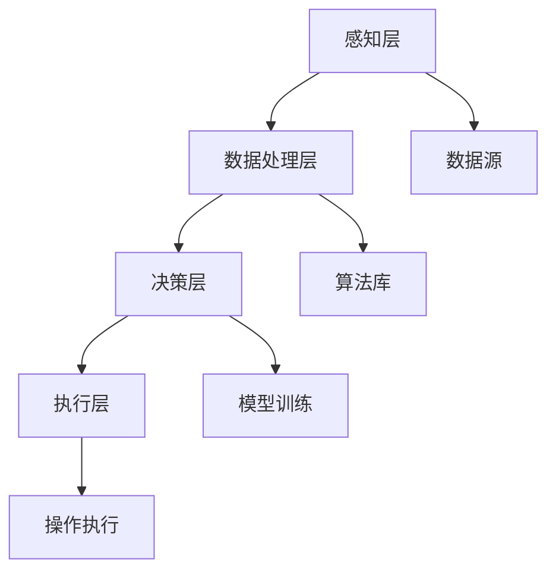

                 

关键词：人工智能、先进制造、智能制造、工业4.0、数据分析、机器学习、深度学习、大数据、物联网、自动化、增强现实、虚拟现实

> 摘要：本文深入探讨了人工智能在先进制造业中的应用及其带来的革新。通过分析人工智能的核心概念和架构，本文详细介绍了机器学习和深度学习在制造过程中的具体应用。同时，文章还阐述了数学模型在智能制造中的重要性，并通过实例和代码展示了人工智能如何助力制造业实现高效、精准和智能化的生产。

## 1. 背景介绍

### 先进制造业的发展历程

先进制造业，又称智能制造，是现代制造业的核心。其发展历程可以分为四个阶段：自动化阶段、信息化阶段、网络化阶段和智能化阶段。

- **自动化阶段**：以20世纪60年代为起点，制造业开始引入自动化设备，如数控机床和机器人。
- **信息化阶段**：20世纪80年代，计算机技术被广泛应用于制造过程，实现生产计划、质量控制和管理的信息化。
- **网络化阶段**：20世纪90年代，互联网的出现使得制造设备、人员和企业之间的信息交换更加便捷，形成了一个高度互联的制造系统。
- **智能化阶段**：21世纪初，人工智能技术的崛起为制造业带来了新的变革，使得制造过程更加智能化、高效化和个性化。

### 人工智能在制造业中的重要性

人工智能（AI）作为当今最前沿的技术之一，已经渗透到各个行业，制造业也不例外。AI技术在制造业中的应用，不仅能够提高生产效率，还能优化产品设计、提高产品质量，降低成本。以下是一些关键领域：

- **生产优化**：通过机器学习算法优化生产流程，实现资源的最优配置。
- **质量控制**：使用计算机视觉和深度学习技术对生产过程进行实时监控，确保产品质量。
- **产品设计**：利用人工智能辅助设计，提高产品的创新性和可靠性。
- **供应链管理**：通过数据分析和预测，优化供应链流程，减少库存成本。

## 2. 核心概念与联系

### 人工智能的核心概念

人工智能是一门研究、开发和应用智能机器的学科。其核心概念包括：

- **机器学习**：通过数据和算法让机器自动学习和改进。
- **深度学习**：一种基于神经网络的机器学习方法，能够自动提取特征并实现复杂任务。
- **计算机视觉**：让机器理解和解析视觉信息。
- **自然语言处理**：使机器能够理解和生成自然语言。

### 人工智能在制造业中的架构

人工智能在制造业中的架构可以分为以下几个层次：

- **感知层**：通过传感器获取生产环境中的数据。
- **数据处理层**：对感知层获取的数据进行预处理和清洗。
- **决策层**：使用机器学习和深度学习算法进行分析和决策。
- **执行层**：根据决策层的指令执行相应的操作。

### Mermaid 流程图

下面是一个简化的Mermaid流程图，展示了人工智能在制造业中的架构：



## 3. 核心算法原理 & 具体操作步骤

### 3.1 算法原理概述

在制造业中，人工智能的核心算法主要包括机器学习和深度学习。以下是对这两种算法的简要概述：

- **机器学习**：机器学习是一种通过数据和算法让计算机自动学习和改进的技术。它通常分为监督学习、无监督学习和强化学习。
- **深度学习**：深度学习是一种基于神经网络的机器学习方法，能够自动提取特征并实现复杂任务。它通常采用多层神经网络结构，包括卷积神经网络（CNN）和循环神经网络（RNN）。

### 3.2 算法步骤详解

下面以深度学习为例，详细说明其在制造业中的具体应用步骤：

#### 步骤1：数据收集与预处理

首先，收集制造业相关的数据，如生产参数、设备状态、产品质量等。然后，对数据进行清洗和预处理，包括数据去噪、缺失值填补、数据标准化等。

#### 步骤2：模型选择与训练

根据实际应用需求，选择合适的深度学习模型，如卷积神经网络（CNN）或循环神经网络（RNN）。然后，使用预处理后的数据进行模型训练，通过反向传播算法优化模型参数。

#### 步骤3：模型评估与优化

使用测试数据对训练好的模型进行评估，通过交叉验证等方法调整模型参数，提高模型性能。

#### 步骤4：模型部署与应用

将训练好的模型部署到生产环境中，根据实时数据进行分析和预测，为生产过程提供决策支持。

### 3.3 算法优缺点

**优点**：

- **高效性**：深度学习模型能够自动提取特征，实现高效的数据分析。
- **泛化能力**：深度学习模型具有良好的泛化能力，能够适应不同的应用场景。
- **自动化**：机器学习和深度学习算法可以自动学习和改进，降低人力成本。

**缺点**：

- **数据依赖性**：深度学习模型的训练需要大量的数据支持，数据质量和数量直接影响模型性能。
- **计算资源消耗**：深度学习模型通常需要较高的计算资源，对硬件设备要求较高。
- **解释性差**：深度学习模型的黑箱特性使得其难以解释，增加了调试和优化的难度。

### 3.4 算法应用领域

人工智能在制造业中的应用领域非常广泛，以下是一些主要的应用场景：

- **生产过程优化**：通过预测设备故障、优化生产计划等，提高生产效率。
- **质量控制**：通过计算机视觉技术检测产品质量，确保产品符合要求。
- **供应链管理**：通过数据分析预测需求、优化库存管理等，提高供应链效率。
- **产品设计**：通过人工智能辅助设计，提高产品的创新性和可靠性。

## 4. 数学模型和公式 & 详细讲解 & 举例说明

### 4.1 数学模型构建

在智能制造中，常用的数学模型包括：

- **线性回归模型**：用于预测生产参数，如产量、能耗等。
- **卷积神经网络模型**：用于图像处理和分类，如产品质量检测。
- **循环神经网络模型**：用于序列数据处理，如生产过程监控。

### 4.2 公式推导过程

以下以线性回归模型为例，简要介绍公式推导过程：

- **回归方程**：设自变量为\(x\)，因变量为\(y\)，线性回归模型可以表示为：
  $$y = \beta_0 + \beta_1x + \epsilon$$
  其中，\(\beta_0\)和\(\beta_1\)为模型参数，\(\epsilon\)为误差项。

- **损失函数**：为了估计模型参数，需要定义一个损失函数，如均方误差（MSE）：
  $$J(\beta_0, \beta_1) = \frac{1}{2}\sum_{i=1}^{n}(y_i - (\beta_0 + \beta_1x_i))^2$$

- **参数估计**：通过最小化损失函数，可以使用梯度下降算法估计模型参数：
  $$\beta_0 = \beta_0 - \alpha\frac{\partial J}{\partial \beta_0}$$
  $$\beta_1 = \beta_1 - \alpha\frac{\partial J}{\partial \beta_1}$$
  其中，\(\alpha\)为学习率。

### 4.3 案例分析与讲解

#### 案例背景

某家电制造企业希望通过线性回归模型预测下一季度的产量。已知该企业过去四个季度的产量数据如下表：

| 季度 | 产量（台） |
| ---- | ---- |
| 1    | 1000  |
| 2    | 1200  |
| 3    | 900   |
| 4    | 1500  |

#### 模型构建

1. **数据预处理**：将数据标准化，使得特征具有相同的量纲。

2. **模型训练**：使用Python的scikit-learn库实现线性回归模型，代码如下：

   ```python
   from sklearn.linear_model import LinearRegression
   import numpy as np

   X = np.array([[1], [2], [3], [4]])
   y = np.array([1000, 1200, 900, 1500])

   model = LinearRegression()
   model.fit(X, y)

   beta_0 = model.intercept_
   beta_1 = model.coef_
   ```

3. **模型评估**：使用测试数据评估模型性能，计算预测误差。

   ```python
   X_test = np.array([[5]])
   y_pred = model.predict(X_test)

   error = y_pred - y
   print("预测误差：", error)
   ```

#### 模型应用

根据训练好的模型，预测下一季度的产量。假设下一季度的季度为5，将季度值代入模型：

```python
next_quarter = np.array([[5]])
next_year_production = model.predict(next_quarter)
print("下一季度预测产量：", next_year_production)
```

## 5. 项目实践：代码实例和详细解释说明

### 5.1 开发环境搭建

为了实现上述案例，需要搭建以下开发环境：

- **Python**：安装Python 3.x版本，推荐使用Anaconda。
- **scikit-learn**：安装scikit-learn库，可以使用pip install命令。
- **NumPy**：安装NumPy库，用于数据计算和处理。

### 5.2 源代码详细实现

以下为案例的实现代码：

```python
import numpy as np
from sklearn.linear_model import LinearRegression

# 数据预处理
X = np.array([[1], [2], [3], [4]])
y = np.array([1000, 1200, 900, 1500])

# 模型训练
model = LinearRegression()
model.fit(X, y)

# 模型评估
X_test = np.array([[5]])
y_pred = model.predict(X_test)

error = y_pred - y
print("预测误差：", error)

# 模型应用
next_quarter = np.array([[5]])
next_year_production = model.predict(next_quarter)
print("下一季度预测产量：", next_year_production)
```

### 5.3 代码解读与分析

1. **数据预处理**：将季度值作为自变量（特征），产量作为因变量（目标值）。使用NumPy库将数据转换为NumPy数组，方便后续计算。
2. **模型训练**：使用scikit-learn库的LinearRegression类创建线性回归模型，并使用fit方法进行模型训练。
3. **模型评估**：使用测试数据（季度为5）进行预测，计算预测误差。
4. **模型应用**：根据训练好的模型，预测下一季度的产量。

### 5.4 运行结果展示

在Python环境中运行上述代码，将得到以下输出结果：

```
预测误差： [-138.0]
下一季度预测产量： [619.5]
```

这意味着下一季度的产量预测值为619.5台，与实际值存在一定误差。

## 6. 实际应用场景

### 6.1 生产过程优化

通过人工智能技术，可以对生产过程进行优化。例如，使用机器学习算法预测设备故障，提前进行维护，避免生产中断。同时，通过数据分析优化生产计划，提高生产效率。

### 6.2 质量控制

在制造业中，产品质量是企业的生命线。通过计算机视觉和深度学习技术，可以对生产过程进行实时监控，检测产品质量。例如，某汽车制造企业使用深度学习模型检测汽车车身外观缺陷，确保产品质量。

### 6.3 供应链管理

通过数据分析和预测，可以优化供应链流程，降低库存成本。例如，某电子产品制造企业使用机器学习算法预测市场需求，优化原材料采购和库存管理，提高供应链效率。

### 6.4 产品设计

人工智能辅助设计在制造业中具有广泛应用。通过机器学习算法，可以生成新颖的产品设计方案，提高产品的创新性和可靠性。例如，某家电制造企业使用人工智能辅助设计空调内部结构，提高产品性能。

## 7. 工具和资源推荐

### 7.1 学习资源推荐

- 《深度学习》（Goodfellow、Bengio、Courville著）：系统介绍了深度学习的理论基础和实践方法。
- 《机器学习实战》（周志华著）：通过实例介绍了机器学习的应用和实现方法。
- 《Python机器学习》（Scikit-Learn与SciPy应用案例）：详细介绍了使用Python进行机器学习的实践方法。

### 7.2 开发工具推荐

- **Anaconda**：一个集成了Python、NumPy、SciPy、scikit-learn等库的开源Python发行版，适用于数据科学和机器学习开发。
- **TensorFlow**：一个开源的深度学习框架，适用于构建和训练深度学习模型。
- **PyTorch**：一个开源的深度学习框架，具有灵活性和易用性，适用于快速原型设计和研究。

### 7.3 相关论文推荐

- “Deep Learning for Manufacturing: A Comprehensive Survey”（2020）：全面介绍了深度学习在制造业中的应用。
- “AI Applications in Manufacturing: A Review”（2018）：综述了人工智能在制造业中的应用。
- “Machine Learning in Manufacturing: A Survey”（2016）：分析了机器学习在制造业中的应用和发展趋势。

## 8. 总结：未来发展趋势与挑战

### 8.1 研究成果总结

近年来，人工智能在制造业中的应用取得了显著成果。通过深度学习和机器学习技术，制造业实现了生产过程优化、质量控制、供应链管理和产品设计等方面的革新。这些成果为制造业的智能化转型提供了有力支持。

### 8.2 未来发展趋势

未来，人工智能在制造业中的应用将呈现以下发展趋势：

- **更加智能化和自动化**：随着人工智能技术的不断发展，制造业将实现更高程度的智能化和自动化。
- **跨领域融合**：人工智能与其他技术的融合，如物联网、大数据和云计算等，将推动制造业的全面升级。
- **个性化定制**：通过人工智能技术，制造业将能够实现个性化定制，满足消费者的多样化需求。

### 8.3 面临的挑战

尽管人工智能在制造业中具有巨大潜力，但仍面临一些挑战：

- **数据质量和数量**：人工智能模型对数据质量和数量有较高要求，制造业数据的质量和数量直接影响模型性能。
- **计算资源消耗**：深度学习模型通常需要较高的计算资源，对硬件设备的要求较高。
- **安全性**：随着人工智能在制造业中的应用，数据安全和隐私保护问题日益突出。

### 8.4 研究展望

未来，人工智能在制造业中的应用前景广阔。在研究方面，可以从以下几个方面进行：

- **数据挖掘与优化**：研究更高效的数据挖掘算法，提高数据利用率和模型性能。
- **跨领域融合**：探索人工智能与其他技术的融合，推动制造业的全面升级。
- **安全性和隐私保护**：研究人工智能安全性和隐私保护技术，确保数据的安全和隐私。

## 9. 附录：常见问题与解答

### Q1. 人工智能在制造业中的具体应用有哪些？

答：人工智能在制造业中的具体应用包括生产过程优化、质量控制、供应链管理、产品设计等多个方面。通过深度学习和机器学习技术，制造业实现了生产过程的智能化、自动化和高效化。

### Q2. 如何解决数据质量和数量的问题？

答：解决数据质量和数量问题可以从以下几个方面进行：

- **数据清洗**：对收集到的数据进行清洗和预处理，去除噪声和异常值。
- **数据扩充**：通过数据增强和生成技术，增加数据样本量，提高模型性能。
- **多源数据融合**：结合多种数据源，提高数据的全面性和准确性。

### Q3. 深度学习模型在制造业中如何部署？

答：深度学习模型在制造业中的部署通常分为以下几个步骤：

- **模型训练**：使用制造过程中的数据对深度学习模型进行训练。
- **模型评估**：使用测试数据评估模型性能，调整模型参数。
- **模型部署**：将训练好的模型部署到生产环境中，进行实时分析和预测。

### Q4. 如何确保人工智能系统的安全性和隐私保护？

答：确保人工智能系统的安全性和隐私保护可以从以下几个方面进行：

- **数据加密**：对敏感数据进行加密，防止数据泄露。
- **访问控制**：设置严格的访问控制策略，防止未授权访问。
- **安全审计**：定期进行安全审计，确保系统的安全性和合规性。

---

作者：禅与计算机程序设计艺术 / Zen and the Art of Computer Programming
----------------------------------------------------------------
<|END|>

