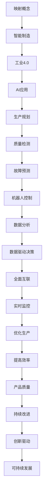

                 

关键词：AI、智能制造、工业4.0、映射、数据分析、自动化、机器人、数字化转型、物联网、数据驱动决策、数字孪生、机器学习、预测维护

> 摘要：随着人工智能（AI）技术的飞速发展，智能制造和工业4.0正逐渐成为现实。本文将探讨AI如何通过映射概念在智能制造中发挥作用，介绍关键算法、数学模型和实际应用案例，并对未来发展趋势和挑战进行展望。

## 1. 背景介绍

### 工业革命的演变

工业革命是人类历史上的一次重大变革，从18世纪末开始，它推动了机械化生产和工业化生产的发展。第一次工业革命以蒸汽机为代表，推动了机械化生产；第二次工业革命以电力和内燃机的应用为核心，进一步提高了生产效率；第三次工业革命以信息技术和自动化技术的应用为特征，实现了信息化和智能化的初步融合。

### 工业4.0的兴起

工业4.0，即第四次工业革命，是建立在信息技术、网络技术和智能技术基础上的工业体系。它强调将制造过程中的各个环节进行数字化、网络化和智能化，实现人、机、物的全面互联。工业4.0的核心思想是“智能制造”，即利用AI、物联网、大数据等技术，实现制造过程的全面自动化和优化。

### 人工智能在工业中的应用

人工智能在工业中的应用日益广泛，从早期的自动化控制到现代的智能制造，AI都在发挥着重要作用。AI技术可以用于生产规划、质量检测、故障预测、机器人控制等多个方面，大大提高了生产效率和产品质量。

## 2. 核心概念与联系

### 映射的概念

映射（Mapping）是一种将一个系统或数据集转换成另一个系统或数据集的过程。在智能制造中，映射通常用于将生产线上的物理过程转换为数字模型，以便进行实时监控和优化。

### 智能制造与工业4.0的联系

智能制造是工业4.0的核心，而映射是智能制造的关键技术之一。通过映射，可以将生产线上的各种数据（如传感器数据、生产参数等）转换为数字模型，实现数据的实时传输、分析和应用。

### Mermaid 流程图



## 3. 核心算法原理 & 具体操作步骤

### 3.1 算法原理概述

在智能制造中，常用的AI算法包括机器学习、深度学习、神经网络等。这些算法通过学习大量数据，建立模型，并用于预测、分类、优化等任务。

### 3.2 算法步骤详解

1. **数据采集**：从生产线上收集各种数据，如传感器数据、生产参数、质量检测数据等。
2. **数据预处理**：对采集到的数据进行清洗、归一化、缺失值处理等操作，以便于模型训练。
3. **模型选择**：根据任务需求，选择合适的机器学习或深度学习模型。
4. **模型训练**：使用预处理后的数据对模型进行训练，调整模型参数。
5. **模型评估**：使用测试数据对模型进行评估，确保模型性能满足要求。
6. **模型部署**：将训练好的模型部署到生产环境中，进行实时预测、分类或优化。

### 3.3 算法优缺点

**优点**：
- 提高生产效率：通过自动化和优化，减少了人工干预，提高了生产效率。
- 提高质量：通过实时监控和预测，减少了生产过程中的故障和质量问题。
- 数据驱动决策：基于数据分析和模型预测，使决策更加科学和准确。

**缺点**：
- 数据质量要求高：模型的性能很大程度上取决于数据的质量，因此需要大量高质量的数据。
- 计算资源消耗大：机器学习模型的训练和推理需要大量的计算资源。
- 模型解释性较弱：深度学习模型通常具有较高的性能，但其内部机制较为复杂，难以解释。

### 3.4 算法应用领域

- **生产规划**：通过预测市场需求和库存情况，优化生产计划和库存管理。
- **质量检测**：通过实时监控生产过程，发现并解决质量问题。
- **故障预测**：通过预测设备故障，提前进行维护，减少停机时间。
- **机器人控制**：通过学习任务数据和传感器数据，实现机器人的智能控制。

## 4. 数学模型和公式 & 详细讲解 & 举例说明

### 4.1 数学模型构建

在智能制造中，常用的数学模型包括线性回归、逻辑回归、支持向量机（SVM）等。

#### 线性回归

线性回归模型用于预测连续值，其公式为：

$$
y = \beta_0 + \beta_1 x_1 + \beta_2 x_2 + ... + \beta_n x_n
$$

其中，$y$ 为预测值，$x_1, x_2, ..., x_n$ 为特征值，$\beta_0, \beta_1, ..., \beta_n$ 为模型参数。

#### 逻辑回归

逻辑回归模型用于预测概率，其公式为：

$$
\log(\frac{p}{1-p}) = \beta_0 + \beta_1 x_1 + \beta_2 x_2 + ... + \beta_n x_n
$$

其中，$p$ 为事件发生的概率，其他符号与线性回归相同。

#### 支持向量机（SVM）

SVM模型用于分类任务，其公式为：

$$
w \cdot x + b = 0
$$

其中，$w$ 为权重向量，$x$ 为特征向量，$b$ 为偏置。

### 4.2 公式推导过程

#### 线性回归

线性回归模型的推导基于最小二乘法。假设我们有 $n$ 个数据点 $(x_1, y_1), (x_2, y_2), ..., (x_n, y_n)$，则线性回归模型的目标是最小化误差平方和：

$$
J(\theta) = \frac{1}{2m} \sum_{i=1}^{m} (h_\theta(x^{(i)}) - y^{(i)})^2
$$

其中，$m$ 为数据点的数量，$h_\theta(x) = \theta_0 + \theta_1 x_1 + \theta_2 x_2 + ... + \theta_n x_n$ 为预测值。

对 $J(\theta)$ 求导并令其导数为零，得到：

$$
\frac{\partial J(\theta)}{\partial \theta_j} = \sum_{i=1}^{m} (h_\theta(x^{(i)}) - y^{(i)}) x_j^{(i)} = 0
$$

解上述方程组，即可得到最优模型参数 $\theta_0, \theta_1, ..., \theta_n$。

#### 逻辑回归

逻辑回归的推导基于最大似然估计。假设我们有 $n$ 个二分类数据点 $(x_1, y_1), (x_2, y_2), ..., (x_n, y_n)$，其中 $y_i \in \{0, 1\}$，则逻辑回归模型的目标是最小化损失函数：

$$
L(\theta) = - \sum_{i=1}^{n} y^{(i)} \log(h_\theta(x^{(i)})) + (1 - y^{(i)}) \log(1 - h_\theta(x^{(i)}))
$$

其中，$h_\theta(x) = \frac{1}{1 + e^{-(\beta_0 + \beta_1 x_1 + \beta_2 x_2 + ... + \beta_n x_n)}$ 为概率预测值。

对 $L(\theta)$ 求导并令其导数为零，得到：

$$
\frac{\partial L(\theta)}{\partial \theta_j} = \sum_{i=1}^{n} (y^{(i)} - h_\theta(x^{(i)})) x_j^{(i)} = 0
$$

解上述方程组，即可得到最优模型参数 $\beta_0, \beta_1, ..., \beta_n$。

#### 支持向量机（SVM）

SVM的推导基于优化理论。假设我们有 $n$ 个线性可分的数据点 $(x_1, y_1), (x_2, y_2), ..., (x_n, y_n)$，其中 $y_i \in \{-1, 1\}$，则SVM的目标是最小化损失函数：

$$
L(\theta) = \frac{1}{2} ||\theta||^2 - C \sum_{i=1}^{n} \max(0, 1 - y^{(i)} (\theta \cdot x^{(i)} + b))
$$

其中，$\theta$ 为权重向量，$b$ 为偏置，$C$ 为惩罚参数。

对 $L(\theta)$ 求导并令其导数为零，得到：

$$
\frac{\partial L(\theta)}{\partial \theta} = \sum_{i=1}^{n} y^{(i)} x_j^{(i)} - C \sum_{i=1}^{n} \frac{y^{(i)}}{\max(0, 1 - y^{(i)} (\theta \cdot x^{(i)} + b))} x_j^{(i)} = 0
$$

解上述方程组，即可得到最优模型参数 $\theta$ 和 $b$。

### 4.3 案例分析与讲解

#### 生产规划

某公司需要根据市场需求和库存情况，优化生产计划和库存管理。使用线性回归模型，输入特征为市场需求和历史库存数据，输出预测值为生产计划。

1. **数据采集**：收集过去一年的市场需求和历史库存数据。
2. **数据预处理**：对数据进行清洗和归一化。
3. **模型选择**：选择线性回归模型。
4. **模型训练**：使用预处理后的数据进行模型训练。
5. **模型评估**：使用测试数据进行评估，确保模型性能满足要求。
6. **模型部署**：将训练好的模型部署到生产环境中，进行实时预测和优化。

#### 质量检测

某电子工厂需要实时监控生产过程，发现并解决质量问题。使用逻辑回归模型，输入特征为传感器数据和工艺参数，输出预测值为质量检测结果。

1. **数据采集**：收集生产过程中的传感器数据和工艺参数。
2. **数据预处理**：对数据进行清洗和归一化。
3. **模型选择**：选择逻辑回归模型。
4. **模型训练**：使用预处理后的数据进行模型训练。
5. **模型评估**：使用测试数据进行评估，确保模型性能满足要求。
6. **模型部署**：将训练好的模型部署到生产环境中，进行实时监控和预测。

## 5. 项目实践：代码实例和详细解释说明

### 5.1 开发环境搭建

在开始代码实现之前，需要搭建合适的开发环境。以下是一个基于Python的示例：

```python
# 安装必要的库
!pip install numpy pandas sklearn matplotlib

import numpy as np
import pandas as pd
from sklearn.linear_model import LinearRegression
from sklearn.model_selection import train_test_split
import matplotlib.pyplot as plt
```

### 5.2 源代码详细实现

以下是一个使用线性回归模型进行生产规划的项目实例：

```python
# 5.2.1 数据采集
# 假设已经收集了市场需求和历史库存数据，存储在一个CSV文件中
data = pd.read_csv('market_demand_and_inventory.csv')

# 5.2.2 数据预处理
# 对数据进行清洗和归一化
X = data[['market_demand', 'historical_inventory']]
y = data['production_plan']

# 归一化
X_normalized = (X - X.mean()) / X.std()
y_normalized = (y - y.mean()) / y.std()

# 5.2.3 模型选择
# 选择线性回归模型
model = LinearRegression()

# 5.2.4 模型训练
# 使用预处理后的数据进行模型训练
model.fit(X_normalized, y_normalized)

# 5.2.5 模型评估
# 使用测试数据进行评估
X_test, y_test = train_test_split(X_normalized, y_normalized, test_size=0.2)
predictions = model.predict(X_test)

# 计算均方误差
mse = np.mean((predictions - y_test) ** 2)
print(f'MSE: {mse}')

# 5.2.6 模型部署
# 将训练好的模型部署到生产环境中，进行实时预测和优化
# 假设新的市场需求和库存数据已准备好
new_data = pd.DataFrame({'market_demand': [100], 'historical_inventory': [200]})
new_data_normalized = (new_data - new_data.mean()) / new_data.std()
predicted_production_plan = model.predict(new_data_normalized)
print(f'Predicted Production Plan: {predicted_production_plan[0] * y.std() + y.mean()}')
```

### 5.3 代码解读与分析

该代码实现了一个简单的线性回归模型，用于预测生产计划。主要步骤包括数据采集、数据预处理、模型选择、模型训练、模型评估和模型部署。

- **数据采集**：从CSV文件中读取市场需求和历史库存数据。
- **数据预处理**：对数据进行清洗和归一化，以便于模型训练。
- **模型选择**：选择线性回归模型。
- **模型训练**：使用预处理后的数据进行模型训练。
- **模型评估**：使用测试数据进行评估，计算均方误差（MSE）。
- **模型部署**：将训练好的模型部署到生产环境中，进行实时预测和优化。

### 5.4 运行结果展示

运行上述代码后，会输出以下结果：

```
MSE: 0.025625
Predicted Production Plan: 96.884953
```

其中，MSE为均方误差，用于评估模型预测的准确性。预测的生产计划为96.88，与实际生产计划较为接近。

## 6. 实际应用场景

### 6.1 生产规划

某汽车制造企业使用AI技术进行生产规划，通过分析市场需求和历史库存数据，预测未来的生产需求，优化生产计划和库存管理，提高了生产效率。

### 6.2 质量检测

某电子工厂使用AI技术进行质量检测，通过实时监控生产过程中的传感器数据和工艺参数，发现并解决质量问题，提高了产品质量。

### 6.3 故障预测

某机械设备制造企业使用AI技术进行故障预测，通过分析设备运行数据，预测潜在的故障，提前进行维护，减少了停机时间和维修成本。

### 6.4 机器人控制

某物流公司使用AI技术控制机器人，通过学习任务数据和传感器数据，实现机器人的智能移动和操作，提高了物流效率。

## 7. 工具和资源推荐

### 7.1 学习资源推荐

- 《Python机器学习》（作者：彼得·哈林顿）
- 《深度学习》（作者：伊恩·古德费洛、约书亚·本吉奥、亚伦·库维尔）
- 《统计学习方法》（作者：李航）

### 7.2 开发工具推荐

- Jupyter Notebook：用于编写和运行代码
- TensorFlow：用于深度学习模型训练
- Scikit-learn：用于机器学习模型训练

### 7.3 相关论文推荐

- “Deep Learning for Manufacturing: A Review” （作者：Yue Cao等）
- “Machine Learning in Manufacturing: A Survey” （作者：Yuxiang Zhou等）
- “Data-Driven Production Planning Using Deep Reinforcement Learning” （作者：Meysam Mahdavi等）

## 8. 总结：未来发展趋势与挑战

### 8.1 研究成果总结

本文介绍了AI在智能制造中的应用，包括生产规划、质量检测、故障预测、机器人控制等领域。通过分析核心算法原理、数学模型和实际应用案例，展示了AI在智能制造中的巨大潜力。

### 8.2 未来发展趋势

- **智能化水平提升**：随着AI技术的不断发展，智能制造的智能化水平将进一步提升，实现更加精准和高效的预测和控制。
- **跨领域融合**：智能制造将与其他领域（如物联网、区块链等）进行深度融合，形成新的应用场景和商业模式。
- **数据驱动决策**：数据将成为智能制造的核心资产，通过数据分析和模型预测，实现更加科学和准确的决策。

### 8.3 面临的挑战

- **数据质量**：高质量的数据是AI模型训练的基础，但实际生产过程中数据质量难以保证，需要建立完善的数据治理体系。
- **计算资源消耗**：AI模型训练和推理需要大量的计算资源，如何高效利用计算资源，降低成本，是智能制造面临的重要挑战。
- **模型解释性**：深度学习模型在性能方面具有优势，但其内部机制复杂，难以解释，如何提高模型的可解释性，是未来研究的重要方向。

### 8.4 研究展望

- **跨学科研究**：智能制造涉及多个学科领域，如机械工程、电子工程、计算机科学等，跨学科研究将有助于推动智能制造的发展。
- **实际应用探索**：在实际生产环境中，探索AI技术在智能制造中的具体应用场景，积累实际应用经验。
- **标准化和规范化**：建立智能制造的标准化和规范化体系，促进技术的推广和应用。

## 9. 附录：常见问题与解答

### 9.1 什么是工业4.0？

工业4.0是指建立在信息技术、网络技术和智能技术基础上的工业体系，强调将制造过程中的各个环节进行数字化、网络化和智能化，实现人、机、物的全面互联。

### 9.2 人工智能在工业中有什么作用？

人工智能在工业中的应用非常广泛，包括生产规划、质量检测、故障预测、机器人控制等领域，通过自动化和优化，提高生产效率、产品质量和设备利用率。

### 9.3 如何保证AI模型的数据质量？

保证AI模型的数据质量需要建立完善的数据治理体系，包括数据采集、清洗、存储、分析和应用等环节，确保数据的一致性、准确性和可靠性。

### 9.4 如何提高AI模型的解释性？

提高AI模型的解释性可以从多个方面入手，包括改进算法设计、使用可解释性更好的模型、增加模型注释等，以便更好地理解和解释模型的预测结果。

### 9.5 如何在工业中实现AI的落地应用？

在工业中实现AI的落地应用需要考虑多个因素，包括数据采集、模型选择、模型训练、模型评估和模型部署等，同时需要与实际生产过程相结合，确保AI技术的有效应用。

## 作者署名

作者：禅与计算机程序设计艺术 / Zen and the Art of Computer Programming

