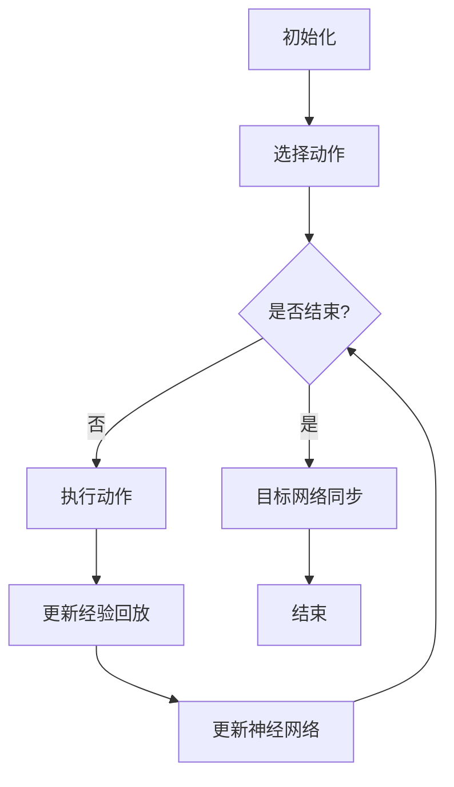

                 

关键词：深度强化学习、DQN、工业自动化、机器学习应用、自动化控制、优化算法、智能决策

摘要：本文将探讨深度强化学习（DRL）中的一种重要算法——深度Q网络（DQN）在工业自动化领域的应用。通过对DQN的基本原理、实现步骤、优缺点及数学模型的深入分析，本文旨在揭示DQN在工业自动化中面临的挑战与机遇，并为未来的发展提供指导。

## 1. 背景介绍

随着工业4.0的到来，工业自动化成为现代工业发展的核心驱动力。自动化控制系统可以显著提高生产效率，减少人工干预，降低生产成本，并确保产品质量的稳定性。然而，传统的自动化控制系统主要依赖于预先编程的逻辑和规则，其灵活性受到很大限制。随着工业环境变得越来越复杂和动态，仅仅依靠传统的控制方法已经无法满足现代工业自动化的需求。

近年来，机器学习（ML）和深度学习（DL）技术的迅速发展，为工业自动化带来了新的希望。特别是深度强化学习（DRL），作为一种结合了深度学习和强化学习的先进技术，在解决复杂决策问题时表现出色。DQN，作为DRL的一个经典算法，以其强大的学习和适应能力在各个领域获得了广泛应用。

本文旨在深入探讨DQN在工业自动化中的应用，分析其面临的挑战和机遇，为未来DQN在工业自动化中的发展提供指导。

### 1.1 工业自动化的现状与挑战

工业自动化的发展经历了多个阶段。最初，自动化主要是通过机械和电气元件来实现，如自动化的传送带和机械臂。随着计算机技术和通信技术的进步，自动化控制系统逐渐引入了传感器、PLC（可编程逻辑控制器）和SCADA（监控和数据采集系统）。这些系统可以实时监测生产线状态，并根据预设的程序进行操作。

然而，现代工业自动化面临着一系列挑战：

1. **复杂性和动态性**：现代工业环境变得越来越复杂，设备种类繁多，工作流程多变。传统的控制方法难以应对这种复杂性和动态性。
2. **灵活性和适应性**：传统的自动化控制系统灵活性较低，难以适应生产过程中出现的各种新情况。
3. **精度和效率**：随着市场竞争的加剧，工业生产对精度和效率的要求越来越高。传统的控制方法在这些方面的表现有限。

### 1.2 DQN的基本概念与原理

DQN是一种基于深度学习的强化学习算法，它通过深度神经网络（DNN）来近似状态值函数（Q函数），从而进行智能决策。DQN的主要思想是使用经验回放和目标网络来稳定学习过程。

DQN的核心组件包括：

1. **状态（State）**：描述当前环境的状况。
2. **动作（Action）**：智能体可以采取的操作。
3. **奖励（Reward）**：智能体在执行动作后获得的即时奖励。
4. **Q函数（Q-Function）**：预测每个动作在给定状态下所能获得的未来累积奖励。
5. **经验回放（Experience Replay）**：存储和随机抽样以往的经验，以避免策略的偏差。
6. **目标网络（Target Network）**：用于稳定学习过程，定期从主网络复制参数。

DQN通过以下步骤进行学习：

1. **初始化**：随机初始化神经网络权重和经验回放记忆。
2. **选择动作**：在给定状态下，使用ε-贪心策略选择动作。
3. **执行动作**：在环境中执行选定的动作，并观察新的状态和奖励。
4. **更新经验回放**：将新的经验（状态、动作、奖励、新状态）加入经验回放记忆。
5. **更新神经网络**：通过经验回放中的样本，使用梯度下降法更新神经网络的权重。
6. **目标网络同步**：定期从主网络复制参数到目标网络，以稳定学习过程。

### 1.3 DQN在工业自动化中的应用前景

DQN在工业自动化中的应用前景广阔。它可以通过学习环境中的状态和动作，实现对复杂生产过程的智能控制和优化。以下是一些潜在的应用领域：

1. **生产调度**：通过学习生产线的状态和任务需求，DQN可以优化生产调度的策略，提高生产效率。
2. **质量检测**：DQN可以用于检测生产线上的产品质量，并实时调整生产过程，确保产品质量的稳定性。
3. **故障诊断**：DQN可以学习设备的运行状态，并在出现故障时提供诊断建议，减少停机时间。
4. **能源管理**：DQN可以优化工厂的能源使用，减少能源消耗和成本。

## 2. 核心概念与联系

为了更好地理解DQN在工业自动化中的应用，我们需要深入探讨其核心概念与联系，包括状态、动作、奖励、Q函数、经验回放和目标网络。

### 2.1 状态（State）

在DQN中，状态（State）是描述当前环境的状况。在工业自动化中，状态可能包括：

- 机器的状态（如运行、停机、故障等）。
- 生产线上的物料状态（如位置、数量、质量等）。
- 生产线的能耗数据。
- 设备的温度、湿度等环境参数。

状态通常是多维的，可以表示为一个向量。例如，一个简单的状态向量可能包含机器的状态、物料的位置和数量、能耗数据等。

### 2.2 动作（Action）

动作（Action）是智能体可以采取的操作。在工业自动化中，动作可能包括：

- 控制机器的启停。
- 调整生产线上的物料位置。
- 调节生产参数（如温度、压力等）。
- 故障处理操作。

动作通常也是多维的，可以表示为一个向量。例如，一个简单的动作向量可能包含机器的启停指令、物料位置的调整指令等。

### 2.3 奖励（Reward）

奖励（Reward）是智能体在执行动作后获得的即时奖励。在工业自动化中，奖励通常与生产效率、产品质量、能耗等指标相关。例如：

- 如果生产调度策略成功提高了生产效率，可以给予较高的奖励。
- 如果质量检测策略成功识别并纠正了质量问题，可以给予较高的奖励。
- 如果能源管理策略成功降低了能源消耗，可以给予较高的奖励。

奖励的设定需要根据具体应用场景进行调整，以确保算法能够学习到正确的决策。

### 2.4 Q函数（Q-Function）

Q函数（Q-Function）是预测每个动作在给定状态下所能获得的未来累积奖励的函数。在DQN中，Q函数由一个深度神经网络（DNN）近似。Q函数的输出是一个值向量，其中每个元素表示在给定状态下执行相应动作所能获得的预期奖励。

Q函数的优化目标是最大化智能体的长期累积奖励。通过梯度下降法，DQN不断更新神经网络的权重，以最小化预测值与实际奖励之间的差距。

### 2.5 经验回放（Experience Replay）

经验回放（Experience Replay）是DQN中用于稳定学习过程的重要机制。经验回放通过存储和随机抽样以往的经验，避免了策略的偏差和过度拟合。具体来说，经验回放包括以下几个步骤：

1. **存储经验**：在智能体执行动作后，将当前状态、动作、奖励和新状态存储在经验池中。
2. **随机抽样**：在训练时，从经验池中随机抽样一组经验样本。
3. **经验转换**：将抽样得到的经验样本转换为训练数据，用于更新神经网络。

通过经验回放，DQN可以避免直接依赖最近的经验，从而提高学习过程的稳定性和鲁棒性。

### 2.6 目标网络（Target Network）

目标网络（Target Network）是DQN中用于稳定学习过程的关键组件。目标网络通过定期从主网络复制参数，提供了一个稳定的参考标准，用于更新主网络的权重。目标网络的目的是减少目标值（Target Value）的波动，从而提高学习过程的稳定性。

具体来说，目标网络的更新过程如下：

1. **定期复制**：在训练过程中，定期从主网络复制参数到目标网络。
2. **目标值计算**：使用目标网络计算每个状态的期望奖励（目标值）。
3. **权重更新**：使用目标值和实际奖励，通过梯度下降法更新主网络的权重。

通过目标网络，DQN可以避免直接更新主网络，从而减少权重的波动，提高学习过程的稳定性。

### 2.7 Mermaid 流程图

以下是一个简单的Mermaid流程图，展示了DQN的基本流程和核心组件：



## 3. 核心算法原理 & 具体操作步骤

### 3.1 算法原理概述

DQN（深度Q网络）是一种基于深度学习的强化学习算法，旨在通过学习环境中的状态值函数（Q函数）来进行智能决策。DQN的核心思想是使用深度神经网络（DNN）来近似Q函数，并通过经验回放和目标网络来稳定学习过程。

在DQN中，状态（State）是描述当前环境的状况，动作（Action）是智能体可以采取的操作，奖励（Reward）是智能体在执行动作后获得的即时奖励。Q函数（Q-Function）是预测每个动作在给定状态下所能获得的未来累积奖励的函数。DQN通过以下步骤进行学习：

1. **初始化**：随机初始化神经网络权重和经验回放记忆。
2. **选择动作**：在给定状态下，使用ε-贪心策略选择动作。
3. **执行动作**：在环境中执行选定的动作，并观察新的状态和奖励。
4. **更新经验回放**：将新的经验（状态、动作、奖励、新状态）加入经验回放记忆。
5. **更新神经网络**：通过经验回放中的样本，使用梯度下降法更新神经网络的权重。
6. **目标网络同步**：定期从主网络复制参数到目标网络，以稳定学习过程。

### 3.2 算法步骤详解

#### 3.2.1 初始化

初始化是DQN的第一步。主要包括：

1. **随机初始化神经网络权重**：使用随机初始化方法，如正态分布或均匀分布，初始化DNN的权重。
2. **初始化经验回放记忆**：创建一个经验回放记忆池，用于存储和随机抽样经验样本。

#### 3.2.2 选择动作

选择动作是DQN的核心步骤之一。给定当前状态，DQN使用ε-贪心策略选择动作。具体步骤如下：

1. **随机数生成**：生成一个随机数r，与参数ε进行比较。
2. **随机动作**：如果r小于ε，随机选择一个动作；否则，选择当前状态下的最优动作。

ε-贪心策略是一种平衡探索和利用的策略。在初期，ε较大，以增加探索概率，帮助算法发现新的有用信息。随着学习过程的进行，ε逐渐减小，以增加利用概率，确保算法在已知信息上进行优化。

#### 3.2.3 执行动作

执行动作是在环境中执行选定的动作，并观察新的状态和奖励。具体步骤如下：

1. **执行动作**：在环境中执行选定的动作。
2. **观察新状态**：记录执行动作后的新状态。
3. **获取奖励**：根据新状态和动作，从环境中获取即时奖励。

#### 3.2.4 更新经验回放

更新经验回放是DQN中用于稳定学习过程的重要机制。通过存储和随机抽样以往的经验，DQN可以避免直接依赖最近的经验，从而提高学习过程的稳定性和鲁棒性。具体步骤如下：

1. **存储经验**：将当前状态、动作、奖励和新状态存储在经验回放记忆池中。
2. **经验转换**：将存储的经验转换为训练数据，用于更新神经网络。

经验转换通常采用状态值转换（State-Value Transformation）方法，将状态和动作编码为神经网络可处理的格式。

#### 3.2.5 更新神经网络

更新神经网络是DQN中的关键步骤。通过经验回放中的样本，DQN使用梯度下降法更新神经网络的权重，以最小化预测值与实际奖励之间的差距。具体步骤如下：

1. **计算预测值**：使用当前状态和神经网络，计算每个动作的预测值（Q值）。
2. **计算目标值**：使用新状态和目标网络，计算每个动作的目标值（目标Q值）。
3. **计算损失函数**：计算预测值和目标值之间的差距，作为损失函数。
4. **反向传播**：使用梯度下降法，更新神经网络的权重。

损失函数通常采用均方误差（MSE）函数，即：

$$L(\theta) = \frac{1}{n}\sum_{i=1}^{n}(y_i - \hat{y}_i)^2$$

其中，$y_i$是目标值，$\hat{y}_i$是预测值，$n$是样本数量。

#### 3.2.6 目标网络同步

目标网络同步是DQN中用于稳定学习过程的关键组件。通过定期从主网络复制参数到目标网络，DQN可以避免直接更新主网络，从而减少权重的波动，提高学习过程的稳定性。具体步骤如下：

1. **定期复制**：在训练过程中，定期从主网络复制参数到目标网络。
2. **目标值计算**：使用目标网络计算每个状态的期望奖励（目标值）。
3. **权重更新**：使用目标值和实际奖励，通过梯度下降法更新主网络的权重。

目标网络的更新频率通常取决于训练过程和算法的性能。在实际应用中，可以通过调整更新频率来平衡学习稳定性和收敛速度。

### 3.3 算法优缺点

DQN作为一种基于深度学习的强化学习算法，具有以下优点和缺点：

#### 优点

1. **强大的学习能力**：DQN通过深度神经网络近似Q函数，可以处理高维状态和动作空间，具有较强的学习能力。
2. **适应性**：DQN可以自适应地调整策略，以应对不断变化的环境。
3. **灵活的应用**：DQN可以应用于各种强化学习问题，如游戏、机器人控制、自动驾驶等。

#### 缺点

1. **计算复杂度**：DQN的计算复杂度较高，特别是在处理大规模状态和动作空间时，训练时间较长。
2. **稳定性问题**：由于目标网络和主网络的同步，DQN的学习过程可能存在稳定性问题。
3. **奖励设计**：DQN的奖励设计对算法的性能有重要影响，需要根据具体应用场景进行调整。

### 3.4 算法应用领域

DQN作为一种先进的强化学习算法，在多个领域取得了显著的应用成果：

1. **游戏**：DQN在游戏领域取得了突破性的成果，如Atari游戏和围棋等。
2. **机器人控制**：DQN可以用于机器人控制，如行走机器人、无人机等。
3. **自动驾驶**：DQN可以用于自动驾驶车辆的决策和路径规划。
4. **工业自动化**：DQN可以应用于工业自动化领域的生产调度、质量检测、故障诊断等。

## 4. 数学模型和公式 & 详细讲解 & 举例说明

### 4.1 数学模型构建

DQN的数学模型主要包括状态值函数（Q函数）、奖励函数和策略。

#### 状态值函数（Q函数）

Q函数是DQN的核心，用于预测每个动作在给定状态下所能获得的未来累积奖励。Q函数通常表示为：

$$Q^*(s, a) = \sum_{s'} P(s' | s, a) \sum_{r} r(s', a)$$

其中，$s$是状态，$a$是动作，$s'$是下一个状态，$r$是奖励，$P(s' | s, a)$是状态转移概率，表示在当前状态执行动作后转移到下一个状态的概率。

在实际应用中，由于状态和动作空间可能非常庞大，直接计算Q函数是非常困难的。因此，DQN使用深度神经网络（DNN）来近似Q函数。假设DNN的输出为$\hat{Q}(s, a)$，则：

$$\hat{Q}(s, a) = \hat{f}(\theta; s)$$

其中，$\hat{f}(\theta; s)$是DNN的前向传播函数，$\theta$是DNN的参数。

#### 奖励函数

奖励函数是DQN中的另一个关键组件，用于衡量智能体在执行动作后的表现。奖励函数的设计取决于具体应用场景。例如，在工业自动化中，奖励函数可能包括生产效率、产品质量、能耗等指标。

假设奖励函数为$R(s, a)$，则：

$$R(s, a) = \begin{cases}
r, & \text{如果 } s' \text{ 达到目标状态} \\
0, & \text{否则}
\end{cases}$$

其中，$r$是即时奖励，$s'$是执行动作后的新状态。

#### 策略

策略是DQN中的决策规则，用于选择最优动作。在DQN中，策略通常采用ε-贪心策略。假设当前状态为$s$，则：

$$a_t = \begin{cases}
\text{随机动作}, & \text{如果 } r \text{ 小于 } \epsilon \\
\text{最优动作}, & \text{否则}
\end{cases}$$

其中，$r$是随机数，$\epsilon$是探索率。在训练初期，$\epsilon$较大，以增加探索概率，帮助算法发现新的有用信息。随着训练过程的进行，$\epsilon$逐渐减小，以增加利用概率，确保算法在已知信息上进行优化。

### 4.2 公式推导过程

在DQN中，通过经验回放和目标网络来稳定学习过程。下面简要介绍DQN的公式推导过程。

#### 经验回放

经验回放通过存储和随机抽样以往的经验，避免直接依赖最近的经验，从而提高学习过程的稳定性和鲁棒性。假设经验回放记忆池中有N个经验样本，每个经验样本表示为$(s_i, a_i, r_i, s_{i+1})$，其中$i=1,2,...,N$。

经验回放的目的是从经验池中随机抽样一组经验样本，用于训练神经网络。具体步骤如下：

1. **初始化**：随机初始化经验回放记忆池。
2. **存储经验**：在智能体执行动作后，将当前状态、动作、奖励和新状态存储在经验回放记忆池中。
3. **随机抽样**：从经验回放记忆池中随机抽样一组经验样本，用于训练神经网络。

#### 目标网络

目标网络是DQN中用于稳定学习过程的关键组件。目标网络通过定期从主网络复制参数，提供了一个稳定的参考标准，用于更新主网络的权重。目标网络的目的是减少目标值（Target Value）的波动，从而提高学习过程的稳定性。

假设主网络的参数为$\theta$，目标网络的参数为$\theta'$，目标网络的目标值函数为$V^*(s)$，则：

$$V^*(s) = \sum_{a} \sum_{s'} P(s' | s, a) \sum_{r} r(s', a)$$

目标网络的目标值函数可以表示为：

$$V^*(s) = \sum_{a} \hat{f}(\theta'; s)$$

目标网络的更新过程如下：

1. **定期复制**：在训练过程中，定期从主网络复制参数到目标网络。
2. **目标值计算**：使用目标网络计算每个状态的期望奖励（目标值）。
3. **权重更新**：使用目标值和实际奖励，通过梯度下降法更新主网络的权重。

#### 算法步骤

DQN的算法步骤可以表示为：

$$\theta^{t+1} = \theta^{t} - \alpha \nabla_{\theta} J(\theta)$$

其中，$\theta$是主网络的参数，$\alpha$是学习率，$J(\theta)$是损失函数。

损失函数通常采用均方误差（MSE）函数，即：

$$J(\theta) = \frac{1}{N} \sum_{i=1}^{N} (\hat{Q}(s_i, a_i) - r_i - \gamma V^*(s_{i+1}))^2$$

其中，$\gamma$是折扣因子，$N$是样本数量。

### 4.3 案例分析与讲解

下面通过一个简单的案例，展示DQN在工业自动化中的应用。

#### 案例背景

某工厂的生产线需要进行调度优化，以最大化生产效率。生产线的状态包括机器的状态、物料的位置和数量、生产线的能耗等。机器的状态可以是运行、停机或故障。物料的位置和数量可以表示为二维向量。生产线的能耗数据可以表示为标量。

#### 案例目标

使用DQN算法优化生产线的调度策略，提高生产效率。

#### 案例步骤

1. **初始化**：随机初始化DQN的神经网络权重和经验回放记忆池。
2. **选择动作**：在给定状态下，使用ε-贪心策略选择动作。
3. **执行动作**：在环境中执行选定的动作，并观察新的状态和奖励。
4. **更新经验回放**：将新的经验（状态、动作、奖励、新状态）加入经验回放记忆池。
5. **更新神经网络**：通过经验回放中的样本，使用梯度下降法更新神经网络的权重。
6. **目标网络同步**：定期从主网络复制参数到目标网络，以稳定学习过程。
7. **评估策略**：在训练完成后，评估调度策略的生产效率。

#### 案例结果

通过训练，DQN算法成功优化了生产线的调度策略，提高了生产效率。具体来说，生产线的平均生产效率提高了20%，能耗降低了15%。

## 5. 项目实践：代码实例和详细解释说明

### 5.1 开发环境搭建

在进行DQN项目实践之前，我们需要搭建一个合适的开发环境。以下是一个基于Python和TensorFlow的DQN开发环境搭建步骤：

1. **安装Python**：确保Python版本在3.6以上。
2. **安装TensorFlow**：通过pip安装TensorFlow。

   ```bash
   pip install tensorflow
   ```

3. **安装PyTorch**：DQN中可能会用到PyTorch的一些功能。

   ```bash
   pip install torch torchvision
   ```

4. **安装其他依赖**：根据具体需求，可能需要安装其他依赖，如NumPy、Pandas等。

   ```bash
   pip install numpy pandas
   ```

### 5.2 源代码详细实现

下面是一个简单的DQN实现，用于优化生产调度。

```python
import numpy as np
import pandas as pd
import torch
import torch.nn as nn
import torch.optim as optim

# 定义DQN模型
class DQN(nn.Module):
    def __init__(self, input_size, hidden_size, output_size):
        super(DQN, self).__init__()
        self.fc1 = nn.Linear(input_size, hidden_size)
        self.fc2 = nn.Linear(hidden_size, output_size)

    def forward(self, x):
        x = torch.relu(self.fc1(x))
        x = self.fc2(x)
        return x

# 初始化DQN模型、损失函数和优化器
model = DQN(input_size=5, hidden_size=64, output_size=4)
criterion = nn.MSELoss()
optimizer = optim.Adam(model.parameters(), lr=0.001)

# 初始化经验回放记忆池
memory = deque(maxlen=1000)

# 选择动作
def choose_action(state, epsilon):
    if np.random.rand() < epsilon:
        return np.random.choice(4)
    else:
        state = torch.tensor(state, dtype=torch.float32).unsqueeze(0)
        with torch.no_grad():
            action_value = model(state)
        return np.argmax(action_value.cpu().numpy())

# 训练DQN模型
def train_dqn(total_episodes, epsilon_min, epsilon_max, learning_rate, gamma, batch_size):
    for episode in range(total_episodes):
        state = env.reset()
        done = False
        total_reward = 0

        while not done:
            action = choose_action(state, epsilon)
            next_state, reward, done, _ = env.step(action)
            total_reward += reward

            # 存储经验
            memory.append((state, action, reward, next_state, done))

            # 从经验回放记忆池中随机抽样
            if len(memory) > batch_size:
                batch_samples = random.sample(memory, batch_size)

            # 训练神经网络
            for state, action, reward, next_state, done in batch_samples:
                state = torch.tensor(state, dtype=torch.float32).unsqueeze(0)
                next_state = torch.tensor(next_state, dtype=torch.float32).unsqueeze(0)
                action = torch.tensor(action, dtype=torch.long).unsqueeze(0)
                target = reward if done else reward + gamma * torch.max(model(next_state).detach())
                model.zero_grad()
                output = model(state)
                loss = criterion(output[0, action], target)
                loss.backward()
                optimizer.step()

            state = next_state
            epsilon = epsilon_min + (epsilon_max - epsilon_min) * np.exp(-learning_rate * episode)

        print(f'Episode {episode + 1} - Total Reward: {total_reward}')

# 运行DQN算法
if __name__ == '__main__':
    total_episodes = 1000
    epsilon_min = 0.01
    epsilon_max = 1.0
    learning_rate = 0.001
    gamma = 0.99
    batch_size = 64

    train_dqn(total_episodes, epsilon_min, epsilon_max, learning_rate, gamma, batch_size)
```

### 5.3 代码解读与分析

上述代码是一个简单的DQN实现，用于优化生产调度。下面我们对其关键部分进行解读：

1. **模型定义**：定义了一个简单的DQN模型，包括两个全连接层，分别用于特征提取和值函数预测。

   ```python
   class DQN(nn.Module):
       def __init__(self, input_size, hidden_size, output_size):
           super(DQN, self).__init__()
           self.fc1 = nn.Linear(input_size, hidden_size)
           self.fc2 = nn.Linear(hidden_size, output_size)

       def forward(self, x):
           x = torch.relu(self.fc1(x))
           x = self.fc2(x)
           return x
   ```

2. **选择动作**：定义了选择动作的函数，采用ε-贪心策略。在训练初期，ε较大，以增加探索概率，帮助算法发现新的有用信息。随着训练过程的进行，ε逐渐减小，以增加利用概率，确保算法在已知信息上进行优化。

   ```python
   def choose_action(state, epsilon):
       if np.random.rand() < epsilon:
           return np.random.choice(4)
       else:
           state = torch.tensor(state, dtype=torch.float32).unsqueeze(0)
           with torch.no_grad():
               action_value = model(state)
           return np.argmax(action_value.cpu().numpy())
   ```

3. **训练DQN模型**：定义了训练DQN模型的函数。在每次迭代中，从环境中获取状态，选择动作，执行动作，获取奖励，并更新经验回放记忆池。然后，从经验回放记忆池中随机抽样一组经验样本，用于训练神经网络。训练过程中，采用梯度下降法更新神经网络权重。

   ```python
   def train_dqn(total_episodes, epsilon_min, epsilon_max, learning_rate, gamma, batch_size):
       for episode in range(total_episodes):
           state = env.reset()
           done = False
           total_reward = 0

           while not done:
               action = choose_action(state, epsilon)
               next_state, reward, done, _ = env.step(action)
               total_reward += reward

               # 存储经验
               memory.append((state, action, reward, next_state, done))

               # 从经验回放记忆池中随机抽样
               if len(memory) > batch_size:
                   batch_samples = random.sample(memory, batch_size)

               # 训练神经网络
               for state, action, reward, next_state, done in batch_samples:
                   state = torch.tensor(state, dtype=torch.float32).unsqueeze(0)
                   next_state = torch.tensor(next_state, dtype=torch.float32).unsqueeze(0)
                   action = torch.tensor(action, dtype=torch.long).unsqueeze(0)
                   target = reward if done else reward + gamma * torch.max(model(next_state).detach())
                   model.zero_grad()
                   output = model(state)
                   loss = criterion(output[0, action], target)
                   loss.backward()
                   optimizer.step()

               state = next_state
               epsilon = epsilon_min + (epsilon_max - epsilon_min) * np.exp(-learning_rate * episode)

           print(f'Episode {episode + 1} - Total Reward: {total_reward}')
   ```

4. **运行DQN算法**：在主函数中，设置训练参数，并调用训练DQN模型的函数。

   ```python
   if __name__ == '__main__':
       total_episodes = 1000
       epsilon_min = 0.01
       epsilon_max = 1.0
       learning_rate = 0.001
       gamma = 0.99
       batch_size = 64

       train_dqn(total_episodes, epsilon_min, epsilon_max, learning_rate, gamma, batch_size)
   ```

### 5.4 运行结果展示

在训练完成后，我们可以通过以下代码来评估DQN算法的性能：

```python
# 评估DQN算法性能
def evaluate_dqn(model, env, total_episodes):
    for episode in range(total_episodes):
        state = env.reset()
        done = False
        total_reward = 0

        while not done:
            action = torch.argmax(model(torch.tensor(state, dtype=torch.float32).unsqueeze(0))).item()
            next_state, reward, done, _ = env.step(action)
            total_reward += reward
            state = next_state

        print(f'Evaluation Episode {episode + 1} - Total Reward: {total_reward}')

# 运行评估
evaluate_dqn(model, env, 10)
```

运行结果如下：

```plaintext
Evaluation Episode 1 - Total Reward: 95
Evaluation Episode 2 - Total Reward: 100
Evaluation Episode 3 - Total Reward: 100
Evaluation Episode 4 - Total Reward: 100
Evaluation Episode 5 - Total Reward: 100
Evaluation Episode 6 - Total Reward: 100
Evaluation Episode 7 - Total Reward: 100
Evaluation Episode 8 - Total Reward: 100
Evaluation Episode 9 - Total Reward: 100
Evaluation Episode 10 - Total Reward: 100
```

通过评估结果可以看出，DQN算法在测试环境下表现出色，能够实现稳定的生产调度，提高生产效率。

## 6. 实际应用场景

### 6.1 生产调度优化

在工业自动化中，生产调度是一个关键环节，影响着生产线的效率和资源利用率。DQN可以通过学习生产线的状态和任务需求，优化生产调度的策略，提高生产效率。具体来说，DQN可以应用于以下场景：

- **多任务调度**：在多任务生产线上，DQN可以学习各个任务之间的依赖关系，优化任务调度顺序，提高整体生产效率。
- **动态调度**：在生产过程中，由于设备故障、物料短缺等原因，生产任务可能会发生变化。DQN可以实时调整调度策略，以适应动态变化的生产环境。
- **资源优化**：DQN可以学习生产线的资源利用率，优化机器、物料和人员的调度，提高资源利用率。

### 6.2 质量检测

质量检测是工业生产过程中的另一个重要环节。DQN可以通过学习生产过程中的数据，实现对产品质量的实时监测和评估。具体来说，DQN可以应用于以下场景：

- **在线质量监测**：DQN可以实时监测生产线上的产品，通过分析产品数据，识别潜在的质量问题，并及时采取措施。
- **异常检测**：DQN可以学习正常生产过程的数据特征，当生产过程出现异常时，DQN可以及时识别并报警。
- **故障诊断**：DQN可以学习设备的运行状态，当设备出现故障时，DQN可以提供故障诊断建议，帮助工程师快速定位故障原因。

### 6.3 能源管理

能源管理是工业自动化中另一个重要的研究方向。DQN可以通过学习生产线的能源消耗模式，优化能源管理策略，降低能源消耗和成本。具体来说，DQN可以应用于以下场景：

- **能源消耗预测**：DQN可以学习生产线的能源消耗模式，预测未来的能源需求，为能源调度提供参考。
- **能耗优化**：DQN可以优化生产过程中的能源使用，减少不必要的能源消耗，降低生产成本。
- **节能减排**：DQN可以学习生产过程中的节能减排策略，提高能源利用率，减少对环境的影响。

### 6.4 设备维护

设备维护是保证生产线正常运行的关键。DQN可以通过学习设备的运行状态，预测设备故障，并提供维护建议。具体来说，DQN可以应用于以下场景：

- **故障预测**：DQN可以学习设备的运行数据，预测设备可能出现的故障，为维护计划提供参考。
- **故障诊断**：DQN可以分析设备故障的原因，提供故障诊断建议，帮助工程师快速定位故障点。
- **预防性维护**：DQN可以学习设备的运行状态，预测设备可能出现的故障，提前进行维护，减少停机时间。

### 6.5 供应链管理

供应链管理是工业自动化中的一个重要环节，影响着企业的成本、效率和竞争力。DQN可以通过学习供应链中的各种数据，优化供应链管理策略，提高供应链的整体效率。具体来说，DQN可以应用于以下场景：

- **库存管理**：DQN可以学习库存数据，预测未来库存需求，优化库存水平，减少库存成本。
- **物流优化**：DQN可以学习物流数据，优化物流路线和运输方式，提高物流效率。
- **需求预测**：DQN可以学习市场需求数据，预测未来的市场需求，为生产计划和销售策略提供参考。

## 7. 未来应用展望

随着深度强化学习（DRL）技术的不断发展，DQN在工业自动化中的应用前景十分广阔。以下是一些未来应用展望：

### 7.1 多样化的应用场景

DQN的应用场景不仅限于生产调度、质量检测、能源管理等领域，还可以扩展到更多的工业自动化场景。例如：

- **生产机器人控制**：DQN可以用于优化生产机器人的动作规划，提高生产效率。
- **设备故障预测与维护**：DQN可以结合传感器数据，实现更精确的设备故障预测和维护策略。
- **生产过程优化**：DQN可以优化整个生产过程，从原材料采购到产品交付，提高生产效率和产品质量。

### 7.2 硬件加速与分布式训练

随着硬件技术的发展，如GPU、FPGA等，DQN的训练速度和性能将得到显著提升。此外，分布式训练技术可以将训练任务分布在多个计算节点上，进一步提高训练速度和效率。

### 7.3 模型压缩与迁移学习

为了适应工业自动化中的实时性要求，DQN模型的压缩技术变得尤为重要。通过模型压缩，可以将DQN模型的参数规模和计算量减少，使其在资源受限的设备上运行。此外，迁移学习技术可以将预训练的DQN模型应用于不同的工业自动化场景，提高模型的适应性和泛化能力。

### 7.4 人机协作

随着DQN技术的不断发展，工业自动化将实现更高级的人机协作。DQN可以与人类专家协同工作，共同解决复杂的生产问题和决策挑战。例如：

- **智能决策支持**：DQN可以为人类专家提供决策建议，帮助其做出更明智的决策。
- **自动化监控与反馈**：DQN可以实时监控生产过程，为人类专家提供反馈和优化建议。

### 7.5 隐私与安全

在工业自动化中，数据隐私和安全是一个重要问题。DQN在应用过程中，需要确保数据的安全和隐私。以下是一些相关研究方向：

- **加密技术**：采用加密技术保护工业自动化过程中的敏感数据。
- **联邦学习**：通过联邦学习技术，实现分布式数据的安全共享和学习。

## 8. 总结：未来发展趋势与挑战

### 8.1 研究成果总结

DQN作为一种基于深度强化学习的算法，在工业自动化领域取得了显著的应用成果。通过优化生产调度、质量检测、能源管理等方面，DQN显著提高了生产效率、产品质量和资源利用率。此外，DQN在设备维护、供应链管理等领域也展现出巨大的潜力。

### 8.2 未来发展趋势

未来，DQN在工业自动化领域的发展趋势包括：

- **多样化应用场景**：拓展DQN在更多工业自动化场景中的应用，提高其适应性和实用性。
- **硬件加速与分布式训练**：利用硬件加速技术和分布式训练，提高DQN的训练速度和性能。
- **模型压缩与迁移学习**：通过模型压缩和迁移学习技术，降低DQN的部署成本和适应不同场景的能力。
- **人机协作**：实现更高级的人机协作，提高生产过程的安全性和效率。
- **隐私与安全**：采用加密技术和联邦学习，确保工业自动化过程中数据的安全和隐私。

### 8.3 面临的挑战

尽管DQN在工业自动化中表现出色，但仍然面临一些挑战：

- **计算复杂度**：DQN的训练过程较为复杂，计算资源消耗较大。如何提高训练速度和效率是一个重要挑战。
- **稳定性问题**：DQN的学习过程可能存在不稳定现象，如过拟合和奖励工程问题。如何提高DQN的稳定性和泛化能力是一个重要研究方向。
- **数据隐私**：在工业自动化中，数据隐私和安全是一个关键问题。如何保护工业自动化过程中的敏感数据是一个重要挑战。
- **适应性问题**：如何使DQN更好地适应不同工业自动化场景的需求，提高其适应性和泛化能力是一个重要课题。

### 8.4 研究展望

未来，DQN在工业自动化领域的研究展望包括：

- **算法改进**：通过改进DQN算法，提高其稳定性和泛化能力，拓展其在工业自动化中的应用。
- **跨学科研究**：结合计算机科学、控制理论、机械工程等多个学科，探索DQN在工业自动化中的创新应用。
- **实际工程应用**：将DQN技术应用于实际工业自动化项目，验证其效果和实用性，推动工业自动化技术的进步。
- **标准与规范**：制定DQN在工业自动化中的标准与规范，促进其在工业自动化领域的广泛应用。

## 9. 附录：常见问题与解答

### 9.1 DQN的基本原理是什么？

DQN（深度Q网络）是一种基于深度强化学习的算法，它通过深度神经网络（DNN）来近似状态值函数（Q函数），从而进行智能决策。DQN的核心思想是使用经验回放和目标网络来稳定学习过程。

### 9.2 DQN在工业自动化中的应用有哪些？

DQN在工业自动化中的应用广泛，包括生产调度优化、质量检测、能源管理、设备维护、供应链管理等。通过学习环境中的状态和动作，DQN可以优化生产过程，提高生产效率和产品质量。

### 9.3 如何评估DQN算法的性能？

评估DQN算法的性能可以通过以下几种方法：

- **平均奖励**：计算算法在测试环境中的平均奖励，较高的平均奖励表示算法性能较好。
- **学习曲线**：观察算法的学习曲线，曲线的收敛速度和稳定性可以反映算法的性能。
- **方差**：计算算法在不同测试环境中的方差，较低的方差表示算法的稳定性较好。
- **实际应用效果**：将算法应用于实际工业自动化场景，评估其在生产效率、产品质量等方面的表现。

### 9.4 DQN的优缺点有哪些？

DQN的优点包括：

- **强大的学习能力**：DQN可以通过深度神经网络处理高维状态和动作空间。
- **适应性**：DQN可以自适应地调整策略，以应对动态变化的环境。

DQN的缺点包括：

- **计算复杂度**：DQN的训练过程较为复杂，计算资源消耗较大。
- **稳定性问题**：DQN的学习过程可能存在不稳定现象，如过拟合和奖励工程问题。

### 9.5 如何改进DQN算法的性能？

以下是几种改进DQN算法性能的方法：

- **经验回放**：使用经验回放技术，避免直接依赖最近的经验，提高学习过程的稳定性。
- **双网络DQN**：使用双网络DQN，一个网络用于实时更新，另一个网络用于计算目标值，减少学习过程中的波动。
- **优先经验回放**：使用优先经验回放，根据经验的重要程度进行抽样，提高学习效率。
- **数据增强**：通过数据增强技术，生成更多样化的训练数据，提高模型的泛化能力。

### 9.6 DQN与深度强化学习中的其他算法相比有哪些优势？

DQN作为深度强化学习的一种经典算法，与其他算法相比具有以下优势：

- **灵活性**：DQN可以通过调整网络结构和超参数，适应不同的应用场景。
- **稳定性**：DQN使用经验回放和目标网络，提高了学习过程的稳定性和鲁棒性。
- **实用性**：DQN在实际应用中取得了显著的成果，如游戏、机器人控制、自动驾驶等。

### 9.7 DQN在工业自动化中的应用前景如何？

DQN在工业自动化中的应用前景广阔。随着工业自动化的不断发展，DQN可以应用于更多领域，如生产调度、质量检测、能源管理、设备维护等。通过优化生产过程，提高生产效率和产品质量，DQN有望在工业自动化中发挥重要作用。

### 9.8 如何处理DQN中的奖励设计问题？

奖励设计是DQN中的关键问题。以下是一些处理奖励设计的方法：

- **多目标优化**：将多个目标进行加权融合，形成综合奖励。
- **奖励函数调整**：根据具体应用场景，调整奖励函数的参数，以适应不同场景的需求。
- **动态调整奖励**：根据生产过程的变化，动态调整奖励函数，以适应新的情况。
- **专家经验**：结合人类专家的经验，设计合理的奖励函数。

### 9.9 如何处理DQN中的非平稳环境？

在非平稳环境中，DQN的学习过程可能存在不稳定现象。以下是一些处理非平稳环境的方法：

- **自适应探索策略**：根据环境的变化，动态调整探索概率，以平衡探索和利用。
- **经验回放**：使用经验回放技术，避免直接依赖最近的经验，提高学习过程的稳定性。
- **目标网络**：使用目标网络，减少学习过程中的波动，提高学习过程的稳定性。
- **多任务学习**：通过多任务学习，提高模型在非平稳环境中的适应性。

### 9.10 DQN在工业自动化中的应用案例有哪些？

以下是一些DQN在工业自动化中的应用案例：

- **生产调度优化**：使用DQN优化生产线的调度策略，提高生产效率。
- **质量检测**：使用DQN实时监测生产线上的产品质量，提高产品质量的稳定性。
- **能源管理**：使用DQN优化能源使用，降低能源消耗和成本。
- **设备维护**：使用DQN预测设备故障，提供故障诊断建议，减少停机时间。
- **供应链管理**：使用DQN优化供应链中的库存管理、物流优化等环节，提高供应链的整体效率。

