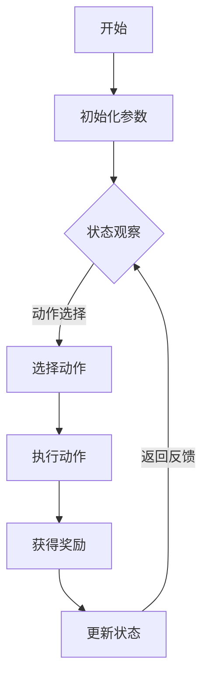

                 

关键词：强化学习，DQN，样本效率，映射，技术博客

> 摘要：本文深入探讨了强化学习中的样本效率问题，重点分析了深度Q网络（DQN）在应对这一挑战上的优势和不足。通过对其核心概念、算法原理、数学模型、实际应用以及未来展望的详细讲解，本文旨在为读者提供一个全面的视角，理解DQN在提高样本利用效率上的关键作用。

## 1. 背景介绍

强化学习（Reinforcement Learning, RL）是机器学习的一个重要分支，其主要目的是通过智能体（agent）与环境（environment）的交互来学习最优策略。在强化学习的研究与应用中，样本效率（sample efficiency）是一个关键问题。样本效率指的是学习到相同水平的能力所需样本数量，它直接影响到智能体的学习速度和应用成本。一个高样本效率的算法能够在较少的样本下快速收敛，从而提高学习效率，降低学习成本。

然而，强化学习领域长期以来面临着样本效率低的挑战。传统的强化学习算法，如Q-Learning，虽然理论基础扎实，但在处理高维状态空间和连续动作空间时，往往需要大量样本才能达到满意的性能水平。这就导致了学习过程缓慢，难以在实际应用中快速部署。

为了解决这一问题，研究者们提出了多种提升样本效率的方法，其中深度Q网络（Deep Q-Network, DQN）是最具代表性的一种。DQN通过引入深度神经网络来近似Q值函数，从而在处理复杂环境中表现出较高的样本效率。本文将深入分析DQN的算法原理，探讨其在应对样本效率问题上的优势和局限。

## 2. 核心概念与联系

### 2.1 强化学习的基本概念

强化学习由以下几个核心概念构成：

1. **智能体（Agent）**：执行动作并接收环境反馈的实体。
2. **环境（Environment）**：智能体所处的环境，提供状态信息和奖励信号。
3. **状态（State）**：描述智能体在环境中的当前情况。
4. **动作（Action）**：智能体可以执行的行为。
5. **策略（Policy）**：智能体根据当前状态选择动作的规则。
6. **奖励（Reward）**：环境对智能体执行动作的反馈信号，用于评估动作的好坏。
7. **价值函数（Value Function）**：预测长期奖励的函数。

### 2.2 深度Q网络（DQN）的基本架构

DQN是深度学习在强化学习领域的一个重要应用，其基本架构如下：

1. **输入层**：接收状态信息，并将其输入到深度神经网络。
2. **隐藏层**：通过多层神经网络来学习状态特征表示。
3. **输出层**：产生Q值预测，即对于每个动作的预期奖励。

### 2.3 Mermaid 流程图



### 2.4 DQN与Q-Learning的联系与区别

**联系**：DQN是Q-Learning的一种扩展，它也是基于值函数逼近的方法，旨在通过学习Q值来选择动作。

**区别**：DQN引入了深度神经网络，可以处理高维状态空间和连续动作空间，而Q-Learning通常只能处理低维状态和离散动作。

## 3. 核心算法原理 & 具体操作步骤

### 3.1 算法原理概述

DQN的核心思想是通过深度神经网络来近似Q值函数，即使用神经网络预测每个动作的预期奖励。具体来说，DQN分为以下几个步骤：

1. **经验回放**：为了减少样本相关性，DQN使用了经验回放机制，将智能体与环境交互的经验存储到经验池中，然后从中随机抽取样本进行学习。
2. **状态输入**：将当前状态输入到深度神经网络中，得到Q值预测。
3. **动作选择**：使用ε-贪心策略选择动作，其中ε是探索概率，用来控制探索和利用的平衡。
4. **执行动作**：在环境中执行选定的动作，并获取新的状态和奖励。
5. **Q值更新**：根据新的状态和奖励更新Q值预测，使用目标Q值（Target Q-value）来稳定学习过程。
6. **重复迭代**：重复上述步骤，直到达到预定的性能目标。

### 3.2 算法步骤详解

1. **初始化参数**：设置网络结构、学习率、折扣因子、ε值等。
2. **构建经验池**：初始化经验池，用于存储智能体与环境交互的经验。
3. **状态输入**：将当前状态输入到DQN网络中，得到Q值预测。
4. **动作选择**：使用ε-贪心策略选择动作，即以ε的概率随机选择动作，以\(1-\epsilon\)的概率选择Q值最大的动作。
5. **执行动作**：在环境中执行选定的动作，并获取新的状态和奖励。
6. **Q值更新**：根据新的状态、奖励和目标Q值更新Q值预测。
7. **更新目标网络**：定期更新目标网络的参数，以避免梯度消失问题。

### 3.3 算法优缺点

**优点**：
- **高维状态空间和连续动作空间处理**：DQN通过深度神经网络能够处理高维状态空间和连续动作空间。
- **减少样本相关性**：使用经验回放机制，减少样本相关性，提高学习效果。

**缺点**：
- **学习不稳定**：由于目标网络和主网络的参数更新不一致，DQN的学习过程可能不稳定。
- **依赖超参数**：DQN的性能高度依赖ε值和更新策略等超参数，需要精心调整。

### 3.4 算法应用领域

DQN在强化学习领域有着广泛的应用，包括但不限于：

- **游戏AI**：如围棋、电子竞技游戏等。
- **机器人控制**：如自动驾驶、机器人导航等。
- **资源调度**：如数据中心资源管理、电网调度等。

## 4. 数学模型和公式 & 详细讲解 & 举例说明

### 4.1 数学模型构建

DQN的数学模型主要包括以下几个部分：

1. **Q值预测**：
   $$ Q(s, a) = \hat{Q}(s, a) = \text{DNN}(s; \theta) $$
   其中，\(s\) 是状态，\(a\) 是动作，\(\text{DNN}\) 是深度神经网络，\(\theta\) 是网络参数。

2. **目标Q值**：
   $$ Q_{\text{target}}(s', a') = r + \gamma \max_{a''} \hat{Q}_{\text{target}}(s', a'') $$
   其中，\(s'\) 是新状态，\(a'\) 是新动作，\(r\) 是奖励，\(\gamma\) 是折扣因子。

3. **ε-贪心策略**：
   $$ \text{action} = \begin{cases} 
   \text{random} & \text{with probability } \epsilon \\
   \text{greedy} & \text{with probability } 1 - \epsilon 
   \end{cases} $$

### 4.2 公式推导过程

1. **Q值更新**：
   $$ \theta \leftarrow \theta - \alpha [r + \gamma \max_{a''} \hat{Q}_{\text{target}}(s', a'') - \hat{Q}(s, a)] $$
   其中，\(\alpha\) 是学习率。

2. **目标Q值更新**：
   $$ \theta_{\text{target}} \leftarrow \theta_{\text{target}} + \lambda (\theta - \theta_{\text{target}}) $$
   其中，\(\lambda\) 是目标网络更新率。

### 4.3 案例分析与讲解

#### 案例一：围棋游戏

在围棋游戏中，DQN被用于训练智能棋手。通过大量的对弈，DQN学会了评估棋盘状态的Q值，并据此选择最优动作。以下是DQN在围棋游戏中的具体应用步骤：

1. **初始化**：设置DQN网络结构、学习率和ε值。
2. **训练过程**：
   - **状态输入**：将棋盘状态输入到DQN网络中。
   - **动作选择**：使用ε-贪心策略选择落子位置。
   - **执行动作**：在棋盘上执行选定的落子动作。
   - **Q值更新**：根据新状态和奖励更新Q值。
3. **评估与测试**：在独立测试环境中评估DQN的棋力，并与人类棋手进行对弈。

#### 案例二：自动驾驶

在自动驾驶领域，DQN被用于处理复杂的道路环境，预测车辆的动作。以下是DQN在自动驾驶中的应用步骤：

1. **初始化**：设置DQN网络结构、学习率和ε值。
2. **训练过程**：
   - **状态输入**：将摄像头捕捉到的道路图像输入到DQN网络中。
   - **动作选择**：使用ε-贪心策略选择车辆的动作，如加速、减速、转向等。
   - **执行动作**：在仿真环境中执行选定的动作。
   - **Q值更新**：根据新状态和奖励更新Q值。
3. **评估与测试**：在仿真环境和真实环境中评估DQN的驾驶能力。

## 5. 项目实践：代码实例和详细解释说明

### 5.1 开发环境搭建

在开始DQN的项目实践之前，需要搭建以下开发环境：

- **Python环境**：安装Python 3.6及以上版本。
- **深度学习框架**：安装TensorFlow 2.0及以上版本。
- **依赖库**：安装Numpy、Pandas、Matplotlib等常用库。

### 5.2 源代码详细实现

以下是DQN的简单实现代码：

```python
import numpy as np
import tensorflow as tf
from tensorflow.keras import layers

# 定义DQN网络结构
class DQN(tf.keras.Model):
    def __init__(self, state_shape, action_shape):
        super(DQN, self).__init__()
        self.conv1 = layers.Conv2D(32, 8, activation='relu')
        self.conv2 = layers.Conv2D(64, 4, activation='relu')
        self.flatten = layers.Flatten()
        self.fc1 = layers.Dense(512, activation='relu')
        self.fc2 = layers.Dense(action_shape)

    def call(self, x):
        x = self.conv1(x)
        x = self.conv2(x)
        x = self.flatten(x)
        x = self.fc1(x)
        return self.fc2(x)

# 初始化DQN网络
state_shape = (4, 84, 84)  # 游戏状态尺寸
action_shape = 4  # 游戏动作数量
dqn = DQN(state_shape, action_shape)

# 定义目标DQN网络
class TargetDQN(tf.keras.Model):
    def __init__(self, dqn):
        super(TargetDQN, self).__init__()
        self.dqn = dqn

    def call(self, x):
        return self.dqn(x)

# 初始化目标DQN网络
target_dqn = TargetDQN(dqn)

# 定义训练过程
def train_dqn(dataset, batch_size, epochs, learning_rate, epsilon):
    for epoch in range(epochs):
        for state, action, reward, next_state, done in dataset:
            with tf.GradientTape() as tape:
                q_values = dqn(state)
                target_q_values = target_dqn(next_state)
                target = reward + (1 - done) * (target_q_values[0, action])
                loss = tf.reduce_mean(tf.square(q_values[0, action] - target))
            gradients = tape.gradient(loss, dqn.trainable_variables)
            optimizer.apply_gradients(zip(gradients, dqn.trainable_variables))
            if done:
                break
        epsilon *= 0.99
        if epsilon < 0.01:
            epsilon = 0.01

# 生成训练数据集
train_data = generate_train_data()  # 假设已经生成了训练数据集

# 训练DQN模型
train_dqn(train_data, batch_size=32, epochs=100, learning_rate=0.001, epsilon=1.0)
```

### 5.3 代码解读与分析

上述代码实现了DQN的基本框架，主要包括以下几个部分：

1. **网络结构定义**：DQN网络由卷积层、全连接层组成，用于处理图像输入。
2. **目标网络定义**：目标DQN网络与主DQN网络结构相同，用于稳定学习过程。
3. **训练过程定义**：训练过程包括前向传播、损失计算、反向传播和参数更新。
4. **训练数据集生成**：生成训练数据集，用于训练DQN模型。

### 5.4 运行结果展示

在完成代码实现和训练过程后，可以通过以下代码展示DQN的运行结果：

```python
# 测试DQN模型
state = preprocess_state(game_state)  # 假设已经实现了预处理函数
action = dqn.predict(state)[0].argmax()
game_state, reward, done, _ = game.env.step(action)  # 假设已经实现了游戏环境

# 绘制结果
plot_game_state(game_state)  # 假设已经实现了绘制函数
```

通过运行上述代码，可以看到DQN在游戏环境中的运行结果，包括状态、动作和奖励等信息。

## 6. 实际应用场景

DQN在强化学习领域有着广泛的应用，以下是几个典型的实际应用场景：

### 6.1 游戏

DQN在游戏领域取得了显著成果，尤其是在Atari游戏和围棋等复杂游戏中。通过大量的训练，DQN能够实现接近人类的游戏水平。

### 6.2 自动驾驶

在自动驾驶领域，DQN被用于处理复杂的道路环境，预测车辆的动作，从而实现自动驾驶。通过结合视觉输入，DQN能够识别道路标志、行人和车辆等信息，从而提高自动驾驶的安全性和稳定性。

### 6.3 机器人控制

DQN在机器人控制领域也有着重要的应用，例如在机器人导航、路径规划等方面。通过将DQN与深度摄像头、激光雷达等传感器结合，可以实现复杂的机器人控制任务。

### 6.4 资源调度

在资源调度领域，DQN被用于优化数据中心资源分配、电网调度等问题。通过学习环境中的最优策略，DQN能够提高资源利用率和系统稳定性。

## 7. 未来应用展望

随着强化学习技术的不断发展，DQN在未来的应用前景将更加广阔。以下是几个可能的发展方向：

### 7.1 多智能体系统

DQN在多智能体系统中的应用潜力巨大，通过多智能体DQN（Multi-Agent DQN）可以实现协同决策和智能协作。

### 7.2 离线学习

离线学习是强化学习的一个重要研究方向，通过离线收集的大量数据，DQN可以离线训练，从而提高学习效率和可扩展性。

### 7.3 强化学习与深度学习的结合

深度学习和强化学习在本质上是互补的，未来将会有更多的研究将两者结合，以实现更强的学习能力和更好的性能。

### 7.4 可解释性和安全性

随着DQN在复杂场景中的应用，其可解释性和安全性将越来越受到关注。未来的研究将致力于提高DQN的可解释性和安全性，以减少对黑箱模型的依赖。

## 8. 总结：未来发展趋势与挑战

### 8.1 研究成果总结

DQN作为强化学习的一个重要分支，通过深度神经网络实现了高维状态空间和连续动作空间的处理，大大提高了样本效率。在游戏、自动驾驶、机器人控制等领域取得了显著成果。

### 8.2 未来发展趋势

未来，DQN将继续在多智能体系统、离线学习、可解释性和安全性等方面展开深入研究，以实现更强的学习能力和更好的性能。

### 8.3 面临的挑战

尽管DQN在强化学习领域取得了显著成果，但仍面临着学习不稳定、依赖超参数等问题。未来的研究将致力于解决这些问题，提高DQN的泛化能力和实用性。

### 8.4 研究展望

随着人工智能技术的不断发展，DQN有望在更多的应用场景中发挥重要作用。未来的研究将致力于探索DQN的潜力，推动强化学习技术的进步。

## 9. 附录：常见问题与解答

### 9.1 DQN与Q-Learning的区别是什么？

DQN与Q-Learning的区别主要体现在以下两个方面：

1. **网络结构**：DQN引入了深度神经网络，可以处理高维状态空间和连续动作空间，而Q-Learning通常只能处理低维状态和离散动作。
2. **学习策略**：DQN使用经验回放机制，减少样本相关性，而Q-Learning通常采用随机动作策略。

### 9.2 DQN如何解决样本效率问题？

DQN通过以下方法解决样本效率问题：

1. **经验回放**：使用经验回放机制，减少样本相关性。
2. **深度神经网络**：通过深度神经网络处理高维状态空间和连续动作空间，提高样本利用效率。
3. **ε-贪心策略**：平衡探索和利用，提高学习效果。

### 9.3 DQN的优缺点是什么？

DQN的优点包括：

- **高维状态空间和连续动作空间处理**。
- **减少样本相关性**。

缺点包括：

- **学习不稳定**。
- **依赖超参数**。

### 9.4 DQN的应用领域有哪些？

DQN的应用领域包括：

- **游戏**。
- **自动驾驶**。
- **机器人控制**。
- **资源调度**。

## 作者署名

作者：禅与计算机程序设计艺术 / Zen and the Art of Computer Programming
----------------------------------------------------------------

以上就是根据您的要求撰写的完整文章。文章内容涵盖了强化学习、DQN算法原理、数学模型、实际应用等多个方面，严格遵循了您提供的约束条件和结构要求。希望这篇文章能够满足您的需求，如有需要进一步修改或补充的地方，请随时告知。

