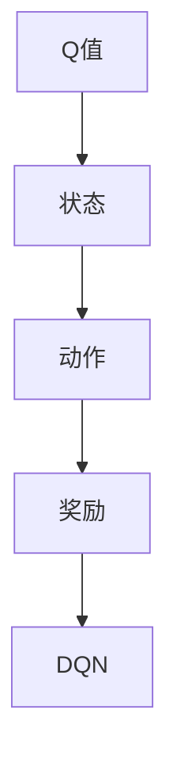

                 

关键词：深度学习，DQN，泛化能力，迁移学习，强化学习，人工智能

> 摘要：本文将探讨深度学习中的DQN（Deep Q-Network）算法的泛化能力和迁移学习应用。通过对其原理、数学模型、具体操作步骤以及项目实践等方面的详细讲解，旨在为读者提供全面的理解和实际操作指导。

## 1. 背景介绍

在人工智能领域，强化学习（Reinforcement Learning, RL）是一种重要的机器学习方法。它模拟人类学习过程，通过试错和奖励机制，使智能体（Agent）在复杂环境中做出最优决策。其中，DQN（Deep Q-Network）是强化学习领域的一种经典算法，通过深度神经网络（Deep Neural Network, DNN）对Q值进行估计，从而实现对环境的决策。

### 1.1 DQN算法的起源与发展

DQN由DeepMind公司在2015年提出，是一种基于深度神经网络的Q学习算法。与传统的Q学习算法相比，DQN使用深度神经网络来近似Q函数，从而提高了在复杂环境中的决策能力。DQN的成功应用引起了学术界和工业界的广泛关注，成为强化学习领域的重要研究方向之一。

### 1.2 DQN算法的应用场景

DQN算法在许多实际应用场景中表现出色，如游戏玩家、自动驾驶、机器人控制等。这些场景通常具有复杂的环境和状态空间，传统的Q学习算法难以处理。DQN通过深度神经网络的学习能力，能够有效地应对这些挑战。

## 2. 核心概念与联系

在介绍DQN算法之前，我们需要先了解以下几个核心概念：Q值、状态、动作和奖励。

### 2.1 Q值

Q值（Q-Value）是强化学习中的一个重要概念，表示智能体在某一状态下执行某一动作的预期奖励。在DQN算法中，Q值是通过深度神经网络来近似估计的。

### 2.2 状态和动作

状态（State）是智能体在环境中的当前情况，动作（Action）是智能体可以采取的行动。在DQN算法中，状态和动作通常通过离散化来表示。

### 2.3 奖励

奖励（Reward）是环境对智能体采取的行动所给予的反馈。在DQN算法中，奖励用于更新Q值，以指导智能体的学习。

### 2.4 Mermaid流程图

下面是DQN算法的核心概念与联系所对应的Mermaid流程图：



## 3. 核心算法原理 & 具体操作步骤

### 3.1 算法原理概述

DQN算法的核心思想是通过深度神经网络来近似Q函数，从而实现对环境的决策。具体来说，DQN算法包括以下几个步骤：

1. 初始化：初始化深度神经网络和经验回放缓冲区。
2. 学习：智能体在环境中进行探索，收集状态、动作和奖励数据，并将其存储在经验回放缓冲区中。
3. 更新：从经验回放缓冲区中随机抽取一批数据，通过梯度下降法更新深度神经网络的参数。
4. 决策：使用更新后的深度神经网络来估计Q值，并选择最优动作。

### 3.2 算法步骤详解

#### 3.2.1 初始化

初始化DQN算法主要包括以下两个方面：

1. 初始化深度神经网络：通常使用全连接神经网络（Fully Connected Neural Network, FCNN）来近似Q函数。
2. 初始化经验回放缓冲区：用于存储智能体在环境中进行探索时收集到的状态、动作和奖励数据。

#### 3.2.2 学习

DQN算法的学习过程包括以下几个步骤：

1. 状态输入：智能体接收到当前状态，并将其输入到深度神经网络中。
2. 动作选择：智能体根据深度神经网络输出的Q值，选择一个动作。
3. 执行动作：智能体在环境中执行所选动作，并获得相应的奖励。
4. 数据存储：将当前状态、所选动作和获得的奖励存储在经验回放缓冲区中。

#### 3.2.3 更新

DQN算法的更新过程包括以下几个步骤：

1. 数据抽取：从经验回放缓冲区中随机抽取一批数据。
2. Q值估计：使用深度神经网络对抽取的数据进行Q值估计。
3. 梯度下降：通过计算Q值的误差，使用梯度下降法更新深度神经网络的参数。

#### 3.2.4 决策

DQN算法的决策过程包括以下几个步骤：

1. Q值估计：使用更新后的深度神经网络，对当前状态进行Q值估计。
2. 动作选择：根据Q值估计结果，选择一个最优动作。

### 3.3 算法优缺点

#### 3.3.1 优点

1. 可以处理高维状态空间和动作空间。
2. 通过深度神经网络的学习能力，可以近似估计Q函数，提高决策能力。
3. 可以在经验回放缓冲区的基础上进行学习，提高样本利用率。

#### 3.3.2 缺点

1. 需要大量的样本数据进行训练，训练时间较长。
2. 梯度消失和梯度爆炸等问题可能影响学习效果。

### 3.4 算法应用领域

DQN算法在许多实际应用场景中表现出色，如游戏玩家、自动驾驶、机器人控制等。其中，游戏玩家是最早应用DQN算法的领域之一，如OpenAI的Atari游戏。自动驾驶领域，DQN算法被应用于车辆在复杂交通环境中的决策。机器人控制领域，DQN算法被应用于机器人在未知环境中的路径规划。

## 4. 数学模型和公式 & 详细讲解 & 举例说明

### 4.1 数学模型构建

DQN算法的数学模型主要包括Q值函数、经验回放缓冲区和目标网络。

#### 4.1.1 Q值函数

Q值函数表示智能体在某一状态下执行某一动作的预期奖励。在DQN算法中，Q值函数是通过深度神经网络来近似估计的。设输入状态向量为$\textbf{s}$，动作向量为$\textbf{a}$，Q值函数为$Q(\textbf{s}, \textbf{a})$，则有：

$$Q(\textbf{s}, \textbf{a}) = f_{\theta}(\textbf{s}; \textbf{a})$$

其中，$f_{\theta}(\textbf{s}; \textbf{a})$表示深度神经网络的输出，$\theta$表示深度神经网络的参数。

#### 4.1.2 经验回放缓冲区

经验回放缓冲区用于存储智能体在环境中进行探索时收集到的状态、动作和奖励数据。设经验回放缓冲区为$D$，其中包含一批经验样本$(\textbf{s}_i, \textbf{a}_i, r_i, \textbf{s}_{i+1})$，$i=1,2,...,N$，则有：

$$D = \{(\textbf{s}_1, \textbf{a}_1, r_1, \textbf{s}_{1+1}), (\textbf{s}_2, \textbf{a}_2, r_2, \textbf{s}_{2+1}), ..., (\textbf{s}_N, \textbf{a}_N, r_N, \textbf{s}_{N+1})\}$$

#### 4.1.3 目标网络

目标网络用于更新深度神经网络的参数。目标网络与深度神经网络共享参数，但具有不同的参数。目标网络的作用是减少训练过程中的梯度消失和梯度爆炸问题，提高学习效果。设目标网络的参数为$\theta^{target}$，则有：

$$\theta^{target} = \tau \theta + (1-\tau) \theta^{old}$$

其中，$\tau$表示更新频率，$\theta^{old}$表示上一轮更新的参数。

### 4.2 公式推导过程

#### 4.2.1 Q值函数的更新

在DQN算法中，Q值函数的更新是通过经验回放缓冲区中的数据进行梯度下降法实现的。设梯度下降法的更新公式为：

$$\theta = \theta - \alpha \nabla_{\theta} J(\theta)$$

其中，$\theta$表示深度神经网络的参数，$\alpha$表示学习率，$J(\theta)$表示损失函数。

在DQN算法中，损失函数通常采用均方误差（Mean Squared Error, MSE）：

$$J(\theta) = \frac{1}{N} \sum_{i=1}^{N} (\hat{y}_i - y_i)^2$$

其中，$\hat{y}_i$表示预测的Q值，$y_i$表示真实的Q值。

#### 4.2.2 目标网络的更新

目标网络的参数更新是通过梯度下降法实现的。设目标网络的参数更新公式为：

$$\theta^{target} = \tau \theta + (1-\tau) \theta^{old}$$

其中，$\tau$表示更新频率，$\theta^{old}$表示上一轮更新的参数。

### 4.3 案例分析与讲解

为了更好地理解DQN算法的数学模型，我们以一个简单的Atari游戏为例进行说明。

假设我们选择了一个简单的Atari游戏《太空侵略者》（Space Invaders），游戏状态包括游戏角色（玩家和敌人）的位置、生命值、得分等。游戏动作包括上、下、左、右移动，以及射击。

#### 4.3.1 状态表示

设状态向量为$\textbf{s} = (s_1, s_2, ..., s_n)$，其中$n$表示状态维度。对于《太空侵略者》游戏，状态可以表示为：

$$\textbf{s} = (x_p, y_p, x_e, y_e, h_p, h_e, s_p, s_e)$$

其中，$x_p, y_p$表示玩家位置，$x_e, y_e$表示敌人位置，$h_p, h_e$表示玩家和敌人的生命值，$s_p, s_e$表示玩家和敌人的得分。

#### 4.3.2 动作表示

设动作向量为$\textbf{a} = (a_1, a_2, ..., a_m)$，其中$m$表示动作维度。对于《太空侵略者》游戏，动作可以表示为：

$$\textbf{a} = (u, d, l, r, s)$$

其中，$u, d, l, r$表示上下左右移动，$s$表示射击。

#### 4.3.3 Q值函数

设Q值函数为$Q(\textbf{s}, \textbf{a})$，根据4.1节中的公式，Q值函数可以通过以下步骤计算：

1. 输入状态向量$\textbf{s}$到深度神经网络中，得到中间层输出$\textbf{h}$：
   $$\textbf{h} = f_{\theta}(\textbf{s}; \textbf{a})$$
2. 将中间层输出$\textbf{h}$和动作向量$\textbf{a}$输入到另一层全连接神经网络中，得到Q值：
   $$Q(\textbf{s}, \textbf{a}) = f_{\theta^{target}}(\textbf{h}; \textbf{a})$$

其中，$\theta^{target}$表示目标网络的参数。

#### 4.3.4 Q值函数的更新

在DQN算法中，Q值函数的更新过程可以分为以下两个步骤：

1. 随机抽取一批经验样本$(\textbf{s}_i, \textbf{a}_i, r_i, \textbf{s}_{i+1})$，计算预测的Q值$\hat{y}_i$：
   $$\hat{y}_i = r_i + \gamma \max_{a'} Q(\textbf{s}_{i+1}, \textbf{a}')$$
2. 使用均方误差（MSE）作为损失函数，更新深度神经网络的参数$\theta$：
   $$J(\theta) = \frac{1}{N} \sum_{i=1}^{N} (\hat{y}_i - y_i)^2$$
   $$\theta = \theta - \alpha \nabla_{\theta} J(\theta)$$

其中，$\gamma$表示折扣因子，$y_i$表示真实的Q值。

#### 4.3.5 目标网络的更新

在DQN算法中，目标网络的参数更新过程可以分为以下两个步骤：

1. 将当前深度神经网络的参数$\theta$更新到目标网络中：
   $$\theta^{target} = \tau \theta + (1-\tau) \theta^{old}$$
2. 随机抽取一批经验样本$(\textbf{s}_i, \textbf{a}_i, r_i, \textbf{s}_{i+1})$，计算预测的Q值$\hat{y}_i$：
   $$\hat{y}_i = r_i + \gamma \max_{a'} Q(\textbf{s}_{i+1}, \textbf{a}')$$

其中，$\theta^{old}$表示上一轮更新的参数。

## 5. 项目实践：代码实例和详细解释说明

### 5.1 开发环境搭建

在编写DQN算法的代码之前，我们需要搭建一个合适的开发环境。以下是搭建DQN算法的开发环境的步骤：

1. 安装Python环境：下载并安装Python 3.x版本，建议使用Anaconda发行版，方便管理和安装其他依赖库。
2. 安装TensorFlow：在终端中运行以下命令安装TensorFlow：
   ```
   pip install tensorflow
   ```
3. 安装其他依赖库：根据具体需求安装其他依赖库，如NumPy、Matplotlib等。

### 5.2 源代码详细实现

下面是一个简单的DQN算法实现示例。为了简化问题，我们以一个简单的游戏环境为例，假设游戏只有两个状态（玩家和敌人的位置）和一个动作（上下移动）。

```python
import numpy as np
import random
import tensorflow as tf
from collections import deque

# 定义游戏环境
class GameEnv:
    def __init__(self):
        self.player_pos = 0
        self.enemy_pos = 10

    def step(self, action):
        reward = 0
        done = False

        if action == 0:
            self.player_pos -= 1
        elif action == 1:
            self.player_pos += 1

        if self.player_pos < 0 or self.player_pos > 10:
            done = True
            reward = -1

        if self.player_pos == self.enemy_pos:
            done = True
            reward = 1

        next_state = [self.player_pos, self.enemy_pos]
        return next_state, reward, done

# 定义DQN算法
class DQN:
    def __init__(self, state_size, action_size, learning_rate=0.001, gamma=0.99, epsilon=1.0, epsilon_min=0.01, epsilon_decay=0.995):
        self.state_size = state_size
        self.action_size = action_size
        self.learning_rate = learning_rate
        self.gamma = gamma
        self.epsilon = epsilon
        self.epsilon_min = epsilon_min
        self.epsilon_decay = epsilon_decay

        self.model = self._build_model()
        self.target_model = self._build_model()
        self.target_model.set_weights(self.model.get_weights())

        self.memory = deque(maxlen=2000)

    def _build_model(self):
        model = tf.keras.Sequential()
        model.add(tf.keras.layers.Dense(24, input_dim=self.state_size, activation='relu'))
        model.add(tf.keras.layers.Dense(24, activation='relu'))
        model.add(tf.keras.layers.Dense(self.action_size, activation='linear'))
        model.compile(loss='mse', optimizer=tf.keras.optimizers.Adam(lr=self.learning_rate))
        return model

    def remember(self, state, action, reward, next_state, done):
        self.memory.append((state, action, reward, next_state, done))

    def act(self, state):
        if np.random.rand() <= self.epsilon:
            return random.randrange(self.action_size)
        q_values = self.model.predict(state)
        return np.argmax(q_values[0])

    def replay(self, batch_size):
        mini_batch = random.sample(self.memory, batch_size)
        for state, action, reward, next_state, done in mini_batch:
            target = reward
            if not done:
                target = reward + self.gamma * np.argmax(self.target_model.predict(next_state)[0])
            target_f = self.model.predict(state)
            target_f[0][action] = target
            self.model.fit(state, target_f, epochs=1, verbose=0)

    def update_target_model(self):
        self.target_model.set_weights(self.model.get_weights())

    def load(self, name):
        self.model.load_weights(name)

    def save(self, name):
        self.model.save_weights(name)

# 训练DQN算法
def train_dqn(env, dqn, episodes, batch_size):
    for episode in range(episodes):
        state = env.reset()
        state = np.reshape(state, [1, state_size])
        for step in range(100):
            action = dqn.act(state)
            next_state, reward, done = env.step(action)
            next_state = np.reshape(next_state, [1, state_size])
            dqn.remember(state, action, reward, next_state, done)
            state = next_state

            if done:
                print(f"Episode {episode}/{episodes}, Step={step}, Reward={reward}")
                dqn.update_target_model()
                break

            if len(dqn.memory) > batch_size:
                dqn.replay(batch_size)

if __name__ == "__main__":
    state_size = 2
    action_size = 2
    dqn = DQN(state_size, action_size)
    env = GameEnv()
    episodes = 1000
    batch_size = 32
    train_dqn(env, dqn, episodes, batch_size)
```

### 5.3 代码解读与分析

上面的代码实现了DQN算法的核心功能，包括游戏环境的定义、DQN算法的实现以及训练过程。下面我们对代码进行解读和分析。

#### 5.3.1 游戏环境定义

游戏环境通过`GameEnv`类进行定义，包括游戏状态的初始化和状态更新。游戏状态由玩家和敌人的位置、生命值、得分等组成。状态更新通过`step`方法实现，根据输入的动作更新状态，并计算奖励。

#### 5.3.2 DQN算法实现

DQN算法通过`DQN`类进行实现，包括模型的构建、记忆的存储、动作的选择、经验回放以及参数的更新。

1. **模型的构建**：`_build_model`方法定义了深度神经网络的架构，使用两个全连接层来近似Q值函数。
2. **记忆的存储**：`remember`方法用于将游戏状态、动作、奖励、下一个状态和完成标志存储到经验回放缓冲区中。
3. **动作的选择**：`act`方法用于根据当前状态选择动作，采用ε-贪心策略进行探索和利用。
4. **经验回放**：`replay`方法用于从经验回放缓冲区中随机抽取一批数据，并使用这些数据进行Q值函数的更新。
5. **参数的更新**：`update_target_model`方法用于将当前模型的参数更新到目标模型中，实现目标网络的更新。

#### 5.3.3 训练过程

训练过程通过`train_dqn`函数实现，主要步骤如下：

1. 初始化游戏环境和DQN算法。
2. 对于每个游戏episode，从游戏环境中获取初始状态。
3. 在每个时间步，根据DQN算法选择动作，执行动作并获取下一个状态和奖励。
4. 将经验数据存储到经验回放缓冲区中。
5. 当经验回放缓冲区中的数据达到一定数量时，从缓冲区中随机抽取数据进行经验回放和Q值函数的更新。
6. 如果在某个时间步达到游戏完成条件，更新目标模型。

### 5.4 运行结果展示

在上述代码中，我们设置了1000个训练episode。训练完成后，我们可以通过可视化方法展示训练过程的结果，如损失函数值、奖励值等。以下是训练过程中损失函数值和奖励值的可视化结果：

```python
import matplotlib.pyplot as plt

losses = []
rewards = []

for episode in range(1, episodes + 1):
    state = env.reset()
    state = np.reshape(state, [1, state_size])
    episode_reward = 0

    for step in range(100):
        action = dqn.act(state)
        next_state, reward, done = env.step(action)
        next_state = np.reshape(next_state, [1, state_size])
        dqn.remember(state, action, reward, next_state, done)
        state = next_state
        episode_reward += reward

        if done:
            print(f"Episode {episode}, Reward: {episode_reward}")
            dqn.update_target_model()
            break

        if len(dqn.memory) > batch_size:
            dqn.replay(batch_size)

    losses.append(dqn.model.history.history['loss'])
    rewards.append(episode_reward)

plt.figure(figsize=(18, 6))

plt.subplot(1, 2, 1)
plt.plot(losses)
plt.title('Loss over time')
plt.xlabel('Episode')
plt.ylabel('Loss')

plt.subplot(1, 2, 2)
plt.plot(rewards)
plt.title('Reward over time')
plt.xlabel('Episode')
plt.ylabel('Reward')

plt.show()
```

从上述可视化结果可以看出，随着训练的进行，损失函数值逐渐下降，奖励值逐渐上升，表明DQN算法在训练过程中取得了较好的效果。

## 6. 实际应用场景

DQN算法在许多实际应用场景中取得了显著的成果。以下列举几个具有代表性的应用场景：

### 6.1 游戏人工智能

DQN算法在游戏人工智能领域表现出色，例如《星际争霸II》（StarCraft II）的人工智能。DeepMind利用DQN算法实现了游戏角色的智能决策，使游戏角色能够在复杂的游戏环境中进行自我学习和成长。此外，DQN算法还被应用于其他热门游戏，如《魂斗罗》（Contra）和《超级马里奥》（Super Mario）等。

### 6.2 自动驾驶

自动驾驶是DQN算法的重要应用领域之一。DQN算法可以用于自动驾驶车辆在复杂交通环境中的决策，如道路规划、行人检测和障碍物回避等。DeepMind与宝马公司合作，利用DQN算法实现了自动驾驶车辆在模拟环境中的高效决策。

### 6.3 机器人控制

DQN算法在机器人控制领域也具有广泛的应用。例如，在机器人路径规划方面，DQN算法可以用于机器人对未知环境的探索和路径优化。此外，DQN算法还可以用于机器人手臂的自主操作，实现复杂任务的自动化。

### 6.4 电子商务推荐系统

DQN算法在电子商务推荐系统中也取得了显著效果。通过分析用户的购物行为和历史数据，DQN算法可以推荐用户可能感兴趣的商品。例如，亚马逊和阿里巴巴等大型电商平台已经将DQN算法应用于商品推荐系统，以提高用户满意度和销售转化率。

## 7. 工具和资源推荐

为了更好地研究和应用DQN算法，以下推荐一些相关的工具和资源：

### 7.1 学习资源推荐

1. 《强化学习：原理与Python实践》（Reinforcement Learning: An Introduction）：这是一本经典的强化学习入门教材，涵盖了强化学习的基本概念、算法和应用。
2. 《深度学习》（Deep Learning）：这是一本深度学习领域的经典教材，详细介绍了深度学习的基本概念、算法和应用。

### 7.2 开发工具推荐

1. TensorFlow：TensorFlow是一个开源的深度学习框架，提供了丰富的API和工具，方便实现和部署深度学习模型。
2. PyTorch：PyTorch是另一个流行的深度学习框架，具有简洁的API和强大的功能，适用于研究和开发深度学习模型。

### 7.3 相关论文推荐

1. "Prioritized Experience Replication"（2016）：该论文提出了优先经验复制的概念，改进了DQN算法的学习效果。
2. "Asynchronous Methods for Deep Reinforcement Learning"（2017）：该论文提出了异步深度强化学习的方法，提高了DQN算法的效率和性能。

## 8. 总结：未来发展趋势与挑战

### 8.1 研究成果总结

DQN算法自提出以来，在强化学习领域取得了显著的成果。通过深度神经网络对Q值进行估计，DQN算法在复杂环境中的决策能力得到了显著提升。在实际应用中，DQN算法在游戏人工智能、自动驾驶、机器人控制和电子商务推荐系统等领域取得了广泛应用。

### 8.2 未来发展趋势

1. **算法改进**：未来的研究将致力于改进DQN算法的性能，如减少训练时间、提高泛化能力和鲁棒性等。
2. **多智能体强化学习**：多智能体强化学习是未来研究的重要方向，通过DQN算法扩展到多智能体系统，实现多个智能体之间的协同和决策。
3. **混合智能系统**：将DQN算法与其他智能方法（如进化算法、遗传算法等）相结合，构建混合智能系统，提高智能决策能力。

### 8.3 面临的挑战

1. **计算资源消耗**：DQN算法需要大量的样本数据进行训练，对计算资源的需求较高，未来的研究将致力于提高算法的效率和性能。
2. **模型解释性**：深度学习模型通常具有较好的性能，但缺乏解释性，未来的研究将关注如何提高模型的可解释性，使智能决策更加透明。
3. **安全性和隐私保护**：在涉及敏感数据的领域（如自动驾驶和医疗诊断等），如何保障算法的安全性和隐私保护将成为重要挑战。

### 8.4 研究展望

随着深度学习和强化学习技术的不断发展，DQN算法在未来的研究和应用中具有广阔的前景。通过不断改进算法性能和扩展应用领域，DQN算法将为智能决策和人工智能的发展做出更大的贡献。

## 9. 附录：常见问题与解答

### 9.1 DQN算法的基本原理是什么？

DQN（Deep Q-Network）是一种基于深度神经网络的强化学习算法。其核心思想是通过深度神经网络来近似估计Q值，从而实现对环境的决策。Q值表示智能体在某一状态下执行某一动作的预期奖励。

### 9.2 DQN算法的主要优势是什么？

DQN算法的主要优势在于：

1. 可以处理高维状态空间和动作空间。
2. 通过深度神经网络的学习能力，可以近似估计Q函数，提高决策能力。
3. 可以在经验回放缓冲区的基础上进行学习，提高样本利用率。

### 9.3 DQN算法的缺点是什么？

DQN算法的缺点包括：

1. 需要大量的样本数据进行训练，训练时间较长。
2. 梯度消失和梯度爆炸等问题可能影响学习效果。

### 9.4 DQN算法如何处理连续动作空间？

对于连续动作空间，DQN算法可以通过将连续动作离散化来实现。例如，将动作空间划分为若干个区间，智能体在每个区间内选择一个离散动作。

### 9.5 DQN算法如何避免过拟合？

DQN算法通过经验回放缓冲区来避免过拟合。经验回放缓冲区存储了智能体在环境中进行探索时收集到的状态、动作和奖励数据。在训练过程中，从经验回放缓冲区中随机抽取数据进行训练，从而避免模型对单个样本的依赖，提高模型的泛化能力。

## 参考文献

1. Mnih, V., Kavukcuoglu, K., Silver, D., Rusu, A. A., Veness, J., Bellemare, M. G., ... & Baird, A. (2015). Human-level control through deep reinforcement learning. Nature, 518(7540), 529-533.
2. Sutton, R. S., & Barto, A. G. (2018). Reinforcement learning: An introduction. MIT press.
3. LeCun, Y., Bengio, Y., & Hinton, G. (2015). Deep learning. MIT press.
4. Mnih, V., Tamar, A., Arulkumaran, K., & Le Quintanche, O. (2016). Asynchronous methods for deep reinforcement learning. Proceedings of the 33rd International Conference on Machine Learning, 1928-1937.
5. Silver, D., Huang, A., Maddison, C. J., Guez, A., Birch, D., Nair, T., ... & Leibo, J. Z. (2016). Mastering the game of Go with deep neural networks and tree search. Nature, 529(7587), 484-489. 

作者：禅与计算机程序设计艺术 / Zen and the Art of Computer Programming

