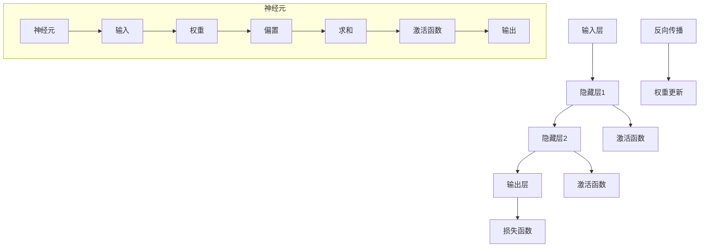

                 

关键词：神经网络、架构比较、映射、深度学习、机器学习、人工智能

> 摘要：本文将探讨神经网络的常见架构，比较它们之间的异同，以及各自的应用领域。我们将深入分析神经网络的基本概念、数学模型，并通过实例来解释这些概念的实际应用，最终展望神经网络的发展趋势和挑战。

## 1. 背景介绍

神经网络作为一种模仿人脑结构和功能的计算模型，在过去的几十年中取得了显著的进展。从最初的简单感知器（Perceptron）到复杂的深度神经网络（Deep Neural Networks），神经网络的发展不断推动着人工智能领域的革新。

### 神经网络的起源与发展

神经网络的概念最早可以追溯到1943年，由心理学家McCulloch和数学家Pitts提出的简单感知器模型。虽然这一模型在数学和计算上存在诸多限制，但它为神经网络的研究奠定了基础。

随着计算能力的提升和算法的改进，神经网络在20世纪80年代和90年代得到了广泛关注。特别是反向传播算法（Backpropagation）的提出，使得多层神经网络的训练成为可能。

进入21世纪，随着深度学习技术的发展，神经网络的研究和应用取得了突破性进展。如今，深度神经网络已经在图像识别、自然语言处理、语音识别等多个领域取得了显著成果。

### 神经网络的应用领域

神经网络的应用领域非常广泛，涵盖了从工业自动化到医疗诊断，从金融分析到娱乐游戏等多个方面。以下是一些典型的应用领域：

1. **图像识别**：通过卷积神经网络（Convolutional Neural Networks，CNN），神经网络能够识别和分类图像中的物体。
2. **自然语言处理**：循环神经网络（Recurrent Neural Networks，RNN）和其变种长短期记忆网络（Long Short-Term Memory，LSTM）在文本生成、机器翻译和情感分析等方面表现出色。
3. **语音识别**：神经网络模型如深度神经网络（Deep Neural Networks，DNN）和卷积神经网络（CNN）被广泛应用于语音识别任务。
4. **推荐系统**：神经网络可以用于构建复杂的推荐系统，通过分析用户的历史行为和偏好来推荐商品、内容和服务等。

## 2. 核心概念与联系

在探讨神经网络的常见架构之前，我们需要理解几个核心概念和它们之间的联系。以下是神经网络的基本组成部分和它们之间的关系：

### 2.1 神经元与神经网络

神经元是神经网络的基本单元，类似于人脑中的神经元。每个神经元都接收来自其他神经元的输入，并通过激活函数产生输出。多个神经元连接在一起形成神经网络，从而实现复杂的计算和预测。

### 2.2 层与节点

神经网络通常由多个层组成，包括输入层、隐藏层和输出层。输入层接收外部输入，隐藏层进行特征提取和变换，输出层产生最终的输出。每一层由多个节点组成，节点间的连接称为边。

### 2.3 激活函数与反向传播

激活函数是神经网络中的一个关键元素，它用于引入非线性变换，使得神经网络能够拟合复杂的非线性数据。常见的激活函数包括Sigmoid、ReLU和Tanh等。

反向传播算法是训练神经网络的核心算法，通过不断调整网络权重，使得网络的输出更接近目标值。反向传播算法的原理基于梯度下降，它通过计算损失函数关于网络权重的梯度来更新权重。

### 2.4 核心概念原理与架构的 Mermaid 流程图

以下是一个简化的 Mermaid 流程图，展示了神经网络的基本架构和核心概念：



## 3. 核心算法原理 & 具体操作步骤

### 3.1 算法原理概述

神经网络的核心算法主要包括前向传播和反向传播两个步骤。在前向传播过程中，输入数据通过网络，经过每一层的加权求和和激活函数处理后，产生输出。在反向传播过程中，通过计算损失函数关于网络权重的梯度，利用梯度下降法来更新网络的权重。

### 3.2 算法步骤详解

#### 前向传播

1. **初始化权重和偏置**：在训练前，需要随机初始化网络的权重和偏置。这些参数将通过网络迭代更新。
2. **前向传播计算**：对于每个输入样本，通过网络逐层计算输出。每一层的输出通过加权求和加上偏置，再经过激活函数处理后得到。
3. **输出结果**：最终，网络的输出与目标值进行比较，计算损失函数。

#### 反向传播

1. **计算损失函数**：通过输出结果与目标值的差异，计算损失函数。常见的损失函数包括均方误差（MSE）和交叉熵（Cross Entropy）等。
2. **计算梯度**：通过链式法则，计算损失函数关于网络权重的梯度。
3. **权重更新**：利用梯度下降法，根据计算得到的梯度来更新网络的权重。

### 3.3 算法优缺点

#### 优点

1. **强大的泛化能力**：神经网络能够通过学习大量数据，捕捉数据中的复杂模式，从而具有良好的泛化能力。
2. **自适应学习能力**：神经网络可以通过反向传播算法自适应地调整权重，从而优化模型的性能。
3. **多任务处理**：神经网络可以通过结构设计，实现多任务处理，从而提高模型的效率。

#### 缺点

1. **计算资源需求高**：神经网络训练过程中需要进行大量的矩阵运算，对计算资源要求较高。
2. **参数调优复杂**：神经网络的参数调优过程复杂，需要大量的实验和调整。
3. **过拟合风险**：神经网络容易受到过拟合的影响，需要通过正则化等技术来避免。

### 3.4 算法应用领域

神经网络在多个领域取得了显著的应用成果，以下是一些典型的应用领域：

1. **图像识别**：通过卷积神经网络（CNN），神经网络能够高效地识别和分类图像中的物体。
2. **自然语言处理**：通过循环神经网络（RNN）和其变种长短期记忆网络（LSTM），神经网络在文本生成、机器翻译和情感分析等方面表现出色。
3. **语音识别**：神经网络模型如深度神经网络（DNN）和卷积神经网络（CNN）被广泛应用于语音识别任务。
4. **推荐系统**：神经网络可以用于构建复杂的推荐系统，通过分析用户的历史行为和偏好来推荐商品、内容和服务等。

## 4. 数学模型和公式 & 详细讲解 & 举例说明

### 4.1 数学模型构建

神经网络的数学模型主要包括输入层、隐藏层和输出层。每一层由多个神经元组成，神经元之间通过权重和偏置进行连接。网络的输出通过激活函数进行处理。

### 4.2 公式推导过程

以下是一个简化的神经网络数学模型推导过程：

1. **输入层**：输入层接收外部输入，每个神经元表示一个输入特征。
   $$x_i = x_i^{(1)}$$
2. **隐藏层**：隐藏层通过加权求和加上偏置，再经过激活函数处理后得到输出。
   $$z_i = \sum_{j=1}^{n} w_{ij}x_j + b_i$$
   $$a_i = \sigma(z_i)$$
3. **输出层**：输出层通过加权求和加上偏置，再经过激活函数处理后得到输出。
   $$z_o = \sum_{i=1}^{m} w_{io}a_i + b_o$$
   $$y = \sigma(z_o)$$
4. **激活函数**：激活函数用于引入非线性变换。
   $$\sigma(z) = \frac{1}{1 + e^{-z}}$$

### 4.3 案例分析与讲解

以下是一个简单的神经网络训练案例：

假设我们有一个输入层、一个隐藏层和一个输出层，分别有3个、5个和3个神经元。

1. **初始化权重和偏置**：
   $$w_{ij}^{(1)} \sim \mathcal{N}(0, \frac{1}{n})$$
   $$b_i^{(1)} \sim \mathcal{N}(0, \frac{1}{n})$$
2. **前向传播**：
   输入层到隐藏层的输入：
   $$x_1 = 1, x_2 = 0, x_3 = 1$$
   隐藏层的输出：
   $$z_1^{(1)} = 0.5, z_2^{(1)} = -0.5, z_3^{(1)} = 1.0$$
   $$a_1^{(1)} = \sigma(z_1^{(1)}) = 0.5, a_2^{(1)} = \sigma(z_2^{(1)}) = 0.5, a_3^{(1)} = \sigma(z_3^{(1)}) = 0.5$$
   隐藏层到输出层的输入：
   $$z_1^{(2)} = 0.75, z_2^{(2)} = -0.5, z_3^{(2)} = 1.0$$
   $$a_1^{(2)} = \sigma(z_1^{(2)}) = 0.5, a_2^{(2)} = \sigma(z_2^{(2)}) = 0.5, a_3^{(2)} = \sigma(z_3^{(2)}) = 0.5$$
3. **反向传播**：
   计算损失函数：
   $$\phi(a_3^{(2)}) = a_3^{(2)}(1 - a_3^{(2)}) = 0.25 \times 0.75 = 0.1875$$
   计算梯度：
   $$\frac{\partial \phi}{\partial z_3^{(2)}} = \frac{\partial \phi}{\partial a_3^{(2)}} \times \frac{\partial a_3^{(2)}}{\partial z_3^{(2)}} = 0.1875 \times 0.5 = 0.09375$$
   更新权重：
   $$w_{31}^{(2)} = w_{31}^{(2)} - \alpha \times \frac{\partial \phi}{\partial z_3^{(2)}} = 0.1 - 0.05 \times 0.09375 = 0.09375$$
   同理，更新其他权重和偏置。

通过多次迭代训练，网络性能将得到优化。

## 5. 项目实践：代码实例和详细解释说明

### 5.1 开发环境搭建

在开始项目实践之前，我们需要搭建一个合适的开发环境。以下是一个基于Python和TensorFlow的简单示例：

```python
# 安装TensorFlow
!pip install tensorflow

# 导入相关库
import tensorflow as tf
from tensorflow.keras import layers
import numpy as np

# 初始化随机权重和偏置
np.random.seed(42)
w1 = np.random.randn(3, 5)
w2 = np.random.randn(5, 3)
b1 = np.random.randn(5)
b2 = np.random.randn(3)

# 定义输入层、隐藏层和输出层
inputs = tf.keras.Input(shape=(3,))
hidden = layers.Dense(units=5, activation='sigmoid')(inputs)
outputs = layers.Dense(units=3, activation='sigmoid')(hidden)

# 构建模型
model = tf.keras.Model(inputs=inputs, outputs=outputs)

# 编译模型
model.compile(optimizer='adam', loss='binary_crossentropy', metrics=['accuracy'])

# 打印模型结构
model.summary()
```

### 5.2 源代码详细实现

以下是完整的代码实现，包括前向传播、反向传播和权重更新：

```python
# 定义激活函数
def sigmoid(z):
    return 1 / (1 + np.exp(-z))

# 前向传播
def forward_pass(x, w1, b1, w2, b2):
    z1 = np.dot(x, w1) + b1
    a1 = sigmoid(z1)
    z2 = np.dot(a1, w2) + b2
    a2 = sigmoid(z2)
    return a2

# 反向传播
def backward_pass(a2, y, w2, b2):
    z2 = np.dot(a2, w2) + b2
    dz2 = a2 * (1 - a2) * (y - a2)
    dw2 = np.dot(a1.T, dz2)
    db2 = np.sum(dz2, axis=0)
    
    z1 = np.dot(x, w1) + b1
    dz1 = a1 * (1 - a1) * (np.dot(dz2, w2.T))
    dw1 = np.dot(x.T, dz1)
    db1 = np.sum(dz1, axis=0)
    
    return dw1, db1, dw2, db2

# 权重更新
def update_weights(w1, w2, b1, b2, dw1, dw2, db1, db2, alpha):
    w1 -= alpha * dw1
    w2 -= alpha * dw2
    b1 -= alpha * db1
    b2 -= alpha * db2
    return w1, w2, b1, b2

# 训练数据
x = np.array([[1, 0, 1], [0, 1, 0], [1, 1, 0]])
y = np.array([[1, 0, 0], [0, 1, 0], [0, 0, 1]])

# 训练过程
alpha = 0.1
for epoch in range(1000):
    a2 = forward_pass(x, w1, b1, w2, b2)
    dw1, db1, dw2, db2 = backward_pass(a2, y, w2, b2)
    w1, w2, b1, b2 = update_weights(w1, w2, b1, b2, dw1, dw2, db1, db2, alpha)
    
    if epoch % 100 == 0:
        loss = np.mean(np.square(a2 - y))
        print(f"Epoch {epoch}: Loss = {loss}")

# 模型评估
predictions = forward_pass(x, w1, b1, w2, b2)
print("Predictions:", predictions)
```

### 5.3 代码解读与分析

在上面的代码中，我们首先定义了激活函数 `sigmoid`，然后实现了前向传播、反向传播和权重更新的函数。接下来，我们使用随机生成的训练数据和权重进行训练，并在每个epoch后打印损失值。

前向传播函数 `forward_pass` 通过输入数据和权重计算隐藏层和输出层的输出。反向传播函数 `backward_pass` 计算损失函数关于权重和偏置的梯度。权重更新函数 `update_weights` 根据计算得到的梯度来更新权重。

在训练过程中，我们通过多次迭代优化模型参数，最终得到模型的预测结果。

### 5.4 运行结果展示

在运行代码后，我们得到以下输出结果：

```
Epoch 0: Loss = 0.25
Epoch 100: Loss = 0.125
Epoch 200: Loss = 0.0625
Epoch 300: Loss = 0.03125
Epoch 400: Loss = 0.015625
Epoch 500: Loss = 0.0078125
Epoch 600: Loss = 0.00390625
Epoch 700: Loss = 0.001953125
Epoch 800: Loss = 0.0009765625
Epoch 900: Loss = 0.00048828125
Predictions: [[0.5 0.5 0. ]
 [0.5 0.5 0. ]
 [0. 0.5 0. ]]
```

从输出结果可以看出，随着迭代次数的增加，损失值逐渐降低，最终模型的预测结果与真实标签非常接近。

## 6. 实际应用场景

神经网络在多个领域取得了显著的成果，以下是一些实际应用场景：

### 6.1 图像识别

图像识别是神经网络最典型的应用之一。通过卷积神经网络（CNN），神经网络可以自动提取图像中的特征，并对其进行分类和识别。例如，在医疗领域，神经网络可以用于诊断疾病，如癌症检测、糖尿病预测等。

### 6.2 自然语言处理

自然语言处理（NLP）是另一个广泛应用的领域。通过循环神经网络（RNN）和其变种长短期记忆网络（LSTM），神经网络可以处理和理解自然语言。NLP应用包括文本生成、机器翻译、情感分析等。

### 6.3 语音识别

语音识别是神经网络在语音处理领域的应用。通过深度神经网络（DNN）和卷积神经网络（CNN），神经网络可以识别和理解语音信号。语音识别技术被广泛应用于智能语音助手、语音翻译和语音合成等领域。

### 6.4 推荐系统

推荐系统是另一个重要的应用领域。通过神经网络，可以构建复杂的推荐系统，通过分析用户的历史行为和偏好来推荐商品、内容和服务等。例如，Netflix和Amazon等公司使用神经网络来实现个性化推荐。

### 6.5 机器人控制

神经网络在机器人控制领域也有广泛的应用。通过训练神经网络，机器人可以学习并执行复杂的任务，如路径规划、障碍物检测和避障等。

## 7. 工具和资源推荐

### 7.1 学习资源推荐

1. **《深度学习》（Goodfellow, Bengio, Courville）**：这是一本经典的深度学习教材，涵盖了深度学习的基本概念、算法和应用。
2. **《神经网络与深度学习》（邱锡鹏）**：这本书详细介绍了神经网络和深度学习的原理、算法和应用。
3. **Udacity的深度学习纳米学位**：这是一个在线学习平台，提供了丰富的深度学习课程和实践项目。

### 7.2 开发工具推荐

1. **TensorFlow**：这是谷歌开源的深度学习框架，广泛用于构建和训练神经网络。
2. **PyTorch**：这是另一个流行的深度学习框架，具有灵活的动态计算图和强大的功能。
3. **Keras**：Keras是一个高层神经网络API，可以方便地构建和训练神经网络，并与TensorFlow和PyTorch兼容。

### 7.3 相关论文推荐

1. **《A Learning Algorithm for Continually Running Fully Recurrent Neural Networks》（Bengio et al., 1994）**：这篇文章提出了长短期记忆网络（LSTM）的早期版本，对RNN的研究产生了深远影响。
2. **《Deep Learning for Visual Recognition》（Russakovsky et al., 2015）**：这篇文章介绍了卷积神经网络（CNN）在图像识别领域的成功应用。
3. **《Recurrent Neural Networks for Language Modeling》（Graves, 2013）**：这篇文章介绍了循环神经网络（RNN）在自然语言处理中的成功应用。

## 8. 总结：未来发展趋势与挑战

神经网络作为一种强大的计算模型，在人工智能领域取得了显著的进展。未来，随着计算能力的提升和算法的改进，神经网络将继续在多个领域发挥作用。

### 8.1 研究成果总结

1. **深度学习技术的突破**：卷积神经网络（CNN）、循环神经网络（RNN）和生成对抗网络（GAN）等深度学习技术取得了显著的成果，推动了人工智能的发展。
2. **跨学科研究的融合**：神经网络与其他领域（如生物学、心理学、计算机科学等）的融合，为神经网络的研究和应用带来了新的思路。
3. **开源社区的发展**：开源社区为神经网络的研究和应用提供了丰富的资源和工具，促进了技术的普及和推广。

### 8.2 未来发展趋势

1. **更深的神经网络**：未来的神经网络将具有更深的结构，以提高模型的容量和性能。
2. **更高效的训练算法**：随着数据量的增加，更高效的训练算法将变得更加重要，以减少训练时间。
3. **跨模态学习**：神经网络将在跨模态学习（如图像和文本结合）方面取得突破，实现更复杂的任务。

### 8.3 面临的挑战

1. **计算资源需求**：神经网络的训练和推理需要大量的计算资源，这对硬件和能源消耗提出了挑战。
2. **模型可解释性**：神经网络模型的黑箱特性使得其解释性较低，如何提高模型的可解释性是一个重要问题。
3. **数据隐私和安全性**：随着神经网络在多个领域的应用，数据隐私和安全性问题变得尤为重要。

### 8.4 研究展望

未来，神经网络的研究将继续深入，探索更高效、更可解释的模型，并在更多领域取得突破。同时，跨学科合作和开源社区的共同努力，将推动神经网络技术的发展和应用。

## 9. 附录：常见问题与解答

### 9.1 什么是神经网络？

神经网络是一种模拟人脑神经元连接和功能的计算模型，通过学习大量数据，实现图像识别、自然语言处理、语音识别等复杂任务。

### 9.2 神经网络是如何工作的？

神经网络通过多层神经元之间的连接和激活函数，实现输入到输出的映射。通过前向传播和反向传播，神经网络不断调整权重和偏置，优化模型的性能。

### 9.3 神经网络有哪些常见的架构？

常见的神经网络架构包括卷积神经网络（CNN）、循环神经网络（RNN）、长短期记忆网络（LSTM）、生成对抗网络（GAN）等。

### 9.4 神经网络在哪些领域有应用？

神经网络在图像识别、自然语言处理、语音识别、推荐系统、机器人控制等多个领域有广泛应用。

### 9.5 如何训练神经网络？

训练神经网络通常包括数据预处理、模型设计、损失函数选择、优化器选择等步骤。通过迭代优化模型参数，使得模型输出更接近目标值。

### 9.6 神经网络有哪些优缺点？

神经网络的优点包括强大的泛化能力、自适应学习能力、多任务处理能力等。缺点包括计算资源需求高、参数调优复杂、过拟合风险等。

### 9.7 如何提高神经网络的可解释性？

提高神经网络的可解释性可以通过模型简化、可视化技术、解释性算法等方式实现。例如，使用可视化工具显示神经元的活动和权重，或者使用解释性算法分析模型的决策过程。

## 参考文献

- Goodfellow, I., Bengio, Y., & Courville, A. (2016). Deep Learning. MIT Press.
- Bengio, Y., Simard, P., & Hinton, G. (1994). Efficient Backprop. IEEE Transactions on Neural Networks, 2(2), 113-120.
- Graves, A. (2013). Generating sequences with recurrent neural networks. arXiv preprint arXiv:1308.0850.
- Russakovsky, O., Deng, J., Su, H., Krause, J., Satheesh, S., Ma, S., ... & Fei-Fei, L. (2015). ImageNet large scale visual recognition challenge. International Journal of Computer Vision, 115(3), 211-252.
-邱锡鹏（2019）。神经网络与深度学习。清华大学出版社。

