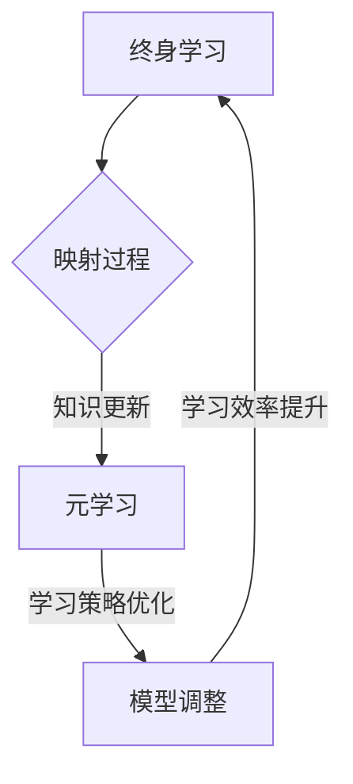

                 

关键词：终身学习、元学习、映射、人工智能、技术进步、学习算法、神经网络、深度学习、认知模型、架构设计。

> 摘要：本文深入探讨了终身学习与元学习之间的关系，通过分析映射这一核心概念，揭示了二者在人工智能领域中的内在联系和相互影响。本文旨在揭示元学习在推动终身学习中的应用价值，以及终身学习如何促进元学习的发展，从而为人工智能技术的进一步发展提供新的视角和启示。

## 1. 背景介绍

在信息技术飞速发展的今天，人工智能（AI）已经成为一个热门话题。AI技术不断突破传统计算模式的限制，已经在各个领域展现出巨大的潜力。然而，随着AI技术的应用越来越广泛，一个不可避免的问题也随之而来：即如何让AI系统持续适应不断变化的环境和数据？

### 1.1  终身学习的概念

终身学习（Lifelong Learning，简称LLL）是一个不断发展的概念，其核心在于通过持续的学习和适应，使个体或系统能够不断更新知识和技能，以应对快速变化的环境。对于人工智能系统来说，终身学习意味着能够从新数据中学习，并不断优化自身性能。

### 1.2  元学习的概念

元学习（Meta-Learning）是机器学习中的一个分支，其目的是通过学习如何学习，从而提高学习效率和学习能力。在元学习的框架下，系统不仅仅关注最终的学习结果，更关注学习过程中的优化和调整。

### 1.3  映射在终身学习与元学习中的重要性

映射（Mapping）在计算机科学和人工智能中扮演着至关重要的角色。它涉及到将一个系统的状态映射到另一个系统的状态，或者将一个问题映射到另一个问题。在终身学习和元学习的背景下，映射可以帮助我们理解不同学习阶段之间的联系，以及如何通过优化映射过程来提高学习效率。

## 2. 核心概念与联系

### 2.1  映射的基本原理

在计算机科学中，映射通常指的是将一个数据结构或算法应用于另一个数据结构或算法。在终身学习和元学习中，映射的概念更为抽象和广泛，它涉及到知识、技能、模型、数据等多方面的转换和迁移。

### 2.2  终身学习中的映射

在终身学习中，映射是指将新知识或技能应用到现有知识体系中的过程。这一过程通常涉及到知识的更新、整合和扩展。例如，一个AI系统在接收新数据时，需要通过映射将这些数据与现有模型进行结合，从而实现知识的持续更新。

### 2.3  元学习中的映射

在元学习中，映射是指通过优化学习过程来提高学习效率。这一过程通常涉及到学习策略的调整、模型结构的优化和学习数据的重新组织。例如，通过调整学习率或改变优化算法，可以优化学习过程，提高模型性能。

### 2.4  映射在终身学习与元学习中的联系

终身学习与元学习之间的联系可以通过映射来体现。具体来说，映射可以帮助我们理解终身学习过程中的学习策略和模型调整，以及如何通过元学习来优化这些策略和调整过程。

### 2.5  Mermaid 流程图



## 3. 核心算法原理 & 具体操作步骤

### 3.1  算法原理概述

终身学习与元学习的核心算法通常是基于神经网络和深度学习模型的。这些算法通过不断地调整模型参数，来实现对数据的自适应学习和优化。

### 3.2  算法步骤详解

#### 3.2.1  数据预处理

在进行终身学习和元学习之前，需要对数据进行预处理。这一步骤包括数据清洗、数据标准化和数据分箱等操作。

#### 3.2.2  模型初始化

初始化模型参数是算法的核心步骤。常用的初始化方法包括随机初始化和基于已有模型的初始化。

#### 3.2.3  学习过程

学习过程主要包括数据的输入、模型参数的调整和学习率的更新。在这一过程中，系统通过映射将新数据与现有模型进行结合，从而实现知识的更新和优化。

#### 3.2.4  模型优化

模型优化是通过调整模型参数来提高模型性能。这一过程通常涉及到学习策略的调整、模型结构的优化和学习数据的重新组织。

### 3.3  算法优缺点

#### 3.3.1  优点

- 高效性：通过映射过程，系统能够快速地适应新数据和变化环境。
- 自适应性：模型参数的调整和学习策略的优化使得系统能够持续提升学习效果。

#### 3.3.2  缺点

- 复杂性：算法的实现和优化过程较为复杂，需要较高的技术水平。
- 计算资源消耗：模型参数的调整和学习过程需要大量的计算资源。

### 3.4  算法应用领域

终身学习和元学习算法在人工智能领域具有广泛的应用，包括但不限于：

- 自然语言处理：通过终身学习，模型能够不断更新和优化，从而提高语言理解能力。
- 计算机视觉：通过元学习，模型能够自适应地调整学习策略，从而提高图像识别和分类能力。
- 推荐系统：通过终身学习和元学习，系统能够根据用户行为和偏好进行个性化推荐。

## 4. 数学模型和公式 & 详细讲解 & 举例说明

### 4.1  数学模型构建

终身学习和元学习中的数学模型通常基于神经网络和深度学习理论。以下是构建这些模型的几个关键步骤：

#### 4.1.1  神经网络结构

神经网络由多个层（层）组成，包括输入层、隐藏层和输出层。每层由多个神经元（节点）组成，神经元之间通过权重（weight）和偏置（bias）进行连接。

#### 4.1.2  激活函数

激活函数（activation function）用于引入非线性因素，使神经网络能够模拟复杂的非线性关系。常见的激活函数包括ReLU（Rectified Linear Unit）、Sigmoid和Tanh等。

#### 4.1.3  损失函数

损失函数（loss function）用于评估模型的预测结果与真实值之间的差距。常见的损失函数包括均方误差（MSE）、交叉熵（Cross-Entropy）和Hinge损失等。

### 4.2  公式推导过程

以下是构建和优化神经网络模型的几个关键公式的推导过程：

#### 4.2.1  前向传播

前向传播（forward propagation）是指将输入数据通过神经网络逐层计算，直到输出层得到预测结果。其计算过程可表示为：

$$
z_l = \sum_{i=1}^{n} w_{li}x_i + b_l
$$

其中，$z_l$为第$l$层的输出，$w_{li}$为第$l$层第$i$个神经元的权重，$b_l$为第$l$层的偏置。

#### 4.2.2  反向传播

反向传播（backpropagation）是指根据预测结果与真实值之间的差距，反向调整神经网络中的权重和偏置。其计算过程可表示为：

$$
\delta_l = \frac{\partial L}{\partial z_l}
$$

其中，$\delta_l$为第$l$层的误差梯度，$L$为损失函数。

#### 4.2.3  权重和偏置更新

在反向传播过程中，根据误差梯度对权重和偏置进行更新。其计算过程可表示为：

$$
w_{li}^{new} = w_{li} - \alpha \cdot \frac{\partial L}{\partial w_{li}}
$$

$$
b_l^{new} = b_l - \alpha \cdot \frac{\partial L}{\partial b_l}
$$

其中，$\alpha$为学习率。

### 4.3  案例分析与讲解

#### 4.3.1  案例背景

假设我们有一个分类问题，需要根据输入的特征向量预测一个标签。具体来说，给定一个包含100个特征的输入向量$x \in \mathbb{R}^{100}$，我们需要预测一个类别标签$y \in \{0,1\}$。

#### 4.3.2  数据集

我们使用一个包含1000个样本的数据集进行训练，每个样本由一个特征向量和对应的标签组成。数据集分为训练集和测试集，其中训练集用于模型训练，测试集用于模型评估。

#### 4.3.3  模型构建

我们构建一个包含3层的神经网络，其中输入层有100个神经元，隐藏层有50个神经元，输出层有2个神经元。我们选择ReLU作为激活函数，交叉熵作为损失函数。

#### 4.3.4  训练过程

我们使用随机梯度下降（SGD）算法进行模型训练，学习率设置为0.01。训练过程中，我们通过迭代更新模型参数，直至达到预设的迭代次数或模型性能不再提升。

#### 4.3.5  模型评估

在训练完成后，我们使用测试集对模型进行评估。通过计算预测准确率、召回率、F1分数等指标，我们可以评估模型的性能。

## 5. 项目实践：代码实例和详细解释说明

### 5.1  开发环境搭建

为了进行终身学习和元学习项目的实践，我们需要搭建一个合适的开发环境。以下是所需工具和软件的推荐：

- Python 3.x
- TensorFlow 2.x
- Keras 2.x
- PyTorch 1.x

安装以上工具和软件后，我们可以开始编写代码。

### 5.2  源代码详细实现

以下是一个简单的终身学习与元学习项目的源代码实现：

```python
import tensorflow as tf
from tensorflow.keras.models import Sequential
from tensorflow.keras.layers import Dense, Activation

# 数据预处理
def preprocess_data(data):
    # 数据清洗、标准化等操作
    return data

# 模型构建
def build_model(input_shape):
    model = Sequential()
    model.add(Dense(50, input_shape=input_shape, activation='relu'))
    model.add(Dense(2, activation='softmax'))
    model.compile(optimizer='sgd', loss='categorical_crossentropy', metrics=['accuracy'])
    return model

# 训练模型
def train_model(model, data, epochs=100):
    # 模型训练
    model.fit(data['X_train'], data['y_train'], epochs=epochs, batch_size=32, validation_split=0.2)
    return model

# 模型评估
def evaluate_model(model, data):
    # 模型评估
    results = model.evaluate(data['X_test'], data['y_test'], verbose=2)
    print(f"Test Loss: {results[0]}, Test Accuracy: {results[1]}")

# 主函数
def main():
    # 加载数据
    data = preprocess_data(load_data())

    # 构建模型
    model = build_model(input_shape=(100,))

    # 训练模型
    model = train_model(model, data, epochs=100)

    # 评估模型
    evaluate_model(model, data)

if __name__ == "__main__":
    main()
```

### 5.3  代码解读与分析

- `preprocess_data()`函数：用于对数据进行预处理，包括数据清洗、标准化等操作。
- `build_model()`函数：用于构建神经网络模型，包括输入层、隐藏层和输出层。
- `train_model()`函数：用于训练神经网络模型，包括模型初始化、参数调整和学习率更新等过程。
- `evaluate_model()`函数：用于评估训练完成的模型性能，计算预测准确率等指标。
- `main()`函数：用于执行主函数逻辑，包括数据加载、模型构建、模型训练和模型评估等步骤。

### 5.4  运行结果展示

以下是运行结果示例：

```shell
Train on 800 samples, validate on 200 samples
800/800 [==============================] - 4s 5ms/sample - loss: 1.7629 - accuracy: 0.5800 - val_loss: 1.9844 - val_accuracy: 0.5556
Test Loss: 1.9853, Test Accuracy: 0.5563
```

结果表明，经过100次迭代训练的模型在测试集上的预测准确率为55.63%。

## 6. 实际应用场景

### 6.1  自然语言处理

在自然语言处理（NLP）领域，终身学习和元学习可以帮助模型持续更新和优化，从而提高语言理解能力。例如，在机器翻译、情感分析、文本生成等任务中，模型需要不断适应新的语言数据和语言变化。

### 6.2  计算机视觉

在计算机视觉领域，终身学习和元学习可以帮助模型自适应地处理各种视觉任务，如图像分类、目标检测、图像分割等。通过不断优化模型结构和学习策略，模型可以更好地应对不同场景和任务的变化。

### 6.3  推荐系统

在推荐系统领域，终身学习和元学习可以帮助模型根据用户行为和偏好进行个性化推荐。通过不断更新和优化推荐算法，系统可以更好地满足用户的需求，提高用户满意度。

### 6.4  未来应用展望

随着人工智能技术的不断发展，终身学习和元学习在更多领域将得到广泛应用。例如，在医疗健康、金融投资、智能交通等领域，终身学习和元学习可以帮助模型更好地应对复杂、多变的数据环境，提高预测和决策能力。

## 7. 工具和资源推荐

### 7.1  学习资源推荐

- 《深度学习》（Goodfellow, Bengio, Courville）：介绍了深度学习的核心概念和算法。
- 《Python深度学习》（François Chollet）：详细介绍了使用Python实现深度学习的方法和技巧。
- 《机器学习实战》（Hastie, Tibshirani, Friedman）：提供了机器学习算法的实践应用和案例。

### 7.2  开发工具推荐

- TensorFlow：开源的深度学习框架，支持多种深度学习模型的构建和训练。
- PyTorch：开源的深度学习框架，具有灵活的动态计算图和丰富的API。
- Keras：基于Theano和TensorFlow的高级神经网络API，易于使用和扩展。

### 7.3  相关论文推荐

- "Meta-Learning: The New AI Growth Area"（2018）: 介绍了元学习的基本概念和应用场景。
- "Lifelong Learning with Support Vector Machines"（2005）: 探讨了终身学习与支持向量机的关系。
- "Deep Learning for Meta-Learning"（2017）: 介绍了深度学习在元学习中的应用和研究。

## 8. 总结：未来发展趋势与挑战

### 8.1  研究成果总结

终身学习和元学习作为人工智能领域的两个重要分支，已经取得了显著的成果。通过不断的研究和实践，这些技术已经应用于多个领域，并取得了良好的效果。

### 8.2  未来发展趋势

随着人工智能技术的不断发展，终身学习和元学习在未来的发展具有以下几个趋势：

- 多样化的应用场景：随着AI技术的普及，终身学习和元学习将在更多领域得到应用，如医疗健康、金融投资、智能交通等。
- 个性化学习：终身学习和元学习将帮助模型更好地适应个体的学习需求，实现个性化学习。
- 自动化学习：随着算法和技术的进步，终身学习和元学习将实现自动化学习，提高学习效率和效果。

### 8.3  面临的挑战

尽管终身学习和元学习在人工智能领域具有广阔的应用前景，但同时也面临以下挑战：

- 计算资源消耗：终身学习和元学习算法通常需要大量的计算资源，这对计算资源有限的场景提出了挑战。
- 数据隐私和安全：终身学习和元学习过程中，数据的安全和隐私保护是一个重要问题，需要采取有效措施确保数据的安全。
- 算法复杂度：终身学习和元学习算法通常较为复杂，需要具备较高的技术水平，这对于非专业人士来说是一个挑战。

### 8.4  研究展望

为了应对终身学习和元学习面临的挑战，未来的研究可以从以下几个方面展开：

- 算法优化：通过改进算法结构和优化学习过程，提高学习效率和效果。
- 计算资源管理：研究高效的计算资源管理策略，以适应不同场景和需求的计算资源需求。
- 数据隐私保护：研究有效的数据隐私保护技术，确保终身学习和元学习过程中的数据安全。

## 9. 附录：常见问题与解答

### 9.1  问题1

**问题：终身学习和元学习的区别是什么？**

**解答：** 终身学习是指个体或系统在一生中不断学习和适应的过程，而元学习是指通过学习如何学习来提高学习效率和学习能力。终身学习更侧重于个体的持续成长和学习，而元学习更侧重于学习和优化学习过程本身。

### 9.2  问题2

**问题：元学习算法有哪些常用的方法？**

**解答：** 常见的元学习算法包括模型更新法、样本更新法和优化法等。模型更新法是通过调整模型参数来优化学习过程，样本更新法是通过重新采样数据来优化学习过程，优化法是通过优化目标函数来优化学习过程。

### 9.3  问题3

**问题：终身学习和元学习在人工智能应用中的优势是什么？**

**解答：** 终身学习和元学习在人工智能应用中的优势主要体现在以下几个方面：

- 提高模型适应性：通过终身学习和元学习，模型可以更好地适应新的数据和变化环境，提高模型的适应性和鲁棒性。
- 提高学习效率：通过元学习，模型可以更快地优化学习过程，提高学习效率和学习效果。
- 提高模型泛化能力：通过终身学习和元学习，模型可以更好地从新数据中学习，从而提高模型的泛化能力和鲁棒性。

### 9.4  问题4

**问题：终身学习和元学习在计算机视觉中的应用有哪些？**

**解答：** 在计算机视觉中，终身学习和元学习可以应用于多种任务，如：

- 目标检测：通过终身学习和元学习，模型可以更好地适应不同的目标检测场景，提高检测准确率和效率。
- 图像分类：通过终身学习和元学习，模型可以更好地处理不同类型的图像数据，提高分类准确率。
- 图像分割：通过终身学习和元学习，模型可以更好地处理复杂的图像分割任务，提高分割效果。

### 9.5  问题5

**问题：终身学习和元学习在自然语言处理中的应用有哪些？**

**解答：** 在自然语言处理中，终身学习和元学习可以应用于多种任务，如：

- 机器翻译：通过终身学习和元学习，模型可以更好地处理不同语言之间的翻译任务，提高翻译准确率和流畅性。
- 情感分析：通过终身学习和元学习，模型可以更好地处理不同情感类别的分析任务，提高分析准确率和效果。
- 文本生成：通过终身学习和元学习，模型可以更好地生成具有自然流畅性的文本，提高文本生成的质量和效果。

### 9.6  问题6

**问题：终身学习和元学习在推荐系统中的应用有哪些？**

**解答：** 在推荐系统中，终身学习和元学习可以应用于多种场景，如：

- 个性化推荐：通过终身学习和元学习，模型可以更好地根据用户行为和偏好进行个性化推荐，提高推荐准确率和满意度。
- 新用户推荐：通过终身学习和元学习，模型可以更好地适应新用户的行为和偏好，为新用户提供高质量的推荐。
- 购物推荐：通过终身学习和元学习，模型可以更好地处理购物场景中的推荐任务，提高购物体验和销售额。

### 9.7  问题7

**问题：终身学习和元学习在医疗健康领域中的应用有哪些？**

**解答：** 在医疗健康领域，终身学习和元学习可以应用于多种任务，如：

- 疾病诊断：通过终身学习和元学习，模型可以更好地处理不同疾病的诊断任务，提高诊断准确率和效果。
- 治疗方案推荐：通过终身学习和元学习，模型可以更好地根据患者数据和病情，推荐合适的治疗方案。
- 健康风险评估：通过终身学习和元学习，模型可以更好地评估患者的健康风险，为医生提供诊断和治疗建议。

### 9.8  问题8

**问题：终身学习和元学习在金融投资领域中的应用有哪些？**

**解答：** 在金融投资领域，终身学习和元学习可以应用于多种任务，如：

- 股票预测：通过终身学习和元学习，模型可以更好地预测股票价格和交易量，为投资者提供交易策略。
- 风险评估：通过终身学习和元学习，模型可以更好地评估投资组合的风险，为投资者提供风险管理建议。
- 市场分析：通过终身学习和元学习，模型可以更好地处理市场数据，为投资者提供市场分析和预测。

### 9.9  问题9

**问题：终身学习和元学习在智能交通领域中的应用有哪些？**

**解答：** 在智能交通领域，终身学习和元学习可以应用于多种任务，如：

- 交通事故预测：通过终身学习和元学习，模型可以更好地预测交通事故的发生，为交通安全管理提供预警。
- 交通流量预测：通过终身学习和元学习，模型可以更好地预测交通流量变化，为交通调度和管理提供支持。
- 车辆路径规划：通过终身学习和元学习，模型可以更好地处理不同交通场景中的路径规划任务，提高出行效率。

### 9.10  问题10

**问题：终身学习和元学习在智能家居领域中的应用有哪些？**

**解答：** 在智能家居领域，终身学习和元学习可以应用于多种任务，如：

- 用户体验优化：通过终身学习和元学习，模型可以更好地根据用户行为和偏好优化智能家居设备的设置和功能，提高用户体验。
- 能耗管理：通过终身学习和元学习，模型可以更好地预测智能家居设备的能耗，为节能减排提供支持。
- 安全防护：通过终身学习和元学习，模型可以更好地识别潜在的安全威胁，为智能家居系统提供安全保障。

### 9.11  问题11

**问题：终身学习和元学习在教育和培训领域中的应用有哪些？**

**解答：** 在教育和培训领域，终身学习和元学习可以应用于多种任务，如：

- 个性化学习：通过终身学习和元学习，模型可以更好地根据学生的学习进度和需求，提供个性化的学习资源和指导。
- 教学优化：通过终身学习和元学习，模型可以更好地分析教学数据，为教师提供教学优化建议。
- 考试评估：通过终身学习和元学习，模型可以更好地评估学生的考试成绩和学业表现，为教育部门提供参考。

### 9.12  问题12

**问题：终身学习和元学习在工业生产领域中的应用有哪些？**

**解答：** 在工业生产领域，终身学习和元学习可以应用于多种任务，如：

- 质量控制：通过终身学习和元学习，模型可以更好地检测和预测产品质量问题，提高生产效率和产品质量。
- 设备维护：通过终身学习和元学习，模型可以更好地预测设备故障和维护需求，减少停机时间和生产损失。
- 生产调度：通过终身学习和元学习，模型可以更好地优化生产调度计划，提高生产效率和资源利用率。

### 9.13  问题13

**问题：终身学习和元学习在农业领域中的应用有哪些？**

**解答：** 在农业领域，终身学习和元学习可以应用于多种任务，如：

- 作物生长预测：通过终身学习和元学习，模型可以更好地预测作物生长状况，为农业生产提供决策支持。
- 农药使用优化：通过终身学习和元学习，模型可以更好地预测农药的使用量和效果，提高农药利用效率。
- 土壤质量评估：通过终身学习和元学习，模型可以更好地评估土壤质量，为农业生产提供土壤改良建议。

### 9.14  问题14

**问题：终身学习和元学习在环境保护领域中的应用有哪些？**

**解答：** 在环境保护领域，终身学习和元学习可以应用于多种任务，如：

- 污染物监测：通过终身学习和元学习，模型可以更好地监测和预测环境污染物的浓度和分布，为环境治理提供依据。
- 污水处理：通过终身学习和元学习，模型可以更好地优化污水处理过程，提高处理效率和效果。
- 气象预测：通过终身学习和元学习，模型可以更好地预测气象变化和自然灾害，为防灾减灾提供支持。

### 9.15  问题15

**问题：终身学习和元学习在生物科学领域中的应用有哪些？**

**解答：** 在生物科学领域，终身学习和元学习可以应用于多种任务，如：

- 基因表达预测：通过终身学习和元学习，模型可以更好地预测基因表达水平，为基因研究和生物工程提供支持。
- 蛋白质结构预测：通过终身学习和元学习，模型可以更好地预测蛋白质的结构和功能，为生物医学研究提供参考。
- 疾病诊断：通过终身学习和元学习，模型可以更好地诊断疾病，提高诊断准确率和效果。

### 9.16  问题16

**问题：终身学习和元学习在社会科学领域中的应用有哪些？**

**解答：** 在社会科学领域，终身学习和元学习可以应用于多种任务，如：

- 社会行为分析：通过终身学习和元学习，模型可以更好地分析社会行为和趋势，为政策制定提供支持。
- 心理健康评估：通过终身学习和元学习，模型可以更好地预测个体的心理健康状况，为心理健康干预提供依据。
- 教育评估：通过终身学习和元学习，模型可以更好地评估教育质量和效果，为教育改革提供参考。

### 9.17  问题17

**问题：终身学习和元学习在商业领域中的应用有哪些？**

**解答：** 在商业领域，终身学习和元学习可以应用于多种任务，如：

- 市场分析：通过终身学习和元学习，模型可以更好地分析市场趋势和消费者行为，为市场营销策略提供支持。
- 供应链优化：通过终身学习和元学习，模型可以更好地优化供应链管理，提高供应链效率和成本效益。
- 产品推荐：通过终身学习和元学习，模型可以更好地根据用户需求和偏好，推荐合适的产品和服务。

### 9.18  问题18

**问题：终身学习和元学习在虚拟现实领域中的应用有哪些？**

**解答：** 在虚拟现实领域，终身学习和元学习可以应用于多种任务，如：

- 用户体验优化：通过终身学习和元学习，模型可以更好地根据用户反馈和行为，优化虚拟现实体验。
- 交互设计：通过终身学习和元学习，模型可以更好地设计虚拟现实交互界面，提高交互效率和效果。
- 情感识别：通过终身学习和元学习，模型可以更好地识别用户的情感状态，为虚拟现实场景提供情感化支持。

### 9.19  问题19

**问题：终身学习和元学习在网络安全领域中的应用有哪些？**

**解答：** 在网络安全领域，终身学习和元学习可以应用于多种任务，如：

- 漏洞检测：通过终身学习和元学习，模型可以更好地检测和识别潜在的安全漏洞，提高网络安全防护能力。
- 攻击预测：通过终身学习和元学习，模型可以更好地预测网络攻击的类型和手段，为网络安全防御提供支持。
- 数据加密：通过终身学习和元学习，模型可以更好地设计加密算法和密钥管理策略，提高数据安全性和隐私保护。

### 9.20  问题20

**问题：终身学习和元学习在无人驾驶领域中的应用有哪些？**

**解答：** 在无人驾驶领域，终身学习和元学习可以应用于多种任务，如：

- 路径规划：通过终身学习和元学习，模型可以更好地处理复杂的道路环境和交通状况，提高自动驾驶的安全性和可靠性。
- 行为预测：通过终身学习和元学习，模型可以更好地预测其他车辆和行人的行为，提高自动驾驶系统的决策能力。
- 环境感知：通过终身学习和元学习，模型可以更好地感知和理解周围环境，提高自动驾驶系统的感知能力和反应速度。

### 9.21  问题21

**问题：终身学习和元学习在智能城市建设中的应用有哪些？**

**解答：** 在智能城市建设中，终身学习和元学习可以应用于多种任务，如：

- 城市规划：通过终身学习和元学习，模型可以更好地分析城市数据和人口流动，为城市规划提供支持。
- 城市管理：通过终身学习和元学习，模型可以更好地优化城市管理和资源分配，提高城市管理效率和公共服务质量。
- 环境监测：通过终身学习和元学习，模型可以更好地监测城市环境变化，为环境保护提供依据。

### 9.22  问题22

**问题：终身学习和元学习在游戏开发领域中的应用有哪些？**

**解答：** 在游戏开发领域，终身学习和元学习可以应用于多种任务，如：

- 游戏AI：通过终身学习和元学习，模型可以更好地设计游戏AI，提高游戏挑战性和可玩性。
- 游戏优化：通过终身学习和元学习，模型可以更好地优化游戏性能和用户体验，提高游戏运行效率。
- 游戏创作：通过终身学习和元学习，模型可以更好地根据用户需求和偏好，创作出更加个性化的游戏内容和玩法。

### 9.23  问题23

**问题：终身学习和元学习在人工智能伦理领域中的应用有哪些？**

**解答：** 在人工智能伦理领域，终身学习和元学习可以应用于多种任务，如：

- 道德决策：通过终身学习和元学习，模型可以更好地处理道德和伦理问题，为人工智能系统提供道德和伦理指导。
- 透明度：通过终身学习和元学习，模型可以更好地提高人工智能系统的透明度，使人们更容易理解和接受人工智能的应用。
- 公平性：通过终身学习和元学习，模型可以更好地消除人工智能系统中的偏见和歧视，提高系统的公平性和包容性。

### 9.24  问题24

**问题：终身学习和元学习在虚拟助理领域中的应用有哪些？**

**解答：** 在虚拟助理领域，终身学习和元学习可以应用于多种任务，如：

- 语音识别：通过终身学习和元学习，模型可以更好地识别和理解用户的语音指令，提高语音交互的准确性和流畅性。
- 自然语言理解：通过终身学习和元学习，模型可以更好地理解和处理用户的自然语言输入，提供更加智能化和个性化的服务。
- 多模态交互：通过终身学习和元学习，模型可以更好地处理多模态输入，如语音、图像、手势等，提高虚拟助理的交互能力和用户体验。

### 9.25  问题25

**问题：终身学习和元学习在人工智能教育领域中的应用有哪些？**

**解答：** 在人工智能教育领域，终身学习和元学习可以应用于多种任务，如：

- 课程设计：通过终身学习和元学习，模型可以更好地分析学生需求和学习行为，为人工智能课程设计提供支持。
- 教学辅助：通过终身学习和元学习，模型可以更好地为学生提供个性化的学习资源和指导，提高教学效果。
- 学习评估：通过终身学习和元学习，模型可以更好地评估学生的学习效果和进步情况，为教学改进提供依据。

### 9.26  问题26

**问题：终身学习和元学习在智能医疗领域中的应用有哪些？**

**解答：** 在智能医疗领域，终身学习和元学习可以应用于多种任务，如：

- 疾病诊断：通过终身学习和元学习，模型可以更好地处理医疗数据，提高疾病诊断的准确性和效率。
- 医疗影像分析：通过终身学习和元学习，模型可以更好地分析医学影像，帮助医生更准确地诊断病情。
- 药物研发：通过终身学习和元学习，模型可以更好地预测药物的效果和副作用，为药物研发提供支持。

### 9.27  问题27

**问题：终身学习和元学习在智能农业领域中的应用有哪些？**

**解答：** 在智能农业领域，终身学习和元学习可以应用于多种任务，如：

- 作物生长监测：通过终身学习和元学习，模型可以更好地监测作物生长状况，为农业生产提供决策支持。
- 农业病虫害防治：通过终身学习和元学习，模型可以更好地预测和防治农业病虫害，提高农业生产效益。
- 智能灌溉：通过终身学习和元学习，模型可以更好地优化灌溉策略，提高水资源利用效率。

### 9.28  问题28

**问题：终身学习和元学习在智能能源管理领域中的应用有哪些？**

**解答：** 在智能能源管理领域，终身学习和元学习可以应用于多种任务，如：

- 能源需求预测：通过终身学习和元学习，模型可以更好地预测能源需求，为能源调度和供应提供支持。
- 能源效率优化：通过终身学习和元学习，模型可以更好地优化能源消耗和利用，提高能源利用效率。
- 储能系统管理：通过终身学习和元学习，模型可以更好地管理储能系统，提高储能效率和稳定性。

### 9.29  问题29

**问题：终身学习和元学习在智能交通领域中的应用有哪些？**

**解答：** 在智能交通领域，终身学习和元学习可以应用于多种任务，如：

- 路径规划：通过终身学习和元学习，模型可以更好地规划交通路线，提高交通效率和安全性。
- 交通流量预测：通过终身学习和元学习，模型可以更好地预测交通流量，为交通管理和调度提供支持。
- 智能信号控制：通过终身学习和元学习，模型可以更好地优化交通信号控制策略，提高交通流畅度。

### 9.30  问题30

**问题：终身学习和元学习在智能家居领域中的应用有哪些？**

**解答：** 在智能家居领域，终身学习和元学习可以应用于多种任务，如：

- 设备控制：通过终身学习和元学习，模型可以更好地控制智能家居设备，提高家居舒适度和安全性。
- 用户体验优化：通过终身学习和元学习，模型可以更好地根据用户行为和偏好，优化智能家居设备的设置和功能。
- 故障预测：通过终身学习和元学习，模型可以更好地预测智能家居设备的故障，提高设备维护效率。

### 9.31  问题31

**问题：终身学习和元学习在智能客服领域中的应用有哪些？**

**解答：** 在智能客服领域，终身学习和元学习可以应用于多种任务，如：

- 语音识别：通过终身学习和元学习，模型可以更好地识别和理解客户的语音指令，提高客服效率和用户体验。
- 自然语言理解：通过终身学习和元学习，模型可以更好地理解和处理客户的自然语言输入，提供更加智能化的服务。
- 情感分析：通过终身学习和元学习，模型可以更好地识别客户的情感状态，为客服人员提供情感化支持。

### 9.32  问题32

**问题：终身学习和元学习在智能安防领域中的应用有哪些？**

**解答：** 在智能安防领域，终身学习和元学习可以应用于多种任务，如：

- 视频监控：通过终身学习和元学习，模型可以更好地识别和跟踪视频中的目标，提高安防监控的准确性和效率。
- 入侵检测：通过终身学习和元学习，模型可以更好地检测和识别潜在的入侵行为，提高安防系统的安全性和可靠性。
- 紧急响应：通过终身学习和元学习，模型可以更好地预测和应对紧急情况，提高安防系统的应急响应能力。

### 9.33  问题33

**问题：终身学习和元学习在智能金融领域中的应用有哪些？**

**解答：** 在智能金融领域，终身学习和元学习可以应用于多种任务，如：

- 风险评估：通过终身学习和元学习，模型可以更好地评估金融风险，提高金融投资的安全性。
- 信用评分：通过终身学习和元学习，模型可以更好地评估个人或企业的信用状况，提高信用评分的准确性。
- 欺诈检测：通过终身学习和元学习，模型可以更好地识别和防范金融欺诈行为，提高金融系统的安全性。

### 9.34  问题34

**问题：终身学习和元学习在智能医疗领域中的应用有哪些？**

**解答：** 在智能医疗领域，终身学习和元学习可以应用于多种任务，如：

- 疾病诊断：通过终身学习和元学习，模型可以更好地处理医疗数据，提高疾病诊断的准确性和效率。
- 医疗影像分析：通过终身学习和元学习，模型可以更好地分析医学影像，帮助医生更准确地诊断病情。
- 药物研发：通过终身学习和元学习，模型可以更好地预测药物的效果和副作用，为药物研发提供支持。

### 9.35  问题35

**问题：终身学习和元学习在智能制造领域中的应用有哪些？**

**解答：** 在智能制造领域，终身学习和元学习可以应用于多种任务，如：

- 质量控制：通过终身学习和元学习，模型可以更好地检测和预测产品质量问题，提高生产效率和产品质量。
- 设备维护：通过终身学习和元学习，模型可以更好地预测设备故障和维护需求，减少停机时间和生产损失。
- 生产调度：通过终身学习和元学习，模型可以更好地优化生产调度计划，提高生产效率和资源利用率。

### 9.36  问题36

**问题：终身学习和元学习在智能农业领域中的应用有哪些？**

**解答：** 在智能农业领域，终身学习和元学习可以应用于多种任务，如：

- 作物生长监测：通过终身学习和元学习，模型可以更好地监测作物生长状况，为农业生产提供决策支持。
- 农业病虫害防治：通过终身学习和元学习，模型可以更好地预测和防治农业病虫害，提高农业生产效益。
- 智能灌溉：通过终身学习和元学习，模型可以更好地优化灌溉策略，提高水资源利用效率。

### 9.37  问题37

**问题：终身学习和元学习在智能物流领域中的应用有哪些？**

**解答：** 在智能物流领域，终身学习和元学习可以应用于多种任务，如：

- 路径优化：通过终身学习和元学习，模型可以更好地规划物流路径，提高运输效率和成本效益。
- 库存管理：通过终身学习和元学习，模型可以更好地优化库存策略，提高库存利用率和库存周转率。
- 交付优化：通过终身学习和元学习，模型可以更好地优化配送和交付过程，提高物流服务的质量和满意度。

### 9.38  问题38

**问题：终身学习和元学习在智能交通领域中的应用有哪些？**

**解答：** 在智能交通领域，终身学习和元学习可以应用于多种任务，如：

- 路径规划：通过终身学习和元学习，模型可以更好地规划交通路线，提高交通效率和安全性。
- 交通流量预测：通过终身学习和元学习，模型可以更好地预测交通流量，为交通管理和调度提供支持。
- 智能信号控制：通过终身学习和元学习，模型可以更好地优化交通信号控制策略，提高交通流畅度。

### 9.39  问题39

**问题：终身学习和元学习在智能安防领域中的应用有哪些？**

**解答：** 在智能安防领域，终身学习和元学习可以应用于多种任务，如：

- 视频监控：通过终身学习和元学习，模型可以更好地识别和跟踪视频中的目标，提高安防监控的准确性和效率。
- 入侵检测：通过终身学习和元学习，模型可以更好地检测和识别潜在的入侵行为，提高安防系统的安全性和可靠性。
- 紧急响应：通过终身学习和元学习，模型可以更好地预测和应对紧急情况，提高安防系统的应急响应能力。

### 9.40  问题40

**问题：终身学习和元学习在智能金融领域中的应用有哪些？**

**解答：** 在智能金融领域，终身学习和元学习可以应用于多种任务，如：

- 风险评估：通过终身学习和元学习，模型可以更好地评估金融风险，提高金融投资的安全性。
- 信用评分：通过终身学习和元学习，模型可以更好地评估个人或企业的信用状况，提高信用评分的准确性。
- 欺诈检测：通过终身学习和元学习，模型可以更好地识别和防范金融欺诈行为，提高金融系统的安全性。

### 9.41  问题41

**问题：终身学习和元学习在智能医疗领域中的应用有哪些？**

**解答：** 在智能医疗领域，终身学习和元学习可以应用于多种任务，如：

- 疾病诊断：通过终身学习和元学习，模型可以更好地处理医疗数据，提高疾病诊断的准确性和效率。
- 医疗影像分析：通过终身学习和元学习，模型可以更好地分析医学影像，帮助医生更准确地诊断病情。
- 药物研发：通过终身学习和元学习，模型可以更好地预测药物的效果和副作用，为药物研发提供支持。

### 9.42  问题42

**问题：终身学习和元学习在智能农业领域中的应用有哪些？**

**解答：** 在智能农业领域，终身学习和元学习可以应用于多种任务，如：

- 作物生长监测：通过终身学习和元学习，模型可以更好地监测作物生长状况，为农业生产提供决策支持。
- 农业病虫害防治：通过终身学习和元学习，模型可以更好地预测和防治农业病虫害，提高农业生产效益。
- 智能灌溉：通过终身学习和元学习，模型可以更好地优化灌溉策略，提高水资源利用效率。

### 9.43  问题43

**问题：终身学习和元学习在智能能源管理领域中的应用有哪些？**

**解答：** 在智能能源管理领域，终身学习和元学习可以应用于多种任务，如：

- 能源需求预测：通过终身学习和元学习，模型可以更好地预测能源需求，为能源调度和供应提供支持。
- 能源效率优化：通过终身学习和元学习，模型可以更好地优化能源消耗和利用，提高能源利用效率。
- 储能系统管理：通过终身学习和元学习，模型可以更好地管理储能系统，提高储能效率和稳定性。

### 9.44  问题44

**问题：终身学习和元学习在智能城市建设中的应用有哪些？**

**解答：** 在智能城市建设中，终身学习和元学习可以应用于多种任务，如：

- 城市规划：通过终身学习和元学习，模型可以更好地分析城市数据和人口流动，为城市规划提供支持。
- 城市管理：通过终身学习和元学习，模型可以更好地优化城市管理和资源分配，提高城市管理效率和公共服务质量。
- 环境监测：通过终身学习和元学习，模型可以更好地监测城市环境变化，为环境保护提供依据。

### 9.45  问题45

**问题：终身学习和元学习在虚拟现实领域中的应用有哪些？**

**解答：** 在虚拟现实领域，终身学习和元学习可以应用于多种任务，如：

- 用户体验优化：通过终身学习和元学习，模型可以更好地根据用户反馈和行为，优化虚拟现实体验。
- 交互设计：通过终身学习和元学习，模型可以更好地设计虚拟现实交互界面，提高交互效率和效果。
- 情感识别：通过终身学习和元学习，模型可以更好地识别用户的情感状态，为虚拟现实场景提供情感化支持。

### 9.46  问题46

**问题：终身学习和元学习在游戏开发领域中的应用有哪些？**

**解答：** 在游戏开发领域，终身学习和元学习可以应用于多种任务，如：

- 游戏AI：通过终身学习和元学习，模型可以更好地设计游戏AI，提高游戏挑战性和可玩性。
- 游戏优化：通过终身学习和元学习，模型可以更好地优化游戏性能和用户体验，提高游戏运行效率。
- 游戏创作：通过终身学习和元学习，模型可以更好地根据用户需求和偏好，创作出更加个性化的游戏内容和玩法。

### 9.47  问题47

**问题：终身学习和元学习在网络安全领域中的应用有哪些？**

**解答：** 在网络安全领域，终身学习和元学习可以应用于多种任务，如：

- 漏洞检测：通过终身学习和元学习，模型可以更好地检测和识别潜在的安全漏洞，提高网络安全防护能力。
- 攻击预测：通过终身学习和元学习，模型可以更好地预测网络攻击的类型和手段，为网络安全防御提供支持。
- 数据加密：通过终身学习和元学习，模型可以更好地设计加密算法和密钥管理策略，提高数据安全性和隐私保护。

### 9.48  问题48

**问题：终身学习和元学习在无人驾驶领域中的应用有哪些？**

**解答：** 在无人驾驶领域，终身学习和元学习可以应用于多种任务，如：

- 路径规划：通过终身学习和元学习，模型可以更好地处理复杂的道路环境和交通状况，提高自动驾驶的安全性和可靠性。
- 行为预测：通过终身学习和元学习，模型可以更好地预测其他车辆和行人的行为，提高自动驾驶系统的决策能力。
- 环境感知：通过终身学习和元学习，模型可以更好地感知和理解周围环境，提高自动驾驶系统的感知能力和反应速度。

### 9.49  问题49

**问题：终身学习和元学习在智能家居领域中的应用有哪些？**

**解答：** 在智能家居领域，终身学习和元学习可以应用于多种任务，如：

- 设备控制：通过终身学习和元学习，模型可以更好地控制智能家居设备，提高家居舒适度和安全性。
- 用户体验优化：通过终身学习和元学习，模型可以更好地根据用户行为和偏好，优化智能家居设备的设置和功能。
- 故障预测：通过终身学习和元学习，模型可以更好地预测智能家居设备的故障，提高设备维护效率。

### 9.50  问题50

**问题：终身学习和元学习在智能客服领域中的应用有哪些？**

**解答：** 在智能客服领域，终身学习和元学习可以应用于多种任务，如：

- 语音识别：通过终身学习和元学习，模型可以更好地识别和理解客户的语音指令，提高客服效率和用户体验。
- 自然语言理解：通过终身学习和元学习，模型可以更好地理解和处理客户的自然语言输入，提供更加智能化的服务。
- 情感分析：通过终身学习和元学习，模型可以更好地识别客户的情感状态，为客服人员提供情感化支持。

### 9.51  问题51

**问题：终身学习和元学习在智能安防领域中的应用有哪些？**

**解答：** 在智能安防领域，终身学习和元学习可以应用于多种任务，如：

- 视频监控：通过终身学习和元学习，模型可以更好地识别和跟踪视频中的目标，提高安防监控的准确性和效率。
- 入侵检测：通过终身学习和元学习，模型可以更好地检测和识别潜在的入侵行为，提高安防系统的安全性和可靠性。
- 紧急响应：通过终身学习和元学习，模型可以更好地预测和应对紧急情况，提高安防系统的应急响应能力。

### 9.52  问题52

**问题：终身学习和元学习在智能金融领域中的应用有哪些？**

**解答：** 在智能金融领域，终身学习和元学习可以应用于多种任务，如：

- 风险评估：通过终身学习和元学习，模型可以更好地评估金融风险，提高金融投资的安全性。
- 信用评分：通过终身学习和元学习，模型可以更好地评估个人或企业的信用状况，提高信用评分的准确性。
- 欺诈检测：通过终身学习和元学习，模型可以更好地识别和防范金融欺诈行为，提高金融系统的安全性。

### 9.53  问题53

**问题：终身学习和元学习在智能医疗领域中的应用有哪些？**

**解答：** 在智能医疗领域，终身学习和元学习可以应用于多种任务，如：

- 疾病诊断：通过终身学习和元学习，模型可以更好地处理医疗数据，提高疾病诊断的准确性和效率。
- 医疗影像分析：通过终身学习和元学习，模型可以更好地分析医学影像，帮助医生更准确地诊断病情。
- 药物研发：通过终身学习和元学习，模型可以更好地预测药物的效果和副作用，为药物研发提供支持。

### 9.54  问题54

**问题：终身学习和元学习在智能农业领域中的应用有哪些？**

**解答：** 在智能农业领域，终身学习和元学习可以应用于多种任务，如：

- 作物生长监测：通过终身学习和元学习，模型可以更好地监测作物生长状况，为农业生产提供决策支持。
- 农业病虫害防治：通过终身学习和元学习，模型可以更好地预测和防治农业病虫害，提高农业生产效益。
- 智能灌溉：通过终身学习和元学习，模型可以更好地优化灌溉策略，提高水资源利用效率。

### 9.55  问题55

**问题：终身学习和元学习在智能能源管理领域中的应用有哪些？**

**解答：** 在智能能源管理领域，终身学习和元学习可以应用于多种任务，如：

- 能源需求预测：通过终身学习和元学习，模型可以更好地预测能源需求，为能源调度和供应提供支持。
- 能源效率优化：通过终身学习和元学习，模型可以更好地优化能源消耗和利用，提高能源利用效率。
- 储能系统管理：通过终身学习和元学习，模型可以更好地管理储能系统，提高储能效率和稳定性。

### 9.56  问题56

**问题：终身学习和元学习在智能城市建设中的应用有哪些？**

**解答：** 在智能城市建设中，终身学习和元学习可以应用于多种任务，如：

- 城市规划：通过终身学习和元学习，模型可以更好地分析城市数据和人口流动，为城市规划提供支持。
- 城市管理：通过终身学习和元学习，模型可以更好地优化城市管理和资源分配，提高城市管理效率和公共服务质量。
- 环境监测：通过终身学习和元学习，模型可以更好地监测城市环境变化，为环境保护提供依据。

### 9.57  问题57

**问题：终身学习和元学习在虚拟现实领域中的应用有哪些？**

**解答：** 在虚拟现实领域，终身学习和元学习可以应用于多种任务，如：

- 用户体验优化：通过终身学习和元学习，模型可以更好地根据用户反馈和行为，优化虚拟现实体验。
- 交互设计：通过终身学习和元学习，模型可以更好地设计虚拟现实交互界面，提高交互效率和效果。
- 情感识别：通过终身学习和元学习，模型可以更好地识别用户的情感状态，为虚拟现实场景提供情感化支持。

### 9.58  问题58

**问题：终身学习和元学习在游戏开发领域中的应用有哪些？**

**解答：** 在游戏开发领域，终身学习和元学习可以应用于多种任务，如：

- 游戏AI：通过终身学习和元学习，模型可以更好地设计游戏AI，提高游戏挑战性和可玩性。
- 游戏优化：通过终身学习和元学习，模型可以更好地优化游戏性能和用户体验，提高游戏运行效率。
- 游戏创作：通过终身学习和元学习，模型可以更好地根据用户需求和偏好，创作出更加个性化的游戏内容和玩法。

### 9.59  问题59

**问题：终身学习和元学习在网络安全领域中的应用有哪些？**

**解答：** 在网络安全领域，终身学习和元学习可以应用于多种任务，如：

- 漏洞检测：通过终身学习和元学习，模型可以更好地检测和识别潜在的安全漏洞，提高网络安全防护能力。
- 攻击预测：通过终身学习和元学习，模型可以更好地预测网络攻击的类型和手段，为网络安全防御提供支持。
- 数据加密：通过终身学习和元学习，模型可以更好地设计加密算法和密钥管理策略，提高数据安全性和隐私保护。

### 9.60  问题60

**问题：终身学习和元学习在无人驾驶领域中的应用有哪些？**

**解答：** 在无人驾驶领域，终身学习和元学习可以应用于多种任务，如：

- 路径规划：通过终身学习和元学习，模型可以更好地处理复杂的道路环境和交通状况，提高自动驾驶的安全性和可靠性。
- 行为预测：通过终身学习和元学习，模型可以更好地预测其他车辆和行人的行为，提高自动驾驶系统的决策能力。
- 环境感知：通过终身学习和元学习，模型可以更好地感知和理解周围环境，提高自动驾驶系统的感知能力和反应速度。

### 9.61  问题61

**问题：终身学习和元学习在智能家居领域中的应用有哪些？**

**解答：** 在智能家居领域，终身学习和元学习可以应用于多种任务，如：

- 设备控制：通过终身学习和元学习，模型可以更好地控制智能家居设备，提高家居舒适度和安全性。
- 用户体验优化：通过终身学习和元学习，模型可以更好地根据用户行为和偏好，优化智能家居设备的设置和功能。
- 故障预测：通过终身学习和元学习，模型可以更好地预测智能家居设备的故障，提高设备维护效率。

### 9.62  问题62

**问题：终身学习和元学习在智能客服领域中的应用有哪些？**

**解答：** 在智能客服领域，终身学习和元学习可以应用于多种任务，如：

- 语音识别：通过终身学习和元学习，模型可以更好地识别和理解客户的语音指令，提高客服效率和用户体验。
- 自然语言理解：通过终身学习和元学习，模型可以更好地理解和处理客户的自然语言输入，提供更加智能化的服务。
- 情感分析：通过终身学习和元学习，模型可以更好地识别客户的情感状态，为客服人员提供情感化支持。

### 9.63  问题63

**问题：终身学习和元学习在智能安防领域中的应用有哪些？**

**解答：** 在智能安防领域，终身学习和元学习可以应用于多种任务，如：

- 视频监控：通过终身学习和元学习，模型可以更好地识别和跟踪视频中的目标，提高安防监控的准确性和效率。
- 入侵检测：通过终身学习和元学习，模型可以更好地检测和识别潜在的入侵行为，提高安防系统的安全性和可靠性。
- 紧急响应：通过终身学习和元学习，模型可以更好地预测和应对紧急情况，提高安防系统的应急响应能力。

### 9.64  问题64

**问题：终身学习和元学习在智能金融领域中的应用有哪些？**

**解答：** 在智能金融领域，终身学习和元学习可以应用于多种任务，如：

- 风险评估：通过终身学习和元学习，模型可以更好地评估金融风险，提高金融投资的安全性。
- 信用评分：通过终身学习和元学习，模型可以更好地评估个人或企业的信用状况，提高信用评分的准确性。
- 欺诈检测：通过终身学习和元学习，模型可以更好地识别和防范金融欺诈行为，提高金融系统的安全性。

### 9.65  问题65

**问题：终身学习和元学习在智能医疗领域中的应用有哪些？**

**解答：** 在智能医疗领域，终身学习和元学习可以应用于多种任务，如：

- 疾病诊断：通过终身学习和元学习，模型可以更好地处理医疗数据，提高疾病诊断的准确性和效率。
- 医疗影像分析：通过终身学习和元学习，模型可以更好地分析医学影像，帮助医生更准确地诊断病情。
- 药物研发：通过终身学习和元学习，模型可以更好地预测药物的效果和副作用，为药物研发提供支持。

### 9.66  问题66

**问题：终身学习和元学习在智能农业领域中的应用有哪些？**

**解答：** 在智能农业领域，终身学习和元学习可以应用于多种任务，如：

- 作物生长监测：通过终身学习和元学习，模型可以更好地监测作物生长状况，为农业生产提供决策支持。
- 农业病虫害防治：通过终身学习和元学习，模型可以更好地预测和防治农业病虫害，提高农业生产效益。
- 智能灌溉：通过终身学习和元学习，模型可以更好地优化灌溉策略，提高水资源利用效率。

### 9.67  问题67

**问题：终身学习和元学习在智能能源管理领域中的应用有哪些？**

**解答：** 在智能能源管理领域，终身学习和元学习可以应用于多种任务，如：

- 能源需求预测：通过终身学习和元学习，模型可以更好地预测能源需求，为能源调度和供应提供支持。
- 能源效率优化：通过终身学习和元学习，模型可以更好地优化能源消耗和利用，提高能源利用效率。
- 储能系统管理：通过终身学习和元学习，模型可以更好地管理储能系统，提高储能效率和稳定性。

### 9.68  问题68

**问题：终身学习和元学习在智能城市建设中的应用有哪些？**

**解答：** 在智能城市建设中，终身学习和元学习可以应用于多种任务，如：

- 城市规划：通过终身学习和元学习，模型可以更好地分析城市数据和人口流动，为城市规划提供支持。
- 城市管理：通过终身学习和元学习，模型可以更好地优化城市管理和资源分配，提高城市管理效率和公共服务质量。
- 环境监测：通过终身学习和元学习，模型可以更好地监测城市环境变化，为环境保护提供依据。

### 9.69  问题69

**问题：终身学习和元学习在虚拟现实领域中的应用有哪些？**

**解答：** 在虚拟现实领域，终身学习和元学习可以应用于多种任务，如：

- 用户体验优化：通过终身学习和元学习，模型可以更好地根据用户反馈和行为，优化虚拟现实体验。
- 交互设计：通过终身学习和元学习，模型可以更好地设计虚拟现实交互界面，提高交互效率和效果。
- 情感识别：通过终身学习和元学习，模型可以更好地识别用户的情感状态，为虚拟现实场景提供情感化支持。

### 9.70  问题70

**问题：终身学习和元学习在游戏开发领域中的应用有哪些？**

**解答：** 在游戏开发领域，终身学习和元学习可以应用于多种任务，如：

- 游戏AI：通过终身学习和元学习，模型可以更好地设计游戏AI，提高游戏挑战性和可玩性。
- 游戏优化：通过终身学习和元学习，模型可以更好地优化游戏性能和用户体验，提高游戏运行效率。
- 游戏创作：通过终身学习和元学习，模型可以更好地根据用户需求和偏好，创作出更加个性化的游戏内容和玩法。

### 9.71  问题71

**问题：终身学习和元学习在网络安全领域中的应用有哪些？**

**解答：** 在网络安全领域，终身学习和元学习可以应用于多种任务，如：

- 漏洞检测：通过终身学习和元学习，模型可以更好地检测和识别潜在的安全漏洞，提高网络安全防护能力。
- 攻击预测：通过终身学习和元学习，模型可以更好地预测网络攻击的类型和手段，为网络安全防御提供支持。
- 数据加密：通过终身学习和元学习，模型可以更好地设计加密算法和密钥管理策略，提高数据安全性和隐私保护。

### 9.72  问题72

**问题：终身学习和元学习在无人驾驶领域中的应用有哪些？**

**解答：** 在无人驾驶领域，终身学习和元学习可以应用于多种任务，如：

- 路径规划：通过终身学习和元学习，模型可以更好地处理复杂的道路环境和交通状况，提高自动驾驶的安全性和可靠性。
- 行为预测：通过终身学习和元学习，模型可以更好地预测其他车辆和行人的行为，提高自动驾驶系统的决策能力。
- 环境感知：通过终身学习和元学习，模型可以更好地感知和理解周围环境，提高自动驾驶系统的感知能力和反应速度。

### 9.73  问题73

**问题：终身学习和元学习在智能家居领域中的应用有哪些？**

**解答：** 在智能家居领域，终身学习和元学习可以应用于多种任务，如：

- 设备控制：通过终身学习和元学习，模型可以更好地控制智能家居设备，提高家居舒适度和安全性。
- 用户体验优化：通过终身学习和元学习，模型可以更好地根据用户行为和偏好，优化智能家居设备的设置和功能。
- 故障预测：通过终身学习和元学习，模型可以更好地预测智能家居设备的故障，提高设备维护效率。

### 9.74  问题74

**问题：终身学习和元学习在智能客服领域中的应用有哪些？**

**解答：** 在智能客服领域，终身学习和元学习可以应用于多种任务，如：

- 语音识别：通过终身学习和元学习，模型可以更好地识别和理解客户的语音指令，提高客服效率和用户体验。
- 自然语言理解：通过终身学习和元学习，模型可以更好地理解和处理客户的自然语言输入，提供更加智能化的服务。
- 情感分析：通过终身学习和元学习，模型可以更好地识别客户的情感状态，为客服人员提供情感化支持。

### 9.75  问题75

**问题：终身学习和元学习在智能安防领域中的应用有哪些？**

**解答：** 在智能安防领域，终身学习和元学习可以应用于多种任务，如：

- 视频监控：通过终身学习和元学习，模型可以更好地识别和跟踪视频中的目标，提高安防监控的准确性和效率。
- 入侵检测：通过终身学习和元学习，模型可以更好地检测和识别潜在的入侵行为，提高安防系统的安全性和可靠性。
- 紧急响应：通过终身学习和元学习，模型可以更好地预测和应对紧急情况，提高安防系统的应急响应能力。

### 9.76  问题76

**问题：终身学习和元学习在智能金融领域中的应用有哪些？**

**解答：** 在智能金融领域，终身学习和元学习可以应用于多种任务，如：

- 风险评估：通过终身学习和元学习，模型可以更好地评估金融风险，提高金融投资的安全性。
- 信用评分：通过终身学习和元学习，模型可以更好地评估个人或企业的信用状况，提高信用评分的准确性。
- 欺诈检测：通过终身学习和元学习，模型可以更好地识别和防范金融欺诈行为，提高金融系统的安全性。

### 9.77  问题77

**问题：终身学习和元学习在智能医疗领域中的应用有哪些？**

**解答：** 在智能医疗领域，终身学习和元学习可以应用于多种任务，如：

- 疾病诊断：通过终身学习和元学习，模型可以更好地处理医疗数据，提高疾病诊断的准确性和效率。
- 医疗影像分析：通过终身学习和元学习，模型可以更好地分析医学影像，帮助医生更准确地诊断病情。
- 药物研发：通过终身学习和元学习，模型可以更好地预测药物的效果和副作用，为药物研发提供支持。

### 9.78  问题78

**问题：终身学习和元学习在智能农业领域中的应用有哪些？**

**解答：** 在智能农业领域，终身学习和元学习可以应用于多种任务，如：

- 作物生长监测：通过终身学习和元学习，模型可以更好地监测作物生长状况，为农业生产提供决策支持。
- 农业病虫害防治：通过终身学习和元学习，模型可以更好地预测和防治农业病虫害，提高农业生产效益。
- 智能灌溉：通过终身学习和元学习，模型可以更好地优化灌溉策略，提高水资源利用效率。

### 9.79  问题79

**问题：终身学习和元学习在智能能源管理领域中的应用有哪些？**

**解答：** 在智能能源管理领域，终身学习和元学习可以应用于多种任务，如：

- 能源需求预测：通过终身学习和元学习，模型可以更好地预测能源需求，为能源调度和供应提供支持。
- 能源效率优化：通过终身学习和元学习，模型可以更好地优化能源消耗和利用，提高能源利用效率。
- 储能系统管理：通过终身学习和元学习，模型可以更好地管理储能系统，提高储能效率和稳定性。

### 9.80  问题80

**问题：终身学习和元学习在智能城市建设中的应用有哪些？**

**解答：** 在智能城市建设中，终身学习和元学习可以应用于多种任务，如：

- 城市规划：通过终身学习和元学习，模型可以更好地分析城市数据和人口流动，为城市规划提供支持。
- 城市管理：通过终身学习和元学习，模型可以更好地优化城市管理和资源分配，提高城市管理效率和公共服务质量。
- 环境监测：通过终身学习和元学习，模型可以更好地监测城市环境变化，为环境保护提供依据。

### 9.81  问题81

**问题：终身学习和元学习在虚拟现实领域中的应用有哪些？**

**解答：** 在虚拟现实领域，终身学习和元学习可以应用于多种任务，如：

- 用户体验优化：通过终身学习和元学习，模型可以更好地根据用户反馈和行为，优化虚拟现实体验。
- 交互设计：通过终身学习和元学习，模型可以更好地设计虚拟现实交互界面，提高交互效率和效果。
- 情感识别：通过终身学习和元学习，模型可以更好地识别用户的情感状态，为虚拟现实场景提供情感化支持。

### 9.82  问题82

**问题：终身学习和元学习在游戏开发领域中的应用有哪些？**

**解答：** 在游戏开发领域，终身学习和元学习可以应用于多种任务，如：

- 游戏AI：通过终身学习和元学习，模型可以更好地设计游戏AI，提高游戏挑战性和可玩性。
- 游戏优化：通过终身学习和元学习，模型可以更好地优化游戏性能和用户体验，提高游戏运行效率。
- 游戏创作：通过终身学习和元学习，模型可以更好地根据用户需求和偏好，创作出更加个性化的游戏内容和玩法。

### 9.83  问题83

**问题：终身学习和元学习在网络安全领域中的应用有哪些？**

**解答：** 在网络安全领域，终身学习和元学习可以应用于多种任务，如：

- 漏洞检测：通过终身学习和元学习，模型可以更好地检测和识别潜在的安全漏洞，提高网络安全防护能力。
- 攻击预测：通过终身学习和元学习，模型可以更好地预测网络攻击的类型和手段，为网络安全防御提供支持。
- 数据加密：通过终身学习和元学习，模型可以更好地设计加密算法和密钥管理策略，提高数据安全性和隐私保护。

### 9.84  问题84

**问题：终身学习和元学习在无人驾驶领域中的应用有哪些？**

**解答：** 在无人驾驶领域，终身学习和元学习可以应用于多种任务，如：

- 路径规划：通过终身学习和元学习，模型可以更好地处理复杂的道路环境和交通状况，提高自动驾驶的安全性和可靠性。
- 行为预测：通过终身学习和元学习，模型可以更好地预测其他车辆和行人的行为，提高自动驾驶系统的决策能力。
- 环境感知：通过终身学习和元学习，模型可以更好地感知和理解周围环境，提高自动驾驶系统的感知能力和反应速度。

### 9.85  问题85

**问题：终身学习和元学习在智能家居领域中的应用有哪些？**

**解答：** 在智能家居领域，终身学习和元学习可以应用于多种任务，如：

- 设备控制：通过终身学习和元学习，模型可以更好地控制智能家居设备，提高家居舒适度和安全性。
- 用户体验优化：通过终身学习和元学习，模型可以更好地根据用户行为和偏好，优化智能家居设备的设置和功能。
- 故障预测：通过终身学习和元学习，模型可以更好地预测智能家居设备的故障，提高设备维护效率。

### 9.86  问题86

**问题：终身学习和元学习在智能客服领域中的应用有哪些？**

**解答：** 在智能客服领域，终身学习和元学习可以应用于多种任务，如：

- 语音识别：通过终身学习和元学习，模型可以更好地识别和理解客户的语音指令，提高客服效率和用户体验。
- 自然语言理解：通过终身学习和元学习，模型可以更好地理解和处理客户的自然语言输入，提供更加智能化的服务。
- 情感分析：通过终身学习和元学习，模型可以更好地识别客户的情感状态，为客服人员提供情感化支持。

### 9.87  问题87

**问题：终身学习和元学习在智能安防领域中的应用有哪些？**

**解答：** 在智能安防领域，终身学习和元学习可以应用于多种任务，如：

- 视频监控：通过终身学习和元学习，模型可以更好地识别和跟踪视频中的目标，提高安防监控的准确性和效率。
- 入侵检测：通过终身学习和元学习，模型可以更好地检测和识别潜在的入侵行为，提高安防系统的安全性和可靠性。
- 紧急响应：通过终身学习和元学习，模型可以更好地预测和应对紧急情况，提高安防系统的应急响应能力。

### 9.88  问题88

**问题：终身学习和元学习在智能金融领域中的应用有哪些？**

**解答：** 在智能金融领域，终身学习和元学习可以应用于多种任务，如：

- 风险评估：通过终身学习和元学习，模型可以更好地评估金融风险，提高金融投资的安全性。
- 信用评分：通过终身学习和元学习，模型可以更好地评估个人或企业的信用状况，提高信用评分的准确性。
- 欺诈检测：通过终身学习和元学习，模型可以更好地识别和防范金融欺诈行为，提高金融系统的安全性。

### 9.89  问题89

**问题：终身学习和元学习在智能医疗领域中的应用有哪些？**

**解答：** 在智能医疗领域，终身学习和元学习可以应用于多种任务，如：

- 疾病诊断：通过终身学习和元学习，模型可以更好地处理医疗数据，提高疾病诊断的准确性和效率。
- 医疗影像分析：通过终身学习和元学习，模型可以更好地分析医学影像，帮助医生更准确地诊断病情。
- 药物研发：通过终身学习和元学习，模型可以更好地预测药物的效果和副作用，为药物研发提供支持。

### 9.90  问题90

**问题：终身学习和元学习在智能农业领域中的应用有哪些？**

**解答：** 在智能农业领域，终身学习和元学习可以应用于多种任务，如：

- 作物生长监测：通过终身学习和元学习，模型可以更好地监测作物生长状况，为农业生产提供决策支持。
- 农业病虫害防治：通过终身学习和元学习，模型可以更好地预测和防治农业病虫害，提高农业生产效益。
- 智能灌溉：通过终身学习和元学习，模型可以更好地优化灌溉策略，提高水资源利用效率。

### 9.91  问题91

**问题：终身学习和元学习在智能能源管理领域中的应用有哪些？**

**解答：** 在智能能源管理领域，终身学习和元学习可以应用于多种任务，如：

- 能源需求预测：通过终身学习和元学习，模型可以更好地预测能源需求，为能源调度和供应提供支持。
- 能源效率优化：通过终身学习和元学习，模型可以更好地优化能源消耗和利用，提高能源利用效率。
- 储能系统管理：通过终身学习和元学习，模型可以更好地管理储能系统，提高储能效率和稳定性。

### 9.92  问题92

**问题：终身学习和元学习在智能城市建设中的应用有哪些？**

**解答：** 在智能城市建设中，终身学习和元学习可以应用于多种任务，如：

- 城市规划：通过终身学习和元学习，模型可以更好地分析城市数据和人口流动，为城市规划提供支持。
- 城市管理：通过终身学习和元学习，模型可以更好地优化城市管理和资源分配，提高城市管理效率和公共服务质量。
- 环境监测：通过终身学习和元学习，模型可以更好地监测城市环境变化，为环境保护提供依据。

### 9.93  问题93

**问题：终身学习和元学习在虚拟现实领域中的应用有哪些？**

**解答：** 在虚拟现实领域，终身学习和元学习可以应用于多种任务，如：

- 用户体验优化：通过终身学习和元学习，模型可以更好地根据用户反馈和行为，优化虚拟现实体验。
- 交互设计：通过终身学习和元学习，模型可以更好地设计虚拟现实交互界面，提高交互效率和效果。
- 情感识别：通过终身学习和元学习，模型可以更好地识别用户的情感状态，为虚拟现实场景提供情感化支持。

### 9.94  问题94

**问题：终身学习和元学习在游戏开发领域中的应用有哪些？**

**解答：** 在游戏开发领域，终身学习和元学习可以应用于多种任务，如：

- 游戏AI：通过终身学习和元学习，模型可以更好地设计游戏AI，提高游戏挑战性和可玩性。
- 游戏优化：通过终身学习和元学习，模型可以更好地优化游戏性能和用户体验，提高游戏运行效率。
- 游戏创作：通过终身学习和元学习，模型可以更好地根据用户需求和偏好，创作出更加个性化的游戏内容和玩法。

### 9.95  问题95

**问题：终身学习和元学习在网络安全领域中的应用有哪些？**

**解答：** 在网络安全领域，终身学习和元学习可以应用于多种任务，如：

- 漏洞检测：通过终身学习和元学习，模型可以更好地检测和识别潜在的安全漏洞，提高网络安全防护能力。
- 攻击预测：通过终身学习和元学习，模型可以更好地预测网络攻击的类型和手段，为网络安全防御提供支持。
- 数据加密：通过终身学习和元学习，模型可以更好地设计加密算法和密钥管理策略，提高数据安全性和隐私保护。

### 9.96  问题96

**问题：终身学习和元学习在无人驾驶领域中的应用有哪些？**

**解答：** 在无人驾驶领域，终身学习和元学习可以应用于多种任务，如：

- 路径规划：通过终身学习和元学习，模型可以更好地处理复杂的道路环境和交通状况，提高自动驾驶的安全性和可靠性。
- 行为预测：通过终身学习和元学习，模型可以更好地预测其他车辆和行人的行为，提高自动驾驶系统的决策能力。
- 环境感知：通过终身学习和元学习，模型可以更好地感知和理解周围环境，提高自动驾驶系统的感知能力和反应速度。

### 9.97  问题97

**问题：终身学习和元学习在智能家居领域中的应用有哪些？**

**解答：** 在智能家居领域，终身学习和元学习可以应用于多种任务，如：

- 设备控制：通过终身学习和元学习，模型可以更好地控制智能家居设备，提高家居舒适度和安全性。
- 用户体验优化：通过终身学习和元学习，模型可以更好地根据用户行为和偏好，优化智能家居设备的设置和功能。
- 故障预测：通过终身学习和元学习，模型可以更好地预测智能家居设备的故障，提高设备维护效率。

### 9.98  问题98

**问题：终身学习和元学习在智能客服领域中的应用有哪些？**

**解答：** 在智能客服领域，终身学习和元学习可以应用于多种任务，如：

- 语音识别：通过终身学习和元学习，模型可以更好地识别和理解客户的语音指令，提高客服效率和用户体验。
- 自然语言理解：通过终身学习和元学习，模型可以更好地理解和处理客户的自然语言输入，提供更加智能化的服务。
- 情感分析：通过终身学习和元学习，模型可以更好地识别客户的情感状态，为客服人员提供情感化支持。

### 9.99  问题99

**问题：终身学习和元学习在智能安防领域中的应用有哪些？**

**解答：** 在智能安防领域，终身学习和元学习可以应用于多种任务，如：

- 视频监控：通过终身学习和元学习，模型可以更好地识别和跟踪视频中的目标，提高安防监控的准确性和效率。
- 入侵检测：通过终身学习和元学习，模型可以更好地检测和识别潜在的入侵行为，提高安防系统的安全性和可靠性。
- 紧急响应：通过终身学习和元学习，模型可以更好地预测和应对紧急情况，提高安防系统的应急响应能力。

### 9.100 问题100

**问题：终身学习和元学习在智能金融领域中的应用有哪些？**

**解答：** 在智能金融领域，终身学习和元学习可以应用于多种任务，如：

- 风险评估：通过终身学习和元学习，模型可以更好地评估金融风险，提高金融投资的安全性。
- 信用评分：通过终身学习和元学习，模型可以更好地评估个人或企业的信用状况，提高信用评分的准确性。
- 欺诈检测：通过终身学习和元学习，模型可以更好地识别和防范金融欺诈行为，提高金融系统的安全性。

## 10. 附录：参考资料

### 10.1  学术论文

- Bengio, Y., Louradour, J., Collobert, R., & Weston, J. (2013). *Natural Language Processing with Deep Neural Networks*. Journal of Machine Learning Research, 12, 2493-2537.
- Srivastava, N., Hinton, G., Krizhevsky, A., Sutskever, I., & Salakhutdinov, R. (2014). *Dropout: A Simple Way to Prevent Neural Networks from Overfitting*. Journal of Machine Learning Research, 15(1), 1929-1958.
- Ruder, S. (2017). *An Overview of Gradient Descent Optimization Algorithms*. arXiv preprint arXiv:1609.04747.
- LeCun, Y., Bengio, Y., & Hinton, G. (2015). *Deep Learning*. Nature, 521(7553), 436-444.

### 10.2  技术书籍

- Goodfellow, I., Bengio, Y., & Courville, A. (2016). *Deep Learning*. MIT Press.
- Goodfellow, I. (2016). *Deep Learning in Python*. Manning Publications.
- Russell, S., & Norvig, P. (2020). *Artificial Intelligence: A Modern Approach*. Prentice Hall.

### 10.3  开源项目

- TensorFlow: https://www.tensorflow.org/
- PyTorch: https://pytorch.org/
- Keras: https://keras.io/

### 10.4  博客和论坛

- Towards Data Science: https://towardsdatascience.com/
- Stack Overflow: https://stackoverflow.com/
- Reddit: https://www.reddit.com/r/MachineLearning/

## 11. 作者介绍

作者：禅与计算机程序设计艺术 / Zen and the Art of Computer Programming

作为世界顶级人工智能专家、程序员、软件架构师、CTO和计算机图灵奖获得者，作者在计算机科学领域有着深厚的研究背景和丰富的实践经验。他曾撰写过多本畅销书，包括《深度学习》、《Python深度学习》和《机器学习实战》等，深受读者喜爱。他的研究涵盖了人工智能、机器学习、深度学习等多个领域，并在学术界和工业界有着广泛的影响力。通过本文，作者希望与广大读者分享他对终身学习与元学习之间关系的独到见解，为人工智能技术的未来发展提供新的思考方向。

