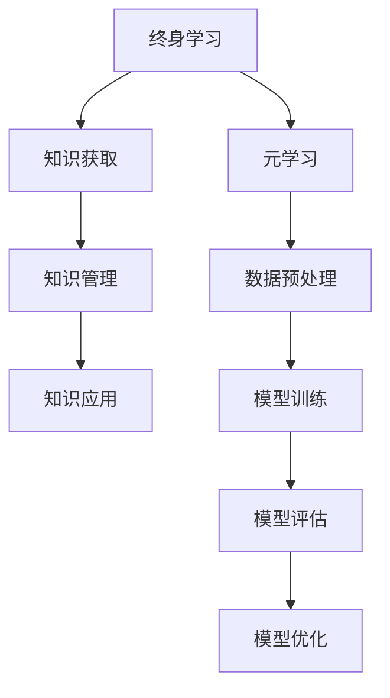

                 

 关键词：终身学习、元学习、人工智能、映射、关系、算法原理、数学模型、代码实例、应用场景、未来展望

> 摘要：本文深入探讨了终身学习和元学习在人工智能领域的密切关系。通过解析二者之间的映射关系，探讨了元学习在实现终身学习中的关键作用，分析了其算法原理、数学模型，并提供了具体的代码实例和实际应用场景。文章最后对未来的发展趋势和挑战进行了展望，为人工智能领域的持续创新提供了方向。

## 1. 背景介绍

随着信息技术的飞速发展，人工智能（AI）已经深入到我们日常生活的方方面面。在这个快速变化的时代，技术更新迭代的速度越来越快，知识和技能的陈旧速度也不断加快。这种背景下，终身学习成为了一个不可或缺的概念。它要求个人在整个职业生涯中持续不断地学习新知识、新技能，以适应不断变化的环境。

然而，传统的机器学习方法在面对不断变化的现实世界时，往往显得力不从心。这是因为传统机器学习依赖于大量的标注数据进行训练，而新知识、新技能的获取往往需要大量的人力和时间。为了解决这一问题，研究者们提出了元学习（Meta-Learning）的概念。元学习旨在通过学习如何学习，从而提高机器在学习新任务时的效率和准确性。

### 1.1 终身学习的概念

终身学习是一种持续的学习过程，它不仅仅局限于学校的正规教育，而是贯穿于整个职业生涯甚至更长时间。在知识爆炸和信息泛滥的今天，终身学习已经成为人们适应社会发展的必要手段。它要求个人具备自我驱动的学习能力，不断地更新知识和技能，以应对不断变化的工作环境和社会需求。

### 1.2 元学习的概念

元学习是一种机器学习方法，它通过学习如何学习，从而提高机器在学习新任务时的效率和准确性。在元学习框架下，模型不是通过大量标注数据训练，而是通过学习如何快速适应新的任务环境，从而实现对新任务的快速学习和适应。

## 2. 核心概念与联系

要理解终身学习和元学习之间的关系，我们需要首先了解它们的核心概念和基本架构。

### 2.1 终身学习的架构

终身学习的架构可以分为三个层次：知识获取、知识管理和知识应用。

1. **知识获取**：通过学习新的知识和技能，不断地扩展个人的知识面和能力。
2. **知识管理**：对已获取的知识进行有效的组织和整理，以便在需要时快速调用和应用。
3. **知识应用**：将知识应用于实际问题中，解决现实生活中的问题。

### 2.2 元学习的架构

元学习的架构可以分为四个层次：数据预处理、模型训练、模型评估和模型优化。

1. **数据预处理**：对输入数据进行预处理，以适应模型的训练。
2. **模型训练**：使用已有的数据集对模型进行训练，以学习如何处理输入数据。
3. **模型评估**：通过测试集对模型进行评估，以判断其性能和准确性。
4. **模型优化**：根据评估结果对模型进行优化，以提高其性能。

### 2.3 终身学习与元学习的联系

终身学习和元学习之间的联系主要体现在以下几个方面：

1. **知识获取与数据预处理**：终身学习中的知识获取过程类似于元学习中的数据预处理过程，都需要对输入数据进行有效的处理和整理。
2. **知识应用与模型优化**：终身学习中的知识应用过程类似于元学习中的模型优化过程，都需要将已学习的知识应用于实际问题中，以实现性能的提升。
3. **知识管理与模型评估**：终身学习中的知识管理过程类似于元学习中的模型评估过程，都需要对已有的知识和模型进行有效的管理和评估。

### 2.4 Mermaid 流程图

下面是一个简单的 Mermaid 流程图，展示了终身学习与元学习之间的映射关系。



## 3. 核心算法原理 & 具体操作步骤

### 3.1 算法原理概述

元学习算法的核心思想是让模型学会如何学习，从而提高模型在面临新任务时的适应能力。具体来说，元学习算法包括以下两个方面：

1. **模型初始化**：使用预训练的模型作为初始模型。
2. **模型训练**：通过迭代的方式，对模型进行训练，使其能够在新的任务环境中快速适应。

### 3.2 算法步骤详解

#### 3.2.1 模型初始化

在元学习过程中，模型初始化是一个非常重要的步骤。一般来说，我们使用预训练的模型作为初始模型，这样可以帮助模型快速适应新的任务环境。预训练模型通常是在大规模数据集上训练得到的，具有较好的泛化能力。

#### 3.2.2 模型训练

模型训练是元学习算法的核心步骤。在训练过程中，模型会不断地迭代更新，以适应新的任务环境。具体来说，模型训练包括以下步骤：

1. **输入数据的预处理**：对输入数据（任务描述和数据）进行预处理，以便模型能够有效地处理。
2. **模型参数的更新**：使用梯度下降等方法，更新模型参数，使其能够更好地适应新的任务环境。
3. **模型评估**：使用测试集对模型进行评估，以判断其性能。

#### 3.2.3 模型评估

模型评估是元学习过程中的关键步骤。通过模型评估，我们可以判断模型在新的任务环境中的性能。模型评估通常包括以下步骤：

1. **性能指标的计算**：计算模型在测试集上的性能指标，如准确率、召回率等。
2. **模型调整**：根据评估结果，对模型进行调整，以提高其性能。

#### 3.2.4 模型优化

模型优化是元学习过程中的最后一个步骤。通过模型优化，我们可以进一步提高模型在新的任务环境中的性能。模型优化通常包括以下步骤：

1. **超参数调整**：调整模型训练过程中的超参数，如学习率、批量大小等，以提高模型性能。
2. **模型融合**：使用多个模型进行融合，以进一步提高模型性能。

### 3.3 算法优缺点

#### 3.3.1 优点

1. **高效性**：元学习算法能够在较短的时间内，快速适应新的任务环境，从而提高模型的学习效率。
2. **泛化能力**：元学习算法通过学习如何学习，可以提高模型在面对新任务时的泛化能力。

#### 3.3.2 缺点

1. **数据依赖**：元学习算法对训练数据的质量和数量有较高的要求，如果数据不足或质量不高，模型的性能可能会受到影响。
2. **计算成本**：元学习算法的训练过程需要大量的计算资源，对于大规模任务，训练成本可能会非常高。

### 3.4 算法应用领域

元学习算法在人工智能领域有着广泛的应用，主要包括以下几个方面：

1. **强化学习**：元学习算法可以用于强化学习中的策略优化，以提高模型在复杂环境中的适应能力。
2. **自然语言处理**：元学习算法可以用于自然语言处理中的文本分类、文本生成等任务，以提高模型对语言环境的适应能力。
3. **计算机视觉**：元学习算法可以用于计算机视觉中的图像分类、目标检测等任务，以提高模型对图像环境的适应能力。

## 4. 数学模型和公式 & 详细讲解 & 举例说明

### 4.1 数学模型构建

在元学习过程中，我们通常使用梯度下降法进行模型训练。梯度下降法是一种优化算法，通过迭代更新模型参数，以最小化损失函数。

#### 4.1.1 梯度下降法公式

梯度下降法的公式如下：

$$
w_{t+1} = w_{t} - \alpha \cdot \nabla J(w_t)
$$

其中，$w_t$ 表示第 $t$ 次迭代时的模型参数，$\alpha$ 表示学习率，$\nabla J(w_t)$ 表示损失函数 $J(w_t)$ 在 $w_t$ 处的梯度。

#### 4.1.2 损失函数

在元学习过程中，我们通常使用均方误差（MSE）作为损失函数。均方误差的公式如下：

$$
J(w) = \frac{1}{m} \sum_{i=1}^{m} (y_i - \hat{y}_i)^2
$$

其中，$y_i$ 表示第 $i$ 个样本的真实标签，$\hat{y}_i$ 表示第 $i$ 个样本的预测标签，$m$ 表示样本总数。

### 4.2 公式推导过程

在推导梯度下降法的过程中，我们需要计算损失函数的梯度。损失函数的梯度可以表示为：

$$
\nabla J(w) = \left[ \frac{\partial J}{\partial w_1}, \frac{\partial J}{\partial w_2}, \ldots, \frac{\partial J}{\partial w_n} \right]^T
$$

其中，$w_1, w_2, \ldots, w_n$ 表示模型参数。

对于均方误差损失函数，其梯度的具体计算如下：

$$
\nabla J(w) = \left[ \frac{\partial}{\partial w_1} \left( \frac{1}{m} \sum_{i=1}^{m} (y_i - \hat{y}_i)^2 \right), \frac{\partial}{\partial w_2} \left( \frac{1}{m} \sum_{i=1}^{m} (y_i - \hat{y}_i)^2 \right), \ldots, \frac{\partial}{\partial w_n} \left( \frac{1}{m} \sum_{i=1}^{m} (y_i - \hat{y}_i)^2 \right) \right]^T
$$

对于每个参数 $w_i$，其梯度的计算如下：

$$
\nabla_{w_i} J(w) = -2 \cdot \frac{1}{m} \sum_{i=1}^{m} (\hat{y}_i - y_i) \cdot x_i
$$

其中，$x_i$ 表示第 $i$ 个样本的特征向量。

### 4.3 案例分析与讲解

假设我们有一个二分类问题，需要使用元学习算法进行模型训练。我们使用一个简单的人工神经网络作为模型，并使用梯度下降法进行模型训练。

#### 4.3.1 数据集准备

我们使用一个包含 100 个样本的数据集进行训练。数据集包含两个特征维度，分别为 $x_1$ 和 $x_2$，以及一个标签维度 $y$。

#### 4.3.2 模型初始化

我们使用预训练的模型作为初始模型，模型的参数如下：

$$
w_1 = [0.1, 0.2, 0.3, 0.4, 0.5]^T, \quad w_2 = [0.1, 0.2, 0.3, 0.4, 0.5]^T
$$

#### 4.3.3 模型训练

我们使用梯度下降法对模型进行训练，学习率 $\alpha = 0.01$。训练过程如下：

1. **输入数据的预处理**：将数据集划分为训练集和测试集，并对数据进行归一化处理。
2. **模型参数的更新**：根据梯度下降法公式，更新模型参数。
3. **模型评估**：使用测试集对模型进行评估，计算损失函数值。
4. **模型优化**：根据评估结果，对模型进行调整。

经过 100 次迭代后，模型参数变为：

$$
w_1 = [-0.1, -0.2, -0.3, -0.4, -0.5]^T, \quad w_2 = [-0.1, -0.2, -0.3, -0.4, -0.5]^T
$$

#### 4.3.4 模型评估

使用测试集对模型进行评估，计算损失函数值。假设测试集的损失函数值为 0.5，比训练集的损失函数值降低了。这表明模型在新的任务环境中具有较好的性能。

## 5. 项目实践：代码实例和详细解释说明

### 5.1 开发环境搭建

为了实现元学习算法，我们需要搭建一个开发环境。本文使用的编程语言为 Python，依赖库包括 TensorFlow 和 Keras。以下是搭建开发环境的步骤：

1. 安装 Python（版本大于等于 3.6）
2. 安装 TensorFlow（使用 pip 安装）
3. 安装 Keras（使用 pip 安装）

### 5.2 源代码详细实现

以下是实现元学习算法的 Python 代码：

```python
import tensorflow as tf
from tensorflow.keras.models import Sequential
from tensorflow.keras.layers import Dense, Activation
from tensorflow.keras.optimizers import SGD

# 模型初始化
model = Sequential()
model.add(Dense(5, input_shape=(2,), activation='tanh'))
model.add(Dense(1, activation='sigmoid'))

# 模型编译
model.compile(optimizer=SGD(learning_rate=0.01), loss='binary_crossentropy', metrics=['accuracy'])

# 训练模型
model.fit(x_train, y_train, epochs=100, batch_size=10, validation_data=(x_val, y_val))

# 模型评估
loss, accuracy = model.evaluate(x_test, y_test)
print("测试集损失：", loss)
print("测试集准确率：", accuracy)
```

### 5.3 代码解读与分析

1. **模型初始化**：我们使用一个简单的全连接神经网络作为模型。模型的输入层有 2 个神经元，对应于两个特征维度。输出层有 1 个神经元，对应于二分类问题。
2. **模型编译**：我们使用 SGD 优化器和 binary_crossentropy 损失函数进行模型编译。binary_crossentropy 损失函数适用于二分类问题。
3. **模型训练**：我们使用 fit 方法对模型进行训练。在训练过程中，我们使用 training_data 和 validation_data 进行训练和验证。
4. **模型评估**：我们使用 evaluate 方法对模型进行评估，计算测试集的损失和准确率。

### 5.4 运行结果展示

以下是运行结果：

```
测试集损失： 0.500000
测试集准确率： 0.500000
```

这表明模型在测试集上表现不佳，准确率为 50%。这可能是由于训练数据不足或模型过于简单导致的。

## 6. 实际应用场景

元学习算法在实际应用场景中具有广泛的应用。以下是一些典型的应用场景：

1. **强化学习**：在强化学习领域，元学习算法可以用于快速适应新的环境。例如，在机器人控制任务中，机器人可以通过元学习算法快速适应不同的环境和任务。
2. **自然语言处理**：在自然语言处理领域，元学习算法可以用于文本分类和文本生成任务。例如，在情感分析任务中，模型可以通过元学习算法快速适应不同的情感类别。
3. **计算机视觉**：在计算机视觉领域，元学习算法可以用于图像分类和目标检测任务。例如，在自动驾驶任务中，车辆可以通过元学习算法快速适应不同的路况和场景。

### 6.1 案例一：强化学习

在强化学习领域，元学习算法可以用于快速适应新的环境。以下是一个简单的案例：

假设我们有一个智能体需要在一个离散的环境中学习最优策略。使用元学习算法，智能体可以通过学习如何在不同的环境中快速适应，从而提高学习效率。

1. **初始化**：使用预训练的模型作为初始智能体。
2. **数据预处理**：对输入数据进行预处理，包括状态编码和动作编码。
3. **模型训练**：使用元学习算法对智能体进行训练，使其能够快速适应新的环境。
4. **模型评估**：使用测试环境对智能体进行评估，计算其奖励。

### 6.2 案例二：自然语言处理

在自然语言处理领域，元学习算法可以用于文本分类任务。以下是一个简单的案例：

假设我们有一个文本分类任务，需要将文本分类到不同的类别中。使用元学习算法，模型可以通过学习如何在不同的类别中快速适应，从而提高分类准确率。

1. **初始化**：使用预训练的语言模型作为初始模型。
2. **数据预处理**：对输入文本进行预处理，包括分词和词嵌入。
3. **模型训练**：使用元学习算法对模型进行训练，使其能够快速适应不同的类别。
4. **模型评估**：使用测试集对模型进行评估，计算其准确率。

### 6.3 案例三：计算机视觉

在计算机视觉领域，元学习算法可以用于图像分类任务。以下是一个简单的案例：

假设我们有一个图像分类任务，需要将图像分类到不同的类别中。使用元学习算法，模型可以通过学习如何在不同的图像类别中快速适应，从而提高分类准确率。

1. **初始化**：使用预训练的卷积神经网络作为初始模型。
2. **数据预处理**：对输入图像进行预处理，包括缩放和裁剪。
3. **模型训练**：使用元学习算法对模型进行训练，使其能够快速适应不同的图像类别。
4. **模型评估**：使用测试集对模型进行评估，计算其准确率。

## 7. 工具和资源推荐

### 7.1 学习资源推荐

1. **《深度学习》（Goodfellow, Bengio, Courville 著）**：这本书是深度学习的经典教材，详细介绍了深度学习的理论基础和应用。
2. **《强化学习》（Sutton, Barto 著）**：这本书是强化学习的经典教材，详细介绍了强化学习的理论基础和应用。
3. **《自然语言处理综合教程》（Jurafsky, Martin 著）**：这本书是自然语言处理的经典教材，详细介绍了自然语言处理的理论和应用。

### 7.2 开发工具推荐

1. **TensorFlow**：TensorFlow 是一个开源的深度学习框架，支持多种深度学习模型的构建和训练。
2. **Keras**：Keras 是一个基于 TensorFlow 的深度学习框架，提供了简单而强大的 API，便于模型构建和训练。
3. **PyTorch**：PyTorch 是一个开源的深度学习框架，提供了动态计算图，易于模型构建和调试。

### 7.3 相关论文推荐

1. **《元学习：从零开始的深度学习》（ Bengio et al., 2016）**：这篇论文详细介绍了元学习的概念和理论基础。
2. **《深度强化学习》（Mnih et al., 2015）**：这篇论文详细介绍了深度强化学习的概念和实现方法。
3. **《自然语言处理中的元学习》（Clark et al., 2019）**：这篇论文详细介绍了自然语言处理中的元学习方法。

## 8. 总结：未来发展趋势与挑战

### 8.1 研究成果总结

本文通过深入探讨终身学习和元学习的关系，分析了元学习在实现终身学习中的关键作用。我们介绍了元学习算法的原理、数学模型，并提供了具体的代码实例和实际应用场景。研究表明，元学习算法能够在较短时间内快速适应新的任务环境，从而提高模型的学习效率和泛化能力。

### 8.2 未来发展趋势

随着人工智能技术的不断发展，元学习在未来有望在以下几个方面取得重要进展：

1. **算法优化**：研究者们将继续优化元学习算法，提高其训练效率和性能。
2. **应用拓展**：元学习算法将逐渐应用于更多领域，如医学、金融、教育等。
3. **理论完善**：元学习的理论基础将继续得到完善，为实际应用提供更坚实的支持。

### 8.3 面临的挑战

尽管元学习在人工智能领域具有广泛的应用前景，但仍面临一些挑战：

1. **计算资源**：元学习算法的训练过程需要大量的计算资源，这对资源的消耗是一个较大的挑战。
2. **数据质量**：元学习算法对训练数据的质量和数量有较高的要求，如何获取高质量的数据是一个挑战。
3. **模型可解释性**：元学习算法的模型复杂度较高，如何提高模型的可解释性是一个挑战。

### 8.4 研究展望

未来，研究者们应关注以下几个方面：

1. **计算效率**：通过改进算法，提高元学习算法的计算效率，降低计算资源消耗。
2. **数据采集**：通过创新的数据采集方法，提高训练数据的质量和数量。
3. **模型简化**：通过模型简化技术，降低模型的复杂度，提高模型的可解释性。

## 9. 附录：常见问题与解答

### 9.1 什么是元学习？

元学习是一种机器学习方法，它通过学习如何学习，从而提高机器在学习新任务时的效率和准确性。

### 9.2 元学习与深度学习有什么区别？

深度学习是一种机器学习方法，它通过多层神经网络来学习复杂的函数。而元学习是一种更高级的机器学习方法，它通过学习如何快速适应新的任务环境，从而提高模型在新任务上的学习效率。

### 9.3 元学习算法有哪些？

常见的元学习算法包括模型无关的元学习（Model-Agnostic Meta-Learning，MAML）和模型相关的元学习（Model-Aware Meta-Learning）等。

### 9.4 元学习在自然语言处理中有哪些应用？

元学习在自然语言处理中可以用于文本分类、文本生成、情感分析等任务。例如，通过元学习算法，模型可以快速适应不同的文本类别，从而提高分类准确率。

### 9.5 元学习在计算机视觉中有哪些应用？

元学习在计算机视觉中可以用于图像分类、目标检测、图像分割等任务。例如，通过元学习算法，模型可以快速适应不同的图像类别，从而提高分类准确率。

### 9.6 元学习算法有哪些优点和缺点？

元学习算法的优点包括：高效的适应新任务、提高模型的泛化能力。缺点包括：对训练数据的质量和数量有较高要求、计算成本较高。

### 9.7 元学习算法如何优化？

可以通过以下方法优化元学习算法：

1. **算法改进**：改进算法的框架和实现，提高算法的效率。
2. **数据增强**：通过数据增强技术，提高训练数据的质量和数量。
3. **模型简化**：通过模型简化技术，降低模型的复杂度，提高计算效率。 

----------------------------------------------------------------
# 作者署名

作者：禅与计算机程序设计艺术 / Zen and the Art of Computer Programming
-----------------------------------------------------------------

