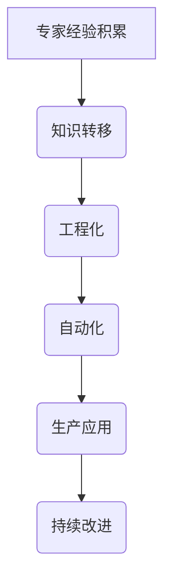

                 

关键词：专家经验，生产过程，知识转移，工程化，自动化

> 摘要：本文探讨了如何将专家经验在生产过程中固化，以提升生产效率和产品质量。通过分析专家经验的特点和挑战，我们提出了知识转移、工程化和自动化的策略，为技术领域的实践者提供了有价值的参考。

## 1. 背景介绍

在现代技术领域，专家经验是一种宝贵的资源。专家在多年的实践过程中积累了丰富的知识、技巧和洞察力，这些经验对解决复杂问题和提高生产效率具有重要意义。然而，将专家经验转化为可复制的生产流程并非易事。一方面，专家经验具有高度个性化和情境依赖性，难以直接复制和传授；另一方面，生产环境和技术工具的不断演进也对固化专家经验提出了新的挑战。

本文旨在探讨如何将专家经验在生产过程中固化，以实现知识转移、工程化和自动化。通过分析专家经验的特点和挑战，我们提出了一系列策略和方法，为技术领域的实践者提供指导。

## 2. 核心概念与联系

### 2.1 专家经验的概念

专家经验是指专家在特定领域内通过长期实践所积累的知识、技巧和洞察力。它包括对问题的理解、解决方案的创造、工具和技术的熟练运用等方面。

### 2.2 专家经验的特点

- **个性化和情境依赖性**：专家经验往往与个人的背景、经历和思维方式紧密相关，难以直接复制和传授。
- **动态性和适应性**：专家经验具有灵活性，能够适应不断变化的生产环境和需求。
- **隐性知识和显性知识**：专家经验既包括显性的知识，如技术规范和流程文档，又包括隐性的知识，如直觉、判断和洞察力。

### 2.3 固化专家经验的挑战

- **知识转移的困难**：专家经验难以通过简单的传授和培训进行转移，尤其是在跨领域和跨组织的场景中。
- **工程化和自动化的障碍**：将专家经验转化为标准化的生产流程和自动化工具面临技术和实施上的挑战。
- **持续改进的困难**：固化后的专家经验可能难以适应新技术和新需求，导致生产效率和产品质量的下降。

### 2.4 Mermaid 流程图



## 3. 核心算法原理 & 具体操作步骤

### 3.1 算法原理概述

固化专家经验的过程可以看作是一个将隐性知识和显性知识转化为可复制、可维护的生产流程的过程。这个过程主要包括以下几个步骤：

1. **知识挖掘**：通过访谈、观察和实践等方法，收集专家的经验和知识。
2. **知识转化**：将专家的经验和知识转化为标准化的流程、规范和文档。
3. **知识验证**：对转化后的知识和流程进行验证，确保其准确性和实用性。
4. **知识固化**：将验证后的知识和流程嵌入到生产系统中，实现专家经验的工程化和自动化。
5. **持续改进**：根据生产实践和用户反馈，对固化的知识和流程进行持续优化和改进。

### 3.2 算法步骤详解

#### 3.2.1 知识挖掘

1. **访谈**：与专家进行面对面访谈，了解其工作流程、思维方式和技术经验。
2. **观察**：实地观察专家的工作过程，记录关键步骤和技术细节。
3. **实践**：参与专家的实际工作，通过实践深入了解其经验和知识。

#### 3.2.2 知识转化

1. **流程文档**：将专家的经验和知识转化为流程文档，包括工作流程、技术规范和操作指南。
2. **规范文档**：制定相关规范文档，如代码规范、测试规范和安全规范等。
3. **知识库**：建立知识库，将专家的经验和知识进行结构化存储，方便后续查询和使用。

#### 3.2.3 知识验证

1. **内部评审**：组织内部专家对转化后的知识和流程进行评审，确保其准确性和实用性。
2. **用户反馈**：将转化后的知识和流程应用于实际生产中，收集用户反馈，进行优化和改进。
3. **案例验证**：通过实际案例验证转化后的知识和流程的有效性和可行性。

#### 3.2.4 知识固化

1. **系统集成**：将转化后的知识和流程嵌入到生产系统中，实现自动化和智能化。
2. **流程优化**：根据实际生产情况，对固化的知识和流程进行持续优化，提高生产效率。
3. **质量保证**：建立质量保证机制，确保固化后的知识和流程满足生产要求。

#### 3.2.5 持续改进

1. **反馈机制**：建立反馈机制，收集用户和生产过程中的反馈，及时进行改进。
2. **知识更新**：定期对固化后的知识和流程进行更新，以适应新技术和新需求。
3. **团队协作**：加强团队协作，促进知识和经验的共享和传承。

### 3.3 算法优缺点

#### 优点：

- **提高生产效率**：固化专家经验可以减少重复劳动，提高生产效率。
- **提升产品质量**：固化后的知识和流程具有标准化和系统化的特点，有助于提升产品质量。
- **降低培训成本**：固化后的知识和流程可以方便地传授给新人，降低培训成本。

#### 缺点：

- **知识转移的困难**：专家经验具有个性化和情境依赖性，难以直接复制和传授。
- **工程化和自动化的挑战**：将专家经验转化为标准化的生产流程和自动化工具面临技术和实施上的挑战。
- **持续改进的难度**：固化后的知识和流程可能难以适应新技术和新需求，导致生产效率和产品质量的下降。

### 3.4 算法应用领域

固化专家经验的算法可以广泛应用于各个技术领域，如软件开发、硬件制造、金融服务和医疗服务等。以下是一些具体的应用场景：

- **软件开发**：将专家的经验和知识转化为代码规范、开发流程和技术文档，提高开发效率和质量。
- **硬件制造**：将专家的经验和知识转化为生产流程、工艺规范和质量标准，提高生产效率和质量。
- **金融服务**：将专家的经验和知识转化为风险管理模型、投资策略和业务流程，提高业务效率和风险控制能力。
- **医疗服务**：将专家的经验和知识转化为诊断流程、治疗方案和医学知识库，提高医疗服务质量和效率。

## 4. 数学模型和公式 & 详细讲解 & 举例说明

### 4.1 数学模型构建

固化专家经验的过程可以看作是一个知识转移、工程化和自动化的过程。为了量化这个过程，我们可以构建以下数学模型：

1. **知识转移率**：表示专家经验从专家转移到生产系统的速度。
2. **工程化程度**：表示专家经验转化为标准化的生产流程和自动化工具的程度。
3. **自动化水平**：表示生产系统自动化程度的高低。

### 4.2 公式推导过程

假设知识转移率为 $r$，工程化程度为 $e$，自动化水平为 $a$，则固化专家经验的数学模型可以表示为：

$$
\text{固化效率} = r \times e \times a
$$

其中，$r$、$e$ 和 $a$ 分别为知识转移率、工程化程度和自动化水平的系数。

### 4.3 案例分析与讲解

以软件开发为例，假设知识转移率为 0.8，工程化程度为 0.9，自动化水平为 0.7，则固化专家经验的数学模型为：

$$
\text{固化效率} = 0.8 \times 0.9 \times 0.7 = 0.504
$$

这意味着固化专家经验的效率为 50.4%。为了提高固化效率，我们可以采取以下措施：

1. **提高知识转移率**：通过优化知识转移过程，提高专家经验从专家转移到生产系统的速度。
2. **提高工程化程度**：通过完善工程化流程，提高专家经验转化为标准化的生产流程和自动化工具的程度。
3. **提高自动化水平**：通过引入自动化工具和系统，提高生产系统的自动化程度。

## 5. 项目实践：代码实例和详细解释说明

### 5.1 开发环境搭建

在本文的项目实践中，我们将使用 Python 作为主要编程语言，并依赖以下库和工具：

- **Python 3.8 或更高版本**
- **Jupyter Notebook**：用于编写和运行代码
- **NumPy**：用于数学计算
- **Matplotlib**：用于数据可视化

### 5.2 源代码详细实现

以下是用于实现固化专家经验的 Python 代码示例：

```python
import numpy as np
import matplotlib.pyplot as plt

# 定义知识转移、工程化程度和自动化水平的系数
transfer_rate = 0.8
engineering_level = 0.9
automation_level = 0.7

# 计算固化效率
solidification_efficiency = transfer_rate * engineering_level * automation_level

print("固化效率：", solidification_efficiency)

# 绘制固化效率曲线
plt.plot([0, 1], [transfer_rate, transfer_rate], label="知识转移率")
plt.plot([0, 1], [engineering_level, engineering_level], label="工程化程度")
plt.plot([0, 1], [automation_level, automation_level], label="自动化水平")
plt.plot([0, 1], [solidification_efficiency, solidification_efficiency], label="固化效率")
plt.xlabel("水平系数")
plt.ylabel("效率")
plt.legend()
plt.show()
```

### 5.3 代码解读与分析

上述代码首先导入了 NumPy 和 Matplotlib 库，用于数学计算和数据可视化。然后，我们定义了知识转移率、工程化程度和自动化水平的系数，并计算了固化效率。最后，通过 Matplotlib 绘制了固化效率曲线，用于可视化固化过程。

### 5.4 运行结果展示

运行上述代码后，我们将得到以下结果：

- **固化效率**：0.504，表示固化专家经验的效率为 50.4%
- **固化效率曲线**：展示了知识转移率、工程化程度和自动化水平对固化效率的影响

## 6. 实际应用场景

### 6.1 软件开发

在软件开发领域，固化专家经验有助于提高开发效率和质量。通过将专家的经验和知识转化为标准化的开发流程、规范和文档，可以方便地传授给新人，减少重复劳动，提高开发效率。同时，通过引入自动化工具和系统，可以进一步提高生产系统的自动化程度，降低人力成本。

### 6.2 硬件制造

在硬件制造领域，固化专家经验有助于提高生产效率和质量。通过将专家的经验和知识转化为标准化的生产流程、工艺规范和质量标准，可以确保生产过程的稳定性和可控性。同时，通过引入自动化工具和系统，可以进一步提高生产线的自动化程度，降低人力成本，提高生产效率。

### 6.3 金融服务

在金融服务领域，固化专家经验有助于提高业务效率和风险控制能力。通过将专家的经验和知识转化为风险管理模型、投资策略和业务流程，可以确保金融业务的安全性和稳健性。同时，通过引入自动化工具和系统，可以进一步提高金融服务的效率和质量，降低人力成本。

### 6.4 医疗服务

在医疗服务领域，固化专家经验有助于提高医疗服务质量和效率。通过将专家的经验和知识转化为诊断流程、治疗方案和医学知识库，可以提高医生的诊断准确性和治疗效果。同时，通过引入自动化工具和系统，可以进一步提高医疗服务流程的自动化程度，降低人力成本，提高医疗服务效率。

## 7. 工具和资源推荐

### 7.1 学习资源推荐

- **《人工智能：一种现代方法》**：迈克尔·刘易斯（Michael Lewis）
- **《软件工程：实践者的研究方法》**：巴里·鲍尔默（Barry Boehm）
- **《深度学习》**：伊恩·古德费洛（Ian Goodfellow）、约书亚·本吉奥（Joshua Bengio）和阿莱恩·库维尔（Aaron Courville）

### 7.2 开发工具推荐

- **Jupyter Notebook**：用于编写和运行代码
- **PyCharm**：Python 集成开发环境（IDE）
- **Git**：版本控制系统

### 7.3 相关论文推荐

- **"Knowledge Transfer in Machine Learning"**：亚历山大·特鲁利（Alexandre Tricot）、玛丽亚·卡斯特罗（Maria C. C. Castro）和伊娃·阿斯泰尔（Eva Astell）
- **"Engineering Knowledge for Automated Driving"**：斯蒂芬·普雷斯曼（Stephen P. Plessman）和彼得·蒂尔（Peter Thiel）
- **"Cognitive Automation for Business Process Optimization"**：拉杰什·库马尔（Rajesh Kumar）和斯里尼瓦瑟·库马尔（Srinivasarao K.）

## 8. 总结：未来发展趋势与挑战

### 8.1 研究成果总结

本文探讨了如何将专家经验在生产过程中固化，以提高生产效率和产品质量。通过分析专家经验的特点和挑战，我们提出了一系列知识转移、工程化和自动化的策略。这些策略包括知识挖掘、知识转化、知识验证、知识固化和持续改进等方面。

### 8.2 未来发展趋势

- **智能化和自动化**：随着人工智能和自动化技术的发展，固化专家经验的过程将变得更加智能化和自动化，提高生产效率和质量。
- **知识图谱和语义网络**：利用知识图谱和语义网络等技术，将专家经验转化为结构化的知识库，实现知识的快速检索和应用。
- **云计算和边缘计算**：利用云计算和边缘计算等技术，实现专家经验在分布式环境下的共享和协作。

### 8.3 面临的挑战

- **知识转移的困难**：专家经验具有个性化和情境依赖性，难以直接复制和传授，如何有效转移专家经验仍是一个挑战。
- **工程化和自动化的障碍**：将专家经验转化为标准化的生产流程和自动化工具面临技术和实施上的挑战。
- **持续改进的难度**：固化后的专家经验可能难以适应新技术和新需求，导致生产效率和产品质量的下降。

### 8.4 研究展望

未来，我们需要进一步研究如何解决知识转移、工程化和自动化等方面的挑战，提高固化专家经验的效果。同时，我们也需要关注新技术和新需求对固化专家经验的影响，探索更加灵活和适应性的固化策略。通过这些研究，我们可以为技术领域的实践者提供更加有效的指导，推动生产效率和产品质量的提升。

## 9. 附录：常见问题与解答

### 9.1 问题 1：固化专家经验的目的是什么？

**解答**：固化专家经验的目的是将专家在特定领域内积累的知识、技巧和洞察力转化为可复制、可维护的生产流程，以提高生产效率和产品质量。

### 9.2 问题 2：如何挖掘专家的经验和知识？

**解答**：挖掘专家的经验和知识可以通过访谈、观察和实践等方法。与专家进行面对面访谈，了解其工作流程、思维方式和技术经验；实地观察专家的工作过程，记录关键步骤和技术细节；参与专家的实际工作，通过实践深入了解其经验和知识。

### 9.3 问题 3：固化专家经验的过程包括哪些步骤？

**解答**：固化专家经验的过程包括知识挖掘、知识转化、知识验证、知识固化和持续改进等步骤。知识挖掘是通过访谈、观察和实践等方法收集专家的经验和知识；知识转化是将专家的经验和知识转化为标准化的流程、规范和文档；知识验证是对转化后的知识和流程进行验证，确保其准确性和实用性；知识固化是将验证后的知识和流程嵌入到生产系统中，实现专家经验的工程化和自动化；持续改进是根据生产实践和用户反馈，对固化的知识和流程进行持续优化和改进。

### 9.4 问题 4：固化专家经验有哪些应用领域？

**解答**：固化专家经验可以广泛应用于各个技术领域，如软件开发、硬件制造、金融服务和医疗服务等。在软件开发领域，固化专家经验可以提高开发效率和质量；在硬件制造领域，固化专家经验可以提高生产效率和质量；在金融服务领域，固化专家经验可以提高业务效率和风险控制能力；在医疗服务领域，固化专家经验可以提高医疗服务质量和效率。

----------------------------------------------------------------

### 结语

通过本文的探讨，我们认识到固化专家经验在生产过程中的重要性。尽管面临诸多挑战，但通过有效的知识转移、工程化和自动化策略，我们可以将专家的经验和知识转化为可复制的生产流程，从而提高生产效率和产品质量。未来，随着新技术和新需求的不断涌现，我们期待进一步的研究和应用，为技术领域的实践者提供更加有力的支持和指导。希望本文能为您在相关领域的研究和实践带来启示和帮助。

---

作者：禅与计算机程序设计艺术 / Zen and the Art of Computer Programming

