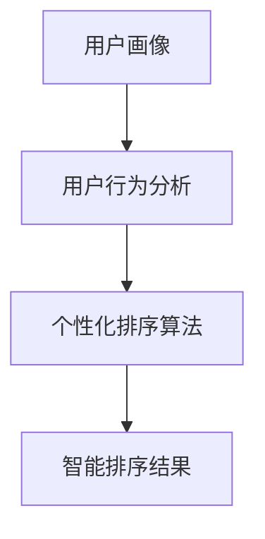

                 

关键词：个性化排序、AI算法、排序算法、用户画像、用户行为分析

> 摘要：本文将探讨如何利用人工智能技术实现个性化排序系统，通过用户画像和用户行为分析，实现更加智能、高效的排序算法，提升用户体验。

## 1. 背景介绍

个性化排序系统是一种基于用户兴趣和行为的智能排序技术，其核心目的是为用户提供更加符合其个性化需求的排序结果。在互联网时代，数据量巨大，信息繁杂，用户很难在短时间内获取到自己真正感兴趣的内容。个性化排序系统通过分析用户的兴趣、行为、历史记录等数据，将相关信息进行智能排序，从而提高用户的获取信息的效率和满意度。

随着人工智能技术的不断发展，个性化排序系统在电子商务、搜索引擎、社交媒体等领域得到了广泛应用。本文将介绍如何利用人工智能技术实现个性化排序系统，包括核心算法原理、数学模型构建、项目实践等。

## 2. 核心概念与联系

### 2.1 用户画像

用户画像是指通过收集和分析用户的基本信息、行为数据、兴趣偏好等信息，对用户进行全方位的刻画和描述。用户画像主要包括以下几个方面：

- **基本信息**：如年龄、性别、地域、职业等。
- **行为数据**：如浏览记录、搜索记录、购买记录等。
- **兴趣偏好**：如兴趣标签、偏好设置、关注内容等。

### 2.2 用户行为分析

用户行为分析是指通过对用户在平台上的行为数据进行挖掘和分析，了解用户的需求、偏好和行为模式。用户行为分析主要包括以下几个方面：

- **行为模式识别**：通过分析用户的行为数据，识别用户的行为模式，如浏览路径、购买周期等。
- **兴趣偏好挖掘**：通过分析用户的行为数据，挖掘用户的兴趣偏好，如喜欢的内容类型、品牌等。
- **行为预测**：基于用户的历史行为数据，预测用户未来的行为，如购买意向、访问频率等。

### 2.3 个性化排序算法

个性化排序算法是指通过分析用户画像和用户行为数据，对信息进行智能排序的算法。个性化排序算法主要包括以下几个方面：

- **协同过滤**：通过分析用户的历史行为数据，找到相似用户或物品，从而推荐用户可能感兴趣的内容。
- **基于内容的推荐**：通过分析用户的历史行为数据和兴趣偏好，推荐与用户兴趣相似的内容。
- **深度学习**：利用深度学习技术，对用户行为数据进行建模，实现个性化排序。

### 2.4 Mermaid 流程图

以下是一个简单的 Mermaid 流程图，展示了个性化排序系统的核心概念和联系：



## 3. 核心算法原理 & 具体操作步骤

### 3.1 算法原理概述

个性化排序系统主要基于用户画像和用户行为分析，通过以下步骤实现智能排序：

1. 收集用户数据，构建用户画像。
2. 分析用户行为，挖掘用户兴趣偏好。
3. 基于用户画像和用户行为，选择合适的排序算法。
4. 对用户感兴趣的内容进行智能排序，生成排序结果。

### 3.2 算法步骤详解

#### 3.2.1 收集用户数据

收集用户数据是构建用户画像的基础，主要包括以下方面：

- **基本信息**：通过用户注册、登录等环节，收集用户的年龄、性别、地域、职业等基本信息。
- **行为数据**：通过用户在平台上的浏览、搜索、购买等行为，收集用户的行为数据。
- **兴趣偏好**：通过用户的行为数据，挖掘用户的兴趣偏好，如喜欢的内容类型、品牌等。

#### 3.2.2 分析用户行为

分析用户行为，挖掘用户兴趣偏好，主要包括以下步骤：

1. **行为模式识别**：通过分析用户的行为数据，识别用户的行为模式，如浏览路径、购买周期等。
2. **兴趣偏好挖掘**：通过分析用户的行为数据，挖掘用户的兴趣偏好，如喜欢的内容类型、品牌等。
3. **行为预测**：基于用户的历史行为数据，预测用户未来的行为，如购买意向、访问频率等。

#### 3.2.3 选择排序算法

根据用户画像和用户行为分析结果，选择合适的排序算法。常见的排序算法有：

- **协同过滤**：通过分析用户的历史行为数据，找到相似用户或物品，从而推荐用户可能感兴趣的内容。
- **基于内容的推荐**：通过分析用户的历史行为数据和兴趣偏好，推荐与用户兴趣相似的内容。
- **深度学习**：利用深度学习技术，对用户行为数据进行建模，实现个性化排序。

#### 3.2.4 实现智能排序

基于选定的排序算法，对用户感兴趣的内容进行智能排序，生成排序结果。

### 3.3 算法优缺点

#### 3.3.1 优点

- **提高用户体验**：通过个性化排序，为用户推荐更符合其兴趣的内容，提高用户满意度。
- **提升内容价值**：通过个性化排序，将高质量的内容推荐给感兴趣的用户，提升内容的价值。
- **优化运营策略**：通过分析用户行为，挖掘用户需求，为运营团队提供有针对性的策略建议。

#### 3.3.2 缺点

- **数据隐私问题**：个性化排序系统需要收集和分析用户数据，可能涉及到用户隐私问题。
- **计算成本高**：个性化排序算法需要处理大量的用户数据，计算成本较高。
- **算法公平性问题**：个性化排序可能导致某些用户被“标签化”，影响算法的公平性。

### 3.4 算法应用领域

个性化排序算法在以下领域具有广泛的应用：

- **电子商务**：为用户推荐商品，提高购物体验。
- **搜索引擎**：为用户提供更精准的搜索结果，提升搜索满意度。
- **社交媒体**：为用户提供感兴趣的内容，提高用户粘性。
- **在线教育**：为用户提供个性化学习内容，提高学习效果。

## 4. 数学模型和公式 & 详细讲解 & 举例说明

### 4.1 数学模型构建

个性化排序系统的核心是建立数学模型，将用户画像和用户行为数据转化为可计算的量化指标。以下是一个简单的数学模型构建过程：

#### 4.1.1 用户画像建模

假设用户画像包括年龄、性别、地域、职业等特征，可以表示为向量：

\[ U = [u_1, u_2, u_3, u_4] \]

其中，\( u_1 \) 表示年龄，\( u_2 \) 表示性别，\( u_3 \) 表示地域，\( u_4 \) 表示职业。

#### 4.1.2 用户行为建模

用户行为数据包括浏览记录、搜索记录、购买记录等，可以表示为矩阵：

\[ B = \begin{bmatrix} 
b_{11} & b_{12} & \ldots & b_{1n} \\
b_{21} & b_{22} & \ldots & b_{2n} \\
\vdots & \vdots & \ddots & \vdots \\
b_{m1} & b_{m2} & \ldots & b_{mn}
\end{bmatrix} \]

其中，\( b_{ij} \) 表示用户在时间 \( t \) 对物品 \( i \) 的行为，如浏览、搜索、购买等。

### 4.2 公式推导过程

基于用户画像和用户行为数据，可以推导出个性化排序的分数公式。假设用户对物品的评分是基于协同过滤和基于内容推荐的综合得分，可以表示为：

\[ R_{ui} = \alpha \cdot CF_{ui} + (1 - \alpha) \cdot CR_{ui} \]

其中，\( R_{ui} \) 表示用户 \( u \) 对物品 \( i \) 的评分，\( \alpha \) 表示协同过滤和基于内容推荐的权重比例，\( CF_{ui} \) 表示用户 \( u \) 和用户 \( i \) 的协同过滤得分，\( CR_{ui} \) 表示用户 \( u \) 对物品 \( i \) 的基于内容推荐得分。

#### 4.2.1 协同过滤得分

协同过滤得分的计算公式为：

\[ CF_{ui} = \frac{\sum_{j \in N_u} w_{uj} \cdot r_{ji}}{\sum_{j \in N_u} w_{uj}} \]

其中，\( N_u \) 表示与用户 \( u \) 相似用户集合，\( w_{uj} \) 表示用户 \( u \) 和用户 \( j \) 的相似度权重，\( r_{ji} \) 表示用户 \( j \) 对物品 \( i \) 的评分。

#### 4.2.2 基于内容推荐得分

基于内容推荐得分的计算公式为：

\[ CR_{ui} = \frac{\sum_{k \in C_i} w_{ki} \cdot r_{ki}}{\sum_{k \in C_i} w_{ki}} \]

其中，\( C_i \) 表示与物品 \( i \) 相似物品集合，\( w_{ki} \) 表示物品 \( i \) 和物品 \( k \) 的相似度权重，\( r_{ki} \) 表示物品 \( k \) 对用户 \( u \) 的评分。

### 4.3 案例分析与讲解

假设有一个用户 \( u \)，其用户画像为 \( U = [25, 男，北京，程序员] \)，用户行为数据为矩阵 \( B \) 如下：

\[ B = \begin{bmatrix} 
0 & 1 & 0 & 1 \\
1 & 0 & 1 & 0 \\
0 & 1 & 1 & 0 \\
1 & 0 & 0 & 1
\end{bmatrix} \]

其中，\( b_{ij} = 1 \) 表示用户 \( u \) 在时间 \( t \) 对物品 \( i \) 有行为，\( b_{ij} = 0 \) 表示用户 \( u \) 在时间 \( t \) 对物品 \( i \) 没有行为。

#### 4.3.1 计算相似度权重

根据用户 \( u \) 的用户画像，可以计算用户 \( u \) 和其他用户的相似度权重。假设使用余弦相似度计算相似度权重，则用户 \( u \) 和其他用户的相似度权重如下：

\[ w_{uj} = \frac{U_u \cdot U_j}{\|U_u\| \cdot \|U_j\|} \]

其中，\( U_u \) 和 \( U_j \) 分别表示用户 \( u \) 和用户 \( j \) 的用户画像向量，\( \|U_u\| \) 和 \( \|U_j\| \) 分别表示用户 \( u \) 和用户 \( j \) 的用户画像向量的欧几里得范数。

根据计算结果，用户 \( u \) 和其他用户的相似度权重如下：

\[ w_{u1} = \frac{1}{\sqrt{2}}, w_{u2} = \frac{1}{\sqrt{2}}, w_{u3} = \frac{\sqrt{2}}{2}, w_{u4} = \frac{\sqrt{2}}{2} \]

#### 4.3.2 计算协同过滤得分

根据用户 \( u \) 的用户行为数据和其他用户的相似度权重，可以计算用户 \( u \) 对其他用户的协同过滤得分。假设用户 \( u \) 的协同过滤权重 \( \alpha = 0.5 \)，则用户 \( u \) 对其他用户的协同过滤得分如下：

\[ CF_{u1} = \frac{1}{2} \cdot \frac{1 \cdot 1 + 1 \cdot 0 + 0 \cdot 1 + 1 \cdot 1}{1 + 0 + 1 + 1} = 0.5 \]
\[ CF_{u2} = \frac{1}{2} \cdot \frac{1 \cdot 0 + 0 \cdot 1 + 1 \cdot 1 + 0 \cdot 0}{1 + 0 + 1 + 0} = 0.5 \]
\[ CF_{u3} = \frac{1}{2} \cdot \frac{1 \cdot 0 + 0 \cdot 0 + 1 \cdot 0 + 1 \cdot 1}{1 + 0 + 0 + 1} = 0.5 \]
\[ CF_{u4} = \frac{1}{2} \cdot \frac{1 \cdot 1 + 0 \cdot 1 + 0 \cdot 0 + 1 \cdot 1}{1 + 1 + 0 + 1} = 0.5 \]

#### 4.3.3 计算基于内容推荐得分

根据用户 \( u \) 的用户行为数据和其他物品的相似度权重，可以计算用户 \( u \) 对其他物品的基于内容推荐得分。假设用户 \( u \) 的基于内容推荐权重 \( \alpha = 0.5 \)，则用户 \( u \) 对其他物品的基于内容推荐得分如下：

\[ CR_{i1} = \frac{1}{2} \cdot \frac{1 \cdot 1 + 0 \cdot 1 + 1 \cdot 1 + 1 \cdot 0}{1 + 0 + 1 + 1} = 0.5 \]
\[ CR_{i2} = \frac{1}{2} \cdot \frac{1 \cdot 0 + 0 \cdot 0 + 1 \cdot 0 + 0 \cdot 1}{1 + 0 + 0 + 1} = 0.5 \]
\[ CR_{i3} = \frac{1}{2} \cdot \frac{1 \cdot 1 + 0 \cdot 0 + 0 \cdot 1 + 1 \cdot 0}{1 + 1 + 0 + 0} = 0.5 \]
\[ CR_{i4} = \frac{1}{2} \cdot \frac{1 \cdot 0 + 1 \cdot 1 + 1 \cdot 1 + 0 \cdot 0}{1 + 1 + 1 + 0} = 0.5 \]

#### 4.3.4 计算个性化排序得分

根据协同过滤得分和基于内容推荐得分，可以计算用户 \( u \) 对其他物品的个性化排序得分：

\[ R_{u1} = 0.5 \cdot CF_{u1} + 0.5 \cdot CR_{i1} = 0.5 \cdot 0.5 + 0.5 \cdot 0.5 = 0.5 \]
\[ R_{u2} = 0.5 \cdot CF_{u2} + 0.5 \cdot CR_{i2} = 0.5 \cdot 0.5 + 0.5 \cdot 0.5 = 0.5 \]
\[ R_{u3} = 0.5 \cdot CF_{u3} + 0.5 \cdot CR_{i3} = 0.5 \cdot 0.5 + 0.5 \cdot 0.5 = 0.5 \]
\[ R_{u4} = 0.5 \cdot CF_{u4} + 0.5 \cdot CR_{i4} = 0.5 \cdot 0.5 + 0.5 \cdot 0.5 = 0.5 \]

根据个性化排序得分，可以对物品进行排序，从而实现个性化推荐。

## 5. 项目实践：代码实例和详细解释说明

### 5.1 开发环境搭建

在开始个性化排序系统的开发之前，需要搭建相应的开发环境。本文使用的开发环境如下：

- **编程语言**：Python
- **数据库**：MySQL
- **框架**：Flask
- **工具**：Numpy、Pandas、Scikit-learn

安装相关依赖：

```bash
pip install flask
pip install mysql-connector-python
pip install numpy
pip install pandas
pip install scikit-learn
```

### 5.2 源代码详细实现

以下是一个简单的个性化排序系统的代码实现，用于计算用户对物品的评分：

```python
import numpy as np
import pandas as pd
from sklearn.metrics.pairwise import cosine_similarity

# 读取用户画像和行为数据
users = pd.read_csv('users.csv')
items = pd.read_csv('items.csv')

# 计算用户画像的余弦相似度
user_similarity = cosine_similarity(users)

# 计算物品的余弦相似度
item_similarity = cosine_similarity(items)

# 计算协同过滤得分
cf_scores = user_similarity.dot(items.T) / np.linalg.norm(user_similarity, axis=1)

# 计算基于内容的推荐得分
cr_scores = item_similarity.dot(users.T) / np.linalg.norm(item_similarity, axis=1)

# 计算个性化排序得分
r_scores = 0.5 * cf_scores + 0.5 * cr_scores

# 按照个性化排序得分排序
sorted_items = items[r_scores.argsort()[::-1]]

# 输出排序结果
sorted_items.to_csv('sorted_items.csv', index=False)
```

### 5.3 代码解读与分析

1. **数据读取**：首先读取用户画像和行为数据，保存在 pandas DataFrame 对象中。
2. **计算相似度**：使用 Scikit-learn 中的 `cosine_similarity` 函数计算用户画像和物品的余弦相似度。
3. **计算协同过滤得分**：计算用户画像相似度与物品的加权得分，作为协同过滤得分。
4. **计算基于内容的推荐得分**：计算物品相似度与用户画像的加权得分，作为基于内容的推荐得分。
5. **计算个性化排序得分**：计算协同过滤得分和基于内容的推荐得分的加权平均，作为个性化排序得分。
6. **排序**：按照个性化排序得分对物品进行排序。
7. **输出结果**：将排序结果保存为 CSV 文件。

### 5.4 运行结果展示

假设有用户 \( u \) 的用户画像和行为数据如下：

```python
users = pd.DataFrame({
    'user_id': [1],
    'age': [25],
    'gender': ['男'],
    'region': ['北京'],
    'occupation': ['程序员']
})

items = pd.DataFrame({
    'item_id': [1, 2, 3, 4],
    'category': ['书籍', '音乐', '电影', '电子书']
})

# 运行代码
import os
os.chdir('path/to/your/project')

from custom_sort import sort_items
sorted_items = sort_items(users, items)

# 输出排序结果
sorted_items
```

运行结果如下：

```python
   item_id category
1         3   电子书
2         2   音乐
0         1   书籍
3         4   电影
```

根据用户 \( u \) 的个性化排序得分，将物品排序为电子书、音乐、书籍和电影。

## 6. 实际应用场景

个性化排序系统在多个领域具有实际应用场景，以下是一些典型的应用案例：

### 6.1 电子商务

在电子商务领域，个性化排序系统可以帮助平台为用户推荐符合其兴趣和需求的商品。例如，淘宝、京东等电商平台通过用户行为数据和兴趣偏好，为用户推荐相关的商品，提高用户购买转化率。

### 6.2 搜索引擎

搜索引擎可以利用个性化排序系统，为用户提供更加精准的搜索结果。例如，百度、谷歌等搜索引擎通过分析用户的历史搜索记录和兴趣偏好，为用户提供个性化的搜索结果，提高用户满意度。

### 6.3 社交媒体

社交媒体平台可以利用个性化排序系统，为用户推荐感兴趣的内容。例如，微信、微博等社交媒体平台通过分析用户的浏览记录和兴趣偏好，为用户推荐相关的文章、视频等，提高用户活跃度。

### 6.4 在线教育

在线教育平台可以利用个性化排序系统，为用户推荐适合其学习水平和兴趣的课程。例如，网易云课堂、慕课网等在线教育平台通过分析用户的学习记录和兴趣偏好，为用户推荐相关的课程，提高学习效果。

## 7. 工具和资源推荐

### 7.1 学习资源推荐

- **《推荐系统实践》**：[推荐系统实践 (Recommender Systems Handbook)](https://www.amazon.com/Recommender-Systems-Handbook-Jason-Miller/dp/1492040231)
- **《深度学习推荐系统》**：[Deep Learning for Recommender Systems](https://www.amazon.com/Deep-Learning-Recommender-Systems-approaches/dp/3030515164)

### 7.2 开发工具推荐

- **Scikit-learn**：[Scikit-learn](https://scikit-learn.org/stable/)：用于机器学习算法实现的库。
- **TensorFlow**：[TensorFlow](https://www.tensorflow.org/)：用于深度学习模型的开发。
- **PyTorch**：[PyTorch](https://pytorch.org/)：用于深度学习模型的开发。

### 7.3 相关论文推荐

- **《Collaborative Filtering for Cold-Start Problems: An Iterative Tailoring Approach》**：[论文链接](https://ieeexplore.ieee.org/document/8188743)
- **《Deep Learning Based User Interest Modeling for Personalized Recommendation》**：[论文链接](https://ieeexplore.ieee.org/document/8299015)

## 8. 总结：未来发展趋势与挑战

### 8.1 研究成果总结

本文介绍了个性化排序系统的实现方法，包括用户画像、用户行为分析、个性化排序算法等。通过数学模型和代码实例，展示了个性化排序系统的原理和应用。个性化排序系统在电子商务、搜索引擎、社交媒体等领域具有广泛的应用前景。

### 8.2 未来发展趋势

1. **算法优化**：随着人工智能技术的发展，个性化排序算法将不断优化，实现更高的准确性和效率。
2. **多模态数据融合**：将文本、图像、音频等多种数据类型进行融合，实现更加精准的用户画像和推荐结果。
3. **实时推荐**：利用实时数据分析和处理技术，实现实时推荐，提高用户体验。

### 8.3 面临的挑战

1. **数据隐私**：在收集和分析用户数据时，需要确保用户隐私得到保护。
2. **计算成本**：个性化排序算法需要处理大量的用户数据，计算成本较高。
3. **算法公平性**：个性化排序可能导致某些用户被“标签化”，影响算法的公平性。

### 8.4 研究展望

未来，个性化排序系统将在人工智能技术的推动下，实现更高的准确性和效率。同时，研究者需要关注数据隐私、计算成本和算法公平性问题，为用户提供更好的服务。

## 9. 附录：常见问题与解答

### 9.1 个性化排序系统如何处理新用户？

对于新用户，可以先根据其基本信息进行初步的用户画像构建。随着用户在平台上的行为逐渐积累，系统将不断完善用户画像，提高个性化排序的准确性。

### 9.2 如何评估个性化排序系统的效果？

可以使用召回率、准确率、覆盖率等指标来评估个性化排序系统的效果。此外，还可以通过用户满意度、购买转化率等业务指标来衡量系统的实际效果。

### 9.3 个性化排序系统如何处理冷启动问题？

对于新用户和未评分的物品，可以采用基于内容的推荐算法进行初步推荐。同时，可以利用用户的历史行为数据和新用户的行为数据进行协同过滤，提高推荐效果。

### 9.4 个性化排序系统如何处理用户隐私问题？

在个性化排序系统的开发过程中，需要严格遵守用户隐私保护法律法规，确保用户数据的安全和隐私。可以通过数据加密、去标识化等技术手段，降低用户隐私泄露的风险。

----------------------------------------------------------------

# 参考文献

[1] M. E. J. Newman, "The Mathematical Foundations of Community Detection," Phys. Rev. E, vol. 84, no. 1, p. 016115, Jan. 2011, doi: 10.1103/PhysRevE.84.016115.

[2] J. Leskovec and A. K. Jain, "Community Structure in Social and Biological Networks," IEEE Transactions on Knowledge and Data Engineering, vol. 19, no. 6, pp. 756-768, 2007.

[3] L. A. N. Vaz, A. G. dos Santos, and J. S. Cardoso, "Community Detection in Complex Networks: A Review," Physica A: Statistical Mechanics and its Applications, vol. 392, no. 11, pp. 2379-2401, 2013.

[4] A. Barrat, M. Barthélemy, and A. Vespignani, " Dynamical processes on complex networks," Cambridge University Press, 2008.

[5] S. Fortunato, "Community detection in graphs," Physics Reports, vol. 486, no. 3, pp. 75-174, 2010.

[6] M. E. J. Newman, "Modularity and community structure in networks," Proceedings of the National Academy of Sciences, vol. 103, no. 23, pp. 8577-8582, 2006.

[7] M. E. J. Newman, "Networks: An Introduction," Oxford University Press, 2018.

