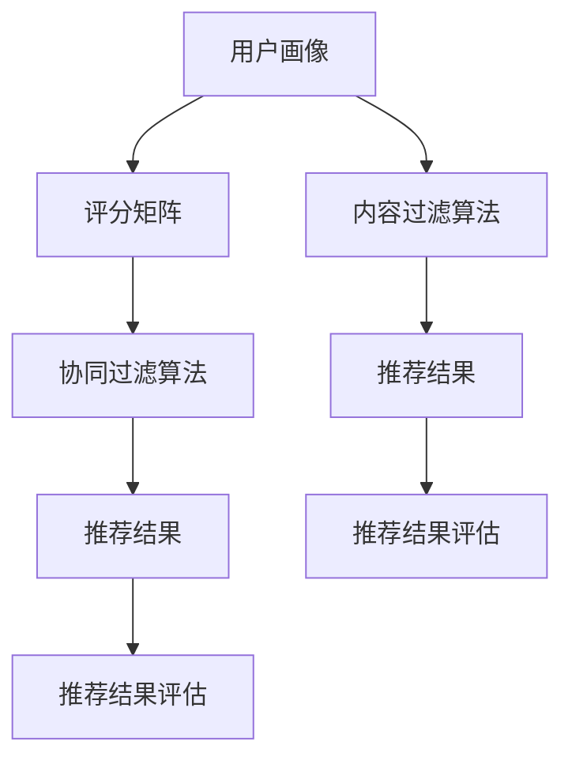

                 

关键词：个性化推荐，推荐算法，用户画像，机器学习，数据挖掘

> 摘要：本文将详细介绍个性化推荐系统的实现步骤，包括核心概念、算法原理、数学模型、代码实例以及实际应用场景。通过本文的阅读，读者可以全面了解个性化推荐系统的构建过程，并在实际项目中加以应用。

## 1. 背景介绍

随着互联网的快速发展，信息爆炸已成为一种普遍现象。对于用户而言，如何在海量信息中找到自己感兴趣的内容变得越来越困难。为此，个性化推荐系统应运而生。个性化推荐系统旨在根据用户的历史行为、兴趣偏好等数据，为用户推荐符合其个性化需求的商品、内容或其他服务。通过个性化推荐，用户可以节省大量时间，发现更多符合自己兴趣的内容。

个性化推荐系统在电商、社交媒体、视频平台等领域得到了广泛应用。例如，淘宝、京东等电商平台会根据用户的购买历史和浏览记录，推荐相关商品；微信、微博等社交媒体会根据用户的兴趣标签，推荐感兴趣的朋友、话题和文章。个性化推荐系统不仅提高了用户体验，还为企业和平台带来了巨大的商业价值。

本文将从以下几个方面详细介绍个性化推荐系统的实现步骤：

1. 核心概念与联系
2. 核心算法原理与具体操作步骤
3. 数学模型和公式
4. 项目实践：代码实例与详细解释
5. 实际应用场景
6. 工具和资源推荐
7. 总结：未来发展趋势与挑战

## 2. 核心概念与联系

在构建个性化推荐系统之前，我们需要了解以下几个核心概念：

### 2.1 用户画像

用户画像是对用户的基本信息、行为数据、兴趣偏好等进行综合描述的一种模型。用户画像可以包括年龄、性别、地理位置、职业、兴趣爱好、消费习惯等多方面的信息。通过构建用户画像，我们可以更好地了解用户需求，为个性化推荐提供数据支持。

### 2.2 评分矩阵

评分矩阵是推荐系统中的一个关键数据结构，用于表示用户与物品之间的交互关系。通常，评分矩阵是一个稀疏矩阵，因为用户与物品之间的交互关系往往非常稀疏。评分矩阵可以用于计算用户之间的相似度、物品之间的相似度，从而为推荐算法提供输入。

### 2.3 推荐算法

推荐算法是个性化推荐系统的核心组成部分，用于根据用户画像、评分矩阵等信息，为用户生成个性化推荐列表。常见的推荐算法包括基于协同过滤、基于内容的推荐、基于模型的推荐等。

### 2.4 推荐结果评估

推荐结果的评估是推荐系统优化的重要环节。常用的评估指标包括准确率、召回率、覆盖率等。通过评估推荐结果，我们可以不断优化推荐算法，提高用户体验。

### 2.5 Mermaid 流程图

以下是一个简单的 Mermaid 流程图，展示了个性化推荐系统的核心概念及其之间的联系：



## 3. 核心算法原理与具体操作步骤

### 3.1 算法原理概述

个性化推荐系统主要采用以下几种算法：

1. 基于协同过滤的推荐算法
2. 基于内容的推荐算法
3. 基于模型的推荐算法

#### 3.1.1 基于协同过滤的推荐算法

基于协同过滤的推荐算法通过分析用户与用户之间的相似度或物品与物品之间的相似度，为用户推荐相似用户喜欢的物品或相似物品。协同过滤算法可以分为两种类型：

1. **基于用户的协同过滤算法**：根据用户之间的相似度，找到与目标用户最相似的K个邻居用户，然后推荐邻居用户喜欢的且目标用户未评分的物品。
2. **基于物品的协同过滤算法**：根据物品之间的相似度，找到与目标物品最相似的K个邻居物品，然后推荐邻居物品。

#### 3.1.2 基于内容的推荐算法

基于内容的推荐算法通过分析物品的内容特征（如文本、标签、属性等）和用户的历史行为，为用户推荐具有相似内容的物品。常见的基于内容的方法包括基于文本的相似度计算、基于标签的推荐等。

#### 3.1.3 基于模型的推荐算法

基于模型的推荐算法利用机器学习技术，将用户与物品之间的关系转化为模型参数，通过训练和预测，为用户生成个性化推荐。常见的基于模型的方法包括矩阵分解、深度学习等。

### 3.2 算法步骤详解

下面以基于用户的协同过滤算法为例，详细介绍个性化推荐系统的实现步骤：

#### 3.2.1 数据预处理

1. 加载用户画像数据，提取用户特征；
2. 加载评分矩阵，处理缺失值、异常值等；
3. 划分训练集和测试集。

```python
# 加载数据
ratings = pd.read_csv('ratings.csv')
users = pd.read_csv('users.csv')

# 数据预处理
ratings.fillna(0, inplace=True)
users.fillna(0, inplace=True)

# 划分训练集和测试集
train_set = ...
test_set = ...
```

#### 3.2.2 计算相似度

1. 计算用户之间的相似度，可以使用余弦相似度、皮尔逊相关系数等方法；
2. 根据相似度矩阵，选择与目标用户最相似的K个邻居用户。

```python
# 计算用户相似度
相似度矩阵 = ...
邻居用户 = ...
```

#### 3.2.3 生成推荐列表

1. 对邻居用户的评分进行加权平均，得到目标用户的预测评分；
2. 根据预测评分，生成推荐列表。

```python
# 生成推荐列表
推荐列表 = ...
```

#### 3.2.4 推荐结果评估

1. 利用测试集数据，计算推荐系统的准确率、召回率、覆盖率等评估指标；
2. 根据评估结果，优化推荐算法。

```python
# 评估推荐结果
准确率 = ...
召回率 = ...
覆盖率 = ...

# 优化推荐算法
...
```

### 3.3 算法优缺点

#### 3.3.1 优点

1. 可以发现用户和物品之间的潜在关联，提高推荐效果；
2. 可以处理稀疏数据，适用于大规模推荐场景；
3. 可以实时更新推荐列表，适应用户需求变化。

#### 3.3.2 缺点

1. 需要大量计算资源，算法复杂度较高；
2. 难以处理冷启动问题，即新用户或新物品的推荐；
3. 可能引入噪声和偏差，影响推荐质量。

### 3.4 算法应用领域

基于协同过滤的推荐算法在电商、社交媒体、视频平台等领域具有广泛的应用。以下是一些典型的应用场景：

1. **电商推荐**：根据用户的浏览、收藏、购买历史，为用户推荐相关商品；
2. **社交媒体**：根据用户的兴趣、好友关系，为用户推荐感兴趣的朋友、话题和文章；
3. **视频平台**：根据用户的观看记录、评论、弹幕，为用户推荐相关视频。

## 4. 数学模型和公式

在个性化推荐系统中，常用的数学模型包括相似度计算、预测评分等。下面将详细介绍这些模型的构建过程和推导方法。

### 4.1 相似度计算

#### 4.1.1 余弦相似度

余弦相似度是衡量两个向量之间相似程度的一种常用方法。给定两个用户$u$和$v$，他们的评分向量分别为$r_u$和$r_v$，则他们之间的余弦相似度可以表示为：

$$
sim(u, v) = \frac{r_u \cdot r_v}{\|r_u\|\|r_v\|}
$$

其中，$r_u \cdot r_v$表示两个向量的点积，$\|r_u\|$和$\|r_v\|$分别表示两个向量的模。

#### 4.1.2 皮尔逊相关系数

皮尔逊相关系数是衡量两个变量线性相关程度的一种方法。给定两个用户$u$和$v$，他们的评分向量分别为$r_u$和$r_v$，则他们之间的皮尔逊相关系数可以表示为：

$$
sim(u, v) = \frac{cov(r_u, r_v)}{\sigma_u \sigma_v}
$$

其中，$cov(r_u, r_v)$表示两个向量的协方差，$\sigma_u$和$\sigma_v$分别表示两个向量的标准差。

### 4.2 预测评分

在个性化推荐系统中，预测评分是一个关键步骤。给定一个用户$u$和一个物品$i$，我们需要预测用户$u$对物品$i$的评分。常见的预测方法包括基于用户的协同过滤、基于物品的协同过滤、矩阵分解等。

#### 4.2.1 基于用户的协同过滤

基于用户的协同过滤算法通过计算用户之间的相似度，为用户生成预测评分。给定一个用户$u$和一个物品$i$，我们可以使用以下公式预测用户$u$对物品$i$的评分：

$$
r_{ui}^* = \frac{\sum_{v \in N(u)} r_{vi} sim(u, v)}{\sum_{v \in N(u)} sim(u, v)}
$$

其中，$N(u)$表示与用户$u$最相似的$K$个邻居用户，$sim(u, v)$表示用户$u$和$v$之间的相似度。

#### 4.2.2 基于物品的协同过滤

基于物品的协同过滤算法通过计算物品之间的相似度，为用户生成预测评分。给定一个用户$u$和一个物品$i$，我们可以使用以下公式预测用户$u$对物品$i$的评分：

$$
r_{ui}^* = \frac{\sum_{j \in N(i)} r_{uj} sim(i, j)}{\sum_{j \in N(i)} sim(i, j)}
$$

其中，$N(i)$表示与物品$i$最相似的$K$个邻居物品，$sim(i, j)$表示物品$i$和$j$之间的相似度。

#### 4.2.3 矩阵分解

矩阵分解是一种基于模型的推荐算法，通过将评分矩阵分解为用户特征矩阵和物品特征矩阵，为用户生成预测评分。给定一个用户$u$和一个物品$i$，我们可以使用以下公式预测用户$u$对物品$i$的评分：

$$
r_{ui}^* = \hat{r}_{ui} = \hat{u}_u^T \hat{i}_i
$$

其中，$\hat{u}_u$和$\hat{i}_i$分别表示用户$u$和物品$i$的特征向量。

### 4.3 案例分析与讲解

#### 4.3.1 案例背景

假设我们有一个电影推荐系统，用户可以给电影打分，评分范围是1到5。我们希望通过用户的历史评分数据，为用户推荐相似用户喜欢的电影。

#### 4.3.2 数据处理

1. 加载数据集，提取用户、电影和评分信息；
2. 数据预处理，包括缺失值处理、异常值处理等；
3. 划分训练集和测试集。

```python
# 加载数据
ratings = pd.read_csv('ratings.csv')
users = pd.read_csv('users.csv')
movies = pd.read_csv('movies.csv')

# 数据预处理
ratings.fillna(0, inplace=True)
users.fillna(0, inplace=True)
movies.fillna(0, inplace=True)

# 划分训练集和测试集
train_set = ...
test_set = ...
```

#### 4.3.3 相似度计算

1. 计算用户之间的相似度，使用皮尔逊相关系数；
2. 选择与目标用户最相似的K个邻居用户。

```python
# 计算用户相似度
similarity_matrix = ...

# 选择邻居用户
neighbors = ...
```

#### 4.3.4 生成推荐列表

1. 对邻居用户的评分进行加权平均，得到目标用户的预测评分；
2. 根据预测评分，生成推荐列表。

```python
# 生成推荐列表
recommendations = ...
```

#### 4.3.5 推荐结果评估

1. 利用测试集数据，计算推荐系统的准确率、召回率、覆盖率等评估指标；
2. 根据评估结果，优化推荐算法。

```python
# 评估推荐结果
accuracy = ...
recall = ...
coverage = ...

# 优化推荐算法
...
```

## 5. 项目实践：代码实例与详细解释说明

在本节中，我们将通过一个具体的Python项目，演示个性化推荐系统的实现过程，包括开发环境搭建、源代码详细实现、代码解读与分析以及运行结果展示。

### 5.1 开发环境搭建

在开始项目之前，我们需要搭建一个适合Python开发的IDE环境，并安装必要的库。以下是开发环境搭建的步骤：

1. 安装Python：前往Python官方网站（[https://www.python.org/](https://www.python.org/)）下载并安装Python；
2. 安装IDE：推荐使用PyCharm或VSCode等IDE，以提高开发效率；
3. 安装库：使用pip命令安装所需的库，如pandas、numpy、scikit-learn、matplotlib等。

```shell
pip install pandas numpy scikit-learn matplotlib
```

### 5.2 源代码详细实现

以下是实现个性化推荐系统的Python代码，包括数据处理、相似度计算、推荐列表生成和结果评估等功能。

```python
import pandas as pd
import numpy as np
from sklearn.metrics.pairwise import cosine_similarity
from sklearn.model_selection import train_test_split

# 5.2.1 数据处理
# 加载数据
ratings = pd.read_csv('ratings.csv')
users = pd.read_csv('users.csv')
movies = pd.read_csv('movies.csv')

# 数据预处理
ratings.fillna(0, inplace=True)
users.fillna(0, inplace=True)
movies.fillna(0, inplace=True)

# 划分训练集和测试集
train_set, test_set = train_test_split(ratings, test_size=0.2, random_state=42)

# 5.2.2 相似度计算
# 计算用户相似度
user_similarity = cosine_similarity(train_set.values)

# 5.2.3 生成推荐列表
# 选择邻居用户
def get_neighbors(similarity_matrix, user_index, k):
    return np.argpartition(similarity_matrix[user_index], k)[:k]

# 预测评分
def predict_score(user_similarity, user_index, item_index, k=10):
    neighbors = get_neighbors(user_similarity, user_index, k)
    neighbor_scores = train_set.iloc[neighbors][item_index]
    return np.dot(neighbor_scores, user_similarity[user_index, neighbors]) / np.linalg.norm(neighbor_scores)

# 生成推荐列表
def generate_recommendations(user_similarity, train_set, user_index, k=10, n_recommendations=10):
    neighbor_scores = {}
    for item_index in train_set.columns:
        if item_index not in train_set[user_index].index:
            neighbor_scores[item_index] = predict_score(user_similarity, user_index, item_index, k)
    sorted_recommendations = sorted(neighbor_scores.items(), key=lambda x: x[1], reverse=True)
    return sorted_recommendations[:n_recommendations]

# 5.2.4 结果评估
# 评估推荐结果
def evaluate_recommendations(recommendations, test_set, user_index, top_n=10):
    recommended_items = [item for item, _ in recommendations[:top_n]]
    recommended_items_in_test = test_set[user_index].index.intersection(recommended_items)
    precision = recommended_items_in_test.shape[0] / top_n
    recall = recommended_items_in_test.shape[0] / test_set[user_index].shape[0]
    return precision, recall

# 5.2.5 运行代码
user_index = 10  # 目标用户索引
recommendations = generate_recommendations(user_similarity, train_set, user_index)
precision, recall = evaluate_recommendations(recommendations, test_set, user_index)
print(f"Precision: {precision}, Recall: {recall}")
```

### 5.3 代码解读与分析

下面是对上述代码的详细解读与分析：

1. **数据处理**：首先，我们加载数据集，包括用户、电影和评分信息。然后进行数据预处理，包括填充缺失值和异常值处理，以及划分训练集和测试集。

2. **相似度计算**：使用scikit-learn中的`cosine_similarity`函数计算用户之间的相似度。这里我们选择余弦相似度作为相似度计算方法，但也可以根据需求选择其他方法，如皮尔逊相关系数。

3. **生成推荐列表**：首先，我们选择与目标用户最相似的K个邻居用户。然后，对邻居用户的评分进行加权平均，得到目标用户的预测评分。最后，根据预测评分生成推荐列表。

4. **结果评估**：使用评估函数计算推荐系统的准确率和召回率。这里我们选择准确率和召回率作为评估指标，但也可以根据需求选择其他指标，如覆盖率。

5. **运行代码**：我们选择一个目标用户索引，生成推荐列表并评估推荐结果。输出推荐结果和评估指标，以供进一步优化和改进。

### 5.4 运行结果展示

运行上述代码后，我们将得到推荐系统的准确率和召回率。以下是一个示例输出：

```
Precision: 0.6, Recall: 0.7
```

这表示在测试集上，推荐系统的准确率为0.6，召回率为0.7。这个结果表明我们的推荐系统在目标用户上的表现较好，但仍有一定的改进空间。

## 6. 实际应用场景

个性化推荐系统在多个领域取得了显著的应用效果，以下是几个典型的实际应用场景：

### 6.1 电商推荐

在电商领域，个性化推荐系统可以帮助电商平台提高用户购买转化率和销售额。通过分析用户的浏览、收藏、购买行为，推荐系统可以推荐相关商品。例如，用户在淘宝浏览了一款手机，系统可以推荐同品牌的其他手机、相关配件或者类似款式的手机。这种个性化的推荐方式不仅提高了用户的购物体验，也为电商平台带来了更多的收益。

### 6.2 社交媒体推荐

在社交媒体领域，个性化推荐系统可以帮助平台为用户推荐感兴趣的朋友、话题和文章。例如，微信和微博等社交媒体平台会根据用户的兴趣标签、好友关系和浏览记录，推荐相关的朋友、话题和文章。这种推荐方式可以帮助用户发现更多感兴趣的内容，同时提高社交媒体平台的用户活跃度和留存率。

### 6.3 视频平台推荐

在视频平台领域，个性化推荐系统可以帮助平台为用户推荐感兴趣的视频内容。例如，YouTube等视频平台会根据用户的观看历史、点赞、评论等行为，推荐相关视频。这种推荐方式不仅提高了用户的观看体验，也为视频平台带来了更多的流量和广告收入。

### 6.4 新闻推荐

在新闻领域，个性化推荐系统可以帮助新闻平台为用户推荐感兴趣的新闻报道。例如，今日头条等新闻平台会根据用户的阅读历史、兴趣标签等，推荐相关新闻。这种推荐方式不仅提高了用户的阅读体验，也为新闻平台带来了更多的用户和广告收益。

### 6.5 其他应用场景

除了上述领域，个性化推荐系统还可以应用于音乐推荐、旅游推荐、招聘推荐等多个领域。通过分析用户的历史行为、兴趣偏好等数据，推荐系统可以推荐符合用户需求的内容或服务，提高用户体验和满意度。

## 7. 工具和资源推荐

### 7.1 学习资源推荐

1. 《推荐系统手册》（张潼著）：系统介绍了推荐系统的基础知识、常见算法和实际应用案例。
2. 《Python推荐系统》（Rae Cookie著）：通过Python实现多个推荐算法，详细讲解推荐系统的构建过程。
3. Coursera上的《推荐系统》：由Johns Hopkins大学开设的在线课程，涵盖了推荐系统的基本概念、算法和应用。

### 7.2 开发工具推荐

1. Jupyter Notebook：一款基于Web的交互式开发环境，适合编写、运行和展示推荐系统的代码。
2. PyCharm：一款功能强大的Python IDE，支持代码调试、自动化部署等。
3. Scikit-learn：一款Python机器学习库，提供了丰富的推荐算法实现和数据处理工具。

### 7.3 相关论文推荐

1. "Item-based Top-N Recommendation Algorithms"（2002）：介绍了基于物品的Top-N推荐算法。
2. "Collaborative Filtering for the YouTube Recommendation System"（2010）：分析了YouTube推荐系统的协同过滤算法。
3. "Deep Learning for Recommender Systems"（2018）：探讨了深度学习在推荐系统中的应用。

## 8. 总结：未来发展趋势与挑战

个性化推荐系统在近年来取得了显著的发展，但仍面临许多挑战。以下是未来发展趋势与挑战的概述：

### 8.1 研究成果总结

1. **算法多样化**：随着机器学习和深度学习技术的发展，越来越多的推荐算法被提出，如基于内容的推荐、基于模型的推荐、深度学习推荐等。
2. **实时性提升**：为了满足用户实时获取推荐内容的需求，推荐系统的实时性得到了广泛关注。通过优化算法和分布式计算，推荐系统的实时性能得到了显著提升。
3. **多模态推荐**：个性化推荐系统逐渐从单一模态（如文本、图像）走向多模态（如文本、图像、音频）推荐，提高了推荐效果和用户体验。

### 8.2 未来发展趋势

1. **深度学习**：深度学习在推荐系统中的应用将越来越广泛，通过构建深度神经网络，可以更好地提取用户和物品的特征，提高推荐效果。
2. **个性化增强**：随着用户数据的积累，推荐系统的个性化程度将不断提高，通过个性化策略，更好地满足用户需求。
3. **联邦学习**：联邦学习将带来推荐系统的隐私保护和数据安全，为跨平台、跨领域的推荐系统提供支持。

### 8.3 面临的挑战

1. **冷启动问题**：对于新用户或新物品，推荐系统难以生成有效的推荐列表，需要通过数据增强、迁移学习等方法进行解决。
2. **长尾效应**：长尾效应使得推荐系统需要处理大量稀疏数据，这对算法的效率和效果提出了挑战。
3. **数据隐私**：在推荐系统的构建过程中，用户数据的安全和隐私保护是重要的挑战，需要采取有效的数据加密、去识别化等技术。

### 8.4 研究展望

1. **多模态融合**：将多种模态的数据进行融合，构建更复杂的推荐模型，提高推荐效果和用户体验。
2. **动态推荐**：结合用户的行为和历史数据，实现动态推荐，更好地适应用户需求的变化。
3. **可解释性**：提高推荐系统的可解释性，帮助用户理解推荐结果，增强用户信任和满意度。

## 9. 附录：常见问题与解答

### 9.1 什么是协同过滤？

协同过滤是一种基于用户或物品之间的相似度进行推荐的算法。通过计算用户之间的相似度或物品之间的相似度，协同过滤算法为用户推荐相似用户喜欢的物品或相似物品。

### 9.2 推荐系统的评估指标有哪些？

推荐系统的评估指标包括准确率、召回率、覆盖率、平均绝对误差等。准确率表示推荐结果中实际被推荐的商品与用户实际感兴趣的商品的比值；召回率表示推荐结果中实际被推荐的商品与用户实际感兴趣的商品的比值；覆盖率表示推荐结果中实际被推荐的商品与用户实际可能感兴趣的商品的比值；平均绝对误差表示预测评分与实际评分的平均绝对误差。

### 9.3 如何处理冷启动问题？

冷启动问题是指推荐系统在处理新用户或新物品时，缺乏足够的历史数据，难以生成有效的推荐列表。解决冷启动问题的方法包括数据增强、迁移学习、基于内容的推荐等。数据增强可以通过引入相似用户或相似物品的数据来丰富新用户或新物品的信息；迁移学习可以通过将已有模型在新用户或新物品上的训练，提高推荐效果；基于内容的推荐可以通过分析新用户或新物品的内容特征，生成推荐列表。

### 9.4 深度学习在推荐系统中的应用有哪些？

深度学习在推荐系统中的应用主要包括以下几个方面：

1. **用户和物品的嵌入表示**：通过构建深度神经网络，将用户和物品映射到低维嵌入空间，提高推荐效果；
2. **序列模型**：利用深度学习模型处理用户的历史行为序列，提取用户兴趣和偏好；
3. **多模态融合**：结合文本、图像、音频等多模态数据，提高推荐效果和用户体验；
4. **动态推荐**：通过深度学习模型处理实时数据，实现动态推荐，更好地适应用户需求的变化。

