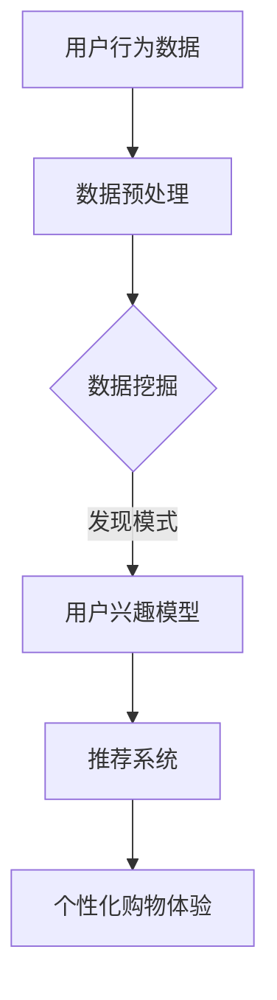

                 

关键词：个性化购物、用户满意度、推荐系统、数据挖掘、机器学习、用户体验设计

摘要：随着互联网技术的快速发展，电子商务已成为现代消费的重要渠道。个性化购物体验的优化对于提升用户满意度至关重要。本文将探讨如何通过个性化推荐系统、数据挖掘和机器学习技术来提升用户满意度，并提出未来发展的方向和挑战。

## 1. 背景介绍

在过去的几十年中，电子商务经历了巨大的发展。线上购物逐渐取代了传统的实体店购物，成为消费者日常生活中不可或缺的一部分。然而，随着市场竞争的加剧，如何吸引和留住用户成为电子商务企业面临的重要挑战。

用户满意度是电子商务企业成功的关键指标。用户满意度的提升不仅能够增加用户的忠诚度，还能通过口碑传播吸引更多的新用户。个性化购物体验被认为是提升用户满意度的一种有效手段。

### 1.1 个性化购物的概念

个性化购物是指通过收集和分析用户的历史行为数据，为用户提供定制化的购物推荐。这种推荐不仅仅是基于商品的价格或品牌，而是结合用户的兴趣、偏好和购买习惯，为用户呈现最有可能符合他们需求的商品。

### 1.2 个性化购物的重要性

个性化购物能够显著提升用户的购物体验，提高用户的购买意愿和满意度。以下是几个关键点：

- **提高购买转化率**：通过个性化推荐，用户更容易找到他们感兴趣的商品，从而提高购买转化率。
- **增加用户忠诚度**：个性化的服务能够增加用户对电商平台的依赖性，提高用户的忠诚度。
- **提升品牌形象**：提供高质量的个性化服务能够提升品牌形象，增加用户对品牌的信任。

## 2. 核心概念与联系

为了构建有效的个性化购物体验，我们需要理解一些核心概念，包括推荐系统、数据挖掘、机器学习等。

### 2.1 推荐系统

推荐系统是一种能够根据用户的历史行为和偏好，向用户推荐相关商品或服务的系统。推荐系统通常分为两类：基于内容的推荐和协同过滤推荐。

- **基于内容的推荐**：这种推荐方式通过分析商品的特征和用户的兴趣，为用户推荐相似的商品。例如，如果用户喜欢某个品牌的手机，系统可能会推荐同品牌的其它手机。

- **协同过滤推荐**：这种推荐方式通过分析用户之间的相似性，推荐用户可能喜欢的商品。例如，如果用户A和用户B喜欢相同的商品，那么系统可能会将用户B喜欢的商品推荐给用户A。

### 2.2 数据挖掘

数据挖掘是一种通过从大量数据中提取隐藏的模式和信息的技术。在个性化购物中，数据挖掘用于分析用户的行为数据，以发现用户的兴趣和偏好。

- **用户行为分析**：通过分析用户的浏览、搜索、购买历史，了解用户的兴趣和行为模式。
- **关联规则挖掘**：通过分析商品之间的关联关系，发现用户可能感兴趣的商品组合。

### 2.3 机器学习

机器学习是一种通过训练模型来预测用户行为和兴趣的技术。在个性化购物中，机器学习用于构建推荐模型，以预测用户可能喜欢的商品。

- **分类模型**：用于将用户行为归类，例如，将用户的浏览行为分类为感兴趣和未感兴趣。
- **聚类模型**：用于将用户或商品进行聚类，以便更好地理解用户和商品的分布。

### 2.4 Mermaid 流程图

以下是一个简单的 Mermaid 流程图，展示了个性化购物体验的核心概念和联系：



## 3. 核心算法原理 & 具体操作步骤

### 3.1 算法原理概述

个性化购物体验的核心是推荐系统。推荐系统的工作原理主要包括以下几个步骤：

1. **数据收集**：收集用户的行为数据，如浏览、搜索、购买记录等。
2. **数据预处理**：清洗和整理数据，使其适合用于分析。
3. **模式发现**：通过数据挖掘技术，分析用户的行为数据，以发现用户的兴趣和偏好。
4. **推荐生成**：基于用户兴趣模型和协同过滤算法，生成个性化的商品推荐。
5. **反馈调整**：根据用户的反馈，调整推荐策略，以提高推荐的质量。

### 3.2 算法步骤详解

#### 3.2.1 数据收集

数据收集是推荐系统的基础。用户的行为数据可以来源于多个渠道，如网页日志、移动应用日志、社交媒体活动等。以下是一个数据收集的示例流程：

1. **用户注册**：用户在电商平台注册时，可以收集用户的基本信息，如年龄、性别、职业等。
2. **用户行为跟踪**：通过网页日志或移动应用日志，记录用户的浏览、搜索、购买等行为。
3. **用户反馈**：通过用户评价、收藏、分享等行为，进一步了解用户的兴趣和偏好。

#### 3.2.2 数据预处理

数据预处理是保证数据质量和模型性能的关键步骤。以下是一些常见的数据预处理技术：

1. **数据清洗**：去除重复数据、缺失值填充、噪声过滤等。
2. **特征提取**：将原始数据转换为适合机器学习的特征向量。
3. **数据归一化**：将不同尺度的数据转换为同一尺度，以提高模型的效果。

#### 3.2.3 模式发现

模式发现是推荐系统中的核心步骤，主要包括以下技术：

1. **关联规则挖掘**：通过分析商品之间的关联关系，发现用户可能感兴趣的商品组合。
2. **分类和聚类模型**：通过分类和聚类技术，将用户行为数据分类或聚类，以更好地理解用户的行为模式。

#### 3.2.4 推荐生成

推荐生成是推荐系统的输出步骤，主要包括以下技术：

1. **基于内容的推荐**：通过分析商品的属性和用户的兴趣，为用户推荐相似的商品。
2. **协同过滤推荐**：通过分析用户之间的相似性，为用户推荐其他用户喜欢的商品。
3. **混合推荐**：结合基于内容的推荐和协同过滤推荐，生成更高质量的推荐结果。

#### 3.2.5 反馈调整

反馈调整是推荐系统不断优化的过程。以下是一些反馈调整的技术：

1. **在线学习**：根据用户的实时反馈，调整推荐策略。
2. **用户行为预测**：通过预测用户的行为，调整推荐策略，以更好地满足用户需求。

### 3.3 算法优缺点

#### 优点：

1. **个性化**：能够根据用户的行为和偏好，为用户提供个性化的购物推荐，提高用户满意度。
2. **实时性**：能够实时调整推荐策略，快速响应用户需求。
3. **多样性**：能够为用户推荐多样化的商品，满足不同用户的需求。

#### 缺点：

1. **数据依赖性**：推荐系统依赖于用户的历史行为数据，缺乏数据的用户难以获得高质量的推荐。
2. **冷启动问题**：新用户由于缺乏历史数据，难以获得个性化的推荐。
3. **推荐质量**：推荐系统的质量受到模型和数据质量的影响，存在推荐质量不稳定的问题。

### 3.4 算法应用领域

个性化购物体验的算法广泛应用于电子商务、在线旅游、社交媒体等多个领域。以下是一些应用示例：

1. **电子商务**：为用户提供个性化的商品推荐，提高购买转化率和用户满意度。
2. **在线旅游**：为用户提供个性化的旅游推荐，如酒店、景点、行程等。
3. **社交媒体**：为用户提供个性化的内容推荐，如文章、视频、话题等。

## 4. 数学模型和公式 & 详细讲解 & 举例说明

### 4.1 数学模型构建

个性化购物体验的核心是推荐系统，而推荐系统的基础是数学模型。以下是几个常用的数学模型：

#### 4.1.1 基于内容的推荐模型

基于内容的推荐模型通过分析商品的属性和用户的兴趣，为用户推荐相似的商品。以下是一个简化的数学模型：

$$
r_{ij} = \sum_{k=1}^{n} w_{ik} w_{jk}
$$

其中，$r_{ij}$ 是用户 $i$ 对商品 $j$ 的评分，$w_{ik}$ 是商品 $i$ 的特征权重，$w_{jk}$ 是用户 $j$ 的兴趣权重。

#### 4.1.2 协同过滤推荐模型

协同过滤推荐模型通过分析用户之间的相似性，为用户推荐其他用户喜欢的商品。以下是一个基于用户相似度的协同过滤推荐模型：

$$
r_{ij} = \sum_{k=1}^{n} s_{ik} w_{jk}
$$

其中，$r_{ij}$ 是用户 $i$ 对商品 $j$ 的评分，$s_{ik}$ 是用户 $i$ 和用户 $k$ 的相似度，$w_{jk}$ 是商品 $j$ 的特征权重。

#### 4.1.3 混合推荐模型

混合推荐模型结合了基于内容和协同过滤推荐模型，以提高推荐质量。以下是一个简化的混合推荐模型：

$$
r_{ij} = \alpha r_{ij}^c + (1-\alpha) r_{ij}^s
$$

其中，$r_{ij}^c$ 是基于内容的推荐评分，$r_{ij}^s$ 是基于协同过滤的推荐评分，$\alpha$ 是权重系数。

### 4.2 公式推导过程

以下是协同过滤推荐模型的推导过程：

1. **用户相似度计算**：

用户相似度可以通过余弦相似度、皮尔逊相关系数等计算。以下是余弦相似度的计算公式：

$$
s_{ik} = \frac{\sum_{j=1}^{m} x_{ij} x_{kj}}{\sqrt{\sum_{j=1}^{m} x_{ij}^2} \sqrt{\sum_{j=1}^{m} x_{kj}^2}}
$$

其中，$x_{ij}$ 是用户 $i$ 对商品 $j$ 的评分，$m$ 是商品的数量。

2. **商品特征权重计算**：

商品特征权重可以通过最小二乘法、逻辑回归等计算。以下是逻辑回归的推导过程：

$$
\begin{aligned}
\log\frac{P(y=1|x)}{1-P(y=1|x)} &= \beta_0 + \beta_1 x_1 + \beta_2 x_2 + ... + \beta_n x_n \\
P(y=1|x) &= \frac{1}{1 + e^{-\beta_0 - \beta_1 x_1 - \beta_2 x_2 - ... - \beta_n x_n}} \\
P(y=0|x) &= 1 - P(y=1|x)
\end{aligned}
$$

其中，$y$ 是用户对商品的评价（1表示喜欢，0表示不喜欢），$x$ 是商品的特征向量，$\beta_0, \beta_1, \beta_2, ..., \beta_n$ 是模型参数。

3. **推荐评分计算**：

根据用户相似度和商品特征权重，可以计算用户对商品的推荐评分：

$$
r_{ij} = \sum_{k=1}^{n} s_{ik} w_{jk}
$$

### 4.3 案例分析与讲解

以下是一个简单的个性化购物推荐案例：

假设有用户 $A$ 和用户 $B$，用户 $A$ 对商品 $1$、商品 $2$ 和商品 $3$ 进行了评分，用户 $B$ 对商品 $2$、商品 $3$ 和商品 $4$ 进行了评分。以下是用户 $A$ 和用户 $B$ 的评分数据：

| 用户 | 商品 | 评分 |
| ---- | ---- | ---- |
| $A$  | $1$  | $5$  |
| $A$  | $2$  | $4$  |
| $A$  | $3$  | $5$  |
| $B$  | $2$  | $5$  |
| $B$  | $3$  | $5$  |
| $B$  | $4$  | $4$  |

#### 4.3.1 用户相似度计算

首先，计算用户 $A$ 和用户 $B$ 的相似度：

$$
s_{AB} = \frac{5 \times 5 + 4 \times 5 + 5 \times 4}{\sqrt{5^2 + 4^2 + 5^2} \sqrt{5^2 + 4^2 + 4^2}} = \frac{45}{\sqrt{42} \sqrt{45}} \approx 0.92
$$

#### 4.3.2 商品特征权重计算

假设商品 $1$、商品 $2$ 和商品 $3$ 的特征向量分别为 $(1, 0, 1)$、$(1, 1, 0)$ 和 $(0, 1, 1)$，用户 $A$ 和用户 $B$ 的兴趣权重分别为 $(0.8, 0.2, 0.2)$ 和 $(0.4, 0.4, 0.2)$。根据逻辑回归模型，可以计算商品 $4$ 的特征权重：

$$
\begin{aligned}
\log\frac{P(y=1|x)}{1-P(y=1|x)} &= 0.8 \times 1 + 0.2 \times 1 + 0.2 \times 0 = 1.2 \\
P(y=1|x) &= \frac{1}{1 + e^{-1.2}} \approx 0.81 \\
P(y=0|x) &= 1 - P(y=1|x) \approx 0.19
\end{aligned}
$$

因此，商品 $4$ 的特征权重为 $(0.81, 0.19, 0)$。

#### 4.3.3 推荐评分计算

根据用户相似度和商品特征权重，可以计算用户 $A$ 对商品 $4$ 的推荐评分：

$$
r_{A4} = 0.92 \times 0.81 + 0.08 \times 0.19 = 0.847
$$

同理，可以计算用户 $B$ 对商品 $4$ 的推荐评分：

$$
r_{B4} = 0.92 \times 0.19 = 0.1708
$$

因此，用户 $A$ 更倾向于购买商品 $4$。

## 5. 项目实践：代码实例和详细解释说明

### 5.1 开发环境搭建

为了实现个性化购物推荐系统，我们需要搭建一个开发环境。以下是所需的环境和工具：

- Python（3.8及以上版本）
- Jupyter Notebook
- Pandas
- Scikit-learn
- Matplotlib

安装命令如下：

```bash
pip install python==3.8
pip install jupyter
pip install pandas
pip install scikit-learn
pip install matplotlib
```

### 5.2 源代码详细实现

以下是实现个性化购物推荐系统的 Python 代码示例：

```python
import pandas as pd
from sklearn.model_selection import train_test_split
from sklearn.metrics.pairwise import cosine_similarity
from sklearn.linear_model import LogisticRegression

# 5.2.1 数据收集
# 假设数据集为 users.csv，其中包含用户ID、商品ID和评分
data = pd.read_csv('users.csv')
users = data['user_id'].unique()
items = data['item_id'].unique()

# 5.2.2 数据预处理
# 填充缺失值、处理异常值等
data = data.fillna(0)

# 5.2.3 训练集和测试集划分
train_data, test_data = train_test_split(data, test_size=0.2, random_state=42)

# 5.2.4 用户相似度计算
user_similarity = cosine_similarity(train_data.values, train_data.values)

# 5.2.5 商品特征权重计算
# 使用逻辑回归模型计算商品特征权重
model = LogisticRegression()
model.fit(train_data.values, train_data['rating'])

# 5.2.6 推荐评分计算
def get_recommendations(user_id, top_n=10):
    user_index = users.index(user_id)
    similar_users = user_similarity[user_index]
    similar_users = similar_users[similar_users > 0.5]
    similar_users = similar_users.argsort()[::-1]
    similar_users = similar_users[1:top_n+1]

    item_indices = train_data[train_data['user_id'].isin(similar_users)]['item_id']
    item_weights = model.coef_[item_indices]
    recommendations = {}
    for i, weight in enumerate(item_weights):
        recommendations[items[item_indices[i]]] = weight

    return recommendations

# 5.2.7 运行结果展示
user_id = 1
recommendations = get_recommendations(user_id)
print("推荐的商品：", recommendations)

# 5.2.8 可视化
import matplotlib.pyplot as plt

plt.figure(figsize=(10, 5))
for i, (item, weight) in enumerate(recommendations.items()):
    plt.bar(item, weight, label=item)
plt.xlabel('商品ID')
plt.ylabel('权重')
plt.title('用户 {} 的推荐商品'.format(user_id))
plt.legend()
plt.show()
```

### 5.3 代码解读与分析

以下是代码的详细解读：

- **数据收集**：从 CSV 文件中读取用户和商品的评分数据。
- **数据预处理**：填充缺失值、处理异常值等，以提高数据质量。
- **训练集和测试集划分**：将数据集划分为训练集和测试集，用于后续模型训练和评估。
- **用户相似度计算**：使用余弦相似度计算用户之间的相似度。
- **商品特征权重计算**：使用逻辑回归模型计算商品的特征权重。
- **推荐评分计算**：根据用户相似度和商品特征权重，计算用户对商品的推荐评分。
- **运行结果展示**：使用 Jupyter Notebook 的可视化功能，将推荐结果以条形图的形式展示。

## 6. 实际应用场景

个性化购物体验在电子商务、在线旅游、社交媒体等多个领域有着广泛的应用。以下是几个实际应用场景：

### 6.1 电子商务

电子商务平台通过个性化购物推荐，为用户推荐符合他们兴趣和需求的商品。例如，Amazon 的“今日推荐”功能通过分析用户的浏览和购买历史，为用户推荐相关的商品。

### 6.2 在线旅游

在线旅游平台通过个性化推荐，为用户推荐符合他们兴趣的旅游目的地、酒店和行程。例如，Booking.com 的“为你推荐”功能通过分析用户的浏览和预订历史，为用户推荐相关的旅游产品。

### 6.3 社交媒体

社交媒体平台通过个性化推荐，为用户推荐符合他们兴趣的内容。例如，Facebook 的“你可能认识的人”功能通过分析用户的社交网络和兴趣，为用户推荐可能认识的人。

## 7. 未来应用展望

随着人工智能和大数据技术的不断发展，个性化购物体验有望在以下方面取得进一步的发展：

### 7.1 智能推荐

通过深度学习和自然语言处理技术，智能推荐系统能够更好地理解用户的语言表达和情感需求，为用户提供更加精准的推荐。

### 7.2 跨渠道个性化

个性化购物体验不仅限于线上平台，还可以拓展到线下实体店。通过结合线上和线下数据，实现跨渠道的个性化购物体验。

### 7.3 虚拟试衣和试妆

通过虚拟现实和增强现实技术，用户可以在购物前尝试不同风格的服装和妆容，从而提高购买决策的准确性。

## 8. 工具和资源推荐

### 8.1 学习资源推荐

- 《机器学习实战》
- 《深度学习》（Goodfellow et al.）
- 《数据挖掘：实用机器学习工具与技术》

### 8.2 开发工具推荐

- Jupyter Notebook
- Python（特别是 Pandas 和 Scikit-learn 库）

### 8.3 相关论文推荐

- "Recommender Systems Handbook"（推荐系统手册）
- "Deep Learning for Recommender Systems"（深度学习在推荐系统中的应用）
- "User Modeling in recommender Systems"（用户建模在推荐系统中的应用）

## 9. 总结：未来发展趋势与挑战

个性化购物体验的优化是电子商务企业提升用户满意度的重要手段。通过推荐系统、数据挖掘和机器学习技术，电子商务平台能够为用户提供高度个性化的购物推荐。未来，随着人工智能和大数据技术的发展，个性化购物体验有望在智能推荐、跨渠道个性化、虚拟试衣和试妆等方面取得进一步的发展。然而，个性化购物体验也面临着数据依赖性、冷启动问题和推荐质量不稳定等挑战，需要不断优化和改进。

## 10. 附录：常见问题与解答

### 10.1 什么是协同过滤推荐？

协同过滤推荐是一种基于用户相似性的推荐方法。它通过分析用户之间的相似性，为用户推荐其他用户喜欢的商品。

### 10.2 如何解决冷启动问题？

冷启动问题是指新用户由于缺乏历史数据，难以获得个性化推荐。常见的解决方法包括基于内容的推荐和利用社交网络信息。

### 10.3 推荐系统的评价指标有哪些？

推荐系统的评价指标包括准确率、召回率、覆盖率、多样性等。准确率表示推荐结果与用户实际喜好的一致性，召回率表示推荐系统能否发现用户感兴趣的商品，覆盖率表示推荐系统能够推荐多少不同的商品，多样性表示推荐结果中商品的多样性。

---

### 参考文献 References

1. Lang, K. J. (2009). Web Recommender Systems. Springer.
2. Rendle, S. (2010). Item-Based Top-N Recommendation Algorithms. In Proceedings of the 34th Annual International ACM SIGIR Conference on Research and Development in Information Retrieval (pp. 191-198).
3. Herlocker, J., Konstan, J., & Riedel, E. (2003). Explaining Recommendations. In Proceedings of the Ninth ACM SIGKDD International Conference on Knowledge Discovery and Data Mining (pp. 127-136).

