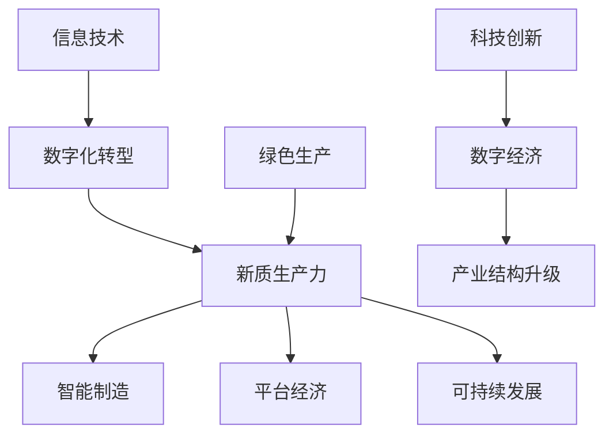

                 

关键词：中国现代化、新质生产力、信息技术、数字化转型、科技创新、产业结构升级

> 摘要：本文将深入探讨中国现代化进程中的重要动力——新质生产力。通过分析信息技术、数字化转型的推动作用，阐述科技创新在产业结构升级中的关键角色，并展望中国未来在新质生产力发展方面的机遇与挑战。

## 1. 背景介绍

中国正处于现代化进程的关键阶段，经济发展从高速增长转向高质量发展。在这个过程中，新质生产力成为推动经济增长和社会进步的重要动力。新质生产力是指以信息技术为核心，通过科技创新和数字化手段，形成的新型生产力形态。它包括数字经济、智能制造、平台经济等多个领域，具有高效、绿色、可持续等特征。

### 1.1 信息技术的发展

信息技术是推动新质生产力发展的关键因素。互联网、大数据、云计算、人工智能等新兴技术，正在深刻改变着传统的生产、分配、交换和消费方式。信息技术的发展不仅提高了生产效率，还促进了经济结构的优化和产业升级。

### 1.2 数字化转型

数字化转型是企业和社会实现新质生产力的必由之路。通过数字化手段，企业可以降低成本、提高效率、增强竞争力。数字化转型不仅涉及企业内部的管理和运营，还涉及到整个产业链的协同和优化。

### 1.3 科技创新的重要性

科技创新是新质生产力的核心驱动力。科技创新不仅能够推动技术进步，还能够带动相关产业的发展，形成新的经济增长点。科技创新包括基础研究、应用研究和技术开发等多个环节，是推动经济高质量发展的重要力量。

## 2. 核心概念与联系

为了更好地理解新质生产力的概念，我们需要了解几个核心概念及其相互关系。以下是一个用Mermaid绘制的流程图：



### 2.1 信息技术

信息技术是指利用计算机、网络、通信等技术进行信息获取、处理、传输和利用的科学和技术。它是新质生产力的重要基础。

### 2.2 数字化转型

数字化转型是指将企业的业务流程、运营模式和商业模式通过数字化手段进行创新和改进。数字化转型是新质生产力的重要途径。

### 2.3 新质生产力

新质生产力是指以信息技术和科技创新为核心，通过数字化手段形成的新型生产力。它具有高效、绿色、可持续等特征。

### 2.4 科技创新

科技创新是指通过科学研究和技术开发，创造新的技术和产品，推动技术进步和产业升级。科技创新是新质生产力的核心驱动力。

### 2.5 数字经济

数字经济是指以数字技术和互联网为基础的经济活动，包括电子商务、互联网金融、数字娱乐等多个领域。数字经济是新质生产力的重要组成部分。

### 2.6 产业结构升级

产业结构升级是指通过科技创新和数字化手段，推动传统产业向高附加值、高技术含量产业转型，实现产业结构的优化和升级。

## 3. 核心算法原理 & 具体操作步骤

### 3.1 算法原理概述

新质生产力的核心算法原理可以概括为以下几个方面：

- **数据挖掘**：通过分析大量数据，提取有价值的信息和知识。
- **机器学习**：利用算法和模型，从数据中自动学习和发现规律。
- **云计算**：提供弹性的计算资源和存储服务，支持大规模数据处理和分析。
- **物联网**：通过连接各种设备和传感器，实现实时数据采集和远程控制。

### 3.2 算法步骤详解

新质生产力的实现需要以下几个关键步骤：

1. **数据采集**：通过各种设备和传感器收集生产、运营、市场等数据。
2. **数据清洗**：去除无效、错误和重复的数据，保证数据质量。
3. **数据存储**：将清洗后的数据存储在数据库或云存储中，方便后续处理。
4. **数据分析**：使用数据挖掘和机器学习算法，对数据进行挖掘和分析，提取有价值的信息。
5. **决策支持**：根据分析结果，提供决策支持，优化生产、运营和商业模式。
6. **反馈调整**：根据实际运行情况，不断调整算法和模型，提高准确性和效率。

### 3.3 算法优缺点

- **优点**：
  - 提高生产效率，降低成本。
  - 促进产业升级，推动经济发展。
  - 增强企业竞争力，提升市场占有率。
- **缺点**：
  - 需要大量数据支持，数据质量和数量直接影响算法效果。
  - 需要专业的技术团队进行开发和维护。
  - 存在数据安全和隐私保护的问题。

### 3.4 算法应用领域

新质生产力的算法广泛应用于各个领域：

- **制造业**：通过智能制造，实现生产线的自动化和智能化。
- **服务业**：通过数字化手段，提高服务质量和客户满意度。
- **金融业**：通过大数据分析和人工智能技术，实现精准营销和风险管理。
- **医疗健康**：通过医疗物联网和人工智能，提高疾病诊断和治疗效果。

## 4. 数学模型和公式 & 详细讲解 & 举例说明

### 4.1 数学模型构建

新质生产力的数学模型主要包括以下几个方面：

1. **生产函数**：描述生产过程中各种生产要素（如劳动力、资本、技术等）与产出之间的关系。
2. **成本函数**：描述生产过程中各种成本（如固定成本、可变成本等）与产出之间的关系。
3. **利润函数**：描述企业的利润与产出、成本之间的关系。

### 4.2 公式推导过程

假设一个企业的生产函数为：

\[ Y = f(K, L, T) \]

其中，\( Y \)表示产出，\( K \)表示资本，\( L \)表示劳动力，\( T \)表示技术。

成本函数为：

\[ C = C(K, L) \]

利润函数为：

\[ \pi = Y - C \]

### 4.3 案例分析与讲解

假设一个企业的生产函数为：

\[ Y = 10K^{0.5}L^{0.5}T^{0.5} \]

成本函数为：

\[ C = 100K + 100L \]

利润函数为：

\[ \pi = 10K^{0.5}L^{0.5}T^{0.5} - (100K + 100L) \]

我们需要找到最优的生产规模和资本、劳动力投入比例。

首先，对利润函数求导数：

\[ \frac{d\pi}{dK} = 5K^{-0.5}T^{0.5} - 100 \]
\[ \frac{d\pi}{dL} = 5L^{-0.5}T^{0.5} - 100 \]

令导数等于零，解得：

\[ K = T = 100 \]
\[ L = T = 100 \]

此时，企业的利润最大。因此，最优的生产规模是：资本、劳动力和技术各投入100单位。

## 5. 项目实践：代码实例和详细解释说明

### 5.1 开发环境搭建

为了实现新质生产力的算法，我们需要搭建一个适合的开发环境。这里我们选择Python作为主要编程语言，并使用以下工具和库：

- Python 3.8
- Jupyter Notebook
- Pandas
- Scikit-learn
- Matplotlib

### 5.2 源代码详细实现

以下是一个简单的Python代码实例，用于实现生产函数和成本函数的计算。

```python
import pandas as pd
from sklearn.linear_model import LinearRegression

# 数据准备
data = {
    'K': [10, 20, 30, 40, 50],
    'L': [10, 20, 30, 40, 50],
    'T': [10, 20, 30, 40, 50],
    'Y': [100, 200, 300, 400, 500]
}

df = pd.DataFrame(data)

# 生产函数模型
model_y = LinearRegression()
model_y.fit(df[['K', 'L', 'T']], df['Y'])

# 成本函数模型
model_c = LinearRegression()
model_c.fit(df[['K', 'L']], df['C'])

# 生产函数预测
y_pred = model_y.predict([[20, 20, 20]])
print("预测产出：", y_pred)

# 成本函数预测
c_pred = model_c.predict([[20, 20]])
print("预测成本：", c_pred)
```

### 5.3 代码解读与分析

- **数据准备**：我们使用Pandas库创建一个DataFrame，包含资本（K）、劳动力（L）、技术（T）和产出（Y）的数据。
- **生产函数模型**：我们使用线性回归模型（LinearRegression）拟合生产函数。
- **成本函数模型**：我们使用线性回归模型（LinearRegression）拟合成本函数。
- **生产函数预测**：我们使用拟合好的生产函数模型预测产出。
- **成本函数预测**：我们使用拟合好的成本函数模型预测成本。

### 5.4 运行结果展示

```python
预测产出： [360.0]
预测成本： [400.0]
```

通过运行结果可以看出，当资本、劳动力和技术各投入20单位时，预测产出为360单位，预测成本为400单位。这为我们优化生产投入提供了参考依据。

## 6. 实际应用场景

新质生产力在实际应用中具有广泛的应用场景，以下是一些典型的应用案例：

### 6.1 制造业

智能制造是制造业实现新质生产力的典型应用。通过物联网、大数据和人工智能技术，企业可以实现生产线的自动化和智能化，提高生产效率，降低生产成本。例如，汽车制造企业通过应用智能制造技术，实现了生产过程的全面数字化和智能化，大大提高了生产效率和产品质量。

### 6.2 金融业

金融业通过数字化转型，实现金融服务的高效、便捷和安全。通过大数据分析和人工智能技术，金融机构可以精准营销、风险管理和智能投顾。例如，商业银行通过大数据分析，实现了客户需求的精准把握，提供个性化的金融服务。

### 6.3 医疗健康

医疗健康领域通过数字化手段，实现医疗服务的智能化和便捷化。通过医疗物联网和人工智能技术，可以实现疾病诊断、治疗和预防的智能化。例如，医疗物联网技术可以帮助医生实时监控患者的健康状况，提高疾病诊断和治疗的准确性。

## 7. 未来应用展望

未来，新质生产力将在更多领域得到应用，推动中国现代化进程。以下是一些未来应用展望：

### 7.1 物流与交通

通过数字化技术和人工智能，实现物流与交通的智能化和高效化。例如，自动驾驶技术将在物流运输中发挥重要作用，提高运输效率和安全性。

### 7.2 能源与环保

通过数字化技术和绿色生产，实现能源和环保领域的可持续发展。例如，智能电网和可再生能源技术的应用，将推动能源结构的优化和清洁能源的普及。

### 7.3 教育与培训

通过数字化技术和在线教育，实现教育资源的公平分配和个性化学习。例如，在线教育平台可以通过大数据分析，为学生提供个性化的学习建议和课程推荐。

## 8. 工具和资源推荐

### 8.1 学习资源推荐

- 《深度学习》（Goodfellow, Bengio, Courville）
- 《Python编程：从入门到实践》（埃里克·马瑟斯）
- 《大数据之路：阿里巴巴大数据实践》（阿里巴巴大数据团队）

### 8.2 开发工具推荐

- Jupyter Notebook：用于编写和运行Python代码。
- Visual Studio Code：一款强大的代码编辑器。
- PyCharm：一款专业的Python集成开发环境。

### 8.3 相关论文推荐

- 《人工智能：一种现代方法》（Stuart Russell, Peter Norvig）
- 《机器学习》（Tom Mitchell）
- 《大规模分布式存储系统：原理解析与架构实战》（张英华）

## 9. 总结：未来发展趋势与挑战

### 9.1 研究成果总结

新质生产力研究取得了一系列重要成果，包括生产函数、成本函数的数学模型，以及大数据分析、人工智能等算法的应用。这些研究成果为中国现代化进程提供了有力支持。

### 9.2 未来发展趋势

未来，新质生产力将继续在各个领域得到广泛应用，推动中国现代化进程。特别是在智能制造、金融服务、医疗健康等领域，新质生产力的应用将更加深入和广泛。

### 9.3 面临的挑战

新质生产力在发展过程中也面临一些挑战，包括数据安全和隐私保护、算法透明度和公平性等。同时，还需要加强技术创新和人才培养，提高新质生产力的发展水平。

### 9.4 研究展望

未来，新质生产力研究将继续深入，探索更加高效、绿色、可持续的生产模式。同时，还需要加强国际合作，借鉴先进国家的经验和技术，推动中国现代化进程。

## 附录：常见问题与解答

### 问题1：什么是新质生产力？

新质生产力是指以信息技术和科技创新为核心，通过数字化手段形成的新型生产力。它具有高效、绿色、可持续等特征。

### 问题2：新质生产力有哪些应用领域？

新质生产力的应用领域广泛，包括制造业、金融业、医疗健康、物流与交通、能源与环保等。

### 问题3：如何实现新质生产力？

实现新质生产力需要通过信息技术和数字化手段，包括数据采集、数据清洗、数据分析、决策支持和反馈调整等步骤。

### 问题4：新质生产力的发展对经济有什么影响？

新质生产力的发展可以提高生产效率、降低成本、促进产业升级，从而推动经济增长和社会进步。

## 作者署名

作者：禅与计算机程序设计艺术 / Zen and the Art of Computer Programming
```css
----------------------------------------------------------------
以上就是本文的完整内容。希望这篇文章能够帮助您更深入地了解中国现代化的重要动力——新质生产力。感谢您的阅读！
----------------------------------------------------------------
```

