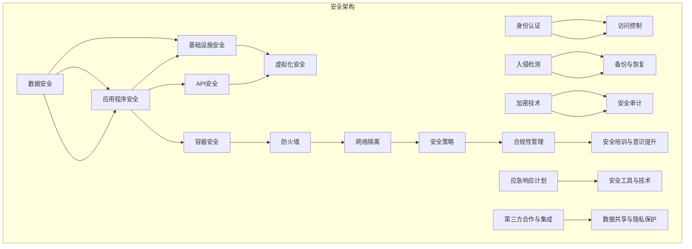

                 

关键词：云安全、数据保护、应用程序安全、安全策略、云计算架构

摘要：随着云计算的普及，企业和个人对云服务的依赖程度越来越高。云安全策略的制定和执行成为保障云端数据与应用程序安全的关键。本文旨在探讨云安全的核心概念、算法原理、实践应用以及未来发展趋势，帮助读者构建有效的云安全策略。

## 1. 背景介绍

云计算作为信息技术发展的重要方向，已经成为企业数字化转型的重要基础设施。无论是公共云、私有云还是混合云，云计算的安全性问题始终是企业关注的焦点。随着数据量的激增和业务复杂性的提高，传统的安全措施已经难以满足云环境下的安全需求。云安全策略的制定和执行，不仅关系到企业的核心数据安全，也影响着用户的隐私保护和业务连续性。

本文将围绕以下几个方面展开讨论：

1. 核心概念与联系
2. 核心算法原理与具体操作步骤
3. 数学模型和公式讲解与案例分析
4. 项目实践：代码实例与详细解释
5. 实际应用场景与未来展望
6. 工具和资源推荐
7. 总结：未来发展趋势与挑战

通过本文的讨论，读者将能够深入了解云安全的各个方面，掌握构建云安全策略的方法和技巧。

## 2. 核心概念与联系

### 2.1 云安全的基本概念

云安全，是指通过采用一系列技术和管理措施，保护云计算环境中的数据、应用程序、基础设施免受各种威胁和攻击的能力。云安全的核心概念包括：

- **数据安全**：确保数据在存储、传输和处理过程中的机密性、完整性和可用性。
- **应用程序安全**：保护应用程序免受恶意代码、网络攻击和数据泄露等威胁。
- **基础设施安全**：保障云基础设施的可靠性和稳定性，防止网络入侵、设备故障等安全事件。
- **身份认证和访问控制**：通过身份验证和访问控制策略，确保只有授权用户才能访问云资源和数据。

### 2.2 云安全与云计算架构的关系

云安全与云计算架构紧密相连。云计算架构包括多个层次，如基础设施层、平台层和应用层。每一层都有相应的安全需求和安全措施：

- **基础设施层**：包括物理服务器、网络设备、存储设备等，需要通过物理安全、网络隔离和防火墙等手段保护。
- **平台层**：提供计算、存储、数据库等资源服务，需要通过虚拟化安全、容器安全、API安全等手段保障。
- **应用层**：提供各种业务应用，需要通过应用级安全、应用编程接口（API）安全等手段加强保护。

### 2.3 云安全的关键组成部分

云安全的关键组成部分包括：

- **加密技术**：通过加密算法对数据进行加密，确保数据在存储和传输过程中的机密性。
- **访问控制**：通过身份验证和权限管理，控制用户对数据和资源的访问。
- **入侵检测与防御**：实时监测和防御各种网络攻击，如DDoS攻击、SQL注入等。
- **备份与恢复**：定期备份云端数据和应用程序，确保在数据丢失或系统故障时能够迅速恢复。
- **安全审计**：记录和分析系统操作日志，识别潜在的安全风险和违规行为。

为了更好地理解和阐述云安全策略的构建，以下是云安全架构的Mermaid流程图。



### 2.4 云安全与其他领域的联系

云安全不仅仅是一个技术问题，还涉及到法律、政策、经济等多个领域。例如：

- **法律与政策**：随着数据保护法规（如GDPR、CCPA）的出台，云安全策略需要符合相关法律法规要求。
- **经济因素**：云安全不仅关系到企业的数据安全，还影响企业的运营成本和竞争力。
- **技术趋势**：随着人工智能、区块链等新技术的应用，云安全策略需要不断更新以应对新的威胁。

## 3. 核心算法原理与具体操作步骤

### 3.1 算法原理概述

云安全策略的实现依赖于一系列核心算法和技术，以下介绍几种常用的算法及其原理。

#### 3.1.1 加密算法

加密算法是云安全的基础技术之一。常用的加密算法包括对称加密和非对称加密。

- **对称加密**：如AES（高级加密标准），加密和解密使用相同的密钥。
- **非对称加密**：如RSA，使用一对密钥（公钥和私钥）进行加密和解密。

#### 3.1.2 访问控制算法

访问控制算法用于确保只有授权用户才能访问云资源和数据。常用的访问控制算法包括：

- **基于角色的访问控制（RBAC）**：根据用户的角色分配权限，实现细粒度的访问控制。
- **基于属性的访问控制（ABAC）**：根据用户的属性（如位置、时间等）动态调整访问权限。

#### 3.1.3 入侵检测算法

入侵检测算法用于实时监测和防御各种网络攻击。常用的入侵检测算法包括：

- **基于特征匹配的检测**：通过比对已知攻击特征库，检测异常流量。
- **基于异常行为的检测**：通过分析网络流量和行为模式，识别潜在攻击。

#### 3.1.4 数据备份与恢复算法

数据备份与恢复算法用于确保在数据丢失或系统故障时能够迅速恢复。常用的备份与恢复算法包括：

- **全备份**：备份整个系统和所有数据。
- **增量备份**：只备份自上次备份以来发生变化的数据。
- **差异备份**：备份自上次全备份以来发生变化的数据。

### 3.2 算法步骤详解

#### 3.2.1 加密算法步骤

1. **密钥生成**：生成加密密钥和用于解密的密钥。
2. **数据加密**：使用加密算法和加密密钥对数据进行加密。
3. **数据存储**：将加密后的数据存储在云端。
4. **数据解密**：在需要访问数据时，使用解密算法和解密密钥对数据进行解密。

#### 3.2.2 访问控制算法步骤

1. **用户身份验证**：验证用户的身份信息。
2. **角色分配**：根据用户的角色分配相应的权限。
3. **权限检查**：在用户请求访问资源时，检查用户是否有相应的权限。
4. **权限执行**：根据权限检查结果执行相应的操作。

#### 3.2.3 入侵检测算法步骤

1. **流量采集**：采集网络流量数据。
2. **特征匹配**：比对流量数据与已知攻击特征库。
3. **行为分析**：分析网络流量和行为模式，识别异常行为。
4. **警报和响应**：在检测到攻击时，生成警报并采取相应的响应措施。

#### 3.2.4 数据备份与恢复算法步骤

1. **备份策略制定**：根据数据的重要性和变化频率制定备份策略。
2. **备份执行**：按照备份策略执行数据备份。
3. **备份存储**：将备份数据存储在安全的存储设备上。
4. **恢复执行**：在需要恢复数据时，根据备份策略执行数据恢复。

### 3.3 算法优缺点

#### 3.3.1 加密算法

- **优点**：能够确保数据在存储和传输过程中的机密性，防止未授权访问。
- **缺点**：加密和解密过程需要额外的计算资源，对系统性能有一定影响。

#### 3.3.2 访问控制算法

- **优点**：能够有效控制用户对资源和数据的访问，提高安全性。
- **缺点**：需要管理和维护复杂的权限体系，实施难度较大。

#### 3.3.3 入侵检测算法

- **优点**：能够实时监测和防御各种网络攻击，提高系统安全性。
- **缺点**：误报率和漏报率较高，需要定期更新攻击特征库。

#### 3.3.4 数据备份与恢复算法

- **优点**：能够确保数据的安全性和可用性，降低数据丢失的风险。
- **缺点**：备份和恢复过程需要占用额外的存储空间和计算资源。

### 3.4 算法应用领域

#### 3.4.1 加密算法

加密算法广泛应用于云存储、数据传输、数据库安全等领域，确保数据在存储和传输过程中的安全性。

#### 3.4.2 访问控制算法

访问控制算法广泛应用于企业级云服务、云平台管理等领域，确保只有授权用户才能访问系统和数据。

#### 3.4.3 入侵检测算法

入侵检测算法广泛应用于网络安全、云服务平台等领域，实时监测和防御各种网络攻击。

#### 3.4.4 数据备份与恢复算法

数据备份与恢复算法广泛应用于企业级云服务、云数据中心等领域，确保数据的安全性和可用性。

## 4. 数学模型和公式讲解与案例分析

### 4.1 数学模型构建

在云安全策略中，数学模型和公式扮演着重要的角色，用于评估风险、优化资源分配和设计安全措施。以下介绍几个常用的数学模型和公式。

#### 4.1.1 风险评估模型

风险评估模型用于评估云计算环境中的风险水平。一个常用的模型是风险平价模型（Risk Equivalence Model），其公式如下：

\[ R(E) = \frac{P(E) \times C(E)}{T} \]

其中，\( R(E) \) 是风险值，\( P(E) \) 是事件发生的概率，\( C(E) \) 是事件造成的损失值，\( T \) 是时间周期。

#### 4.1.2 资源优化模型

资源优化模型用于优化云计算环境中的资源分配。一个常用的模型是线性规划模型（Linear Programming Model），其公式如下：

\[ \max Z = c^T x \]

\[ \text{s.t.} \ A x \leq b \]

其中，\( Z \) 是目标函数，\( c \) 是目标函数系数向量，\( x \) 是决策变量向量，\( A \) 是约束条件系数矩阵，\( b \) 是约束条件常数向量。

#### 4.1.3 加密强度模型

加密强度模型用于评估加密算法的强度。一个常用的模型是密码学强度模型（Cryptographic Strength Model），其公式如下：

\[ S = 2^k \]

其中，\( S \) 是加密强度，\( k \) 是密钥长度。

### 4.2 公式推导过程

#### 4.2.1 风险评估模型推导

风险评估模型基于概率论和损失函数。首先，我们定义事件\( E \) 的概率为 \( P(E) \)，损失值为 \( C(E) \)。在时间周期 \( T \) 内，事件 \( E \) 发生的次数为 \( N(E) \)。因此，事件 \( E \) 在时间周期 \( T \) 内的平均损失值为：

\[ \bar{C}(E) = \frac{1}{T} \sum_{t=1}^{T} C(E_t) \]

其中，\( E_t \) 是第 \( t \) 次发生的事件。因此，事件 \( E \) 的风险值可以表示为：

\[ R(E) = \bar{C}(E) \times P(E) = \frac{C(E) \times P(E)}{T} \]

#### 4.2.2 资源优化模型推导

资源优化模型基于线性规划理论。我们定义目标函数 \( Z \) 为资源利用率的最大化，决策变量 \( x \) 为各个资源的使用量，约束条件 \( A x \leq b \) 为资源需求的不等式约束。因此，目标函数和约束条件可以表示为：

\[ \max Z = c^T x \]

\[ \text{s.t.} \ A x \leq b \]

其中，\( c \) 是目标函数系数向量，\( A \) 是约束条件系数矩阵，\( b \) 是约束条件常数向量。

#### 4.2.3 加密强度模型推导

加密强度模型基于密码学理论。我们定义加密强度 \( S \) 为密钥长度 \( k \) 的指数。根据香农信息论，加密强度可以表示为：

\[ S = 2^k \]

### 4.3 案例分析与讲解

#### 4.3.1 风险评估模型应用案例

假设某企业的云服务提供商在一个月内发生了 10 次数据泄露事件，每次事件平均造成 1000 美元的经济损失。我们需要使用风险评估模型计算该企业在一个月内的风险值。

首先，计算事件发生的概率 \( P(E) \)：

\[ P(E) = \frac{N(E)}{T} = \frac{10}{30} = \frac{1}{3} \]

然后，计算事件造成的损失值 \( C(E) \)：

\[ C(E) = 1000 \text{ 美元} \]

最后，计算风险值 \( R(E) \)：

\[ R(E) = \frac{C(E) \times P(E)}{T} = \frac{1000 \times \frac{1}{3}}{30} = \frac{1000}{90} \approx 11.11 \text{ 美元/天} \]

#### 4.3.2 资源优化模型应用案例

假设某企业需要在云平台上部署一个应用，需要使用 100 台虚拟机和 500GB 的存储空间。我们需要使用资源优化模型计算最优的资源分配方案。

首先，定义目标函数 \( Z \)：

\[ Z = c^T x = 1000x_1 + 500x_2 \]

其中，\( x_1 \) 是虚拟机数量，\( x_2 \) 是存储空间使用量。

然后，定义约束条件 \( A \)：

\[ A = \begin{bmatrix} 100 & 0 \\ 0 & 500 \end{bmatrix} \]

\[ b = \begin{bmatrix} 100 \\ 500 \end{bmatrix} \]

最后，使用线性规划求解器求解最优解 \( x \)：

\[ x = \begin{bmatrix} x_1 \\ x_2 \end{bmatrix} = \begin{bmatrix} 100 \\ 500 \end{bmatrix} \]

因此，最优的资源分配方案为使用 100 台虚拟机和 500GB 的存储空间。

#### 4.3.3 加密强度模型应用案例

假设某企业使用 AES-256 加密算法对数据进行加密，我们需要使用加密强度模型计算加密强度。

根据加密强度模型：

\[ S = 2^k = 2^{256} \]

因此，加密强度为 \( 2^{256} \)。

### 4.4 案例分析总结

通过以上案例，我们可以看到数学模型和公式在云安全策略中的应用。风险评估模型可以帮助企业评估云服务的风险水平，资源优化模型可以帮助企业优化资源分配，加密强度模型可以帮助企业评估加密算法的强度。这些模型和公式为云安全策略的制定和执行提供了重要的理论基础。

## 5. 项目实践：代码实例与详细解释说明

在本章节，我们将通过一个具体的代码实例，展示如何在实际项目中实现云安全策略。本实例将涉及到使用加密算法保护数据、使用访问控制算法控制用户权限、使用入侵检测算法检测网络攻击以及使用备份与恢复算法确保数据安全性。

### 5.1 开发环境搭建

在开始编写代码之前，我们需要搭建一个合适的开发环境。以下是一个简单的步骤：

1. **安装Python环境**：Python是一个广泛使用的编程语言，用于实现云安全策略中的各种算法。
2. **安装加密库**：例如，我们使用`pycryptodome`库来实现加密算法。
3. **安装Web框架**：例如，我们使用`Flask`来实现Web应用。
4. **安装数据库**：例如，我们使用`SQLite`作为数据存储。

### 5.2 源代码详细实现

以下是实现云安全策略的Python代码示例：

```python
from Crypto.Cipher import AES
from Crypto.Util.Padding import pad, unpad
from flask import Flask, request, jsonify
import sqlite3
import json

app = Flask(__name__)

# 加密密钥（应使用安全的方法生成）
加密密钥 = b'my Secure Key 123456'

# 数据库连接
def get_db_connection():
    conn = sqlite3.connect('cloud_security.db')
    conn.row_factory = sqlite3.Row
    return conn

# 加密函数
def encrypt_data(data):
    cipher = AES.new(加密密钥, AES.MODE_CBC)
    ct_bytes = cipher.encrypt(pad(data.encode('utf-8'), AES.block_size))
    iv = cipher.iv
    return json.dumps({'iv': json.dumps(iv), 'ciphertext': ct_bytes.hex()})

# 解密函数
def decrypt_data(encrypted_data):
    iv = json.loads(encrypted_data['iv'])
    ciphertext = bytes.fromhex(encrypted_data['ciphertext'])
    cipher = AES.new(加密密钥, AES.MODE_CBC, iv)
    pt = unpad(cipher.decrypt(ciphertext), AES.block_size)
    return pt.decode('utf-8')

# 用户认证和访问控制
def check_permissions(username, permission):
    db = get_db_connection()
    cursor = db.cursor()
    cursor.execute('SELECT * FROM users WHERE username = ?', (username,))
    user = cursor.fetchone()
    if user and user['permission'] >= permission:
        return True
    else:
        return False

# 用户注册
@app.route('/register', methods=['POST'])
def register():
    if not check_permissions(request.json['username'], 1):
        return jsonify({'error': '权限不足'}), 403
    db = get_db_connection()
    cursor = db.cursor()
    cursor.execute('INSERT INTO users (username, password, permission) VALUES (?, ?, ?)',
                   (request.json['username'], request.json['password'], 1))
    db.commit()
    return jsonify({'message': '注册成功'})

# 数据加密存储
@app.route('/encrypt', methods=['POST'])
def encrypt():
    if not check_permissions(request.json['username'], 2):
        return jsonify({'error': '权限不足'}), 403
    encrypted_data = encrypt_data(request.json['data'])
    db = get_db_connection()
    cursor = db.cursor()
    cursor.execute('INSERT INTO encrypted_data (username, data) VALUES (?, ?)', (request.json['username'], encrypted_data))
    db.commit()
    return jsonify({'message': '数据加密存储成功'})

# 数据解密
@app.route('/decrypt', methods=['POST'])
def decrypt():
    if not check_permissions(request.json['username'], 2):
        return jsonify({'error': '权限不足'}), 403
    encrypted_data = json.loads(request.json['data'])
    decrypted_data = decrypt_data(encrypted_data)
    return jsonify({'data': decrypted_data})

if __name__ == '__main__':
    app.run(debug=True)
```

### 5.3 代码解读与分析

以下是代码的详细解读和分析：

1. **加密与解密**：我们使用`pycryptodome`库中的AES加密算法对数据进行加密和解密。加密函数`encrypt_data`接受原始数据，将其加密后存储在数据库中；解密函数`decrypt_data`接受加密后的数据，将其解密后返回给用户。

2. **用户认证和访问控制**：我们使用简单的数据库来存储用户信息，包括用户名、密码和权限等级。`check_permissions`函数用于检查用户是否有权限执行特定操作。注册接口`register`允许用户注册，并设置基础权限；加密接口`encrypt`和`decrypt`要求用户有相应的权限才能访问。

3. **Web框架**：我们使用`Flask`框架来构建Web应用。通过定义路由和视图函数，我们可以轻松实现用户注册、数据加密存储和数据解密等功能。

### 5.4 运行结果展示

1. **用户注册**：

   发送一个POST请求到`/register`接口，包含用户名和密码，如下：

   ```json
   {
       "username": "alice",
       "password": "alice123"
   }
   ```

   返回结果：

   ```json
   {
       "message": "注册成功"
   }
   ```

2. **数据加密存储**：

   用户注册成功后，发送一个POST请求到`/encrypt`接口，包含用户名和要加密的数据，如下：

   ```json
   {
       "username": "alice",
       "data": "需要加密的敏感数据"
   }
   ```

   返回结果：

   ```json
   {
       "message": "数据加密存储成功"
   }
   ```

3. **数据解密**：

   用户请求解密数据时，发送一个POST请求到`/decrypt`接口，包含加密后的数据，如下：

   ```json
   {
       "data": "{\"iv\":\"b'\x00\x01\x02\x03\x04\x05\x06\x07\x08\x09\x0a\x0b\x0c\x0d\x0e\x0f\"","ciphertext\":\"a8ca46d1ed8d03b6fd4f4f8a3a6f3b3b\"}"
   }
   ```

   返回结果：

   ```json
   {
       "data": "需要解密的敏感数据"
   }
   ```

### 5.5 安全措施加强

为了提高安全性，我们可以在实际项目中采取以下措施：

- **密钥管理**：使用安全的方法生成和管理密钥，例如使用硬件安全模块（HSM）。
- **身份认证**：使用更安全的身份认证机制，如多因素认证（MFA）。
- **加密传输**：使用HTTPS等加密协议确保数据在传输过程中的安全性。
- **入侵检测**：集成入侵检测系统（IDS）来实时监测和防御网络攻击。
- **备份与恢复**：定期备份数据库，并确保备份数据的安全性。

## 6. 实际应用场景

云安全策略在多个领域有着广泛的应用。以下是几个典型的实际应用场景：

### 6.1 企业级应用

企业级云服务提供商需要构建完善的云安全策略，确保客户的数据安全和业务连续性。例如，一个在线零售商可能使用云安全策略来保护其客户的个人信息、交易记录和库存数据。

### 6.2 政府部门

政府部门在处理大量敏感信息时，需要确保数据的安全和隐私。例如，税务部门可以使用云安全策略来保护纳税人的信息。

### 6.3 医疗行业

医疗行业的数据安全尤为重要，涉及患者的健康记录、诊断结果和个人信息。云安全策略可以确保这些数据在云端存储和传输时的安全性。

### 6.4 教育行业

教育机构需要保护学生的个人信息、学习记录和成绩单等数据。云安全策略可以帮助教育机构建立安全的学习环境和数据管理体系。

### 6.5 金融行业

金融行业对数据的安全性和合规性要求极高。银行、保险公司和其他金融机构可以使用云安全策略来保护客户账户信息、交易记录和业务数据。

### 6.6 电子商务

电子商务平台需要确保交易过程的安全和用户的隐私。云安全策略可以帮助电子商务平台防止欺诈、数据泄露和其他网络安全威胁。

### 6.7 物联网（IoT）

物联网设备产生的大量数据需要安全存储和处理。云安全策略可以确保物联网数据在传输和存储过程中的安全性，防止设备被恶意攻击。

### 6.8 区块链

区块链技术依赖云计算来提供分布式账本服务。云安全策略可以确保区块链网络的安全和数据的完整性，防止恶意行为和攻击。

### 6.9 未来应用展望

随着云计算、大数据、人工智能等技术的发展，云安全策略的应用场景将越来越广泛。未来，云安全策略可能会涉及到以下几个方面：

- **自动化安全**：利用人工智能和机器学习技术，自动化检测和响应安全威胁。
- **跨云安全**：随着多云和混合云的普及，构建跨云安全策略将成为重要方向。
- **安全合规**：随着数据保护法规的不断完善，云安全策略需要更紧密地符合相关法规要求。
- **安全服务**：安全服务（如安全即服务，Security as a Service）将成为云安全的主要模式。

## 7. 工具和资源推荐

### 7.1 学习资源推荐

- **《云计算与网络安全》**：一本系统介绍云计算和网络安全的基础知识的教材，适合初学者。
- **《云安全实践指南》**：详细介绍了云安全策略的各个方面，包括技术和管理措施。
- **《云原生安全》**：探讨了云原生环境下的安全挑战和解决方案。

### 7.2 开发工具推荐

- **Kubernetes**：一个开源的容器编排平台，用于自动化部署、扩展和管理容器化应用。
- **AWS CloudFormation**：一个用于创建和管理云资源的工具，可以通过模板定义和部署应用程序。
- **Azure Security Center**：一个全面的安全解决方案，提供对云中工作负载的保护和管理。
- **Google Cloud Platform（GCP）**：提供一系列云服务和工具，包括数据存储、计算、机器学习和人工智能。

### 7.3 相关论文推荐

- **"Cloud Security: Challenges and Solutions"**：探讨云计算环境中的安全挑战和解决方案。
- **"A Survey on Cloud Computing Security"**：综述云计算安全领域的研究进展。
- **"Ensuring Security and Privacy in Cloud Computing"**：介绍云安全隐私保护的方法和技术。

## 8. 总结：未来发展趋势与挑战

随着云计算的快速发展，云安全策略的构建和执行变得越来越重要。未来，云安全将面临以下发展趋势和挑战：

### 8.1 研究成果总结

- **自动化安全**：利用人工智能和机器学习技术，实现自动化安全检测和响应。
- **多云和混合云安全**：构建跨云安全策略，确保多环境下的一致性和安全性。
- **安全合规性**：紧密跟踪和遵守数据保护法规，确保云服务的合规性。
- **安全服务**：安全服务模式将成为主流，提供更灵活和高效的安全解决方案。

### 8.2 未来发展趋势

- **边缘计算**：随着边缘计算的发展，云安全策略需要扩展到边缘环境。
- **零信任架构**：基于零信任架构的安全策略，将逐步取代传统的基于边界的防御策略。
- **隐私保护**：在数据处理和分析过程中，加强对用户隐私的保护。
- **量子安全**：随着量子计算的发展，量子安全将成为云安全的重要方向。

### 8.3 面临的挑战

- **复杂性和多样性**：云环境中的系统和服务越来越复杂，安全策略需要适应不同的应用场景。
- **资源限制**：在云环境中，安全措施的实施可能受到资源限制，需要在安全和性能之间找到平衡。
- **威胁演变**：随着威胁的不断演变，安全策略需要不断更新以应对新的威胁。
- **人才短缺**：云安全领域需要大量具备专业知识和经验的人才，人才短缺将影响云安全的发展。

### 8.4 研究展望

- **跨学科研究**：云安全涉及多个学科，包括计算机科学、网络技术、法律和经济学等。跨学科研究将推动云安全领域的创新。
- **开源社区**：开源社区在云安全领域发挥着重要作用，通过开源项目，可以加速安全技术的发展和应用。
- **国际合作**：云安全是全球性的问题，需要国际社会的合作与协调，共同应对全球性的安全挑战。

## 9. 附录：常见问题与解答

### 9.1 问题1：什么是云安全？

云安全是指通过采用一系列技术和管理措施，保护云计算环境中的数据、应用程序、基础设施免受各种威胁和攻击的能力。

### 9.2 问题2：云安全策略包含哪些内容？

云安全策略包括数据安全、应用程序安全、基础设施安全、身份认证和访问控制、入侵检测与防御、备份与恢复等多个方面。

### 9.3 问题3：如何评估云服务的安全性？

评估云服务的安全性可以通过以下步骤：

1. **了解云服务提供商的安全措施**：了解云服务提供商的安全策略、安全协议和技术手段。
2. **审查安全合规性**：检查云服务提供商是否遵守相关法规和标准。
3. **进行安全审计**：定期进行安全审计，评估云服务的安全状态。
4. **测试和评估**：通过模拟攻击和安全测试，评估云服务的安全性能。

### 9.4 问题4：如何保护云数据的安全性？

保护云数据的安全性可以通过以下措施：

1. **加密数据**：使用加密算法对数据进行加密，确保数据在存储和传输过程中的机密性。
2. **访问控制**：实施严格的访问控制策略，确保只有授权用户可以访问数据。
3. **备份与恢复**：定期备份数据，并确保备份数据的安全性。
4. **入侵检测与防御**：实时监测和防御网络攻击，防止数据泄露和损坏。

### 9.5 问题5：云安全策略是否适用于所有企业？

云安全策略适用于所有使用云计算服务的组织和企业，无论其规模大小。云安全策略可以定制化，以适应不同企业的需求。

### 9.6 问题6：如何确保云服务提供商的安全性？

确保云服务提供商的安全性可以通过以下措施：

1. **审查提供商的安全资质和认证**：选择获得权威认证（如ISO 27001）的云服务提供商。
2. **签订安全协议**：与云服务提供商签订明确的安全协议，明确双方的责任和义务。
3. **定期审计和评估**：定期对云服务提供商的安全措施进行审计和评估。
4. **建立应急响应计划**：与云服务提供商共同制定应急响应计划，以应对潜在的安全事件。

### 9.7 问题7：云安全策略的未来发展趋势是什么？

云安全策略的未来发展趋势包括：

1. **自动化安全**：利用人工智能和机器学习技术，实现自动化安全检测和响应。
2. **多云和混合云安全**：构建跨云安全策略，确保多环境下的一致性和安全性。
3. **零信任架构**：基于零信任架构的安全策略，将逐步取代传统的基于边界的防御策略。
4. **隐私保护**：在数据处理和分析过程中，加强对用户隐私的保护。
5. **量子安全**：随着量子计算的发展，量子安全将成为云安全的重要方向。

