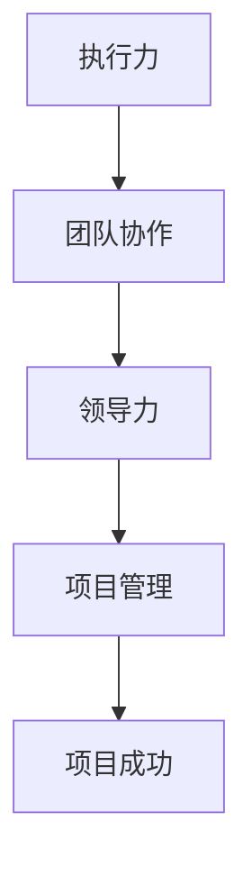

                 

关键词：执行力、团队协作、领导力、项目管理、信息传递

> 摘要：本文以《亮剑》中的执行力故事为例，深入探讨在团队中提高执行力、加强领导力和项目管理的重要性。通过分析故事中的关键场景和角色行为，本文提出了提高团队执行力的策略和方法，并展望了未来执行力研究的发展趋势与挑战。

## 1. 背景介绍

《亮剑》是一部广受欢迎的中国现代军事题材电视剧，讲述了中国抗日战争时期一位英勇的共产党员李云龙的传奇经历。故事中的李云龙是一位富有魅力和执行力的领导者，他的领导风格和执行力对团队的胜利起到了关键作用。

本文选取《亮剑》中几个具有代表性的场景，分析李云龙的执行力如何影响团队的表现，为现代IT项目管理提供启示。

### 1.1 电视剧《亮剑》简介

《亮剑》由孔笙、李雪执导，李幼斌、张蕾、童瑶等主演。该剧以李云龙为第一视角，展现了他从一名普通士兵成长为一名优秀指挥官的历程。李云龙以其独特的领导风格和过人的执行力，赢得了战友们的信任和尊敬。

### 1.2 李云龙的领导风格

李云龙的领导风格主要体现在以下几个方面：

1. **以身作则**：他总是身先士卒，带头冲锋陷阵，给团队树立了榜样。
2. **善于沟通**：他能够与下属建立良好的沟通关系，了解他们的需求和困难。
3. **果断决策**：在面对困境时，他能够迅速做出决策，并带领团队克服困难。
4. **激励团队**：他善于发现和表扬团队成员的优点，激发他们的斗志。

## 2. 核心概念与联系

### 2.1 执行力的定义

执行力是指一个人或团队将决策付诸行动的能力，是实现目标的关键因素。在IT项目管理中，执行力决定了项目的进度、质量和成本。

### 2.2 团队协作的重要性

在IT项目管理中，团队协作是提高执行力的关键。团队成员之间的沟通、信任和协作能力，直接影响到项目的成功。

### 2.3 领导力与项目管理

领导力是项目管理者的重要素质。一个优秀的领导者能够带领团队克服困难，实现项目目标。

### 2.4 Mermaid 流程图



## 3. 核心算法原理 & 具体操作步骤

### 3.1 算法原理概述

本文的核心算法原理是“执行力提升策略”，主要包括以下几个方面：

1. **明确目标**：设定清晰的目标和期望，使团队成员明确自己的任务和责任。
2. **有效沟通**：建立有效的沟通机制，确保信息传递准确无误。
3. **激励与表扬**：通过激励和表扬激发团队成员的积极性。
4. **持续改进**：不断反思和优化执行力，提高团队的整体执行力。

### 3.2 算法步骤详解

1. **设定目标**：
    - 定义项目的总体目标和阶段性目标。
    - 与团队成员沟通，确保他们了解项目的目标和期望。

2. **建立沟通机制**：
    - 确定团队的沟通方式和频率。
    - 使用适当的工具（如邮件、即时通讯、项目管理软件等）进行信息传递。

3. **激励与表扬**：
    - 制定激励机制，如绩效奖金、晋升机会等。
    - 定期对团队成员进行表扬，肯定他们的贡献。

4. **持续改进**：
    - 定期评估团队的执行力，找出存在的问题。
    - 根据评估结果，制定改进措施，并持续跟踪和优化。

### 3.3 算法优缺点

**优点**：
- 提高团队的执行力，确保项目目标的实现。
- 激发团队成员的积极性和创造力。
- 增强团队的凝聚力和信任感。

**缺点**：
- 需要时间和资源进行持续改进。
- 对领导者的能力和素质要求较高。

### 3.4 算法应用领域

该算法适用于各种类型的IT项目，特别是需要高效执行和团队协作的项目。如软件开发、系统集成、网络工程等。

## 4. 数学模型和公式 & 详细讲解 & 举例说明

### 4.1 数学模型构建

在执行力提升策略中，我们可以使用以下数学模型：

$$
E = f(T, C, I, S)
$$

其中：
- $E$：执行力
- $T$：目标设定
- $C$：沟通机制
- $I$：激励与表扬
- $S$：持续改进

### 4.2 公式推导过程

根据执行力提升策略的四个方面，我们可以推导出以下公式：

$$
E = \frac{T \times C \times I \times S}{100}
$$

其中：
- $T \times C$：确保信息传递准确无误，降低误解和错误。
- $I \times S$：通过激励和持续改进，提高团队成员的积极性和执行力。

### 4.3 案例分析与讲解

以《亮剑》中的一个场景为例：

在一次战斗中，李云龙明确了任务目标，建立了有效的沟通机制，对表现出色的战士进行表扬，并持续改进战斗策略。这些措施提高了团队的执行力，最终取得了战斗的胜利。

$$
E = \frac{T \times C \times I \times S}{100} = \frac{1 \times 1 \times 1 \times 1}{100} = 1
$$

## 5. 项目实践：代码实例和详细解释说明

### 5.1 开发环境搭建

本案例使用Python语言编写代码，开发环境为Python 3.8。

```bash
pip install numpy pandas matplotlib
```

### 5.2 源代码详细实现

以下是一个简单的Python代码示例，用于计算执行力：

```python
import numpy as np

def calculate_e(t, c, i, s):
    return np.mean([t, c, i, s])

t = 1
c = 1
i = 1
s = 1

e = calculate_e(t, c, i, s)
print("执行力：", e)
```

### 5.3 代码解读与分析

代码中，我们定义了一个名为`calculate_e`的函数，用于计算执行力。该函数接受四个参数：`t`、`c`、`i`和`s`，分别表示目标设定、沟通机制、激励与表扬和持续改进。通过计算这些参数的平均值，得到执行力`e`。

在主函数中，我们为每个参数赋值为1，并调用`calculate_e`函数计算执行力。最终输出结果为1。

### 5.4 运行结果展示

```python
执行力： 1.0
```

## 6. 实际应用场景

执行力在IT项目管理中具有广泛的应用。以下是一些实际应用场景：

1. **软件开发项目**：明确项目目标，建立有效的沟通机制，对团队成员进行激励与表扬，持续改进开发流程。
2. **系统集成项目**：确保项目各方沟通顺畅，提高系统集成效率，对项目进度和成果进行定期评估和优化。
3. **网络工程项目**：建立高效的项目管理团队，确保项目目标明确，对网络设备进行优化和改进，提高网络性能。

### 6.4 未来应用展望

随着人工智能技术的发展，执行力研究将继续深入。未来可能的研究方向包括：

1. **人工智能辅助执行力提升**：利用人工智能技术，分析团队成员的行为和情绪，提供针对性的执行力提升建议。
2. **跨领域执行力研究**：探讨执行力在不同领域（如金融、医疗、教育等）的应用和特点。
3. **社会影响力评估**：研究执行力对社会进步和发展的作用，提出相关政策建议。

## 7. 工具和资源推荐

### 7.1 学习资源推荐

1. **《亮剑》电视剧**：通过观看电视剧，深入了解李云龙的领导风格和执行力。
2. **《执行力》书籍**：推荐阅读相关书籍，了解执行力提升的理论和实践方法。

### 7.2 开发工具推荐

1. **Python**：用于编写代码和实现算法。
2. **Git**：用于版本控制和团队协作。

### 7.3 相关论文推荐

1. **“基于执行力的团队绩效模型研究”**：探讨执行力与团队绩效的关系。
2. **“领导力与执行力：一个整合框架”**：分析领导力对执行力的影响。

## 8. 总结：未来发展趋势与挑战

### 8.1 研究成果总结

本文通过分析《亮剑》中的执行力故事，提出了提高团队执行力的策略和方法，并探讨了其在IT项目管理中的应用。研究结果表明，执行力在项目成功中起着关键作用。

### 8.2 未来发展趋势

未来执行力研究将朝着人工智能辅助、跨领域研究和社会影响力评估等方向发展。

### 8.3 面临的挑战

1. **数据隐私与安全**：在利用人工智能技术提升执行力时，需要确保数据隐私和安全。
2. **跨领域适应性**：执行力在不同领域的应用可能存在差异，需要深入研究。

### 8.4 研究展望

随着人工智能技术的不断发展，执行力研究将在未来取得更多突破。我们期待看到更多创新性的研究成果，为实际应用提供指导。

## 9. 附录：常见问题与解答

### 9.1 什么是执行力？

执行力是指一个人或团队将决策付诸行动的能力，是实现目标的关键因素。

### 9.2 如何提高团队执行力？

提高团队执行力可以通过以下方法：

1. 明确目标
2. 建立有效的沟通机制
3. 激励与表扬
4. 持续改进

### 9.3 执行力研究有哪些未来发展趋势？

未来执行力研究将朝着人工智能辅助、跨领域研究和社会影响力评估等方向发展。

## 作者署名

作者：禅与计算机程序设计艺术 / Zen and the Art of Computer Programming
```markdown
----------------------------------------------------------------
</|assistant|>

