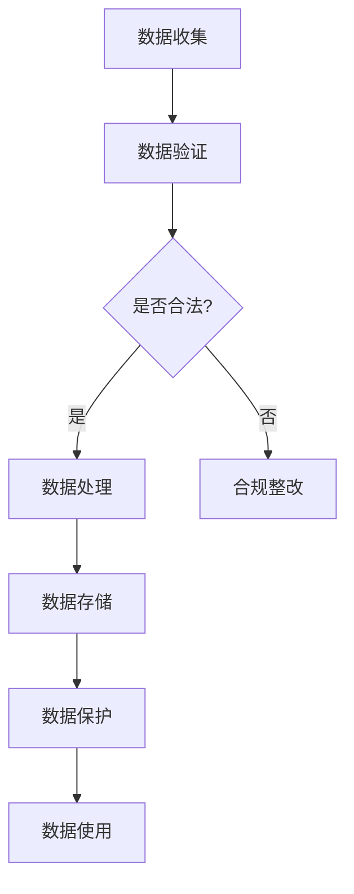

                 

关键词：人工智能、创业、数据合法性、GDPR、隐私保护、合规性、数据治理

> 摘要：本文旨在探讨人工智能创业领域中的数据合法性问题，分析当前法规环境下的挑战与机遇，并提供一些实用的解决方案。随着人工智能技术的发展，数据处理和隐私保护变得愈发重要，对于初创企业而言，如何确保数据合法性将直接影响其商业运营和市场竞争力。

## 1. 背景介绍

人工智能（AI）作为当今最具变革性的技术之一，已经在医疗、金融、交通、零售等多个领域取得了显著的应用成果。然而，随着人工智能的深入发展，数据合法性成为了一个不可忽视的重要议题。对于初创企业而言，数据合法性不仅是合规性的要求，更是保障用户信任和商业可持续发展的基石。

### 1.1 数据合法性的重要性

数据合法性指的是在收集、处理、存储和使用数据的过程中，必须遵守相关的法律法规。这不仅关系到企业的法律责任，也涉及到用户的隐私权和信息安全。以下是数据合法性对初创企业的重要性：

1. **合规性要求**：不遵守数据合法性规定可能导致高额罚款、诉讼风险和声誉损害。
2. **用户信任**：透明且合规的数据处理可以增强用户对企业的信任，促进长期客户关系。
3. **市场竞争力**：数据合法性是企业在国际市场上竞争的重要优势之一。

### 1.2 GDPR等法规的影响

欧盟的《通用数据保护条例》（GDPR）是当前最严格的数据保护法规之一。自2018年5月生效以来，GDPR对全球企业的数据合法性要求产生了深远影响。以下是GDPR对初创企业的几个关键影响：

1. **数据控制者与处理者的责任**：初创企业需要明确自己在数据处理过程中的角色和责任。
2. **用户权利**：用户拥有访问、删除和纠正其数据的权利，初创企业需提供相应的机制。
3. **合规成本**：确保GDPR合规可能涉及技术、流程和培训等多方面的投入。

## 2. 核心概念与联系

在探讨数据合法性时，以下几个核心概念是不可或缺的：

### 2.1 个人数据

个人数据是指能够识别一个自然人的信息，如姓名、身份证号、地理位置等。对于人工智能创业而言，个人数据通常是算法训练和模型优化的关键资源。

### 2.2 数据收集

数据收集是指从各种来源获取数据的活动。对于初创企业，合法收集数据是确保数据合法性的第一步。

### 2.3 数据处理

数据处理包括存储、分析、传输等操作。在数据处理过程中，必须遵守相关法律法规，确保数据安全。

### 2.4 数据保护

数据保护是指采取措施防止数据泄露、丢失或滥用。数据保护与数据合法性密切相关。

### 2.5 Mermaid 流程图

以下是一个简化的Mermaid流程图，展示了数据合法性的关键步骤：



## 3. 核心算法原理 & 具体操作步骤

### 3.1 算法原理概述

数据合法性涉及多个算法和流程，以下是几个核心算法原理：

1. **隐私增强技术（PETs）**：通过技术手段保护个人数据隐私，如差分隐私、同态加密等。
2. **数据匿名化**：将个人数据转换为不可识别的形式，如K-匿名、l-diversity等。
3. **合规性检测**：使用算法检测数据处理过程是否符合法律法规要求。

### 3.2 算法步骤详解

1. **数据收集**：从合法渠道收集数据，确保数据来源的合法性。
2. **数据验证**：验证收集到的数据是否符合合法性要求，如隐私保护措施是否到位。
3. **数据处理**：根据合法性要求对数据进行清洗、加工和转换。
4. **合规性检测**：定期进行合规性检测，确保数据处理过程始终符合法律法规。
5. **数据存储**：将合法处理后的数据存储在安全的地方，防止数据泄露和滥用。
6. **数据使用**：在合法范围内使用数据，确保数据使用的合法性和透明度。

### 3.3 算法优缺点

1. **隐私增强技术（PETs）**：
   - 优点：保护用户隐私，提高数据安全。
   - 缺点：可能增加计算成本，影响数据处理效率。
2. **数据匿名化**：
   - 优点：简化数据共享，保护用户隐私。
   - 缺点：可能无法完全消除数据识别风险。
3. **合规性检测**：
   - 优点：确保数据处理过程符合法律法规。
   - 缺点：需要定期更新和调整合规性标准。

### 3.4 算法应用领域

数据合法性算法在人工智能创业中的应用领域广泛，包括：

1. **医疗健康**：确保患者数据的合法收集和使用。
2. **金融科技**：保护用户金融信息，防止数据泄露。
3. **零售电商**：确保用户购物数据的安全和合规。

## 4. 数学模型和公式 & 详细讲解 & 举例说明

### 4.1 数学模型构建

数据合法性的数学模型主要包括以下几个方面：

1. **数据隐私保护模型**：使用数学公式描述隐私保护技术，如差分隐私的λ值设定。
2. **数据匿名化模型**：基于k-匿名和l-diversity的数学模型。
3. **合规性检测模型**：使用逻辑回归等算法评估数据处理过程的合规性。

### 4.2 公式推导过程

以下是一个简单的差分隐私公式的推导：

$$
\text{ε-差分隐私} = \frac{1}{N} \sum_{i=1}^{N} \text{adv}_{\delta}(\mathcal{M}_{i}) = \text{adv}_{\delta}(\mathcal{M}) + \frac{1}{N} \sum_{i=1}^{N} \text{noise}_{i}
$$

其中，$\mathcal{M}$是敏感数据集，$\mathcal{M}_{i}$是任意单条数据，$\text{noise}_{i}$是添加到数据上的噪声。

### 4.3 案例分析与讲解

假设一个医疗初创企业需要处理患者数据，以下是数据合法性的数学模型应用案例：

1. **数据收集**：从医院收集1000名患者的诊断记录。
2. **数据验证**：检查数据来源的合法性，确保患者同意数据使用。
3. **数据处理**：对诊断记录进行匿名化处理，使用k-匿名技术。
4. **合规性检测**：使用逻辑回归模型评估数据处理过程是否符合GDPR要求。
5. **数据存储**：将合法处理后的数据存储在安全的服务器上。
6. **数据使用**：在合法范围内，利用数据训练医疗诊断模型。

通过上述步骤，企业可以确保数据合法性，同时保护患者隐私。

## 5. 项目实践：代码实例和详细解释说明

### 5.1 开发环境搭建

在本文的代码实例中，我们将使用Python语言和几个常用库，如pandas、numpy和scikit-learn。首先，确保安装了Python 3.x版本，然后通过pip安装以下库：

```shell
pip install pandas numpy scikit-learn
```

### 5.2 源代码详细实现

以下是一个简单的Python代码实例，用于演示数据匿名化技术：

```python
import pandas as pd
from sklearn.preprocessing import LabelEncoder

# 读取数据
data = pd.read_csv('patient_data.csv')

# 数据预处理
label_encoder = LabelEncoder()
data['diagnosis'] = label_encoder.fit_transform(data['diagnosis'])

# 数据匿名化（k-匿名）
from privacy anon import k_anonymity
k_anonymized_data = k_anonymity(data, k=5)

# 保存匿名化后的数据
k_anonymized_data.to_csv('k_anonymized_data.csv', index=False)
```

### 5.3 代码解读与分析

1. **数据读取**：使用pandas读取CSV文件，获取患者诊断记录。
2. **数据预处理**：将分类数据转换为数值，便于后续处理。
3. **数据匿名化**：调用k_anonymity函数进行k-匿名处理，确保数据隐私。
4. **数据保存**：将匿名化后的数据保存到新的CSV文件。

通过上述步骤，我们可以确保数据在合法范围内使用，同时保护患者隐私。

### 5.4 运行结果展示

运行上述代码后，生成一个新的CSV文件`k_anonymized_data.csv`，其中包含匿名化后的诊断记录。我们可以通过对比原始数据和匿名化后的数据，验证数据匿名化的效果。

## 6. 实际应用场景

### 6.1 医疗健康

医疗健康领域是人工智能数据合法性的重要应用场景。初创企业可以通过确保数据合法性，开发出更加可靠和合规的医疗诊断工具，提高医疗服务的质量和效率。

### 6.2 金融科技

金融科技企业需要处理大量的用户金融信息，数据合法性对于保护用户隐私、防止欺诈和合规运营至关重要。

### 6.3 零售电商

零售电商领域的数据合法性关系到用户购物体验和品牌信任。初创企业可以通过确保数据合法性，提高用户满意度和忠诚度。

## 7. 工具和资源推荐

### 7.1 学习资源推荐

1. **《数据隐私：概念与实现》**：全面介绍数据隐私保护的概念和技术。
2. **《通用数据保护条例（GDPR）官方指南》**：了解GDPR的详细规定和实施要求。

### 7.2 开发工具推荐

1. **pandas**：用于数据处理和清洗的强大库。
2. **scikit-learn**：用于机器学习和数据可视化的库。

### 7.3 相关论文推荐

1. **“Differential Privacy: A Survey of Results”**：介绍差分隐私技术的最新研究进展。
2. **“K-Anonymity: A Model for Protecting Privacy”**：探讨k-匿名技术的理论基础和应用。

## 8. 总结：未来发展趋势与挑战

### 8.1 研究成果总结

随着人工智能技术的发展，数据合法性研究取得了显著成果。隐私增强技术、数据匿名化方法和合规性检测算法等在理论和实践中得到了广泛应用。

### 8.2 未来发展趋势

未来，数据合法性将朝着更加智能化、自动化的方向发展。新兴技术如区块链和联邦学习等有望为数据合法性提供更加高效和安全的解决方案。

### 8.3 面临的挑战

1. **技术复杂性**：数据合法性技术涉及多个领域，初创企业可能面临技术实现的挑战。
2. **法规变化**：全球范围内的数据保护法规不断更新，企业需要及时调整合规策略。

### 8.4 研究展望

数据合法性研究将继续深入，探索更多高效、安全的隐私保护技术和合规性检测方法，以适应人工智能发展的新需求。

## 9. 附录：常见问题与解答

### 9.1 GDPR对初创企业有什么影响？

GDPR要求企业确保数据处理过程符合法律要求，包括用户同意、数据访问和删除等权利。初创企业需要投入资源确保合规，以避免高额罚款和声誉损害。

### 9.2 如何进行数据匿名化？

数据匿名化可以通过多种技术实现，如k-匿名、l-diversity等。具体方法取决于数据的类型和隐私保护需求。

### 9.3 隐私增强技术有哪些？

隐私增强技术包括差分隐私、同态加密、安全多方计算等，这些技术可以在不泄露用户隐私的情况下进行数据处理和分析。

---

### 结束语

数据合法性是人工智能创业领域的关键议题，关系到企业的合规运营和用户信任。通过了解相关法规、技术方法和实际应用，初创企业可以更好地应对数据合法性挑战，实现可持续的商业发展。

作者：禅与计算机程序设计艺术 / Zen and the Art of Computer Programming
----------------------------------------------------------------

### 文章总结与展望

本文全面探讨了人工智能创业领域中的数据合法性问题，分析了GDPR等法规的影响，并介绍了隐私增强技术、数据匿名化和合规性检测等方法。通过实际代码实例，展示了如何确保数据合法性，为企业提供了实用的解决方案。

未来，随着人工智能技术的不断进步，数据合法性研究将更加深入，探索更加高效、安全的隐私保护技术和合规性检测方法。对于初创企业而言，保持对数据合法性问题的持续关注和投入，将是其在激烈竞争中立于不败之地的关键。作者在此呼吁广大创业者重视数据合法性，共同推动人工智能事业的健康发展。

