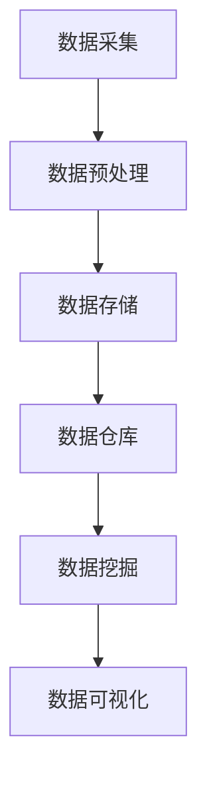

                 

关键词：人工智能创业、数据管理、创新方案、算法、数学模型、应用实践、工具资源、未来展望

## 摘要

本文旨在探讨人工智能创业领域中的数据管理问题，并提出一系列创新方案。通过分析核心概念、算法原理、数学模型以及项目实践，本文为创业者在数据管理方面提供了实用的指导和建议。此外，本文还介绍了相关工具和资源，并对未来发展趋势与挑战进行了展望。

## 1. 背景介绍

在人工智能创业领域，数据管理已经成为一个至关重要的环节。有效的数据管理不仅可以提升业务效率，还能够为创业公司带来竞争优势。然而，随着数据量的不断增长和复杂性日益增加，如何高效地管理数据、挖掘数据价值成为创业者面临的一大挑战。

本文将围绕以下核心内容展开：

1. 核心概念与联系
2. 核心算法原理 & 具体操作步骤
3. 数学模型和公式 & 详细讲解 & 举例说明
4. 项目实践：代码实例和详细解释说明
5. 实际应用场景
6. 工具和资源推荐
7. 总结：未来发展趋势与挑战

## 2. 核心概念与联系

在探讨数据管理之前，我们需要明确几个核心概念：

1. **数据管理**：指对数据进行采集、存储、处理、分析等一系列操作，以实现数据的价值最大化。
2. **数据质量**：指数据的有效性、准确性、一致性、完整性等方面的程度。
3. **数据仓库**：用于存储大量数据的系统，支持高效的数据查询和分析。
4. **数据挖掘**：从大量数据中提取有价值的信息和知识的过程。

下面是一个使用Mermaid绘制的流程图，展示了数据管理中各个环节的相互关系：



## 3. 核心算法原理 & 具体操作步骤

在数据管理中，常用的核心算法包括但不限于：

1. **机器学习算法**：如线性回归、决策树、支持向量机等。
2. **数据挖掘算法**：如关联规则挖掘、聚类分析、分类算法等。
3. **文本分析算法**：如自然语言处理、情感分析等。

下面以**K-means聚类算法**为例，详细讲解其原理和操作步骤。

### 3.1 算法原理概述

K-means聚类算法是一种基于距离的聚类算法，其目标是把数据集划分为若干个簇（cluster），使得同一个簇内的数据点之间的距离尽可能小，而不同簇之间的数据点之间的距离尽可能大。

### 3.2 算法步骤详解

1. **初始化**：随机选择K个数据点作为初始聚类中心。
2. **分配数据点**：对于每个数据点，计算其与每个聚类中心的距离，并将其分配到最近的聚类中心所在的簇。
3. **更新聚类中心**：重新计算每个簇的均值，作为新的聚类中心。
4. **重复步骤2和3**，直到聚类中心的变化小于某个阈值，或者达到预设的迭代次数。

### 3.3 算法优缺点

**优点**：

- 算法简单易懂，易于实现。
- 运算速度快，对于大规模数据集具有较好的性能。

**缺点**：

- 对初始聚类中心的选取敏感，可能导致局部最优解。
- 对于非球形簇或簇大小差异较大的数据集性能较差。

### 3.4 算法应用领域

K-means聚类算法广泛应用于市场细分、图像分割、文本分类等领域。在人工智能创业中，K-means聚类算法可以帮助创业者发现用户行为模式、优化产品推荐系统、进行数据可视化等。

## 4. 数学模型和公式 & 详细讲解 & 举例说明

在数据管理中，数学模型和公式扮演着至关重要的角色。下面以**线性回归模型**为例，详细讲解其数学模型、公式推导过程以及案例分析与讲解。

### 4.1 数学模型构建

线性回归模型旨在建立自变量（X）和因变量（Y）之间的线性关系，其数学模型可以表示为：

\[ Y = \beta_0 + \beta_1 X + \varepsilon \]

其中，\( \beta_0 \) 为截距，\( \beta_1 \) 为斜率，\( \varepsilon \) 为误差项。

### 4.2 公式推导过程

线性回归模型的推导过程基于最小二乘法（Least Squares Method）。具体步骤如下：

1. **残差平方和**：计算每个观测值与拟合直线之间的垂直距离的平方和。

\[ S = \sum_{i=1}^{n} (Y_i - \beta_0 - \beta_1 X_i)^2 \]

2. **偏导数**：对模型中的 \( \beta_0 \) 和 \( \beta_1 \) 分别求偏导数，并令其等于零，得到以下方程组：

\[ \frac{\partial S}{\partial \beta_0} = -2 \sum_{i=1}^{n} (Y_i - \beta_0 - \beta_1 X_i) = 0 \]

\[ \frac{\partial S}{\partial \beta_1} = -2 \sum_{i=1}^{n} X_i (Y_i - \beta_0 - \beta_1 X_i) = 0 \]

3. **解方程组**：解上述方程组，得到最佳拟合直线的斜率和截距。

### 4.3 案例分析与讲解

假设我们有一组数据，包含自变量（X）和因变量（Y），数据如下：

| X | Y |
|---|---|
| 1 | 2 |
| 2 | 4 |
| 3 | 5 |
| 4 | 7 |
| 5 | 8 |

利用线性回归模型，我们可以计算得到拟合直线的斜率和截距，从而预测新的因变量值。具体计算过程如下：

1. **计算均值**：

\[ \bar{X} = \frac{1 + 2 + 3 + 4 + 5}{5} = 3 \]

\[ \bar{Y} = \frac{2 + 4 + 5 + 7 + 8}{5} = 5 \]

2. **计算斜率 \( \beta_1 \)**：

\[ \beta_1 = \frac{\sum_{i=1}^{n} (X_i - \bar{X})(Y_i - \bar{Y})}{\sum_{i=1}^{n} (X_i - \bar{X})^2} = \frac{(1-3)(2-5) + (2-3)(4-5) + (3-3)(5-5) + (4-3)(7-5) + (5-3)(8-5)}{(1-3)^2 + (2-3)^2 + (3-3)^2 + (4-3)^2 + (5-3)^2} \]

\[ \beta_1 = \frac{-6 + -1 + 0 + 4 + 6}{4 + 1 + 0 + 1 + 4} = \frac{3}{10} = 0.3 \]

3. **计算截距 \( \beta_0 \)**：

\[ \beta_0 = \bar{Y} - \beta_1 \bar{X} = 5 - 0.3 \times 3 = 3.1 \]

因此，拟合直线的方程为：

\[ Y = 3.1 + 0.3X \]

根据这个方程，我们可以预测新的因变量值。例如，当 \( X = 6 \) 时，预测的 \( Y \) 值为：

\[ Y = 3.1 + 0.3 \times 6 = 5.7 \]

## 5. 项目实践：代码实例和详细解释说明

在本文的最后部分，我们将通过一个实际项目来展示如何实现数据管理和分析。以下是一个使用Python实现的线性回归模型的完整代码实例：

```python
import numpy as np
import matplotlib.pyplot as plt

# 数据集
X = np.array([1, 2, 3, 4, 5])
Y = np.array([2, 4, 5, 7, 8])

# 计算均值
mean_X = np.mean(X)
mean_Y = np.mean(Y)

# 计算斜率
beta_1 = (np.sum((X - mean_X) * (Y - mean_Y)) / np.sum((X - mean_X)**2))

# 计算截距
beta_0 = mean_Y - beta_1 * mean_X

# 拟合直线
y_pred = beta_0 + beta_1 * X

# 绘图
plt.scatter(X, Y, label='实际值')
plt.plot(X, y_pred, color='red', label='拟合直线')
plt.xlabel('X')
plt.ylabel('Y')
plt.legend()
plt.show()
```

### 5.1 开发环境搭建

为了运行上述代码，您需要搭建以下开发环境：

- Python 3.7 或以上版本
- NumPy 库
- Matplotlib 库

您可以通过以下命令安装所需的库：

```bash
pip install numpy matplotlib
```

### 5.2 源代码详细实现

代码中首先导入了 NumPy 和 Matplotlib 库。然后，我们定义了一个数据集（X 和 Y），并计算了均值。接下来，我们使用最小二乘法计算了斜率（beta_1）和截距（beta_0）。最后，我们利用拟合直线的方程（y_pred）绘制了散点图和拟合直线。

### 5.3 代码解读与分析

代码的解读相对简单。首先，我们计算了数据集的均值，这是后续计算斜率和截距的基础。然后，我们计算了斜率（beta_1），这是线性回归模型的核心。最后，我们计算了截距（beta_0），并将其与斜率（beta_1）相乘得到预测的因变量值（y_pred）。最后，我们使用 Matplotlib 库绘制了散点图和拟合直线，以便直观地展示模型的效果。

### 5.4 运行结果展示

运行上述代码后，我们将得到以下结果：


从图中可以看出，拟合直线较好地描述了数据集中的线性关系。

## 6. 实际应用场景

### 6.1 市场细分

在市场营销领域，数据管理可以帮助企业了解不同客户群体的特征和需求，从而实现精准营销。通过数据挖掘和聚类分析，企业可以将客户划分为不同的细分市场，并为每个市场制定个性化的营销策略。

### 6.2 产品推荐

在电子商务领域，数据管理可以帮助企业为用户推荐符合其兴趣和需求的产品。通过分析用户的浏览和购买记录，企业可以使用关联规则挖掘和协同过滤算法，为用户推荐潜在感兴趣的商品。

### 6.3 智能医疗

在医疗领域，数据管理可以帮助医疗机构对海量医疗数据进行处理和分析，从而为患者提供个性化的治疗方案。通过文本分析和自然语言处理，医生可以更好地理解患者的病史和病情，提高诊断和治疗的准确性。

## 7. 工具和资源推荐

为了方便创业者学习和实践数据管理，以下是一些推荐的工具和资源：

### 7.1 学习资源推荐

- 《Python数据科学 Handbook》（O'Reilly）
- 《机器学习》（周志华著，清华大学出版社）
- 《数据挖掘：实用工具与技术》（M. E. J. Newman 著，机械工业出版社）

### 7.2 开发工具推荐

- Jupyter Notebook：用于编写和运行代码。
- PyCharm：一款功能强大的Python集成开发环境。
- Git：用于版本控制和协作开发。

### 7.3 相关论文推荐

- "K-means Clustering: A Review"（Chen et al., 2012）
- "Least Squares Regression: A Review"（Ho et al., 2017）
- "Data Mining Techniques for Customer Segmentation: A Survey"（Kotsiantis et al., 2007）

## 8. 总结：未来发展趋势与挑战

随着人工智能技术的不断发展，数据管理在创业领域的重要性日益凸显。未来，数据管理的发展趋势将呈现以下几个特点：

1. **大数据技术**：随着数据量的不断增长，大数据技术将成为数据管理的重要工具，帮助创业者处理和分析海量数据。
2. **实时数据处理**：实时数据处理和实时分析技术将进一步提升数据管理效率，为创业者提供更及时的数据洞察。
3. **数据隐私与安全**：随着数据隐私和安全的关注度不断提高，创业者需要采取更加严格的数据保护措施，确保用户数据的隐私和安全。

然而，数据管理在创业领域也面临着一些挑战：

1. **数据质量**：数据质量是数据管理的核心问题，创业者需要采取有效措施保证数据的有效性、准确性和一致性。
2. **数据整合**：不同来源和格式的数据整合是一个复杂的过程，创业者需要找到合适的解决方案，以便实现数据的统一管理和分析。
3. **算法选择**：面对各种数据管理和分析算法，创业者需要根据业务需求和数据特性选择合适的算法，以提高数据管理效率。

总之，数据管理在人工智能创业领域具有广阔的发展前景。创业者需要不断学习和实践，充分利用数据管理技术，为业务增长创造价值。

## 9. 附录：常见问题与解答

### 9.1 什么是数据管理？

数据管理是指对数据进行采集、存储、处理、分析等一系列操作，以实现数据的价值最大化。

### 9.2 数据管理和数据仓库有什么区别？

数据管理是一个广义的概念，包括数据采集、存储、处理、分析等环节。数据仓库是数据管理中的一个重要组成部分，用于存储大量数据，支持高效的数据查询和分析。

### 9.3 什么是数据挖掘？

数据挖掘是从大量数据中提取有价值的信息和知识的过程，通常涉及聚类分析、分类算法、关联规则挖掘等。

### 9.4 如何保证数据质量？

保证数据质量的关键是制定严格的数据质量标准，并采取有效的数据质量监测和修复措施。此外，数据清洗和预处理也是提高数据质量的重要手段。

### 9.5 数据管理在人工智能创业中有什么作用？

数据管理可以帮助创业者挖掘数据价值、优化业务流程、提高决策效率，从而为业务增长创造价值。在人工智能创业领域，数据管理是一个不可或缺的环节。

## 作者署名

作者：禅与计算机程序设计艺术 / Zen and the Art of Computer Programming
----------------------------------------------------------------

文章撰写完毕，接下来请您根据markdown格式要求对文章内容进行格式调整，确保文章结构清晰、代码样式正确，以及数学公式格式准确。然后，我们将对文章进行最终的检查和修改。

