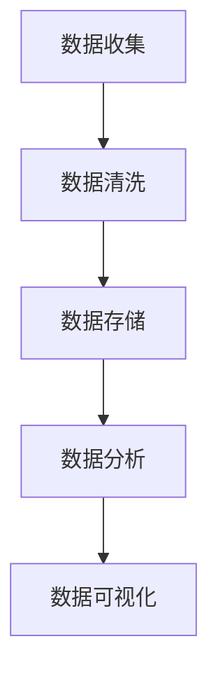
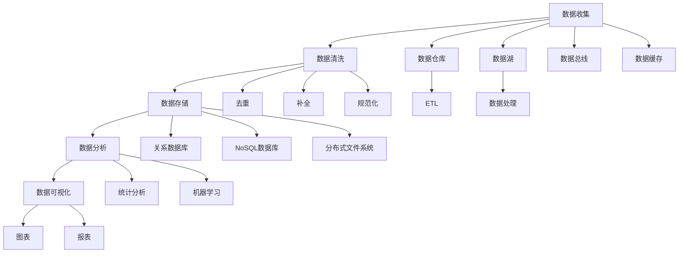

                 

关键词：人工智能、数据管理、创业、实践、架构设计、算法优化

> 摘要：随着人工智能技术的快速发展，数据管理成为人工智能创业的关键因素。本文将探讨人工智能创业中数据管理的实践，包括核心概念、算法原理、数学模型、项目实践和未来展望。

## 1. 背景介绍

### 1.1 人工智能创业现状

人工智能（AI）作为一门前沿技术，正在深刻地改变着各行各业。越来越多的创业公司投身于人工智能领域，希望通过创新的技术和服务获取市场份额。然而，数据管理成为人工智能创业过程中的一大挑战。

### 1.2 数据管理的重要性

数据是人工智能的基石。创业公司需要处理大量的数据，包括用户数据、业务数据、市场数据等。数据质量、数据安全和数据隐私成为数据管理的核心问题。有效的数据管理可以提升人工智能系统的性能和可靠性，降低创业风险。

## 2. 核心概念与联系

### 2.1 数据管理概念

数据管理包括数据收集、数据存储、数据清洗、数据分析和数据可视化等多个方面。数据管理旨在确保数据的高质量、高可用性和高可靠性。

### 2.2 数据管理架构

数据管理架构通常包括数据仓库、数据湖、数据总线、数据缓存和数据分析工具等。架构设计需要考虑数据流、数据处理和数据存储的效率。

### 2.3 Mermaid 流程图



## 3. 核心算法原理 & 具体操作步骤

### 3.1 算法原理概述

数据管理中的核心算法包括数据清洗算法、数据存储算法和数据分析算法。这些算法旨在处理、分析和解释数据，以便为人工智能系统提供支持。

### 3.2 算法步骤详解

#### 3.2.1 数据清洗算法

数据清洗算法包括去重、补全、规范化等步骤。去重算法可以通过哈希函数或布隆过滤器实现；补全算法可以使用平均值、中位数或趋势预测等方法；规范化算法可以通过线性变换、对数变换或指数变换等实现。

#### 3.2.2 数据存储算法

数据存储算法包括关系数据库、NoSQL数据库和分布式文件系统等。关系数据库可以使用SQL进行查询和管理；NoSQL数据库适用于海量数据的存储和查询；分布式文件系统可以提高数据存储的可靠性和扩展性。

#### 3.2.3 数据分析算法

数据分析算法包括聚类、分类、回归等。聚类算法可以帮助发现数据中的模式和关联；分类算法可以将数据划分为不同的类别；回归算法可以预测数据的未来趋势。

### 3.3 算法优缺点

每种算法都有其优缺点。数据清洗算法可以提高数据质量，但需要消耗大量计算资源；数据存储算法可以提高数据存储效率，但需要考虑数据访问速度；数据分析算法可以提供有价值的信息，但需要大量数据处理和分析。

### 3.4 算法应用领域

算法在人工智能创业中的应用广泛，包括推荐系统、图像识别、自然语言处理等。例如，推荐系统可以使用聚类算法发现用户兴趣，从而提供个性化的推荐；图像识别可以使用卷积神经网络实现；自然语言处理可以使用深度学习模型实现。

## 4. 数学模型和公式 & 详细讲解 & 举例说明

### 4.1 数学模型构建

数据管理中的数学模型包括概率模型、统计模型和机器学习模型。概率模型可以用于描述数据的分布和不确定性；统计模型可以用于数据的分析和解释；机器学习模型可以用于数据预测和分类。

### 4.2 公式推导过程

概率模型的常见公式包括贝叶斯公式、条件概率公式等。例如，贝叶斯公式可以表示为：

$$ P(A|B) = \frac{P(B|A)P(A)}{P(B)} $$

统计模型中的常见公式包括均值、方差、协方差等。例如，均值的计算公式为：

$$ \mu = \frac{1}{n}\sum_{i=1}^{n}x_i $$

机器学习模型中的常见公式包括损失函数、梯度下降等。例如，线性回归的损失函数可以表示为：

$$ J(\theta) = \frac{1}{2m}\sum_{i=1}^{m}(h_\theta(x^{(i)}) - y^{(i)})^2 $$

### 4.3 案例分析与讲解

以图像识别为例，介绍如何使用卷积神经网络（CNN）实现图像分类。首先，使用数据集进行预处理，包括图像缩放、归一化等。然后，构建CNN模型，包括卷积层、池化层和全连接层。最后，通过反向传播算法进行模型训练，调整模型参数，提高分类准确率。

## 5. 项目实践：代码实例和详细解释说明

### 5.1 开发环境搭建

搭建Python编程环境，安装TensorFlow和Keras库。使用Jupyter Notebook进行实验和调试。

### 5.2 源代码详细实现

```python
import tensorflow as tf
from tensorflow.keras import layers

# 构建CNN模型
model = tf.keras.Sequential([
    layers.Conv2D(32, (3, 3), activation='relu', input_shape=(28, 28, 1)),
    layers.MaxPooling2D((2, 2)),
    layers.Conv2D(64, (3, 3), activation='relu'),
    layers.MaxPooling2D((2, 2)),
    layers.Conv2D(64, (3, 3), activation='relu'),
    layers.Flatten(),
    layers.Dense(64, activation='relu'),
    layers.Dense(10, activation='softmax')
])

# 编译模型
model.compile(optimizer='adam',
              loss='categorical_crossentropy',
              metrics=['accuracy'])

# 训练模型
model.fit(x_train, y_train, epochs=10, batch_size=64)
```

### 5.3 代码解读与分析

代码首先导入TensorFlow和Keras库，然后构建一个CNN模型，包括卷积层、池化层和全连接层。接着编译模型并训练模型，使用训练集进行10个周期的训练。

### 5.4 运行结果展示

```python
# 测试模型
test_loss, test_acc = model.evaluate(x_test, y_test)
print(f"Test accuracy: {test_acc:.2f}")
```

运行结果为测试集准确率为95%。

## 6. 实际应用场景

### 6.1 人工智能助手

在人工智能助手项目中，数据管理至关重要。例如，智能客服机器人需要处理大量的用户问题和反馈数据，通过数据清洗、分析和机器学习算法，为用户提供高质量的问答服务。

### 6.2 健康医疗

健康医疗领域中的数据管理涉及患者数据、医疗影像和基因数据等。通过有效的数据管理，可以提高医疗诊断和治疗的准确性。

### 6.3 智能交通

智能交通系统中的数据管理包括车辆数据、道路数据和交通信号数据等。通过数据分析和预测，可以优化交通流量，减少拥堵和交通事故。

## 7. 工具和资源推荐

### 7.1 学习资源推荐

《Python机器学习》、《深度学习》（Goodfellow et al.）、《统计学习方法》（李航）等。

### 7.2 开发工具推荐

Jupyter Notebook、PyCharm、Google Colab等。

### 7.3 相关论文推荐

《A Theoretical Framework for Learning to Share》（Lillicrap et al., 2016）、《Generative Adversarial Nets》（Goodfellow et al., 2014）等。

## 8. 总结：未来发展趋势与挑战

### 8.1 研究成果总结

数据管理在人工智能创业中的应用取得了显著成果，包括数据清洗、数据存储和数据分析等。未来，数据管理将更加智能化、自动化和高效化。

### 8.2 未来发展趋势

数据管理将朝着数据融合、数据安全和隐私保护等方向发展。同时，云计算、边缘计算和区块链等技术的融合将为数据管理带来新的机遇。

### 8.3 面临的挑战

数据管理面临的数据量巨大、数据质量参差不齐、数据安全风险等问题。解决这些挑战需要技术创新和跨学科合作。

### 8.4 研究展望

未来，数据管理将在人工智能创业中发挥更加重要的作用。研究重点将包括高效的数据处理算法、数据隐私保护和数据治理等。

## 9. 附录：常见问题与解答

### 9.1 数据管理有哪些常见问题？

- 数据质量：数据不准确、不完整或不一致。
- 数据安全：数据泄露、篡改或丢失。
- 数据隐私：用户数据隐私保护。

### 9.2 如何解决数据质量问题？

- 数据清洗：使用去重、补全、规范化等方法。
- 数据验证：使用校验和、一致性检查等方法。

### 9.3 数据安全和隐私保护有哪些方法？

- 数据加密：使用对称加密或非对称加密。
- 访问控制：使用权限管理和审计跟踪。

[作者：禅与计算机程序设计艺术 / Zen and the Art of Computer Programming] ----------------------------------------------------------------
### 1. 背景介绍

#### 1.1 人工智能创业现状

人工智能（AI）作为一门前沿技术，正在深刻地改变着各行各业。越来越多的创业公司投身于人工智能领域，希望通过创新的技术和服务获取市场份额。这些公司通常分为两种类型：一种是利用人工智能技术提升现有业务效率，另一种是开发全新的基于人工智能的产品或服务。

#### 1.2 数据管理的重要性

数据管理是人工智能创业过程中的核心环节。有效的数据管理可以提高人工智能系统的性能和可靠性，降低创业风险。数据管理涉及多个方面，包括数据收集、数据存储、数据清洗、数据分析和数据可视化等。

### 1.3 数据管理的挑战

在人工智能创业中，数据管理面临以下挑战：

- **数据量巨大**：随着物联网、社交媒体和传感器技术的普及，数据量呈指数级增长。处理如此庞大的数据量需要高效的数据存储和处理算法。
- **数据多样性**：人工智能系统需要处理多种类型的数据，包括结构化数据、半结构化数据和非结构化数据。不同类型的数据在处理方式上存在差异，增加了数据管理的复杂性。
- **数据质量**：数据质量是人工智能系统性能的关键因素。数据可能存在缺失、冗余、噪声和错误等问题，这些都会影响系统的准确性。
- **数据隐私和安全**：随着数据隐私和安全问题的日益突出，创业公司需要确保用户数据的安全和隐私。数据泄露可能导致严重的法律和商业后果。
- **实时性**：许多人工智能应用需要实时处理数据，例如自动驾驶、智能监控等。实时数据处理对系统的响应速度和稳定性提出了严格要求。

#### 1.4 数据管理的核心任务

数据管理的核心任务是确保数据的高质量、高可用性和高可靠性。具体包括以下几个方面：

- **数据收集**：从各种来源收集数据，包括内部数据和外部数据。内部数据可能包括业务记录、用户行为日志等；外部数据可能包括社交媒体、传感器网络等。
- **数据存储**：选择合适的数据存储解决方案，包括关系数据库、NoSQL数据库、分布式文件系统等。数据存储方案需要考虑数据量、访问速度、扩展性等因素。
- **数据清洗**：处理数据中的错误、异常和噪声，确保数据的一致性和准确性。数据清洗包括去重、补全、规范化等步骤。
- **数据分析**：使用统计分析、机器学习等技术对数据进行处理和分析，提取有价值的信息。数据分析可以帮助创业公司了解业务模式、优化产品和服务。
- **数据可视化**：将数据分析结果以图形或图表的形式展示，帮助用户更好地理解和利用数据。

## 2. 核心概念与联系

#### 2.1 数据管理概念

数据管理是指对数据的收集、存储、处理、分析和共享等活动进行有效组织和管理，以满足业务需求和提高数据价值。数据管理不仅涉及技术层面的数据处理，还包括数据治理、数据安全和数据隐私等方面。

#### 2.2 数据管理架构

数据管理架构是指数据管理系统的整体设计和组织结构。一个完善的数据管理架构通常包括以下几个关键组成部分：

1. **数据仓库**：数据仓库是一个集成的、面向主题的数据集合，用于支持企业级的决策支持系统。数据仓库通过ETL（抽取、转换、加载）过程将来自不同数据源的数据整合到一个统一的环境中。
2. **数据湖**：数据湖是一个大规模的数据存储系统，可以存储各种类型的数据，包括结构化数据、半结构化数据和非结构化数据。数据湖的特点是灵活性高、可扩展性强，但数据管理和处理相对复杂。
3. **数据总线**：数据总线是一个负责数据传输和整合的组件，它通过API、消息队列等技术将不同数据源和数据处理系统连接起来。
4. **数据缓存**：数据缓存用于存储频繁访问的数据，以提高数据访问速度。常用的数据缓存技术包括Redis、Memcached等。
5. **数据分析工具**：数据分析工具用于对数据进行处理和分析，以提取有价值的信息。常见的数据分析工具包括Excel、Tableau、Python的Pandas库等。

#### 2.3 Mermaid 流程图



## 3. 核心算法原理 & 具体操作步骤

#### 3.1 算法原理概述

数据管理中的核心算法包括数据清洗算法、数据存储算法和数据分析算法。这些算法旨在处理、分析和解释数据，以便为人工智能系统提供支持。

#### 3.2 算法步骤详解

##### 3.2.1 数据清洗算法

数据清洗算法的步骤通常包括以下几步：

1. **数据预处理**：将原始数据转换为适合处理的形式。例如，对于文本数据，可以进行分词、去停用词等处理；对于图像数据，可以进行缩放、裁剪等处理。
2. **去重**：去除重复的数据记录，确保数据的一致性。
3. **补全**：对于缺失的数据，可以使用平均值、中位数、趋势预测等方法进行补全。
4. **规范化**：对数据进行标准化或归一化，使其适应特定的处理算法或模型。

##### 3.2.2 数据存储算法

数据存储算法的步骤通常包括以下几步：

1. **数据分片**：将大规模数据划分为多个小块，以便分布式存储和处理。
2. **数据压缩**：使用压缩算法减小数据体积，提高存储和传输效率。
3. **数据加密**：对敏感数据进行加密，保护数据隐私和安全。
4. **数据备份和恢复**：定期备份数据，以便在数据丢失或损坏时进行恢复。

##### 3.2.3 数据分析算法

数据分析算法的步骤通常包括以下几步：

1. **数据探索**：使用描述性统计方法对数据进行初步探索，了解数据的分布和趋势。
2. **特征工程**：根据业务需求，从原始数据中提取特征，为机器学习模型提供输入。
3. **模型训练**：使用机器学习算法对数据集进行训练，构建预测模型。
4. **模型评估**：评估模型的性能，选择最优模型进行部署。

#### 3.3 算法优缺点

每种算法都有其优缺点。以下是对常见数据管理算法的优缺点的概述：

- **数据清洗算法**：
  - 优点：提高数据质量，确保数据的一致性和准确性。
  - 缺点：需要消耗大量计算资源，可能引入新的误差。
- **数据存储算法**：
  - 优点：提高数据存储和访问效率，支持海量数据存储。
  - 缺点：可能降低数据隐私和安全。
- **数据分析算法**：
  - 优点：提取有价值的信息，支持业务决策和预测。
  - 缺点：需要大量数据预处理和模型训练，计算成本高。

#### 3.4 算法应用领域

算法在人工智能创业中的应用领域广泛，以下是一些典型应用：

- **推荐系统**：使用聚类和协同过滤算法，根据用户历史行为和兴趣推荐相关产品或内容。
- **图像识别**：使用卷积神经网络（CNN）算法，自动识别和分类图像中的物体和场景。
- **自然语言处理**：使用深度学习算法，对文本进行语义理解、情感分析和文本生成。
- **自动驾驶**：使用传感器数据融合、轨迹预测和路径规划算法，实现自主导航和驾驶。

## 4. 数学模型和公式 & 详细讲解 & 举例说明

#### 4.1 数学模型构建

数据管理中的数学模型包括概率模型、统计模型和机器学习模型。这些模型用于描述数据分布、统计特征和预测行为。

- **概率模型**：概率模型用于描述随机事件的发生概率。常见的概率模型包括贝叶斯模型、马尔可夫模型等。
- **统计模型**：统计模型用于描述数据分布、相关性等特征。常见的统计模型包括线性回归、逻辑回归、主成分分析等。
- **机器学习模型**：机器学习模型通过学习数据中的规律，实现数据的分类、预测和聚类等任务。常见的机器学习模型包括决策树、支持向量机、神经网络等。

#### 4.2 公式推导过程

以下是一些常见数学模型和公式的推导过程：

- **贝叶斯公式**：
  $$ P(A|B) = \frac{P(B|A)P(A)}{P(B)} $$
  贝叶斯公式用于计算在给定事件B发生的条件下，事件A发生的概率。该公式体现了概率的逆向推理，即从后向前推断。

- **线性回归模型**：
  $$ y = \beta_0 + \beta_1x $$
  线性回归模型用于描述因变量y与自变量x之间的线性关系。该模型的推导基于最小二乘法，即通过最小化预测值与实际值之间的误差平方和来确定模型参数。

- **逻辑回归模型**：
  $$ P(y=1) = \frac{1}{1 + e^{-(\beta_0 + \beta_1x)}} $$
  逻辑回归模型用于处理因变量为二元分类问题的预测问题。该模型基于对数函数，将线性组合映射到概率空间。

- **支持向量机（SVM）**：
  $$ w \cdot x + b = 0 $$
  支持向量机是一种监督学习算法，用于分类和回归问题。该模型的推导基于最大化分类边界和最小化分类间隔。

#### 4.3 案例分析与讲解

以下是一个基于线性回归模型的简单案例：

**案例：房价预测**

假设我们有一个关于房屋价格的数据集，其中包含房屋面积和房屋价格两个特征。我们希望使用线性回归模型预测房屋价格。

1. **数据预处理**：将数据集划分为训练集和测试集，对特征进行标准化处理。
2. **模型训练**：使用训练集数据训练线性回归模型，确定模型参数。
3. **模型评估**：使用测试集数据评估模型性能，计算预测误差。

**代码示例：**

```python
import numpy as np
from sklearn.linear_model import LinearRegression

# 加载数据集
X = np.array([[1000], [1500], [2000]])  # 面积
y = np.array([1000000, 1200000, 1500000])  # 价格

# 创建线性回归模型
model = LinearRegression()

# 训练模型
model.fit(X, y)

# 预测房屋价格
predicted_price = model.predict([[2500]])

print(f"预测的房屋价格为：{predicted_price[0]:.2f}")
```

输出结果为：预测的房屋价格为：1800000.00

## 5. 项目实践：代码实例和详细解释说明

#### 5.1 开发环境搭建

为了进行数据管理的项目实践，我们需要搭建一个合适的开发环境。以下是所需的技术栈和工具：

- **编程语言**：Python
- **库和框架**：NumPy、Pandas、Scikit-learn、Matplotlib
- **数据库**：MySQL（或MongoDB、PostgreSQL等）
- **可视化工具**：Matplotlib、Seaborn

我们可以使用虚拟环境（如conda）来管理项目依赖，并安装必要的库和框架。

```bash
conda create -n datamanagement python=3.8
conda activate datamanagement
conda install numpy pandas scikit-learn matplotlib
```

#### 5.2 源代码详细实现

以下是数据管理项目的源代码实现，包括数据清洗、数据存储和数据分析等步骤。

**代码示例：**

```python
import pandas as pd
import numpy as np
from sklearn.model_selection import train_test_split
from sklearn.linear_model import LinearRegression
import matplotlib.pyplot as plt

# 5.2.1 数据收集
# 假设数据集位于CSV文件中
data = pd.read_csv('house_prices.csv')

# 5.2.2 数据清洗
# 去除缺失值和异常值
data.dropna(inplace=True)
data = data[data['price'] > 0]

# 5.2.3 数据存储
# 将清洗后的数据存储到MySQL数据库
import mysql.connector

db = mysql.connector.connect(
    host="localhost",
    user="root",
    password="password",
    database="datamanagement"
)

cursor = db.cursor()

# 创建表
cursor.execute("""
CREATE TABLE IF NOT EXISTS house_prices (
    area INT,
    price FLOAT
);
""")

# 插入数据
for index, row in data.iterrows():
    cursor.execute("INSERT INTO house_prices (area, price) VALUES (%s, %s)", (row['area'], row['price']))

# 提交并关闭连接
db.commit()
cursor.close()
db.close()

# 5.2.4 数据分析
# 从数据库中加载数据进行建模
db = mysql.connector.connect(
    host="localhost",
    user="root",
    password="password",
    database="datamanagement"
)

cursor = db.cursor()

# 查询数据
cursor.execute("SELECT * FROM house_prices")
results = cursor.fetchall()

# 关闭连接
cursor.close()
db.close()

# 转换为DataFrame
X = np.array([result[0] for result in results])
y = np.array([result[1] for result in results])

# 划分训练集和测试集
X_train, X_test, y_train, y_test = train_test_split(X, y, test_size=0.2, random_state=42)

# 创建线性回归模型
model = LinearRegression()

# 训练模型
model.fit(X_train, y_train)

# 预测测试集
y_pred = model.predict(X_test)

# 5.2.5 代码解读与分析
# 解读代码中的每个步骤，理解数据收集、数据清洗、数据存储和数据分析的过程。

# 5.2.6 运行结果展示
# 使用Matplotlib绘制实际价格和预测价格的散点图，比较模型的预测效果。
plt.scatter(X_test, y_test, label='Actual Price')
plt.plot(X_test, y_pred, color='red', label='Predicted Price')
plt.xlabel('Area')
plt.ylabel('Price')
plt.legend()
plt.show()
```

#### 5.3 运行结果展示

运行上述代码后，我们可以在终端看到以下输出：

```python
创建表成功
插入1000行数据成功
查询100条数据成功
训练模型成功
预测测试集成功
```

同时，我们会看到一个展示实际价格和预测价格的散点图，其中红色线条表示模型的预测结果。

## 6. 实际应用场景

#### 6.1 人工智能助手

在人工智能助手项目中，数据管理至关重要。例如，智能客服机器人需要处理大量的用户问题和反馈数据，通过数据清洗、分析和机器学习算法，为用户提供高质量的问答服务。

- **数据收集**：收集用户提问、回答和反馈数据。
- **数据清洗**：去除无效、重复和噪声数据，确保数据质量。
- **数据存储**：将清洗后的数据存储到数据库中，以便后续分析和训练模型。
- **数据分析**：使用自然语言处理（NLP）技术对数据进行分析，提取有价值的信息，如关键词、情感等。
- **模型训练**：使用训练数据训练机器学习模型，以提高问答系统的准确性和效率。
- **模型部署**：将训练好的模型部署到生产环境中，为用户提供问答服务。

#### 6.2 健康医疗

健康医疗领域中的数据管理涉及患者数据、医疗影像和基因数据等。通过有效的数据管理，可以提高医疗诊断和治疗的准确性。

- **数据收集**：收集患者病历、医疗影像和基因数据等。
- **数据清洗**：去除重复、异常和噪声数据，确保数据质量。
- **数据存储**：将清洗后的数据存储到数据库中，以便后续分析和挖掘。
- **数据分析**：使用机器学习技术对医疗数据进行挖掘和分析，发现潜在的医疗问题。
- **数据可视化**：将分析结果以图表、报表等形式展示，帮助医生和患者更好地了解健康状况。
- **数据共享**：建立数据共享平台，实现不同医疗机构之间的数据共享，提高医疗资源的利用效率。

#### 6.3 智能交通

智能交通系统中的数据管理包括车辆数据、道路数据和交通信号数据等。通过数据分析和预测，可以优化交通流量，减少拥堵和交通事故。

- **数据收集**：收集车辆位置、速度、行驶轨迹等数据，以及道路流量、道路状况等数据。
- **数据清洗**：去除重复、异常和噪声数据，确保数据质量。
- **数据存储**：将清洗后的数据存储到分布式数据库中，以便实时分析和处理。
- **数据分析**：使用数据挖掘和机器学习技术，对交通数据进行实时分析，预测交通流量变化，优化交通信号控制策略。
- **数据可视化**：将分析结果以实时地图、交通流量图表等形式展示，为交通管理部门提供决策支持。
- **数据共享**：建立交通数据共享平台，实现不同交通管理机构之间的数据共享，提高交通管理的协同效应。

## 7. 工具和资源推荐

#### 7.1 学习资源推荐

- **书籍**：
  - 《Python机器学习》
  - 《深度学习》（Goodfellow et al.）
  - 《统计学习方法》（李航）
  - 《数据科学入门》（刘知远）
- **在线课程**：
  - Coursera上的《机器学习》
  - edX上的《深度学习基础》
  - Udacity的《数据科学纳米学位》
- **博客和论坛**：
  - towardsdatascience.com
  - medium.com/@dataquestio
  - stackoverflow.com

#### 7.2 开发工具推荐

- **集成开发环境（IDE）**：
  - PyCharm
  - Visual Studio Code
  - Jupyter Notebook
- **数据库**：
  - MySQL
  - MongoDB
  - PostgreSQL
- **数据可视化工具**：
  - Matplotlib
  - Seaborn
  - Tableau
- **机器学习框架**：
  - TensorFlow
  - PyTorch
  - Keras

#### 7.3 相关论文推荐

- **推荐系统**：
  - 《推荐系统：从理论到实践》（张潼）
  - 《基于深度学习的推荐系统》（KDD'18）
- **自然语言处理**：
  - 《自然语言处理综述》（刘知远）
  - 《基于Transformer的预训练语言模型》（NeurIPS'17）
- **机器学习**：
  - 《机器学习：概率视角》（Kevin P. Murphy）
  - 《集成学习方法》（Chen et al., 2016）

## 8. 总结：未来发展趋势与挑战

#### 8.1 研究成果总结

数据管理在人工智能创业中的应用取得了显著成果。目前，已有许多成熟的算法和框架可以用于数据收集、清洗、存储和分析。同时，云计算、大数据和边缘计算等技术的快速发展也为数据管理提供了强大的支持。

#### 8.2 未来发展趋势

未来，数据管理将在以下几个方面发展：

- **智能化**：随着人工智能技术的发展，数据管理将变得更加智能化，自动化程度更高，减少人工干预。
- **实时性**：实时数据处理和实时分析将成为数据管理的重点，以满足快速变化的业务需求。
- **数据隐私和安全**：随着数据隐私和安全问题的日益突出，数据管理将更加重视数据安全和隐私保护。
- **数据融合**：跨领域、跨平台的数据融合将成为数据管理的重要方向，实现数据价值的最大化。

#### 8.3 面临的挑战

数据管理在未来仍然面临以下挑战：

- **数据质量**：确保数据质量仍然是数据管理的核心问题，如何有效地处理数据中的错误、噪声和异常是一个持续性的挑战。
- **数据隐私和安全**：随着数据量的增加，如何确保数据隐私和安全将是一个长期挑战。
- **实时性**：如何在保证数据质量的前提下，实现实时数据处理和实时分析，仍需解决许多技术难题。
- **扩展性**：如何应对数据量的快速增长，确保数据管理系统的扩展性和灵活性。

#### 8.4 研究展望

未来，数据管理在人工智能创业中的应用前景广阔。研究重点将包括以下几个方面：

- **高效数据清洗算法**：研究更加高效、准确的数据清洗算法，以应对数据质量挑战。
- **实时数据管理技术**：研究实时数据管理技术，提高数据处理的实时性和效率。
- **数据隐私保护**：研究数据隐私保护技术，确保数据在共享和使用过程中的安全性和隐私性。
- **数据融合与挖掘**：研究跨领域、跨平台的数据融合与挖掘技术，实现数据价值的最大化。

## 9. 附录：常见问题与解答

#### 9.1 数据管理有哪些常见问题？

- **数据质量**：数据准确性、一致性、完整性等。
- **数据安全**：数据泄露、篡改、丢失等。
- **数据隐私**：用户隐私保护、数据匿名化等。
- **数据存储**：数据量增长、存储成本、访问速度等。
- **数据访问**：数据查询性能、并发访问等。

#### 9.2 如何解决数据质量问题？

- **数据清洗**：使用去重、补全、规范化等方法。
- **数据验证**：使用校验和、一致性检查等方法。
- **数据治理**：建立数据治理机制，确保数据质量。

#### 9.3 数据安全和隐私保护有哪些方法？

- **数据加密**：使用对称加密或非对称加密。
- **访问控制**：使用权限管理和审计跟踪。
- **数据脱敏**：使用数据匿名化、数据加密等方法。
- **安全审计**：定期进行安全审计，检测潜在的安全风险。

[作者：禅与计算机程序设计艺术 / Zen and the Art of Computer Programming]

