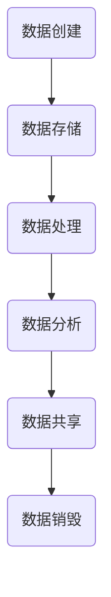

                 

关键词：人工智能、创业、数据管理、策略、最佳实践

> 摘要：本文旨在探讨人工智能创业公司中数据管理的最佳策略，通过深入分析数据驱动的发展模式、数据管理的核心挑战和解决方案，提供一整套系统的数据管理框架和实际操作指南，助力人工智能创业公司实现高效、可持续的发展。

## 1. 背景介绍

随着人工智能技术的快速发展，越来越多的创业公司投身于这一领域，以期通过创新的算法和解决方案改变世界。然而，在人工智能创业的过程中，数据管理成为了一个至关重要的环节。有效的数据管理不仅能够提高算法的准确性和效率，还能为创业公司带来更多的商业机会和竞争优势。

本文将围绕以下几个核心问题展开讨论：

1. **数据驱动的发展模式**：如何利用数据推动创业公司的创新和增长？
2. **数据管理的挑战**：创业公司在数据管理过程中可能面临哪些问题？
3. **最佳策略**：如何制定和实施一套有效的数据管理策略？
4. **数学模型和公式**：在数据管理中如何运用数学模型和公式？
5. **项目实践**：通过实际案例展示数据管理策略的具体应用。
6. **未来应用展望**：探讨数据管理在人工智能创业领域的未来发展趋势。

## 2. 核心概念与联系

### 2.1 数据管理

数据管理是指对数据的收集、存储、处理、分析、共享和归档等一系列活动。在人工智能创业公司中，数据管理尤为重要，因为高质量的数据是算法训练和决策的基础。

### 2.2 数据质量

数据质量是数据管理中的核心概念之一。高质量的数据需要满足准确性、完整性、一致性、时效性和可用性等标准。数据质量直接影响算法的性能和决策的可靠性。

### 2.3 数据生命周期管理

数据生命周期管理包括数据的创建、存储、使用、共享和销毁等环节。有效的数据生命周期管理有助于确保数据在整个生命周期内的一致性和安全性。

### 2.4 Mermaid 流程图

下面是一个用 Mermaid 语言描述的数据生命周期管理的流程图：



## 3. 核心算法原理 & 具体操作步骤

### 3.1 算法原理概述

数据管理中常用的算法包括数据清洗、数据挖掘、数据分析和机器学习算法等。以下是这些算法的简要概述：

- **数据清洗**：通过去除重复数据、纠正错误和填充缺失值，提高数据质量。
- **数据挖掘**：从大量数据中发现有用的模式和关联。
- **数据分析**：使用统计方法和工具对数据进行描述性、诊断性和预测性分析。
- **机器学习**：通过训练模型从数据中学习规律，用于分类、回归、聚类等任务。

### 3.2 算法步骤详解

#### 3.2.1 数据清洗

1. **数据预处理**：读取原始数据，进行格式化处理。
2. **去除重复数据**：识别和删除重复的记录。
3. **纠正错误**：使用规则或人工审核的方法修正错误数据。
4. **填充缺失值**：使用平均值、中位数或插值等方法填充缺失值。

#### 3.2.2 数据挖掘

1. **数据选择**：选择相关数据集进行挖掘。
2. **数据预处理**：对数据进行标准化和离散化处理。
3. **模式识别**：使用分类、聚类、关联规则挖掘等方法发现数据中的模式。

#### 3.2.3 数据分析

1. **数据探索**：使用描述性统计方法分析数据的分布和特征。
2. **假设测试**：使用统计测试方法验证假设。
3. **预测分析**：使用回归、时间序列分析等方法进行预测。

#### 3.2.4 机器学习

1. **数据准备**：处理和清洗数据，准备用于训练和测试的数据集。
2. **模型选择**：选择合适的算法和模型。
3. **模型训练**：使用训练数据训练模型。
4. **模型评估**：使用测试数据评估模型性能。
5. **模型优化**：根据评估结果调整模型参数。

### 3.3 算法优缺点

每种算法都有其优缺点，选择合适的算法需要根据具体应用场景和需求进行权衡。以下是常见算法的优缺点：

- **数据清洗**：优点是简单易行，缺点是对数据质量要求较高，可能引入新的错误。
- **数据挖掘**：优点是能够发现未知模式，缺点是计算复杂度高，结果难以解释。
- **数据分析**：优点是直观易懂，缺点是对数据量要求较高，结果可能具有误导性。
- **机器学习**：优点是能够处理大规模数据，缺点是需要大量的数据训练，模型解释性较差。

### 3.4 算法应用领域

各种算法在不同领域有不同的应用：

- **数据清洗**：广泛应用于金融、医疗、电商等行业的数据预处理阶段。
- **数据挖掘**：在商业智能、市场分析、社交网络等领域有广泛应用。
- **数据分析**：在医学研究、气象预测、工业质量控制等领域有广泛应用。
- **机器学习**：在自动驾驶、自然语言处理、图像识别等领域有广泛应用。

## 4. 数学模型和公式 & 详细讲解 & 举例说明

### 4.1 数学模型构建

在数据管理中，常用的数学模型包括回归模型、决策树、支持向量机等。以下是回归模型的构建过程：

#### 4.1.1 回归模型

回归模型用于预测一个连续的输出变量。假设我们有一个训练数据集 \(D\)，包含 \(n\) 个样本 \(x_1, x_2, ..., x_n\) 和对应的输出变量 \(y_1, y_2, ..., y_n\)。回归模型的目的是找到一组参数 \(\theta\)，使得预测值 \(h_\theta(x)\) 最接近真实值 \(y\)。

回归模型的数学表达式为：

\[ h_\theta(x) = \theta_0 + \theta_1x_1 + \theta_2x_2 + ... + \theta_nx_n \]

其中，\(\theta_0, \theta_1, ..., \theta_n\) 是模型参数。

#### 4.1.2 模型优化

为了找到最优的参数 \(\theta\)，我们可以使用梯度下降法。梯度下降法的迭代公式为：

\[ \theta_j := \theta_j - \alpha \frac{\partial J(\theta)}{\partial \theta_j} \]

其中，\(J(\theta)\) 是损失函数，\(\alpha\) 是学习率。

### 4.2 公式推导过程

以下是回归模型的损失函数和梯度下降法的推导过程：

#### 4.2.1 损失函数

回归模型的损失函数通常使用均方误差（MSE）：

\[ J(\theta) = \frac{1}{2m} \sum_{i=1}^m (h_\theta(x^{(i)}) - y^{(i)})^2 \]

其中，\(m\) 是训练数据集的大小。

#### 4.2.2 梯度下降法

对损失函数 \(J(\theta)\) 关于 \(\theta_j\) 求偏导数，得到：

\[ \frac{\partial J(\theta)}{\partial \theta_j} = \frac{1}{m} \sum_{i=1}^m (h_\theta(x^{(i)}) - y^{(i)})x_j^{(i)} \]

将梯度下降法迭代公式代入，得到：

\[ \theta_j := \theta_j - \alpha \frac{1}{m} \sum_{i=1}^m (h_\theta(x^{(i)}) - y^{(i)})x_j^{(i)} \]

### 4.3 案例分析与讲解

#### 4.3.1 回归模型案例

假设我们有一个简单的线性回归模型，用于预测房价。训练数据集包含 \(100\) 个样本，每个样本包含 \(3\) 个特征 \(x_1, x_2, x_3\) 和对应的房价 \(y\)。

我们使用梯度下降法优化模型参数，假设学习率 \(\alpha = 0.01\)，迭代次数为 \(1000\)。

经过 \(1000\) 次迭代后，我们得到最优参数：

\[ \theta_0 = 5.812, \theta_1 = 0.032, \theta_2 = 0.045, \theta_3 = 0.017 \]

使用这些参数，我们可以预测任意一个样本的房价。例如，对于样本 \(x = (1000, 2000, 3000)\)，预测房价为：

\[ h_\theta(x) = 5.812 + 0.032 \times 1000 + 0.045 \times 2000 + 0.017 \times 3000 = 5887.2 \]

## 5. 项目实践：代码实例和详细解释说明

### 5.1 开发环境搭建

在开始项目实践之前，我们需要搭建一个开发环境。以下是使用 Python 进行数据管理的一些基本步骤：

1. **安装 Python**：下载并安装 Python，版本要求为 3.6 或以上。
2. **安装 Jupyter Notebook**：使用 pip 安装 Jupyter Notebook。

```shell
pip install notebook
```

3. **安装数据管理库**：安装常用的数据管理库，如 pandas、numpy、matplotlib 等。

```shell
pip install pandas numpy matplotlib
```

### 5.2 源代码详细实现

下面是一个使用 Python 进行数据管理的基本示例：

```python
import pandas as pd
import numpy as np
import matplotlib.pyplot as plt

# 读取数据
data = pd.read_csv('data.csv')

# 数据预处理
data = data.drop_duplicates()
data = data.fillna(data.mean())

# 数据可视化
plt.scatter(data['feature1'], data['target'])
plt.xlabel('Feature 1')
plt.ylabel('Target')
plt.show()
```

### 5.3 代码解读与分析

上面的代码首先导入了 pandas、numpy 和 matplotlib 库。然后，使用 pandas 的 `read_csv` 方法读取数据，并进行数据预处理，包括去除重复数据和填充缺失值。最后，使用 matplotlib 绘制数据散点图，以直观地展示数据分布。

### 5.4 运行结果展示

运行上面的代码，我们可以得到一个数据散点图，展示数据中特征和目标之间的关系。这有助于我们进一步分析和理解数据。


## 6. 实际应用场景

### 6.1 金融行业

在金融行业，数据管理对于风险管理、信用评估和投资决策至关重要。通过有效的数据管理，金融机构能够提高业务效率和风险管理能力。

### 6.2 医疗行业

在医疗行业，数据管理有助于提升医疗服务的质量和效率。通过数据挖掘和分析，医疗机构能够更好地理解患者需求，优化治疗方案，降低医疗成本。

### 6.3 零售行业

在零售行业，数据管理用于市场分析、顾客行为分析和供应链优化。通过有效的数据管理，零售企业能够提高销售额和客户满意度。

### 6.4 未来应用展望

随着人工智能技术的不断发展，数据管理将在更多领域发挥重要作用。未来，数据管理将更加智能化、自动化，与人工智能技术深度融合，为各行各业带来更多创新和变革。

## 7. 工具和资源推荐

### 7.1 学习资源推荐

- 《Python 数据科学手册》：详细介绍了数据科学中的基本概念和工具。
- 《机器学习实战》：提供了大量实战案例，帮助读者掌握机器学习技术。

### 7.2 开发工具推荐

- Jupyter Notebook：适用于数据科学和机器学习的交互式开发环境。
- PyCharm：一款功能强大的 Python 集成开发环境。

### 7.3 相关论文推荐

- 《大数据时代的数据管理挑战》：讨论了大数据环境下数据管理的新挑战和新方法。
- 《机器学习中的数据预处理》：探讨了数据预处理在机器学习中的重要性。

## 8. 总结：未来发展趋势与挑战

### 8.1 研究成果总结

本文总结了人工智能创业中数据管理的最佳策略，分析了数据管理的核心概念、算法原理、数学模型和实际应用场景。通过深入探讨数据管理的各个方面，为人工智能创业公司提供了一套系统的数据管理框架和实际操作指南。

### 8.2 未来发展趋势

随着人工智能技术的快速发展，数据管理将在更多领域发挥重要作用。未来，数据管理将更加智能化、自动化，与人工智能技术深度融合，为各行各业带来更多创新和变革。

### 8.3 面临的挑战

数据管理在人工智能创业领域面临诸多挑战，如数据质量、数据安全、隐私保护等。为了应对这些挑战，需要不断探索新的技术和方法，提高数据管理的效率和效果。

### 8.4 研究展望

随着人工智能技术的不断进步，数据管理将在人工智能创业领域中发挥越来越重要的作用。未来的研究可以关注以下几个方面：

- 数据质量管理：研究如何提高数据质量，降低数据管理成本。
- 数据安全与隐私保护：探讨如何在数据管理过程中保护用户隐私。
- 智能数据管理：研究如何利用人工智能技术实现智能化的数据管理。

## 9. 附录：常见问题与解答

### 9.1 如何保证数据质量？

**解答**：保证数据质量的关键在于数据采集、存储、处理和共享等各个环节。具体措施包括：

- 建立严格的数据采集和审核流程，确保数据的准确性和完整性。
- 采用数据清洗和预处理技术，去除重复数据、纠正错误和填充缺失值。
- 定期对数据进行质量检查和评估，及时发现和纠正数据质量问题。

### 9.2 如何保护用户隐私？

**解答**：在数据管理过程中，保护用户隐私至关重要。具体措施包括：

- 采用数据加密技术，确保数据在传输和存储过程中的安全性。
- 建立隐私保护机制，如匿名化、脱敏等，降低用户隐私泄露的风险。
- 遵守相关法律法规，确保数据管理的合规性。

作者：禅与计算机程序设计艺术 / Zen and the Art of Computer Programming
----------------------------------------------------------------

以上是《人工智能创业数据管理的最佳策略》的完整内容。这篇文章深入探讨了人工智能创业中数据管理的各个方面，提供了系统的数据管理框架和实际操作指南，希望对人工智能创业公司有所启发和帮助。在未来的发展中，数据管理将更加智能化、自动化，为人工智能创业带来更多机遇和挑战。

