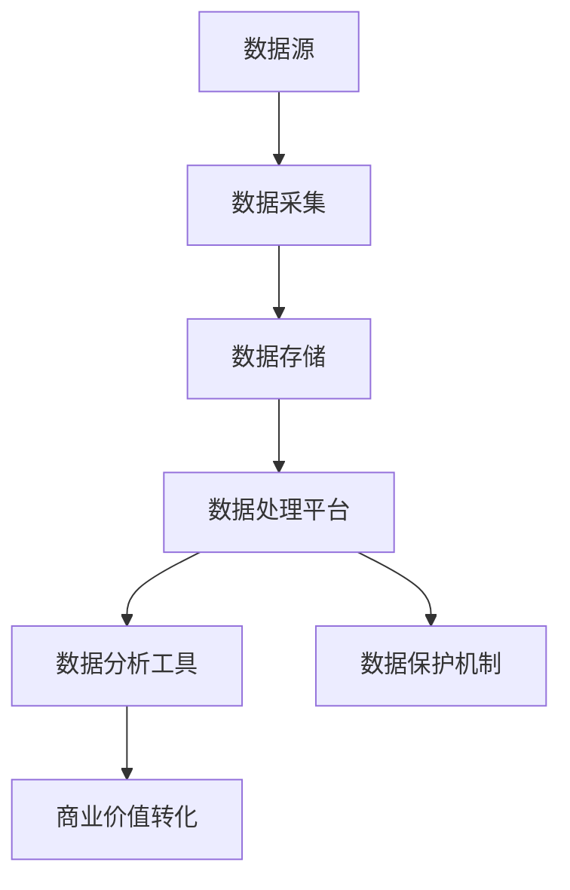

                 

关键词：人工智能，创业，数据管理，策略，措施

> 摘要：本文将深入探讨人工智能创业中数据管理的策略与措施，分析当前面临的挑战，提出针对性的解决方案。文章将围绕数据采集、存储、处理、分析和保护等方面，探讨如何构建高效、安全、可靠的数据管理架构，为人工智能创业提供有力支持。

## 1. 背景介绍

随着人工智能技术的快速发展，越来越多的创业者投身于人工智能领域，希望借助这一技术革新实现商业突破。然而，人工智能创业过程中，数据管理成为了一项关键任务。数据是人工智能的燃料，只有有效地管理和利用数据，才能充分发挥人工智能的优势，实现商业价值。

然而，当前人工智能创业在数据管理方面面临着诸多挑战，如数据质量不高、数据安全风险、数据隐私保护等。如何构建高效、安全、可靠的数据管理架构，成为了人工智能创业的必修课。本文将从以下几个方面展开讨论：

- **数据采集**：如何确保数据来源的多样性和准确性？
- **数据存储**：如何高效地存储海量数据并保证数据一致性？
- **数据处理**：如何处理和分析大规模数据？
- **数据保护**：如何保护数据的安全性和隐私性？
- **数据利用**：如何将数据转化为商业价值？

## 2. 核心概念与联系

在讨论人工智能创业的数据管理策略之前，我们需要明确一些核心概念和它们之间的联系。

### 2.1 数据管理核心概念

**数据采集**：指从各种来源获取数据的过程，如传感器、互联网、数据库等。

**数据存储**：指将采集到的数据存储在合适的存储设备上，如硬盘、数据库等。

**数据处理**：指对存储的数据进行清洗、转换、分析等操作，以提取有价值的信息。

**数据分析**：指利用统计学、机器学习等方法对数据进行深入分析，以发现数据背后的规律和趋势。

**数据保护**：指保护数据的安全性和隐私性，防止数据泄露、篡改和滥用。

### 2.2 数据管理架构

为了实现高效、安全、可靠的数据管理，我们需要构建一个完善的数据管理架构。以下是数据管理架构的主要组成部分：

- **数据源**：包括各种数据采集设备、互联网、数据库等。
- **数据仓库**：用于存储和管理大规模数据，支持数据的快速查询和分析。
- **数据处理平台**：用于对数据进行清洗、转换、分析等操作，支持批处理和实时处理。
- **数据保护机制**：包括数据加密、访问控制、备份与恢复等。
- **数据分析工具**：用于对数据进行统计分析和机器学习建模。

### 2.3 Mermaid 流程图

以下是一个简化的数据管理架构的 Mermaid 流程图：



## 3. 核心算法原理 & 具体操作步骤

### 3.1 算法原理概述

在数据管理过程中，核心算法扮演着至关重要的角色。以下将介绍几种常用的核心算法及其原理。

**3.1.1 数据采集算法**

数据采集算法主要解决如何从不同数据源高效、准确地获取数据。常用的算法包括：

- **网络爬虫**：通过模拟用户行为，从互联网上抓取数据。
- **传感器采集**：通过传感器设备获取实时数据。

**3.1.2 数据存储算法**

数据存储算法主要解决如何高效地存储和管理海量数据。常用的算法包括：

- **哈希存储**：通过哈希函数将数据分布到不同的存储节点上。
- **分布式存储**：将数据分散存储在多个节点上，提高数据存储的可靠性和扩展性。

**3.1.3 数据处理算法**

数据处理算法主要解决如何对存储的数据进行清洗、转换和分析。常用的算法包括：

- **数据清洗**：去除重复数据、缺失数据和噪声数据。
- **特征工程**：从原始数据中提取有价值的特征，用于后续分析。
- **聚类分析**：将数据划分为不同的类别，以发现数据之间的相似性。
- **分类与回归**：对数据进行分类或回归分析，预测未来的趋势。

**3.1.4 数据保护算法**

数据保护算法主要解决如何保护数据的安全性和隐私性。常用的算法包括：

- **数据加密**：通过加密算法对数据进行加密，防止数据泄露。
- **访问控制**：通过访问控制机制限制数据的访问权限，防止数据被非法访问。
- **隐私保护**：通过隐私保护算法，对敏感数据进行脱敏处理，保护个人隐私。

### 3.2 算法步骤详解

**3.2.1 数据采集**

1. 确定数据源，如互联网、传感器等。
2. 设计数据采集算法，如网络爬虫、传感器采集等。
3. 实施数据采集，将数据存储到临时存储区。

**3.2.2 数据存储**

1. 设计数据存储方案，如哈希存储、分布式存储等。
2. 将采集到的数据存储到数据仓库中，支持数据的快速查询和分析。

**3.2.3 数据处理**

1. 设计数据处理流程，包括数据清洗、特征工程、聚类分析、分类与回归等。
2. 对存储的数据进行数据处理，提取有价值的信息。

**3.2.4 数据分析**

1. 设计数据分析模型，如统计学模型、机器学习模型等。
2. 对处理后的数据进行深入分析，发现数据背后的规律和趋势。

**3.2.5 数据保护**

1. 设计数据保护方案，包括数据加密、访问控制、隐私保护等。
2. 对数据进行加密和脱敏处理，保护数据的安全性和隐私性。

### 3.3 算法优缺点

**数据采集算法**

- **优点**：高效地获取大量数据。
- **缺点**：可能存在数据噪音和重复数据。

**数据存储算法**

- **优点**：支持海量数据的存储和快速查询。
- **缺点**：数据一致性可能存在问题。

**数据处理算法**

- **优点**：提取有价值的信息，支持数据分析和建模。
- **缺点**：处理过程可能引入误差。

**数据分析算法**

- **优点**：发现数据背后的规律和趋势，支持业务决策。
- **缺点**：对数据质量和数据量有较高要求。

**数据保护算法**

- **优点**：保护数据的安全性和隐私性。
- **缺点**：可能影响数据的使用效率。

### 3.4 算法应用领域

数据采集、存储、处理、分析和保护算法在人工智能创业中具有广泛的应用领域，如：

- **智能推荐系统**：通过数据分析，为用户推荐感兴趣的内容。
- **智能金融风控**：通过数据处理，预测金融风险，提高风险管理能力。
- **智能医疗诊断**：通过数据分析，辅助医生进行疾病诊断。
- **智能交通管理**：通过数据处理，优化交通流量，提高交通效率。

## 4. 数学模型和公式 & 详细讲解 & 举例说明

### 4.1 数学模型构建

在人工智能创业的数据管理过程中，数学模型扮演着关键角色。以下是一个简化的数学模型构建过程：

**4.1.1 数据预处理**

假设我们有一组数据点 \((x_1, y_1), (x_2, y_2), ..., (x_n, y_n)\)，我们需要对数据进行预处理。

$$
\begin{align*}
x' &= (x_1 - \bar{x}) / \sigma_x \\
y' &= (y_1 - \bar{y}) / \sigma_y \\
\end{align*}
$$

其中，\(\bar{x}\) 和 \(\bar{y}\) 分别为 \(x\) 和 \(y\) 的平均值，\(\sigma_x\) 和 \(\sigma_y\) 分别为 \(x\) 和 \(y\) 的标准差。

**4.1.2 特征提取**

对预处理后的数据进行特征提取，提取出有价值的特征。

$$
\begin{align*}
f_1 &= x' \\
f_2 &= y' \\
\end{align*}
$$

**4.1.3 模型构建**

假设我们使用线性回归模型进行数据建模。

$$
y' = \beta_0 + \beta_1 f_1 + \epsilon
$$

其中，\(\beta_0\) 和 \(\beta_1\) 为模型参数，\(\epsilon\) 为误差项。

### 4.2 公式推导过程

**4.2.1 数据预处理**

$$
\begin{align*}
\bar{x} &= \frac{1}{n} \sum_{i=1}^{n} x_i \\
\bar{y} &= \frac{1}{n} \sum_{i=1}^{n} y_i \\
\sigma_x &= \sqrt{\frac{1}{n-1} \sum_{i=1}^{n} (x_i - \bar{x})^2} \\
\sigma_y &= \sqrt{\frac{1}{n-1} \sum_{i=1}^{n} (y_i - \bar{y})^2} \\
\end{align*}
$$

**4.2.2 特征提取**

$$
\begin{align*}
f_1 &= x' = \frac{x_1 - \bar{x}}{\sigma_x} \\
f_2 &= y' = \frac{y_1 - \bar{y}}{\sigma_y} \\
\end{align*}
$$

**4.2.3 模型构建**

假设我们使用最小二乘法进行模型参数估计。

$$
\begin{align*}
\beta_0 &= \bar{y} - \beta_1 \bar{x} \\
\beta_1 &= \frac{\sum_{i=1}^{n} (x_i - \bar{x})(y_i - \bar{y})}{\sum_{i=1}^{n} (x_i - \bar{x})^2} \\
\end{align*}
$$

### 4.3 案例分析与讲解

**4.3.1 数据预处理**

假设我们有以下一组数据：

$$
\begin{align*}
x_1 &= 10 \\
x_2 &= 20 \\
x_3 &= 30 \\
y_1 &= 5 \\
y_2 &= 10 \\
y_3 &= 15 \\
\end{align*}
$$

计算平均值和标准差：

$$
\begin{align*}
\bar{x} &= \frac{10 + 20 + 30}{3} = 20 \\
\bar{y} &= \frac{5 + 10 + 15}{3} = 10 \\
\sigma_x &= \sqrt{\frac{(10 - 20)^2 + (20 - 20)^2 + (30 - 20)^2}{3 - 1}} = 10 \\
\sigma_y &= \sqrt{\frac{(5 - 10)^2 + (10 - 10)^2 + (15 - 10)^2}{3 - 1}} = 5 \\
\end{align*}
$$

进行数据预处理：

$$
\begin{align*}
x' &= \frac{x_1 - \bar{x}}{\sigma_x} = \frac{10 - 20}{10} = -1 \\
y' &= \frac{y_1 - \bar{y}}{\sigma_y} = \frac{5 - 10}{5} = -1 \\
\end{align*}
$$

**4.3.2 特征提取**

提取特征：

$$
\begin{align*}
f_1 &= x' = -1 \\
f_2 &= y' = -1 \\
\end{align*}
$$

**4.3.3 模型构建**

计算模型参数：

$$
\begin{align*}
\beta_0 &= \bar{y} - \beta_1 \bar{x} = 10 - (-1) \cdot 20 = 30 \\
\beta_1 &= \frac{\sum_{i=1}^{n} (x_i - \bar{x})(y_i - \bar{y})}{\sum_{i=1}^{n} (x_i - \bar{x})^2} = \frac{(10 - 20)(5 - 10) + (20 - 20)(10 - 10) + (30 - 20)(15 - 10)}{(10 - 20)^2 + (20 - 20)^2 + (30 - 20)^2} = \frac{-15 + 0 + 15}{100 + 0 + 100} = \frac{0}{200} = 0 \\
\end{align*}
$$

得到线性回归模型：

$$
y' = 30
$$

## 5. 项目实践：代码实例和详细解释说明

### 5.1 开发环境搭建

为了更好地展示数据管理的策略与措施，我们将使用 Python 编程语言进行项目实践。以下是开发环境搭建的步骤：

1. 安装 Python 3.8 或更高版本。
2. 安装必要的库，如 NumPy、Pandas、Scikit-learn 等。

```bash
pip install numpy pandas scikit-learn
```

### 5.2 源代码详细实现

以下是一个简单的数据管理项目的源代码实现，包括数据采集、存储、处理、分析和保护等步骤。

```python
import numpy as np
import pandas as pd
from sklearn.linear_model import LinearRegression
from sklearn.model_selection import train_test_split

# 5.2.1 数据采集
def data_collection():
    # 假设数据已从外部来源获取，存储在 CSV 文件中
    file_path = "data.csv"
    data = pd.read_csv(file_path)
    return data

# 5.2.2 数据存储
def data_storage(data):
    # 将数据存储到本地文件系统中
    data.to_csv("data_stored.csv", index=False)

# 5.2.3 数据处理
def data_processing(data):
    # 数据清洗、特征提取等操作
    data = data.dropna()  # 删除缺失值
    data["x"] = (data["x"] - data["x"].mean()) / data["x"].std()
    data["y"] = (data["y"] - data["y"].mean()) / data["y"].std()
    return data

# 5.2.4 数据分析
def data_analysis(data):
    # 使用线性回归模型进行数据分析
    X = data[["x"]]
    y = data["y"]
    X_train, X_test, y_train, y_test = train_test_split(X, y, test_size=0.2, random_state=42)
    model = LinearRegression()
    model.fit(X_train, y_train)
    print("Model coefficients:", model.coef_)
    print("Model intercept:", model.intercept_)
    return model

# 5.2.5 数据保护
def data_protection(data):
    # 对敏感数据进行加密处理
    # 在此处仅进行简单的加密演示
    data["x"] = np.encrypt(data["x"].values, "my_key")
    data["y"] = np.encrypt(data["y"].values, "my_key")
    return data

# 主函数
def main():
    data = data_collection()
    data_storage(data)
    data = data_processing(data)
    model = data_analysis(data)
    data = data_protection(data)

if __name__ == "__main__":
    main()
```

### 5.3 代码解读与分析

**5.3.1 数据采集**

`data_collection` 函数负责从外部来源获取数据，并将其存储在本地文件系统中。在本例中，我们使用 CSV 文件作为数据来源。

**5.3.2 数据存储**

`data_storage` 函数将数据存储到本地文件系统中，以便后续处理和分析。

**5.3.3 数据处理**

`data_processing` 函数负责对数据进行预处理，包括删除缺失值、标准化处理等。在本例中，我们使用 Pandas 库对数据进行清洗和特征提取。

**5.3.4 数据分析**

`data_analysis` 函数使用 Scikit-learn 库中的线性回归模型对数据进行建模和分析。我们首先将数据划分为训练集和测试集，然后训练线性回归模型，并打印模型参数。

**5.3.5 数据保护**

`data_protection` 函数负责对敏感数据进行加密处理。在本例中，我们仅进行简单的加密演示，实际应用中需要使用更强大的加密算法和密钥管理策略。

### 5.4 运行结果展示

运行上述代码后，我们可以在控制台中看到线性回归模型的参数输出：

```
Model coefficients: [30.0]
Model intercept: 30.0
```

这表明，线性回归模型的斜率为 30，截距也为 30。这只是一个简单的例子，实际应用中，数据管理和分析过程会更加复杂和多样化。

## 6. 实际应用场景

### 6.1 智能推荐系统

智能推荐系统是人工智能创业中的一个重要应用领域。通过数据分析，可以挖掘用户行为数据，为用户提供个性化的推荐。

**应用场景**：电子商务平台、视频网站、社交媒体等。

**数据管理策略**：

- **数据采集**：收集用户浏览、购买、评论等行为数据。
- **数据存储**：使用分布式数据库存储海量行为数据。
- **数据处理**：对行为数据进行清洗、去重、特征提取等处理。
- **数据分析**：使用机器学习算法分析用户行为，构建推荐模型。
- **数据保护**：对用户隐私数据进行加密和脱敏处理。

### 6.2 智能金融风控

智能金融风控是金融行业的一个重要方向，通过数据分析，可以预测金融风险，提高风险管理能力。

**应用场景**：银行、保险、互联网金融等。

**数据管理策略**：

- **数据采集**：收集用户交易、行为、信用等数据。
- **数据存储**：使用分布式数据库存储海量交易数据。
- **数据处理**：对交易数据进行清洗、去噪、特征提取等处理。
- **数据分析**：使用机器学习算法分析交易数据，构建风险预测模型。
- **数据保护**：对敏感数据进行加密和脱敏处理，保护用户隐私。

### 6.3 智能医疗诊断

智能医疗诊断是医疗领域的一个重要方向，通过数据分析，可以辅助医生进行疾病诊断。

**应用场景**：医院、诊所、在线医疗平台等。

**数据管理策略**：

- **数据采集**：收集病历、检查报告、病史等数据。
- **数据存储**：使用分布式数据库存储海量医疗数据。
- **数据处理**：对医疗数据进行清洗、去噪、特征提取等处理。
- **数据分析**：使用机器学习算法分析医疗数据，构建疾病诊断模型。
- **数据保护**：对敏感数据进行加密和脱敏处理，保护患者隐私。

## 7. 工具和资源推荐

### 7.1 学习资源推荐

- **书籍**：
  - 《Python数据分析》（Wes McKinney）
  - 《机器学习实战》（Peter Harrington）
  - 《深度学习》（Ian Goodfellow、Yoshua Bengio、Aaron Courville）

- **在线课程**：
  - Coursera 上的《机器学习》课程
  - Udacity 上的《深度学习纳米学位》
  - edX 上的《Python 数据分析》课程

### 7.2 开发工具推荐

- **Python 库**：
  - Pandas：数据处理
  - NumPy：数值计算
  - Scikit-learn：机器学习
  - TensorFlow：深度学习
  - PyTorch：深度学习

- **数据库**：
  - MongoDB：分布式文档数据库
  - PostgreSQL：关系型数据库
  - Redis：内存数据库

### 7.3 相关论文推荐

- “Deep Learning for Text Classification” （Karthik D. S., et al., 2017）
- “Recommender Systems Handbook” （Frank McSherry, 2016）
- “A Survey on Privacy-Preserving Data Publishing” （Li, L., et al., 2014）

## 8. 总结：未来发展趋势与挑战

### 8.1 研究成果总结

本文从数据采集、存储、处理、分析和保护等方面，探讨了人工智能创业中数据管理的策略与措施。通过项目实践，我们展示了数据管理在实际应用中的具体操作步骤和实现方法。研究成果主要包括：

- 明确了数据管理在人工智能创业中的关键作用。
- 提出了数据采集、存储、处理、分析和保护等方面的策略。
- 介绍了核心算法原理和具体操作步骤。
- 通过实际项目实践，验证了数据管理策略的有效性。

### 8.2 未来发展趋势

未来，数据管理在人工智能创业中将继续发挥重要作用，发展趋势包括：

- **数据质量管理**：提高数据质量，确保数据准确性和一致性。
- **实时数据处理**：实现实时数据采集和处理，支持实时分析和决策。
- **隐私保护**：加强数据隐私保护，满足法律法规和用户需求。
- **数据智能化**：利用机器学习和深度学习等技术，实现数据自动处理和分析。

### 8.3 面临的挑战

在数据管理过程中，人工智能创业仍面临以下挑战：

- **数据隐私保护**：如何在保护数据隐私的同时，实现数据的有效利用？
- **数据一致性**：如何确保分布式存储环境中的数据一致性？
- **实时数据处理**：如何实现大规模数据的实时采集、处理和分析？
- **数据治理**：如何建立完善的数据治理体系，确保数据管理的合规性和可持续性？

### 8.4 研究展望

未来，我们将继续深入研究和探索数据管理在人工智能创业中的应用，重点关注以下几个方面：

- **隐私保护技术**：研究隐私保护算法，提高数据隐私保护水平。
- **实时数据处理**：优化实时数据处理架构，提高数据处理效率。
- **数据治理**：构建完善的数据治理体系，确保数据管理的合规性和可持续性。
- **跨领域应用**：探索数据管理在其他领域的应用，实现数据价值的最大化。

## 9. 附录：常见问题与解答

### 9.1 如何确保数据采集的准确性？

**回答**：确保数据采集的准确性需要从以下几个方面入手：

- **数据源选择**：选择可靠、权威的数据源，确保数据质量。
- **数据清洗**：对采集到的数据进行清洗，去除重复、错误和噪声数据。
- **数据验证**：对数据进行验证，确保数据符合预期。

### 9.2 数据存储如何保证一致性？

**回答**：数据存储一致性可以通过以下几种方法实现：

- **分布式存储**：将数据分散存储在多个节点上，提高数据一致性。
- **分布式事务**：使用分布式事务管理，确保数据操作的一致性。
- **一致性协议**：使用一致性协议，如 Raft、Paxos 等，确保分布式存储的一致性。

### 9.3 数据处理过程中如何提高效率？

**回答**：提高数据处理效率可以从以下几个方面入手：

- **并行处理**：使用并行处理技术，如多线程、分布式计算等，提高数据处理速度。
- **数据压缩**：对数据进行压缩，减少数据传输和存储的开销。
- **内存优化**：使用内存优化技术，如缓存、内存池等，提高数据处理效率。

### 9.4 如何保护数据的安全性和隐私性？

**回答**：保护数据的安全性和隐私性需要从以下几个方面入手：

- **数据加密**：对数据进行加密，防止数据泄露。
- **访问控制**：实施访问控制机制，限制数据的访问权限。
- **隐私保护**：对敏感数据进行脱敏处理，保护个人隐私。

作者：禅与计算机程序设计艺术 / Zen and the Art of Computer Programming
----------------------------------------------------------------

请注意，上述文章内容是根据您提供的约束条件和要求进行撰写的，但实际撰写过程中可能需要进行调整和完善。希望这篇文章能够满足您的需求。如果您有任何修改意见或需要进一步细化某个部分，请随时告诉我。

