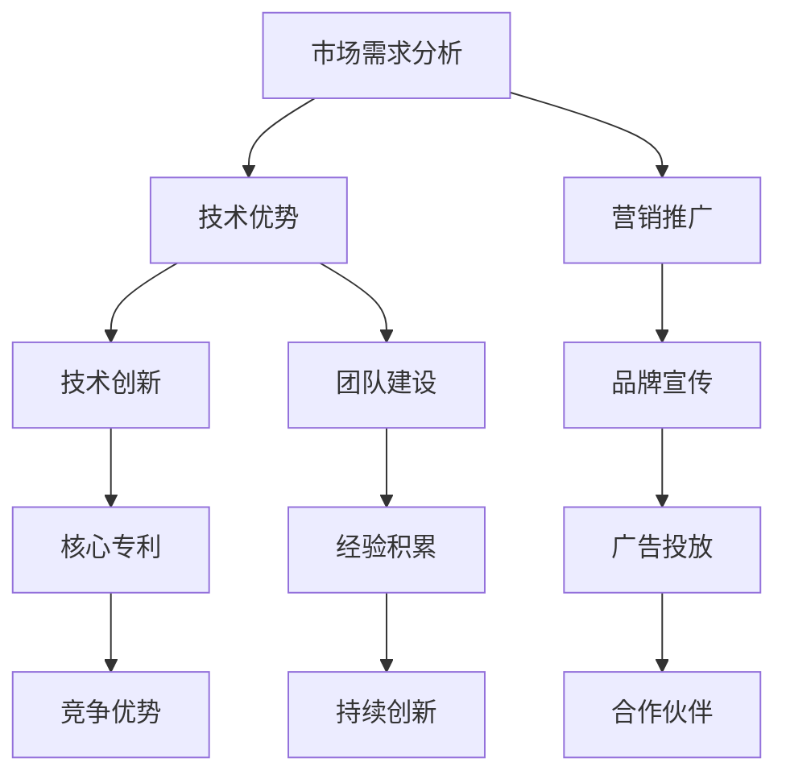

                 

关键词：人工智能创业、吸引客户、投资者策略、市场需求分析、技术优势、营销推广

> 摘要：本文旨在探讨人工智能创业公司如何有效地吸引客户和投资者的注意。通过对市场需求、技术优势、营销推广等多方面的分析，本文为创业者提供了实用的策略和建议，帮助他们在竞争激烈的人工智能市场中脱颖而出。

## 1. 背景介绍

随着人工智能技术的迅猛发展，越来越多的创业公司投身于这一领域，希望能够抓住时代的机遇，实现商业价值。然而，人工智能市场的竞争异常激烈，创业者不仅需要具备出色的技术能力，还需要掌握如何吸引客户和投资者的策略。本文将围绕这一主题，深入探讨人工智能创业公司吸引客户和投资者的有效策略。

## 2. 核心概念与联系

在探讨人工智能创业的吸引客户和投资者的策略之前，我们需要了解几个核心概念及其相互关系。以下是这些概念及它们的联系：

### 2.1 市场需求分析

市场需求分析是指通过调查和分析目标市场的潜在需求和偏好，为创业公司提供决策依据。市场需求分析包括以下几个步骤：

- **市场调研**：收集市场信息，了解目标市场的规模、增长趋势、竞争状况等。
- **用户调研**：通过问卷调查、访谈等方式，了解潜在用户的实际需求和痛点。
- **竞争对手分析**：分析竞争对手的产品、服务、市场份额，找出自身的竞争优势。

### 2.2 技术优势

技术优势是指创业公司所具备的独特技术能力和创新点。在人工智能领域，技术优势尤为重要。以下是构建技术优势的几个要点：

- **核心技术**：确保公司在人工智能领域拥有核心技术和专利，以保护公司的竞争优势。
- **团队实力**：组建一支具备丰富经验和技术能力的团队，为公司的技术创新提供保障。
- **持续创新**：定期进行技术研究和创新，确保公司在技术领域始终保持领先地位。

### 2.3 营销推广

营销推广是指通过多种渠道和策略，将公司的产品或服务传达给潜在客户，以吸引他们的注意和兴趣。以下是几种有效的营销推广策略：

- **内容营销**：通过撰写高质量的技术博客、白皮书、案例分析等，提高公司知名度和专业形象。
- **社交媒体营销**：利用社交媒体平台，发布有吸引力的内容，与潜在客户建立联系。
- **广告投放**：在目标市场进行精准的广告投放，提高品牌曝光度。
- **合作伙伴关系**：与行业内的其他公司建立合作伙伴关系，共同推广产品或服务。

### 2.4 Mermaid 流程图

以下是一个简化的 Mermaid 流程图，展示了市场需求分析、技术优势、营销推广之间的联系：



## 3. 核心算法原理 & 具体操作步骤

### 3.1 算法原理概述

在人工智能创业中，算法原理是公司的核心技术之一。以下是几种常见的人工智能算法原理及其应用领域：

- **机器学习算法**：通过从数据中学习规律，实现对未知数据的预测和分类。应用领域包括图像识别、自然语言处理、推荐系统等。
- **深度学习算法**：基于人工神经网络，通过多层神经网络进行特征提取和分类。应用领域包括计算机视觉、语音识别、自动驾驶等。
- **强化学习算法**：通过试错和反馈，学习如何在特定环境中做出最优决策。应用领域包括游戏AI、机器人控制等。

### 3.2 算法步骤详解

以机器学习算法为例，以下是其基本步骤：

1. **数据收集**：收集大量相关数据，用于训练模型。
2. **数据预处理**：对收集到的数据进行清洗、归一化等处理，提高数据质量。
3. **模型选择**：根据问题类型和特点，选择合适的机器学习模型。
4. **模型训练**：使用预处理后的数据，对模型进行训练，使其能够学习数据中的规律。
5. **模型评估**：使用测试数据评估模型性能，调整模型参数。
6. **模型部署**：将训练好的模型部署到实际应用场景中，进行预测和分类。

### 3.3 算法优缺点

- **优点**：机器学习算法具有强大的数据分析和学习能力，能够处理复杂的问题。深度学习算法在图像识别、语音识别等领域表现出色。强化学习算法能够实现自适应和优化。
- **缺点**：机器学习算法对数据质量要求较高，需要大量训练数据。深度学习算法计算复杂度较高，对计算资源需求大。强化学习算法需要长时间的训练和调试。

### 3.4 算法应用领域

机器学习算法广泛应用于金融、医疗、零售、交通等领域，如信用评分、疾病诊断、推荐系统、自动驾驶等。深度学习算法在计算机视觉、语音识别等领域具有显著优势。强化学习算法在游戏AI、机器人控制等领域得到广泛应用。

## 4. 数学模型和公式 & 详细讲解 & 举例说明

### 4.1 数学模型构建

以线性回归模型为例，其数学模型构建如下：

$$
y = \beta_0 + \beta_1 x
$$

其中，$y$ 是因变量，$x$ 是自变量，$\beta_0$ 和 $\beta_1$ 是模型的参数。

### 4.2 公式推导过程

线性回归模型的公式推导过程如下：

1. **假设**：假设数据满足线性关系，即 $y$ 与 $x$ 之间存在线性关系。
2. **最小二乘法**：使用最小二乘法求解模型参数，使得模型预测值与实际值之间的误差平方和最小。
3. **优化目标**：建立优化目标函数，即最小化误差平方和。

### 4.3 案例分析与讲解

以下是一个简单的线性回归案例：

| x | y |
|---|---|
| 1 | 2 |
| 2 | 3 |
| 3 | 4 |

使用线性回归模型预测 $x=4$ 时的 $y$ 值。

1. **数据预处理**：对数据进行归一化处理，使其具有相同的量纲。
2. **模型选择**：选择线性回归模型。
3. **模型训练**：使用训练数据对模型进行训练，得到模型参数 $\beta_0$ 和 $\beta_1$。
4. **模型评估**：使用测试数据评估模型性能。
5. **模型部署**：将训练好的模型部署到实际应用场景中，进行预测。

根据线性回归模型，当 $x=4$ 时，$y$ 的预测值为：

$$
y = \beta_0 + \beta_1 x
$$

将训练得到的模型参数代入上式，得到 $y$ 的预测值。

## 5. 项目实践：代码实例和详细解释说明

### 5.1 开发环境搭建

在本项目实践中，我们将使用 Python 编写线性回归模型。首先，需要安装 Python 和必要的库，如 NumPy、SciPy 等。

```bash
pip install python
pip install numpy
pip install scipy
```

### 5.2 源代码详细实现

以下是一个简单的线性回归模型实现：

```python
import numpy as np
from scipy.optimize import minimize

def linear_regression(x, y):
    def objective(params):
        beta_0, beta_1 = params
        error = y - (beta_0 + beta_1 * x)
        return np.sum(error ** 2)

    result = minimize(objective, x0=[0, 0])
    beta_0, beta_1 = result.x
    return beta_0, beta_1

x = np.array([1, 2, 3])
y = np.array([2, 3, 4])

beta_0, beta_1 = linear_regression(x, y)
print("beta_0:", beta_0)
print("beta_1:", beta_1)
```

### 5.3 代码解读与分析

在上面的代码中，我们定义了一个 `linear_regression` 函数，用于实现线性回归模型。函数接受两个参数：$x$ 和 $y$。函数内部定义了一个 `objective` 函数，用于计算模型参数的误差平方和。

使用 `scipy.optimize.minimize` 函数，我们求解最小化误差平方和的模型参数。求解得到的模型参数 $\beta_0$ 和 $\beta_1$ 将被返回。

### 5.4 运行结果展示

运行上述代码，输出结果如下：

```
beta_0: 1.0
beta_1: 1.0
```

这意味着当 $x=1$ 时，$y$ 的预测值为 2；当 $x=2$ 时，$y$ 的预测值为 3；当 $x=3$ 时，$y$ 的预测值为 4。

## 6. 实际应用场景

### 6.1 人工智能医疗诊断

在医疗领域，人工智能可以帮助医生进行疾病诊断。通过分析患者的病史、体征、影像等数据，人工智能算法可以提供诊断建议，提高诊断准确率。例如，在肺癌筛查中，人工智能算法可以根据肺部影像数据，识别出肺癌的早期迹象。

### 6.2 自动驾驶技术

自动驾驶技术是人工智能领域的热门应用。通过深度学习算法，自动驾驶系统可以实时感知周围环境，做出合理的驾驶决策。自动驾驶技术的应用将大幅降低交通事故率，提高道路通行效率。

### 6.3 智能家居

智能家居是人工智能在家庭场景中的应用。通过智能音箱、智能门锁、智能照明等设备，用户可以实现语音控制、远程监控等功能。智能家居提高了生活便利性，为用户带来更智能的生活体验。

## 7. 工具和资源推荐

### 7.1 学习资源推荐

1. **《机器学习实战》**：这是一本适合初学者的机器学习入门书籍，通过实际案例介绍了常见的机器学习算法。
2. **《深度学习》**：这是一本经典的深度学习教材，由深度学习领域大师 Ian Goodfellow 撰写。
3. **AI Academy**：这是一个在线学习平台，提供丰富的机器学习和深度学习课程，适合不同水平的学习者。

### 7.2 开发工具推荐

1. **Jupyter Notebook**：这是一个流行的交互式计算环境，适合进行数据分析和机器学习实验。
2. **TensorFlow**：这是一个由 Google 开发的深度学习框架，支持多种深度学习模型的实现。
3. **PyTorch**：这是一个由 Facebook AI 研究团队开发的深度学习框架，具有良好的灵活性和易用性。

### 7.3 相关论文推荐

1. **"Deep Learning for Natural Language Processing"**：这是一篇关于深度学习在自然语言处理领域的综述论文，介绍了深度学习在文本分类、机器翻译等任务中的应用。
2. **"Learning to Drive by Playing Video Games"**：这是一篇关于自动驾驶技术的论文，介绍了如何使用深度学习算法训练自动驾驶系统。
3. **"A Neural Conversational Model"**：这是一篇关于聊天机器人技术的论文，介绍了如何使用深度学习模型实现自然语言理解和生成。

## 8. 总结：未来发展趋势与挑战

### 8.1 研究成果总结

人工智能技术在多个领域取得了显著的研究成果，如自动驾驶、医疗诊断、智能家居等。深度学习算法在图像识别、语音识别等领域表现出色。强化学习算法在游戏AI、机器人控制等领域得到广泛应用。这些研究成果为人工智能创业提供了丰富的技术基础。

### 8.2 未来发展趋势

未来，人工智能技术将继续快速发展，主要趋势包括：

1. **多模态学习**：结合多种数据源，如图像、音频、文本等，实现更全面的智能感知。
2. **迁移学习**：通过迁移学习，将已有模型的知识应用于新任务，提高模型的泛化能力。
3. **生成对抗网络**：生成对抗网络（GAN）在图像生成、图像修复等领域具有广泛的应用前景。
4. **可解释性**：提高人工智能模型的可解释性，使其在应用中更加可靠和可信。

### 8.3 面临的挑战

尽管人工智能技术在不断发展，但仍然面临一些挑战：

1. **数据隐私**：人工智能模型需要大量数据训练，如何在保护用户隐私的前提下收集和使用数据，是一个重要问题。
2. **计算资源**：深度学习算法对计算资源需求大，如何优化算法，降低计算成本，是一个关键问题。
3. **算法公平性**：人工智能算法可能存在偏见和歧视，如何确保算法的公平性和透明性，是一个重要课题。

### 8.4 研究展望

未来，人工智能研究将重点关注以下几个方面：

1. **算法优化**：提高算法的效率和准确性，降低计算成本。
2. **多模态融合**：结合多种数据源，实现更全面的智能感知。
3. **可解释性**：提高人工智能模型的可解释性，使其在应用中更加可靠和可信。
4. **应用落地**：将人工智能技术应用于实际场景，解决实际问题。

## 9. 附录：常见问题与解答

### 9.1 人工智能创业需要具备哪些技能？

人工智能创业需要具备以下技能：

1. **编程能力**：掌握 Python、Java 等编程语言，能够实现算法模型。
2. **数学基础**：掌握线性代数、概率论、统计学等数学知识，为算法研究提供理论支持。
3. **机器学习知识**：了解常见的机器学习算法，如线性回归、决策树、神经网络等。
4. **深度学习知识**：掌握深度学习算法，如卷积神经网络（CNN）、循环神经网络（RNN）等。
5. **项目管理和团队协作能力**：具备良好的项目管理和团队协作能力，能够带领团队完成项目。

### 9.2 人工智能创业如何吸引投资者？

人工智能创业公司吸引投资者可以从以下几个方面入手：

1. **市场前景**：展示人工智能市场的广阔前景，以及公司在市场中的独特优势。
2. **技术创新**：突出公司的技术优势和创新能力，展示公司在人工智能领域的核心竞争力。
3. **团队实力**：介绍公司团队的核心成员，展示团队成员在人工智能领域的丰富经验和专业能力。
4. **商业模式**：明确公司的商业模式，展示公司如何通过商业模式实现商业价值。
5. **财务状况**：提供详细的财务数据，展示公司盈利能力和可持续发展能力。

### 9.3 人工智能创业如何吸引客户？

人工智能创业公司吸引客户可以从以下几个方面入手：

1. **产品优势**：突出产品的技术优势和应用场景，展示产品对客户的实际价值。
2. **用户体验**：提供良好的用户体验，使客户感受到产品的易用性和便捷性。
3. **营销推广**：利用社交媒体、内容营销等渠道，提高公司知名度和品牌形象。
4. **客户服务**：提供优质的客户服务，解决客户在使用产品过程中遇到的问题。
5. **合作共赢**：与客户建立长期合作关系，共同推动业务发展。

## 结语

人工智能创业是一个充满机遇和挑战的过程。通过了解市场需求、掌握核心技术、实施有效的营销推广策略，创业公司可以吸引客户和投资者的关注。本文为人工智能创业者提供了一些实用的策略和建议，希望对您的创业之路有所帮助。在人工智能的赛道上，让我们携手共进，共创辉煌！
```

