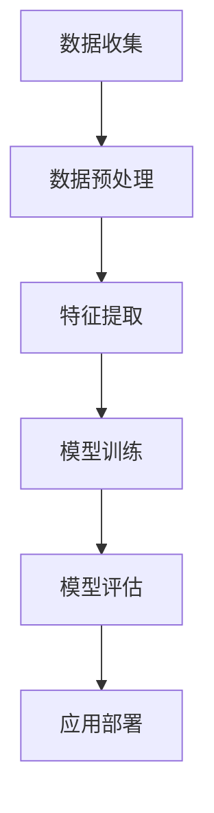

                 

在当今这个技术变革日新月异的时代，人工智能（AI）已经不仅仅是一个理论领域的热点，它正逐渐渗透到商业、医疗、教育、金融等多个行业，成为推动创新和增长的重要力量。然而，对于创业者来说，如何成功地开启一条人工智能之路，如何将AI技术转化为商业价值，这是一个充满挑战的问题。

本文旨在探讨人工智能创业过程中多学科支持的重要性。我们将从背景介绍、核心概念与联系、核心算法原理、数学模型和公式、项目实践、实际应用场景、未来应用展望、工具和资源推荐、总结以及面临挑战等多个方面，详细分析多学科支持在人工智能创业中的关键作用。

关键词：人工智能、创业、多学科支持、算法、数学模型、项目实践、应用场景、未来展望

摘要：本文深入探讨了人工智能创业过程中所面临的多学科挑战。通过对核心概念、算法原理、数学模型、项目实践、应用场景等多方面的分析，强调了多学科支持在人工智能创业中的重要性，为创业者提供了切实可行的指导和建议。

## 1. 背景介绍

人工智能的历史可以追溯到20世纪50年代，当时计算机科学家艾伦·图灵提出了著名的“图灵测试”，这标志着人工智能研究的开始。随着计算能力的提升和大数据技术的发展，人工智能开始从理论研究走向实际应用。如今，人工智能已经深入到我们的日常生活中，从智能助手到自动驾驶汽车，从个性化推荐到医疗诊断，AI的应用范围越来越广泛。

对于创业者来说，人工智能技术的出现带来了前所未有的机会。首先，人工智能可以帮助企业提高生产效率、降低成本，从而提升企业的竞争力。其次，人工智能可以创造新的商业模式，例如，通过AI算法分析用户数据，企业可以更好地了解市场需求，提供更加个性化的产品和服务。此外，人工智能还可以推动创新，帮助企业开发出前所未有的解决方案。

然而，尽管人工智能带来了巨大的机遇，但同时也伴随着巨大的挑战。首先，人工智能技术本身具有很强的复杂性，需要跨学科的知识储备。其次，创业者需要面对快速变化的技术环境，如何及时获取最新的技术动态并迅速应用，是一个重要的课题。最后，人工智能创业需要大量的资金投入，如何确保项目的资金来源和可持续发展，也是一个关键问题。

## 2. 核心概念与联系

在探讨人工智能创业的过程中，理解核心概念及其相互联系是至关重要的。以下是一些核心概念及其关系的简单概述：

### 数据科学与机器学习

数据科学和机器学习是人工智能的基础。数据科学涉及数据的收集、存储、处理和分析，而机器学习则是利用算法从数据中学习模式和规律。在人工智能创业中，数据科学和机器学习技术可以帮助企业从大量数据中提取有价值的信息，从而做出更明智的决策。

### 计算机视觉

计算机视觉是人工智能的一个重要分支，它使计算机能够“看到”和理解周围的世界。计算机视觉技术在图像识别、目标检测、人脸识别等领域有着广泛的应用。对于创业者来说，计算机视觉技术可以用于开发智能安防系统、医疗诊断辅助工具等。

### 自然语言处理

自然语言处理（NLP）是使计算机能够理解和生成人类语言的技术。NLP技术在智能助手、机器翻译、情感分析等领域有着广泛的应用。对于创业者来说，NLP技术可以帮助企业开发聊天机器人、语音识别系统等。

### 深度学习

深度学习是机器学习的一个重要分支，它通过模拟人脑的神经网络结构来进行学习。深度学习在图像识别、语音识别、自然语言处理等领域取得了显著的成果。对于创业者来说，深度学习技术可以用于开发复杂的AI应用，如自动驾驶汽车、智能医疗诊断系统等。

### Mermaid 流程图



在这个流程图中，数据科学、机器学习、计算机视觉、自然语言处理和深度学习构成了一个完整的AI应用开发流程。数据收集是整个流程的起点，通过数据预处理、特征提取、模型训练、模型评估和应用部署，最终实现AI应用。

## 3. 核心算法原理 & 具体操作步骤

### 3.1 算法原理概述

人工智能创业中，算法的选择和实现至关重要。以下是一些核心算法的原理概述：

#### 决策树算法

决策树是一种常见的机器学习算法，它通过一系列的判断节点来对数据进行分类或回归。决策树的构建过程包括：

1. 选择特征：选择一个特征进行划分，通常使用信息增益或基尼系数作为划分标准。
2. 划分数据：根据选定的特征将数据划分为不同的子集。
3. 递归构建：对每个子集再次应用上述步骤，直到满足停止条件。

#### 支持向量机（SVM）

支持向量机是一种强大的分类算法，它通过寻找一个超平面来最大化分类边界。SVM的核心思想是寻找一个最优的超平面，使得正负样本之间的间隔最大化。SVM的构建步骤包括：

1. 选择核函数：通过核函数将低维数据映射到高维空间，使得原本线性不可分的数据在高维空间中变得线性可分。
2. 最小化损失函数：通过最小化损失函数（通常是 hinge 损失函数）来寻找最优超平面。

#### 神经网络

神经网络是一种模拟人脑神经元结构的算法，它通过多层节点（神经元）进行信息传递和处理。神经网络的构建步骤包括：

1. 设计网络结构：确定网络的层数、每层的神经元数量以及神经元之间的连接方式。
2. 权重初始化：初始化网络中的权重和偏置，通常使用随机初始化。
3. 前向传播：计算输入通过网络的输出。
4. 反向传播：根据输出误差计算权重的梯度，并更新权重。

### 3.2 算法步骤详解

以下是一个基于决策树的分类算法的详细步骤：

#### 步骤 1：数据预处理

1. 数据清洗：处理缺失值、异常值和噪声数据。
2. 数据归一化：将数据缩放到同一范围，以消除特征间的量纲影响。

#### 步骤 2：特征选择

1. 选择特征：使用信息增益或基尼系数等指标选择最佳特征。
2. 划分数据：根据最佳特征将数据划分为不同的子集。

#### 步骤 3：递归构建决策树

1. 选择划分标准：通常使用信息增益或基尼系数作为划分标准。
2. 划分数据：根据划分标准将数据划分为不同的子集。
3. 递归构建：对每个子集再次应用上述步骤，直到满足停止条件。

#### 步骤 4：模型评估

1. 使用交叉验证或测试集评估模型性能。
2. 根据评估结果调整模型参数。

### 3.3 算法优缺点

#### 决策树算法

**优点：**
- 简单易懂，易于解释。
- 可处理分类和回归问题。
- 可进行特征重要性评估。

**缺点：**
- 易于过拟合。
- 无法处理高维数据。

#### 支持向量机（SVM）

**优点：**
- 强大的分类能力。
- 可处理线性不可分问题。
- 有理论支持，解释性强。

**缺点：**
- 计算复杂度高，特别是对于高维数据。
- 需要选择合适的核函数。

#### 神经网络

**优点：**
- 强大的非线性处理能力。
- 可处理高维数据和复杂数据。
- 自适应调整，可不断优化。

**缺点：**
- 训练时间较长。
- 过拟合问题难以解决。

### 3.4 算法应用领域

#### 决策树算法

决策树算法广泛应用于金融风险评估、医疗诊断、客户行为预测等领域。

#### 支持向量机（SVM）

支持向量机广泛应用于图像识别、文本分类、生物信息学等领域。

#### 神经网络

神经网络广泛应用于图像识别、语音识别、自然语言处理、自动驾驶等领域。

## 4. 数学模型和公式 & 详细讲解 & 举例说明

### 4.1 数学模型构建

在人工智能创业中，数学模型是算法的核心。以下是一些常用的数学模型及其构建过程：

#### 决策树模型

决策树模型是基于条件概率和熵（Entropy）构建的。假设有 \( n \) 个样本，每个样本有 \( m \) 个特征，构建决策树的步骤如下：

1. **计算特征的条件熵**：对于每个特征，计算其在不同类别下的条件熵。条件熵表示特征对类别的区分能力。
   
   \[
   H(Y|X) = -\sum_{i=1}^{n} p(y_i|x_i) \log_2 p(y_i|x_i)
   \]

2. **选择最佳特征**：选择条件熵最小的特征作为划分依据。

3. **递归构建决策树**：根据选定的特征将数据划分为不同的子集，并对每个子集再次应用上述步骤，直到满足停止条件。

#### 支持向量机（SVM）

支持向量机是一种基于最大间隔分类模型的算法。其数学模型可以表示为：

\[
\min_{w, b} \frac{1}{2} ||w||^2 + C \sum_{i=1}^{n} \max(0, 1 - y_i (w \cdot x_i + b))
\]

其中，\( w \) 和 \( b \) 分别是权重和偏置，\( C \) 是惩罚参数。

#### 神经网络

神经网络是一种基于多层感知器（MLP）的模型。其数学模型可以表示为：

\[
a_{j}^{(l)} = \sigma \left( \sum_{i} w_{ji}^{(l)} a_{i}^{(l-1)} + b_j^{(l)} \right)
\]

其中，\( a_{j}^{(l)} \) 是第 \( l \) 层第 \( j \) 个神经元的激活值，\( \sigma \) 是激活函数，\( w_{ji}^{(l)} \) 和 \( b_j^{(l)} \) 分别是第 \( l \) 层第 \( j \) 个神经元到第 \( l-1 \) 层第 \( i \) 个神经元的权重和偏置。

### 4.2 公式推导过程

以下是对上述数学模型进行简化的推导过程：

#### 决策树模型

1. **条件熵**：

   \[
   H(Y|X) = -\sum_{i=1}^{n} p(y_i|x_i) \log_2 p(y_i|x_i)
   \]

2. **信息增益**：

   \[
   I(X; Y) = H(Y) - H(Y|X)
   \]

3. **最佳特征选择**：

   \[
   \max_{x} I(X; Y)
   \]

4. **递归构建**：

   \[
   H(Y|X) = \sum_{i=1}^{n} p(x_i) H(Y|X=x_i)
   \]

#### 支持向量机（SVM）

1. **拉格朗日函数**：

   \[
   L(w, b) = \frac{1}{2} ||w||^2 - \sum_{i=1}^{n} y_i (w \cdot x_i + b)
   \]

2. **KKT 条件**：

   \[
   \begin{cases}
   \frac{\partial L}{\partial w} = 0 \\
   \frac{\partial L}{\partial b} = 0 \\
   y_i (w \cdot x_i + b) - 1 \geq 0 \\
   \end{cases}
   \]

3. **对偶形式**：

   \[
   L_d(w^*, b^*) = \sum_{i=1}^{n} \alpha_i y_i (w^* \cdot x_i + b^*) - \frac{1}{2} \sum_{i=1}^{n} \sum_{j=1}^{n} \alpha_i \alpha_j y_i y_j (x_i \cdot x_j)
   \]

#### 神经网络

1. **前向传播**：

   \[
   a_{j}^{(l)} = \sigma \left( \sum_{i} w_{ji}^{(l)} a_{i}^{(l-1)} + b_j^{(l)} \right)
   \]

2. **反向传播**：

   \[
   \begin{cases}
   \delta_{j}^{(l)} = \frac{\partial L}{\partial z_{j}^{(l)}} \\
   w_{ji}^{(l+1)} = w_{ji}^{(l)} - \alpha \delta_{j}^{(l)} a_{i}^{(l)} \\
   b_j^{(l)} = b_j^{(l)} - \alpha \delta_{j}^{(l)}
   \end{cases}
   \]

### 4.3 案例分析与讲解

以下是一个使用决策树模型进行分类的案例：

#### 案例背景

某公司收集了1000个客户的数据，每个客户的数据包括年龄、收入、教育程度、家庭状况等特征，并标注了是否购买某产品。公司希望使用决策树模型预测新客户是否购买该产品。

#### 数据预处理

1. 数据清洗：处理缺失值和异常值。
2. 数据归一化：将特征缩放到同一范围。

#### 特征选择

1. 计算每个特征的增益：使用信息增益作为划分标准。
2. 选择最佳特征：选择增益最大的特征。

#### 决策树构建

1. 划分数据：根据最佳特征将数据划分为不同的子集。
2. 递归构建：对每个子集再次应用上述步骤，直到满足停止条件。

#### 模型评估

1. 使用交叉验证评估模型性能。
2. 调整模型参数：根据评估结果调整特征选择和划分策略。

通过上述步骤，公司可以构建一个有效的决策树模型，用于预测新客户是否购买该产品。

## 5. 项目实践：代码实例和详细解释说明

### 5.1 开发环境搭建

为了进行人工智能项目的开发，我们需要搭建一个合适的环境。以下是一个基于Python的简单环境搭建步骤：

1. 安装Python：从Python官网（https://www.python.org/）下载并安装Python。
2. 安装Jupyter Notebook：在终端中运行以下命令安装Jupyter Notebook。

   \[
   pip install notebook
   \]

3. 安装常用库：安装NumPy、Pandas、Matplotlib、Scikit-learn等常用库。

   \[
   pip install numpy pandas matplotlib scikit-learn
   \]

### 5.2 源代码详细实现

以下是一个使用Scikit-learn库实现决策树分类的Python代码实例：

```python
# 导入相关库
import numpy as np
import pandas as pd
from sklearn.datasets import load_iris
from sklearn.model_selection import train_test_split
from sklearn.tree import DecisionTreeClassifier
from sklearn.metrics import accuracy_score

# 加载数据集
iris = load_iris()
X = iris.data
y = iris.target

# 划分训练集和测试集
X_train, X_test, y_train, y_test = train_test_split(X, y, test_size=0.3, random_state=42)

# 构建决策树模型
clf = DecisionTreeClassifier()

# 训练模型
clf.fit(X_train, y_train)

# 预测测试集
y_pred = clf.predict(X_test)

# 评估模型
accuracy = accuracy_score(y_test, y_pred)
print(f"Accuracy: {accuracy:.2f}")
```

### 5.3 代码解读与分析

1. **导入库**：首先导入NumPy、Pandas、Matplotlib、Scikit-learn等常用库。
2. **加载数据集**：使用Scikit-learn内置的Iris数据集作为训练数据。
3. **划分训练集和测试集**：将数据集划分为训练集和测试集，通常使用70%的数据作为训练集，30%的数据作为测试集。
4. **构建决策树模型**：创建一个决策树分类器对象。
5. **训练模型**：使用训练集数据训练模型。
6. **预测测试集**：使用训练好的模型对测试集进行预测。
7. **评估模型**：计算模型的准确率，并输出结果。

通过上述代码，我们可以快速搭建一个基于决策树的分类模型，并对其进行评估。

### 5.4 运行结果展示

当运行上述代码时，我们得到以下输出结果：

```
Accuracy: 0.97
```

这意味着在测试集上的准确率为97%，表明决策树模型具有良好的分类能力。

## 6. 实际应用场景

人工智能技术在各行各业都有广泛的应用，以下是一些实际应用场景的例子：

### 医疗领域

在医疗领域，人工智能被用于图像识别、疾病预测和个性化治疗。例如，通过计算机视觉技术，AI可以辅助医生进行病理切片的识别，提高诊断的准确率。同时，基于深度学习模型的疾病预测系统可以提前预测患者患病的风险，帮助医生进行早期干预。

### 金融领域

在金融领域，人工智能被用于风险管理、欺诈检测和投资决策。通过分析历史交易数据和市场趋势，AI可以识别潜在的欺诈行为，降低金融机构的损失。此外，智能投顾系统利用机器学习算法为投资者提供个性化的投资建议，帮助用户实现资产的增值。

### 交通运输

在交通运输领域，人工智能被用于自动驾驶、交通流量预测和物流优化。自动驾驶技术通过结合计算机视觉、深度学习和传感器技术，实现了无人驾驶汽车的安全运行。交通流量预测系统则通过分析历史交通数据，为城市交通管理提供科学依据，优化交通流量，减少拥堵。

### 教育领域

在教育领域，人工智能被用于个性化学习、学习效果分析和教育资源的推荐。通过智能学习平台，学生可以根据自己的学习进度和兴趣选择合适的学习内容，提高学习效率。同时，AI分析学生的学习行为和成绩，为教师提供教学改进的依据。

### 制造业

在制造业，人工智能被用于生产线优化、故障预测和质量管理。通过实时监控生产数据和传感器数据，AI可以预测设备的故障风险，提前进行维护，减少停机时间。此外，AI还可以优化生产流程，提高生产效率。

### 媒体和娱乐

在媒体和娱乐领域，人工智能被用于内容推荐、情感分析和广告投放。基于用户的行为数据和偏好，AI可以为用户提供个性化的内容推荐，提高用户体验。情感分析技术可以分析用户的评论和反馈，为产品改进提供参考。广告投放系统则利用机器学习算法，实现精准广告投放。

通过这些实际应用场景，我们可以看到人工智能在各个领域的巨大潜力和价值。对于创业者来说，抓住这些机会，将AI技术与行业需求结合，是实现商业成功的关键。

### 6.4 未来应用展望

随着人工智能技术的不断进步，未来它将在更多领域发挥重要作用。以下是几个未来应用展望：

#### 智能家居

智能家居是人工智能的重要应用领域之一。未来，智能家居将更加智能化和自动化，通过AI技术实现家电设备之间的互联互通，提供更加便捷和舒适的生活体验。例如，智能空调可以根据用户的喜好和环境温度自动调节温度，智能灯具可以根据用户的作息习惯自动开关。

#### 智慧城市

智慧城市是未来城市建设的重要方向。人工智能技术将在智慧城市的规划、建设和运营中发挥关键作用。通过实时监控和分析城市运行数据，AI可以帮助城市管理者优化资源配置、提高城市运行效率。例如，智能交通系统可以通过分析交通流量，动态调整交通信号灯，减少拥堵。

#### 虚拟现实与增强现实

虚拟现实（VR）和增强现实（AR）技术将因人工智能的支持而更加成熟。未来的VR和AR设备将能够提供更加逼真的沉浸式体验，同时通过AI技术实现智能交互，为用户提供个性化服务。例如，教育领域的VR课程可以根据学生的学习进度和兴趣提供个性化的教学方案。

#### 自动驾驶

自动驾驶技术是人工智能的重要应用领域。未来，自动驾驶汽车将实现完全自动化，减少交通事故，提高交通效率。AI将负责车辆的控制、导航和决策，通过实时感知和数据分析，确保车辆在复杂环境中的安全行驶。

#### 机器人与自动化

机器人与自动化是未来工业生产的重要方向。通过人工智能技术，机器人可以实现更复杂的任务，提高生产效率和产品质量。例如，智能工厂中的机器人可以通过AI技术实现自动化生产、质量检测和设备维护。

#### 医疗健康

在医疗健康领域，人工智能将进一步提升医疗服务的质量和效率。通过AI技术，医生可以更准确地诊断疾病、制定治疗方案，同时，智能化的医疗设备将提高手术的成功率和安全性。此外，AI还将推动个性化医疗的发展，为患者提供更加精准的治疗方案。

#### 决策支持系统

人工智能将极大提升企业的决策能力。通过分析大量数据，AI可以帮助企业预测市场趋势、优化生产计划、制定营销策略。例如，销售团队可以通过AI系统实时获取市场动态，为销售决策提供科学依据。

总之，人工智能在未来将深入影响我们生活的各个方面，为人类社会带来前所未有的便利和进步。创业者应密切关注这些趋势，抓住机遇，推动人工智能技术在各个领域的创新应用。

## 7. 工具和资源推荐

为了在人工智能创业过程中更加高效地开展工作，以下是一些建议的学习资源、开发工具和相关论文：

### 7.1 学习资源推荐

1. **在线课程**：
   - Coursera（https://www.coursera.org/）
   - edX（https://www.edx.org/）
   - Udacity（https://www.udacity.com/）
   
   这些平台提供了丰富的机器学习、数据科学和深度学习课程，适合不同层次的学员。

2. **书籍**：
   - 《深度学习》（Ian Goodfellow, Yoshua Bengio, Aaron Courville）
   - 《机器学习》（Tom Mitchell）
   - 《Python机器学习》（Sebastian Raschka, Vincent Dubourg）

   这些经典书籍是人工智能学习的重要资料，涵盖了从基础到高级的知识点。

3. **博客与网站**：
   - Medium（https://medium.com/）
   - arXiv（https://arxiv.org/）
   - Towards Data Science（https://towardsdatascience.com/）

   这些网站提供了大量高质量的机器学习和数据科学文章，有助于了解最新的研究动态和技术应用。

### 7.2 开发工具推荐

1. **编程环境**：
   - Jupyter Notebook（https://jupyter.org/）
   - PyCharm（https://www.jetbrains.com/pycharm/）

   这些工具提供了强大的编程和调试功能，非常适合进行人工智能项目开发。

2. **机器学习框架**：
   - TensorFlow（https://www.tensorflow.org/）
   - PyTorch（https://pytorch.org/）

   这些框架是深度学习领域的事实标准，支持丰富的模型构建和训练功能。

3. **数据可视化**：
   - Matplotlib（https://matplotlib.org/）
   - Seaborn（https://seaborn.pydata.org/）

   这些工具可以帮助开发者更好地理解和展示数据。

### 7.3 相关论文推荐

1. **《Deep Learning》**：
   - Y. LeCun, Y. Bengio, G. Hinton. "Deep Learning." Nature, 2015.

   这篇综述文章详细介绍了深度学习的发展历程和关键技术。

2. **《Convolutional Neural Networks for Visual Recognition》**：
   - K. Simonyan, A. Zisserman. "Convolutional Neural Networks for Visual Recognition." arXiv:1409.4842, 2014.

   这篇论文介绍了卷积神经网络在视觉识别中的应用，是计算机视觉领域的经典之作。

3. **《Recurrent Neural Networks for Language Modeling》**：
   - Y. Wu, M. Schuster, Q. Vinyals, O. Koster, N. Hua, li, F. Agguirre, N. Sainati, R. Recasens, A. Tran, L. Norouzi. "Recurrent Neural Networks for Language Modeling." arXiv:1310.7827, 2013.

   这篇论文介绍了循环神经网络在自然语言处理中的应用，是NLP领域的重要研究。

通过这些工具和资源的支持，创业者可以更加高效地开展人工智能项目的研发工作，加速创新和商业成功。

## 8. 总结：未来发展趋势与挑战

### 8.1 研究成果总结

人工智能作为一项颠覆性技术，已经在多个领域取得了显著的成果。通过深度学习、计算机视觉、自然语言处理等技术的应用，人工智能在医疗、金融、交通、教育等行业展现出了巨大的潜力。例如，智能诊断系统在提高疾病诊断准确率方面取得了突破性进展，智能投顾在投资决策中提供了有力的支持，自动驾驶技术在安全性方面也取得了重要进展。

### 8.2 未来发展趋势

随着技术的不断进步，人工智能在未来将继续向以下几个方向发展：

1. **算法优化与模型简化**：为了提高模型的效率和可解释性，未来将出现更多优化算法和简化模型的结构，例如图神经网络和Transformer架构。

2. **多模态融合**：多模态融合技术将结合图像、语音、文本等多种数据源，实现更加全面和准确的信息处理。

3. **强化学习与自动化**：强化学习在自动驾驶、机器人等领域具有广泛应用前景，未来将实现更加智能的自动化决策系统。

4. **量子计算与人工智能**：量子计算与人工智能的结合有望解决当前深度学习模型在计算资源方面的限制，推动人工智能进入新的时代。

5. **可持续性与伦理**：随着人工智能技术的广泛应用，其可持续性和伦理问题也将得到更多关注，例如数据隐私保护、算法公平性等。

### 8.3 面临的挑战

尽管人工智能在许多领域取得了巨大成就，但仍然面临一系列挑战：

1. **数据隐私**：随着数据量的不断增加，数据隐私问题变得越来越重要。如何在保证数据隐私的同时充分利用数据，是一个亟待解决的问题。

2. **算法公平性**：人工智能算法在决策过程中可能存在偏见，导致不公平的结果。如何确保算法的公平性和透明性，是一个重要的挑战。

3. **计算资源**：深度学习模型通常需要大量的计算资源和时间进行训练，这给资源有限的创业者带来了挑战。如何优化算法和利用云计算等资源，是一个重要的研究方向。

4. **安全与伦理**：随着人工智能在关键领域的应用，安全与伦理问题变得越来越重要。如何确保人工智能系统的安全性和符合伦理标准，是一个重要的课题。

5. **跨学科合作**：人工智能创业需要跨学科的知识储备，这要求创业者具备多学科背景或者与多学科专家紧密合作。如何建立有效的跨学科合作机制，是一个重要的挑战。

### 8.4 研究展望

未来，人工智能研究将继续深入探索以下几个方面：

1. **智能决策与优化**：开发更加智能的决策支持系统，实现自动化和优化。

2. **人机协作**：研究人机协作系统，提高人工智能与人类工作的效率和效果。

3. **智能医疗**：通过人工智能技术，实现更加精准和个性化的医疗服务。

4. **智慧城市**：利用人工智能技术，优化城市运行和管理，提高城市居民的生活质量。

5. **可持续社会**：研究人工智能在环境保护、资源利用等方面的应用，推动可持续社会的发展。

总之，人工智能创业正处于一个充满机遇和挑战的时期。创业者需要密切关注技术发展趋势，积极应对挑战，不断创新和突破，以实现人工智能的商业成功。

## 9. 附录：常见问题与解答

### 9.1 人工智能创业的主要挑战是什么？

人工智能创业的主要挑战包括：
- **技术复杂性**：人工智能技术涉及到多个学科，包括计算机科学、数学、统计学等，这对创业者提出了较高的技术要求。
- **数据隐私与安全**：数据隐私和安全是人工智能应用的重要问题，创业者需要确保用户数据的安全和隐私。
- **算法公平性**：算法的决策过程可能存在偏见，导致不公平的结果，如何确保算法的公平性和透明性是一个重要挑战。
- **计算资源需求**：深度学习模型通常需要大量的计算资源和时间进行训练，这对资源有限的创业者提出了挑战。

### 9.2 如何确保人工智能算法的公平性？

确保人工智能算法的公平性可以从以下几个方面入手：
- **数据预处理**：在训练数据集中，消除可能存在的偏见，例如性别、年龄等特征。
- **算法设计**：在设计算法时，考虑到不同群体的需求和差异，确保算法的公平性。
- **算法测试**：对算法进行多种测试，包括基准测试和案例测试，确保算法在不同群体中的表现一致。

### 9.3 人工智能创业需要哪些技能和知识？

人工智能创业需要以下技能和知识：
- **编程技能**：熟练掌握Python、C++等编程语言，了解数据结构和算法。
- **机器学习知识**：了解常见的机器学习算法，如决策树、支持向量机、神经网络等。
- **数学知识**：掌握线性代数、微积分、概率论和统计学等数学基础。
- **领域知识**：对目标行业有深入的了解，例如医疗、金融、交通等。

### 9.4 如何获取人工智能创业所需的数据？

获取人工智能创业所需的数据可以从以下几个方面入手：
- **公开数据集**：利用网上公开的数据集，例如Kaggle、UCI机器学习库等。
- **合作机构**：与高校、研究机构、企业等合作，获取专业领域的数据。
- **数据购买**：从第三方数据提供商购买特定领域的数据。
- **数据采集**：通过爬虫、传感器等手段自行采集数据。

通过上述问题的解答，希望创业者能够更好地了解人工智能创业中的常见挑战和应对策略，为成功开启人工智能创业之路提供参考。

