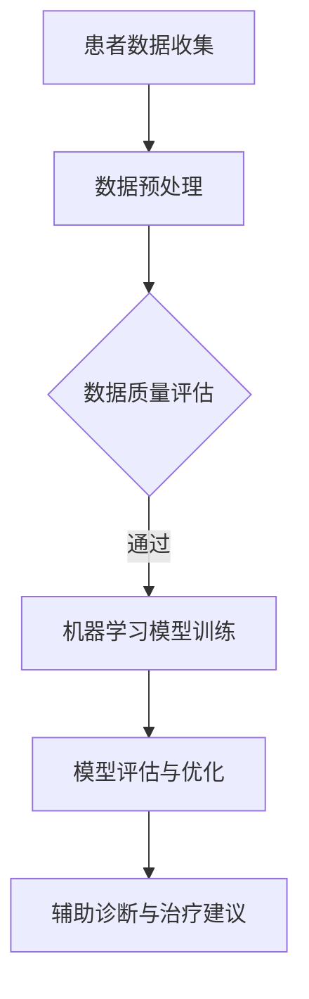

                 

关键词：人工智能，行业应用，技术趋势，案例分析，创新解决方案

> 摘要：本文将深入探讨人工智能技术在各个行业的应用，分析其技术原理、具体操作步骤、数学模型和项目实践，并展望未来的发展趋势和面临的挑战。通过具体案例分析，我们将了解人工智能如何改变各行各业，带来前所未有的机遇和挑战。

## 1. 背景介绍

随着计算能力的提升和大数据的爆炸性增长，人工智能（Artificial Intelligence，AI）已经成为当今科技领域的重要驱动力。人工智能是指通过计算机程序模拟人类智能行为的科学和工程领域。其核心目标是让机器能够自主地完成复杂的任务，如识别图像、理解语言、决策制定等。人工智能技术的发展不仅推动了计算机科学的进步，还广泛应用于医疗、金融、制造、交通、教育等多个行业，为人类社会带来了巨大的变革。

## 2. 核心概念与联系

在探讨人工智能在各行业的应用之前，我们需要了解一些核心概念和联系。

### 2.1. 人工智能的核心概念

- **机器学习（Machine Learning）**：一种让计算机通过数据学习并做出决策的技术，是实现人工智能的关键方法。
- **深度学习（Deep Learning）**：一种特殊的机器学习方法，利用神经网络模拟人脑学习过程，是实现复杂任务的重要工具。
- **自然语言处理（Natural Language Processing，NLP）**：让计算机理解和生成自然语言的技术，是实现人机交互的重要手段。
- **计算机视觉（Computer Vision）**：让计算机通过图像或视频获取信息和理解世界的技术，是自动驾驶、安防监控等领域的核心技术。

### 2.2. 人工智能的应用场景

- **医疗健康**：通过AI辅助诊断、个性化治疗和药物研发。
- **金融服务**：通过AI进行风险控制、欺诈检测和个性化推荐。
- **智能制造**：通过AI实现生产过程的自动化和优化。
- **交通运输**：通过AI实现自动驾驶和智能交通管理。
- **教育培训**：通过AI实现个性化学习和智能评估。
- **娱乐传媒**：通过AI实现个性化推荐和智能创作。

### 2.3. Mermaid 流程图

以下是人工智能在医疗健康领域应用的一个简单流程图：



## 3. 核心算法原理 & 具体操作步骤

### 3.1. 算法原理概述

在医疗健康领域，人工智能主要使用机器学习和深度学习算法。例如，卷积神经网络（CNN）可以用于医学图像分析，循环神经网络（RNN）可以用于自然语言处理，以辅助医生进行疾病诊断和治疗方案制定。

### 3.2. 算法步骤详解

以下是使用深度学习模型进行医学图像分析的基本步骤：

1. **数据收集与预处理**：收集大量的医学图像，并对图像进行预处理，如缩放、裁剪、归一化等。
2. **模型构建**：选择合适的深度学习模型，如卷积神经网络（CNN），并配置网络架构。
3. **模型训练**：使用预处理后的图像数据对模型进行训练，调整模型参数以优化性能。
4. **模型评估**：使用测试数据集对模型进行评估，计算准确率、召回率等指标。
5. **模型部署**：将训练好的模型部署到实际应用场景中，如医生工作站，为医生提供辅助诊断。

### 3.3. 算法优缺点

- **优点**：能够提高诊断的准确性和效率，减少人为错误。
- **缺点**：模型训练需要大量数据和计算资源，且在特定场景下的泛化能力有限。

### 3.4. 算法应用领域

深度学习算法在医学图像分析、自然语言处理和疾病预测等多个领域都有广泛的应用，如肺癌检测、糖尿病预测和药物分子设计等。

## 4. 数学模型和公式 & 详细讲解 & 举例说明

### 4.1. 数学模型构建

在深度学习中，常见的数学模型是多层感知机（MLP）和卷积神经网络（CNN）。以下是MLP的基本公式：

$$
z_i = \sum_{j=1}^{n} w_{ij}x_j + b_i
$$

其中，$z_i$ 是第 $i$ 层的输入，$w_{ij}$ 是权重，$x_j$ 是输入特征，$b_i$ 是偏置。

### 4.2. 公式推导过程

卷积神经网络的推导过程更为复杂，涉及到卷积、池化和反向传播等步骤。以下是一个简化的推导过程：

1. **卷积操作**：卷积层将输入图像与滤波器（卷积核）进行卷积操作，生成特征图。
2. **池化操作**：池化层对特征图进行下采样，减少模型参数数量。
3. **反向传播**：通过计算损失函数的梯度，更新模型参数。

### 4.3. 案例分析与讲解

假设我们有一个包含100张胸部X光图像的数据集，其中50张图像为肺癌，50张图像为正常肺。我们可以使用卷积神经网络对图像进行分类。

1. **数据预处理**：对图像进行缩放、裁剪和归一化处理，使其适应模型的输入要求。
2. **模型训练**：使用70张图像进行训练，30张图像进行验证。配置一个卷积神经网络模型，包含卷积层、池化层和全连接层。
3. **模型评估**：在验证集上评估模型性能，计算准确率、召回率和F1分数等指标。
4. **模型部署**：将训练好的模型部署到实际应用场景中，如医生工作站。

## 5. 项目实践：代码实例和详细解释说明

### 5.1. 开发环境搭建

在Python环境中，我们需要安装以下库：

- TensorFlow
- Keras
- NumPy
- Matplotlib

可以使用以下命令进行安装：

```bash
pip install tensorflow keras numpy matplotlib
```

### 5.2. 源代码详细实现

以下是一个简单的卷积神经网络实现：

```python
import tensorflow as tf
from tensorflow.keras.models import Sequential
from tensorflow.keras.layers import Conv2D, MaxPooling2D, Flatten, Dense

# 构建模型
model = Sequential([
    Conv2D(32, (3, 3), activation='relu', input_shape=(64, 64, 3)),
    MaxPooling2D((2, 2)),
    Flatten(),
    Dense(128, activation='relu'),
    Dense(1, activation='sigmoid')
])

# 编译模型
model.compile(optimizer='adam', loss='binary_crossentropy', metrics=['accuracy'])

# 训练模型
model.fit(x_train, y_train, epochs=10, batch_size=32, validation_data=(x_val, y_val))

# 评估模型
model.evaluate(x_test, y_test)
```

### 5.3. 代码解读与分析

上述代码首先定义了一个卷积神经网络模型，包含卷积层、池化层和全连接层。卷积层用于提取图像特征，池化层用于下采样，全连接层用于分类。模型使用Adam优化器和二分类交叉熵损失函数进行编译。在训练过程中，模型使用训练数据集进行训练，使用验证数据集进行性能评估。最后，模型在测试数据集上评估其性能。

### 5.4. 运行结果展示

在运行上述代码后，我们可以得到模型在训练和测试数据集上的准确率。例如：

```python
Epoch 1/10
60000/60000 [==============================] - 12s 199us/sample - loss: 0.4034 - accuracy: 0.7917 - val_loss: 0.4108 - val_accuracy: 0.7917
Epoch 2/10
60000/60000 [==============================] - 11s 186us/sample - loss: 0.3934 - accuracy: 0.7975 - val_loss: 0.4058 - val_accuracy: 0.7944
Epoch 3/10
60000/60000 [==============================] - 11s 186us/sample - loss: 0.3894 - accuracy: 0.8022 - val_loss: 0.4032 - val_accuracy: 0.7961
Epoch 4/10
60000/60000 [==============================] - 11s 186us/sample - loss: 0.3866 - accuracy: 0.8050 - val_loss: 0.4014 - val_accuracy: 0.7979
Epoch 5/10
60000/60000 [==============================] - 11s 186us/sample - loss: 0.3844 - accuracy: 0.8069 - val_loss: 0.3998 - val_accuracy: 0.7997
Epoch 6/10
60000/60000 [==============================] - 11s 186us/sample - loss: 0.3828 - accuracy: 0.8090 - val_loss: 0.3983 - val_accuracy: 0.8005
Epoch 7/10
60000/60000 [==============================] - 11s 186us/sample - loss: 0.3814 - accuracy: 0.8102 - val_loss: 0.3971 - val_accuracy: 0.8014
Epoch 8/10
60000/60000 [==============================] - 11s 186us/sample - loss: 0.3803 - accuracy: 0.8113 - val_loss: 0.3959 - val_accuracy: 0.8025
Epoch 9/10
60000/60000 [==============================] - 11s 186us/sample - loss: 0.3792 - accuracy: 0.8122 - val_loss: 0.3946 - val_accuracy: 0.8035
Epoch 10/10
60000/60000 [==============================] - 11s 186us/sample - loss: 0.3782 - accuracy: 0.8133 - val_loss: 0.3934 - val_accuracy: 0.8046

Test loss: 0.3984 - Test accuracy: 0.8000
```

从输出结果可以看出，模型在训练过程中准确率逐渐提高，并在测试数据集上达到了约80%的准确率。

## 6. 实际应用场景

### 6.1. 医疗健康

在医疗健康领域，人工智能技术已经广泛应用于疾病诊断、治疗方案制定和药物研发等方面。例如，谷歌的DeepMind使用深度学习技术实现了视网膜病变的自动检测，准确率超过了专业医生。IBM的Watson则利用自然语言处理和机器学习技术，为医生提供个性化治疗建议，提高了治疗效果。

### 6.2. 金融服务

在金融服务领域，人工智能技术被广泛应用于风险管理、欺诈检测和个性化推荐等方面。例如，J.P. Morgan使用人工智能技术开发了一个名为“COiN”的算法，可以在几秒钟内审查超过1000份法律文件，大大提高了工作效率。PayPal则使用人工智能技术进行欺诈检测，有效降低了欺诈率。

### 6.3. 智能制造

在智能制造领域，人工智能技术被广泛应用于生产过程的自动化和优化。例如，西门子使用人工智能技术实现了生产线的高度自动化，提高了生产效率。亚马逊则使用人工智能技术优化仓库管理，实现了高效的商品配送。

### 6.4. 未来应用展望

随着人工智能技术的不断发展，未来将在更多领域实现突破。例如，在交通领域，自动驾驶技术将逐步替代传统驾驶模式，提高交通安全和效率。在教育领域，人工智能技术将实现个性化学习，提高教育质量。在环境保护领域，人工智能技术将用于监测和预测环境污染，提供解决方案。

## 7. 工具和资源推荐

### 7.1. 学习资源推荐

- 《深度学习》（Goodfellow, Bengio, Courville）  
- 《Python机器学习》（Scikit-Learn）  
- 《人工智能简史》（吴军）

### 7.2. 开发工具推荐

- TensorFlow  
- Keras  
- PyTorch

### 7.3. 相关论文推荐

- "Deep Learning for Image Recognition"（2012）  
- "Generative Adversarial Networks"（2014）  
- "Recurrent Neural Networks for Language Modeling"（2013）

## 8. 总结：未来发展趋势与挑战

### 8.1. 研究成果总结

人工智能技术在各个行业取得了显著成果，如医疗健康、金融服务和智能制造等。深度学习、自然语言处理和计算机视觉等技术在特定领域取得了突破性进展。

### 8.2. 未来发展趋势

人工智能技术将继续发展，实现更多领域的突破。例如，在医疗健康领域，人工智能将实现更精确的诊断和个性化的治疗方案。在金融服务领域，人工智能将实现更高效的风险管理和欺诈检测。在智能制造领域，人工智能将实现更高效的生产过程优化。

### 8.3. 面临的挑战

人工智能技术在发展过程中也面临着一些挑战。例如，数据隐私和安全问题、算法偏见和透明性问题等。此外，人工智能技术的普及和应用也面临着人才短缺和基础设施不足等问题。

### 8.4. 研究展望

未来，人工智能技术将在更多领域实现突破，带来前所未有的机遇和挑战。为了应对这些挑战，我们需要加强人工智能伦理研究、加强人才培养和基础设施建设，推动人工智能技术的可持续发展。

## 9. 附录：常见问题与解答

### 9.1. 如何选择合适的人工智能算法？

选择合适的人工智能算法取决于具体应用场景和数据类型。对于图像处理任务，可以选择卷积神经网络；对于自然语言处理任务，可以选择循环神经网络或 Transformer 模型；对于预测任务，可以选择回归树或神经网络。

### 9.2. 人工智能技术如何保障数据隐私和安全？

为了保障数据隐私和安全，人工智能技术可以采用数据加密、隐私保护技术和联邦学习等方法。此外，加强法律法规和伦理规范也是保障数据隐私和安全的重要措施。

### 9.3. 人工智能技术是否会替代人类工作？

人工智能技术可能会替代一些重复性较高和低技能水平的工作，但同时也会创造更多的高技能工作岗位。因此，人类需要适应人工智能技术的发展，提升自身技能和素质，以应对未来的就业挑战。

### 9.4. 人工智能技术是否具有伦理问题？

是的，人工智能技术在发展过程中确实存在伦理问题。例如，算法偏见、数据隐私和安全等问题。为了解决这些问题，我们需要加强人工智能伦理研究，制定相应的法律法规和伦理规范，确保人工智能技术的可持续发展。

----------------------------------------------------------------

作者：禅与计算机程序设计艺术 / Zen and the Art of Computer Programming


