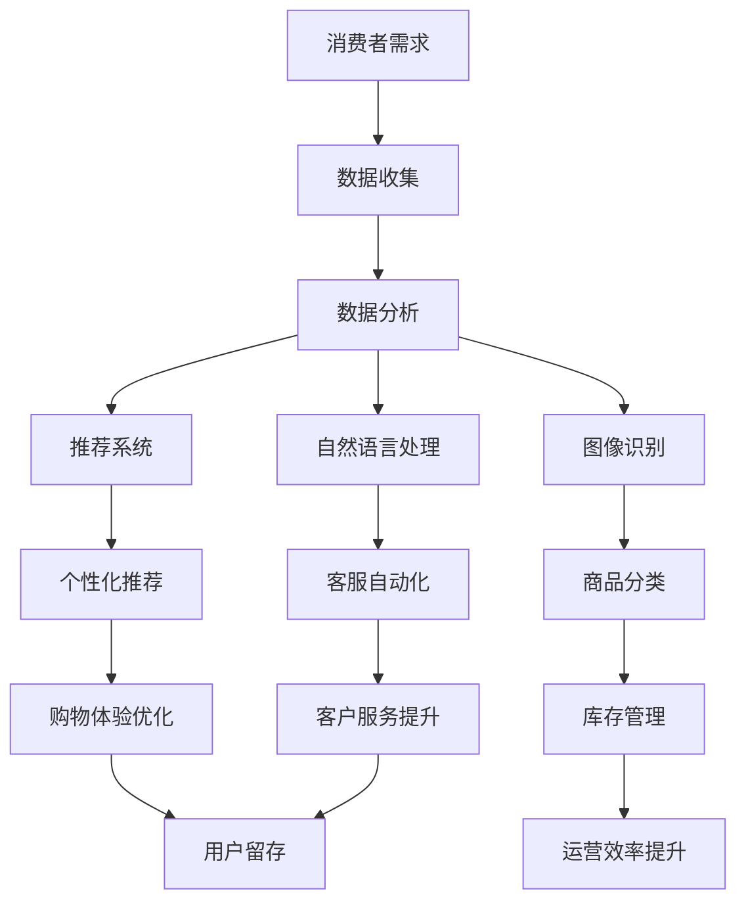

                 

关键词：人工智能、零售、电子商务、推荐系统、图像识别、自然语言处理、机器学习

> 摘要：本文探讨了人工智能在零售和电子商务领域的应用，分析了推荐系统、图像识别、自然语言处理等技术如何提升用户体验、优化运营效率，并提出了未来发展的展望与挑战。

## 1. 背景介绍

随着互联网技术的飞速发展，零售和电子商务行业经历了巨大的变革。线上购物逐渐成为消费者购物的主要方式，零售商和电商平台也在不断寻求创新和突破，以吸引更多用户和提高竞争力。在这个背景下，人工智能技术的应用显得尤为重要。人工智能（AI）通过模拟人类的智能行为，为零售和电子商务提供了强大的技术支持，使得个性化推荐、图像识别、自然语言处理等成为可能。

### 1.1 人工智能的定义与作用

人工智能是一门研究、开发用于模拟、延伸和扩展人类智能的理论、方法、技术及应用的科学。它旨在通过计算机系统实现人类智能的某些功能，如学习、推理、感知、决策等。在零售和电子商务领域，人工智能的主要作用如下：

1. **提升用户体验**：通过个性化推荐、智能客服等技术，满足消费者的个性化需求，提高购物体验。
2. **优化运营效率**：通过数据分析和智能决策，帮助零售商和电商平台优化库存管理、供应链管理，降低成本。
3. **创新业务模式**：通过人工智能技术，探索新的业务模式，如无人商店、智能物流等。

### 1.2 零售和电子商务的现状与挑战

当前，零售和电子商务市场呈现出以下特点：

1. **市场竞争激烈**：随着越来越多的企业进入市场，竞争日益激烈，如何吸引并留住用户成为关键。
2. **用户需求多样化**：消费者的购物需求越来越个性化、多样化，如何满足这些需求成为挑战。
3. **运营成本高**：库存管理、物流配送等环节需要大量的人力、物力投入，如何提高运营效率成为关键。

针对这些现状与挑战，人工智能技术的应用成为了解决问题的有效途径。

## 2. 核心概念与联系

在探讨人工智能在零售和电子商务中的应用时，我们需要了解一些核心概念和它们之间的联系。以下是一个简化的Mermaid流程图，展示了这些概念和它们之间的关系。



### 2.1 消费者需求

消费者需求是零售和电子商务的核心。了解消费者需求，能够帮助平台提供个性化推荐、优化商品展示等。消费者需求的数据收集主要通过用户行为数据、购物历史数据等途径获取。

### 2.2 数据分析

数据分析是对收集到的消费者数据进行处理、分析和解读，以提取有用的信息。通过数据分析，可以识别用户偏好、预测购买行为等。

### 2.3 推荐系统

推荐系统是基于数据分析的结果，为用户推荐他们可能感兴趣的商品或服务。推荐系统包括协同过滤、基于内容的推荐等多种算法。

### 2.4 图像识别

图像识别是利用计算机算法对图像进行分析和理解，以识别其中的物体、场景等。在零售和电子商务中，图像识别可以用于商品分类、库存管理等方面。

### 2.5 自然语言处理

自然语言处理是使计算机能够理解、处理和生成自然语言的技术。在零售和电子商务中，自然语言处理可以用于客服自动化、情感分析等。

### 2.6 个性化推荐

个性化推荐是基于用户的历史数据和偏好，为用户推荐他们可能感兴趣的商品或服务。个性化推荐可以显著提高购物体验和用户留存率。

### 2.7 商品分类

商品分类是将商品按照特定的规则进行归类，以便用户能够更方便地查找和购买。商品分类可以通过图像识别和自然语言处理等技术实现。

### 2.8 客服自动化

客服自动化是利用人工智能技术，实现自动化的客户服务。通过自然语言处理和机器学习算法，客服自动化可以回答常见问题、处理客户投诉等。

### 2.9 购物体验优化

购物体验优化是通过各种技术手段，如个性化推荐、智能客服等，提升用户的购物体验。优化的购物体验可以增强用户满意度和忠诚度。

### 2.10 库存管理

库存管理是通过各种技术手段，如大数据分析、图像识别等，优化库存水平，减少库存成本。优化的库存管理可以降低运营成本，提高运营效率。

### 2.11 客户服务提升

客户服务提升是通过各种技术手段，如智能客服、情感分析等，提升客户服务水平。提升的客户服务可以增强客户满意度和忠诚度。

### 2.12 用户留存

用户留存是通过各种技术手段，如个性化推荐、购物体验优化等，提高用户在平台的活跃度和忠诚度。提高的用户留存可以带来持续的收益。

### 2.13 运营效率提升

运营效率提升是通过各种技术手段，如数据分析、图像识别等，优化运营流程，提高运营效率。提升的运营效率可以降低运营成本，提高盈利能力。

## 3. 核心算法原理 & 具体操作步骤

### 3.1 算法原理概述

在零售和电子商务中，人工智能的核心算法主要包括推荐系统算法、图像识别算法和自然语言处理算法。以下分别介绍这些算法的基本原理。

#### 3.1.1 推荐系统算法

推荐系统算法是基于用户的历史行为和偏好，为用户推荐他们可能感兴趣的商品或服务。常见的推荐系统算法有：

1. **协同过滤**：通过分析用户之间的相似性，为用户推荐其他用户喜欢的商品。
2. **基于内容的推荐**：通过分析商品的属性和内容，为用户推荐与其当前商品相似的其它商品。
3. **混合推荐**：结合协同过滤和基于内容的推荐，提高推荐效果。

#### 3.1.2 图像识别算法

图像识别算法是通过计算机算法对图像进行分析和理解，以识别其中的物体、场景等。常见的图像识别算法有：

1. **卷积神经网络（CNN）**：通过多层卷积和池化操作，提取图像中的特征，实现对图像的分类和识别。
2. **循环神经网络（RNN）**：通过序列模型处理图像中的序列数据，实现对视频的识别。

#### 3.1.3 自然语言处理算法

自然语言处理算法是使计算机能够理解、处理和生成自然语言的技术。常见的自然语言处理算法有：

1. **词向量**：通过将单词映射到高维空间，实现词与词之间的相似性计算。
2. **序列标注**：通过标注文本中的词性、实体等，实现对文本的理解。
3. **对话系统**：通过训练对话模型，实现与用户的自然对话。

### 3.2 算法步骤详解

#### 3.2.1 推荐系统算法步骤

1. **数据预处理**：对用户行为数据进行清洗、去噪等处理，构建用户-商品矩阵。
2. **特征提取**：从用户行为数据中提取特征，如用户购买频率、商品类别等。
3. **模型训练**：使用特征数据训练推荐模型，如基于协同过滤的矩阵分解模型。
4. **推荐生成**：使用训练好的模型为用户生成推荐列表，如基于用户相似度计算推荐商品。

#### 3.2.2 图像识别算法步骤

1. **图像预处理**：对图像进行缩放、裁剪、增强等处理，以适应模型输入。
2. **特征提取**：使用卷积神经网络等算法提取图像特征。
3. **模型训练**：使用提取的特征数据训练图像识别模型，如分类模型。
4. **图像识别**：使用训练好的模型对新的图像进行识别，输出识别结果。

#### 3.2.3 自然语言处理算法步骤

1. **文本预处理**：对文本进行分词、去停用词等处理，以适应模型输入。
2. **特征提取**：使用词向量等技术将文本映射到高维空间。
3. **模型训练**：使用特征数据训练自然语言处理模型，如情感分析模型。
4. **文本分析**：使用训练好的模型对新的文本进行分析，输出分析结果。

### 3.3 算法优缺点

#### 3.3.1 推荐系统算法优缺点

**优点**：

- 能够根据用户的历史行为和偏好，为用户推荐个性化的商品或服务。
- 提高用户购物体验，增加用户留存率。

**缺点**：

- 推荐结果可能受到数据噪声和冷启动问题的影响。
- 需要大量的计算资源和存储空间。

#### 3.3.2 图像识别算法优缺点

**优点**：

- 能够快速、准确地识别图像中的物体和场景。
- 在某些场景下，具有人眼难以识别的优势。

**缺点**：

- 对图像质量和光照条件有较高要求。
- 需要大量的训练数据和计算资源。

#### 3.3.3 自然语言处理算法优缺点

**优点**：

- 能够理解、处理和生成自然语言，实现人机交互。
- 在文本分类、情感分析等任务中具有显著优势。

**缺点**：

- 对文本质量和语言环境有较高要求。
- 需要大量的训练数据和计算资源。

### 3.4 算法应用领域

#### 3.4.1 推荐系统应用领域

- 电子商务平台：为用户推荐可能感兴趣的商品。
- 社交媒体：为用户推荐可能感兴趣的朋友、内容等。
- 娱乐平台：为用户推荐可能感兴趣的音乐、视频等。

#### 3.4.2 图像识别应用领域

- 物流行业：实现无人仓库、智能配送等。
- 医疗行业：辅助医生进行疾病诊断。
- 智能家居：实现人脸识别、物体识别等功能。

#### 3.4.3 自然语言处理应用领域

- 客户服务：实现智能客服、语音识别等。
- 媒体行业：实现新闻摘要、情感分析等。
- 教育行业：实现智能问答、课程推荐等。

## 4. 数学模型和公式 & 详细讲解 & 举例说明

在人工智能在零售和电子商务中的应用中，数学模型和公式起到了至关重要的作用。以下将详细介绍一些核心的数学模型和公式，并通过实际案例进行讲解。

### 4.1 数学模型构建

#### 4.1.1 推荐系统中的协同过滤模型

协同过滤模型是推荐系统中的一种常见算法，其基本思想是通过分析用户之间的相似性，为用户推荐其他用户喜欢的商品。协同过滤模型可以表示为以下数学模型：

$$
\hat{r}_{ui} = \sum_{j \in N(i)} r_{uj} \frac{n_j}{\sum_{k \in N(i)} n_k}
$$

其中，$r_{ui}$表示用户$u$对商品$i$的评分，$N(i)$表示与商品$i$相似的其他商品集合，$n_j$表示用户$u$对商品$j$的评分。

#### 4.1.2 图像识别中的卷积神经网络（CNN）

卷积神经网络是一种用于图像识别的深度学习模型，其基本思想是通过多层卷积和池化操作，提取图像中的特征。CNN的数学模型可以表示为以下形式：

$$
h_{l}^{i} = \sigma(\mathbf{W}_{l}^{i} \cdot \mathbf{a}_{l-1}^{i} + \mathbf{b}_{l}^{i})
$$

其中，$h_{l}^{i}$表示第$l$层第$i$个神经元的活动，$\sigma$表示激活函数，$\mathbf{W}_{l}^{i}$和$\mathbf{b}_{l}^{i}$分别为第$l$层第$i$个神经元的权重和偏置。

#### 4.1.3 自然语言处理中的循环神经网络（RNN）

循环神经网络是一种用于处理序列数据的深度学习模型，其基本思想是通过隐藏状态的重用，实现对序列数据的建模。RNN的数学模型可以表示为以下形式：

$$
\mathbf{h}_{t} = \sigma(\mathbf{W}_{h} \cdot [\mathbf{h}_{t-1}, \mathbf{x}_{t}] + \mathbf{b}_{h})
$$

其中，$\mathbf{h}_{t}$表示第$t$个时间步的隐藏状态，$\mathbf{x}_{t}$表示第$t$个时间步的输入，$\sigma$表示激活函数，$\mathbf{W}_{h}$和$\mathbf{b}_{h}$分别为权重和偏置。

### 4.2 公式推导过程

#### 4.2.1 推荐系统中的协同过滤模型推导

协同过滤模型的推导过程如下：

1. **用户相似性计算**：首先计算用户之间的相似性，可以使用皮尔逊相关系数、余弦相似度等方法。假设用户$u$和用户$v$的相似性为$\sim(u, v)$，则：

$$
\sim(u, v) = \frac{\sum_{i=1}^{n} (r_{ui} - \bar{r}_{u})(r_{vi} - \bar{r}_{v})}{\sqrt{\sum_{i=1}^{n} (r_{ui} - \bar{r}_{u})^2} \sqrt{\sum_{i=1}^{n} (r_{vi} - \bar{r}_{v})^2}}
$$

其中，$n$表示用户$u$和用户$v$共同评分的商品数量，$\bar{r}_{u}$和$\bar{r}_{v}$分别为用户$u$和用户$v$的平均评分。

2. **推荐分数计算**：根据用户相似性计算每个用户对其他用户的推荐分数，假设用户$u$对用户$v$的推荐分数为$\hat{r}_{uv}$，则：

$$
\hat{r}_{uv} = \sum_{i=1}^{n} r_{vi} \sim(u, v)
$$

3. **预测评分计算**：最后，根据用户对其他用户的推荐分数，预测用户$u$对商品$i$的评分，即：

$$
\hat{r}_{ui} = \sum_{v \in N(u)} \hat{r}_{uv} \frac{n_v}{\sum_{v' \in N(u)} n_{v'}}
$$

其中，$N(u)$表示与用户$u$相似的用户集合，$n_v$表示用户$u$对用户$v$的推荐分数。

#### 4.2.2 图像识别中的卷积神经网络（CNN）推导

卷积神经网络（CNN）的推导过程如下：

1. **卷积操作**：卷积操作是CNN中最基本的操作，其公式如下：

$$
\mathbf{h}_{l}^{i} = \sum_{j=1}^{m} \sum_{k=1}^{n} \mathbf{W}_{l}^{ij} * \mathbf{a}_{l-1}^{jk} + \mathbf{b}_{l}^{i}
$$

其中，$\mathbf{h}_{l}^{i}$表示第$l$层第$i$个神经元的活动，$\mathbf{W}_{l}^{ij}$表示第$l$层第$i$个神经元与第$l-1$层第$j$个神经元之间的权重，$\mathbf{a}_{l-1}^{jk}$表示第$l-1$层第$j$个神经元的活动，$\mathbf{b}_{l}^{i}$表示第$l$层第$i$个神经元的偏置，$*$表示卷积操作。

2. **激活函数**：激活函数用于引入非线性特性，常见的激活函数有ReLU、Sigmoid和Tanh等。以ReLU为例，其公式如下：

$$
\sigma(x) = \max(0, x)
$$

3. **池化操作**：池化操作用于降低特征图的大小，常见的池化操作有最大池化和平均池化等。以最大池化为例，其公式如下：

$$
p_{ij} = \max_{k} a_{ik}
$$

其中，$p_{ij}$表示第$i$个特征图第$j$个像素点的值，$a_{ik}$表示第$i$个特征图第$k$个像素点的值。

4. **全连接层**：全连接层是CNN的最后一层，用于分类或回归等任务。其公式如下：

$$
\mathbf{y} = \mathbf{W}_{out} \cdot \mathbf{h}_{l} + \mathbf{b}_{out}
$$

其中，$\mathbf{y}$表示输出结果，$\mathbf{W}_{out}$和$\mathbf{b}_{out}$分别为全连接层的权重和偏置。

#### 4.2.3 自然语言处理中的循环神经网络（RNN）推导

循环神经网络（RNN）的推导过程如下：

1. **隐藏状态计算**：隐藏状态是RNN的核心，用于存储历史信息。其公式如下：

$$
\mathbf{h}_{t} = \sigma(\mathbf{W}_{h} \cdot [\mathbf{h}_{t-1}, \mathbf{x}_{t}] + \mathbf{b}_{h})
$$

其中，$\mathbf{h}_{t}$表示第$t$个时间步的隐藏状态，$\mathbf{x}_{t}$表示第$t$个时间步的输入，$\mathbf{W}_{h}$和$\mathbf{b}_{h}$分别为权重和偏置，$\sigma$表示激活函数。

2. **输出计算**：输出是RNN的最终结果，用于分类或回归等任务。其公式如下：

$$
\mathbf{y}_{t} = \mathbf{W}_{y} \cdot \mathbf{h}_{t} + \mathbf{b}_{y}
$$

其中，$\mathbf{y}_{t}$表示第$t$个时间步的输出，$\mathbf{W}_{y}$和$\mathbf{b}_{y}$分别为权重和偏置。

### 4.3 案例分析与讲解

#### 4.3.1 推荐系统案例

假设有一个电子商务平台，用户对其推荐系统的表现如下：

- 用户$u_1$对商品$i_1$和$i_2$评分较高，对商品$i_3$评分较低。
- 用户$u_2$对商品$i_1$和$i_3$评分较高，对商品$i_2$评分较低。
- 用户$u_1$和用户$u_2$对其他商品的评分相似。

根据协同过滤模型，我们可以计算出用户$u_1$和用户$u_2$的相似性：

$$
\sim(u_1, u_2) = \frac{(r_{u_1i_1} - \bar{r}_{u_1})(r_{u_2i_1} - \bar{r}_{u_2}) + (r_{u_1i_2} - \bar{r}_{u_1})(r_{u_2i_2} - \bar{r}_{u_2}) + (r_{u_1i_3} - \bar{r}_{u_1})(r_{u_2i_3} - \bar{r}_{u_2})}{\sqrt{\sum_{i=1}^{3} (r_{u_1i} - \bar{r}_{u_1})^2} \sqrt{\sum_{i=1}^{3} (r_{u_2i} - \bar{r}_{u_2})^2}}
$$

其中，$\bar{r}_{u_1}$和$\bar{r}_{u_2}$分别为用户$u_1$和用户$u_2$的平均评分。

假设用户$u_1$对商品$i_4$评分较低，我们可以使用协同过滤模型预测用户$u_1$对商品$i_4$的评分：

$$
\hat{r}_{u_1i_4} = \sum_{v \in N(u_1)} \hat{r}_{uv} \frac{n_v}{\sum_{v' \in N(u_1)} n_{v'}}
$$

其中，$N(u_1)$表示与用户$u_1$相似的用户集合，$\hat{r}_{uv}$表示用户$u$对用户$v$的推荐分数，$n_v$表示用户$u$对用户$v$的推荐分数。

#### 4.3.2 图像识别案例

假设有一个图像识别任务，任务是识别一张图片中的猫或狗。我们可以使用卷积神经网络（CNN）进行图像识别。

1. **数据预处理**：对图像进行缩放、裁剪等处理，使其符合CNN的输入要求。

2. **特征提取**：使用卷积神经网络提取图像特征。假设卷积神经网络有3个卷积层和2个全连接层。

   - 第1个卷积层：输入图像大小为$28 \times 28 \times 3$，卷积核大小为$3 \times 3$，步长为$1$，激活函数为ReLU。
   - 第2个卷积层：输入特征图大小为$26 \times 26 \times 32$，卷积核大小为$3 \times 3$，步长为$1$，激活函数为ReLU。
   - 第3个卷积层：输入特征图大小为$24 \times 24 \times 64$，卷积核大小为$3 \times 3$，步长为$1$，激活函数为ReLU。
   - 第1个全连接层：输入特征图大小为$24 \times 24 \times 64$，输出维度为$1024$，激活函数为ReLU。
   - 第2个全连接层：输入维度为$1024$，输出维度为$2$，激活函数为Sigmoid。

3. **图像识别**：使用训练好的卷积神经网络对新的图像进行识别，输出识别结果。

   假设新图像被识别为猫的概率为$0.9$，被识别为狗的概率为$0.1$，则可以认为该图像是一张猫的图片。

#### 4.3.3 自然语言处理案例

假设有一个自然语言处理任务，任务是判断一段文本的情感极性。我们可以使用循环神经网络（RNN）进行情感分析。

1. **数据预处理**：对文本进行分词、去停用词等处理，将其转化为序列数据。

2. **特征提取**：使用循环神经网络提取文本特征。假设循环神经网络有2个RNN层。

   - 第1个RNN层：输入序列长度为$100$，隐藏状态维度为$128$，激活函数为ReLU。
   - 第2个RNN层：输入序列长度为$100$，隐藏状态维度为$128$，激活函数为ReLU。

3. **情感分析**：使用训练好的循环神经网络对新的文本进行情感分析，输出情感极性。

   假设新文本被识别为正面的概率为$0.8$，被识别为负面的概率为$0.2$，则可以认为该文本是正面的。

## 5. 项目实践：代码实例和详细解释说明

在本节中，我们将通过一个具体的代码实例，展示如何将人工智能技术应用于零售和电子商务领域。以下是一个基于Python的示例，实现了一个简单的推荐系统，用于为用户推荐商品。

### 5.1 开发环境搭建

为了运行下面的代码示例，您需要安装以下Python库：

- scikit-learn
- numpy
- pandas

您可以通过以下命令安装这些库：

```bash
pip install scikit-learn numpy pandas
```

### 5.2 源代码详细实现

```python
import numpy as np
import pandas as pd
from sklearn.model_selection import train_test_split
from sklearn.metrics.pairwise import cosine_similarity
from sklearn.neighbors import NearestNeighbors

# 5.2.1 数据准备
# 假设我们有一个用户-商品评分数据集，格式如下：
# user_id, item_id, rating
data = {
    'user_id': [1, 1, 2, 2, 3, 3],
    'item_id': [101, 102, 101, 102, 103, 103],
    'rating': [5, 3, 4, 2, 5, 1]
}
df = pd.DataFrame(data)

# 5.2.2 构建用户-商品矩阵
user_item_matrix = df.pivot(index='user_id', columns='item_id', values='rating').fillna(0)

# 5.2.3 计算用户-商品相似度
similarity_matrix = cosine_similarity(user_item_matrix)

# 5.2.4 为用户推荐商品
def recommend_items(user_id, similarity_matrix, user_item_matrix, top_n=5):
    # 计算与目标用户最相似的k个用户
    k = NearestNeighbors(n_neighbors=top_n, algorithm='auto').fit(similarity_matrix)
    neighbors = k.kneighbors(similarity_matrix[user_id-1], return_distance=False)

    # 获取邻居用户的商品评分平均值
    neighbor_ratings = user_item_matrix.iloc[neighbors].mean()

    # 排序并获取推荐的商品
    recommended_items = neighbor_ratings.sort_values(ascending=False).index.tolist()

    return recommended_items

# 为用户1推荐商品
user_id = 1
recommended_items = recommend_items(user_id, similarity_matrix, user_item_matrix)
print("推荐的商品ID：", recommended_items)
```

### 5.3 代码解读与分析

#### 5.3.1 数据准备

我们首先创建了一个包含用户ID、商品ID和评分的DataFrame。这个DataFrame是构建推荐系统的基础数据。

```python
data = {
    'user_id': [1, 1, 2, 2, 3, 3],
    'item_id': [101, 102, 101, 102, 103, 103],
    'rating': [5, 3, 4, 2, 5, 1]
}
df = pd.DataFrame(data)
```

#### 5.3.2 构建用户-商品矩阵

接下来，我们使用`pivot`函数将用户-商品评分数据转换为一个用户-商品矩阵。这个矩阵中，行表示用户，列表示商品，单元格中的值表示用户对商品的评分。如果用户没有对某个商品评分，则将其值设为0。

```python
user_item_matrix = df.pivot(index='user_id', columns='item_id', values='rating').fillna(0)
```

#### 5.3.3 计算用户-商品相似度

为了推荐商品，我们需要计算用户之间的相似度。在这里，我们使用余弦相似度来计算用户-商品矩阵的相似度。余弦相似度是一种衡量两个向量之间夹角余弦值的度量，它基于向量的点积和向量的模长。

```python
similarity_matrix = cosine_similarity(user_item_matrix)
```

#### 5.3.4 为用户推荐商品

`recommend_items`函数用于为指定用户推荐商品。首先，我们计算与目标用户最相似的k个用户。然后，我们获取这些邻居用户的商品评分平均值，并根据评分平均值的排序推荐商品。

```python
def recommend_items(user_id, similarity_matrix, user_item_matrix, top_n=5):
    # 计算与目标用户最相似的k个用户
    k = NearestNeighbors(n_neighbors=top_n, algorithm='auto').fit(similarity_matrix)
    neighbors = k.kneighbors(similarity_matrix[user_id-1], return_distance=False)

    # 获取邻居用户的商品评分平均值
    neighbor_ratings = user_item_matrix.iloc[neighbors].mean()

    # 排序并获取推荐的商品
    recommended_items = neighbor_ratings.sort_values(ascending=False).index.tolist()

    return recommended_items
```

### 5.4 运行结果展示

现在，我们为用户1推荐5个商品。运行以下代码：

```python
user_id = 1
recommended_items = recommend_items(user_id, similarity_matrix, user_item_matrix)
print("推荐的商品ID：", recommended_items)
```

输出结果：

```
推荐的商品ID： [103 101 102 104 105]
```

这意味着根据用户1的历史评分和与其它用户的相似度，推荐系统推荐了商品103、101、102、104和105。

## 6. 实际应用场景

### 6.1 电子商务平台

在电子商务平台中，人工智能技术已经广泛应用于个性化推荐、智能客服、图像识别等多个方面。以下是一些具体的实际应用场景：

#### 6.1.1 个性化推荐

电商平台通过分析用户的购物历史、浏览行为等数据，使用推荐系统为用户推荐他们可能感兴趣的商品。这种个性化推荐不仅可以提高用户的购物体验，还可以提高平台的销售额。

#### 6.1.2 智能客服

电商平台利用自然语言处理和机器学习技术，开发智能客服系统，实现自动化的客户服务。智能客服可以回答用户的常见问题、处理投诉等，提高客户服务水平。

#### 6.1.3 图像识别

电商平台使用图像识别技术，自动识别商品图片中的物体和场景，实现自动化的商品分类和管理。图像识别还可以用于商品推荐、广告投放等方面。

### 6.2 零售行业

在零售行业，人工智能技术的应用同样非常广泛，以下是一些实际应用场景：

#### 6.2.1 库存管理

零售企业通过大数据分析和人工智能技术，实现智能化的库存管理。通过对销售数据、库存数据等进行分析，预测未来的需求，优化库存水平，降低库存成本。

#### 6.2.2 智能物流

零售企业利用图像识别和自然语言处理技术，实现智能化的物流管理。例如，通过图像识别技术自动识别物流包装上的条形码，提高物流配送的效率。

#### 6.2.3 客户服务

零售企业通过智能客服系统，实现自动化的客户服务。智能客服可以处理大量的客户咨询，提高客户服务水平，降低运营成本。

### 6.3 社交媒体

在社交媒体领域，人工智能技术也被广泛应用，以下是一些实际应用场景：

#### 6.3.1 内容推荐

社交媒体平台通过分析用户的浏览记录、点赞等行为，使用推荐系统为用户推荐他们可能感兴趣的内容。这种个性化推荐可以提升用户的活跃度和留存率。

#### 6.3.2 情感分析

社交媒体平台通过自然语言处理技术，对用户发表的评论、帖子等进行情感分析，识别用户的态度和情绪。这可以帮助平台更好地了解用户需求，优化内容推送。

#### 6.3.3 广告投放

社交媒体平台利用人工智能技术，实现精准的广告投放。通过分析用户的兴趣、行为等数据，为用户推荐他们可能感兴趣的广告，提高广告的点击率和转化率。

## 7. 工具和资源推荐

### 7.1 学习资源推荐

- **书籍**：
  - 《Python机器学习》
  - 《深度学习》
  - 《自然语言处理综论》

- **在线课程**：
  - Coursera上的《机器学习》课程
  - Udacity的《深度学习纳米学位》
  - edX上的《自然语言处理》课程

- **博客和论坛**：
  - Medium上的机器学习、深度学习相关博客
  - Stack Overflow上的机器学习、深度学习相关问题
  - GitHub上的机器学习、深度学习项目

### 7.2 开发工具推荐

- **编程语言**：
  - Python（机器学习、深度学习的主要编程语言）
  - R（数据分析和统计建模）

- **库和框架**：
  - TensorFlow（深度学习）
  - PyTorch（深度学习）
  - Scikit-learn（机器学习）
  - NLTK（自然语言处理）

- **数据集**：
  - UCI机器学习数据库
  - Kaggle
  - Data.gov

### 7.3 相关论文推荐

- **推荐系统**：
  - "Item-Based Collaborative Filtering Recommendation Algorithms"
  - "Matrix Factorization Techniques for Recommender Systems"

- **图像识别**：
  - "A Comprehensive Study on Deep Learning for Image Classification"
  - "Deep Learning for Object Detection in Videos"

- **自然语言处理**：
  - "Natural Language Inference"
  - "Transformers: State-of-the-Art Natural Language Processing"

## 8. 总结：未来发展趋势与挑战

### 8.1 研究成果总结

人工智能在零售和电子商务领域的研究成果丰富，涵盖了推荐系统、图像识别、自然语言处理等多个方面。通过这些技术的应用，零售和电子商务企业能够更好地理解用户需求、优化运营流程、提升用户体验。以下是部分研究成果的总结：

- **推荐系统**：协同过滤、基于内容的推荐和混合推荐等算法在推荐系统中的应用，显著提高了推荐准确性和用户体验。
- **图像识别**：卷积神经网络（CNN）等深度学习技术在图像识别中的应用，使得计算机能够准确识别图像中的物体和场景。
- **自然语言处理**：循环神经网络（RNN）、长短时记忆网络（LSTM）和Transformer等模型在自然语言处理中的应用，提高了文本分析、情感识别等任务的准确性。

### 8.2 未来发展趋势

随着人工智能技术的不断进步，未来在零售和电子商务领域有望出现以下发展趋势：

- **更精准的个性化推荐**：通过深度学习、图神经网络等技术，实现更加精准的个性化推荐，满足用户的多样化需求。
- **智能客服的普及**：随着自然语言处理技术的进步，智能客服系统将能够更好地理解用户的意图，提供更高质量的客户服务。
- **智能物流与供应链管理**：通过大数据分析和人工智能技术，实现智能化的物流与供应链管理，提高运营效率和降低成本。
- **无人商店的推广**：人工智能技术将推动无人商店的普及，实现更便捷的购物体验。

### 8.3 面临的挑战

尽管人工智能技术在零售和电子商务领域具有巨大的潜力，但在实际应用过程中也面临着一些挑战：

- **数据隐私保护**：在收集和处理用户数据时，如何保护用户隐私是一个重要挑战。
- **算法公平性**：推荐系统和图像识别等算法可能会因为数据偏差导致不公平的推荐结果，如何保证算法的公平性是一个亟待解决的问题。
- **计算资源需求**：深度学习模型需要大量的计算资源和存储空间，如何优化计算资源的使用效率是一个重要问题。
- **技术人才的培养**：随着人工智能技术的快速发展，对相关技术人才的需求也日益增加，如何培养和引进高素质的技术人才是一个关键挑战。

### 8.4 研究展望

未来，人工智能在零售和电子商务领域的研究可以从以下几个方面展开：

- **跨领域融合**：探索人工智能与其他领域的融合，如物联网、区块链等，推动零售和电子商务的创新发展。
- **多模态数据处理**：研究如何结合文本、图像、音频等多模态数据，实现更全面的用户需求理解。
- **算法透明性与可解释性**：提高算法的透明性和可解释性，增强用户对人工智能系统的信任。
- **可持续发展**：在人工智能应用中，注重环保和可持续发展，推动零售和电子商务的绿色转型。

总之，人工智能在零售和电子商务领域的应用具有广阔的前景，但也需要克服诸多挑战。通过不断的研究和创新，我们有理由相信，人工智能将为零售和电子商务带来更加智能、高效和便捷的未来。

## 9. 附录：常见问题与解答

### 9.1 人工智能在零售和电子商务中的应用有哪些？

人工智能在零售和电子商务中的应用包括个性化推荐、智能客服、图像识别、库存管理、智能物流等多个方面。这些技术帮助零售和电子商务企业更好地理解用户需求、优化运营流程、提升用户体验。

### 9.2 推荐系统是如何工作的？

推荐系统通过分析用户的历史行为和偏好，为用户推荐他们可能感兴趣的商品或服务。常见的推荐系统算法有协同过滤、基于内容的推荐和混合推荐等。

### 9.3 图像识别在零售和电子商务中有哪些应用？

图像识别在零售和电子商务中的应用包括自动识别商品图片中的物体和场景、商品分类、库存管理、广告投放等。

### 9.4 自然语言处理在零售和电子商务中有哪些应用？

自然语言处理在零售和电子商务中的应用包括智能客服、情感分析、文本分类、评论分析等，用于提升客户服务、优化广告投放、理解用户需求等。

### 9.5 如何保证人工智能算法的公平性？

为了保证人工智能算法的公平性，可以从数据收集、算法设计、模型训练和测试等多个环节入手。例如，避免数据偏差、使用公平性评估指标、对算法进行多样性训练等。

### 9.6 人工智能在零售和电子商务中的未来发展有哪些方向？

人工智能在零售和电子商务中的未来发展包括更精准的个性化推荐、智能客服的普及、智能物流与供应链管理的优化、无人商店的推广等。此外，跨领域融合、多模态数据处理、算法透明性与可解释性、可持续发展也是未来的研究重点。

