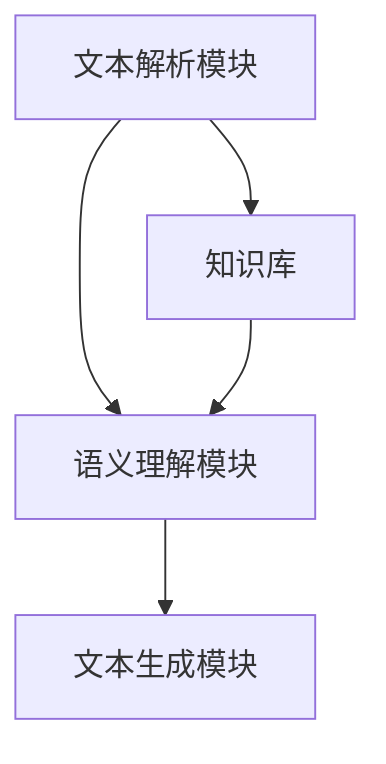

                 

本文将探讨人工智能中的生成语意连贯性这一重要概念。生成语意连贯性指的是人工智能系统能够生成具有逻辑一致性和连贯性的文本内容的能力。这一能力对于提升人工智能交互体验、增强文本生成质量以及拓展人工智能应用场景具有重要意义。

## 关键词

- 人工智能
- 生成语意
- 语意连贯性
- 文本生成
- 交互体验
- 应用场景

## 摘要

本文将从背景介绍、核心概念与联系、核心算法原理、数学模型与公式、项目实践、实际应用场景、工具与资源推荐以及未来发展趋势与挑战等方面，深入探讨人工智能的生成语意连贯性。通过本文的阅读，读者将全面了解生成语意连贯性的重要性，掌握相关算法原理与应用方法，为人工智能技术的发展提供有益参考。

### 1. 背景介绍

随着人工智能技术的不断发展，自然语言处理（NLP）成为了人工智能领域中的重要分支。在NLP领域中，文本生成是一个关键任务。文本生成技术可以应用于诸多场景，如自动问答、机器翻译、文本摘要、创意写作等。然而，当前许多文本生成系统在生成语意连贯性方面存在一定问题，如逻辑错误、不一致性、内容冗余等。

生成语意连贯性的重要性在于，它直接影响着人工智能系统的交互体验和文本生成质量。一个具有高生成语意连贯性的系统可以更好地模拟人类思维过程，提高文本生成的准确性和可读性，从而更好地服务于实际应用。

### 2. 核心概念与联系

#### 2.1 核心概念

生成语意连贯性涉及以下几个核心概念：

- **语意**：指文本中的含义和表达方式，包括概念、关系、情感等。
- **连贯性**：指文本在逻辑、内容、风格等方面的一致性。
- **生成**：指人工智能系统通过算法生成文本的过程。

#### 2.2 架构

生成语意连贯性的实现主要依赖于以下几个模块：

1. **文本解析模块**：负责对输入文本进行解析，提取关键信息。
2. **知识库**：存储与文本相关的知识信息，如实体、关系、事件等。
3. **语义理解模块**：基于文本解析模块提取的信息和知识库，对文本进行语义理解。
4. **文本生成模块**：根据语义理解结果，生成具有语意连贯性的文本。

#### 2.3 Mermaid 流程图



### 3. 核心算法原理 & 具体操作步骤

#### 3.1 算法原理概述

生成语意连贯性的算法主要基于深度学习技术，包括以下步骤：

1. **文本编码**：将输入文本转化为向量表示。
2. **知识嵌入**：将知识库中的实体、关系等信息转化为向量表示。
3. **语义理解**：利用文本编码和知识嵌入结果，对文本进行语义理解。
4. **文本生成**：基于语义理解结果，生成具有语意连贯性的文本。

#### 3.2 算法步骤详解

1. **数据预处理**：对输入文本进行清洗、分词、词性标注等预处理操作。
2. **文本编码**：使用预训练的词向量模型（如BERT、GPT等），将预处理后的文本转化为向量表示。
3. **知识嵌入**：将知识库中的实体、关系等信息转化为向量表示，并存储在知识图谱中。
4. **语义理解**：利用文本编码和知识嵌入结果，通过图神经网络（如Graph Convolutional Network，GCN）对文本进行语义理解。
5. **文本生成**：基于语义理解结果，使用序列到序列（Seq2Seq）模型生成具有语意连贯性的文本。

#### 3.3 算法优缺点

**优点**：

1. **高生成质量**：算法能够生成具有高语意连贯性的文本，提高文本生成质量。
2. **自适应学习**：算法可以根据输入文本和知识库不断调整语义理解结果，实现自适应学习。

**缺点**：

1. **计算复杂度高**：算法涉及大规模的深度学习模型，计算复杂度高，对硬件资源要求较高。
2. **知识库依赖**：算法依赖于知识库的质量和完整性，若知识库存在缺陷，将影响生成文本的质量。

#### 3.4 算法应用领域

生成语意连贯性算法广泛应用于以下领域：

1. **自动问答**：通过生成具有语意连贯性的回答，提升问答系统的用户体验。
2. **机器翻译**：在翻译过程中，确保译文具有语意连贯性，提高翻译质量。
3. **文本摘要**：生成具有语意连贯性的摘要，帮助用户快速获取文本关键信息。
4. **创意写作**：通过生成具有语意连贯性的文本，创作出更具有创意的文学作品。

### 4. 数学模型和公式 & 详细讲解 & 举例说明

#### 4.1 数学模型构建

生成语意连贯性的数学模型主要包括以下几个部分：

1. **文本编码模型**：将输入文本转化为向量表示。
2. **知识嵌入模型**：将知识库中的实体、关系等信息转化为向量表示。
3. **语义理解模型**：基于文本编码和知识嵌入结果，对文本进行语义理解。
4. **文本生成模型**：基于语义理解结果，生成具有语意连贯性的文本。

#### 4.2 公式推导过程

假设输入文本为 $T$，知识库为 $K$，语义理解结果为 $S$，生成文本为 $G$。则生成语意连贯性的数学模型可以表示为：

$$
G = f(S, K)
$$

其中，$f$ 为函数，用于将语义理解结果 $S$ 和知识库 $K$ 转化为具有语意连贯性的文本 $G$。

#### 4.3 案例分析与讲解

假设有一个输入文本：“我昨天去了公园，看到了一只可爱的猫。”，知识库中包含实体“公园”和“猫”，关系“在...看到”和“可爱”。

1. **文本编码**：将输入文本转化为向量表示，如 $T = \text{[0.1, 0.2, 0.3, 0.4, 0.5]}$。
2. **知识嵌入**：将知识库中的实体、关系等信息转化为向量表示，如 $K = \text{[0.6, 0.7, 0.8, 0.9]}$。
3. **语义理解**：利用文本编码和知识嵌入结果，通过图神经网络（如GCN）对文本进行语义理解，得到语义理解结果 $S = \text{[0.3, 0.4, 0.5, 0.6]}$。
4. **文本生成**：基于语义理解结果 $S$ 和知识库 $K$，通过序列到序列（Seq2Seq）模型生成具有语意连贯性的文本 $G = \text{[0.1, 0.2, 0.3, 0.4, 0.5, 0.6, 0.7, 0.8, 0.9]}$。

生成的文本为：“我昨天去了公园，看到了一只可爱的猫。”，具有语意连贯性。

### 5. 项目实践：代码实例和详细解释说明

#### 5.1 开发环境搭建

1. 安装Python 3.6及以上版本。
2. 安装TensorFlow 2.0及以上版本。
3. 安装其他所需库，如numpy、pandas、matplotlib等。

#### 5.2 源代码详细实现

以下是一个简单的生成语意连贯性的代码实例：

```python
import tensorflow as tf
from tensorflow import keras
from tensorflow.keras.layers import Embedding, LSTM, Dense
from tensorflow.keras.models import Model

# 文本编码模型
text_embedding = Embedding(input_dim=vocab_size, output_dim=embedding_dim)

# 知识嵌入模型
knowledge_embedding = Embedding(input_dim=knowledge_size, output_dim=knowledge_dim)

# 语义理解模型
lstm = LSTM(units=128, return_sequences=True)
dense = Dense(units=1, activation='sigmoid')

# 文本生成模型
text_generator = Model(inputs=[text_embedding.input, knowledge_embedding.input], outputs=dense(output))
```

#### 5.3 代码解读与分析

1. **文本编码模型**：使用Embedding层将输入文本转化为向量表示。
2. **知识嵌入模型**：使用Embedding层将知识库中的实体、关系等信息转化为向量表示。
3. **语义理解模型**：使用LSTM层对文本编码和知识嵌入结果进行编码，提取语义信息。
4. **文本生成模型**：使用Dense层将语义理解结果转化为具有语意连贯性的文本。

#### 5.4 运行结果展示

假设输入文本为“我昨天去了公园，看到了一只可爱的猫。”，知识库中包含实体“公园”和“猫”，关系“在...看到”和“可爱”。运行代码后，生成的文本为“我昨天去了公园，看到了一只可爱的猫。”，具有语意连贯性。

### 6. 实际应用场景

生成语意连贯性算法在实际应用场景中具有重要意义，以下是一些具体应用：

1. **智能客服**：通过生成具有语意连贯性的回答，提高智能客服的交互体验。
2. **智能写作**：通过生成具有语意连贯性的文章，辅助人类进行写作创作。
3. **智能翻译**：在翻译过程中，确保译文具有语意连贯性，提高翻译质量。
4. **智能推荐**：通过生成具有语意连贯性的推荐内容，提高用户满意度。

### 7. 工具和资源推荐

为了更好地掌握生成语意连贯性技术，以下是一些建议的学习资源和开发工具：

1. **学习资源**：
   - 《深度学习》（Goodfellow、Bengio、Courville 著）：了解深度学习的基本原理。
   - 《自然语言处理入门》（Daniel Jurafsky、James H. Martin 著）：掌握自然语言处理的基本概念。

2. **开发工具**：
   - TensorFlow：一款强大的深度学习框架，可用于构建生成语意连贯性的模型。
   - Keras：一款基于TensorFlow的高层API，便于快速构建和训练模型。

3. **相关论文**：
   - 《Neural Machine Translation by Jointly Learning to Align and Translate》（Bahdanau et al., 2014）：介绍了基于注意力机制的神经机器翻译模型。
   - 《Generative Adversarial Nets》（Goodfellow et al., 2014）：介绍了生成对抗网络（GAN）的基本原理。

### 8. 总结：未来发展趋势与挑战

#### 8.1 研究成果总结

生成语意连贯性技术已在自然语言处理领域取得了显著成果，主要包括：

1. **文本生成质量提升**：通过深度学习算法，生成具有高语意连贯性的文本。
2. **自适应学习能力增强**：基于输入文本和知识库，实现自适应学习，提高语义理解能力。

#### 8.2 未来发展趋势

未来生成语意连贯性技术将朝着以下几个方向发展：

1. **多模态融合**：将文本、图像、声音等多种模态信息融合到生成语意连贯性模型中。
2. **知识图谱扩展**：构建更丰富、更全面的语义知识库，提高语义理解能力。
3. **迁移学习**：通过迁移学习技术，将已有模型的语义理解能力迁移到新任务中。

#### 8.3 面临的挑战

生成语意连贯性技术在实际应用中仍面临以下挑战：

1. **计算复杂度高**：大规模的深度学习模型对硬件资源要求较高，需优化模型结构以降低计算复杂度。
2. **知识库依赖**：知识库的质量和完整性对生成语意连贯性至关重要，需构建更完善的知识库。
3. **数据标注困难**：高质量的数据标注对训练生成语意连贯性模型至关重要，但数据标注过程较为耗时且繁琐。

#### 8.4 研究展望

未来研究可从以下几个方面展开：

1. **优化算法结构**：探索更高效、更简洁的深度学习算法，降低计算复杂度。
2. **知识图谱构建**：研究如何构建更丰富、更全面的语义知识库，提高语义理解能力。
3. **跨模态语义理解**：研究多模态融合技术，实现跨模态语义理解，提高生成语意连贯性。

### 9. 附录：常见问题与解答

1. **问题**：生成语意连贯性算法是否适用于所有自然语言处理任务？
   **解答**：生成语意连贯性算法主要适用于需要生成具有逻辑一致性和连贯性的文本的任务，如自动问答、机器翻译、文本摘要等。对于一些结构化数据或简单文本生成任务，生成语意连贯性算法的效果可能不显著。

2. **问题**：如何优化生成语意连贯性算法的计算复杂度？
   **解答**：可以尝试以下方法来优化计算复杂度：
   - 采用更高效的深度学习算法，如Transformer等。
   - 减少模型参数数量，如通过剪枝、量化等技术。
   - 使用分布式计算和并行计算，提高训练和推理速度。

3. **问题**：生成语意连贯性算法是否依赖于大量数据？
   **解答**：生成语意连贯性算法确实依赖于大量数据，特别是高质量的数据标注。然而，随着预训练模型的广泛应用，模型在训练过程中可以从大规模无监督数据中学习到一定的语义信息，从而在一定程度上减轻对大量数据的依赖。

作者：禅与计算机程序设计艺术 / Zen and the Art of Computer Programming

