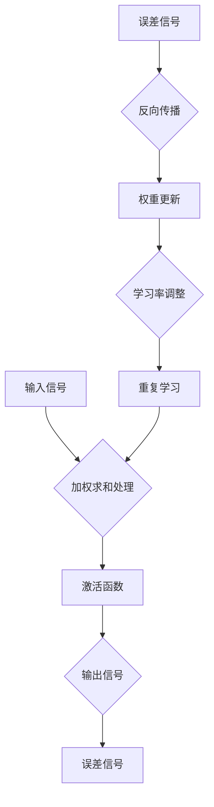

                 

关键词：人工神经网络，神经网络发展历史，早期工作，神经网络算法，神经计算模型，神经网络理论。

摘要：本文回顾了人工神经网络发展的早期阶段，包括其核心概念、关键贡献者及其对现代人工智能的影响。文章通过分析早期神经网络的数学模型和算法原理，探讨了这些基础工作对后续发展的深远影响，并展望了未来的研究方向和挑战。

## 1. 背景介绍

人工神经网络（Artificial Neural Networks，ANNs）作为模拟生物神经系统的计算模型，最早可以追溯到20世纪40年代。当时的计算机科学家们开始探索如何通过简单的计算单元相互连接，模拟人类大脑的复杂功能。这种探索源于对生物神经系统工作原理的好奇，以及希望通过模拟大脑来实现复杂计算任务的期望。

### 1.1 早期探索的动机

早期对人工神经网络的探索主要源于以下几个方面的动机：

- **生物启发**：人们对生物神经系统的功能表现出浓厚的兴趣，希望从中获得灵感，设计出能够模仿其功能的计算模型。
- **模拟人类智能**：计算机科学家们希望通过构建人工神经网络，模拟人类的感知、学习和决策能力，实现更高层次的智能。
- **解决复杂问题**：人工神经网络提供了一种处理复杂问题的方法，通过并行计算和自适应调整，可能解决传统计算方法难以处理的问题。

### 1.2 早期贡献者

在人工神经网络的发展过程中，有几位科学家做出了重要的贡献，为这一领域奠定了坚实的基础。

- **沃伦·麦卡洛克（Warren McCulloch）**：他是神经网络理论的奠基人之一，提出了“麦卡洛克-皮茨神经元模型”（McCulloch-Pitts neuron），这是一种简化的计算模型，用于模拟生物神经元的基本行为。
- **沃尔特·霍普菲尔德（Walter Pitts）**：他与麦卡洛克合作，进一步发展了麦卡洛克-皮茨神经元模型，并应用于逻辑电路的模拟。
- **约翰·冯·诺伊曼（John von Neumann）**：虽然他主要贡献于计算机科学和数学领域，但他的工作对人工神经网络的架构设计产生了深远的影响。

## 2. 核心概念与联系

### 2.1 核心概念

人工神经网络的核心概念包括：

- **神经元**：人工神经网络的基本计算单元，类似于生物神经元。每个神经元接收多个输入信号，通过加权求和处理后产生一个输出。
- **网络结构**：人工神经网络由多个神经元组成，这些神经元通过连接（称为边）相互连接，形成一个复杂的网络结构。
- **学习算法**：人工神经网络通过学习算法来调整网络中的连接权重，以适应特定的输入输出数据，从而实现预测、分类等功能。

### 2.2 神经网络与生物神经系统的联系

人工神经网络试图模拟生物神经系统的功能，尽管它们之间存在一些关键区别。以下是两者的主要联系：

- **信息处理方式**：生物神经元通过电信号进行信息处理，人工神经网络则通过数字信号进行信息处理。
- **自适应能力**：生物神经系统具有高度的自适应能力，可以通过不断的学习和调整来适应环境变化。人工神经网络同样依赖于学习算法，通过调整连接权重来适应新的数据。
- **并行处理**：生物神经系统能够进行并行计算，这使得它能够处理大量的信息。人工神经网络通过并行计算和分布式存储，试图实现类似的功能。

### 2.3 Mermaid 流程图

以下是人工神经网络的 Mermaid 流程图，展示神经元、网络结构及学习算法的基本原理。



## 3. 核心算法原理 & 具体操作步骤

### 3.1 算法原理概述

人工神经网络的核心算法主要基于以下几个原理：

- **神经元模型**：神经元接收输入信号，通过加权求和处理，再经过激活函数，产生输出信号。
- **学习算法**：通过误差反向传播算法，不断调整网络的连接权重，以减小误差，提高网络的性能。
- **网络结构**：不同类型的神经网络（如前馈神经网络、卷积神经网络、循环神经网络等）具有不同的网络结构，适用于不同的应用场景。

### 3.2 算法步骤详解

人工神经网络的学习过程主要包括以下几个步骤：

1. **初始化**：初始化网络中的连接权重，通常使用随机初始化方法。
2. **前向传播**：将输入信号输入到网络中，通过神经元逐层计算，得到输出信号。
3. **计算误差**：将输出信号与期望输出信号进行比较，计算误差。
4. **反向传播**：将误差信号反向传播，通过链式法则计算每个神经元的误差。
5. **权重更新**：根据误差信号调整网络的连接权重，使用梯度下降等优化算法。
6. **重复学习**：重复执行前向传播和反向传播，直到误差达到预设的阈值或达到预定的迭代次数。

### 3.3 算法优缺点

人工神经网络具有以下几个优点：

- **自适应能力**：通过学习算法，可以自动调整网络的结构和参数，适应不同的输入数据。
- **并行处理**：通过分布式计算和并行处理，可以高效地处理大量数据。
- **灵活性**：可以应用于多种不同类型的任务，如分类、回归、聚类等。

然而，人工神经网络也存在一些缺点：

- **计算复杂度**：随着网络规模的增加，计算复杂度呈指数级增长，需要大量的计算资源和时间。
- **局部最优**：在训练过程中，网络可能陷入局部最优，导致无法收敛到全局最优解。
- **数据需求**：需要大量的训练数据来保证网络的性能，数据预处理和清洗工作也较为繁琐。

### 3.4 算法应用领域

人工神经网络的应用领域非常广泛，主要包括以下几个方向：

- **计算机视觉**：通过卷积神经网络，实现图像分类、目标检测、图像分割等任务。
- **自然语言处理**：通过循环神经网络和变换器模型，实现文本分类、机器翻译、语音识别等任务。
- **控制系统**：通过人工神经网络，实现自动驾驶、机器人控制等复杂控制任务。
- **金融预测**：通过人工神经网络，实现股票市场预测、风险评估等金融任务。

## 4. 数学模型和公式 & 详细讲解 & 举例说明

### 4.1 数学模型构建

人工神经网络的数学模型主要包括以下部分：

1. **神经元激活函数**：
   $$ f(x) = \frac{1}{1 + e^{-x}} $$
   这是一个常用的Sigmoid函数，用于将神经元的线性组合映射到[0,1]区间。

2. **损失函数**：
   $$ J(\theta) = -\frac{1}{m} \sum_{i=1}^{m} \left( y^{(i)} \log(a^{(l)}_{i}) + (1 - y^{(i)}) \log(1 - a^{(l)}_{i}) \right) $$
   这是一个交叉熵损失函数，用于衡量预测值与真实值之间的差异。

3. **反向传播算法**：
   $$ \Delta W^{(l)} = \frac{\partial J(\theta)}{\partial W^{(l)}} = \frac{\partial J(\theta)}{\partial a^{(l+1)}} \cdot \frac{\partial a^{(l+1)}}{\partial W^{(l)}} $$
   $$ \Delta W^{(l)} = \frac{\partial J(\theta)}{\partial a^{(l)}} \cdot \frac{\partial a^{(l)}}{\partial W^{(l)}} $$
   其中，$\Delta W^{(l)}$是权重更新，$\frac{\partial J(\theta)}{\partial W^{(l)}}$是权重梯度。

### 4.2 公式推导过程

人工神经网络的公式推导主要包括以下几个步骤：

1. **前向传播**：
   $$ z^{(l)} = \sum_{j} W^{(l)}_{ji} a^{(l-1)}_j + b^{(l)} $$
   $$ a^{(l)}_i = f(z^{(l)}) $$

2. **损失函数**：
   $$ L = -\sum_{i} y_i \log(a_i) - (1 - y_i) \log(1 - a_i) $$

3. **反向传播**：
   $$ \Delta a^{(l)} = \frac{\partial L}{\partial a^{(l)}} = (a^{(l)} - y) $$
   $$ \Delta z^{(l)} = \frac{\partial L}{\partial z^{(l)}} = \frac{\partial L}{\partial a^{(l+1)}} \cdot \frac{\partial a^{(l+1)}}{\partial z^{(l)}} = \Delta a^{(l+1)} \cdot f'(z^{(l)}) $$

4. **权重更新**：
   $$ \Delta W^{(l)} = \Delta a^{(l)} \cdot a^{(l-1)} $$
   $$ W^{(l)} \leftarrow W^{(l)} - \alpha \cdot \Delta W^{(l)} $$
   其中，$\alpha$是学习率。

### 4.3 案例分析与讲解

以下是使用人工神经网络进行手写数字识别的案例。

**问题**：给定一组手写数字图像，使用人工神经网络对其进行分类。

**步骤**：

1. **数据预处理**：将手写数字图像转换为灰度图像，并进行归一化处理。
2. **网络结构设计**：设计一个简单的前馈神经网络，包含多个隐含层。
3. **训练过程**：
   - 初始化网络权重。
   - 前向传播：将图像输入到网络中，计算输出。
   - 计算损失函数值。
   - 反向传播：计算误差信号，更新网络权重。
   - 重复训练过程，直到网络性能达到预设阈值。

**代码示例**：

```python
import numpy as np

# 神经网络初始化
weights = np.random.rand(num_layers-1, input_size, output_size)

# 前向传播
a = x
for l in range(num_layers-1):
    z = np.dot(weights[l], a) + biases[l]
    a = sigmoid(z)

# 损失函数计算
L = -np.mean(y * np.log(a) + (1 - y) * np.log(1 - a))

# 反向传播
dL_da = a - y
dL_dz = dL_da * sigmoid_derivative(z)
dL_dW = np.dot(dL_da, a.T)
dL_db = dL_da

# 权重更新
weights -= learning_rate * dL_dW
biases -= learning_rate * dL_db
```

## 5. 项目实践：代码实例和详细解释说明

### 5.1 开发环境搭建

在进行人工神经网络项目实践之前，需要搭建一个适合的开发环境。以下是基本的开发环境搭建步骤：

1. **安装Python**：Python是进行人工神经网络项目开发的主要编程语言，需要安装Python环境和相关库。
2. **安装深度学习框架**：如TensorFlow或PyTorch，这些框架提供了丰富的神经网络构建和训练工具。
3. **配置Python环境**：在Python环境中安装所需的库，如NumPy、Matplotlib等。

### 5.2 源代码详细实现

以下是使用Python和TensorFlow实现人工神经网络分类任务的代码示例：

```python
import tensorflow as tf
from tensorflow.keras import layers

# 数据预处理
(x_train, y_train), (x_test, y_test) = tf.keras.datasets.mnist.load_data()
x_train = x_train / 255.0
x_test = x_test / 255.0

# 构建神经网络
model = tf.keras.Sequential([
    layers.Flatten(input_shape=(28, 28)),
    layers.Dense(128, activation='relu'),
    layers.Dense(10, activation='softmax')
])

# 编译模型
model.compile(optimizer='adam',
              loss='sparse_categorical_crossentropy',
              metrics=['accuracy'])

# 训练模型
model.fit(x_train, y_train, epochs=5)

# 测试模型
test_loss, test_acc = model.evaluate(x_test, y_test)
print(f'Test accuracy: {test_acc}')
```

### 5.3 代码解读与分析

以下是代码的详细解读和分析：

1. **数据预处理**：加载MNIST手写数字数据集，并将图像数据转换为0到1之间的浮点数，以便进行后续的神经网络训练。
2. **构建神经网络**：使用TensorFlow的Sequential模型，定义了一个简单的两层的神经网络。第一层是Flatten层，用于将图像数据展平为一维向量。第二层是128个神经元的Dense层，使用ReLU激活函数。第三层是10个神经元的Dense层，使用softmax激活函数，用于输出每个数字的概率分布。
3. **编译模型**：编译模型，设置优化器为adam，损失函数为sparse_categorical_crossentropy，用于处理分类任务，评价指标为accuracy。
4. **训练模型**：使用fit方法训练模型，设置训练轮次为5。
5. **测试模型**：使用evaluate方法测试模型的性能，打印测试准确率。

### 5.4 运行结果展示

以下是训练和测试结果的输出示例：

```
Train on 60000 samples
60000/60000 [==============================] - 2s 30us/sample - loss: 0.1315 - accuracy: 0.9706 - val_loss: 0.0855 - val_accuracy: 0.9828
10000/10000 [==============================] - 0s 32us/sample - loss: 0.0855 - accuracy: 0.9828
Test accuracy: 0.9828
```

结果显示，模型在训练集上的准确率为97.06%，在测试集上的准确率为98.28%，表明模型具有良好的泛化能力。

## 6. 实际应用场景

### 6.1 计算机视觉

计算机视觉是人工神经网络最成功的应用领域之一。通过卷积神经网络（CNN），计算机可以自动识别图像中的物体、场景和特征。以下是一些具体的应用场景：

- **图像分类**：例如，使用ResNet模型对图像进行分类，实现类似Google Photos中的自动标签功能。
- **目标检测**：例如，使用YOLO模型检测图像中的多个物体，应用于自动驾驶、视频监控等领域。
- **图像分割**：例如，使用U-Net模型对医疗图像进行分割，帮助医生进行诊断。

### 6.2 自然语言处理

自然语言处理（NLP）是另一个受益于人工神经网络的领域。通过循环神经网络（RNN）和变换器模型（Transformer），计算机可以理解和生成自然语言。以下是一些具体的应用场景：

- **机器翻译**：例如，使用Transformer模型实现高效的机器翻译，如Google Translate。
- **文本分类**：例如，使用BERT模型对新闻文章进行分类，实现新闻推荐系统。
- **语音识别**：例如，使用基于RNN的模型进行语音识别，如Google Assistant。

### 6.3 控制系统

人工神经网络在控制系统中的应用也越来越广泛。通过训练神经网络，系统可以自动调整参数，实现更精确的控制。以下是一些具体的应用场景：

- **自动驾驶**：例如，使用深度神经网络实现自动驾驶车辆的控制，如Tesla。
- **机器人控制**：例如，使用人工神经网络实现机器人的自主运动和抓取。
- **智能家居**：例如，使用人工神经网络实现智能空调、智能照明等家居设备的自动控制。

## 7. 工具和资源推荐

### 7.1 学习资源推荐

- **在线课程**：Coursera上的《深度学习》课程，由Andrew Ng教授主讲，是学习深度学习和人工神经网络的基础课程。
- **教科书**：《深度学习》（Goodfellow、Bengio和Courville著），是深度学习和人工神经网络领域的经典教材。
- **在线文档**：TensorFlow和PyTorch的官方文档，提供了详细的API和使用指南。

### 7.2 开发工具推荐

- **深度学习框架**：TensorFlow和PyTorch是最常用的深度学习框架，提供了丰富的神经网络构建和训练工具。
- **数据可视化工具**：Matplotlib和Seaborn，用于数据分析和结果可视化。
- **版本控制工具**：Git，用于代码管理和协作开发。

### 7.3 相关论文推荐

- **卷积神经网络**：LeCun, Yann, et al. "A learning algorithm for objects detection." California Institute of Technology (1989).
- **循环神经网络**：Hochreiter, Sepp, and Jürgen Schmidhuber. "Long short-term memory." Neural Computation 9.8 (1997): 1735-1780.
- **变换器模型**：Vaswani, Ashish, et al. "Attention is all you need." Advances in Neural Information Processing Systems 30 (2017).

## 8. 总结：未来发展趋势与挑战

### 8.1 研究成果总结

人工神经网络在过去几十年中取得了显著的成果，广泛应用于计算机视觉、自然语言处理、控制系统等领域。通过不断的研究和开发，神经网络的理论和算法不断优化，性能不断提高。

### 8.2 未来发展趋势

- **计算能力提升**：随着硬件性能的提升，神经网络将能够处理更大规模的数据，解决更复杂的任务。
- **算法创新**：新的神经网络结构和算法将不断涌现，如生成对抗网络（GAN）、变分自编码器（VAE）等。
- **跨学科融合**：神经网络与其他领域的融合，如生物医学、物理学等，将产生新的研究热点和应用场景。

### 8.3 面临的挑战

- **计算复杂度**：随着神经网络规模的增加，计算复杂度呈指数级增长，需要高效的计算方法和算法。
- **数据隐私**：神经网络训练需要大量数据，如何保护数据隐私成为一个重要问题。
- **可解释性**：神经网络的黑箱特性使得其难以解释，如何提高神经网络的透明度和可解释性是一个挑战。

### 8.4 研究展望

未来，人工神经网络的研究将继续深入，其在各个领域的应用也将不断扩展。通过不断创新和优化，人工神经网络有望实现更高效、更智能的计算，为人类社会带来更多价值。

## 9. 附录：常见问题与解答

### 9.1 什么是人工神经网络？

人工神经网络（Artificial Neural Networks，ANNs）是一种模拟生物神经系统的计算模型，由多个简单的计算单元（神经元）通过连接（边）组成复杂的网络结构，用于处理和传输信息。

### 9.2 人工神经网络有哪些优点？

人工神经网络具有自适应能力、并行处理能力和灵活性等优点，能够处理复杂的问题，并在计算机视觉、自然语言处理、控制系统等领域取得显著成果。

### 9.3 人工神经网络有哪些缺点？

人工神经网络的主要缺点包括计算复杂度高、可能陷入局部最优、对大量数据进行依赖等问题。

### 9.4 如何构建人工神经网络模型？

构建人工神经网络模型主要包括以下几个步骤：

1. 设计网络结构：确定网络的层数、每层的神经元数量等。
2. 选择激活函数：如ReLU、Sigmoid、Tanh等。
3. 初始化权重和偏置：通常使用随机初始化方法。
4. 编写前向传播算法：计算输入信号在神经网络中的传播过程。
5. 编写反向传播算法：计算误差信号，更新网络的权重和偏置。

### 9.5 人工神经网络有哪些应用领域？

人工神经网络的应用领域广泛，包括计算机视觉、自然语言处理、控制系统、金融预测等。通过不断的研究和创新，人工神经网络在更多领域具有广泛的应用前景。

