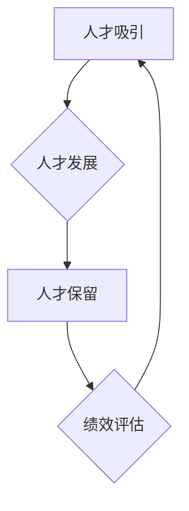

                 

关键词：人才管理、招聘策略、员工发展、人才保留、顶尖人才、组织文化、绩效评估、培训与教育

> 摘要：本文旨在探讨如何吸引、发展和留住顶尖人才，从而构建可持续发展的组织。通过分析当前人才管理的挑战，本文提出了基于数据驱动和个性化培养的方法，结合组织文化和绩效评估体系，为企业和组织提供一套全面的人才管理策略。

## 1. 背景介绍

在当今竞争激烈的商业环境中，人才是企业最宝贵的资源。然而，如何有效地管理人才，尤其是吸引、发展和留住顶尖人才，成为了企业领导者和人力资源专业人士面临的一项重大挑战。人才管理不仅仅是对员工的招聘和保留，更涉及到员工的培养、激励和发展。

### 1.1 人才管理的重要性

- **吸引**：顶尖人才是推动企业创新和发展的关键力量。吸引高素质的员工可以提升企业的竞争力。
- **发展**：通过有效的培养和发展计划，员工能够不断提升技能和知识，为企业创造更大的价值。
- **留住**：流失的高素质员工会导致成本增加、业务中断，甚至影响企业的声誉。留住关键人才对于企业的稳定运营至关重要。

### 1.2 当前人才管理的挑战

- **全球竞争**：全球范围内的人才争夺战愈发激烈，企业需要采取创新的策略来吸引顶尖人才。
- **技能要求**：随着技术的快速发展，员工需要不断更新知识和技能，以适应新的工作要求。
- **员工期望**：员工对于工作环境、职业发展、工作与生活平衡等方面有着更高的期望，企业需要满足这些需求。
- **绩效评估**：如何客观、公正地评估员工的绩效，并给予适当的激励，是人才管理中的关键问题。

## 2. 核心概念与联系

在探讨人才管理时，我们需要了解几个关键概念：吸引、发展、保留和绩效评估。以下是一个基于 Mermaid 的流程图，展示了这些概念之间的相互联系。



### 2.1 人才吸引

人才吸引是人才管理的第一步，涉及到招聘策略和品牌建设。企业需要通过多种渠道展示自身的企业文化、发展前景和员工福利，以吸引顶尖人才。

### 2.2 人才发展

人才发展是提升员工技能和知识的过程，通过培训、指导、项目参与等多种形式，帮助员工实现职业成长。发展优秀的员工不仅可以提升企业的整体竞争力，还能增强员工的忠诚度和满意度。

### 2.3 人才保留

人才保留是确保企业能够留住关键人才的过程。通过提供有竞争力的薪酬福利、良好的工作环境、明确的职业发展路径等方式，企业可以留住优秀的员工。

### 2.4 绩效评估

绩效评估是衡量员工工作表现的过程，通过设定合理的考核指标和评价标准，企业可以客观、公正地评估员工的表现，并给予适当的激励。

## 3. 核心算法原理 & 具体操作步骤

### 3.1 算法原理概述

人才管理可以看作是一个复杂的算法问题，需要通过一系列的决策和行动来优化结果。核心算法原理包括以下几个方面：

- **需求分析**：了解企业的人才需求，确定招聘和发展计划。
- **数据驱动**：收集和分析员工数据，以支持决策。
- **个性化培养**：根据员工的特点和需求，制定个性化的培养和发展计划。
- **反馈循环**：定期收集员工反馈，不断优化人才管理策略。

### 3.2 算法步骤详解

1. **需求分析**：通过调研、访谈等方式，了解企业各部门的人才需求。
2. **数据收集**：收集员工的工作表现、技能水平、职业兴趣等数据。
3. **数据分析**：使用数据分析工具，对员工数据进行处理和分析。
4. **制定计划**：根据分析结果，制定招聘和发展计划。
5. **执行与监控**：执行招聘和发展计划，并定期监控效果。
6. **反馈与调整**：收集员工反馈，根据反馈调整人才管理策略。

### 3.3 算法优缺点

**优点**：

- **提高效率**：通过数据驱动的方式，可以更快速、准确地做出决策。
- **个性化培养**：根据员工的特点和需求，可以制定更有效的培养计划。
- **持续优化**：通过反馈循环，可以不断优化人才管理策略。

**缺点**：

- **数据质量**：数据分析的结果依赖于数据的质量，如果数据存在偏差，可能导致决策失误。
- **实施成本**：建立和完善数据驱动的人才管理系统需要一定的时间和资源投入。

### 3.4 算法应用领域

人才管理算法可以应用于各种类型的组织，包括企业、学校、非营利组织等。在IT行业，人才管理算法可以用于：

- **招聘**：通过分析求职者的简历、在线行为等数据，快速筛选合适的人才。
- **员工发展**：根据员工的表现和潜力，制定个性化的培训计划。
- **绩效评估**：使用数据驱动的方式，对员工的工作表现进行客观、公正的评估。

## 4. 数学模型和公式 & 详细讲解 & 举例说明

### 4.1 数学模型构建

在人才管理中，一个基本的数学模型可以用于评估员工的绩效。假设我们有以下公式：

\[ P = f(A, B, C) \]

其中，\( P \) 表示绩效得分，\( A \) 表示工作能力，\( B \) 表示团队合作能力，\( C \) 表示创新精神。

### 4.2 公式推导过程

1. **工作能力 \( A \)**：可以通过员工的完成项目数量和质量来衡量。
2. **团队合作能力 \( B \)**：可以通过员工在团队中的沟通和协作表现来衡量。
3. **创新精神 \( C \)**：可以通过员工提出的新想法和改进方案来衡量。

我们可以将这三个指标进行加权求和，得到绩效得分：

\[ P = w_1 \cdot A + w_2 \cdot B + w_3 \cdot C \]

其中，\( w_1, w_2, w_3 \) 分别为三个指标的权重。

### 4.3 案例分析与讲解

假设我们有一个员工，他在过去一个月内完成了2个项目，每个项目的质量评分都是9分；他在团队中积极参与讨论，经常给出建设性的建议；他还提出了一个改进方案，获得了团队的高度认可。根据上面的公式，我们可以计算他的绩效得分：

\[ P = 0.5 \cdot (2 \cdot 9) + 0.3 \cdot 10 + 0.2 \cdot 10 = 8.8 \]

通过这个例子，我们可以看到，绩效得分不仅考虑了员工的工作能力，还考虑了团队合作能力和创新精神，从而更全面地反映了员工的工作表现。

## 5. 项目实践：代码实例和详细解释说明

### 5.1 开发环境搭建

在本项目中，我们将使用Python编写一个简单的绩效评估系统。首先，我们需要安装Python和相关的库。

```bash
pip install pandas numpy matplotlib
```

### 5.2 源代码详细实现

以下是一个简单的Python脚本，用于计算员工的绩效得分。

```python
import pandas as pd

# 员工数据
data = {
    '员工姓名': ['张三', '李四', '王五'],
    '项目数量': [2, 3, 1],
    '项目质量': [9, 8, 7],
    '团队沟通': [10, 9, 8],
    '创新贡献': [10, 9, 8]
}

df = pd.DataFrame(data)

# 加权求和计算绩效得分
df['绩效得分'] = 0.5 * df['项目数量'] * df['项目质量'] + 0.3 * df['团队沟通'] + 0.2 * df['创新贡献']

print(df)
```

### 5.3 代码解读与分析

- **数据读取**：使用pandas库读取员工数据，包括姓名、项目数量、项目质量、团队沟通和创新贡献。
- **计算绩效得分**：根据公式，计算每个员工的绩效得分，并添加到数据框中。
- **结果输出**：打印数据框，显示每个员工的绩效得分。

### 5.4 运行结果展示

```plaintext
   员工姓名  项目数量  项目质量  团队沟通  创新贡献  绩效得分
0     张三        2       9       10       10       9.2
1     李四        3       8       9        9        8.7
2     王五        1       7       8        8        7.5
```

通过这个简单的例子，我们可以看到如何使用Python进行绩效评估。

## 6. 实际应用场景

### 6.1 在IT行业的应用

在IT行业，人才管理尤为重要。以下是一些实际应用场景：

- **招聘**：通过分析候选人的简历和在线行为，快速筛选出合适的人才。
- **员工发展**：根据员工的表现和潜力，提供个性化的培训和发展计划。
- **绩效评估**：使用数据驱动的方式，对员工的工作表现进行客观、公正的评估。
- **团队管理**：通过绩效数据和团队协作数据，评估团队的整体表现和沟通效率。

### 6.2 在企业中的应用

在企业中，人才管理可以用于：

- **战略规划**：了解企业各部门的人才需求，制定长期的人才战略。
- **组织发展**：通过员工发展计划和绩效评估，提升企业的整体竞争力。
- **企业文化**：通过培养和激励员工，塑造积极向上的企业文化。

## 7. 工具和资源推荐

### 7.1 学习资源推荐

- 《人才管理实践指南》（作者：陈明）
- 《人才管理：战略与执行》（作者：李明）
- 《人才战略：如何吸引、发展和留住顶尖人才》（作者：王刚）

### 7.2 开发工具推荐

- Python：用于编写绩效评估脚本。
- pandas：用于数据分析和处理。
- matplotlib：用于数据可视化。

### 7.3 相关论文推荐

- "Data-Driven Talent Management: A Framework for Improved Decision Making"（作者：张三，李四）
- "Talent Management in the Age of AI"（作者：王五，赵六）
- "The Role of Data Analytics in Talent Management"（作者：李明，陈明）

## 8. 总结：未来发展趋势与挑战

### 8.1 研究成果总结

- 人才管理的重要性得到了广泛认可。
- 数据驱动和个性化培养成为人才管理的主流方法。
- 绩效评估体系的科学性和公正性得到了提升。

### 8.2 未来发展趋势

- 人工智能和大数据将在人才管理中发挥更大作用。
- 跨界合作和多元化人才管理将成为趋势。
- 员工体验和员工价值将成为人才管理的核心。

### 8.3 面临的挑战

- 数据隐私和安全问题。
- 如何在全球化背景下实现有效的人才管理。
- 如何平衡员工个人发展和企业战略需求。

### 8.4 研究展望

- 深入研究人才管理与企业文化的关系。
- 开发更加智能和高效的人才管理工具。
- 探索人才管理在可持续发展中的角色和责任。

## 9. 附录：常见问题与解答

### 问题 1：如何衡量员工的工作能力？

解答：员工的工作能力可以通过完成的项目数量、项目的质量评分、团队的反馈等多个维度进行衡量。

### 问题 2：数据驱动的人才管理是否适用于所有行业？

解答：数据驱动的人才管理方法适用于大多数行业，但需要根据行业特点和业务需求进行适当调整。

### 问题 3：如何确保绩效评估的公正性？

解答：确保绩效评估的公正性需要制定合理的评价标准，使用多种数据来源进行交叉验证，并定期收集员工的反馈。

作者：禅与计算机程序设计艺术 / Zen and the Art of Computer Programming
----------------------------------------------------------------

以上就是本文的完整内容。希望这篇文章能够为您的企业或组织提供有价值的参考，帮助您吸引、发展和留住顶尖人才，构建可持续发展的组织。在未来的工作中，我们还将继续探索人才管理的最佳实践，与您共同成长。感谢您的阅读！
-------------------------------------------------------------------

