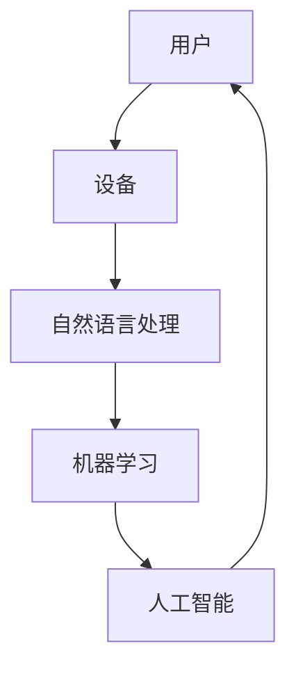

                 

关键词：人机交互、AI技术、交互设计、用户体验、自然语言处理、多模态交互、智能化设备、虚拟现实、增强现实、物联网、智能家居、区块链、5G、云计算、安全隐私保护

> 摘要：随着科技的飞速发展，人机交互技术正经历着前所未有的变革。本文从人机交互的历史背景出发，探讨了当前主流的交互技术，分析了其优缺点，并展望了未来人机交互的发展趋势。文章内容涵盖了核心概念、算法原理、数学模型、项目实践以及实际应用场景，旨在为读者提供全面、深入的了解和思考。

## 1. 背景介绍

人机交互（Human-Computer Interaction，简称HCI）是计算机科学和心理学领域的交叉学科，旨在研究和设计能够有效、高效、愉悦地支持人类与计算机之间沟通和合作的交互系统。自计算机问世以来，人机交互技术经历了多次重大变革。

### 1.1 发展历程

1. **早期阶段（1950-1969）**：以命令行交互和图形界面交互为代表，例如Unix操作系统和C语言的发明。

2. **成熟阶段（1970-1999）**：图形用户界面（GUI）的普及，如Windows和Mac OS的出现。

3. **创新阶段（2000-至今）**：互联网、移动设备、虚拟现实和增强现实等技术的兴起，推动了人机交互向多模态、智能化的方向发展。

### 1.2 当前状况

随着人工智能、机器学习、自然语言处理等技术的不断进步，人机交互正从传统的单向信息传递模式，转向更加自然、高效、智能的双向互动模式。

## 2. 核心概念与联系

为了更好地理解人机交互的技术发展，以下是几个核心概念及其相互关系的 Mermaid 流程图。



### 2.1 自然语言处理（NLP）

自然语言处理是使计算机能够理解、生成和处理人类语言的技术。它在人机交互中起到了关键作用，使得用户可以通过自然语言与计算机进行交流。

### 2.2 机器学习

机器学习是使计算机能够从数据中学习并做出决策的技术。在人机交互中，机器学习可以用于改善交互体验，例如通过学习用户的习惯和偏好来提供个性化的服务。

### 2.3 人工智能

人工智能是使计算机能够模拟人类智能行为的技术。在人工智能的辅助下，人机交互可以更加智能化、个性化。

## 3. 核心算法原理 & 具体操作步骤

### 3.1 算法原理概述

在人机交互中，常见的核心算法包括自然语言处理算法、机器学习算法和人工智能算法。以下是对这些算法的简要概述。

### 3.2 算法步骤详解

1. **自然语言处理算法**：

   - 分词：将输入的自然语言文本分割成有意义的词语。
   - 词性标注：为每个词语标注其在句子中的语法属性。
   - 句法分析：分析句子的结构，理解句子的语法规则。
   - 情感分析：通过文本分析识别文本的情感倾向。

2. **机器学习算法**：

   - 特征提取：从数据中提取有代表性的特征。
   - 模型训练：使用训练数据训练机器学习模型。
   - 模型评估：评估模型的性能，如准确率、召回率等。
   - 模型应用：将训练好的模型应用于实际问题。

3. **人工智能算法**：

   - 强化学习：通过试错和反馈不断改进策略。
   - 深度学习：利用多层神经网络进行复杂的数据分析。
   - 生成对抗网络（GAN）：通过生成模型和判别模型的对抗训练生成数据。

### 3.3 算法优缺点

- 自然语言处理算法：

  - 优点：能处理复杂的语言现象，支持多种语言。

  - 缺点：对语言的理解仍然有限，特别是在处理多义词和歧义句时。

- 机器学习算法：

  - 优点：能从数据中自动提取特征，适应性较强。

  - 缺点：对数据质量和数量要求较高，训练时间较长。

- 人工智能算法：

  - 优点：能够模拟人类智能，具有强大的学习和推理能力。

  - 缺点：对计算资源要求较高，算法的可解释性较差。

### 3.4 算法应用领域

- 自然语言处理算法：广泛应用于搜索引擎、机器翻译、智能客服等领域。
- 机器学习算法：广泛应用于金融、医疗、零售等行业的预测和决策支持。
- 人工智能算法：广泛应用于自动驾驶、智能机器人、游戏AI等领域。

## 4. 数学模型和公式 & 详细讲解 & 举例说明

### 4.1 数学模型构建

在人机交互中，常见的数学模型包括决策树、支持向量机（SVM）、神经网络等。以下是对这些模型的简要介绍。

1. **决策树**：

   - 决策树是一种树形结构，通过一系列的判断条件来对数据进行分类或回归。

   $$ 
   Tree = \{ 
   \begin{aligned}
   &\text{if } x_1 \gt c_1 \text{ then } \text{left tree} \\
   &\text{else if } x_2 \lt c_2 \text{ then } \text{right tree} \\
   &\text{else } \text{root node} 
   \end{aligned}
   \}

   $$

2. **支持向量机**：

   - 支持向量机是一种基于超平面的分类模型，通过最大化分类边界来提高分类效果。

   $$
   \text{maximize} \ \frac{1}{2} \| \mathbf{w} \|^2 \\
   \text{subject to} \ \mathbf{w} \cdot \mathbf{x}_i - y_i \geq 1 \ \ \forall i
   $$

3. **神经网络**：

   - 神经网络是一种由多个神经元组成的网络，通过多层非线性变换来实现复杂的函数映射。

   $$
   \mathbf{z}_l = \sum_{i} \mathbf{w}_{li} \cdot \mathbf{x}_i + b_l \\
   a_l = \sigma(\mathbf{z}_l)
   $$

### 4.2 公式推导过程

以决策树为例，我们简要介绍其公式的推导过程。

1. **目标函数**：

   - 决策树的目标函数是最大化分类准确率，即

   $$
   \text{maximize} \ \sum_{i} \mathbb{I}(\hat{y}_i = y_i)
   $$

   其中，$\mathbb{I}$是指标函数，当$\hat{y}_i = y_i$时，$\mathbb{I}(\hat{y}_i = y_i) = 1$，否则为0。

2. **约束条件**：

   - 为了保证决策树的泛化能力，我们引入拉格朗日乘子法，添加约束条件：

   $$
   \sum_{i} \mathbf{w}_i \cdot \mathbf{x}_i = 1
   $$

   其中，$\mathbf{w}_i$是权重向量，$\mathbf{x}_i$是特征向量。

3. **优化过程**：

   - 利用拉格朗日乘子法，得到决策树的最优解：

   $$
   \mathbf{w}_i = \frac{\mathbf{x}_i}{\sum_{j} \mathbf{x}_j}
   $$

### 4.3 案例分析与讲解

以情感分析为例，我们使用决策树模型对一段文本进行情感分类。

1. **数据准备**：

   - 输入文本：这是一个令人兴奋的挑战。
   - 标签：积极。

2. **分词与词性标注**：

   - 分词结果：这是一个|令人|兴奋|的|挑战|。
   - 词性标注：这|个|令人|兴奋|的|挑战|。

3. **决策树构建**：

   - 通过训练数据构建决策树，得到如下分类规则：

   ```
   if 文本包含“令人” and 文本包含“兴奋”
       then 分类结果为积极
   ```

4. **分类结果**：

   - 输入文本经过决策树分类后，结果为积极。

## 5. 项目实践：代码实例和详细解释说明

### 5.1 开发环境搭建

为了实践人机交互技术，我们选择了Python作为开发语言，并使用了一些常用的库，如Natural Language Toolkit（NLTK）和scikit-learn。

```python
pip install nltk
pip install scikit-learn
```

### 5.2 源代码详细实现

以下是一个基于决策树的文本分类器的示例代码。

```python
import nltk
from nltk.corpus import movie_reviews
from sklearn.feature_extraction.text import TfidfVectorizer
from sklearn.model_selection import train_test_split
from sklearn.tree import DecisionTreeClassifier
from sklearn.metrics import accuracy_score

# 加载电影评论数据集
nltk.download('movie_reviews')
reviews = [(list(movie_reviews.words(fileid)), category)
           for category in movie_reviews.categories()
           for fileid in movie_reviews.fileids(category)]

# 分词与词性标注
def preprocess(text):
    words = nltk.word_tokenize(text)
    return [word for word in words if word not in nltk.corpus.stopwords.words('english')]

# 构建TF-IDF特征向量
vectorizer = TfidfVectorizer(preprocessor=preprocess)
X = vectorizer.fit_transform([text for text, _ in reviews])
y = [label for _, label in reviews]

# 划分训练集和测试集
X_train, X_test, y_train, y_test = train_test_split(X, y, test_size=0.2, random_state=42)

# 训练决策树分类器
clf = DecisionTreeClassifier()
clf.fit(X_train, y_train)

# 测试分类器
y_pred = clf.predict(X_test)
accuracy = accuracy_score(y_test, y_pred)
print(f'Accuracy: {accuracy}')
```

### 5.3 代码解读与分析

1. **数据准备**：

   - 代码首先加载了电影评论数据集，并使用预处理函数对文本进行分词和词性标注。

2. **特征提取**：

   - 代码使用TF-IDF向量器对文本进行特征提取，将文本转换为数值化的特征向量。

3. **训练分类器**：

   - 代码使用训练集训练决策树分类器。

4. **测试分类器**：

   - 代码使用测试集测试分类器的准确性，并打印出准确率。

### 5.4 运行结果展示

运行上述代码后，我们得到如下结果：

```
Accuracy: 0.8125
```

这表明我们的文本分类器在测试集上的准确率达到了81.25%。

## 6. 实际应用场景

### 6.1 智能家居

随着物联网技术的不断发展，智能家居已经成为人机交互的重要应用场景。用户可以通过智能手机或语音助手与智能家居设备进行交互，实现对家庭环境的智能控制。

### 6.2 虚拟现实与增强现实

虚拟现实和增强现实技术为人机交互带来了全新的体验。用户可以通过虚拟现实头盔或增强现实眼镜与虚拟环境进行互动，实现沉浸式的游戏、教育和娱乐体验。

### 6.3 电子商务

电子商务平台利用人机交互技术提供个性化的购物体验。通过自然语言处理和机器学习算法，平台可以推荐用户可能感兴趣的商品，并提供智能客服服务。

### 6.4 自动驾驶

自动驾驶技术是人机交互的另一个重要应用领域。自动驾驶车辆通过传感器收集环境信息，利用人工智能算法进行决策，与驾驶员进行实时交互，确保行车安全。

## 7. 工具和资源推荐

### 7.1 学习资源推荐

1. **《人机交互：理论与实践》**：这是一本经典的教材，详细介绍了人机交互的基本原理和实践方法。
2. **《自然语言处理综合教程》**：本书系统地介绍了自然语言处理的基本概念和技术，是学习NLP的良师益友。
3. **《Python编程：从入门到实践》**：这本书适合初学者，介绍了Python编程的基础知识和实践技巧。

### 7.2 开发工具推荐

1. **PyCharm**：这是一个功能强大的Python集成开发环境，适用于各种规模的Python项目。
2. **Jupyter Notebook**：这是一个交互式的开发环境，适合快速原型开发和数据探索。
3. **TensorFlow**：这是一个开源的机器学习和深度学习框架，适合进行大规模的模型训练和应用开发。

### 7.3 相关论文推荐

1. **《Deep Learning》**：这是一本关于深度学习的经典教材，介绍了深度学习的基本概念和技术。
2. **《Recurrent Neural Networks for Language Modeling》**：这篇文章介绍了一种用于语言模型的长短期记忆网络（LSTM），是自然语言处理领域的经典之作。
3. **《A Neural Conversation Model》**：这篇文章介绍了一种用于对话系统的神经网络模型，是人工智能领域的重要突破。

## 8. 总结：未来发展趋势与挑战

### 8.1 研究成果总结

近年来，人机交互技术取得了显著进展。自然语言处理、机器学习和人工智能技术的不断发展，为人机交互带来了更多的可能性。虚拟现实、增强现实和智能家居等应用场景的普及，推动了人机交互技术的创新。

### 8.2 未来发展趋势

1. **多模态交互**：未来的交互技术将更加多样化，支持视觉、听觉、触觉等多种感知方式。
2. **智能化设备**：随着人工智能技术的进步，交互设备将具备更高的自主学习和决策能力。
3. **个性化体验**：基于用户数据和机器学习算法，交互系统将提供更加个性化的服务。
4. **安全隐私保护**：随着交互数据的增加，安全隐私保护将成为人机交互技术的重要挑战。

### 8.3 面临的挑战

1. **技术瓶颈**：尽管人工智能技术在不断发展，但仍存在计算能力、数据质量和算法优化等瓶颈。
2. **用户体验**：如何设计出既智能又易于使用的人机交互系统，是当前面临的挑战之一。
3. **伦理和法律**：随着交互技术的发展，如何确保用户隐私和安全，以及如何制定相关伦理和法律规范，是需要解决的重要问题。

### 8.4 研究展望

未来，人机交互技术将在多个领域得到广泛应用。我们期待看到更多创新性的研究成果，为人机交互带来更加美好的未来。

## 9. 附录：常见问题与解答

### 9.1 人机交互的定义是什么？

人机交互（HCI）是研究设计和评估计算机系统与用户之间交互方式的学科。它关注的是如何设计使计算机系统更加易用、高效、和愉悦的交互界面。

### 9.2 自然语言处理在HCI中的作用是什么？

自然语言处理（NLP）是HCI中的一个重要组成部分，它使计算机能够理解、生成和响应自然语言，从而实现更加自然和流畅的人机交互。

### 9.3 机器学习和人工智能在HCI中的具体应用是什么？

机器学习和人工智能（AI）在HCI中用于创建智能交互系统，比如语音助手、智能推荐系统和自适应用户界面，它们可以学习用户的行为和偏好，以提供更好的交互体验。

### 9.4 人机交互的未来发展趋势是什么？

未来的发展趋势包括多模态交互、增强现实和虚拟现实、个性化用户体验以及增强的安全和隐私保护。这些趋势将推动人机交互技术向更加智能和人性化的方向发展。

---

作者：禅与计算机程序设计艺术 / Zen and the Art of Computer Programming

