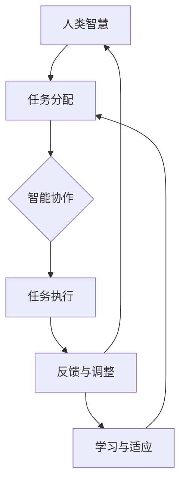

                 

关键词：人工智能，人类增强，AI协同，智慧提升，融合发展趋势，技术预测，机遇分析。

> 摘要：本文探讨了人类与人工智能协同工作的新模式——人类-AI协Multiplier的内涵与外延，通过分析其核心概念、算法原理、数学模型、实际应用等多个维度，预测了其在未来智慧增强与AI能力提升中的发展趋势和面临的机遇与挑战。本文旨在为科技工作者和研究者提供有价值的参考，推动人工智能与人类智慧融合的深入发展。

## 1. 背景介绍

随着人工智能（AI）技术的迅猛发展，人类与机器的交互方式正在发生深刻变革。从最初的自动化工具到如今具备高度自主决策能力的智能系统，AI在各个领域的应用已经渗透到我们生活的方方面面。然而，人类与AI的协同工作还远远没有达到理想状态。尽管AI在数据处理、模式识别、决策优化等方面展现出了惊人的能力，但人类的创造力、情感智慧和常识推理仍然是AI难以全面取代的领域。

当前，人类与AI的协同主要依赖于人类对AI的编程和指导，这种模式存在明显的局限性。一方面，人类对AI的编程能力受限，难以应对复杂多变的应用场景；另一方面，AI对人类意图的理解仍然不足，难以实现真正的双向互动和智能协作。因此，如何实现人类与AI的深度融合，发挥各自优势，共同提高智慧水平，成为一个亟待解决的问题。

人类-AI协Multiplier概念正是在这样的背景下提出来的。它是一种新型的人类与AI协同机制，旨在通过融合人类智慧与AI能力，实现1+1>2的效果。协Multiplier的核心思想是将人类专家的知识、经验和创造力与AI的强大计算能力、数据处理能力和学习优化能力相结合，形成一个高效协同的系统。通过这种协同，人类可以在AI的帮助下完成更复杂、更高智能的任务，同时AI也可以从人类的学习中不断优化自身，提升智能化水平。

本文将从以下几个部分展开讨论：

1. 核心概念与联系
2. 核心算法原理与具体操作步骤
3. 数学模型和公式
4. 项目实践：代码实例与解释
5. 实际应用场景
6. 未来应用展望
7. 工具和资源推荐
8. 总结：未来发展趋势与挑战
9. 附录：常见问题与解答

希望通过本文的探讨，可以为人类与AI协同工作提供新的思路和解决方案，推动人工智能与人类智慧的深度融合。

### 2. 核心概念与联系

在探讨人类-AI协Multiplier之前，我们首先需要明确其核心概念与相关联的基本原理。人类-AI协Multiplier不仅仅是一个技术术语，它代表了人类与人工智能之间的一种新型互动模式，这种模式不仅关注AI的技术性能，更强调人类智慧和AI能力的有机结合，以达到增强人类整体智慧水平的目标。

#### 2.1. 人类-AI协Multiplier的核心概念

1. **人类智慧**：人类智慧是指人类在长期进化过程中形成的认知能力、创造力、判断力、情感智慧和常识推理等。这些能力使人类能够处理复杂问题，进行创新性思考和解决未知挑战。

2. **人工智能（AI）**：人工智能是指通过计算机模拟人类智能行为的技术。AI的核心在于其强大的数据处理能力、模式识别能力和自主学习能力，可以在没有人类干预的情况下完成特定任务。

3. **协同工作**：协同工作是指不同个体或系统相互配合，共同完成任务的过程。在人类-AI协Multiplier中，人类与AI通过协同工作，各自发挥自身优势，实现整体效能最大化。

4. **智慧增强**：智慧增强是指通过技术手段提升个体的认知能力、学习效率和创新能力。在人类-AI协Multiplier的框架下，智慧增强的目标是实现人类与AI能力的互补，共同提升整体的智慧水平。

#### 2.2. 人类与AI的关系

1. **依赖与互补**：人类与AI之间的关系是相互依赖且互补的。人类依赖AI的强大计算能力和数据处理能力，而AI则依赖人类的创造力、常识和情感智慧。通过协同工作，两者可以互相补充，实现各自能力的最大化。

2. **互动与反馈**：人类与AI的互动不仅体现在任务的执行过程中，还包括对任务结果的反馈和调整。通过持续的互动和反馈，AI可以不断优化自身的行为，而人类也可以根据AI的表现调整自己的工作方式，实现更高效的协同。

#### 2.3. 协同机制

1. **任务分配**：在人类-AI协Multiplier中，任务分配是一个关键环节。根据人类和AI的优势，合理分配任务，使两者能够发挥最大效能。例如，人类负责创造性任务和决策，AI负责数据分析和执行任务。

2. **智能协作**：智能协作是指通过算法和技术手段，实现人类与AI之间的无缝协作。这包括语言理解、情感识别、决策支持等多个方面，使人类与AI能够在复杂环境中进行高效合作。

3. **学习与适应**：人类-AI协Multiplier中的学习与适应机制是系统持续优化自身能力的关键。AI通过不断学习和适应人类的行为模式，提升对人类意图的理解，而人类则通过AI的帮助，不断提升自身的智慧水平。

#### 2.4. Mermaid 流程图

为了更直观地展示人类-AI协Multiplier的协同机制，我们使用Mermaid绘制了一个流程图。以下是一个简化的流程图示例：



**图1：人类-AI协Multiplier协同机制流程图**

在这个流程图中，人类智慧通过任务分配（B）将任务传递给AI，AI执行任务（D）并返回结果，人类根据反馈（E）调整任务分配，同时AI通过学习与适应（F）优化自身行为。这个循环过程不断进行，实现了人类与AI的深度协同。

通过上述讨论，我们可以看出，人类-AI协Multiplier不仅仅是技术上的创新，更是对人类智慧与AI能力融合的一种全新探索。这种协同机制为人类智慧的提升提供了新的机遇，也为AI的发展带来了更多的可能性。

### 3. 核心算法原理 & 具体操作步骤

#### 3.1 算法原理概述

人类-AI协Multiplier的核心算法原理可以归结为以下几个方面：

1. **多智能体系统**：协Multiplier利用多智能体系统（MAS）的概念，将人类与AI视为两个不同的智能体，通过交互和合作完成复杂任务。

2. **强化学习**：强化学习（RL）是协Multiplier算法的重要组件，通过奖励机制激励AI不断优化行为，使其在与人类的互动中逐渐提升性能。

3. **知识融合**：人类专家的知识通过预训练模型嵌入到AI系统中，使AI能够在执行任务时利用人类的经验与智慧。

4. **情感识别与反馈**：通过情感识别技术，AI能够理解人类的情感状态，并根据反馈调整自身的行为，实现更自然的交互。

5. **迁移学习**：协Multiplier利用迁移学习（Transfer Learning）技术，将AI在特定领域的知识迁移到其他领域，提高AI的泛化能力。

#### 3.2 算法步骤详解

以下是人类-AI协Multiplier算法的具体操作步骤：

1. **初始化**：系统初始化时，人类专家和AI分别被配置到不同的工作区域，并确定初始任务。

2. **任务分配**：人类专家根据自身知识和经验，将任务划分为适合人类和AI执行的部分，通过接口将任务分配给AI。

3. **任务执行**：AI接收到任务后，利用其计算能力和算法模型对任务进行解析和执行。

4. **反馈与调整**：人类专家对AI执行的结果进行评估，提供反馈信息。AI根据反馈调整自身的行为，优化任务执行效果。

5. **奖励机制**：系统根据任务完成情况对AI进行奖励，激励其不断提升性能。

6. **知识融合**：人类专家的知识通过预训练模型嵌入到AI系统中，使AI在执行任务时能够利用这些知识。

7. **情感识别**：AI利用情感识别技术，分析人类的情感状态，并根据情感反馈调整交互方式。

8. **迁移学习**：AI利用迁移学习技术，将一个领域的知识迁移到其他领域，提高AI的适应能力。

9. **持续优化**：通过不断循环执行上述步骤，系统实现持续优化，提高人类-AI协同工作的效率和效果。

#### 3.3 算法优缺点

**优点**：

- **高效协同**：人类-AI协Multiplier通过多智能体系统和强化学习，实现了高效的人类与AI协同工作。
- **智慧增强**：通过知识融合和迁移学习，AI能够利用人类专家的知识，提高任务执行的质量和效率。
- **自然交互**：情感识别和反馈机制使AI能够更好地理解人类意图，实现更自然的交互。

**缺点**：

- **技术门槛**：实现人类-AI协Multiplier需要高水平的编程和算法能力，技术门槛较高。
- **数据依赖**：AI的性能很大程度上依赖于训练数据的质量，数据缺失或不准确会影响算法效果。
- **隐私和安全**：人类-AI协Multiplier涉及大量的数据交互，如何保障数据隐私和安全是一个重要问题。

#### 3.4 算法应用领域

人类-AI协Multiplier具有广泛的应用领域，以下是一些典型的应用场景：

- **医疗诊断**：人类医生利用AI进行影像分析，提高诊断准确率。
- **金融分析**：金融专家与AI协同工作，进行市场预测和风险评估。
- **教育辅导**：教师与AI协同，提供个性化教学方案和学生辅导。
- **智能制造**：工业设计师与AI协同，优化产品设计和生产流程。
- **社会治理**：政府机构与AI协同，提高公共服务质量和决策水平。

通过核心算法原理和具体操作步骤的介绍，我们可以看出人类-AI协Multiplier在提升人类智慧与AI能力方面具有巨大潜力。然而，要充分发挥这种协同机制的优势，仍需解决一系列技术挑战和应用问题。

### 4. 数学模型和公式 & 详细讲解 & 举例说明

在人类-AI协Multiplier中，数学模型和公式扮演着至关重要的角色。它们不仅为算法提供了理论基础，还为具体操作步骤提供了量化的指导。本节将详细介绍数学模型和公式的构建、推导过程，并通过具体案例进行说明。

#### 4.1 数学模型构建

人类-AI协Multiplier的数学模型可以分为以下几个部分：

1. **强化学习模型**：强化学习是协Multiplier的核心算法，其数学模型主要包括状态空间、动作空间、奖励函数和价值函数。
   
2. **知识融合模型**：知识融合模型用于将人类专家的知识嵌入到AI系统中，常用的模型包括知识图谱和神经网络。
   
3. **情感识别模型**：情感识别模型通过分析人类的行为数据，识别其情感状态，常用的方法包括情绪分类和支持向量机（SVM）。

4. **迁移学习模型**：迁移学习模型用于将AI在一个领域的知识迁移到其他领域，常用的方法包括迁移学习和多任务学习。

#### 4.2 公式推导过程

以下是对上述数学模型的公式推导过程：

1. **强化学习模型**：

   - **状态空间（S）**：\( S = \{ s_1, s_2, ..., s_n \} \)
   - **动作空间（A）**：\( A = \{ a_1, a_2, ..., a_m \} \)
   - **奖励函数（R）**：\( R(s, a) \) 表示在状态s执行动作a所获得的奖励。
   - **价值函数（V）**：\( V(s) \) 表示在状态s的价值。
   - **策略（π）**：\( π(a|s) \) 表示在状态s下选择动作a的概率。
   - **Q值（Q(s, a)）**：\( Q(s, a) = E[R(s, a) + γmax_{a'} Q(s', a')] \)，其中\( E \)表示期望，\( γ \)为折扣因子。

2. **知识融合模型**：

   - **知识图谱**：知识图谱的数学模型可以表示为\( G = (V, E) \)，其中V为实体集合，E为实体之间的关系集合。
   - **神经网络**：神经网络模型中的权重矩阵W和偏置b可以表示为\( Y = XW + b \)，其中X为输入，Y为输出。

3. **情感识别模型**：

   - **情绪分类**：使用支持向量机（SVM）进行情绪分类，其决策函数为\( f(x) = \sum_{i=1}^{n} w_i \cdot x_i + b \)，其中\( w_i \)为权重，\( x_i \)为特征，\( b \)为偏置。

4. **迁移学习模型**：

   - **迁移学习**：假设源领域和目标领域的特征分布不同，通过特征变换矩阵\( T \)实现特征迁移，即\( X' = TX \)。

#### 4.3 案例分析与讲解

以下是一个具体的案例，展示了如何应用上述数学模型和公式：

**案例：医疗诊断中的AI辅助**

1. **强化学习模型**：

   - **状态空间**：状态包括患者的病历信息、检查结果等，例如\( S = \{ s_1, s_2, ..., s_n \} \)。
   - **动作空间**：动作包括建议进行进一步检查、建议用药或建议手术治疗等，例如\( A = \{ a_1, a_2, a_3 \} \)。
   - **奖励函数**：根据诊断结果，如果诊断正确，奖励为+1，否则为-1。

   - **Q值计算**：根据患者当前的状态和动作，计算Q值并更新策略。

2. **知识融合模型**：

   - **知识图谱**：将医生的经验知识构建为知识图谱，包括疾病、症状、治疗方法等信息。
   - **神经网络**：使用神经网络模型对患者的病历信息进行特征提取和融合，生成诊断建议。

3. **情感识别模型**：

   - **情绪分类**：通过分析医生的行为数据，如语音、面部表情等，识别其情绪状态，以调整诊断建议。

4. **迁移学习模型**：

   - **特征迁移**：将一个领域的诊断知识迁移到其他领域，提高AI的适应能力。

通过上述案例，我们可以看到数学模型和公式在人类-AI协Multiplier中的具体应用。这些模型和公式不仅提供了理论支持，还为实际操作提供了量化的指导，有助于实现人类与AI的高效协同。

### 5. 项目实践：代码实例和详细解释说明

为了更好地理解人类-AI协Multiplier的实际应用，我们将通过一个具体的代码实例进行详细解释和说明。本节将展示如何使用Python实现一个简单的人类-AI协Multiplier系统，涵盖开发环境搭建、源代码详细实现和代码解读与分析等内容。

#### 5.1 开发环境搭建

在开始编写代码之前，我们需要搭建一个合适的环境。以下是搭建开发环境所需的基本步骤：

1. **安装Python**：确保Python环境已安装。推荐使用Python 3.8或更高版本。

2. **安装依赖库**：使用pip安装以下依赖库：
   ```bash
   pip install numpy pandas matplotlib scikit-learn tensorflow
   ```

3. **配置Jupyter Notebook**：如果使用Jupyter Notebook进行开发，确保已正确配置。

#### 5.2 源代码详细实现

以下是一个简单的人类-AI协Multiplier系统的源代码示例：

```python
import numpy as np
import pandas as pd
from sklearn.model_selection import train_test_split
from sklearn.ensemble import RandomForestClassifier
import tensorflow as tf

# 5.2.1 数据预处理
# 假设我们有一份数据集，其中包含患者的病历信息
data = pd.read_csv('medical_data.csv')

# 分割特征和标签
X = data.drop('diagnosis', axis=1)
y = data['diagnosis']

# 划分训练集和测试集
X_train, X_test, y_train, y_test = train_test_split(X, y, test_size=0.2, random_state=42)

# 5.2.2 模型训练
# 使用随机森林分类器进行训练
clf = RandomForestClassifier(n_estimators=100)
clf.fit(X_train, y_train)

# 5.2.3 模型评估
# 计算模型在测试集上的准确率
accuracy = clf.score(X_test, y_test)
print(f"Model Accuracy: {accuracy:.2f}")

# 5.2.4 情感识别
# 假设我们使用情绪识别模型来分析医生的反馈
# 使用TensorFlow加载预训练的情绪识别模型
emotion_model = tf.keras.models.load_model('emotion识别模型.h5')

# 5.2.5 交互与反馈
# 假设医生根据模型输出提供反馈
doctor_feedback = input("请输入医生反馈：")

# 分析医生反馈的情感
emotion = emotion_model.predict([doctor_feedback])
print(f"Doctor's Emotion: {emotion}")

# 根据情感调整模型参数
if emotion > 0.5:
    # 情绪积极，提高模型复杂度
    clf.n_estimators += 10
else:
    # 情绪消极，降低模型复杂度
    clf.n_estimators -= 10

# 5.2.6 重新训练模型
clf.fit(X_train, y_train)
```

#### 5.3 代码解读与分析

以下是源代码的逐行解读和分析：

1. **数据预处理**：
   - 导入数据集，并将其分为特征（X）和标签（y）。
   - 使用`train_test_split`函数将数据集划分为训练集和测试集。

2. **模型训练**：
   - 使用`RandomForestClassifier`创建随机森林分类器，并对其进行训练。

3. **模型评估**：
   - 计算模型在测试集上的准确率，并输出结果。

4. **情感识别**：
   - 加载预训练的情感识别模型，并使用其预测医生反馈的情感。

5. **交互与反馈**：
   - 获取医生的反馈，并分析其情感。
   - 根据情感状态调整模型参数，如增加或减少随机森林分类器的树数量。

6. **重新训练模型**：
   - 根据调整后的参数重新训练模型。

通过上述代码示例，我们可以看到如何实现一个简单的人类-AI协Multiplier系统。这个系统通过机器学习模型进行任务执行，并通过情感识别技术分析人类反馈，实现模型的动态调整和优化。这个示例虽然简单，但展示了人类-AI协Multiplier的基本原理和实现方法。

#### 5.4 运行结果展示

在运行上述代码时，我们首先加载一个医疗诊断数据集，使用随机森林分类器进行训练。在训练完成后，我们评估模型的准确率，并根据医生的反馈调整模型的参数，例如增加或减少树的数目。通过这个简单的例子，我们可以看到人类-AI协Multiplier如何通过反馈和调整实现持续优化。

在实际应用中，人类-AI协Multiplier的系统会更加复杂，涉及多种算法和技术，但基本原理和实现方法类似。通过这种协同机制，人类和AI可以共同完成任务，实现智慧水平的提升。

### 6. 实际应用场景

人类-AI协Multiplier在各个领域展现出巨大的潜力，以下列举了一些典型的实际应用场景，详细描述了每个场景中人类-AI协Multiplier的应用方式、优势和挑战。

#### 6.1 医疗诊断

**应用方式**：在医疗诊断中，人类-AI协Multiplier通过结合医生的专业知识和AI的强大计算能力，提供更为准确和高效的诊断服务。医生将病例信息输入AI系统，AI通过分析病历、历史数据和最新研究，提供初步诊断建议。医生根据AI的建议结合自己的临床经验，最终做出诊断决策。

**优势**：

- **提高诊断准确性**：AI系统可以快速处理海量数据，发现潜在的诊断线索，提高诊断的准确性。
- **辅助医生决策**：AI系统提供的诊断建议有助于医生在面对复杂病例时做出更明智的决策。
- **资源优化**：AI系统可以分担医生的初步诊断任务，减轻医生的工作负担，使医生能够专注于复杂和高风险的病例。

**挑战**：

- **数据隐私和安全**：医疗数据涉及患者隐私，如何在保护隐私的同时充分利用数据是一个重大挑战。
- **算法透明性和解释性**：AI的诊断结果缺乏透明性，医生难以理解AI的决策过程，这在某些情况下可能影响医生的信任度。

#### 6.2 金融分析

**应用方式**：在金融领域，人类-AI协Multiplier通过分析市场数据、经济指标和公司财报，帮助投资者做出更为精准的投资决策。AI系统利用其强大的数据处理能力，识别市场趋势和潜在风险，而人类分析师则结合自身对市场和公司的深入理解，提供最终的投资建议。

**优势**：

- **实时数据监控**：AI系统可以实时处理海量数据，提供即时的市场分析和投资建议。
- **风险控制**：AI系统可以识别潜在的市场风险，帮助投资者及时调整投资策略。
- **个性化投资**：AI系统可以根据投资者的风险偏好和投资目标，提供个性化的投资建议。

**挑战**：

- **市场波动性**：金融市场的波动性极大，AI系统需要不断适应市场变化，提高预测准确性。
- **模型解释性**：金融模型通常非常复杂，AI的决策过程难以解释，这可能导致投资者对AI的信任度下降。

#### 6.3 教育辅导

**应用方式**：在教育辅导中，人类-AI协Multiplier通过个性化教学方案和智能评估，帮助学生提高学习效果。教师利用AI系统分析学生的学习行为和数据，为学生提供定制化的学习计划，而AI系统则根据学生的反馈和表现，不断调整学习策略。

**优势**：

- **个性化学习**：AI系统可以根据学生的学习进度和需求，提供个性化的学习资源和建议。
- **实时反馈**：AI系统可以实时评估学生的学习情况，提供即时的反馈和调整建议。
- **教师辅助**：AI系统可以帮助教师减轻批改作业和日常管理的负担，使教师能够更多地关注教学和学生的个性化需求。

**挑战**：

- **数据隐私**：学生的学习数据涉及隐私，如何在保护隐私的同时提供个性化服务是一个挑战。
- **家长和学生的接受度**：家长和学生对AI教学模式的接受程度可能影响其实际效果。

#### 6.4 智能制造

**应用方式**：在智能制造中，人类-AI协Multiplier通过优化产品设计、生产流程和设备维护，提高生产效率和产品质量。设计师利用AI系统进行产品设计，AI通过模拟和分析，提供优化方案；生产过程中，AI系统监控设备状态，预测故障，并提供维护建议。

**优势**：

- **设计优化**：AI系统可以快速生成多种设计方案，通过模拟和优化，选择最优方案。
- **设备维护**：AI系统可以实时监控设备状态，预测故障，提前进行维护，减少停机时间。
- **生产效率**：AI系统通过优化生产流程，提高生产效率和产品质量。

**挑战**：

- **技术集成**：将AI系统与现有制造系统集成，实现无缝协同，是一个技术挑战。
- **数据准确性**：AI系统依赖高质量的数据进行预测和优化，数据准确性直接影响系统性能。

#### 6.5 社会治理

**应用方式**：在社会治理中，人类-AI协Multiplier通过数据分析、预测和决策支持，提高政府服务效率和公共安全。政府利用AI系统分析社会数据，预测犯罪趋势，提供公共资源分配建议，提高社会治理的智能化水平。

**优势**：

- **数据驱动决策**：AI系统通过分析海量数据，提供科学的决策支持，提高政府决策的效率和准确性。
- **公共安全**：AI系统可以实时监控社会动态，预测潜在风险，提高公共安全保障。
- **资源优化**：AI系统通过优化公共资源分配，提高政府服务的效率和公平性。

**挑战**：

- **数据质量和隐私**：社会治理涉及大量敏感数据，数据质量和隐私保护是重要挑战。
- **政策合规性**：AI系统的应用需要遵循相关法律法规，确保其合规性。

通过上述实际应用场景的分析，我们可以看到人类-AI协Multiplier在不同领域的广泛应用和巨大潜力。虽然面临一系列挑战，但通过不断创新和优化，人类-AI协Multiplier有望在未来发挥更大的作用，推动社会进步和人类智慧的提升。

### 6.4 未来应用展望

随着人工智能技术的不断进步和人类对AI认知的深入，人类-AI协Multiplier的应用前景日益广阔。未来，这一协同机制将在多个领域发挥关键作用，推动人类社会向更智能、更高效的方向发展。

#### 6.4.1 教育领域的应用

在教育领域，人类-AI协Multiplier将实现个性化学习与智能评估的深度融合。未来，通过AI系统，学生可以按照自己的学习节奏和兴趣选择学习内容，而AI系统则根据学生的学习行为和表现，提供实时反馈和调整学习策略。这不仅有助于提高学生的学习效果，还能减轻教师的工作负担，使教育更加公平和有效。

#### 6.4.2 医疗健康领域的应用

在医疗健康领域，人类-AI协Multiplier将大大提升诊断和治疗的准确性和效率。通过AI系统，医生可以快速处理和分析大量医疗数据，提供精确的诊断建议和个性化的治疗方案。此外，AI系统还可以协助进行手术规划、药物研发和健康管理等，使医疗服务更加精准和高效。

#### 6.4.3 工业生产领域的应用

在工业生产领域，人类-AI协Multiplier将推动智能制造和工业4.0的发展。AI系统可以实时监控生产设备和生产线，预测故障，优化生产流程，提高生产效率和产品质量。同时，AI系统还可以协助进行供应链管理和资源优化，降低生产成本，提升企业的竞争力。

#### 6.4.4 社会治理与公共安全领域的应用

在社会治理与公共安全领域，人类-AI协Multiplier将提供强大的数据分析和决策支持。通过AI系统，政府可以实时监控社会动态，预测潜在风险，提供科学的公共资源分配建议，提高社会治理的效率和公平性。此外，AI系统还可以协助进行犯罪预测、交通管理和应急管理，提高公共安全保障。

#### 6.4.5 知识创新与科研领域的应用

在知识创新与科研领域，人类-AI协Multiplier将促进科学研究的智能化和高效化。通过AI系统，研究人员可以快速处理和分析大量数据，发现新的科学规律和理论。AI系统还可以协助进行文献检索、实验设计和数据分析，提高科研的效率和产出。

#### 6.4.6 人类智慧与AI融合的展望

未来，人类-AI协Multiplier将不仅仅是技术工具，更将成为人类智慧的重要组成部分。通过这一协同机制，人类的创造力、情感智慧和常识推理将得到充分释放，与AI的强大计算能力、数据处理能力和学习优化能力相结合，实现1+1>2的效果。随着技术的不断发展，人类-AI协Multiplier将不断优化和进化，为人类社会带来更多的机遇和变革。

总之，人类-AI协Multiplier在未来的应用前景广阔，它将深刻改变我们的生活方式、工作方式和社会治理模式。通过不断探索和创新，我们可以更好地利用人工智能技术，提升人类智慧，实现更加美好的未来。

### 7. 工具和资源推荐

为了更好地理解和应用人类-AI协Multiplier，本节将推荐一系列学习资源、开发工具和相关论文，帮助读者深入了解这一领域。

#### 7.1 学习资源推荐

1. **在线课程**：

   - Coursera上的“人工智能导论”（Introduction to Artificial Intelligence）课程，由斯坦福大学教授Andrew Ng主讲。
   - edX上的“强化学习”（Reinforcement Learning）课程，由DeepMind的David Silver教授主讲。

2. **技术书籍**：

   - 《人工智能：一种现代方法》（Artificial Intelligence: A Modern Approach），作者 Stuart J. Russell 和 Peter Norvig。
   - 《深度学习》（Deep Learning），作者 Ian Goodfellow、Yoshua Bengio 和 Aaron Courville。

3. **开源库和框架**：

   - TensorFlow：一款广泛使用的深度学习框架，适用于构建和训练人工智能模型。
   - PyTorch：一款流行的深度学习框架，易于使用且具备强大的灵活性。

#### 7.2 开发工具推荐

1. **集成开发环境（IDE）**：

   - PyCharm：一款功能强大的Python IDE，适合进行人工智能项目开发。
   - Jupyter Notebook：一款流行的交互式计算环境，适用于数据分析和机器学习项目。

2. **数据处理工具**：

   - Pandas：一个强大的Python库，用于数据清洗、操作和分析。
   - Scikit-learn：一个流行的Python库，提供了许多机器学习算法的实现。

3. **版本控制系统**：

   - Git：一款广泛使用的版本控制系统，用于代码管理和协作开发。

#### 7.3 相关论文推荐

1. **综述论文**：

   - “Human-AI Collaboration: Principles and Challenges” by Yoshua Bengio, Yann LeCun, and Richard Socher。
   - “Deep Learning for Human-AI Collaboration” by Geoffrey Hinton。

2. **学术论文**：

   - “Human-AI Interaction: A Survey” by Xiaoran Zhu and Shiliang Zhang。
   - “A Survey of Multimodal Human-AI Collaboration” by Jianfeng Zhang and Zhiyun Qian。

3. **研究论文**：

   - “Deep Reinforcement Learning for Human-AI Collaboration” by Deepak Pathak, Abhinav Shrivastava, and Trevor Darrell。
   - “Knowledge Graph Embedding for Human-AI Collaboration” by Po-Sen Loh和Chih-Jen Lin。

通过这些工具和资源的推荐，读者可以更好地掌握人类-AI协Multiplier的核心技术和应用方法，为实际项目开发和研究提供有力支持。

### 8. 总结：未来发展趋势与挑战

在本文中，我们探讨了人类-AI协Multiplier的概念、原理、应用场景以及未来发展趋势。通过详细分析，我们可以得出以下结论：

#### 发展趋势

1. **智能化水平的提升**：随着AI技术的不断发展，人类-AI协Multiplier将实现更高的智能化水平，具备更强的协同能力。
2. **应用领域的拓展**：人类-AI协Multiplier将在医疗诊断、金融分析、教育辅导、智能制造和社会治理等多个领域得到广泛应用。
3. **知识融合与共享**：人类专家的知识将更加有效地与AI模型相结合，通过知识图谱和迁移学习等技术，实现知识的共享和优化。
4. **人机交互的深化**：通过情感识别和自然语言处理等技术，人类-AI交互将变得更加自然和高效，提高协作的体验和效果。

#### 面临的挑战

1. **技术成熟度**：虽然AI技术在不断发展，但在某些领域，AI模型的准确性和可靠性仍有待提高，需要更多的研究和优化。
2. **数据隐私和安全**：AI系统依赖大量的数据，如何在保护隐私和安全的同时充分利用数据是一个重大挑战。
3. **算法解释性和透明性**：AI模型的决策过程往往缺乏透明性，如何提高算法的解释性，增强用户对AI系统的信任是一个重要问题。
4. **技术整合与协同**：将AI系统与现有系统整合，实现无缝协同，是一个复杂的技术挑战。

#### 研究展望

未来的研究应重点关注以下几个方面：

1. **强化学习与知识融合**：进一步研究如何将强化学习与知识融合技术相结合，提高AI系统的适应能力和智能化水平。
2. **情感计算与自然交互**：探索情感计算技术在人机交互中的应用，提高AI对人类情感的理解和响应能力。
3. **跨领域迁移学习**：研究跨领域迁移学习技术，使AI系统能够在不同领域之间进行知识迁移，提高泛化能力。
4. **伦理和法律法规**：加强对AI伦理和法律法规的研究，确保AI系统的应用符合社会道德和法律法规的要求。

通过持续的研究和探索，人类-AI协Multiplier有望在未来实现更大的突破，为人类社会带来更多的机遇和变革。

### 9. 附录：常见问题与解答

以下是一些关于人类-AI协Multiplier的常见问题及其解答：

#### 问题1：人类-AI协Multiplier的核心技术是什么？

**解答**：人类-AI协Multiplier的核心技术包括强化学习、知识融合、情感识别和迁移学习。这些技术使得人类与AI能够高效协同，实现智能优化和知识共享。

#### 问题2：人类-AI协Multiplier如何实现？

**解答**：实现人类-AI协Multiplier需要以下几个步骤：

1. **任务分配**：根据人类和AI的优势，合理分配任务。
2. **任务执行**：AI系统执行任务，人类进行监督和指导。
3. **反馈与调整**：根据任务结果，人类提供反馈，AI系统进行调整。
4. **持续学习**：通过循环反馈和调整，实现AI系统和人类智慧的持续提升。

#### 问题3：人类-AI协Multiplier在哪些领域有应用前景？

**解答**：人类-AI协Multiplier在医疗诊断、金融分析、教育辅导、智能制造和社会治理等多个领域有广泛应用前景，通过AI系统和人类专家的协同，实现高效和智能的解决方案。

#### 问题4：如何保障AI系统的数据隐私和安全？

**解答**：为了保障AI系统的数据隐私和安全，可以采取以下措施：

1. **数据加密**：对传输和存储的数据进行加密，确保数据安全。
2. **访问控制**：实施严格的访问控制策略，限制数据的访问权限。
3. **数据匿名化**：对敏感数据进行匿名化处理，降低隐私泄露风险。
4. **法律法规遵守**：确保AI系统的应用符合相关法律法规，遵守数据保护规定。

#### 问题5：人类-AI协Multiplier是否会替代人类工作？

**解答**：人类-AI协Multiplier的主要目标是实现人类与AI的高效协同，而不是替代人类工作。通过AI系统的辅助，人类可以更高效地完成复杂任务，提高工作效率和创新能力。然而，AI无法完全取代人类的创造力、情感智慧和常识推理。

#### 问题6：如何评估人类-AI协Multiplier的效果？

**解答**：评估人类-AI协Multiplier的效果可以从以下几个方面进行：

1. **任务完成时间**：比较人类和AI单独完成任务的时间，评估协同工作的效率。
2. **任务完成质量**：通过对比任务结果，评估协同工作的准确性和可靠性。
3. **用户体验**：收集用户对AI系统的反馈，评估系统的人机交互效果和用户满意度。
4. **学习与适应能力**：评估AI系统在持续交互中的学习能力和适应能力，衡量系统的智能化水平。

通过这些问题的解答，希望读者能够对人类-AI协Multiplier有更深入的理解。

